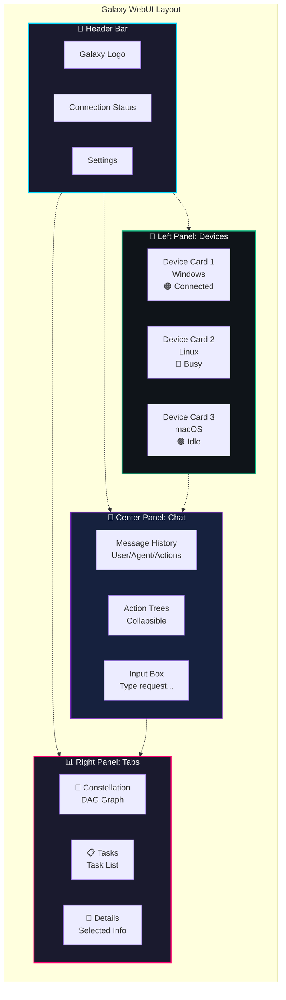
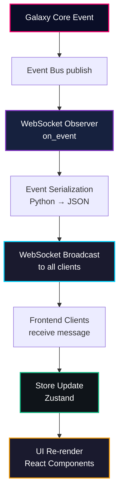

# Galaxy WebUI

The **Galaxy WebUI** is a modern, interactive web interface for the UFO³ Galaxy Framework. It provides real-time visualization of task constellations, device status, agent interactions, and execution flow through an elegant, space-themed interface.

<div align="center">
  
  <p><em>Galaxy WebUI - Interactive constellation visualization and real-time monitoring</em></p>
</div>

---

## 🌟 Overview

The Galaxy WebUI transforms the command-line Galaxy experience into a rich, visual interface where you can:

- **🗣️ Chat with Galaxy**: Submit natural language requests through an intuitive chat interface
- **📊 Visualize Constellations**: Watch task constellations form and execute as interactive DAG graphs
- **🎯 Monitor Execution**: Track task status, device assignments, and real-time progress
- **🔄 See Agent Reasoning**: Observe agent thoughts, plans, and decision-making processes
- **🖥️ Manage Devices**: View and monitor all connected devices and their capabilities
- **📡 Stream Events**: Follow the event log to understand system behavior in real-time

---

## 🚀 Quick Start

### Starting the WebUI

```powershell
# Launch Galaxy with WebUI
python -m galaxy --webui
```

The WebUI will automatically:
1. Start the backend server on `http://localhost:8000` (or next available port)
2. Open your default browser to the interface
3. Establish WebSocket connection for real-time updates

!!!tip "Custom Session Name"
    ```powershell
    python -m galaxy --webui --session-name "data_pipeline_demo"
    ```

### First Request

1. **Enter your request** in the chat input at the bottom
2. **Press Enter** or click Send
3. **Watch the constellation form** in the DAG visualization panel
4. **Monitor task execution** as devices process their assigned tasks
5. **See results** displayed in the chat window

---

## 🏗️ Architecture

### System Architecture

The Galaxy WebUI follows a modern client-server architecture with real-time event streaming:

```mermaid
graph TB
    subgraph "Galaxy WebUI Stack"
        subgraph Frontend["Frontend (React + TypeScript + Vite)"]
            F1[Chat Interface]
            F2[DAG Visualization<br/>ReactFlow]
            F3[Device Management]
            F4[Event Log]
            F5[State Management<br/>Zustand]
        end
        
        subgraph Backend["Backend (FastAPI + WebSocket)"]
            B1[WebSocket Server]
            B2[Event Observer]
            B3[Request Handler]
            B4[Static File Serving]
        end
        
        subgraph Core["Galaxy Core"]
            C1[ConstellationAgent]
            C2[Task Orchestrator]
            C3[Device Manager]
            C4[Event System]
        end
        
        Frontend <-->|WebSocket| Backend
        Backend <-->|Event Bus| Core
    end
    
    style Frontend fill:#1a1a2e,stroke:#00d4ff,stroke-width:2px,color:#fff
    style Backend fill:#16213e,stroke:#7b2cbf,stroke-width:2px,color:#fff
    style Core fill:#0a0e27,stroke:#ff006e,stroke-width:2px,color:#fff
```



### Component Overview

#### Backend Components

| Component | File | Responsibility |
|-----------|------|----------------|
| **FastAPI Server** | `galaxy/webui/server.py` | HTTP server, WebSocket endpoint, static file serving |
| **WebSocket Observer** | `galaxy/webui/websocket_observer.py` | Subscribes to Galaxy events, broadcasts to clients |
| **Event Serializer** | Built into observer | Converts Python objects to JSON for WebSocket |

#### Frontend Components

| Component | Location | Purpose |
|-----------|----------|---------|
| **App** | `src/App.tsx` | Main layout, connection status, theme management |
| **ChatWindow** | `src/components/chat/ChatWindow.tsx` | Message display and input interface |
| **DagPreview** | `src/components/constellation/DagPreview.tsx` | Interactive constellation graph visualization |
| **DeviceGrid** | `src/components/devices/DeviceGrid.tsx` | Device status cards and monitoring |
| **RightPanel** | `src/components/layout/RightPanel.tsx` | Tabbed panel for constellation, tasks, details |
| **EventLog** | `src/components/EventLog.tsx` | Real-time event stream display |
| **GalaxyStore** | `src/store/galaxyStore.ts` | Zustand state management |
| **WebSocket Client** | `src/services/websocket.ts` | WebSocket connection with auto-reconnect |

---

## 🔌 Communication Protocol

### WebSocket Connection

The WebUI maintains a persistent WebSocket connection to the Galaxy backend for bidirectional real-time communication.

**Connection URL:** `ws://localhost:8000/ws`

### Message Types

#### Client → Server

**1. User Request**
```json
{
  "type": "request",
  "text": "Extract sales data and create an Excel report",
  "timestamp": 1234567890
}
```

**2. Session Reset**
```json
{
  "type": "reset",
  "timestamp": 1234567890
}
```

**3. Ping (Keepalive)**
```json
{
  "type": "ping",
  "timestamp": 1234567890
}
```

#### Server → Client

**1. Welcome Message**
```json
{
  "type": "welcome",
  "message": "Connected to Galaxy Web UI",
  "timestamp": 1234567890
}
```

**2. Device Snapshot (on connect)**
```json
{
  "event_type": "device_snapshot",
  "source_id": "webui.server",
  "timestamp": 1234567890,
  "data": {
    "event_name": "device_snapshot",
    "device_count": 2
  },
  "all_devices": {
    "windows_device_1": {
      "device_id": "windows_device_1",
      "status": "connected",
      "os": "windows",
      "capabilities": ["desktop_automation", "excel"],
      "metadata": {},
      "last_heartbeat": "2025-11-09T10:30:00",
      "current_task_id": null
    }
  }
}
```

**3. Galaxy Events**

All Galaxy events are forwarded to the WebUI in real-time:

```json
{
  "event_type": "agent_response",
  "source_id": "ConstellationAgent",
  "timestamp": 1234567890,
  "agent_name": "ConstellationAgent",
  "agent_type": "constellation",
  "output_type": "response",
  "output_data": {
    "thought": "I need to decompose this task...",
    "plan": ["Analyze requirements", "Create DAG", "Assign devices"],
    "response": "Creating constellation with 3 tasks"
  }
}
```

```json
{
  "event_type": "constellation_created",
  "source_id": "TaskConstellation",
  "timestamp": 1234567890,
  "constellation_id": "constellation_123",
  "constellation_state": "planning",
  "data": {
    "constellation": {
      "constellation_id": "constellation_123",
      "name": "Sales Report Pipeline",
      "state": "planning",
      "tasks": {
        "task_1": {
          "task_id": "task_1",
          "name": "Extract Data",
          "status": "pending",
          "target_device_id": "linux_device_1"
        }
      },
      "dependencies": {
        "task_2": ["task_1"]
      }
    }
  }
}
```

```json
{
  "event_type": "task_status_changed",
  "source_id": "TaskOrchestrator",
  "timestamp": 1234567890,
  "task_id": "task_1",
  "status": "running",
  "result": null,
  "error": null
}
```

```json
{
  "event_type": "device_status_changed",
  "source_id": "DeviceManager",
  "timestamp": 1234567890,
  "device_id": "windows_device_1",
  "device_status": "busy",
  "device_info": {
    "current_task_id": "task_2"
  }
}
```

---

## 🎨 User Interface

### Main Layout

The WebUI uses a three-panel layout:



### Key Features

#### 🗣️ Chat Interface

**Location:** Center panel

**Features:**
- Natural language input for requests
- Message history with agent responses
- Collapsible action trees showing execution details
- Thought, plan, and response display
- Status indicators (pending, running, completed, failed)
- Markdown rendering for rich text
- Code block syntax highlighting

**Message Types:**
- **User Messages**: Your requests to Galaxy
- **Agent Responses**: ConstellationAgent thoughts, plans, and responses
- **Action Messages**: Individual constellation operations (add_task, build_constellation, etc.)
- **System Messages**: Status updates and notifications

#### 📊 DAG Visualization

**Location:** Right panel → Constellation tab

**Features:**
- Interactive node-and-edge graph
- Real-time task status updates
- Color-coded status indicators:
  - 🔵 Pending: Gray
  - 🟡 Running: Blue (animated)
  - 🟢 Completed: Green
  - 🔴 Failed: Red
  - ⚫ Skipped: Orange
- Dependency edges showing task relationships
- Pan and zoom controls
- Automatic layout optimization
- Node click to view task details

**Interaction:**
- **Click node**: Select task and show details
- **Pan**: Click and drag background
- **Zoom**: Mouse wheel or pinch gesture
- **Fit view**: Click fit-to-screen button

#### 🖥️ Device Management

**Location:** Left sidebar

**Features:**
- Device status cards with real-time updates
- Color-coded status indicators:
  - 🟢 Connected/Idle: Green
  - 🔵 Busy: Blue
  - 🟡 Connecting: Yellow
  - 🔴 Disconnected/Failed: Red
- Capability badges
- Current task assignment
- Last heartbeat timestamp
- Connection metrics
- Click to view device details

**Device Information:**
- OS type and version
- Server URL
- Installed applications
- Performance tier
- Custom metadata

#### 📋 Task Details

**Location:** Right panel → Tasks tab / Details tab

**Features:**
- Task name and description
- Current status with icon
- Assigned device
- Dependencies and dependents
- Input and output data
- Execution results
- Error messages (if failed)
- Execution timeline
- Retry information

#### 📡 Event Log

**Location:** Right panel (optional view)

**Features:**
- Real-time event stream
- Event type filtering
- Timestamp display
- JSON payload viewer
- Search and filter
- Auto-scroll option
- Export to JSON

---

## 🎨 Theme and Styling

### Design System

The Galaxy WebUI uses a **space-themed design** with a dark color palette and vibrant accents.

#### Color Palette

```typescript
// Primary Colors
galaxy-dark:   #0a0e27  // Deep space background
galaxy-blue:   #00d4ff  // Cyan accent (primary actions)
galaxy-purple: #7b2cbf  // Purple accent (secondary)
galaxy-pink:   #ff006e  // Pink accent (tertiary)

// Status Colors
emerald:  #10b981  // Success/Completed
cyan:     #06b6d4  // Running/Active
amber:    #f59e0b  // Warning/Pending
rose:     #f43f5e  // Error/Failed
slate:    #64748b  // Neutral/Disabled
```

#### Visual Effects

- **Starfield Background**: Animated particle system with depth layers
- **Glassmorphism**: Frosted glass panels with backdrop blur
- **Glow Effects**: Neon-style glows on interactive elements
- **Smooth Animations**: Framer Motion for transitions
- **Gradient Accents**: Multi-color gradients on headers and buttons

#### Accessibility

- **High Contrast Mode**: Toggle for improved readability
- **Keyboard Navigation**: Full keyboard support
- **Screen Reader**: ARIA labels and semantic HTML
- **Focus Indicators**: Clear focus rings on interactive elements

---

## 🔧 Configuration

### Server Configuration

The WebUI server is configured through command-line arguments:

```powershell
python -m galaxy --webui [OPTIONS]
```

**Options:**

| Flag | Description | Default |
|------|-------------|---------|
| `--webui` | Enable WebUI mode | `False` |
| `--session-name` | Session display name | `"Galaxy Session"` |
| `--log-level` | Logging level | `INFO` |
| `--port` | Server port (if implemented) | `8000` |

### Frontend Configuration

**Development Mode:**

```bash
cd galaxy/webui/frontend
npm run dev
```

Access at: `http://localhost:5173` (Vite dev server with HMR)

**Environment Variables:**

```bash
# .env.development
VITE_WS_URL=ws://localhost:8000/ws
VITE_API_URL=http://localhost:8000
```

**Build Configuration:**

```bash
cd galaxy/webui/frontend
npm run build
```

Builds production-ready frontend to `galaxy/webui/frontend/dist/`

---

## 🔍 Event Handling

### Event Flow



### Event Types

The WebUI subscribes to all Galaxy event types:

| Event Type | Source | Description |
|------------|--------|-------------|
| `agent_request` | ConstellationAgent | User request received |
| `agent_response` | ConstellationAgent | Agent thought/plan/response |
| `constellation_created` | TaskConstellation | New constellation formed |
| `constellation_updated` | TaskConstellation | Constellation modified |
| `constellation_completed` | TaskConstellation | All tasks finished |
| `task_created` | TaskOrchestrator | New task added |
| `task_assigned` | TaskOrchestrator | Task assigned to device |
| `task_started` | TaskOrchestrator | Task execution started |
| `task_status_changed` | TaskOrchestrator | Task status updated |
| `task_completed` | TaskOrchestrator | Task finished successfully |
| `task_failed` | TaskOrchestrator | Task encountered error |
| `device_connected` | DeviceManager | Device came online |
| `device_disconnected` | DeviceManager | Device went offline |
| `device_status_changed` | DeviceManager | Device status updated |
| `device_heartbeat` | DeviceManager | Device health check |

### State Management

The frontend uses **Zustand** for centralized state management:

```typescript
// Store Structure
interface GalaxyStore {
  // Connection
  connectionStatus: ConnectionStatus;
  connected: boolean;
  
  // Session
  session: {
    id: string | null;
    displayName: string;
    startedAt: number | null;
  };
  
  // Data
  messages: Message[];
  constellations: Record<string, ConstellationSummary>;
  tasks: Record<string, Task>;
  devices: Record<string, Device>;
  notifications: NotificationItem[];
  
  // UI State
  ui: {
    activeConstellationId: string | null;
    activeTaskId: string | null;
    activeDeviceId: string | null;
    rightPanelTab: 'constellation' | 'tasks' | 'details';
    showDeviceDrawer: boolean;
  };
}
```

---

## 📱 Responsive Design

The WebUI is designed to work on various screen sizes:

### Desktop (1920px+)
- Three-panel layout with full sidebar
- Large DAG visualization
- Expanded device cards

### Laptop (1280px - 1919px)
- Standard three-panel layout
- Medium DAG visualization
- Compact device cards

### Tablet (768px - 1279px)
- Collapsible sidebar
- Simplified DAG view
- Stacked layout option

### Mobile (< 768px)
- Single-panel navigation
- Tab-based interface
- Touch-optimized controls

!!!warning "Recommended Resolution"
    For the best experience, use a desktop or laptop with at least **1280px width**. The DAG visualization requires adequate screen space for clear readability.

---

## 🐛 Troubleshooting

### Connection Issues

**Problem:** WebSocket connection fails

**Solutions:**

1. **Verify backend is running:**
   ```powershell
   # Check health endpoint
   curl http://localhost:8000/health
   ```

2. **Check firewall settings:**
   - Allow incoming connections on port 8000
   - Check corporate firewall/proxy settings

3. **Verify WebSocket URL:**
   - Browser console should show: `WebSocket connection established`
   - Check for CORS errors in console

4. **Try different port:**
   ```powershell
   python -m galaxy --webui --port 8080
   ```

### Frontend Not Loading

**Problem:** Blank page or "Server is running" placeholder

**Solutions:**

1. **Build the frontend:**
   ```bash
   cd galaxy/webui/frontend
   npm install
   npm run build
   ```

2. **Check build output:**
   - Verify `galaxy/webui/frontend/dist/` exists
   - Check for TypeScript errors: `npm run build`

3. **Clear browser cache:**
   - Hard refresh: `Ctrl+Shift+R` (Windows) or `Cmd+Shift+R` (Mac)
   - Clear site data in DevTools

### Events Not Appearing

**Problem:** No events shown in UI, DAG not updating

**Solutions:**

1. **Check event system:**
   - Look for "WebSocket observer registered" in backend logs
   - Verify connection count: `curl http://localhost:8000/health`

2. **Check browser console:**
   - Look for WebSocket message logs
   - Check for JavaScript errors

3. **Enable debug mode:**
   ```powershell
   python -m galaxy --webui --log-level DEBUG
   ```

### Performance Issues

**Problem:** UI slow or unresponsive

**Solutions:**

1. **Limit event log size:**
   - Event log keeps last 200 events
   - Messages limited to 500

2. **Reduce DAG complexity:**
   - Large constellations (>50 tasks) may be slow
   - Consider viewport culling for very large graphs

3. **Check browser performance:**
   - Close unnecessary tabs
   - Use Chrome/Edge for best performance
   - Disable browser extensions

---

## 🧪 Development

### Prerequisites

- **Node.js** >= 18
- **npm** >= 9
- **Python** >= 3.10
- **Galaxy** installed and configured

### Development Setup

```bash
# 1. Install frontend dependencies
cd galaxy/webui/frontend
npm install

# 2. Start development server
npm run dev

# 3. In another terminal, start Galaxy backend
cd ../../..
python -m galaxy --webui
```

**Development URL:** `http://localhost:5173`

### Project Structure

```
galaxy/webui/
├── server.py                    # FastAPI backend
├── websocket_observer.py        # Event broadcaster
├── __init__.py
└── frontend/
    ├── src/
    │   ├── main.tsx            # Entry point
    │   ├── App.tsx             # Main layout
    │   ├── components/         # React components
    │   │   ├── chat/          # Chat interface
    │   │   ├── constellation/ # DAG visualization
    │   │   ├── devices/       # Device management
    │   │   ├── layout/        # Layout components
    │   │   ├── session/       # Session management
    │   │   └── tasks/         # Task details
    │   ├── services/          # WebSocket client
    │   └── store/             # Zustand store
    ├── public/                 # Static assets
    ├── dist/                   # Build output
    ├── package.json           # Dependencies
    ├── vite.config.ts         # Vite configuration
    ├── tailwind.config.js     # Tailwind CSS
    └── tsconfig.json          # TypeScript config
```

### Building for Production

```bash
cd galaxy/webui/frontend
npm run build
```

Output: `galaxy/webui/frontend/dist/`

### Code Quality

```bash
# Lint
npm run lint

# Type check
npm run type-check

# Format
npm run format
```

---

## 🚀 Advanced Usage

### Custom Event Handlers

You can extend the WebUI with custom event handlers:

```typescript
// src/services/customHandlers.ts
import { GalaxyEvent } from './websocket';

export function handleCustomEvent(event: GalaxyEvent) {
  if (event.event_type === 'custom_event') {
    // Your custom logic
    console.log('Custom event:', event);
  }
}
```

### Custom Components

Add custom visualization components:

```tsx
// src/components/custom/MyVisualization.tsx
import React from 'react';
import { useGalaxyStore } from '../../store/galaxyStore';

export const MyVisualization: React.FC = () => {
  const constellation = useGalaxyStore(s => 
    s.constellations[s.ui.activeConstellationId || '']
  );
  
  return (
    <div className="custom-viz">
      {/* Your custom visualization */}
    </div>
  );
};
```

### Theming

Create custom themes by extending Tailwind configuration:

```javascript
// tailwind.config.js
module.exports = {
  theme: {
    extend: {
      colors: {
        'custom-primary': '#your-color',
        'custom-secondary': '#your-color',
      },
    },
  },
};
```

---

## 📊 Monitoring and Analytics

### Health Check

**Endpoint:** `GET /health`

```json
{
  "status": "healthy",
  "connections": 3,
  "events_sent": 1247
}
```

### Metrics

The WebUI tracks:
- Active WebSocket connections
- Total events broadcasted
- Device online/offline status
- Task execution statistics
- Session duration

### Logging

**Backend Logs:**
```
INFO - WebSocket connection established from ('127.0.0.1', 54321)
INFO - Broadcasting event #42: agent_response to 2 clients
INFO - WebSocket client disconnected. Total connections: 1
```

**Frontend Console:**
```javascript
🌌 Connected to Galaxy WebSocket
📨 Raw WebSocket message received
📦 Parsed event data: {event_type: 'constellation_created', ...}
```

---

## 🔒 Security Considerations

### Production Deployment

When deploying to production:

1. **Use HTTPS/WSS:**
   ```python
   # Use secure WebSocket
   wss://your-domain.com/ws
   ```

2. **Configure CORS:**
   ```python
   # server.py
   app.add_middleware(
       CORSMiddleware,
       allow_origins=["https://your-domain.com"],  # Specific origins
       allow_credentials=True,
       allow_methods=["GET", "POST"],
       allow_headers=["*"],
   )
   ```

3. **Add Authentication:**
   - Implement JWT tokens
   - Validate WebSocket connections
   - Secure API endpoints

4. **Rate Limiting:**
   - Limit request frequency
   - Throttle WebSocket messages
   - Prevent DoS attacks

---

## 📚 Additional Resources

### Documentation
- [FastAPI WebSocket Documentation](https://fastapi.tiangolo.com/advanced/websockets/)
- [React Documentation](https://react.dev/)
- [ReactFlow Documentation](https://reactflow.dev/)
- [Zustand Documentation](https://github.com/pmndrs/zustand)
- [Tailwind CSS Documentation](https://tailwindcss.com/)
- [Vite Documentation](https://vitejs.dev/)

### Galaxy Framework
- [Galaxy Overview](overview.md)
- [Constellation Agent](constellation_agent/overview.md)
- [Task Orchestrator](constellation_orchestrator/overview.md)
- [Device Manager](client/device_manager.md)

### Community
- [GitHub Issues](https://github.com/microsoft/UFO/issues)
- [GitHub Discussions](https://github.com/microsoft/UFO/discussions)
- [Email Support](mailto:ufo-agent@microsoft.com)

---

## 🎯 Next Steps

Now that you understand the Galaxy WebUI:

1. **[Quick Start Guide](../getting_started/quick_start_galaxy.md)** - Set up your first Galaxy session
2. **[Constellation Agent](constellation_agent/overview.md)** - Learn about task decomposition
3. **[Task Orchestrator](constellation_orchestrator/overview.md)** - Understand task execution
4. **[Device Manager](client/device_manager.md)** - Configure and monitor devices

Happy orchestrating with Galaxy WebUI! 🌌✨
