# Galaxy WebUI

The **Galaxy WebUI** is a modern, interactive web interface for the UFO³ Galaxy Framework. It provides real-time visualization of task constellations, device status, agent interactions, and execution flow through an elegant, space-themed interface.

<div align="center">
  
  <p><em>Galaxy WebUI - Interactive constellation visualization and real-time monitoring</em></p>
</div>

---

## 🌟 Overview

The Galaxy WebUI transforms the command-line Galaxy experience into a rich, visual interface where you can:

- **🗣️ Chat with Galaxy**: Submit natural language requests through an intuitive chat interface
- **📊 Visualize Constellations**: Watch task constellations form and execute as interactive DAG graphs
- **🎯 Monitor Execution**: Track task status, device assignments, and real-time progress
- **🔄 See Agent Reasoning**: Observe agent thoughts, plans, and decision-making processes
- **🖥️ Manage Devices**: View, monitor, and **add new devices** through the UI
- **➕ Add Device Agents**: Register new device agents dynamically without restarting
- **📡 Stream Events**: Follow the event log to understand system behavior in real-time

---

## 🚀 Quick Start

### Starting the WebUI

```powershell
# Launch Galaxy with WebUI
python -m galaxy --webui
```

The WebUI will automatically:
1. Start the backend server on `http://localhost:8000` (or next available port)
2. Open your default browser to the interface
3. Establish WebSocket connection for real-time updates

!!!tip "Custom Session Name"
    ```powershell
    python -m galaxy --webui --session-name "data_pipeline_demo"
    ```

### First Request

1. **Enter your request** in the chat input at the bottom
2. **Press Enter** or click Send
3. **Watch the constellation form** in the DAG visualization panel
4. **Monitor task execution** as devices process their assigned tasks
5. **See results** displayed in the chat window

---

## 🏗️ Architecture

### Design Principles

The Galaxy WebUI backend follows **software engineering best practices**:

**Separation of Concerns:**
- **Models Layer**: Pydantic models ensure type safety and validation
- **Services Layer**: Business logic isolated from presentation
- **Handlers Layer**: WebSocket message processing logic
- **Routers Layer**: HTTP endpoint definitions

**Dependency Injection:**
- `AppState` class provides centralized state management
- `get_app_state()` dependency injection function
- Replaces global variables with type-safe properties

**Type Safety:**
- Pydantic models for all API requests/responses
- Enums for constants (`WebSocketMessageType`, `RequestStatus`)
- `TYPE_CHECKING` pattern for forward references
- Comprehensive type annotations throughout

**Modularity:**
- Clear module boundaries
- Easy to test individual components
- Simple to extend with new features
- Better code organization and maintainability

### System Architecture

The Galaxy WebUI follows a modern client-server architecture with real-time event streaming:


### Component Overview

#### Backend Components

The Galaxy WebUI backend follows a **modular architecture** with clear separation of concerns:

| Component | File/Directory | Responsibility |
|-----------|----------------|----------------|
| **FastAPI Server** | `galaxy/webui/server.py` | Application initialization, middleware, router registration, lifespan management |
| **Models** | `galaxy/webui/models/` | Pydantic models for requests/responses, enums for type safety |
| **Services** | `galaxy/webui/services/` | Business logic layer (config, device, galaxy operations) |
| **Handlers** | `galaxy/webui/handlers/` | WebSocket message processing and routing |
| **Routers** | `galaxy/webui/routers/` | FastAPI endpoint definitions organized by feature |
| **Dependencies** | `galaxy/webui/dependencies.py` | Dependency injection for state management (AppState) |
| **WebSocket Observer** | `galaxy/webui/websocket_observer.py` | Event subscription and broadcasting to WebSocket clients |
| **Event Serializer** | Built into observer | Converts Python objects to JSON-compatible format |

**Detailed Backend Structure:**

```
galaxy/webui/
├── server.py                 # Main FastAPI application
├── dependencies.py           # AppState and dependency injection
├── websocket_observer.py     # EventSerializer + WebSocketObserver
├── models/
│   ├── __init__.py          # Export all models
│   ├── enums.py             # WebSocketMessageType, RequestStatus enums
│   ├── requests.py          # Pydantic request models
│   └── responses.py         # Pydantic response models
├── services/
│   ├── __init__.py
│   ├── config_service.py    # Configuration management
│   ├── device_service.py    # Device operations and snapshots
│   └── galaxy_service.py    # Galaxy client interactions
├── handlers/
│   ├── __init__.py
│   └── websocket_handlers.py # WebSocket message handler
├── routers/
│   ├── __init__.py
│   ├── health.py            # Health check endpoint
│   ├── devices.py           # Device management endpoints
│   └── websocket.py         # WebSocket endpoint
└── templates/
    └── index.html           # Fallback HTML page
```

**Architecture Benefits:**

✅ **Maintainability**: Each module has a single, clear responsibility  
✅ **Testability**: Services and handlers can be unit tested independently  
✅ **Type Safety**: Pydantic models validate all inputs/outputs  
✅ **Extensibility**: Easy to add new endpoints, message types, or services  
✅ **Readability**: Clear module boundaries improve code comprehension  
✅ **Reusability**: Services can be shared across multiple endpoints  

#### Frontend Components

| Component | Location | Purpose |
|-----------|----------|---------|
| **App** | `src/App.tsx` | Main layout, connection status, theme management |
| **ChatWindow** | `src/components/chat/ChatWindow.tsx` | Message display and input interface |
| **DagPreview** | `src/components/constellation/DagPreview.tsx` | Interactive constellation graph visualization |
| **DevicePanel** | `src/components/devices/DevicePanel.tsx` | Device status cards, search, and add button |
| **DeviceCard** | `src/components/devices/DeviceCard.tsx` | Individual device status display |
| **AddDeviceModal** | `src/components/devices/AddDeviceModal.tsx` | Modal dialog for adding new devices |
| **RightPanel** | `src/components/layout/RightPanel.tsx` | Tabbed panel for constellation, tasks, details |
| **EventLog** | `src/components/EventLog.tsx` | Real-time event stream display |
| **GalaxyStore** | `src/store/galaxyStore.ts` | Zustand state management |
| **WebSocket Client** | `src/services/websocket.ts` | WebSocket connection with auto-reconnect |

---

## 🔌 Communication Protocol

### HTTP API Endpoints

#### Health Check

```http
GET /health
```

**Response:**
```json
{
  "status": "healthy",
  "connections": 3,
  "events_sent": 1247
}
```

#### Add Device

```http
POST /api/devices
Content-Type: application/json
```

**Request Body:**
```json
{
  "device_id": "windows-laptop-1",
  "server_url": "ws://192.168.1.100:8080",
  "os": "Windows",
  "capabilities": ["excel", "outlook", "browser"],
  "metadata": {
    "region": "us-west-2",
    "owner": "data-team"
  },
  "auto_connect": true,
  "max_retries": 5
}
```

**Success Response (200):**
```json
{
  "status": "success",
  "message": "Device 'windows-laptop-1' added successfully",
  "device": {
    "device_id": "windows-laptop-1",
    "server_url": "ws://192.168.1.100:8080",
    "os": "Windows",
    "capabilities": ["excel", "outlook", "browser"],
    "auto_connect": true,
    "max_retries": 5,
    "metadata": {
      "region": "us-west-2",
      "owner": "data-team"
    }
  }
}
```

**Error Responses:**

- **404 Not Found**: `devices.yaml` configuration file not found
  ```json
  {
    "detail": "devices.yaml not found"
  }
  ```

- **409 Conflict**: Device ID already exists
  ```json
  {
    "detail": "Device ID 'windows-laptop-1' already exists"
  }
  ```

- **500 Internal Server Error**: Failed to add device
  ```json
  {
    "detail": "Failed to add device: <error message>"
  }
  ```

### WebSocket Connection

The WebUI maintains a persistent WebSocket connection to the Galaxy backend for bidirectional real-time communication.

**Connection URL:** `ws://localhost:8000/ws`

### Message Types

#### Client → Server

**1. User Request**
```json
{
  "type": "request",
  "text": "Extract sales data and create an Excel report",
  "timestamp": 1234567890
}
```

**2. Session Reset**
```json
{
  "type": "reset",
  "timestamp": 1234567890
}
```

**3. Ping (Keepalive)**
```json
{
  "type": "ping",
  "timestamp": 1234567890
}
```

#### Server → Client

**1. Welcome Message**
```json
{
  "type": "welcome",
  "message": "Connected to Galaxy Web UI",
  "timestamp": 1234567890
}
```

**2. Device Snapshot (on connect)**
```json
{
  "event_type": "device_snapshot",
  "source_id": "webui.server",
  "timestamp": 1234567890,
  "data": {
    "event_name": "device_snapshot",
    "device_count": 2
  },
  "all_devices": {
    "windows_device_1": {
      "device_id": "windows_device_1",
      "status": "connected",
      "os": "windows",
      "capabilities": ["desktop_automation", "excel"],
      "metadata": {},
      "last_heartbeat": "2025-11-09T10:30:00",
      "current_task_id": null
    }
  }
}
```

**3. Galaxy Events**

All Galaxy events are forwarded to the WebUI in real-time:

```json
{
  "event_type": "agent_response",
  "source_id": "ConstellationAgent",
  "timestamp": 1234567890,
  "agent_name": "ConstellationAgent",
  "agent_type": "constellation",
  "output_type": "response",
  "output_data": {
    "thought": "I need to decompose this task...",
    "plan": ["Analyze requirements", "Create DAG", "Assign devices"],
    "response": "Creating constellation with 3 tasks"
  }
}
```

```json
{
  "event_type": "constellation_created",
  "source_id": "TaskConstellation",
  "timestamp": 1234567890,
  "constellation_id": "constellation_123",
  "constellation_state": "planning",
  "data": {
    "constellation": {
      "constellation_id": "constellation_123",
      "name": "Sales Report Pipeline",
      "state": "planning",
      "tasks": {
        "task_1": {
          "task_id": "task_1",
          "name": "Extract Data",
          "status": "pending",
          "target_device_id": "linux_device_1"
        }
      },
      "dependencies": {
        "task_2": ["task_1"]
      }
    }
  }
}
```

```json
{
  "event_type": "task_status_changed",
  "source_id": "TaskOrchestrator",
  "timestamp": 1234567890,
  "task_id": "task_1",
  "status": "running",
  "result": null,
  "error": null
}
```

```json
{
  "event_type": "device_status_changed",
  "source_id": "DeviceManager",
  "timestamp": 1234567890,
  "device_id": "windows_device_1",
  "device_status": "busy",
  "device_info": {
    "current_task_id": "task_2"
  }
}
```

---

## 🎨 User Interface

### Main Layout

The WebUI uses a three-panel layout:

```mermaid
graph LR
    subgraph UI["Galaxy WebUI Layout"]
        subgraph Header["🌌 Header Bar"]
            H1[Galaxy Logo]
            H2[Connection Status]
            H3[Settings]
        end
        
        subgraph Left["📱 Left Panel: Devices"]
            L1[Device Card 1<br/>Windows<br/>🟢 Connected]
            L2[Device Card 2<br/>Linux<br/>🔵 Busy]
            L3[Device Card 3<br/>macOS<br/>🟢 Idle]
        end
        
        subgraph Center["💬 Center Panel: Chat"]
            C1[Message History<br/>User/Agent/Actions]
            C2[Action Trees<br/>Collapsible]
            C3[Input Box<br/>Type request...]
        end
        
        subgraph Right["📊 Right Panel: Tabs"]
            R1[🌟 Constellation<br/>DAG Graph]
            R2[📋 Tasks<br/>Task List]
            R3[📝 Details<br/>Selected Info]
        end
        
        Header -.-> Left
        Header -.-> Center
        Header -.-> Right
        Left -.-> Center
        Center -.-> Right
    end
    
    style Header fill:#1a1a2e,stroke:#00d4ff,stroke-width:2px,color:#fff
    style Left fill:#0f1419,stroke:#10b981,stroke-width:2px,color:#fff
    style Center fill:#16213e,stroke:#7b2cbf,stroke-width:2px,color:#fff
    style Right fill:#1a1a2e,stroke:#ff006e,stroke-width:2px,color:#fff
```



### Key Features

#### 🗣️ Chat Interface

**Location:** Center panel

**Features:**
- Natural language input for requests
- Message history with agent responses
- Collapsible action trees showing execution details
- Thought, plan, and response display
- Status indicators (pending, running, completed, failed)
- Markdown rendering for rich text
- Code block syntax highlighting

**Message Types:**
- **User Messages**: Your requests to Galaxy
- **Agent Responses**: ConstellationAgent thoughts, plans, and responses
- **Action Messages**: Individual constellation operations (add_task, build_constellation, etc.)
- **System Messages**: Status updates and notifications

#### 📊 DAG Visualization

**Location:** Right panel → Constellation tab

**Features:**
- Interactive node-and-edge graph
- Real-time task status updates
- Color-coded status indicators:
  - 🔵 Pending: Gray
  - 🟡 Running: Blue (animated)
  - 🟢 Completed: Green
  - 🔴 Failed: Red
  - ⚫ Skipped: Orange
- Dependency edges showing task relationships
- Pan and zoom controls
- Automatic layout optimization
- Node click to view task details

**Interaction:**
- **Click node**: Select task and show details
- **Pan**: Click and drag background
- **Zoom**: Mouse wheel or pinch gesture
- **Fit view**: Click fit-to-screen button

#### 🖥️ Device Management

**Location:** Left sidebar

**Features:**
- Device status cards with real-time updates
- Color-coded status indicators:
  - 🟢 Connected/Idle: Green
  - 🔵 Busy: Blue
  - 🟡 Connecting: Yellow
  - 🔴 Disconnected/Failed: Red
- Capability badges
- Current task assignment
- Last heartbeat timestamp
- Connection metrics
- Click to view device details
- **➕ Add Device Button**: Manually add new devices through UI

**Device Information:**
- OS type and version
- Server URL
- Installed applications
- Performance tier
- Custom metadata

**Adding a New Device:**

Click the **"+"** button in the Device Panel header to open the Add Device Modal:

<div align="center">
  
  <p><em>Add Device Modal - Register new device agents through the UI</em></p>
</div>

1. **Basic Information:**
   - **Device ID**: Unique identifier for the device (required)
   - **Server URL**: WebSocket endpoint URL (must start with `ws://` or `wss://`)
   - **Operating System**: Select from Windows, Linux, macOS, or enter custom OS

2. **Capabilities:**
   - Add capabilities one by one (e.g., `excel`, `outlook`, `browser`)
   - Remove capabilities by clicking the ✕ icon
   - At least one capability is required

3. **Advanced Options:**
   - **Auto-connect**: Automatically connect to device after registration (default: enabled)
   - **Max Retries**: Maximum connection retry attempts (default: 5)

4. **Metadata (Optional):**
   - Add custom key-value pairs for additional device information
   - Examples: `region: us-east-1`, `tier: premium`, `owner: team-a`

**API Endpoint:**

```http
POST /api/devices
Content-Type: application/json

{
  "device_id": "my-device-1",
  "server_url": "ws://192.168.1.100:8080",
  "os": "Windows",
  "capabilities": ["excel", "outlook", "powerpoint"],
  "metadata": {
    "region": "us-east-1",
    "tier": "standard"
  },
  "auto_connect": true,
  "max_retries": 5
}
```

**Response:**

```json
{
  "status": "success",
  "message": "Device 'my-device-1' added successfully",
  "device": {
    "device_id": "my-device-1",
    "server_url": "ws://192.168.1.100:8080",
    "os": "Windows",
    "capabilities": ["excel", "outlook", "powerpoint"],
    "auto_connect": true,
    "max_retries": 5,
    "metadata": {
      "region": "us-east-1",
      "tier": "standard"
    }
  }
}
```

**Device Registration Process:**

When a device is added through the UI:

1. **Validation**: Form data is validated (required fields, URL format, duplicate device_id)
2. **Configuration**: Device is saved to `config/galaxy/devices.yaml`
3. **Registration**: Device is registered with the Galaxy Device Manager
4. **Connection**: If `auto_connect` is enabled, connection is initiated automatically
5. **Event Broadcast**: Device status updates are broadcast to all WebSocket clients
6. **UI Update**: Device card appears in the Device Panel with real-time status

#### 📋 Task Details

**Location:** Right panel → Tasks tab / Details tab

**Features:**
- Task name and description
- Current status with icon
- Assigned device
- Dependencies and dependents
- Input and output data
- Execution results
- Error messages (if failed)
- Execution timeline
- Retry information

#### 📡 Event Log

**Location:** Right panel (optional view)

**Features:**
- Real-time event stream
- Event type filtering
- Timestamp display
- JSON payload viewer
- Search and filter
- Auto-scroll option
- Export to JSON

---

## 🎨 Theme and Styling

### Design System

The Galaxy WebUI uses a **space-themed design** with a dark color palette and vibrant accents.

#### Color Palette

```typescript
// Primary Colors
galaxy-dark:   #0a0e27  // Deep space background
galaxy-blue:   #00d4ff  // Cyan accent (primary actions)
galaxy-purple: #7b2cbf  // Purple accent (secondary)
galaxy-pink:   #ff006e  // Pink accent (tertiary)

// Status Colors
emerald:  #10b981  // Success/Completed
cyan:     #06b6d4  // Running/Active
amber:    #f59e0b  // Warning/Pending
rose:     #f43f5e  // Error/Failed
slate:    #64748b  // Neutral/Disabled
```

#### Visual Effects

- **Starfield Background**: Animated particle system with depth layers
- **Glassmorphism**: Frosted glass panels with backdrop blur
- **Glow Effects**: Neon-style glows on interactive elements
- **Smooth Animations**: Framer Motion for transitions
- **Gradient Accents**: Multi-color gradients on headers and buttons

#### Accessibility

- **High Contrast Mode**: Toggle for improved readability
- **Keyboard Navigation**: Full keyboard support
- **Screen Reader**: ARIA labels and semantic HTML
- **Focus Indicators**: Clear focus rings on interactive elements

---

## 🔧 Configuration

### Server Configuration

The WebUI server is configured through command-line arguments:

```powershell
python -m galaxy --webui [OPTIONS]
```

**Options:**

| Flag | Description | Default |
|------|-------------|---------|
| `--webui` | Enable WebUI mode | `False` |
| `--session-name` | Session display name | `"Galaxy Session"` |
| `--log-level` | Logging level | `INFO` |
| `--port` | Server port (if implemented) | `8000` |

### Frontend Configuration

**Development Mode:**

```bash
cd galaxy/webui/frontend
npm run dev
```

Access at: `http://localhost:5173` (Vite dev server with HMR)

**Environment Variables:**

```bash
# .env.development
VITE_WS_URL=ws://localhost:8000/ws
VITE_API_URL=http://localhost:8000
```

**Build Configuration:**

```bash
cd galaxy/webui/frontend
npm run build
```

Builds production-ready frontend to `galaxy/webui/frontend/dist/`

---

## 🔍 Event Handling

### Event Flow


### Event Serialization

The `EventSerializer` class handles conversion of complex Python objects to JSON-compatible format:

**Features:**
- **Type Handler Registry**: Pre-registered handlers for Galaxy-specific types (TaskStarLine, TaskConstellation)
- **Type Caching**: Cached imports to avoid repeated import attempts
- **Recursive Serialization**: Handles nested structures (dicts, lists, dataclasses, Pydantic models)
- **Polymorphic Event Handling**: Different serialization logic for TaskEvent, ConstellationEvent, AgentEvent, DeviceEvent
- **Fallback Strategies**: Multiple serialization attempts with graceful fallback to string representation

**Serialization Chain:**
1. Handle primitives (str, int, float, bool, None)
2. Handle datetime objects → ISO format
3. Handle collections (dict, list, tuple) → recursive serialization
4. Check registered type handlers (TaskStarLine, TaskConstellation)
5. Try dataclass serialization (`asdict()`)
6. Try Pydantic model serialization (`model_dump()`)
7. Try generic `to_dict()` method
8. Fallback to `str()` representation

### Event Types

The WebUI subscribes to all Galaxy event types:

| Event Type | Source | Description |
|------------|--------|-------------|
| `agent_request` | ConstellationAgent | User request received |
| `agent_response` | ConstellationAgent | Agent thought/plan/response |
| `constellation_created` | TaskConstellation | New constellation formed |
| `constellation_updated` | TaskConstellation | Constellation modified |
| `constellation_completed` | TaskConstellation | All tasks finished |
| `task_created` | TaskOrchestrator | New task added |
| `task_assigned` | TaskOrchestrator | Task assigned to device |
| `task_started` | TaskOrchestrator | Task execution started |
| `task_status_changed` | TaskOrchestrator | Task status updated |
| `task_completed` | TaskOrchestrator | Task finished successfully |
| `task_failed` | TaskOrchestrator | Task encountered error |
| `device_connected` | DeviceManager | Device came online |
| `device_disconnected` | DeviceManager | Device went offline |
| `device_status_changed` | DeviceManager | Device status updated |
| `device_heartbeat` | DeviceManager | Device health check |

### State Management

The frontend uses **Zustand** for centralized state management:

```typescript
// Store Structure
interface GalaxyStore {
  // Connection
  connectionStatus: ConnectionStatus;
  connected: boolean;
  
  // Session
  session: {
    id: string | null;
    displayName: string;
    startedAt: number | null;
  };
  
  // Data
  messages: Message[];
  constellations: Record<string, ConstellationSummary>;
  tasks: Record<string, Task>;
  devices: Record<string, Device>;
  notifications: NotificationItem[];
  
  // UI State
  ui: {
    activeConstellationId: string | null;
    activeTaskId: string | null;
    activeDeviceId: string | null;
    rightPanelTab: 'constellation' | 'tasks' | 'details';
    showDeviceDrawer: boolean;
  };
}
```

---

## 📱 Responsive Design

The WebUI is designed to work on various screen sizes:

### Desktop (1920px+)
- Three-panel layout with full sidebar
- Large DAG visualization
- Expanded device cards

### Laptop (1280px - 1919px)
- Standard three-panel layout
- Medium DAG visualization
- Compact device cards

### Tablet (768px - 1279px)
- Collapsible sidebar
- Simplified DAG view
- Stacked layout option

### Mobile (< 768px)
- Single-panel navigation
- Tab-based interface
- Touch-optimized controls

!!!warning "Recommended Resolution"
    For the best experience, use a desktop or laptop with at least **1280px width**. The DAG visualization requires adequate screen space for clear readability.

---

## 🐛 Troubleshooting

### Connection Issues

**Problem:** WebSocket connection fails

**Solutions:**

1. **Verify backend is running:**
   ```powershell
   # Check health endpoint
   curl http://localhost:8000/health
   ```

2. **Check firewall settings:**
   - Allow incoming connections on port 8000
   - Check corporate firewall/proxy settings

3. **Verify WebSocket URL:**
   - Browser console should show: `WebSocket connection established`
   - Check for CORS errors in console

4. **Try different port:**
   ```powershell
   python -m galaxy --webui --port 8080
   ```

### Frontend Not Loading

**Problem:** Blank page or "Server is running" placeholder

**Solutions:**

1. **Build the frontend:**
   ```bash
   cd galaxy/webui/frontend
   npm install
   npm run build
   ```

2. **Check build output:**
   - Verify `galaxy/webui/frontend/dist/` exists
   - Check for TypeScript errors: `npm run build`

3. **Clear browser cache:**
   - Hard refresh: `Ctrl+Shift+R` (Windows) or `Cmd+Shift+R` (Mac)
   - Clear site data in DevTools

### Events Not Appearing

**Problem:** No events shown in UI, DAG not updating

**Solutions:**

1. **Check event system:**
   - Look for "WebSocket observer registered" in backend logs
   - Verify connection count: `curl http://localhost:8000/health`

2. **Check browser console:**
   - Look for WebSocket message logs
   - Check for JavaScript errors

3. **Enable debug mode:**
   ```powershell
   python -m galaxy --webui --log-level DEBUG
   ```

### Performance Issues

**Problem:** UI slow or unresponsive

**Solutions:**

1. **Limit event log size:**
   - Event log keeps last 200 events
   - Messages limited to 500

2. **Reduce DAG complexity:**
   - Large constellations (>50 tasks) may be slow
   - Consider viewport culling for very large graphs

3. **Check browser performance:**
   - Close unnecessary tabs
   - Use Chrome/Edge for best performance
   - Disable browser extensions

### Device Addition Issues

**Problem:** Cannot add device through UI

**Solutions:**

1. **Check `devices.yaml` exists:**
   ```powershell
   # Verify configuration file
   Test-Path config/galaxy/devices.yaml
   ```

2. **Verify device ID uniqueness:**
   - Device ID must be unique across all devices
   - Check existing devices in the Device Panel

3. **Validate server URL format:**
   - Must start with `ws://` or `wss://`
   - Example: `ws://192.168.1.100:8080` or `wss://device.example.com`
   - Ensure device server is actually running at that URL

4. **Check backend logs:**
   ```powershell
   # Look for error messages
   python -m galaxy --webui --log-level DEBUG
   ```

**Problem:** Device added but not connecting

**Solutions:**

1. **Verify device server is running:**
   - Check that the device agent is running at the specified URL
   - Test connection: `curl ws://your-device-url/`

2. **Check firewall/network:**
   - Ensure WebSocket port is open
   - Verify no proxy/firewall blocking connection

3. **Check device logs:**
   - Look at the device agent logs for connection errors
   - Verify device can reach the Galaxy server

4. **Manual connection:**
   - If `auto_connect` failed, devices will retry automatically
   - Check `connection_attempts` in device details
   - Increase `max_retries` if needed

**Problem:** Validation errors when adding device

**Common Validation Issues:**

| Error | Cause | Solution |
|-------|-------|----------|
| "Device ID is required" | Empty device_id field | Provide a unique identifier |
| "Device ID already exists" | Duplicate device_id | Choose a different ID |
| "Server URL is required" | Empty server_url | Provide WebSocket URL |
| "Invalid WebSocket URL" | Wrong URL format | Use `ws://` or `wss://` prefix |
| "OS is required" | No OS selected | Select or enter OS type |
| "At least one capability required" | No capabilities added | Add at least one capability |

---

## 🧪 Development

### Prerequisites

- **Node.js** >= 18
- **npm** >= 9
- **Python** >= 3.10
- **Galaxy** installed and configured

### Development Setup

```bash
# 1. Install frontend dependencies
cd galaxy/webui/frontend
npm install

# 2. Start development server
npm run dev

# 3. In another terminal, start Galaxy backend
cd ../../..
python -m galaxy --webui
```

**Development URL:** `http://localhost:5173`

### Project Structure

```
galaxy/webui/
├── server.py                    # FastAPI application entry point
├── dependencies.py              # AppState and dependency injection
├── websocket_observer.py        # EventSerializer + WebSocketObserver
├── __init__.py
├── models/                      # Data models and validation
│   ├── __init__.py             # Export all models
│   ├── enums.py                # WebSocketMessageType, RequestStatus
│   ├── requests.py             # WebSocketMessage, DeviceAddRequest, etc.
│   └── responses.py            # WelcomeMessage, DeviceSnapshot, etc.
├── services/                    # Business logic layer
│   ├── __init__.py
│   ├── config_service.py       # Configuration management
│   ├── device_service.py       # Device operations and snapshots
│   └── galaxy_service.py       # Galaxy client interaction
├── handlers/                    # Request/message processing
│   ├── __init__.py
│   └── websocket_handlers.py   # WebSocketMessageHandler class
├── routers/                     # API endpoint definitions
│   ├── __init__.py
│   ├── health.py               # GET /health
│   ├── devices.py              # POST /api/devices
│   └── websocket.py            # WebSocket /ws
├── templates/                   # HTML templates
│   └── index.html              # Fallback page when frontend not built
└── frontend/                    # React frontend application
    ├── src/
    │   ├── main.tsx            # Entry point
    │   ├── App.tsx             # Main layout
    │   ├── components/         # React components
    │   │   ├── chat/          # Chat interface
    │   │   ├── constellation/ # DAG visualization
    │   │   ├── devices/       # Device management
    │   │   ├── layout/        # Layout components
    │   │   ├── session/       # Session management
    │   │   └── tasks/         # Task details
    │   ├── services/          # WebSocket client
    │   └── store/             # Zustand store
    ├── public/                 # Static assets
    ├── dist/                   # Build output (gitignored)
    ├── package.json           # Dependencies
    ├── vite.config.ts         # Vite configuration
    ├── tailwind.config.js     # Tailwind CSS
    └── tsconfig.json          # TypeScript config
```

### Building for Production

```bash
cd galaxy/webui/frontend
npm run build
```

Output: `galaxy/webui/frontend/dist/`

### Code Quality

**Frontend:**

```bash
# Lint
npm run lint

# Type check
npm run type-check

# Format
npm run format
```

**Backend:**

The modular architecture improves testability. Example unit tests:

```python
# tests/webui/test_event_serializer.py
import pytest
from galaxy.webui.websocket_observer import EventSerializer
from galaxy.core.events import TaskEvent

def test_serialize_task_event():
    """Test serialization of TaskEvent."""
    serializer = EventSerializer()
    
    event = TaskEvent(
        event_type=EventType.TASK_STARTED,
        source_id="test",
        timestamp=1234567890,
        task_id="task_1",
        status="running",
        result=None,
        error=None
    )
    
    result = serializer.serialize_event(event)
    
    assert result["event_type"] == "task_started"
    assert result["task_id"] == "task_1"
    assert result["status"] == "running"

def test_serialize_nested_dict():
    """Test recursive serialization of nested structures."""
    serializer = EventSerializer()
    
    data = {
        "level1": {
            "level2": {
                "value": 42
            }
        }
    }
    
    result = serializer.serialize_value(data)
    assert result["level1"]["level2"]["value"] == 42
```

```python
# tests/webui/test_services.py
import pytest
from galaxy.webui.services.device_service import DeviceService
from galaxy.webui.dependencies import AppState

def test_build_device_snapshot():
    """Test device snapshot building."""
    app_state = AppState()
    # Setup mock galaxy_client with devices
    
    service = DeviceService(app_state)
    snapshot = service.build_device_snapshot()
    
    assert "device_count" in snapshot
    assert "all_devices" in snapshot
```

```python
# tests/webui/test_handlers.py
import pytest
from unittest.mock import AsyncMock, MagicMock
from galaxy.webui.handlers.websocket_handlers import WebSocketMessageHandler
from galaxy.webui.models.enums import WebSocketMessageType

@pytest.mark.asyncio
async def test_handle_ping():
    """Test ping message handling."""
    websocket = AsyncMock()
    app_state = MagicMock()
    
    handler = WebSocketMessageHandler(websocket, app_state)
    
    response = await handler.handle_message({
        "type": WebSocketMessageType.PING,
        "timestamp": 1234567890
    })
    
    assert response["type"] == "pong"
```

---

## 🚀 Advanced Usage

### Extending the Backend

The modular architecture makes it easy to extend the Galaxy WebUI backend:

#### Adding a New API Endpoint

**1. Define Pydantic models:**

```python
# galaxy/webui/models/requests.py
from pydantic import BaseModel, Field

class TaskQueryRequest(BaseModel):
    """Request to query task status."""
    task_id: str = Field(..., description="The task ID to query")
    include_history: bool = Field(default=False)
```

```python
# galaxy/webui/models/responses.py
from pydantic import BaseModel

class TaskQueryResponse(BaseModel):
    """Response with task details."""
    task_id: str
    status: str
    result: dict | None = None
```

**2. Create a service method:**

```python
# galaxy/webui/services/task_service.py
from typing import Dict, Any
from galaxy.webui.dependencies import AppState

class TaskService:
    """Service for task-related operations."""
    
    def __init__(self, app_state: AppState):
        self.app_state = app_state
    
    def get_task_details(self, task_id: str, include_history: bool) -> Dict[str, Any]:
        """Get details for a specific task."""
        galaxy_session = self.app_state.galaxy_session
        if not galaxy_session:
            raise ValueError("No active Galaxy session")
        
        # Your business logic here
        task = galaxy_session.get_task(task_id)
        return {
            "task_id": task.task_id,
            "status": task.status.value,
            "result": task.result if include_history else None
        }
```

**3. Add a router endpoint:**

```python
# galaxy/webui/routers/tasks.py
from fastapi import APIRouter, Depends
from galaxy.webui.dependencies import get_app_state
from galaxy.webui.models.requests import TaskQueryRequest
from galaxy.webui.models.responses import TaskQueryResponse
from galaxy.webui.services.task_service import TaskService

router = APIRouter(prefix="/api/tasks", tags=["tasks"])

@router.post("/query", response_model=TaskQueryResponse)
async def query_task(
    request: TaskQueryRequest,
    app_state = Depends(get_app_state)
):
    """Query task status and details."""
    service = TaskService(app_state)
    result = service.get_task_details(request.task_id, request.include_history)
    return TaskQueryResponse(**result)
```

**4. Register the router:**

```python
# galaxy/webui/server.py
from galaxy.webui.routers import tasks_router

app.include_router(tasks_router)
```

#### Adding a New WebSocket Message Type

**1. Add enum value:**

```python
# galaxy/webui/models/enums.py
class WebSocketMessageType(str, Enum):
    """Types of messages exchanged via WebSocket."""
    # ... existing types ...
    CUSTOM_ACTION = "custom_action"
```

**2. Add request model:**

```python
# galaxy/webui/models/requests.py
class CustomActionMessage(BaseModel):
    """Custom action message."""
    action_name: str
    parameters: Dict[str, Any] = Field(default_factory=dict)
```

**3. Add handler method:**

```python
# galaxy/webui/handlers/websocket_handlers.py
async def _handle_custom_action(self, data: Dict[str, Any]) -> Dict[str, Any]:
    """Handle custom action messages."""
    message = CustomActionMessage(**data)
    
    # Your logic here
    result = await self.service.perform_custom_action(
        message.action_name,
        message.parameters
    )
    
    return {
        "type": "custom_action_completed",
        "result": result
    }
```

**4. Register handler:**

```python
# galaxy/webui/handlers/websocket_handlers.py
def __init__(self, websocket: WebSocket, app_state: AppState):
    # ... existing code ...
    self._handlers[WebSocketMessageType.CUSTOM_ACTION] = self._handle_custom_action
```

#### Customizing Event Serialization

Add custom serialization for new types:

```python
# galaxy/webui/websocket_observer.py

class EventSerializer:
    def _register_handlers(self) -> None:
        """Register type-specific serialization handlers."""
        # ... existing handlers ...
        
        # Add custom type handler
        try:
            from your_module import CustomType
            self._cached_types["CustomType"] = CustomType
            self._type_handlers[CustomType] = self._serialize_custom_type
        except ImportError:
            self._cached_types["CustomType"] = None
    
    def _serialize_custom_type(self, value: Any) -> Dict[str, Any]:
        """Serialize a CustomType object."""
        try:
            return {
                "id": value.id,
                "data": self.serialize_value(value.data),
                "metadata": value.get_metadata()
            }
        except Exception as e:
            self.logger.warning(f"Failed to serialize CustomType: {e}")
            return str(value)
```

### Custom Event Handlers

You can extend the WebUI with custom event handlers:

```typescript
// src/services/customHandlers.ts
import { GalaxyEvent } from './websocket';

export function handleCustomEvent(event: GalaxyEvent) {
  if (event.event_type === 'custom_event') {
    // Your custom logic
    console.log('Custom event:', event);
  }
}
```

### Programmatic Device Management

Add devices programmatically using the API:

```typescript
// Add a device via API
async function addDevice(deviceConfig: {
  device_id: string;
  server_url: string;
  os: string;
  capabilities: string[];
  metadata?: Record<string, any>;
  auto_connect?: boolean;
  max_retries?: number;
}) {
  const response = await fetch('http://localhost:8000/api/devices', {
    method: 'POST',
    headers: {
      'Content-Type': 'application/json',
    },
    body: JSON.stringify(deviceConfig),
  });

  if (!response.ok) {
    const error = await response.json();
    throw new Error(error.detail || 'Failed to add device');
  }

  return await response.json();
}

// Usage example
try {
  const result = await addDevice({
    device_id: 'production-server-1',
    server_url: 'wss://prod-device.company.com',
    os: 'Linux',
    capabilities: ['docker', 'kubernetes', 'python'],
    metadata: {
      region: 'us-east-1',
      environment: 'production',
      tier: 'premium',
    },
    auto_connect: true,
    max_retries: 10,
  });
  
  console.log('Device added:', result.device);
} catch (error) {
  console.error('Failed to add device:', error);
}
```

**Batch Device Addition:**

```python
# Python script to add multiple devices
import requests
import json

devices = [
    {
        "device_id": "win-desktop-1",
        "server_url": "ws://192.168.1.10:8080",
        "os": "Windows",
        "capabilities": ["office", "excel", "outlook"],
    },
    {
        "device_id": "linux-server-1",
        "server_url": "ws://192.168.1.20:8080",
        "os": "Linux",
        "capabilities": ["python", "docker", "git"],
    },
    {
        "device_id": "mac-laptop-1",
        "server_url": "ws://192.168.1.30:8080",
        "os": "macOS",
        "capabilities": ["safari", "xcode", "python"],
    }
]

for device in devices:
    response = requests.post(
        "http://localhost:8000/api/devices",
        json=device,
        headers={"Content-Type": "application/json"}
    )
    
    if response.status_code == 200:
        result = response.json()
        print(f"✅ Added: {result['device']['device_id']}")
    else:
        error = response.json()
        print(f"❌ Failed: {device['device_id']} - {error.get('detail')}")
```

**Checking Device Status:**

After adding devices, monitor their connection status through WebSocket events:

```typescript
// Listen for device connection events
websocket.onmessage = (event) => {
  const data = JSON.parse(event.data);
  
  if (data.event_type === 'device_status_changed') {
    console.log(`Device ${data.device_id} status: ${data.device_status}`);
    
    if (data.device_status === 'connected') {
      console.log('✅ Device connected successfully');
    } else if (data.device_status === 'failed') {
      console.log('❌ Device connection failed');
    }
  }
};
```

### Custom Components

Add custom visualization components:

```tsx
// src/components/custom/MyVisualization.tsx
import React from 'react';
import { useGalaxyStore } from '../../store/galaxyStore';

export const MyVisualization: React.FC = () => {
  const constellation = useGalaxyStore(s => 
    s.constellations[s.ui.activeConstellationId || '']
  );
  
  return (
    <div className="custom-viz">
      {/* Your custom visualization */}
    </div>
  );
};
```

### Theming

Create custom themes by extending Tailwind configuration:

```javascript
// tailwind.config.js
module.exports = {
  theme: {
    extend: {
      colors: {
        'custom-primary': '#your-color',
        'custom-secondary': '#your-color',
      },
    },
  },
};
```

---

## 📊 Monitoring and Analytics

### Health Check

**Endpoint:** `GET /health`

```json
{
  "status": "healthy",
  "connections": 3,
  "events_sent": 1247
}
```

### Metrics

The WebUI tracks:
- Active WebSocket connections
- Total events broadcasted
- Device online/offline status
- Task execution statistics
- Session duration

### Logging

**Backend Logs:**
```
INFO - WebSocket connection established from ('127.0.0.1', 54321)
INFO - Broadcasting event #42: agent_response to 2 clients
INFO - WebSocket client disconnected. Total connections: 1
```

**Frontend Console:**
```javascript
🌌 Connected to Galaxy WebSocket
📨 Raw WebSocket message received
📦 Parsed event data: {event_type: 'constellation_created', ...}
```

---

## 🔒 Security Considerations

### Production Deployment

When deploying to production:

1. **Use HTTPS/WSS:**
   ```python
   # Use secure WebSocket
   wss://your-domain.com/ws
   ```

2. **Configure CORS:**
   ```python
   # server.py
   app.add_middleware(
       CORSMiddleware,
       allow_origins=["https://your-domain.com"],  # Specific origins
       allow_credentials=True,
       allow_methods=["GET", "POST"],
       allow_headers=["*"],
   )
   ```

3. **Add Authentication:**
   - Implement JWT tokens
   - Validate WebSocket connections
   - Secure API endpoints

4. **Rate Limiting:**
   - Limit request frequency
   - Throttle WebSocket messages
   - Prevent DoS attacks

---

## 📚 Additional Resources

### Documentation
- [FastAPI WebSocket Documentation](https://fastapi.tiangolo.com/advanced/websockets/)
- [React Documentation](https://react.dev/)
- [ReactFlow Documentation](https://reactflow.dev/)
- [Zustand Documentation](https://github.com/pmndrs/zustand)
- [Tailwind CSS Documentation](https://tailwindcss.com/)
- [Vite Documentation](https://vitejs.dev/)

### Galaxy Framework
- [Galaxy Overview](overview.md)
- [Constellation Agent](constellation_agent/overview.md)
- [Task Orchestrator](constellation_orchestrator/overview.md)
- [Device Manager](client/device_manager.md)

### Community
- [GitHub Issues](https://github.com/microsoft/UFO/issues)
- [GitHub Discussions](https://github.com/microsoft/UFO/discussions)
- [Email Support](mailto:ufo-agent@microsoft.com)

---

## 🎯 Next Steps

Now that you understand the Galaxy WebUI:

1. **[Quick Start Guide](../getting_started/quick_start_galaxy.md)** - Set up your first Galaxy session
2. **[Constellation Agent](constellation_agent/overview.md)** - Learn about task decomposition
3. **[Task Orchestrator](constellation_orchestrator/overview.md)** - Understand task execution
4. **[Device Manager](client/device_manager.md)** - Configure and monitor devices

Happy orchestrating with Galaxy WebUI! 🌌✨
