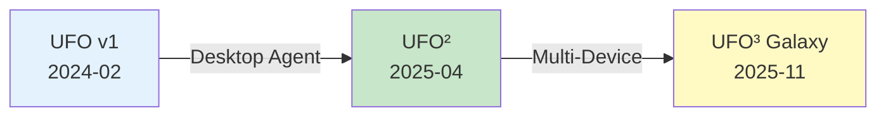

# Migration Guide: UFO² to UFO³ Galaxy

This guide helps you understand the evolution from **UFO²** (Desktop AgentOS) to **UFO³ Galaxy** (Multi-Device AgentOS), and provides practical steps for migrating your workflows to leverage Galaxy's cross-device orchestration capabilities.

---

## 🌟 Understanding the UFO Evolution

### The UFO Journey

The UFO project has evolved through three major iterations, each addressing increasingly complex automation challenges:



#### **UFO (v1.0)** — The Beginning
📅 *Released: February 2024*

- **Vision**: Screenshot-based Windows automation
- **Architecture**: Multi-agent (HostAgent + AppAgents)
- **Approach**: GPT-4V + pure GUI automation (click/type)
- **Scope**: Single Windows desktop, cross-app workflows
- **Limitation**: No deep OS integration

**Key Innovation:** First LLM-powered multi-agent GUI automation framework

---

#### **UFO² (v2.0)** — Desktop AgentOS
📅 *Released: April 2025*  
📄 *Paper:* [UFO²: A Windows Agent for Seamless OS Interaction](https://arxiv.org/abs/2504.14603)

- **Vision**: Deep OS integration for robust automation
- **Architecture**: Two-tier hierarchy (HostAgent + AppAgents)
- **Innovations**:
  - ✅ **Hybrid GUI–API execution** (51% fewer LLM calls)
  - ✅ **Windows UIA + Win32 + WinCOM APIs**
  - ✅ **Continuous knowledge learning** from docs & experience
  - ✅ **Picture-in-Picture desktop** (non-disruptive automation)
  - ✅ **MCP server integration** for tool augmentation
- **Scope**: Single Windows desktop
- **Success**: 10%+ better than state-of-the-art CUAs

**Key Innovation:** First agent to deeply integrate with Windows OS internals

---

#### **UFO³ Galaxy** — Multi-Device AgentOS
📅 *Released: November 2025*  
📄 *Paper:* UFO³: Weaving the Digital Agent Galaxy *(Coming Soon)*

- **Vision**: Cross-device orchestration at scale
- **Architecture**: Constellation-based distributed DAG orchestration
- **Innovations**:
  - ✅ **Task Constellation** (dynamic DAG decomposition)
  - ✅ **Asynchronous parallel execution** across devices
  - ✅ **Event-driven coordination** with formal safety guarantees
  - ✅ **Dual-mode DAG evolution** (creation + editing)
  - ✅ **Agent Interaction Protocol** (persistent WebSocket)
  - ✅ **Heterogeneous device support** (Windows, Linux, macOS)
- **Scope**: Multi-device workflows across platforms
- **Capability**: Orchestrate 10+ devices simultaneously

**Key Innovation:** First LLM-powered multi-device orchestration framework with provable correctness

---

### Architecture Evolution

#### UFO v1 Architecture

**Multi-Agent (GUI-Only)**

```
User Request
    ↓
HostAgent
    ↓
AppAgent 1, 2, 3...
    ↓
Windows Apps (GUI)
```

**Capabilities:**

- Multi-app workflows
- Pure screenshot + click/type
- No API integration
- Single device

#### UFO² Architecture

**Two-Tier Hierarchy (Hybrid)**

```
User Request
    ↓
HostAgent
    ↓
AppAgent 1, 2, 3...
    ↓
Windows Apps (GUI + API)
```

**Capabilities:**

- Multi-app workflows
- Desktop orchestration
- Hybrid GUI–API execution
- Deep OS integration
- Single device

#### UFO³ Galaxy Architecture

**Constellation Model (Distributed)**

```
User Request
    ↓
ConstellationAgent
    ↓
Task Constellation (DAG)
    ↓
Device 1, 2, 3... (UFO² instances)
    ↓
Cross-Platform Apps
```

**Capabilities:**

- Multi-device workflows
- Parallel execution
- Dynamic adaptation
- Heterogeneous platforms

---

## 🎯 When to Use Which?

### Use **UFO²** (Desktop AgentOS) When:

✅ You're automating tasks on a **single Windows desktop**  
✅ You need **deep Windows integration** (Office, File Explorer, etc.)  
✅ You want **fast, simple execution** without network overhead  
✅ You're learning agent automation basics  
✅ Your workflow is entirely **local** (no cross-device dependencies)

**Examples:**
- "Create a PowerPoint presentation from this Excel data"
- "Organize my Downloads folder by file type"
- "Send emails to all contacts in this spreadsheet"

---

### Use **UFO³ Galaxy** When:

✅ Your workflow spans **multiple devices** (Windows, Linux, servers)  
✅ You need **parallel task execution** for performance  
✅ You have **complex dependencies** between subtasks  
✅ You want **dynamic workflow adaptation** based on results  
✅ You need **fault tolerance** and automatic recovery  
✅ You're orchestrating **heterogeneous systems** (desktop + server + cloud)

**Examples:**
- "Clone repo on my laptop, build Docker image on GPU server, deploy to staging, run tests on CI cluster"
- "Fetch data from cloud storage, preprocess on Linux workstation, train model on A100 node, visualize on my Windows machine"
- "Collect logs from all Linux servers, analyze for errors, generate report on Windows"

---

### Can You Use Both?

**Yes!** UFO² can run as a **device agent** in the Galaxy:

```
Galaxy (Orchestrator)
    ├── Windows Device (UFO² instance)
    ├── Linux Device (UFO² instance)
    └── Server Device (UFO² instance)
```

This is the **recommended hybrid approach** for complex workflows.

---

## 🔄 Key Concept Mapping

Understanding how UFO² concepts map to Galaxy:

| UFO² Concept | Galaxy Equivalent | Relationship |
|--------------|-------------------|--------------|
| **HostAgent** | **ConstellationAgent** | Global orchestrator (but across devices) |
| **AppAgent** | **Device Agent (HostAgent)** | Local executor on each device |
| **Session** | **GalaxySession** | Workflow execution context |
| **Round** | **Constellation Round** | Orchestration iteration |
| **Action** | **TaskStar** | Executable unit (but on specific device) |
| **Blackboard** | **Task Results** | Inter-task communication |
| **Config File** | `config/ufo/` → `config/galaxy/` | Configuration location |
| **Execution Mode** | `python -m ufo.server.app --port <port>` | Device runs as WebSocket server |

### Architecture Translation

**UFO² (Single Device):**
```python
# UFO² executes locally
python -m ufo --task "Create report from data.xlsx"

# HostAgent coordinates AppAgents on one desktop
HostAgent
  ├── ExcelAgent (data.xlsx)
  ├── WordAgent (report.docx)
  └── OutlookAgent (send email)
```

**Galaxy (Multi-Device):**
```python
# Galaxy orchestrates across devices
python -m galaxy --request "Create report from data on Server, generate PDF on Windows"

# ConstellationAgent creates DAG, assigns to devices
ConstellationAgent
  └── TaskConstellation (DAG)
      ├── TaskStar-1: Fetch data → Linux Server
      ├── TaskStar-2: Process → GPU Workstation
      └── TaskStar-3: Generate PDF → Windows Desktop
```

---

## ⚙️ Configuration Migration

### Step 1: Preserve UFO² Configuration

**Keep your existing UFO² config** — you'll use it for device agents:

```
config/ufo/
├── agents.yaml          # LLM config for device agents
├── app_agent.yaml       # AppAgent settings
├── host_agent.yaml      # HostAgent settings
└── ...
```

**No changes needed** — each Galaxy device will use its own UFO² config.

---

### Step 2: Create Galaxy Configuration

Galaxy adds **new orchestration-level config**:

#### A. ConstellationAgent LLM Config

```bash
# Copy template
copy config\galaxy\agent.yaml.template config\galaxy\agent.yaml
```

Edit `config/galaxy/agent.yaml`:

```yaml
# ConstellationAgent LLM (orchestrator)
CONSTELLATION_AGENT:
  API_TYPE: "openai"  # or "azure", "qwen", etc.
  API_BASE: "https://api.openai.com/v1"
  API_KEY: "sk-your-api-key-here"
  API_MODEL: "gpt-4o"
  API_VERSION: null

# Optional: Use different model for orchestration
# Recommended: Use GPT-4o or Claude for complex DAG reasoning
```

---

#### B. Device Pool Configuration

**New in Galaxy:** Define all available devices

```bash
# Create device registry
notepad config\galaxy\devices.yaml
```

```yaml
devices:
  # Your Windows desktop (existing UFO² instance)
  - device_id: "my_windows_desktop"
    server_url: "ws://localhost:5005/ws"
    os: "windows"
    capabilities:
      - "office_applications"  # Excel, Word, PowerPoint
      - "web_browsing"
      - "file_management"
    metadata:
      location: "local"
      os: "windows"
      performance: "high"
    auto_connect: true
    max_retries: 5

  # Linux workstation
  - device_id: "linux_workstation"
    server_url: "ws://192.168.1.100:5001/ws"
    os: "linux"
    capabilities:
      - "python"
      - "docker"
      - "server"
    metadata:
      location: "office"
      os: "ubuntu_22.04"
      performance: "high"
      gpu: "nvidia_a100"
    auto_connect: true

  # GPU server
  - device_id: "gpu_server"
    server_url: "ws://192.168.1.200:5002/ws"
    os: "linux"
    capabilities:
      - "machine_learning"
      - "cuda"
      - "docker"
    metadata:
      os: "centos_7"
      gpu: "nvidia_v100"
      performance: "ultra"
```

**Capability Matching:** ConstellationAgent uses these capabilities to assign tasks intelligently.

---

#### C. Constellation Runtime Config

```bash
notepad config\galaxy\constellation.yaml
```

```yaml
# Constellation Orchestration Settings
CONSTELLATION_ID: "my_constellation"
HEARTBEAT_INTERVAL: 30.0      # Device health check (seconds)
RECONNECT_DELAY: 5.0          # Auto-reconnect delay
MAX_CONCURRENT_TASKS: 6       # Parallel task limit
MAX_STEP: 15                  # Max orchestration rounds

# Device Configuration
DEVICE_INFO: "config/galaxy/devices.yaml"

# Logging
LOG_TO_MARKDOWN: true         # Generate trajectory reports
```

---

## 🚀 Migration Steps

### Option 1: Keep UFO² for Local, Add Galaxy for Multi-Device

**Best for:** Gradual adoption, maintaining existing workflows

1. **Continue using UFO² for single-device tasks**
   ```bash
   python -m ufo --task "Your local task"
   ```

2. **Use Galaxy only when you need multi-device orchestration**
   ```bash
   python -m galaxy --request "Your cross-device task"
   ```

3. **No migration required** — both coexist independently

---

### Option 2: Convert UFO² Instance to Galaxy Device

**Best for:** Leveraging Galaxy's orchestration for all workflows

#### Step 1: Start UFO² as Agent Server

**On each device** (Windows, Linux, etc.), run UFO² server:

```bash
# Windows Desktop
python -m ufo.server.app --port 5005

# Linux Workstation  
python -m ufo.server.app --port 5001

# GPU Server
python -m ufo.server.app --port 5002
```

**What this does:**
- Starts WebSocket server on the device
- Listens for task assignments from Galaxy
- Uses existing UFO² agents (HostAgent/AppAgent) for local execution
- Reports results back to ConstellationClient

---

#### Step 2: Configure Galaxy Client

Create `config/galaxy/devices.yaml` with all your devices (see Configuration section above).

---

#### Step 3: Launch Galaxy Client

```bash
# Interactive mode
python -m galaxy --interactive

# Direct request
python -m galaxy --request "Clone repo on laptop, build on server, test on Windows"
```

**What happens:**
1. ConstellationAgent decomposes request into DAG
2. TaskStars assigned to devices based on capabilities
3. Devices execute tasks using their local UFO² agents
4. Results aggregated and presented to user

---

### Option 3: Programmatic Migration

**Best for:** Custom workflows, CI/CD integration

#### UFO² API (Before):

```python
from ufo.module.session_pool import SessionFactory, SessionPool
import asyncio

async def main():
    # Create UFO² session on local device
    sessions = SessionFactory().create_session(
        task="my_task",
        mode="normal",
        plan="",
        request="Create a presentation from data.xlsx"
    )
    
    # Run session
    pool = SessionPool(sessions)
    await pool.run_all()

asyncio.run(main())
```

#### Galaxy API (After):

```python
from galaxy import GalaxyClient
import asyncio

async def main():
    # Galaxy session coordinating multiple devices
    client = GalaxyClient(session_name="my_workflow")
    await client.initialize()
    
    result = await client.process_request(
        "Clone repo on laptop, build on server, test on Windows"
    )
    
    print(f"Workflow completed: {result}")
    await client.shutdown()

asyncio.run(main())
```

**Key Differences:**
- Both are **async** (UFO² v2.0+ uses asyncio)
- UFO²: Uses `SessionFactory` + `SessionPool` pattern
- Galaxy: Uses `GalaxyClient` for multi-device orchestration
- Galaxy returns **constellation results** (multi-device)
- Galaxy requires **device registration** first

---

## 📊 Feature Comparison

### Preserved UFO² Features in Galaxy

When running UFO² as a Galaxy device, you **keep all UFO² capabilities**:

| UFO² Feature | Available in Galaxy Device? | Notes |
|--------------|----------------------------|-------|
| ✅ Hybrid GUI–API execution | ✅ Yes | Each device uses its native UFO² agent |
| ✅ Windows UIA/Win32/COM | ✅ Yes | Full OS integration preserved |
| ✅ MCP server integration | ✅ Yes | Devices can use custom MCP servers |
| ✅ Continuous learning | ✅ Yes | Each device maintains its own RAG |
| ✅ Picture-in-Picture | ✅ Yes | Non-disruptive execution on each device |
| ✅ AppAgent specialization | ✅ Yes | HostAgent manages local AppAgents |

---

### New Galaxy-Only Features

| Feature | Description | Benefit |
|---------|-------------|---------|
| **Task Constellation** | DAG-based task decomposition | Complex workflow planning |
| **Parallel Execution** | Asynchronous multi-device tasks | 3-5x faster for parallelizable work |
| **Dynamic Adaptation** | Runtime DAG modification | Self-healing workflows |
| **Device Assignment** | Capability-based task placement | Optimal resource utilization |
| **Cross-Platform** | Windows + Linux + macOS support | Heterogeneous orchestration |
| **Event-Driven Coordination** | Observer pattern for task events | Reactive workflow control |
| **Formal Safety Guarantees** | I1-I3 invariants | Provably correct concurrent execution |

---

## 🛠️ Practical Examples

### Example 1: Simple Local Task

**UFO² (Before):**
```bash
python -m ufo --task "Create a presentation from data.xlsx"
```

**Galaxy (After) — Option A: Keep UFO²**
```bash
# No change needed — continue using UFO² for local tasks
python -m ufo --task "Create a presentation from data.xlsx"
```

**Galaxy (After) — Option B: Use Galaxy**
```bash
# Galaxy will assign to local Windows device automatically
python -m galaxy --request "Create a presentation from data.xlsx on my desktop"
```

**When to use which?**
- Use UFO² if you only have one Windows desktop (simpler)
- Use Galaxy if you want logging/monitoring features

---

### Example 2: Cross-Device Workflow

**UFO² (Before):**
```bash
# ❌ Not possible — UFO² is single-device only
# You'd need to manually:
# 1. SSH to server
# 2. Run build command
# 3. Copy results back
# 4. Open locally
```

**Galaxy (After):**
```bash
python -m galaxy --request \
  "Clone https://github.com/myrepo on laptop, \
   build Docker image on gpu_server, \
   deploy to staging server, \
   open logs on my Windows desktop"
```

**Galaxy automatically:**
1. Creates 4-task DAG
2. Assigns tasks to capable devices
3. Executes in parallel where possible
4. Streams results back

---

### Example 3: Data Pipeline

**UFO² (Before):**
```python
# UFO² requires manual orchestration across multiple steps
from ufo.module.session_pool import SessionFactory, SessionPool
import asyncio

async def main():
    # Step 1: Fetch data (local)
    sessions_1 = SessionFactory().create_session(
        task="fetch_data",
        mode="normal",
        plan="",
        request="Download dataset from cloud storage"
    )
    pool_1 = SessionPool(sessions_1)
    await pool_1.run_all()

    # Step 2: Manually transfer to server
    # scp data.csv user@server:/data/

    # Step 3: SSH and run processing
    # ssh server "python process.py"

    # Step 4: Manually copy results back
    # scp server:/output/results.csv .

    # Step 5: Visualize locally
    sessions_2 = SessionFactory().create_session(
        task="visualize",
        mode="normal",
        plan="",
        request="Create charts from results.csv"
    )
    pool_2 = SessionPool(sessions_2)
    await pool_2.run_all()

asyncio.run(main())
```

**Galaxy (After):**
```python
import asyncio
from galaxy import GalaxyClient

async def main():
    client = GalaxyClient(session_name="data_pipeline")
    await client.initialize()
    
    # Single request — Galaxy handles orchestration
    await client.process_request(
        "Fetch dataset from cloud to laptop, "
        "preprocess on linux_workstation, "
        "train model on gpu_server, "
        "visualize results on my Windows desktop"
    )
    
    await client.shutdown()

asyncio.run(main())
```

**Galaxy automatically:**
- Creates dependency chain
- Transfers data between devices
- Executes pipeline stages in order
- Handles failures with retries

---

## 🎓 Learning Path

### For UFO² Users

1. **Week 1: Understand Concepts**
   - Read [Galaxy Overview](../galaxy/overview.md)
   - Understand Task Constellation and DAG model
   - Compare with UFO² two-tier hierarchy

2. **Week 2: Hands-On**
   - Set up one Windows device as Galaxy agent
   - Run simple multi-step workflow
   - Compare logs: UFO² vs Galaxy

3. **Week 3: Multi-Device**
   - Add Linux device to pool
   - Create cross-platform workflow
   - Monitor with trajectory reports

4. **Week 4: Advanced**
   - Build custom device capabilities
   - Integrate MCP servers across devices
   - Optimize task assignment logic

---

## 📚 Related Documentation

### Migration Resources

- **[Galaxy Quick Start](./quick_start_galaxy.md)** — Step-by-step Galaxy setup
- **[UFO² Quick Start](./quick_start_ufo2.md)** — UFO² reference
- **[Device Configuration](../configuration/system/galaxy_devices.md)** — Device pool setup
- **[Agent Registration](../galaxy/agent_registration/overview.md)** — How devices join Galaxy

### Architecture Deep Dives

- **[Galaxy Overview](../galaxy/overview.md)** — Constellation architecture
- **[UFO² Overview](../ufo2/overview.md)** — Desktop AgentOS design
- **[Constellation Agent](../galaxy/constellation_agent/overview.md)** — DAG orchestration
- **[Task Constellation](../galaxy/constellation/overview.md)** — DAG structure

### Operational Guides

- **[Trajectory Report](../galaxy/evaluation/trajectory_report.md)** — Execution logs
- **[Performance Metrics](../galaxy/evaluation/performance_metrics.md)** — Monitoring
- **[AIP Protocol](../aip/overview.md)** — Device communication

---

## 🤝 Getting Help

### Common Questions

**Q: Can I still use UFO² after migrating to Galaxy?**  
A: Yes! They coexist. Use UFO² for simple local tasks, Galaxy for multi-device workflows.

**Q: Do I need to rewrite my custom agents?**  
A: No. Existing UFO² agents work as-is when running as Galaxy devices.

**Q: Is Galaxy production-ready?**  
A: Galaxy is in active development. UFO² is more mature for mission-critical single-device workflows.

**Q: Can I mix Windows and Linux devices?**  
A: Yes! That's Galaxy's key feature. Each device uses its native UFO² implementation.

**Q: How do I debug failed cross-device workflows?**  
A: Check `logs/galaxy/<session>/output.md` for step-by-step execution details and DAG visualizations.

---

## 🚦 Migration Checklist

Use this checklist to track your migration progress:

- [ ] **Understand UFO evolution** (v1 → UFO² → Galaxy)
- [ ] **Decide migration strategy** (hybrid vs full Galaxy)
- [ ] **Preserve UFO² config** (`config/ufo/` untouched)
- [ ] **Create Galaxy config** (`config/galaxy/agent.yaml`, `devices.yaml`)
- [ ] **Start devices as servers** (each device runs `python -m ufo.server.app --port <port>`)
- [ ] **Test single-device workflow** (verify connectivity)
- [ ] **Test multi-device workflow** (cross-platform task)
- [ ] **Review trajectory reports** (`logs/galaxy/*/output.md`)
- [ ] **Compare performance** (UFO² vs Galaxy for your use cases)
- [ ] **Update automation scripts** (if using programmatic API)
- [ ] **Train team** (share this guide!)

---

**🎉 Congratulations!** You're now ready to leverage the full power of UFO³ Galaxy's multi-device orchestration while preserving your existing UFO² workflows.

For questions or issues, please open an issue on [GitHub](https://github.com/microsoft/UFO) or check the [documentation](https://microsoft.github.io/UFO/).
