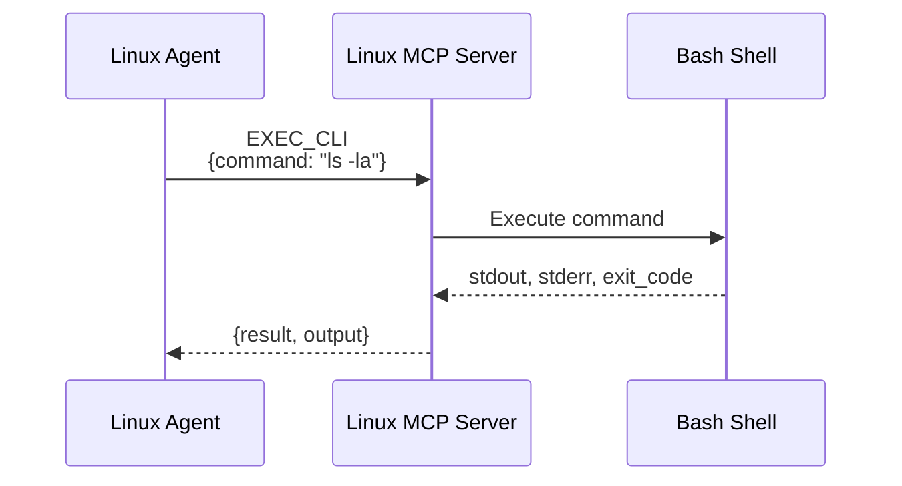
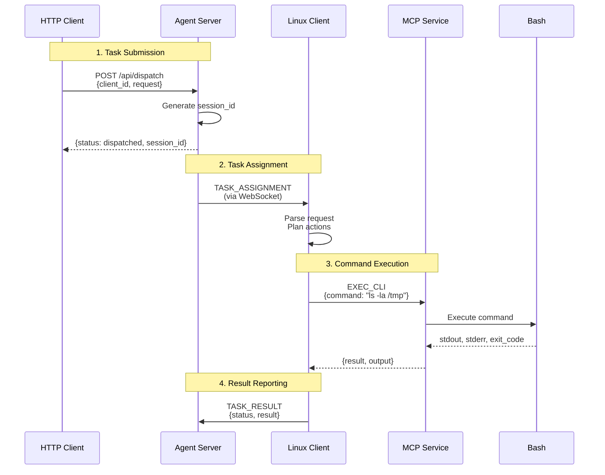
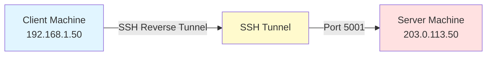

# ⚡ Quick Start: Linux Agent

Get your Linux device running as a UFO³ device agent in 5 minutes. This guide walks you through server/client configuration and MCP service initialization.

---

## 📋 Prerequisites

Before you begin, ensure you have:

- **Python 3.10+** installed on both server and client machines
- **UFO repository** cloned
- **Network connectivity** between server and client machines
- **Linux machine** for task execution (client)
- **Terminal access** (bash, ssh, etc.)
- **LLM configured** in `config/ufo/agents.yaml` (same as AppAgent)

| Component | Minimum Version | Verification Command |
|-----------|----------------|---------------------|
| Python | 3.10 | `python3 --version` |
| Git | 2.0+ | `git --version` |
| Network | N/A | `ping <server-ip>` |
| LLM API Key | N/A | Check `config/ufo/agents.yaml` |

> **⚠️ LLM Configuration Required:** The Linux Agent shares the same LLM configuration with the AppAgent. Before starting, ensure you have configured your LLM provider (OpenAI, Azure OpenAI, Gemini, Claude, etc.) and added your API keys to `config/ufo/agents.yaml`. See [Model Setup Guide](../configuration/models/overview.md) for detailed instructions.

---

## 📦 Step 1: Install Dependencies

Install all dependencies from the requirements file:

```bash
pip install -r requirements.txt
```

**Verify installation:**

```bash
python3 -c "import ufo; print('✅ UFO² installed successfully')"
```

> **Tip:** For production deployments, use a virtual environment to isolate dependencies:
> 
> ```bash
> python3 -m venv venv
> source venv/bin/activate  # Linux/macOS
> pip install -r requirements.txt
> ```

---

## 🖥️ Step 2: Start Device Agent Server

**Server Component:** The Device Agent Server is the central hub that manages connections from client devices and dispatches tasks. It can run on any machine (Linux, Windows, or remote server).

### Server Machine Setup

You can run the server on:

- ✅ Same machine as the client (localhost setup for testing)
- ✅ Different machine on the same network
- ✅ Remote server (requires proper network routing/SSH tunneling)

### Basic Server Startup

On the server machine, run:

```bash
python -m ufo.server.app --port 5001
```

**Expected Output:**

```console
2024-11-06 10:30:22 - ufo.server.app - INFO - Starting UFO Server on 0.0.0.0:5001
INFO:     Started server process [12345]
INFO:     Waiting for application startup.
INFO:     Application startup complete.
INFO:     Uvicorn running on http://0.0.0.0:5001 (Press CTRL+C to quit)
```

Once you see "Uvicorn running", the server is ready at `ws://0.0.0.0:5001/ws`.

### Server Configuration Options

| Argument | Default | Description | Example |
|----------|---------|-------------|---------|
| `--port` | `5000` | Server listening port | `--port 5001` |
| `--host` | `0.0.0.0` | Bind address (0.0.0.0 = all interfaces) | `--host 127.0.0.1` |
| `--log-level` | `INFO` | Logging verbosity | `--log-level DEBUG` |

**Custom Server Configuration:**

**Custom Port:**
```bash
python -m ufo.server.app --port 8080
```

**Specific IP Binding:**
```bash
python -m ufo.server.app --host 192.168.1.100 --port 5001
```

**Debug Mode:**
```bash
python -m ufo.server.app --port 5001 --log-level DEBUG
```

### Verify Server is Running

```bash
# Test server health endpoint
curl http://localhost:5001/api/health
```

**Expected Response:**

```json
{
  "status": "healthy",
  "online_clients": []
}
```

> **Documentation Reference:** For detailed server configuration and advanced features, see [Server Quick Start Guide](../server/quick_start.md).

---

## 🐧 Step 3: Start Device Agent Client (Linux Machine)

**Client Component:** The Device Agent Client runs on the Linux machine where you want to execute tasks. It connects to the server via WebSocket and receives task commands.

### Basic Client Startup

On the Linux machine where you want to execute tasks:

```bash
python -m ufo.client.client \
  --ws \
  --ws-server ws://172.23.48.1:5001/ws \
  --client-id linux_agent_1 \
  --platform linux
```

### Client Parameters Explained

| Parameter | Required | Description | Example |
|-----------|----------|-------------|---------|
| `--ws` | ✅ Yes | Enable WebSocket mode | `--ws` |
| `--ws-server` | ✅ Yes | Server WebSocket URL | `ws://172.23.48.1:5001/ws` |
| `--client-id` | ✅ Yes | **Unique** device identifier | `linux_agent_1` |
| `--platform` | ✅ Yes (Linux) | Platform type (must be `linux` for Linux Agent) | `--platform linux` |

> **⚠️ Critical Requirements:**
> 
> 1. `--client-id` must be globally unique - No two devices can share the same ID
> 2. `--platform linux` is mandatory - Without this flag, the Linux Agent won't work correctly
> 3. Server address must be correct - Replace `172.23.48.1:5001` with your actual server IP and port

### Understanding the WebSocket URL

The `--ws-server` parameter format is:

```
ws://<server-ip>:<server-port>/ws
```

Examples:

| Scenario | WebSocket URL | Description |
|----------|---------------|-------------|
| **Localhost** | `ws://localhost:5001/ws` | Server and client on same machine |
| **Same Network** | `ws://192.168.1.100:5001/ws` | Server on local network |
| **Remote Server** | `ws://203.0.113.50:5001/ws` | Server on internet (public IP) |
| **SSH Tunnel** | `ws://localhost:5001/ws` | After SSH reverse tunnel setup |

### Connection Success Indicators

**Client Logs:**

```log
INFO - Platform detected/specified: linux
INFO - UFO Client initialized for platform: linux
INFO - [WS] Connecting to ws://172.23.48.1:5001/ws (attempt 1/5)
INFO - [WS] [AIP] Successfully registered as linux_agent_1
INFO - [WS] Heartbeat loop started (interval: 30s)
```

**Server Logs:**

```log
INFO - [WS] ✅ Registered device client: linux_agent_1
INFO - [WS] Device linux_agent_1 platform: linux
```

Client is connected and ready to receive tasks when you see "Successfully registered"!

### Verify Connection

```bash
# Check connected clients on server
curl http://172.23.48.1:5001/api/clients
```

**Expected Response:**

```json
{
  "clients": [
    {
      "client_id": "linux_agent_1",
      "type": "device",
      "platform": "linux",
      "connected_at": 1730899822.0,
      "uptime_seconds": 45
    }
  ]
}
```

> **Documentation Reference:** For detailed client configuration, see [Client Quick Start Guide](../client/quick_start.md).

---

## 🔌 Step 4: Start MCP Service (Linux Machine)

**MCP Service Component:** The MCP (Model Context Protocol) Service provides the execution layer for CLI commands. It must be running on the same Linux machine as the client to handle command execution requests.

### Start the MCP Server

On the Linux machine (same machine as the client):

```bash
python -m ufo.client.mcp.http_servers.linux_mcp_server
```

**Expected Output:**

```console
INFO:     Started server process [23456]
INFO:     Waiting for application startup.
INFO:     Application startup complete.
INFO:     Uvicorn running on http://127.0.0.1:8010 (Press CTRL+C to quit)
```

The MCP service is now ready to execute CLI commands at `http://127.0.0.1:8010`.

### What is the MCP Service?

The **Linux MCP Server** provides two main functionalities:

| Command | Purpose | Example Use Case |
|---------|---------|------------------|
| `EXEC_CLI` | Execute shell commands | `ls -la`, `grep pattern file.txt`, `ps aux` |
| `SYS_INFO` | Retrieve system information | CPU usage, memory stats, disk space |

**Architecture:**



### MCP Service Configuration

The MCP server typically runs on `localhost:8010` by default. The client automatically connects to it when configured properly.

> **⚠️ MCP Service Must Be Running:** If the MCP service is not running, the Linux Agent cannot execute commands and will fail with:
> ```
> ERROR: Cannot connect to MCP server at http://127.0.0.1:8010
> ```

**Documentation Reference:** For detailed MCP command specifications, see [MCP Overview](../mcp/overview.md), [Linux MCP Commands](../linux/commands.md), and [BashExecutor Server](../mcp/servers/bash_executor.md).

---

## 🎯 Step 5: Dispatch Tasks via HTTP API

Once the server, client, and MCP service are all running, you can dispatch tasks to the Linux agent through the server's HTTP API.

### API Endpoint

```
POST http://<server-ip>:<server-port>/api/dispatch
```

### Request Format

```json
{
  "client_id": "linux_agent_1",
  "request": "Your natural language task description",
  "task_name": "optional_task_identifier"
}
```

### Example: Simple File Listing

**Using cURL:**
```bash
curl -X POST http://172.23.48.1:5001/api/dispatch \
  -H "Content-Type: application/json" \
  -d '{
    "client_id": "linux_agent_1",
    "request": "List all files in the /tmp directory",
    "task_name": "list_tmp_files"
  }'
```

**Using Python:**
```python
import requests

response = requests.post(
    "http://172.23.48.1:5001/api/dispatch",
    json={
        "client_id": "linux_agent_1",
        "request": "List all files in the /tmp directory",
        "task_name": "list_tmp_files"
    }
)
print(response.json())
```

**Using HTTPie:**
```bash
http POST http://172.23.48.1:5001/api/dispatch \
  client_id=linux_agent_1 \
  request="List all files in the /tmp directory" \
  task_name=list_tmp_files
```

**Successful Response:**

```json
{
  "status": "dispatched",
  "task_name": "list_tmp_files",
  "client_id": "linux_agent_1",
  "session_id": "550e8400-e29b-41d4-a716-446655440000"
}
```

### Example: System Information Query

```bash
curl -X POST http://172.23.48.1:5001/api/dispatch \
  -H "Content-Type: application/json" \
  -d '{
    "client_id": "linux_agent_1",
    "request": "Show disk usage for all mounted filesystems",
    "task_name": "check_disk_usage"
  }'
```

### Example: Log File Analysis

```bash
curl -X POST http://172.23.48.1:5001/api/dispatch \
  -H "Content-Type: application/json" \
  -d '{
    "client_id": "linux_agent_1",
    "request": "Find all ERROR or FATAL entries in /var/log/app.log from the last hour",
    "task_name": "analyze_error_logs"
  }'
```

### Task Execution Flow



### Request Parameters

| Field | Required | Type | Description | Example |
|-------|----------|------|-------------|---------|
| `client_id` | ✅ Yes | string | Target Linux agent ID (must match `--client-id`) | `"linux_agent_1"` |
| `request` | ✅ Yes | string | Natural language task description | `"List files in /var/log"` |
| `task_name` | ❌ Optional | string | Unique task identifier (auto-generated if omitted) | `"task_001"` |

> **⚠️ Client Must Be Online:** If the `client_id` is not connected, you'll receive:
> ```json
> {
>   "detail": "Client not online"
> }
> ```
> 
> Verify the client is connected:
> ```bash
> curl http://172.23.48.1:5001/api/clients
> ```

---

## 🌉 Network Connectivity & SSH Tunneling

When the server and client are on different networks or behind firewalls, you may need SSH tunneling to establish connectivity.

### Scenario 1: Same Network (No Tunnel Needed)

**Setup:**
- Server: `192.168.1.100:5001`
- Client: `192.168.1.50` (same LAN)

**Client Command:**
```bash
python -m ufo.client.client \
  --ws \
  --ws-server ws://192.168.1.100:5001/ws \
  --client-id linux_agent_1 \
  --platform linux
```

**No additional configuration needed** ✅

### Scenario 2: Client Behind Firewall (Reverse SSH Tunnel)

**Problem:**
- Server: `203.0.113.50:5001` (public IP, accessible)
- Client: `192.168.1.50` (private network, behind NAT/firewall)
- **Client cannot directly reach server**

**Solution: SSH Reverse Tunnel**

On the **client machine**, create an SSH reverse tunnel:

```bash
ssh -N -R 5001:localhost:5001 user@203.0.113.50
```

**Parameters:**
- `-N`: No remote command execution (tunnel only)
- `-R 5001:localhost:5001`: Forward remote port 5001 to local port 5001
- `user@203.0.113.50`: SSH server address (where the UFO server runs)

**What This Does:**



**After tunnel is established:**

```bash
# Client can now connect to localhost:5001
python -m ufo.client.client \
  --ws \
  --ws-server ws://localhost:5001/ws \
  --client-id linux_agent_1 \
  --platform linux
```

### Scenario 3: Server Behind Firewall (Forward SSH Tunnel)

**Problem:**
- Server: `192.168.1.100:5001` (private network)
- Client: `203.0.113.75` (public network)
- **Client cannot directly reach server**

**Solution: SSH Forward Tunnel**

On the **client machine**, create an SSH forward tunnel to the server's network:

```bash
ssh -N -L 5001:192.168.1.100:5001 gateway-user@vpn.company.com
```

**Parameters:**
- `-N`: No remote command execution
- `-L 5001:192.168.1.100:5001`: Forward local port 5001 to remote 192.168.1.100:5001
- `gateway-user@vpn.company.com`: SSH gateway that can access the server

**After tunnel is established:**

```bash
# Client connects to localhost, which forwards to server
python -m ufo.client.client \
  --ws \
  --ws-server ws://localhost:5001/ws \
  --client-id linux_agent_1 \
  --platform linux
```

### Example: Complex Tunnel Setup

**Situation:**
- Server IP: `10.0.0.50:5001` (corporate network)
- Client IP: `192.168.1.75` (home network)
- SSH Gateway: `vpn.company.com` (accessible from internet)

**Step 1: Create SSH Tunnel**
```bash
# On client machine
ssh -N -L 5001:10.0.0.50:5001 myuser@vpn.company.com
```

**Step 2: Start Client (in another terminal)**
```bash
python -m ufo.client.client \
  --ws \
  --ws-server ws://localhost:5001/ws \
  --client-id linux_agent_home_1 \
  --platform linux
```

### SSH Tunnel Best Practices

For production use, add these flags to your SSH tunnel:

```bash
ssh -N \
  -L 5001:server:5001 \
  -o ServerAliveInterval=60 \
  -o ServerAliveCountMax=3 \
  -o ExitOnForwardFailure=yes \
  user@gateway
```

**Flags explained:**
- `ServerAliveInterval=60`: Send keep-alive every 60 seconds
- `ServerAliveCountMax=3`: Disconnect after 3 failed keep-alives
- `ExitOnForwardFailure=yes`: Exit if port forwarding fails

### Persistent SSH Tunnel with Autossh

For production, use `autossh` to automatically restart the tunnel if it fails:

```bash
# Install autossh
sudo apt-get install autossh  # Debian/Ubuntu

# Start persistent tunnel
autossh -M 0 \
  -N \
  -L 5001:server:5001 \
  -o ServerAliveInterval=60 \
  -o ServerAliveCountMax=3 \
  user@gateway
```

> **ℹ️ Network Configuration:** For more network configuration details, see [Server Quick Start - Troubleshooting](../server/quick_start.md#common-issues-troubleshooting).

---

## 🌌 Step 6: Configure as UFO³ Galaxy Device

To use the Linux Agent as a managed device within the **UFO³ Galaxy** multi-tier framework, you need to register it in the `devices.yaml` configuration file.

### Device Configuration File

The Galaxy configuration is located at:

```
config/galaxy/devices.yaml
```

### Add Linux Agent Configuration

Edit `config/galaxy/devices.yaml` and add your Linux agent under the `devices` section:

```yaml
devices:
  - device_id: "linux_agent_1"
    server_url: "ws://172.23.48.1:5001/ws"
    os: "linux"
    capabilities:
      - "server"
      - "log_analysis"
      - "file_operations"
    metadata:
      os: "linux"
      performance: "medium"
      logs_file_path: "/var/log/myapp/app.log"
      dev_path: "/home/user/development/"
      warning_log_pattern: "WARN"
      error_log_pattern: "ERROR|FATAL"
    auto_connect: true
    max_retries: 5
```

### Configuration Fields Explained

| Field | Required | Type | Description | Example |
|-------|----------|------|-------------|---------|
| `device_id` | ✅ Yes | string | **Must match client `--client-id`** | `"linux_agent_1"` |
| `server_url` | ✅ Yes | string | **Must match server WebSocket URL** | `"ws://172.23.48.1:5001/ws"` |
| `os` | ✅ Yes | string | Operating system | `"linux"` |
| `capabilities` | ❌ Optional | list | Device capabilities (for task routing) | `["server", "log_analysis"]` |
| `metadata` | ❌ Optional | dict | Custom metadata for task context | See below |
| `auto_connect` | ❌ Optional | boolean | Auto-connect on Galaxy startup | `true` |
| `max_retries` | ❌ Optional | integer | Connection retry attempts | `5` |

### Metadata Fields (Custom)

The `metadata` section can contain any custom fields relevant to your Linux agent:

| Field | Purpose | Example |
|-------|---------|---------|
| `logs_file_path` | Path to application logs | `"/var/log/app.log"` |
| `dev_path` | Development directory | `"/home/user/dev/"` |
| `warning_log_pattern` | Regex pattern for warnings | `"WARN"` |
| `error_log_pattern` | Regex pattern for errors | `"ERROR\|FATAL"` |
| `performance` | Performance tier | `"high"`, `"medium"`, `"low"` |
| `description` | Human-readable description | `"Production database server"` |

### Multiple Linux Agents Example

```yaml
devices:
  - device_id: "linux_agent_1"
    server_url: "ws://172.23.48.1:5001/ws"
    os: "linux"
    capabilities:
      - "web_server"
    metadata:
      logs_file_path: "/var/log/nginx/access.log"
      dev_path: "/var/www/html/"
      warning_log_pattern: "WARN"
      error_log_pattern: "ERROR|FATAL"
    auto_connect: true
    max_retries: 5

  - device_id: "linux_agent_2"
    server_url: "ws://172.23.48.2:5002/ws"
    os: "linux"
    capabilities:
      - "database_server"
    metadata:
      logs_file_path: "/var/log/postgresql/postgresql.log"
      dev_path: "/var/lib/postgresql/"
      warning_log_pattern: "WARNING"
      error_log_pattern: "ERROR|FATAL|PANIC"
    auto_connect: true
    max_retries: 5

  - device_id: "linux_agent_3"
    server_url: "ws://172.23.48.3:5003/ws"
    os: "linux"
    capabilities:
      - "monitoring"
    metadata:
      logs_file_path: "/var/log/prometheus/prometheus.log"
      dev_path: "/opt/prometheus/"
      warning_log_pattern: "level=warn"
      error_log_pattern: "level=error"
    auto_connect: true
    max_retries: 5
```

### Critical Requirements

> **⚠️ Configuration Validation - These fields MUST match exactly:**
> 
> 1. **`device_id` in YAML** ↔ **`--client-id` in client command**
>    ```yaml
>    device_id: "linux_agent_1"  # In devices.yaml
>    ```
>    ```bash
>    --client-id linux_agent_1   # In client command
>    ```
> 
> 2. **`server_url` in YAML** ↔ **`--ws-server` in client command**
>    ```yaml
>    server_url: "ws://172.23.48.1:5001/ws"  # In devices.yaml
>    ```
>    ```bash
>    --ws-server ws://172.23.48.1:5001/ws    # In client command
>    ```
> 
> **If these don't match, Galaxy cannot control the device!**

### Using Galaxy to Control Linux Agents

Once configured, you can launch Galaxy and it will automatically manage the Linux agents:

```bash
python -m galaxy --interactive
```

**Galaxy will:**
1. ✅ Automatically load device configuration from `config/galaxy/devices.yaml`
2. ✅ Connect to all configured devices
3. ✅ Orchestrate multi-device tasks
4. ✅ Route tasks based on capabilities
5. ✅ Monitor device health

> **ℹ️ Galaxy Documentation:** For detailed Galaxy configuration and usage, see:
> 
> - [Galaxy Overview](../galaxy/overview.md)
> - [Galaxy Quick Start](quick_start_galaxy.md)
> - [Constellation Orchestrator](../galaxy/constellation_orchestrator/overview.md)

---

## 🐛 Common Issues & Troubleshooting

### Issue 1: Client Cannot Connect to Server

**Error: Connection Refused**

Symptoms:
```log
ERROR - [WS] Failed to connect to ws://172.23.48.1:5001/ws
Connection refused
```

**Diagnosis Checklist:**

- [ ] Is the server running? (`curl http://172.23.48.1:5001/api/health`)
- [ ] Is the port correct? (Check server startup logs)
- [ ] Can client reach server IP? (`ping 172.23.48.1`)
- [ ] Is firewall blocking port 5001?
- [ ] Is SSH tunnel established (if needed)?

**Solutions:**

Verify Server:
```bash
# On server machine
curl http://localhost:5001/api/health

# From client machine
curl http://172.23.48.1:5001/api/health
```

Check Network:
```bash
# Test connectivity
ping 172.23.48.1

# Test port accessibility
nc -zv 172.23.48.1 5001
telnet 172.23.48.1 5001
```

Check Firewall:
```bash
# On server machine (Ubuntu/Debian)
sudo ufw status
sudo ufw allow 5001/tcp

# On server machine (RHEL/CentOS)
sudo firewall-cmd --list-ports
sudo firewall-cmd --add-port=5001/tcp --permanent
sudo firewall-cmd --reload
```

### Issue 2: MCP Service Not Responding

**Error: Cannot Execute Commands**

Symptoms:
```log
ERROR - Cannot connect to MCP server at http://127.0.0.1:8010
ERROR - Command execution failed
```

**Diagnosis:**

- [ ] Is the MCP service running?
- [ ] Is it running on the correct port?
- [ ] Are there any startup errors in MCP logs?

**Solutions:**

Verify MCP Service:
```bash
# Check if MCP service is running
curl http://localhost:8010/health

# Or check process
ps aux | grep linux_mcp_server
```

Restart MCP Service:
```bash
# Kill existing process (if hung)
pkill -f linux_mcp_server

# Start fresh
python -m ufo.client.mcp.http_servers.linux_mcp_server
```

Check Port Conflict:
```bash
# See if something else is using port 8010
lsof -i :8010
netstat -tuln | grep 8010

# If port is taken, start MCP on different port
python -m ufo.client.mcp.http_servers.linux_mcp_server --port 8011
```

### Issue 3: Missing `--platform linux` Flag

**Error: Incorrect Agent Type**

Symptoms:
- Client connects but cannot execute Linux commands
- Server logs show wrong platform type
- Tasks fail with "unsupported operation" errors

**Cause:** Forgot to add `--platform linux` flag when starting the client.

**Solution:**
```bash
# Wrong (missing platform)
python -m ufo.client.client --ws --client-id linux_agent_1

# Correct
python -m ufo.client.client \
  --ws \
  --client-id linux_agent_1 \
  --platform linux
```

### Issue 4: Duplicate Client ID

**Error: Registration Failed**

Symptoms:
```log
ERROR - [WS] Registration failed: client_id already exists
ERROR - Another device is using ID 'linux_agent_1'
```

**Cause:** Multiple clients trying to use the same `client_id`.

**Solutions:**

1. **Use unique client IDs:**
    ```bash
    # Device 1
    --client-id linux_agent_1
    
    # Device 2
    --client-id linux_agent_2
    
    # Device 3
    --client-id linux_agent_3
    ```

2. **Check currently connected clients:**
    ```bash
    curl http://172.23.48.1:5001/api/clients
    ```

### Issue 5: Galaxy Cannot Find Device

**Error: Device Not Configured**

Symptoms:
```log
ERROR - Device 'linux_agent_1' not found in configuration
WARNING - Cannot dispatch task to unknown device
```

**Cause:** Mismatch between `devices.yaml` configuration and actual client setup.

**Diagnosis:**

Check that these match **exactly**:

| Location | Field | Example |
|----------|-------|---------|
| `devices.yaml` | `device_id` | `"linux_agent_1"` |
| Client command | `--client-id` | `linux_agent_1` |
| `devices.yaml` | `server_url` | `"ws://172.23.48.1:5001/ws"` |
| Client command | `--ws-server` | `ws://172.23.48.1:5001/ws` |

**Solution:** Update `devices.yaml` to match your client configuration, or vice versa.

### Issue 6: SSH Tunnel Keeps Disconnecting

**Error: Tunnel Connection Lost**

Symptoms:
- Client disconnects after a few minutes
- SSH tunnel closes unexpectedly
- "Connection reset by peer" errors

**Solutions:**

Use ServerAliveInterval:
```bash
ssh -N \
  -L 5001:server:5001 \
  -o ServerAliveInterval=60 \
  -o ServerAliveCountMax=3 \
  user@gateway
```

Use Autossh:
```bash
autossh -M 0 \
  -N \
  -L 5001:server:5001 \
  -o ServerAliveInterval=60 \
  user@gateway
```

Run in Screen/Tmux:
```bash
# Start screen session
screen -S ssh-tunnel

# Run SSH tunnel
ssh -N -L 5001:server:5001 user@gateway

# Detach: Ctrl+A, then D
# Reattach: screen -r ssh-tunnel
```

---

## 📚 Next Steps

You've successfully set up a Linux Agent! Explore these topics to deepen your understanding:

### Immediate Next Steps

| Priority | Topic | Time | Link |
|----------|-------|------|------|
| 🥇 | **Linux Agent Architecture** | 10 min | [Overview](../linux/overview.md) |
| 🥈 | **State Machine & Processing** | 15 min | [State Machine](../linux/state.md) |
| 🥉 | **MCP Commands Reference** | 10 min | [Commands](../linux/commands.md) |

### Advanced Topics

| Topic | Description | Link |
|-------|-------------|------|
| **Processing Strategy** | 3-phase pipeline (LLM, Action, Memory) | [Strategy](../linux/strategy.md) |
| **Galaxy Integration** | Multi-device orchestration | [Galaxy Overview](../galaxy/overview.md) |
| **MCP Protocol** | Deep dive into command execution | [MCP Overview](../mcp/overview.md) |
| **Server Architecture** | Understanding the server internals | [Server Overview](../server/overview.md) |

### Production Deployment

| Best Practice | Description | Link |
|---------------|-------------|------|
| **Systemd Service** | Run client as Linux service | [Client Guide](../client/quick_start.md#running-as-background-service) |
| **Log Management** | Structured logging and rotation | [Server Monitoring](../server/monitoring.md) |
| **Security Hardening** | SSL/TLS, authentication, firewalls | [Server Guide](../server/quick_start.md#production-deployment) |

---

## ✅ Summary

## ✅ What You've Accomplished

Congratulations! You've successfully:

✅ Switched to the `linux-client` branch  
✅ Installed all dependencies  
✅ Started the Device Agent Server  
✅ Connected a Linux Device Agent Client  
✅ Launched the MCP service for command execution  
✅ Dispatched tasks via HTTP API  
✅ (Optional) Configured SSH tunneling for remote access  
✅ (Optional) Registered the device in Galaxy configuration  

**Your Linux Agent is Ready**

You can now:

- 🎯 Execute CLI commands on Linux machines remotely
- 📊 Analyze log files across multiple servers
- 🔧 Manage development environments
- 🌌 Integrate with UFO³ Galaxy for multi-device workflows

**Start exploring and automating your Linux infrastructure!** 🚀
