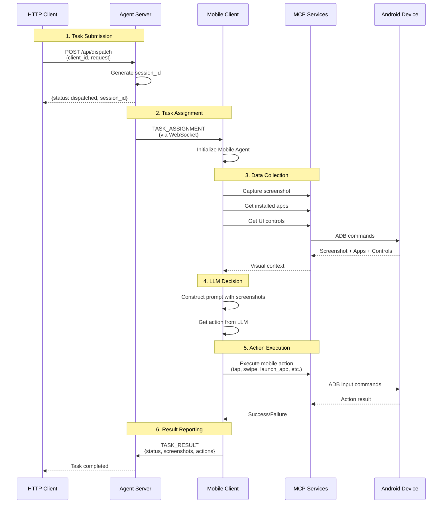

# ⚡ Quick Start: Mobile Agent

Get your Android device running as a UFO³ device agent in 10 minutes. This guide walks you through ADB setup, server/client configuration, and MCP service initialization for Android automation.

> **📚 Documentation Navigation:**
> 
> - **Architecture & Concepts:** [Mobile Agent Overview](../mobile/overview.md)
> - **State Management:** [State Machine](../mobile/state.md)
> - **Processing Pipeline:** [Processing Strategy](../mobile/strategy.md)
> - **Available Commands:** [MCP Commands Reference](../mobile/commands.md)
> - **Galaxy Integration:** [As Galaxy Device](../mobile/as_galaxy_device.md)

---

## 📋 Prerequisites

Before you begin, ensure you have:

- **Python 3.10+** installed on your computer
- **UFO repository** cloned from [GitHub](https://github.com/microsoft/UFO)
- **Android device** (physical device or emulator) with Android 5.0+ (API 21+)
- **ADB (Android Debug Bridge)** installed and accessible
- **USB debugging enabled** on your Android device (for physical devices)
- **Network connectivity** between server and client machines
- **LLM configured** in `config/ufo/agents.yaml` (see [Model Configuration](../configuration/models/overview.md))

| Component | Minimum Version | Verification Command |
|-----------|----------------|---------------------|
| Python | 3.10 | `python --version` |
| Android OS | 5.0 (API 21) | Check device settings |
| ADB | Latest | `adb --version` |
| LLM API Key | N/A | Check `config/ufo/agents.yaml` |

> **⚠️ LLM Configuration Required:** The Mobile Agent shares the same LLM configuration with the AppAgent. Before starting, ensure you have configured your LLM provider (OpenAI, Azure OpenAI, Gemini, Claude, etc.) and added your API keys to `config/ufo/agents.yaml`. See [Model Setup Guide](../configuration/models/overview.md) for detailed instructions.

---

## 📱 Step 0: Android Device Setup

You can use either a **physical Android device** or an **Android emulator**. Choose the setup method that fits your needs.

### Option A: Physical Android Device Setup

#### 1. Enable Developer Options

On your Android device:

1. Open **Settings** → **About phone**
2. Tap **Build number** 7 times
3. You'll see "You are now a developer!"

#### 2. Enable USB Debugging

1. Go to **Settings** → **System** → **Developer options**
2. Turn on **USB debugging**
3. (Optional) Turn on **Stay awake** (device won't sleep while charging)

#### 3. Connect Device to Computer

**Via USB Cable:**

```bash
# Connect device via USB
# On device, allow USB debugging when prompted

# Verify connection
adb devices
```

**Expected Output:**
```
List of devices attached
XXXXXXXXXXXXXX    device
```

**Via Wireless ADB (Android 11+):**

```bash
# On device: Settings → Developer options → Wireless debugging
# Get IP address and port (e.g., 192.168.1.100:5555)

# On computer: Connect to device
adb connect 192.168.1.100:5555

# Verify connection
adb devices
```

**Expected Output:**
```
List of devices attached
192.168.1.100:5555    device
```

### Option B: Android Emulator Setup

#### Option B1: Using Android Studio Emulator (Recommended)

**Step 1: Install Android Studio**

Download from: https://developer.android.com/studio

**Windows:**
```powershell
# Download Android Studio installer
# Run: android-studio-xxx.exe
# Follow installation wizard
```

**macOS:**
```bash
# Download Android Studio DMG
# Drag to Applications folder
# Open Android Studio
```

**Linux:**
```bash
# Download Android Studio tarball
tar -xzf android-studio-*.tar.gz
cd android-studio/bin
./studio.sh
```

**Step 2: Install Android SDK Components**

1. Open Android Studio
2. Go to **Tools** → **SDK Manager**
3. Install:
   - ✅ Android SDK Platform (API 33 or higher)
   - ✅ Android SDK Platform-Tools
   - ✅ Android SDK Build-Tools
   - ✅ Android Emulator

**Step 3: Create Virtual Device**

1. In Android Studio, click **Device Manager** (phone icon)
2. Click **Create Device**
3. Select hardware:
   - **Phone** category
   - Choose **Pixel 6** or **Pixel 7** (recommended)
   - Click **Next**

4. Select system image:
   - Choose **Release Name**: **Tiramisu** (Android 13, API 33) or newer
   - Click **Download** if not installed
   - Click **Next**

5. Configure AVD:
   - **AVD Name**: `Pixel_6_API_33` (or your choice)
   - **Startup orientation**: Portrait
   - **Graphics**: Automatic or Hardware
   - Click **Finish**

**Step 4: Start Emulator**

**From Android Studio:**
1. Open **Device Manager**
2. Click ▶️ (Play button) next to your AVD

**From Command Line:**
```bash
# List available emulators
emulator -list-avds

# Start emulator
emulator -avd Pixel_6_API_33 &
```

**Step 5: Verify ADB Connection**

```bash
# Wait for emulator to fully boot (~1-2 minutes)
adb devices
```

**Expected Output:**
```
List of devices attached
emulator-5554    device
```

#### Option B2: Using Genymotion (Alternative)

**Step 1: Install Genymotion**

Download from: https://www.genymotion.com/download/

```bash
# Free personal edition available
# Requires VirtualBox (auto-installed)
```

**Step 2: Create Virtual Device**

1. Open Genymotion
2. Click **+** (Add new device)
3. Sign in with Genymotion account (free)
4. Select device:
   - **Google Pixel 6** or similar
   - **Android 13.0** or newer
5. Click **Install**
6. Click **Start**

**Step 3: Verify ADB Connection**

```bash
adb devices
```

**Expected Output:**
```
List of devices attached
192.168.56.101:5555    device
```

### Verify Device is Ready

Run this test to ensure device is accessible:

```bash
# Get device model
adb shell getprop ro.product.model

# Get Android version
adb shell getprop ro.build.version.release

# Test screenshot capability
adb shell screencap -p /sdcard/test.png
adb pull /sdcard/test.png .
```

If all commands succeed, your device is ready! ✅

---

## 🔧 Step 1: Install ADB (Android Debug Bridge)

ADB is essential for communicating with Android devices. Choose your platform:

### Windows

**Option 1: Install via Android Studio (Recommended)**

ADB is included with Android Studio (see Step 0 Option B1).

After installation, add to PATH:

```powershell
# Add Android SDK platform-tools to PATH
# Default location:
$env:PATH += ";C:\Users\<YourUsername>\AppData\Local\Android\Sdk\platform-tools"

# Test
adb --version
```

**Option 2: Standalone ADB Installation**

```powershell
# Download platform-tools
# https://developer.android.com/studio/releases/platform-tools

# Extract to C:\adb
# Add to PATH:
$env:PATH += ";C:\adb"

# Test
adb --version
```

**Make PATH Permanent (Optional):**

1. Open **System Properties** → **Environment Variables**
2. Under **User variables**, edit **Path**
3. Add: `C:\Users\<YourUsername>\AppData\Local\Android\Sdk\platform-tools`
4. Click **OK**

### macOS

**Option 1: Via Homebrew (Recommended)**

```bash
# Install Homebrew (if not installed)
/bin/bash -c "$(curl -fsSL https://raw.githubusercontent.com/Homebrew/install/HEAD/install.sh)"

# Install ADB
brew install android-platform-tools

# Verify
adb --version
```

**Option 2: Via Android Studio**

ADB is included with Android Studio. Add to PATH:

```bash
# Add to ~/.zshrc or ~/.bash_profile
export PATH="$PATH:$HOME/Library/Android/sdk/platform-tools"

# Reload
source ~/.zshrc

# Test
adb --version
```

### Linux

**Ubuntu/Debian:**

```bash
sudo apt update
sudo apt install -y adb

# Verify
adb --version
```

**Fedora/RHEL:**

```bash
sudo dnf install android-tools

# Verify
adb --version
```

**Arch Linux:**

```bash
sudo pacman -S android-tools

# Verify
adb --version
```

### Verify ADB Installation

```bash
adb version
```

**Expected Output:**
```
Android Debug Bridge version 1.0.41
Version 34.0.5-10900879
```

---

## 📦 Step 2: Install Python Dependencies

Install all UFO dependencies:

```bash
cd /path/to/UFO
pip install -r requirements.txt
```

**Verify installation:**

```bash
python -c "import ufo; print('✅ UFO installed successfully')"
```

> **Tip:** For production deployments, use a virtual environment:
> 
> ```bash
> python -m venv venv
> 
> # Windows
> venv\Scripts\activate
> 
> # macOS/Linux
> source venv/bin/activate
> 
> pip install -r requirements.txt
> ```

---

## 🖥️ Step 3: Start Device Agent Server

**Server Component:** The Device Agent Server manages connections from Android devices and dispatches tasks.

### Basic Server Startup

On your computer (where Python is installed):

```bash
python -m ufo.server.app --port 5001 --platform mobile
```

**Expected Output:**

```console
INFO - Starting UFO Server on 0.0.0.0:5001
INFO - Platform: mobile
INFO - Log level: WARNING
INFO:     Started server process [12345]
INFO:     Waiting for application startup.
INFO:     Application startup complete.
INFO:     Uvicorn running on http://0.0.0.0:5001 (Press CTRL+C to quit)
```

Once you see "Uvicorn running", the server is ready at `ws://0.0.0.0:5001/ws`.

### Server Configuration Options

| Argument | Default | Description | Example |
|----------|---------|-------------|---------|
| `--port` | `5000` | Server listening port | `--port 5001` |
| `--host` | `0.0.0.0` | Bind address | `--host 127.0.0.1` |
| `--platform` | Auto | Platform override | `--platform mobile` |
| `--log-level` | `WARNING` | Logging verbosity | `--log-level DEBUG` |

**Custom Configuration Examples:**

```bash
# Different port
python -m ufo.server.app --port 8080 --platform mobile

# Localhost only
python -m ufo.server.app --host 127.0.0.1 --port 5001 --platform mobile

# Debug mode
python -m ufo.server.app --port 5001 --platform mobile --log-level DEBUG
```

### Verify Server is Running

```bash
curl http://localhost:5001/api/health
```

**Expected Response (when no clients connected):**

```json
{
  "status": "healthy",
  "online_clients": []
}
```

> **💡 Tip:** The `online_clients` list will be empty until you start and connect the Mobile Client in Step 5.

---

## 🔌 Step 4: Start MCP Services (Android Machine)

**MCP Service Component:** Two MCP servers provide Android device interaction capabilities. They must be running before starting the client.

> **💡 Learn More:** For detailed documentation on all available MCP commands and their usage, see the [MCP Commands Reference](../mobile/commands.md).

### Understanding the Two MCP Servers

MobileAgent uses **two separate MCP servers** for different responsibilities:

| Server | Port | Purpose | Tools |
|--------|------|---------|-------|
| **Data Collection** | 8020 | Screenshot, UI tree, device info, apps list | 5 read-only tools |
| **Action** | 8021 | Touch actions, typing, app launching | 8 control tools |

### Start Both MCP Servers

**Recommended: Start Both Servers Together**

On the machine with ADB access to your Android device:

```bash
python -m ufo.client.mcp.http_servers.mobile_mcp_server \
  --host localhost \
  --data-port 8020 \
  --action-port 8021 \
  --server both
```

**Expected Output:**

```console
====================================================================
UFO Mobile MCP Servers (Android)
Android device control via ADB and Model Context Protocol
====================================================================

Using ADB: adb
Checking ADB connection...

List of devices attached
emulator-5554    device

✅ Found 1 connected device(s)
====================================================================

🚀 Starting both servers on localhost (shared state)
   - Data Collection Server: localhost:8020
   - Action Server: localhost:8021

Note: Both servers share the same MobileServerState for caching

✅ Starting both servers in same process (shared MobileServerState)
   - Data Collection Server: localhost:8020
   - Action Server: localhost:8021

======================================================================
Both servers share MobileServerState cache. Press Ctrl+C to stop.
======================================================================

✅ Data Collection Server thread started
✅ Action Server thread started

======================================================================
Both servers are running. Press Ctrl+C to stop.
======================================================================
```

**Alternative: Start Servers Separately**

If needed, you can start each server in separate terminals:

**Terminal 1: Data Collection Server**
```bash
python -m ufo.client.mcp.http_servers.mobile_mcp_server \
  --host localhost \
  --data-port 8020 \
  --server data
```

**Terminal 2: Action Server**
```bash
python -m ufo.client.mcp.http_servers.mobile_mcp_server \
  --host localhost \
  --action-port 8021 \
  --server action
```

> **⚠️ Important:** When running servers separately, they won't share cached state, which may impact performance. Running both together is recommended.

### MCP Server Configuration Options

| Argument | Default | Description | Example |
|----------|---------|-------------|---------|
| `--host` | `localhost` | Server host | `--host 127.0.0.1` |
| `--data-port` | `8020` | Data collection server port | `--data-port 8020` |
| `--action-port` | `8021` | Action server port | `--action-port 8021` |
| `--server` | `both` | Which server(s) to start | `--server both` |
| `--adb-path` | `adb` | Path to ADB executable | `--adb-path /path/to/adb` |

### Verify MCP Servers are Running

**Check Data Collection Server:**
```bash
curl http://localhost:8020/health
```

**Check Action Server:**
```bash
curl http://localhost:8021/health
```

Both should return a health status response indicating the server is operational.

### What if ADB is not in PATH?

If ADB is not in your system PATH, specify the full path:

**Windows:**
```bash
python -m ufo.client.mcp.http_servers.mobile_mcp_server \
  --adb-path "C:\Users\YourUsername\AppData\Local\Android\Sdk\platform-tools\adb.exe" \
  --server both
```

**macOS:**
```bash
python -m ufo.client.mcp.http_servers.mobile_mcp_server \
  --adb-path "$HOME/Library/Android/sdk/platform-tools/adb" \
  --server both
```

**Linux:**
```bash
python -m ufo.client.mcp.http_servers.mobile_mcp_server \
  --adb-path /usr/bin/adb \
  --server both
```

---

## 📱 Step 5: Start Device Agent Client

**Client Component:** The Device Agent Client connects your Android device to the server and executes mobile automation tasks.

### Basic Client Startup

On your computer (same machine as MCP servers):

```bash
python -m ufo.client.client \
  --ws \
  --ws-server ws://localhost:5001/ws \
  --client-id mobile_phone_1 \
  --platform mobile
```

### Client Parameters Explained

| Parameter | Required | Description | Example |
|-----------|----------|-------------|---------|
| `--ws` | ✅ Yes | Enable WebSocket mode | `--ws` |
| `--ws-server` | ✅ Yes | Server WebSocket URL | `ws://localhost:5001/ws` |
| `--client-id` | ✅ Yes | **Unique** device identifier | `mobile_phone_1` |
| `--platform` | ✅ Yes | Platform type (must be `mobile`) | `--platform mobile` |

> **⚠️ Critical Requirements:**
> 
> 1. `--client-id` must be globally unique - No two devices can share the same ID
> 2. `--platform mobile` is mandatory - Without this flag, the Mobile Agent won't work correctly
> 3. Server address must be correct - Use actual server IP if not on localhost

### Understanding the WebSocket URL

The `--ws-server` parameter format is:

```
ws://<server-ip>:<server-port>/ws
```

Examples:

| Scenario | WebSocket URL | Description |
|----------|---------------|-------------|
| **Same Machine** | `ws://localhost:5001/ws` | Server and client on same computer |
| **Same Network** | `ws://192.168.1.100:5001/ws` | Server on local network |
| **Remote Server** | `ws://203.0.113.50:5001/ws` | Server on internet (public IP) |

### Connection Success Indicators

**Client Logs:**

```log
INFO - Platform detected/specified: mobile
INFO - UFO Client initialized for platform: mobile
INFO - [WS] Connecting to ws://localhost:5001/ws (attempt 1/5)
INFO - [WS] [AIP] Successfully registered as mobile_phone_1
INFO - [WS] Heartbeat loop started (interval: 30s)
```

**Server Logs:**

```log
INFO - [WS] ✅ Registered device client: mobile_phone_1
INFO - [WS] Device mobile_phone_1 platform: mobile
```

Client is connected and ready to receive tasks when you see "Successfully registered"! ✅

### Verify Connection

```bash
# Check connected clients on server
curl http://localhost:5001/api/clients
```

**Expected Response:**

```json
{
  "online_clients": ["mobile_phone_1"]
}
```

> **Note:** The response shows only client IDs. For detailed information about each client, check the server logs.

---

## 🎯 Step 6: Dispatch Tasks via HTTP API

Once the server, client, and MCP services are all running, you can dispatch tasks to your Android device through the server's HTTP API.

### API Endpoint

```
POST http://<server-ip>:<server-port>/api/dispatch
```

### Request Format

```json
{
  "client_id": "mobile_phone_1",
  "request": "Your natural language task description",
  "task_name": "optional_task_identifier"
}
```

### Example 1: Launch an App

**Using cURL:**
```bash
curl -X POST http://localhost:5001/api/dispatch \
  -H "Content-Type: application/json" \
  -d '{
    "client_id": "mobile_phone_1",
    "request": "Open Google Chrome browser",
    "task_name": "launch_chrome"
  }'
```

**Using Python:**
```python
import requests

response = requests.post(
    "http://localhost:5001/api/dispatch",
    json={
        "client_id": "mobile_phone_1",
        "request": "Open Google Chrome browser",
        "task_name": "launch_chrome"
    }
)
print(response.json())
```

**Successful Response:**

```json
{
  "status": "dispatched",
  "task_name": "launch_chrome",
  "client_id": "mobile_phone_1",
  "session_id": "550e8400-e29b-41d4-a716-446655440000"
}
```

### Example 2: Search on Maps

```bash
curl -X POST http://localhost:5001/api/dispatch \
  -H "Content-Type: application/json" \
  -d '{
    "client_id": "mobile_phone_1",
    "request": "Open Google Maps and search for coffee shops nearby",
    "task_name": "search_coffee"
  }'
```

### Example 3: Type and Submit Text

```bash
curl -X POST http://localhost:5001/api/dispatch \
  -H "Content-Type: application/json" \
  -d '{
    "client_id": "mobile_phone_1",
    "request": "Open Chrome, search for weather forecast, and show me the results",
    "task_name": "check_weather"
  }'
```

### Example 4: Take Screenshot

```bash
curl -X POST http://localhost:5001/api/dispatch \
  -H "Content-Type: application/json" \
  -d '{
    "client_id": "mobile_phone_1",
    "request": "Take a screenshot of the current screen",
    "task_name": "capture_screen"
  }'
```

### Task Execution Flow



### Request Parameters

| Field | Required | Type | Description | Example |
|-------|----------|------|-------------|---------|
| `client_id` | ✅ Yes | string | Target mobile device ID (must match `--client-id`) | `"mobile_phone_1"` |
| `request` | ✅ Yes | string | Natural language task description | `"Open Chrome"` |
| `task_name` | ❌ Optional | string | Unique task identifier (auto-generated if omitted) | `"task_001"` |

> **⚠️ Client Must Be Online:** If the `client_id` is not connected, you'll receive:
> ```json
> {
>   "detail": "Client not online"
> }
> ```
> 
> Verify the client is connected:
> ```bash
> curl http://localhost:5001/api/clients
> ```

---

## 🌌 Step 7: Configure as UFO³ Galaxy Device

To use the Mobile Agent as a managed device within the **UFO³ Galaxy** multi-tier framework, you need to register it in the `devices.yaml` configuration file.

> **📖 Detailed Guide:** For comprehensive information on using Mobile Agent in Galaxy, including multi-device workflows and advanced configuration, see [Using Mobile Agent as Galaxy Device](../mobile/as_galaxy_device.md).

### Device Configuration File

The Galaxy configuration is located at:

```
config/galaxy/devices.yaml
```

### Add Mobile Agent Configuration

Edit `config/galaxy/devices.yaml` and add your Mobile agent:

```yaml
devices:
  - device_id: "mobile_phone_1"
    server_url: "ws://localhost:5001/ws"
    os: "mobile"
    capabilities:
      - "mobile"
      - "android"
      - "messaging"
      - "maps"
      - "camera"
    metadata:
      os: "mobile"
      device_type: "phone"
      android_version: "13"
      screen_size: "1080x2400"
      installed_apps:
        - "com.android.chrome"
        - "com.google.android.apps.maps"
        - "com.whatsapp"
      description: "Android phone for mobile automation"
    auto_connect: true
    max_retries: 5
```

### Configuration Fields Explained

| Field | Required | Type | Description | Example |
|-------|----------|------|-------------|---------|
| `device_id` | ✅ Yes | string | **Must match client `--client-id`** | `"mobile_phone_1"` |
| `server_url` | ✅ Yes | string | **Must match server WebSocket URL** | `"ws://localhost:5001/ws"` |
| `os` | ✅ Yes | string | Operating system | `"mobile"` |
| `capabilities` | ❌ Optional | list | Device capabilities | `["mobile", "android"]` |
| `metadata` | ❌ Optional | dict | Custom metadata | See below |
| `auto_connect` | ❌ Optional | boolean | Auto-connect on Galaxy startup | `true` |
| `max_retries` | ❌ Optional | integer | Connection retry attempts | `5` |

### Metadata Fields (Custom)

The `metadata` section provides context to the LLM:

| Field | Purpose | Example |
|-------|---------|---------|
| `device_type` | Phone, tablet, emulator | `"phone"` |
| `android_version` | OS version | `"13"` |
| `screen_size` | Resolution | `"1080x2400"` |
| `installed_apps` | Available apps | `["com.android.chrome", ...]` |
| `description` | Human-readable description | `"Personal phone"` |

### Multiple Mobile Devices Example

```yaml
devices:
  # Personal Phone
  - device_id: "mobile_phone_personal"
    server_url: "ws://192.168.1.100:5001/ws"
    os: "mobile"
    capabilities:
      - "mobile"
      - "android"
      - "messaging"
      - "whatsapp"
      - "maps"
    metadata:
      os: "mobile"
      device_type: "phone"
      android_version: "13"
      installed_apps:
        - "com.whatsapp"
        - "com.google.android.apps.maps"
      description: "Personal Android phone"
    auto_connect: true
    max_retries: 5

  # Work Phone
  - device_id: "mobile_phone_work"
    server_url: "ws://192.168.1.101:5002/ws"
    os: "mobile"
    capabilities:
      - "mobile"
      - "android"
      - "email"
      - "teams"
    metadata:
      os: "mobile"
      device_type: "phone"
      android_version: "12"
      installed_apps:
        - "com.microsoft.office.outlook"
        - "com.microsoft.teams"
      description: "Work Android phone"
    auto_connect: true
    max_retries: 5

  # Tablet
  - device_id: "mobile_tablet_home"
    server_url: "ws://192.168.1.102:5003/ws"
    os: "mobile"
    capabilities:
      - "mobile"
      - "android"
      - "tablet"
      - "media"
    metadata:
      os: "mobile"
      device_type: "tablet"
      android_version: "13"
      screen_size: "2560x1600"
      installed_apps:
        - "com.netflix.mediaclient"
      description: "Home tablet for media"
    auto_connect: true
    max_retries: 5
```

### Critical Requirements

> **⚠️ Configuration Validation - These fields MUST match exactly:**
> 
> 1. **`device_id` in YAML** ↔ **`--client-id` in client command**
> 2. **`server_url` in YAML** ↔ **`--ws-server` in client command**
> 
> **If these don't match, Galaxy cannot control the device!**

### Using Galaxy to Control Mobile Agents

Once configured, launch Galaxy:

```bash
python -m galaxy --interactive
```

**Galaxy will:**
1. ✅ Load device configuration from `config/galaxy/devices.yaml`
2. ✅ Connect to all configured Android devices
3. ✅ Orchestrate multi-device tasks
4. ✅ Route tasks based on capabilities

> **ℹ️ Galaxy Documentation:** For detailed Galaxy usage, see:
> 
> - [Galaxy Overview](../galaxy/overview.md)
> - [Galaxy Quick Start](quick_start_galaxy.md)
> - [Mobile Agent as Galaxy Device](../mobile/as_galaxy_device.md)

---

## � Understanding Mobile Agent Internals

Now that you have Mobile Agent running, you may want to understand how it works under the hood:

### State Machine

Mobile Agent uses a **3-state finite state machine** to manage task execution:

- **CONTINUE** - Active execution, processing user requests
- **FINISH** - Task completed successfully
- **FAIL** - Unrecoverable error occurred

Learn more: [State Machine Documentation](../mobile/state.md)

### Processing Pipeline

During the CONTINUE state, Mobile Agent executes a **4-phase pipeline**:

1. **Data Collection** - Capture screenshots, get apps, collect UI controls
2. **LLM Interaction** - Send visual context to LLM for decision making
3. **Action Execution** - Execute mobile actions (tap, swipe, type, etc.)
4. **Memory Update** - Record actions and results for context

Learn more: [Processing Strategy Documentation](../mobile/strategy.md)

### Available Commands

Mobile Agent uses **13 MCP commands** across two servers:

- **Data Collection Server (8020)**: 5 read-only commands
- **Action Server (8021)**: 8 control commands

Learn more: [MCP Commands Reference](../mobile/commands.md)

---

## �🐛 Common Issues & Troubleshooting

### Issue 1: ADB Device Not Found

**Error: No Devices Detected**

Symptoms:
```bash
$ adb devices
List of devices attached
# Empty list
```

**Solutions:**

**For Physical Devices:**

1. **Check USB connection:**
   - Use a different USB cable (some cables are charge-only)
   - Try a different USB port on your computer
   - Ensure USB debugging is enabled on device

2. **Authorize computer on device:**
   - Disconnect and reconnect USB
   - On device, tap "Allow USB debugging" when prompted
   - Check "Always allow from this computer"

3. **Restart ADB server:**
   ```bash
   adb kill-server
   adb start-server
   adb devices
   ```

4. **Check USB driver (Windows):**
   - Install Google USB Driver via Android Studio SDK Manager
   - Or install device-specific driver from manufacturer

**For Emulators:**

1. **Wait for emulator to fully boot** (can take 1-2 minutes)

2. **Restart emulator:**
   - Close emulator completely
   - Start emulator again from Android Studio or command line

3. **Check emulator is running:**
   ```bash
   emulator -list-avds
   emulator -avd Pixel_6_API_33
   ```

### Issue 2: MCP Server Cannot Connect to Device

**Error: ADB Connection Failed**

Symptoms:
```log
ERROR - Failed to execute ADB command
ERROR - Device not accessible
```

**Solutions:**

1. **Verify ADB connection first:**
   ```bash
   adb devices
   ```
   Device should show "device" status (not "offline" or "unauthorized")

2. **Test ADB commands manually:**
   ```bash
   adb shell getprop ro.product.model
   adb shell screencap -p /sdcard/test.png
   ```

3. **Restart MCP servers with debug output:**
   ```bash
   # Kill existing servers
   pkill -f mobile_mcp_server
   
   # Start with explicit ADB path
   python -m ufo.client.mcp.http_servers.mobile_mcp_server \
     --adb-path $(which adb) \
     --server both
   ```

4. **Check device permissions:**
   - Ensure USB debugging is still authorized
   - Revoke and re-grant USB debugging authorization on device

### Issue 3: Client Cannot Connect to Server

**Error: Connection Refused or Failed**

Symptoms:
```log
ERROR - [WS] Failed to connect to ws://localhost:5001/ws
Connection refused
```

**Solutions:**

1. **Verify server is running:**
   ```bash
   curl http://localhost:5001/api/health
   ```
   
   Should return:
   ```json
   {
     "status": "healthy",
     "online_clients": []
   }
   ```

2. **Check server address:**
   - If server and client are on different machines, use server's IP address
   - Replace `localhost` with actual IP address (e.g., `ws://192.168.1.100:5001/ws`)
   - Ensure the port number matches the server's `--port` argument

3. **Check firewall settings:**
   ```bash
   # Windows: Allow port 5001
   netsh advfirewall firewall add rule name="UFO Server" dir=in action=allow protocol=TCP localport=5001
   
   # macOS: System Preferences → Security & Privacy → Firewall → Firewall Options
   
   # Linux (Ubuntu):
   sudo ufw allow 5001/tcp
   ```

### Issue 4: Missing `--platform mobile` Flag

**Error: Incorrect Agent Type**

Symptoms:
- Client connects but cannot execute mobile commands
- Server logs show wrong platform type
- Tasks fail with "unsupported operation" errors

**Solution:**

Always include `--platform mobile` when starting the client:

```bash
# Wrong (missing platform)
python -m ufo.client.client --ws --client-id mobile_phone_1

# Correct
python -m ufo.client.client \
  --ws \
  --client-id mobile_phone_1 \
  --platform mobile
```

### Issue 5: Screenshot Capture Fails

**Error: Cannot Capture Screenshot**

Symptoms:
```log
ERROR - Failed to capture screenshot
ERROR - screencap command failed
```

**Solutions:**

1. **Test screenshot manually:**
   ```bash
   adb shell screencap -p /sdcard/test.png
   adb pull /sdcard/test.png .
   ```

2. **Check device storage:**
   ```bash
   adb shell df -h /sdcard
   ```
   Ensure sufficient space on device

3. **Check permissions:**
   ```bash
   adb shell ls -l /sdcard
   ```

4. **Try alternative screenshot method:**
   ```bash
   adb exec-out screencap -p > screenshot.png
   ```

### Issue 6: UI Controls Not Found

**Error: Control Information Missing**

Symptoms:
```log
WARNING - Failed to get UI controls
WARNING - UI tree dump failed
```

**Solutions:**

1. **Test UI dump manually:**
   ```bash
   adb shell uiautomator dump /sdcard/window_dump.xml
   adb shell cat /sdcard/window_dump.xml
   ```

2. **Enable accessibility services:**
   - Some apps require accessibility services for UI automation
   - Settings → Accessibility → Enable required services

3. **Update Android WebView:**
   - Old WebView versions may cause UI dump issues
   - Update via Play Store: Android System WebView

4. **Restart device:**
   ```bash
   adb reboot
   # Wait for device to restart
   adb wait-for-device
   ```

### Issue 7: Emulator Too Slow

**Error: Performance Issues**

Symptoms:
- Emulator lags or freezes
- Actions take very long to execute
- Timeouts occur frequently

**Solutions:**

1. **Enable Hardware Acceleration:**
   - **Windows:** Ensure Hyper-V or Intel HAXM is enabled
   - **macOS:** Hypervisor.framework is used automatically
   - **Linux:** Install KVM

2. **Allocate More Resources:**
   - In Android Studio AVD Manager, edit AVD
   - Increase RAM to 2048 MB or higher
   - Increase VM heap to 512 MB
   - Set Graphics to "Hardware - GLES 2.0"

3. **Use x86_64 System Image:**
   - Faster than ARM images
   - Download x86_64 image in SDK Manager

4. **Reduce Screen Resolution:**
   - Edit AVD settings
   - Choose lower resolution (e.g., 720x1280 instead of 1080x2400)

### Issue 8: Multiple Devices Connected

**Error: More Than One Device**

Symptoms:
```bash
$ adb devices
List of devices attached
emulator-5554    device
192.168.1.100:5555    device
```

**Solutions:**

1. **Specify device for ADB:**
   ```bash
   # Use emulator
   export ANDROID_SERIAL=emulator-5554
   
   # Use physical device
   export ANDROID_SERIAL=192.168.1.100:5555
   ```

2. **Disconnect other devices:**
   ```bash
   # Disconnect wireless device
   adb disconnect 192.168.1.100:5555
   ```

3. **Run separate MCP servers:**
   ```bash
   # Server for emulator
   ANDROID_SERIAL=emulator-5554 python -m ufo.client.mcp.http_servers.mobile_mcp_server --data-port 8020 --action-port 8021 --server both
   
   # Server for physical device
   ANDROID_SERIAL=192.168.1.100:5555 python -m ufo.client.mcp.http_servers.mobile_mcp_server --data-port 8022 --action-port 8023 --server both
   ```

---

## 📚 Next Steps

You've successfully set up a Mobile Agent! Explore these topics to deepen your understanding:

### Immediate Next Steps

| Priority | Topic | Time | Link |
|----------|-------|------|------|
| 🥇 | **Mobile Agent Architecture** | 10 min | [Overview](../mobile/overview.md) |
| 🥈 | **State Machine & Processing** | 15 min | [State Machine](../mobile/state.md) |
| 🥉 | **MCP Commands Reference** | 15 min | [Commands](../mobile/commands.md) |

### Advanced Topics

| Topic | Description | Link |
|-------|-------------|------|
| **Processing Strategy** | 4-phase pipeline (Data, LLM, Action, Memory) | [Strategy](../mobile/strategy.md) |
| **Galaxy Integration** | Multi-device orchestration with UFO³ | [As Galaxy Device](../mobile/as_galaxy_device.md) |
| **MCP Protocol Details** | Deep dive into mobile interaction protocol | [Commands](../mobile/commands.md) |

### Production Deployment

| Best Practice | Description |
|---------------|-------------|
| **Persistent ADB** | Keep ADB connection stable for physical devices |
| **Emulator Management** | Automate emulator lifecycle (start/stop/reset) |
| **Screenshot Storage** | Configure log paths and cleanup policies in `config/ufo/system.yaml` |
| **Security** | Use secure WebSocket (wss://) for remote deployments |

> **💡 Learn More:** For comprehensive understanding of the Mobile Agent architecture and processing flow, see the [Mobile Agent Overview](../mobile/overview.md).

---

## ✅ Summary

Congratulations! You've successfully:

✅ Set up Android device (physical or emulator)  
✅ Installed ADB (Android Debug Bridge)  
✅ Installed Python dependencies  
✅ Started the Device Agent Server  
✅ Launched MCP services (data collection + action)  
✅ Connected Mobile Device Agent Client  
✅ Dispatched mobile automation tasks via HTTP API  
✅ (Optional) Configured device in Galaxy  

**Your Mobile Agent is Ready**

You can now:

- 📱 Automate Android apps remotely
- 🖼️ Capture and analyze screenshots
- 🎯 Interact with UI controls precisely
- 🌌 Integrate with UFO³ Galaxy for cross-platform workflows

**Start exploring mobile automation!** 🚀

---

## 💡 Pro Tips

### Quick Start Command Summary

**Start everything in order:**

```bash
# Terminal 1: Start server
python -m ufo.server.app --port 5001 --platform mobile

# Terminal 2: Start MCP services
python -m ufo.client.mcp.http_servers.mobile_mcp_server --server both

# Terminal 3: Start client
python -m ufo.client.client --ws --ws-server ws://localhost:5001/ws --client-id mobile_phone_1 --platform mobile

# Terminal 4: Dispatch task
curl -X POST http://localhost:5001/api/dispatch \
  -H "Content-Type: application/json" \
  -d '{"client_id": "mobile_phone_1", "request": "Open Chrome browser"}'
```

### Development Shortcuts

**Create shell scripts for common operations:**

**Windows (PowerShell):**
```powershell
# start-mobile-agent.ps1
Start-Process powershell -ArgumentList "-NoExit", "-Command", "python -m ufo.server.app --port 5001 --platform mobile"
Start-Sleep 2
Start-Process powershell -ArgumentList "-NoExit", "-Command", "python -m ufo.client.mcp.http_servers.mobile_mcp_server --server both"
Start-Sleep 2
Start-Process powershell -ArgumentList "-NoExit", "-Command", "python -m ufo.client.client --ws --ws-server ws://localhost:5001/ws --client-id mobile_phone_1 --platform mobile"
```

**macOS/Linux (Bash):**
```bash
#!/bin/bash
# start-mobile-agent.sh

# Start server in background
python -m ufo.server.app --port 5001 --platform mobile &
sleep 2

# Start MCP services in background
python -m ufo.client.mcp.http_servers.mobile_mcp_server --server both &
sleep 2

# Start client in foreground
python -m ufo.client.client --ws --ws-server ws://localhost:5001/ws --client-id mobile_phone_1 --platform mobile
```

Make executable:
```bash
chmod +x start-mobile-agent.sh
./start-mobile-agent.sh
```

### Testing Your Setup

**Quick test to verify everything works:**

```bash
# Test 1: Check ADB
adb devices
# Should show your device

# Test 2: Check Server
curl http://localhost:5001/api/health
# Should return {"status": "healthy"}

# Test 3: Check MCP
curl http://localhost:8020/health
curl http://localhost:8021/health
# Should return health status

# Test 4: Check Client
curl http://localhost:5001/api/clients
# Should show mobile_phone_1

# Test 5: Dispatch simple task
curl -X POST http://localhost:5001/api/dispatch \
  -H "Content-Type: application/json" \
  -d '{"client_id": "mobile_phone_1", "request": "Take a screenshot"}'
# Should return dispatched status
```

**Happy Mobile Automation! 🎉**
