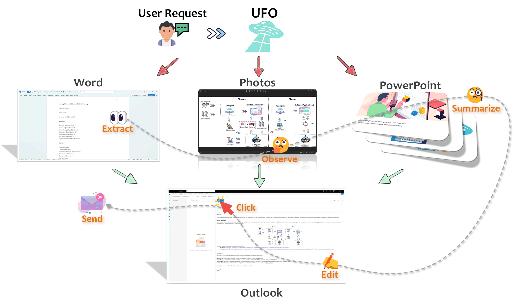

# Welcome to UFO's Document!

[](https://arxiv.org/abs/2402.07939)&ensp;
&ensp;
[](https://opensource.org/licenses/MIT)&ensp;
[](https://github.com/microsoft/UFO)&ensp;
[](https://www.youtube.com/watch?v=QT_OhygMVXU)&ensp;


## Introduction

**UFO** is a **UI-Focused** multi-agent framework to fulfill user requests on **Windows OS** by seamlessly navigating and operating within individual or spanning multiple applications.

<h1 align="center">
     
</h1>


## 🕌 Framework
<b>UFO</b>  operates as a multi-agent framework, encompassing:

- <b>HostAgent 🤖</b>, tasked with choosing an application for fulfilling user requests. This agent may also switch to a different application when a request spans multiple applications, and the task is partially completed in the preceding application. 

- <b>AppAgent 👾</b>, responsible for iteratively executing actions on the selected applications until the task is successfully concluded within a specific application. 

- <b>Application Automator 🎮</b>, is tasked with translating actions from HostAgent and AppAgent into interactions with the application and through UI controls, native APIs or AI tools. Check out more details [here](./automator/overview.md).

Both agents leverage the multi-modal capabilities of Visual Language Model (VLM) to comprehend the application UI and fulfill the user's request. For more details, please consult our [technical report](https://arxiv.org/abs/2402.07939).
<h1 align="center">
     
</h1>

## 🚀 Quick Start
Please follow the [Quick Start Guide](./getting_started/quick_start.md) to get started with UFO.


## 💥 Highlights

- [x] **First Windows Agent** - UFO is the pioneering agent framework capable of translating user requests in natural language into actionable operations on Windows OS.
- [x] **Agent as an Expert** - UFO is enhanced by Retrieval Augmented Generation (RAG) from heterogeneous sources, including offline help documents, online search engines, and human demonstrations, making the agent an application "expert".
- [x] **Rich Skill Set** - UFO is equipped with a diverse set of skills to support comprehensive automation, such as mouse, keyboard, native API, and "Copilot".
- [x] **Interactive Mode** - UFO facilitates multiple sub-requests from users within the same session, enabling the seamless completion of complex tasks.
- [x] **Agent Customization** - UFO allows users to customize their own agents by providing additional information. The agent will proactively query users for details when necessary to better tailor its behavior.
- [x] **Scalable AppAgent Creation** - UFO offers extensibility, allowing users and app developers to create their own AppAgents in an easy and scalable way.

## 🌐 Media Coverage 

Check out our official deep dive of UFO on [this Youtube Video](https://www.youtube.com/watch?v=QT_OhygMVXU).


UFO sightings have garnered attention from various media outlets, including:

- [Microsoft's UFO abducts traditional user interfaces for a smarter Windows experience](https://the-decoder.com/microsofts-ufo-abducts-traditional-user-interfaces-for-a-smarter-windows-experience/)

- [🚀 UFO & GPT-4-V: Sit back and relax, mientras GPT lo hace todo🌌](https://www.linkedin.com/posts/gutierrezfrancois_ai-ufo-microsoft-activity-7176819900399652865-pLoo?utm_source=share&utm_medium=member_desktop)

- [The AI PC - The Future of Computers? - Microsoft UFO](https://www.youtube.com/watch?v=1k4LcffCq3E)

- [下一代Windows系统曝光：基于GPT-4V，Agent跨应用调度，代号UFO](https://baijiahao.baidu.com/s?id=1790938358152188625&wfr=spider&for=pc)

- [下一代智能版 Windows 要来了？微软推出首个 Windows Agent，命名为 UFO！](https://blog.csdn.net/csdnnews/article/details/136161570)

- [Microsoft発のオープンソース版「UFO」登場！　Windowsを自動操縦するAIエージェントを試す](https://internet.watch.impress.co.jp/docs/column/shimizu/1570581.html)

## ❓Get help 
* ❔GitHub Issues (prefered)
* For other communications, please contact [ufo-agent@microsoft.com](mailto:ufo-agent@microsoft.com)
---

<!-- ## 🎬 Demo Examples

We present two demo videos that complete user request on Windows OS using UFO. For more case study, please consult our [technical report](https://arxiv.org/abs/2402.07939).

#### 1️⃣🗑️ Example 1: Deleting all notes on a PowerPoint presentation.
In this example, we will demonstrate how to efficiently use UFO to delete all notes on a PowerPoint presentation with just a few simple steps. Explore this functionality to enhance your productivity and work smarter, not harder!

<iframe width="560" height="315" src="https://github.com/microsoft/UFO/assets/11352048/cf60c643-04f7-4180-9a55-5fb240627834" frameborder="0" allowfullscreen></iframe>

&nbsp;

#### 2️⃣📧 Example 2: Composing an email using text from multiple sources.
In this example, we will demonstrate how to utilize UFO to extract text from Word documents, describe an image, compose an email, and send it seamlessly. Enjoy the versatility and efficiency of cross-application experiences with UFO!

<iframe width="560" height="315" src="https://github.com/microsoft/UFO/assets/11352048/aa41ad47-fae7-4334-8e0b-ba71c4fc32e0" frameborder="0" allowfullscreen></iframe> -->

&nbsp;
## 📚 Citation
Our technical report paper can be found [here](https://arxiv.org/abs/2402.07939). Note that previous HostAgent and AppAgent in the paper are renamed to HostAgent and AppAgent in the code base to better reflect their functions.
If you use UFO in your research, please cite our paper:
```
@article{ufo,
  title={{UFO: A UI-Focused Agent for Windows OS Interaction}},
  author={Zhang, Chaoyun and Li, Liqun and He, Shilin and Zhang, Xu and Qiao, Bo and  Qin, Si and Ma, Minghua and Kang, Yu and Lin, Qingwei and Rajmohan, Saravan and Zhang, Dongmei and Zhang, Qi},
  journal={arXiv preprint arXiv:2402.07939},
  year={2024}
}
```

## 🎨 Related Projects

If you're interested in data analytics agent frameworks, check out [TaskWeaver](https://github.com/microsoft/TaskWeaver?tab=readme-ov-file), a code-first LLM agent framework designed for seamlessly planning and executing data analytics tasks.

For more information on GUI agents, refer to our survey paper: [Large Language Model-Brained GUI Agents: A Survey](https://arxiv.org/abs/2411.18279). You can also explore the survey through:
- [GitHub Repository](https://github.com/vyokky/LLM-Brained-GUI-Agents-Survey)
- [Searchable Website](https://vyokky.github.io/LLM-Brained-GUI-Agents-Survey/)

<!-- Google tag (gtag.js) -->
<script async src="https://www.googletagmanager.com/gtag/js?id=G-FX17ZGJYGC"></script>
<script>
  window.dataLayer = window.dataLayer || [];
  function gtag(){dataLayer.push(arguments);}
  gtag('js', new Date());

  gtag('config', 'G-FX17ZGJYGC');
</script>