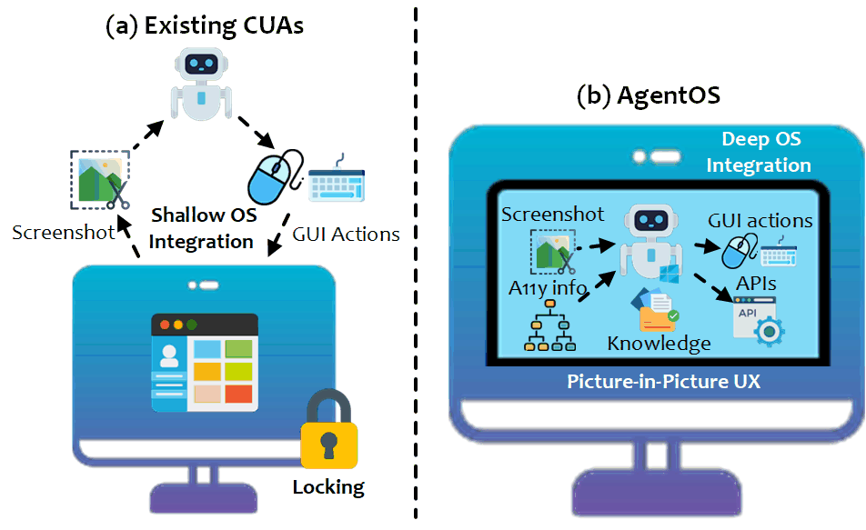

# Welcome to UFO²'s Document!

[](https://arxiv.org/abs/2504.14603)&ensp;
&ensp;
[](https://opensource.org/licenses/MIT)&ensp;
[](https://github.com/microsoft/UFO)&ensp;
[](https://www.youtube.com/watch?v=QT_OhygMVXU)&ensp;


## Introduction
UFO now evolves into **UFO²** (Desktop AgentOS), a new generation of agent framework that can run on Windows desktop OS. It is designed to **automate** and **orchestrate** tasks across multiple applications, enabling users to seamlessly interact with their operating system using natural language commands beyond just **UI automation**.

<h1 align="center">
     
</h1>


## ✨ Key Capabilities

| Feature                          | Description |
|----------------------------------|-------------|
| **Deep OS Integration**          | Combines Windows UIA, Win32 and WinCOM for first‑class control detection and native commands. |
| **Picture‑in‑Picture Desktop** *(coming soon)* | Automation runs in a sandboxed virtual desktop so you can keep using your main screen. |
| [**Hybrid GUI + API Actions**](./automator/overview.md)     | Chooses native APIs when available, falls back to clicks/keystrokes when not—fast *and* robust. |
| [**Speculative Multi‑Action**](./advanced_usage/multi_action.md)     | Bundles several predicted steps into one LLM call, validated live—up to **51 % fewer** queries. |
| [**Continuous Knowledge Substrate**](./advanced_usage/reinforce_appagent/overview.md) | Mixes docs, Bing search, user demos and execution traces via RAG for agents that learn over time. |
| [**UIA + Visual Control Detection**](./advanced_usage/control_detection/hybrid_detection.md) | Detects standard *and* custom controls with a hybrid UIA + vision pipeline. |

Please refer to the [UFO² paper](https://arxiv.org/abs/2504.14603) and the hyperlinked sections for more details on each capability.


---


## 🏗️ Architecture overview
<p align="center">
  
</p>


UFO² operates as a **Desktop AgentOS**, encompassing a multi-agent framework that includes:

1. **HostAgent** – Parses the natural‑language goal, launches the necessary applications, spins up / coordinates AppAgents, and steers a global finite‑state machine (FSM).  
2. **AppAgents** – One per application; each runs a ReAct loop with multimodal perception, hybrid control detection, retrieval‑augmented knowledge, and the **Puppeteer** executor that chooses between GUI actions and native APIs.  
3. **Knowledge Substrate** – Blends offline documentation, online search, demonstrations, and execution traces into a vector store that is retrieved on‑the‑fly at inference.  
4. **Speculative Executor** – Slashes LLM latency by predicting batches of likely actions and validating them against live UIA state in a single shot.  
5. **Picture‑in‑Picture Desktop** *(coming soon)* – Runs the agent in an isolated virtual desktop so your main workspace and input devices remain untouched.

For a deep dive see our [technical report](https://arxiv.org/abs/2504.14603).

---

## 🚀 Quick Start
Please follow the [Quick Start Guide](./getting_started/quick_start.md) to get started with UFO.

!!! note    
    This repository is intended solely for research purposes. The code provided herein is not designed, tested, or validated for third-party production use. Users are expected to exercise their own judgment and due diligence when utilizing any part of this codebase. Microsoft is committed to building Responsible and Trustworthy AI. To learn more about our principles and practices, please refer to our [principles and approach](https://www.microsoft.com/en-us/ai/principles-and-approach).


## 🌐 Media Coverage 

Check out our official deep dive of UFO on [this Youtube Video](https://www.youtube.com/watch?v=QT_OhygMVXU).


UFO sightings have garnered attention from various media outlets, including:

- [微软正式开源UFO²，Windows桌面迈入「AgentOS 时代」](https://www.jiqizhixin.com/articles/2025-05-06-13)

- [Microsoft's UFO abducts traditional user interfaces for a smarter Windows experience](https://the-decoder.com/microsofts-ufo-abducts-traditional-user-interfaces-for-a-smarter-windows-experience/)

- [🚀 UFO & GPT-4-V: Sit back and relax, mientras GPT lo hace todo🌌](https://www.linkedin.com/posts/gutierrezfrancois_ai-ufo-microsoft-activity-7176819900399652865-pLoo?utm_source=share&utm_medium=member_desktop)

- [The AI PC - The Future of Computers? - Microsoft UFO](https://www.youtube.com/watch?v=1k4LcffCq3E)

- [下一代Windows系统曝光：基于GPT-4V，Agent跨应用调度，代号UFO](https://baijiahao.baidu.com/s?id=1790938358152188625&wfr=spider&for=pc)

- [下一代智能版 Windows 要来了？微软推出首个 Windows Agent，命名为 UFO！](https://blog.csdn.net/csdnnews/article/details/136161570)

- [Microsoft発のオープンソース版「UFO」登場！　Windowsを自動操縦するAIエージェントを試す](https://internet.watch.impress.co.jp/docs/column/shimizu/1570581.html)

## ❓Get help 
* ❔GitHub Issues (prefered)
* For other communications, please contact [ufo-agent@microsoft.com](mailto:ufo-agent@microsoft.com)
---

## 📚 Citation

If you build on this work, please cite our the AgentOS framework:

**UFO² – The Desktop AgentOS (2025)**  
<https://arxiv.org/abs/2504.14603>
```bibtex
@article{zhang2025ufo2,
  title   = {{UFO2: The Desktop AgentOS}},
  author  = {Zhang, Chaoyun and Huang, He and Ni, Chiming and Mu, Jian and Qin, Si and He, Shilin and Wang, Lu and Yang, Fangkai and Zhao, Pu and Du, Chao and Li, Liqun and Kang, Yu and Jiang, Zhao and Zheng, Suzhen and Wang, Rujia and Qian, Jiaxu and Ma, Minghua and Lou, Jian-Guang and Lin, Qingwei and Rajmohan, Saravan and Zhang, Dongmei},
  journal = {arXiv preprint arXiv:2504.14603},
  year    = {2025}
}
```

**UFO – A UI‑Focused Agent for Windows OS Interaction (2024)**  
<https://arxiv.org/abs/2402.07939>
```bibtex
@article{zhang2024ufo,
  title   = {{UFO: A UI-Focused Agent for Windows OS Interaction}},
  author  = {Zhang, Chaoyun and Li, Liqun and He, Shilin and Zhang, Xu and Qiao, Bo and Qin, Si and Ma, Minghua and Kang, Yu and Lin, Qingwei and Rajmohan, Saravan and Zhang, Dongmei and Zhang, Qi},
  journal = {arXiv preprint arXiv:2402.07939},
  year    = {2024}
}
```


---


## 📝 Roadmap

The UFO² team is actively working on the following features and improvements:

- [ ] **Picture‑in‑Picture Mode** – Completed and will be available in the next release  
- [ ] **AgentOS‑as‑a‑Service** – Completed and will be available in the next release  
- [ ] **Auto‑Debugging Toolkit** – Completed and will be available in the next release  
- [ ] **Integration with MCP and Agent2Agent Communication** – Planned; under implementation  

---

## 🎨 Related Projects
- **TaskWeaver** — a code‑first LLM agent for data analytics: <https://github.com/microsoft/TaskWeaver>  
- **LLM‑Brained GUI Agents: A Survey**: <https://arxiv.org/abs/2411.18279> • [GitHub](https://github.com/vyokky/LLM-Brained-GUI-Agents-Survey) • [Interactive site](https://vyokky.github.io/LLM-Brained-GUI-Agents-Survey/)

---
<!-- Google tag (gtag.js) -->
<script async src="https://www.googletagmanager.com/gtag/js?id=G-FX17ZGJYGC"></script>
<script>
  window.dataLayer = window.dataLayer || [];
  function gtag(){dataLayer.push(arguments);}
  gtag('js', new Date());

  gtag('config', 'G-FX17ZGJYGC');
</script>
