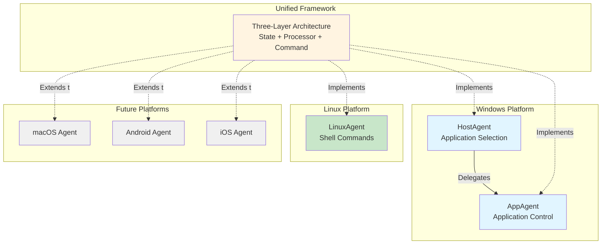
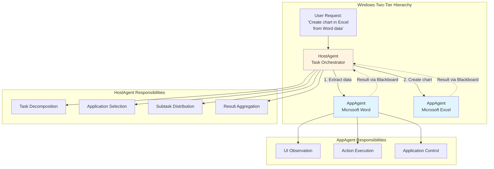
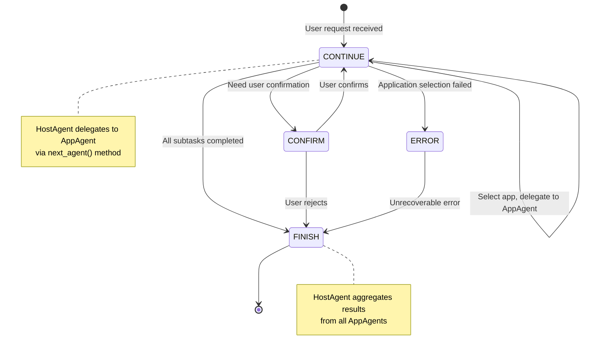
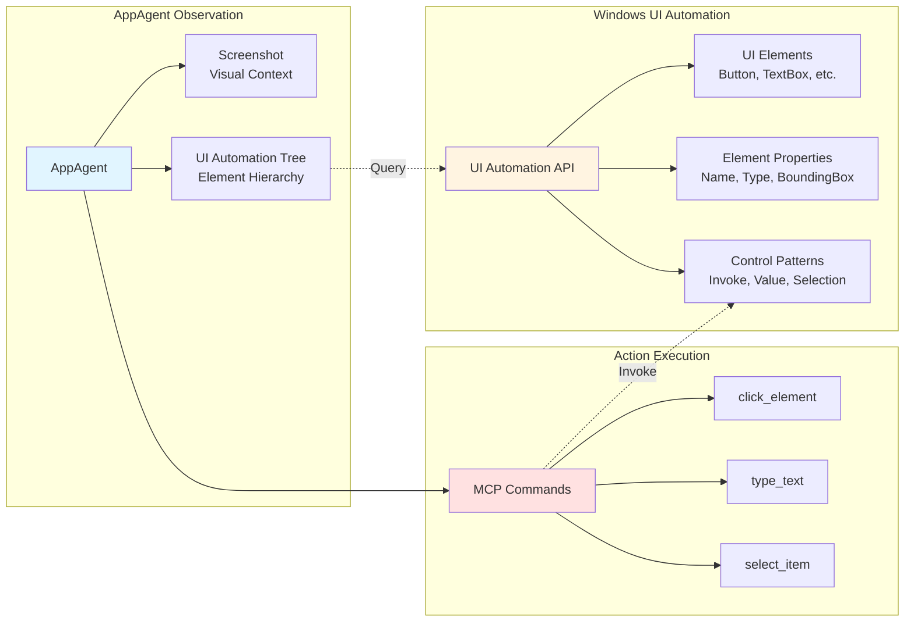
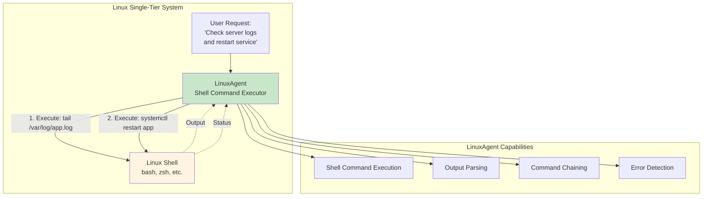
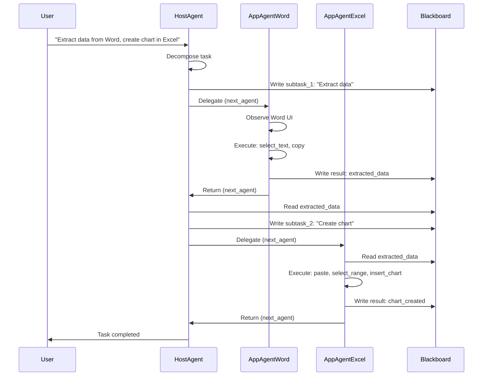
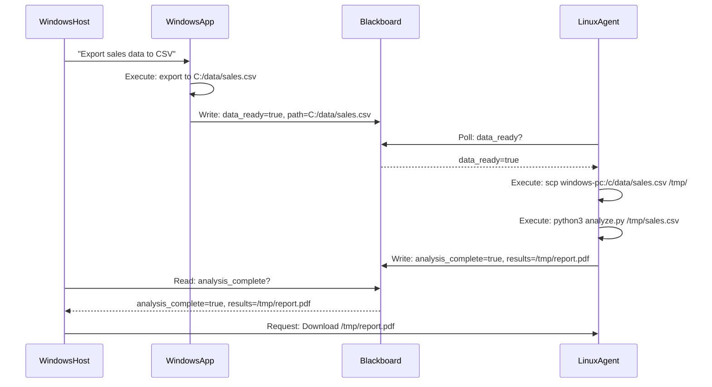
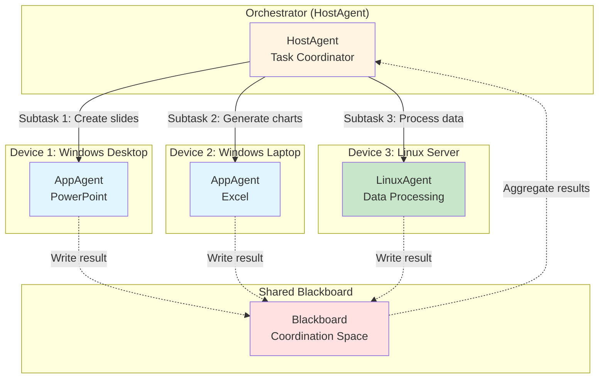
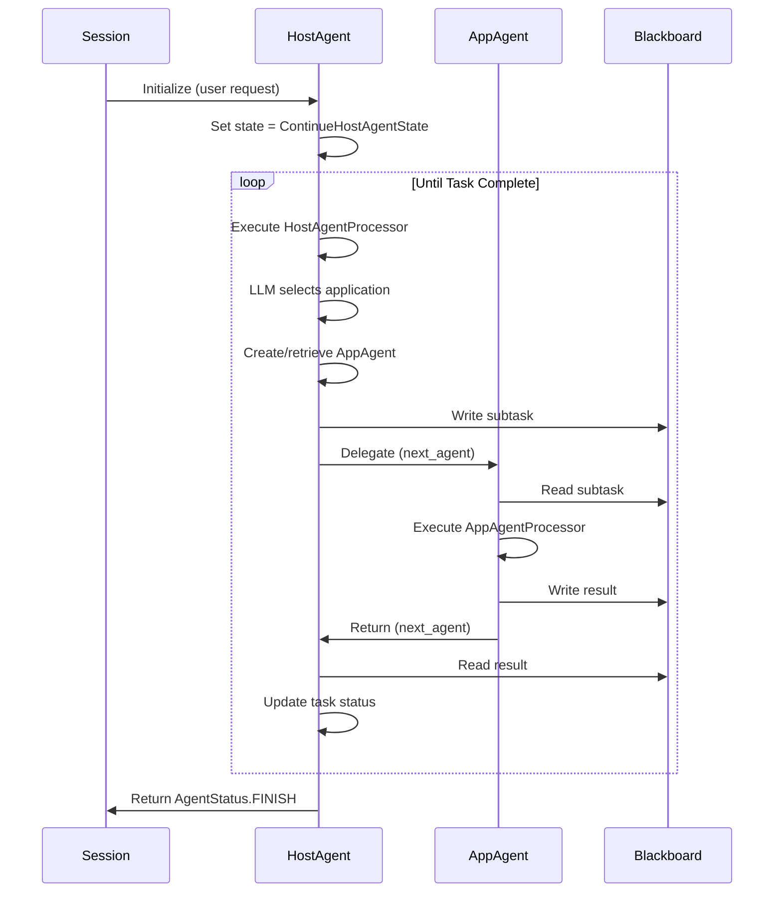
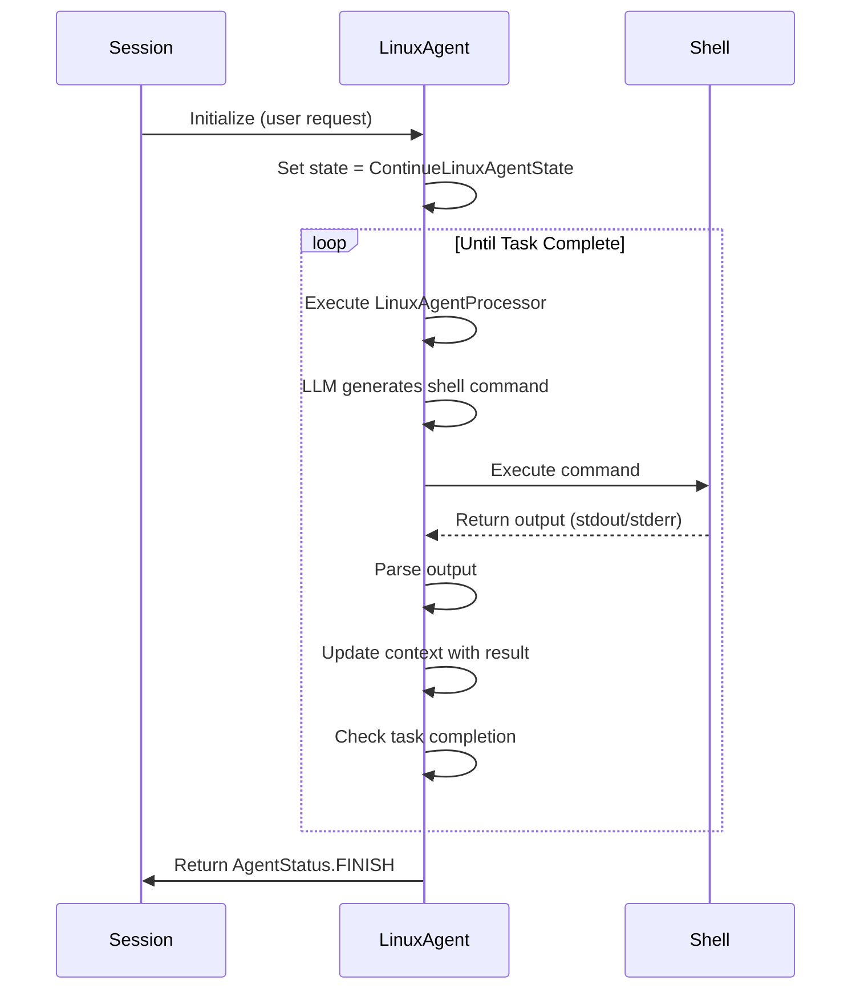

# Platform-Specific Agent Implementations

This document describes how the unified three-layer Device Agent architecture is implemented across different platforms. While the core framework (State, Processor, Command layers) remains consistent, each platform implements specialized agents optimized for their native control mechanisms and hierarchies. Understanding these implementations is essential for extending UFO3 to new platforms or customizing existing agents.

## Overview

UFO3's Device Agent architecture achieves cross-platform compatibility through **platform-specific agent implementations** that inherit from a common abstract framework. Each platform's agents implement the same `BasicAgent` interface while adapting the three-layer architecture to their unique execution environments:



**Unified Framework Benefits:**

- **Code Reuse**: State management, strategy orchestration, and command dispatch logic shared across platforms
- **Consistent Interface**: All agents implement BasicAgent interface with same lifecycle (handle, next_state, next_agent)
- **Extensibility**: New platforms inherit three-layer architecture, only implementing platform-specific strategies and commands
- **Multi-Platform Coordination**: HostAgent on Windows can coordinate with LinuxAgent on Linux device via Blackboard

---

## Platform Comparison

| Feature | Windows (Two-Tier) | Linux (Single-Tier) | Future (macOS, Mobile) |
|---------|-------------------|---------------------|------------------------|
| **Agent Hierarchy** | HostAgent ?AppAgent delegation | LinuxAgent (flat) | Platform-specific (TBD) |
| **Observation Method** | UI Automation API (COM) | Shell output, accessibility tree | Platform APIs (Accessibility, Screen) |
| **Action Mechanism** | UI element manipulation (click, type) | Shell command execution | Platform-specific controls |
| **Application Model** | Windowed applications | Command-line tools, X11 apps | Application frameworks |
| **State Complexity** | 7 states (CONTINUE, FINISH, CONFIRM, etc.) | Simplified state set | Platform-dependent |
| **Multi-Agent Coordination** | HostAgent ?AppAgent via Blackboard | N/A (single agent per device) | Cross-device via Blackboard |
| **Primary Use Cases** | Office automation, GUI apps | Server management, DevOps | Mobile apps, embedded systems |

!!! info "Platform Selection Strategy"
    - **Windows**: Use HostAgent + AppAgent for GUI-based applications requiring multi-step workflows (e.g., Excel data analysis, Word document editing)
    - **Linux**: Use LinuxAgent for command-line tasks, server administration, scripting workflows
    - **Cross-Platform**: Coordinate Windows and Linux agents via Blackboard for hybrid tasks (e.g., Windows collects data, Linux processes on server)

---

## Windows Platform: Two-Tier Agent Hierarchy

Windows implements a **two-tier hierarchy** where HostAgent manages application selection and task decomposition, delegating execution to AppAgent instances for specific applications.

### Architecture Overview



**Two-Tier Execution Flow Example:**

**User Request**: "Extract data from sales.docx and create a bar chart in Excel"

**HostAgent**:
1. Analyzes request → Identifies need for Word + Excel
2. Creates subtask 1: "Extract sales data from Word document"
3. Delegates to AppAgent (Word) via `next_agent()`

**AppAgent (Word)**:
1. Observes Word UI, locates sales data table
2. Executes `select_text` + `copy_to_clipboard` actions
3. Writes result to Blackboard: `blackboard.add_data(data, blackboard.trajectories)`
4. Returns to HostAgent via `next_agent(HostAgent)`

**HostAgent**:
1. Reads result from Blackboard
2. Creates subtask 2: "Create bar chart in Excel from extracted data"
3. Delegates to AppAgent (Excel) via `next_agent()`

**AppAgent (Excel)**:
1. Reads data from Blackboard trajectories
2. Executes actions: `paste_data` → `select_data_range` → `insert_chart`
3. Returns to HostAgent with `AgentStatus.FINISH`

---

## HostAgent: Application Selection and Task Orchestration

The **HostAgent** is the top-level coordinator in the Windows two-tier hierarchy, responsible for **application selection**, **task decomposition**, and **subtask distribution**.

### HostAgent Architecture

```python
@AgentRegistry.register(agent_name="hostagent")
class HostAgent(BasicAgent):
    """
    The HostAgent class is the manager of AppAgents.
    Coordinates multi-application workflows on Windows.
    """
    
    def __init__(
        self,
        name: str,
        is_visual: bool,
        main_prompt: str,
        example_prompt: str,
        api_prompt: str,
    ) -> None:
        super().__init__(name=name)
        self.prompter = HostAgentPrompter(is_visual, main_prompt, example_prompt, api_prompt)
        self.agent_factory = AgentFactory()
        self.appagent_dict = {}  # Cache of created AppAgent instances
        self._active_appagent = None
        self._blackboard = Blackboard()  # Shared coordination space
        self.set_state(self.default_state)
```

### Key Responsibilities

| Responsibility | Implementation | Example |
|----------------|----------------|---------|
| **Task Decomposition** | LLM analyzes user request, breaks into subtasks | "Create report" ?["Extract data", "Generate chart", "Format document"] |
| **Application Selection** | Identifies required applications for each subtask | Subtask "Extract data" ?Microsoft Word |
| **AppAgent Creation** | Factory pattern creates AppAgent instances on-demand | `agent_factory.create_agent("app", process="WINWORD.EXE")` |
| **Subtask Delegation** | Routes subtasks to appropriate AppAgent | `next_agent() ?AppAgent(Word)` |
| **Result Aggregation** | Collects results from AppAgents via Blackboard | `blackboard.get_value("appagent/word/result")` |
| **Multi-App Coordination** | Sequences actions across multiple applications | Word → Excel → PowerPoint workflow |

### HostAgent Processor

```python
class HostAgentProcessor(ProcessorTemplate):
    """
    Processor for HostAgent with specialized strategies.
    """
    
    def __init__(self, agent, context):
        super().__init__(agent, context)
        
        # DATA_COLLECTION: Get list of running applications
        self.register_strategy(
            ProcessingPhase.DATA_COLLECTION,
            HostDataCollectionStrategy(agent, context)
        )
        
        # LLM_INTERACTION: Application selection and task planning
        self.register_strategy(
            ProcessingPhase.LLM_INTERACTION,
            HostLLMInteractionStrategy(agent, context)
        )
        
        # ACTION_EXECUTION: Create AppAgent, delegate subtask
        self.register_strategy(
            ProcessingPhase.ACTION_EXECUTION,
            HostActionExecutionStrategy(agent, context)
        )
```

**HostAgent Strategy Specializations:**

- **DATA_COLLECTION**: Uses MCP tools to observe available Windows apps
- **LLM_INTERACTION**: Specialized prompt template for application selection:
    - Input: User request + list of running apps
    - Output: Selected application + decomposed subtask
- **ACTION_EXECUTION**: Instead of executing UI commands, creates/retrieves AppAgent instance and delegates via `next_agent()`

### HostAgent State Transitions



**HostAgent Delegation Pattern Example:**

```python
class HostAgent(BasicAgent):
    def handle(self, context: Context) -> Tuple[AgentStatus, Optional[BasicAgent]]:
        """
        Handle HostAgent state: select application and delegate.
        """
        # Execute processor strategies
        processor = HostAgentProcessor(self, context)
        result = processor.process()
        
        # Get selected application from LLM response
        selected_app = result.parsed_response.get("application")
        subtask = result.parsed_response.get("subtask")
        
        # Create or retrieve AppAgent for selected application
        appagent = self.get_or_create_appagent(selected_app)
        
        # Write subtask to Blackboard for AppAgent to read
        self._blackboard.add_data(
            {"subtask": subtask, "app": selected_app},
            self._blackboard.requests
        )
        
        # Delegate to AppAgent
        return AgentStatus.CONTINUE, appagent
    
    def get_or_create_appagent(self, app_name: str) -> AppAgent:
        """
        Factory method: Create AppAgent if not exists, otherwise return cached instance.
        """
        if app_name not in self.appagent_dict:
            self.appagent_dict[app_name] = self.agent_factory.create_agent(
                agent_type="app",
                name=f"AppAgent/{app_name}",
                process_name=app_name,
                app_root_name=app_name
            )
        return self.appagent_dict[app_name]
```

---

## AppAgent: Application-Specific Control

The **AppAgent** is responsible for **direct control of a specific Windows application**, executing UI-based actions through Windows UI Automation APIs.

### AppAgent Architecture

```python
@AgentRegistry.register(agent_name="appagent", processor_cls=AppAgentProcessor)
class AppAgent(BasicAgent):
    """
    The AppAgent class manages interaction with a specific Windows application.
    """
    
    def __init__(
        self,
        name: str,
        process_name: str,
        app_root_name: str,
        is_visual: bool,
        main_prompt: str,
        example_prompt: str,
        mode: str = "normal",
    ) -> None:
        super().__init__(name=name)
        self.prompter = AppAgentPrompter(is_visual, main_prompt, example_prompt)
        self._process_name = process_name  # e.g., "WINWORD.EXE"
        self._app_root_name = app_root_name  # e.g., "Microsoft Word"
        self._mode = mode
        self.set_state(self.default_state)
```

### Key Responsibilities

| Responsibility | Implementation | Example |
|----------------|----------------|---------|
| **UI Observation** | Screenshot + UI Automation tree capture | `get_ui_tree` returns hierarchical element structure |
| **Element Identification** | Parse UI tree to locate target elements | Find "Save" button by name, control type, bounding box |
| **Action Execution** | Execute UI commands via MCP tools | `click_element(element_id="save_button")` |
| **Application Context** | Maintain application-specific state | Current document, active window, focus element |
| **Error Handling** | Detect and recover from UI failures | Retry on stale element, fallback to keyboard shortcuts |
| **Result Reporting** | Write results to Blackboard for HostAgent | `blackboard.add_key_value("result", "Document saved")` |

### AppAgent Processor

```python
class AppAgentProcessor(ProcessorTemplate):
    """
    Processor for AppAgent with UI-focused strategies.
    """
    
    def __init__(self, agent, context):
        super().__init__(agent, context)
        
        # DATA_COLLECTION: Screenshot + UI tree
        self.register_strategy(
            ProcessingPhase.DATA_COLLECTION,
            ComposedStrategy([
                ScreenshotStrategy(agent, context),
                UITreeStrategy(agent, context)
            ])
        )
        
        # LLM_INTERACTION: UI element selection
        self.register_strategy(
            ProcessingPhase.LLM_INTERACTION,
            AppAgentLLMStrategy(agent, context)
        )
        
        # ACTION_EXECUTION: Execute UI commands
        self.register_strategy(
            ProcessingPhase.ACTION_EXECUTION,
            UIActionExecutionStrategy(agent, context)
        )
```

### Windows UI Automation Integration

AppAgent leverages **Windows UI Automation (UIA)** for robust UI control:



**UI Automation Capabilities:**

- **Element Discovery**: Traverse UI tree to find controls by name, type, automation ID
- **Property Access**: Read element properties (text, state, position, visibility)
- **Pattern Invocation**: Execute control-specific actions:
    - InvokePattern: Click buttons, menu items
    - ValuePattern: Set text in textboxes
    - SelectionPattern: Select items in lists, dropdowns
    - TogglePattern: Toggle checkboxes, radio buttons

### AppAgent Commands

| Command Category | Commands | Description |
|-----------------|----------|-------------|
| **Observation** | `screenshot`, `get_ui_tree`, `get_accessibility_tree` | Capture visual and structural UI information |
| **Navigation** | `click_element`, `double_click`, `right_click` | Navigate UI through mouse interactions |
| **Text Input** | `type_text`, `set_value`, `clear_text` | Input and modify text in UI controls |
| **Selection** | `select_item`, `select_dropdown`, `toggle_checkbox` | Manipulate selection controls |
| **Scrolling** | `scroll`, `scroll_to_element` | Navigate large UI areas |
| **Window Management** | `activate_window`, `close_window`, `maximize_window` | Control window state |
| **File Operations** | `open_file`, `save_file`, `save_as` | Application-specific file actions |

**AppAgent UI Control Pattern Example:**

```python
class AppAgent(BasicAgent):
    def handle(self, context: Context) -> Tuple[AgentStatus, Optional[BasicAgent]]:
        """
        Handle AppAgent state: Control application UI.
        """
        # Read subtask from Blackboard (written by HostAgent)
        subtask_memory = self._blackboard.requests.to_list_of_dicts()
        if subtask_memory:
            subtask = subtask_memory[-1].get("subtask")
        
        # Execute processor strategies
        processor = AppAgentProcessor(self, context)
        context.set(ContextNames.REQUEST, subtask)
        result = processor.process()
        
        # Check if subtask completed
        if result.status == AgentStatus.FINISH:
            # Write result to Blackboard
            self._blackboard.add_data(
                {"result": result.parsed_response.get("result")},
                self._blackboard.trajectories
            )
            
            # Return to HostAgent
            return AgentStatus.FINISH, self.parent_agent
        
        return result.status, None
```

---

## Linux Platform: Single-Tier Agent System

Linux implements a **single-tier architecture** where LinuxAgent directly executes shell commands without hierarchical delegation.

### LinuxAgent Architecture



```python
@AgentRegistry.register(
    agent_name="LinuxAgent",
    third_party=True,
    processor_cls=LinuxAgentProcessor
)
class LinuxAgent(CustomizedAgent):
    """
    LinuxAgent is a specialized agent that interacts with Linux systems.
    Executes shell commands and parses output.
    """
    
    def __init__(
        self,
        name: str,
        main_prompt: str,
        example_prompt: str,
    ) -> None:
        super().__init__(
            name=name,
            main_prompt=main_prompt,
            example_prompt=example_prompt,
            process_name=None,
            app_root_name=None,
            is_visual=None  # LinuxAgent typically operates without visual mode
        )
        self._blackboard = Blackboard()
        self.set_state(ContinueLinuxAgentState())
```

### Key Differences from Windows Agents

| Aspect | Windows (HostAgent + AppAgent) | Linux (LinuxAgent) |
|--------|--------------------------------|-------------------|
| **Hierarchy** | Two-tier (delegation pattern) | Single-tier (direct execution) |
| **Observation** | Screenshot + UI Automation tree | Shell command output (stdout/stderr) |
| **Action Mechanism** | UI element manipulation | Shell command execution |
| **Context Tracking** | Application windows, UI state | Command history, working directory |
| **Error Detection** | UI element not found, timeout | Exit code ?0, stderr output |
| **Coordination** | Via Blackboard between HostAgent and AppAgent | Via Blackboard with other devices (cross-device) |

### LinuxAgent Processor

```python
class LinuxAgentProcessor(ProcessorTemplate):
    """
    Processor for LinuxAgent with shell-focused strategies.
    """
    
    def __init__(self, agent, context):
        super().__init__(agent, context)
        
        # DATA_COLLECTION: No visual observation, use command output from previous step
        self.register_strategy(
            ProcessingPhase.DATA_COLLECTION,
            LinuxDataCollectionStrategy(agent, context)  # Collects shell output
        )
        
        # LLM_INTERACTION: Command generation from request
        self.register_strategy(
            ProcessingPhase.LLM_INTERACTION,
            LinuxLLMStrategy(agent, context)  # Generates shell commands
        )
        
        # ACTION_EXECUTION: Execute shell commands
        self.register_strategy(
            ProcessingPhase.ACTION_EXECUTION,
            ShellExecutionStrategy(agent, context)  # Executes via shell_execute
        )
```

### LinuxAgent Commands

| Command | Function | Example |
|---------|----------|---------|
| `shell_execute` | Execute shell command (non-blocking) | `shell_execute(command="ls -la /home/user")` |
| `shell_execute_read` | Execute command and capture output | `shell_execute_read(command="cat /var/log/app.log")` |
| `get_accessibility_tree` | Get GUI app accessibility tree (X11) | `get_accessibility_tree()` for GUI apps |
| `screenshot` | Capture screen (optional, for GUI) | `screenshot()` |

**LinuxAgent Best Practices:**

- **Command Chaining**: Use `&&` and `||` for robust workflows:
    ```bash
    cd /app && ./deploy.sh || echo "Deployment failed"
    ```
- **Output Parsing**: Parse stdout for structured data:
    ```python
    output = shell_execute_read("systemctl status app")
    if "active (running)" in output:
        # Service is running
    ```
- **Error Handling**: Check exit codes and stderr:
    ```python
    result = shell_execute("restart_service.sh")
    if result.status == ResultStatus.FAILURE:
        # Handle error from stderr
    ```
- **Idempotency**: Design commands to be safely re-runnable:
    ```bash
    # Good: Check before creating
    [ -d /app/backup ] || mkdir -p /app/backup
    
    # Bad: Fails if directory exists
    mkdir /app/backup
    ```

**LinuxAgent Cross-Device Coordination Example:**

```python
# Windows HostAgent prepares data for Linux processing
windows_blackboard.add_data(
    {"data_file": "C:/export/data.csv", "ready": True},
    windows_blackboard.requests
)

# LinuxAgent polls Blackboard for task availability
requests = linux_blackboard.requests.to_list_of_dicts()
if requests and requests[-1].get("ready"):
    # Download data from Windows device (via network share or AIP)
    await linux_agent.execute_command(
        "scp user@windows-pc:/c/export/data.csv /tmp/data.csv"
    )
    
    # Process data
    await linux_agent.execute_command(
        "python3 /app/process.py /tmp/data.csv"
    )
    
    # Report completion
    linux_blackboard.add_data(
        {"status": "completed"},
        linux_blackboard.trajectories
    )
```

---

## Multi-Agent Coordination Patterns

The three-layer architecture enables seamless coordination across different agent types through **Blackboard-based communication**.

### Pattern 1: Windows Multi-App Workflow



### Pattern 2: Cross-Device Linux-Windows Coordination



### Pattern 3: Parallel Multi-Device Tasks



---

## Platform Extensibility: Adding New Platforms

The three-layer architecture provides a clear path for extending UFO3 to new platforms:

### Extension Checklist

**Steps to Add a New Platform:**

1. **Define Agent Class**
    ```python
    @AgentRegistry.register(
        agent_name="MacOSAgent",
        processor_cls=MacOSAgentProcessor
    )
    class MacOSAgent(BasicAgent):
        # Implement platform-specific initialization
    ```

2. **Implement Platform-Specific Strategies**
    - **DATA_COLLECTION**: How to observe system state (screenshots, accessibility tree, shell output)
    - **LLM_INTERACTION**: Adapt prompt template for platform capabilities
    - **ACTION_EXECUTION**: Map actions to platform APIs (AppKit, Accessibility API, etc.)
    - **MEMORY_UPDATE**: Standard implementation (usually no changes needed)

3. **Define Platform Commands (MCP Tools)**
    ```python
    # macOS-specific commands
    commands = [
        "applescript_execute",  # Execute AppleScript
        "accessibility_tree",   # macOS Accessibility API
        "click_element",        # macOS UI control
        "type_text"             # Text input
    ]
    ```

4. **Implement AgentState Subclasses** (if needed)
    ```python
    class ContinueMacOSAgentState(AgentState):
        def handle(self, agent, context):
            # macOS-specific state handling
    ```

5. **Create Platform-Specific Processor**
    ```python
    class MacOSAgentProcessor(ProcessorTemplate):
        def __init__(self, agent, context):
            super().__init__(agent, context)
            self.register_strategy(
                ProcessingPhase.DATA_COLLECTION,
                MacOSDataCollectionStrategy(agent, context)
            )
            # Register other strategies...
    ```

6. **Configure MCP Server** (on device client)
    - Implement MCP tools for platform-specific operations
    - Register tools with MCP server manager
    - Ensure AIP client routes commands correctly

### Platform-Specific Considerations

| Platform | Key Considerations | Suggested Implementation |
|----------|-------------------|--------------------------|
| **macOS** | Accessibility API, AppleScript, window management | MacOSAgent (single-tier), AppleScript execution strategy |
| **Android** | Activity lifecycle, UI Automator, touch gestures | AndroidAgent (single-tier), UI Automator integration |
| **iOS** | Accessibility, XCTest, limited automation | iOSAgent (single-tier), XCTest framework |
| **Embedded** | Limited resources, no GUI, command-line only | EmbeddedAgent (minimal strategies, shell-based) |
| **Web** | Browser automation, DOM manipulation | WebAgent (Selenium/Playwright integration) |

**Example: Adding macOS Support**

```python
# 1. Define macOS Agent
@AgentRegistry.register(
    agent_name="MacOSAgent",
    processor_cls=MacOSAgentProcessor
)
class MacOSAgent(BasicAgent):
    def __init__(self, name: str, main_prompt: str, example_prompt: str):
        super().__init__(name=name)
        self.prompter = MacOSAgentPrompter(main_prompt, example_prompt)
        self.set_state(ContinueMacOSAgentState())

# 2. Implement macOS-specific DATA_COLLECTION strategy
class MacOSDataCollectionStrategy(ProcessingStrategy):
    def execute(self, context: ProcessingContext):
        # Use macOS Accessibility API
        commands = [
            Command(tool_name="get_accessibility_tree", parameters={}, tool_type="data_collection"),
            Command(tool_name="screenshot", parameters={}, tool_type="data_collection")
        ]
        results = self.dispatcher.execute_commands(commands)
        
        context.set_local("accessibility_tree", results[0].result)
        context.set_local("screenshot", results[1].result)

# 3. Implement macOS-specific ACTION_EXECUTION strategy
class MacOSActionExecutionStrategy(ProcessingStrategy):
    def execute(self, context: ProcessingContext):
        action = context.get_global("action")
        
        if action == "click_element":
            # Use macOS Accessibility API via MCP tool
            command = Command(
                tool_name="macos_click_element",
                parameters={"element_id": context.get_global("element_id")},
                tool_type="action"
            )
        elif action == "applescript_execute":
            # Execute AppleScript via MCP tool
            command = Command(
                tool_name="applescript_execute",
                parameters={"script": context.get_global("applescript")},
                tool_type="action"
            )
        
        results = self.dispatcher.execute_commands([command])
        context.set_local("execution_results", results)

# 4. Configure MCP tools on macOS device client
# In device client code:
mcp_server_manager.register_tool(
    MCPToolInfo(
        tool_name="macos_click_element",
        description="Click element via macOS Accessibility API",
        input_schema={
            "element_id": {"type": "string", "description": "Accessibility element ID"}
        },
        # ... other fields
    ),
    handler=macos_accessibility_click_handler
)
```

---

## Agent Lifecycle Comparison

### Windows HostAgent Lifecycle



### Linux LinuxAgent Lifecycle



---

## Performance and Scalability

| Metric | Windows (Two-Tier) | Linux (Single-Tier) | Notes |
|--------|-------------------|---------------------|-------|
| **Agent Initialization** | ~500ms (HostAgent) + ~300ms per AppAgent | ~200ms (LinuxAgent) | AppAgent creation overhead for each application |
| **Observation Latency** | ~1-2s (screenshot + UI tree) | ~100-500ms (shell output) | UI Automation API slower than shell |
| **Action Execution** | ~200-500ms per UI action | ~50-200ms per shell command | UI actions require element discovery |
| **Memory Footprint** | ~50MB (HostAgent) + ~30MB per AppAgent | ~20MB (LinuxAgent) | UI Automation increases memory usage |
| **Scalability** | Limited by number of AppAgents | Handles many parallel commands | HostAgent manages AppAgent pool |
| **Coordination Overhead** | Blackboard read/write per delegation | Minimal (only cross-device) | Two-tier hierarchy increases communication |

**Performance Optimization:**

- **Windows**: Reuse AppAgent instances across subtasks (cached in `appagent_dict`)
- **Linux**: Batch multiple shell commands with `&&` to reduce round trips
- **Cross-Platform**: Minimize Blackboard writes; use hierarchical keys for efficient reads

---

## Best Practices

### Windows Agent Best Practices

**HostAgent:**

- **AppAgent Caching**: Reuse AppAgent instances for same application to avoid recreation overhead
- **Task Decomposition**: Break complex tasks into independent subtasks for parallel execution
- **Blackboard Namespacing**: Use clear keys within appropriate memory sections
- **Error Propagation**: Detect AppAgent failures and retry with different strategy

**AppAgent:**

- **Element Stability**: Wait for UI elements to stabilize before interaction (use `wait_for_element`)
- **Fallback Actions**: If UI Automation fails, fallback to keyboard shortcuts (e.g., Ctrl+S instead of clicking Save button)
- **Context Awareness**: Track active window and focus to ensure actions target correct application
- **Idempotent Actions**: Design actions to be safely retryable (e.g., check if file exists before creating)

### Linux Agent Best Practices

**LinuxAgent:**

- **Command Validation**: Validate commands before execution to prevent injection attacks
- **Output Parsing**: Use structured output formats (JSON, CSV) instead of parsing raw text
- **Error Detection**: Check exit codes (`$?`) and stderr for failure detection
- **Idempotency**: Use conditional commands (`[ -f file ] || create_file`) to safely re-run workflows
- **Resource Cleanup**: Always clean up temporary files and processes after task completion

### Cross-Platform Best Practices

**Multi-Agent Coordination:**

- **Blackboard Keys**: Use appropriate memory sections to separate agent-specific data:
    ```python
    # Good - using structured memory sections
    blackboard.add_data({"status": "ready"}, blackboard.requests)
    blackboard.add_data({"status": "processing"}, blackboard.trajectories)
    
    # Bad - unclear categorization
    blackboard.add_data({"status": "ready"}, blackboard.questions)
    ```

- **Synchronization**: Use polling or event-based patterns for cross-device synchronization:
    ```python
    # Polling pattern
    while not any(r.get("task_complete") for r in blackboard.requests.to_list_of_dicts()):
        await asyncio.sleep(1)
    
    # Event-based (via AIP custom messages)
    # Linux device sends completion event
    aip_client.send_event("task_complete", {...})
    ```

- **Data Transfer**: For large data, use shared storage (network drive, S3) instead of Blackboard:
    ```python
    # Bad: Store large data in Blackboard
    blackboard.add_data({"dataset": [1000000 rows]}, blackboard.trajectories)
    
    # Good: Store reference to shared storage
    blackboard.add_data({"dataset_path": "s3://bucket/data.csv"}, blackboard.requests)
    ```

---

## Related Documentation

- [Device Agent Overview](overview.md) - Three-layer architecture and design principles
- [Server-Client Architecture](server_client_architecture.md) - Server and client separation
- [State Layer](design/state.md) - AgentState interface and state machine
- [Processor and Strategy Layer](design/processor.md) - ProcessorTemplate and strategy implementations
- [Command Layer](design/command.md) - CommandDispatcher and MCP integration
- [Memory System](design/memory.md) - Memory and Blackboard for agent coordination
- [Server Architecture](../../server/overview.md) - Server-side orchestration
- [Client Architecture](../../client/overview.md) - Device client MCP execution
- [AIP Protocol](../../aip/overview.md) - Agent Interaction Protocol for communication

---

## Summary

**Key Takeaways:**

- **Windows Two-Tier Hierarchy**: HostAgent (orchestration) + AppAgent (application control) for GUI workflows
- **Linux Single-Tier System**: LinuxAgent executes shell commands directly for command-line tasks
- **Unified Framework**: Both platforms leverage same three-layer architecture (State, Processor, Command)
- **Multi-Agent Coordination**: Blackboard enables seamless coordination across HostAgent → AppAgent and cross-device communication
- **Platform Extensibility**: Clear extension path for macOS, Android, iOS, embedded systems
- **HostAgent Responsibilities**: Task decomposition, application selection, AppAgent creation, subtask delegation
- **AppAgent Capabilities**: UI observation (screenshot + UI Automation), element identification, UI action execution
- **LinuxAgent Characteristics**: Shell command execution, output parsing, idempotent workflows
- **Best Practices**: AppAgent caching, appropriate Blackboard usage, idempotent commands, structured output parsing
- **Performance**: Windows UI Automation slower but more robust; Linux shell commands faster but less structured

UFO3's platform-specific agent implementations demonstrate the flexibility and extensibility of the three-layer architecture, enabling cross-platform and cross-device task automation while maintaining consistent design principles and coordination mechanisms.
