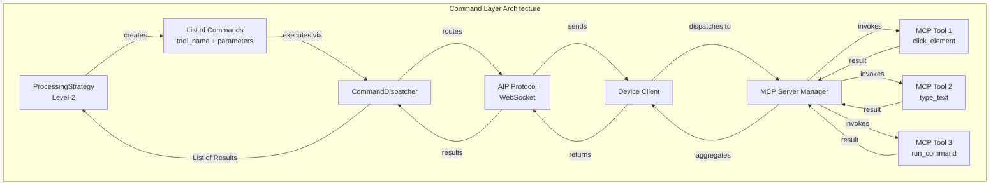
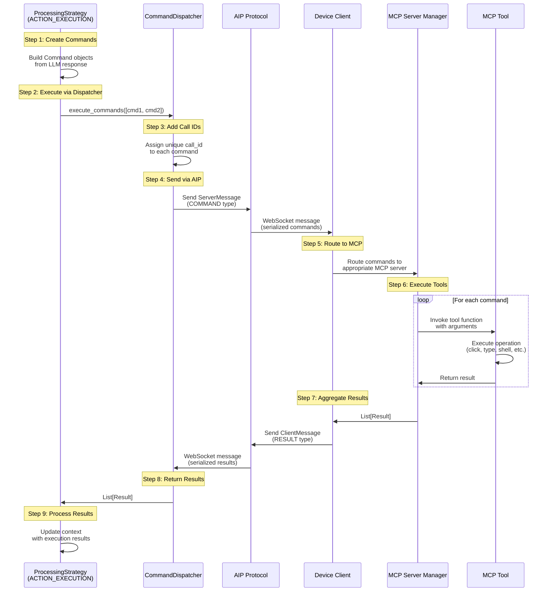
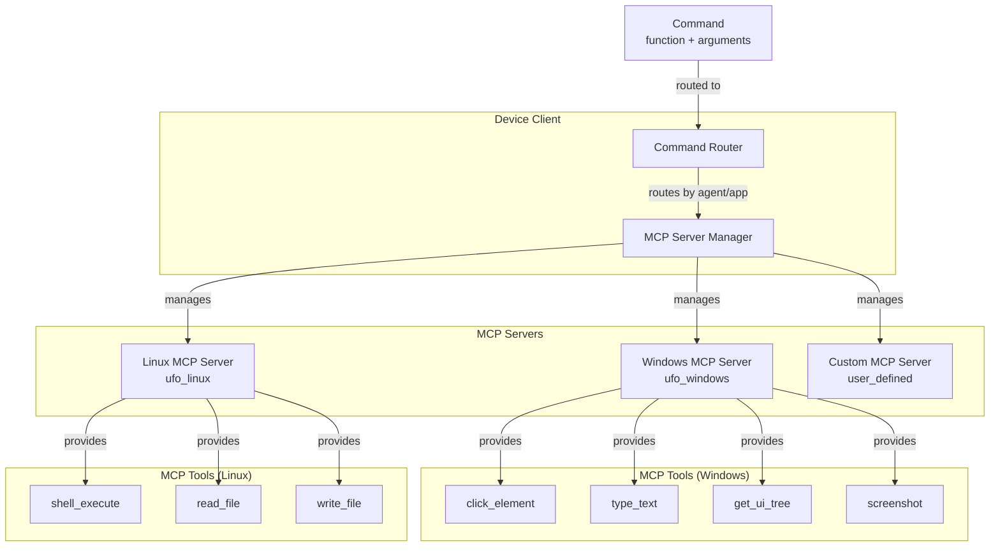
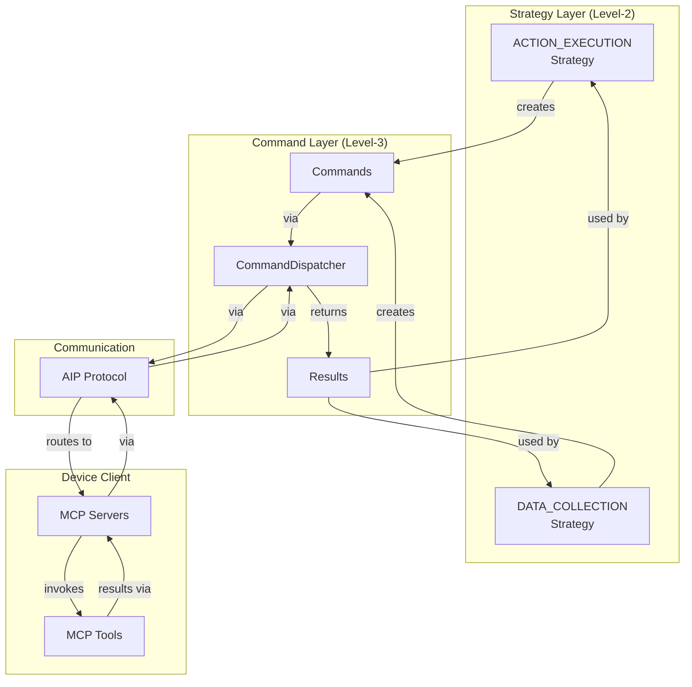

# Command Layer (Level-3 System Interface)

The **Command Layer** provides atomic, deterministic system operations that bridge device agents with underlying platform capabilities. Each command encapsulates a **tool** and its **parameters**, mapping directly to MCP tools on the device client. This layer ensures reliable, auditable, and extensible execution across heterogeneous devices.

## Overview

The Command Layer implements **Level-3** of the [three-layer device agent architecture](../overview.md#three-layer-architecture). It provides:

- **Atomic Commands**: Self-contained execution units with tool + parameters
- **MCP Integration**: Commands map to Model Context Protocol tools on device client
- **CommandDispatcher**: Routes commands from agent server to device client via AIP
- **Deterministic Execution**: Same inputs → same outputs, fully auditable
- **Dynamic Discovery**: LLM queries available tools and selects appropriate commands



## Design Philosophy

The Command Layer follows the **Command Pattern**:

## Command Structure

## Design Philosophy

The Command Layer follows the **Command Pattern**:

- **Encapsulation**: Each command encapsulates request as object
- **Decoupling**: Invoker (strategy) decoupled from executor (MCP tool)
- **Extensibility**: New commands added without changing invoker code
- **Auditability**: Command history provides complete execution trace

## Command Structure

Each command is represented by the `Command` Pydantic model:

```python
class Command(BaseModel):
    """
    Represents a command to be executed by an agent.
    Commands are atomic units of work dispatched by the orchestrator.
    """
    
    tool_name: str = Field(..., description="Name of the tool to execute")
    parameters: Optional[Dict[str, Any]] = Field(
        default=None, description="Parameters for the tool"
    )
    tool_type: Literal["data_collection", "action"] = Field(
        ..., description="Type of tool: data_collection or action"
    )
    call_id: Optional[str] = Field(
        default=None, description="Unique identifier for this command call"
    )
```

### Command Properties

| Property | Type | Purpose | Example |
|----------|------|---------|---------|
| **tool_name** | `str` | MCP tool name to invoke | `"click_element"`, `"type_text"`, `"shell_execute"` |
| **parameters** | `Optional[Dict[str, Any]]` | Tool parameters | `{"control_id": "Button_123"}`, `{"text": "Hello"}` |
| **tool_type** | `Literal["data_collection", "action"]` | Tool category | `"data_collection"` (observation), `"action"` (modification) |
| **call_id** | `Optional[str]` | Unique execution identifier | `"uuid-1234-5678"` (auto-generated) |

### Command Examples

**Windows UI Automation Command**:

```python
Command(
    tool_name="click_element",
    parameters={
        "control_id": "Button_InsertChart",
        "process_name": "EXCEL.EXE",
        "app_root_name": "Microsoft Excel"
    },
    tool_type="action"
)
```

**Linux Shell Command**:

```python
Command(
    tool_name="shell_execute",
    parameters={
        "command": "ls -la /home/user/documents",
        "timeout": 30
    },
    tool_type="action"
)
```

**File Operation Command**:

```python
Command(
    tool_name="read_file",
    parameters={
        "file_path": "/home/user/data.csv",
        "encoding": "utf-8"
    },
    tool_type="data_collection"
)
```

## Result Structure

Each command execution returns a `Result` object:

```python
class Result(BaseModel):
    """
    Represents the result of a command execution.
    Contains status, error information, and the actual result payload.
    """
    
    status: ResultStatus = Field(..., description="Execution status")
    error: Optional[str] = Field(default=None, description="Error message if failed")
    result: Any = Field(default=None, description="Result payload")
    namespace: Optional[str] = Field(
        default=None, description="Namespace of the executed tool"
    )
    call_id: Optional[str] = Field(
        default=None, description="ID matching the Command.call_id"
    )
```

### ResultStatus Enum

```python
class ResultStatus(str, Enum):
    """Represents the status of a command execution result."""
    SUCCESS = "success"      # Command executed successfully
    FAILURE = "failure"      # Command failed with error
    SKIPPED = "skipped"      # Command was skipped
    NONE = "none"            # No result available
```

### Result Examples

**Successful Click**:

```python
Result(
    status=ResultStatus.SUCCESS,
    result={"clicked": True, "control_name": "Insert Chart"},
    call_id="uuid-1234-5678"
)
```

**Failed Command**:

```python
Result(
    status=ResultStatus.FAILURE,
    result=None,
    error="Control 'Button_123' not found in UI tree",
    call_id="uuid-1234-5678"
)
```

**Shell Execution**:

```python
Result(
    status=ResultStatus.SUCCESS,
    result={
        "stdout": "total 24\ndrwxr-xr-x  5 user user 4096...",
        "stderr": "",
        "exit_code": 0
    },
    call_id="uuid-1234-5678"
)
```

## CommandDispatcher Interface

The `BasicCommandDispatcher` provides the abstract interface for command execution:

```python
class BasicCommandDispatcher(ABC):
    """
    Abstract base class for command dispatcher.
    
    Responsibilities:
    - Send commands to device client
    - Wait for execution results
    - Handle errors and timeouts
    """
    
    @abstractmethod
    async def execute_commands(
        self, commands: List[Command], timeout: float = 6000
    ) -> Optional[List[Result]]:
        """
        Execute commands and return results.
        
        :param commands: List of commands to execute
        :param timeout: Execution timeout in seconds
        :return: List of results, or None if timeout
        """
        pass
    
    def generate_error_results(
        self, commands: List[Command], error: Exception
    ) -> List[Result]:
        """
        Generate error results for failed commands.
        
        :param commands: Commands that failed
        :param error: The error that occurred
        :return: List of error results
        """
        result_list = []
        for command in commands:
            error_msg = f"Error executing {command}: {error}"
            result = Result(
                status=ResultStatus.FAILURE,
                error=error_msg,
                result=error_msg,
                call_id=command.call_id
            )
            result_list.append(result)
        return result_list
```

## Command Execution Flow

The following sequence diagram shows the complete command execution flow:



### Execution Phases

1. **Command Creation**: Strategy builds `Command` objects from LLM response or predefined logic
2. **Dispatcher Invocation**: Strategy calls `dispatcher.execute_commands()`
3. **Call ID Assignment**: Dispatcher assigns unique `call_id` to each command
4. **AIP Transmission**: Commands serialized and sent via WebSocket to device client
5. **MCP Routing**: Client routes commands to appropriate MCP server
6. **Tool Execution**: MCP server invokes tool functions with arguments
7. **Result Aggregation**: Results collected and sent back via AIP
8. **Result Handling**: Dispatcher returns results to strategy
9. **Context Update**: Strategy updates processing context with results

!!! warning "Timeout Handling"
    If execution exceeds timeout:
    
    1. Dispatcher raises `asyncio.TimeoutError`
    2. Error results generated via `generate_error_results()`
    3. Strategy receives error results (status = FAILURE)
    4. Processor can retry or fail based on `fail_fast` setting

---

## Dispatcher Implementations

UFO provides two dispatcher implementations for different deployment scenarios:

### 1. LocalCommandDispatcher

**Purpose**: Direct local execution (server and client on same machine)

**Use Case**: Development, testing, single-device deployments

```python
class LocalCommandDispatcher(BasicCommandDispatcher):
    """
    Local command dispatcher - executes commands directly.
    
    No network communication - calls MCP tools locally.
    """
    
    def __init__(self, session: BaseSession, mcp_server_manager: MCPServerManager):
        self.session = session
        self.mcp_server_manager = mcp_server_manager
        
        # Direct local execution
        self.computer_manager = ComputerManager(configs, mcp_server_manager)
        self.command_router = CommandRouter(self.computer_manager)
    
    async def execute_commands(
        self, commands: List[Command], timeout=6000
    ) -> Optional[List[Result]]:
        """Execute commands locally via CommandRouter"""
        try:
            # Direct invocation (no network)
            action_results = await asyncio.wait_for(
                self.command_router.execute(
                    agent_name=self.session.current_agent_class,
                    root_name=self.session.context.get(ContextNames.APPLICATION_ROOT_NAME),
                    process_name=self.session.context.get(ContextNames.APPLICATION_PROCESS_NAME),
                    commands=commands
                ),
                timeout=timeout
            )
            return action_results
        except Exception as e:
            return self.generate_error_results(commands, e)
```

### 2. WebSocketCommandDispatcher

**Purpose**: Remote execution via AIP (server and client on different machines)

**Use Case**: Production, multi-device deployments, distributed systems

```python
class WebSocketCommandDispatcher(BasicCommandDispatcher):
    """
    WebSocket command dispatcher - executes commands remotely via AIP.
    
    Uses AIP's TaskExecutionProtocol for structured messaging.
    """
    
    def __init__(self, session: BaseSession, protocol: TaskExecutionProtocol):
        self.session = session
        self.protocol = protocol  # AIP protocol instance
        self.pending: Dict[str, asyncio.Future] = {}
        self.logger = logging.getLogger(__name__)
    
    async def execute_commands(
        self, commands: List[Command], timeout=6000
    ) -> Optional[List[Result]]:
        """Execute commands remotely via AIP WebSocket"""
        try:
            # Build ServerMessage
            server_msg = self.make_server_response(commands)
            
            # Send via AIP
            await self.protocol.send_command(server_msg)
            
            # Wait for results
            results = await asyncio.wait_for(
                self._wait_for_results(server_msg.response_id),
                timeout=timeout
            )
            
            return results
        except Exception as e:
            return self.generate_error_results(commands, e)
    
    def make_server_response(self, commands: List[Command]) -> ServerMessage:
        """Create ServerMessage for commands"""
        # Assign call_ids
        for command in commands:
            command.call_id = str(uuid.uuid4())
        
        return ServerMessage(
            type=ServerMessageType.COMMAND,
            status=TaskStatus.CONTINUE,
            agent_name=self.session.current_agent_class,
            process_name=self.session.context.get(ContextNames.APPLICATION_PROCESS_NAME),
            root_name=self.session.context.get(ContextNames.APPLICATION_ROOT_NAME),
            actions=commands,
            session_id=self.session.id,
            task_name=self.session.task,
            response_id=str(uuid.uuid4()),
            timestamp=datetime.datetime.now(datetime.timezone.utc).isoformat()
        )
```

### Dispatcher Selection

The dispatcher is selected at session initialization:

- **Local Mode**: `LocalCommandDispatcher` (no AIP client connection)
- **Remote Mode**: `WebSocketCommandDispatcher` (AIP client connected)

This is transparent to strategies - they call `dispatcher.execute_commands()` regardless.

## MCP Integration

Commands map to **Model Context Protocol (MCP)** tools on the device client:



### MCP Tool Registration

MCP tools are registered on the device client at initialization:

```python
# Windows MCP Server registration
mcp_server_manager.register_server(
    server_name="ufo_windows",
    tools=[
        MCPToolInfo(
            name="click_element",
            description="Click UI element by control ID",
            arguments_schema={
                "control_id": {"type": "string", "required": True},
                "process_name": {"type": "string", "required": True}
            }
        ),
        MCPToolInfo(
            name="type_text",
            description="Type text into focused element",
            arguments_schema={
                "text": {"type": "string", "required": True}
            }
        ),
        # ... more tools
    ]
)
```

### Tool Discovery

The LLM can query available tools via the `get_mcp_tools` command:

```python
# Strategy requests available tools
tools_cmd = Command(
    function="get_mcp_tools",
    arguments={"server_name": "ufo_windows"}
)

results = await dispatcher.execute_commands([tools_cmd])

# LLM receives tool registry
available_tools = results[0].result  # List[MCPToolInfo]
```

### Dynamic Tool Selection

The LLM dynamically selects appropriate tools based on:

1. **Tool Descriptions**: Natural language descriptions of tool capabilities
2. **Input Schemas**: Required/optional parameters with types
3. **Context**: Current task requirements and device state

This enables **adaptive behavior** without hardcoded command sequences.

See [MCP Documentation](../../../mcp/overview.md) for complete MCP integration details.

## Command Categories

Commands can be categorized by their purpose:

### 1. Observation Commands (DATA_COLLECTION)

**Purpose**: Gather information from device without modifying state

| Command | Platform | Description | Arguments | Result |
|---------|----------|-------------|-----------|--------|
| `screenshot` | All | Capture screen image | `{"region": "fullscreen"}` | Base64 image |
| `get_ui_tree` | Windows | Extract UI Automation tree | `{"process_name": "..."}` | XML/JSON tree |
| `shell_execute_read` | Linux | Execute shell command (read-only) | `{"command": "ls -la"}` | stdout/stderr |
| `get_accessibility_tree` | macOS | Extract Accessibility tree | `{"app_name": "..."}` | Tree structure |

### 2. Action Commands (ACTION_EXECUTION)

**Purpose**: Modify device state through interactions

| Command | Platform | Description | Arguments | Result |
|---------|----------|-------------|-----------|--------|
| `click_element` | Windows | Click UI element | `{"control_id": "..."}` | Click success |
| `type_text` | Windows | Type text into element | `{"text": "..."}` | Typing success |
| `scroll` | Windows | Scroll element | `{"direction": "down", "amount": 3}` | Scroll success |
| `shell_execute` | Linux | Execute shell command | `{"command": "...", "timeout": 30}` | stdout/stderr/exit_code |
| `press_key` | All | Press keyboard key | `{"key": "Enter"}` | Key press success |

### 3. System Commands

**Purpose**: Interact with OS or hardware

| Command | Platform | Description | Arguments | Result |
|---------|----------|-------------|-----------|--------|
| `launch_application` | All | Start application | `{"app_name": "...", "args": [...]}` | PID |
| `close_application` | All | Terminate application | `{"process_name": "..."}` | Close success |
| `read_file` | All | Read file contents | `{"file_path": "...", "encoding": "utf-8"}` | File contents |
| `write_file` | All | Write file contents | `{"file_path": "...", "content": "..."}` | Write success |
| `get_system_info` | All | Query system status | `{"info_type": "cpu"}` | CPU/memory/disk stats |

### Command Naming Convention

- Use **snake_case** for function names
- Use **verb_noun** pattern (e.g., `click_element`, `read_file`)
- Keep names **concise** but **descriptive**
- Prefix with platform if platform-specific (e.g., `windows_get_registry`)

## Command Validation

Commands are validated at multiple stages:

### 1. Client-Side Validation

The device client validates commands before execution:

```python
class CommandRouter:
    """Routes and validates commands on device client"""
    
    async def execute(
        self,
        agent_name: str,
        root_name: str,
        process_name: str,
        commands: List[Command]
    ) -> List[Result]:
        """Execute commands with validation"""
        results = []
        
        for command in commands:
            # Validate command
            validation_error = self._validate_command(command)
            if validation_error:
                results.append(Result(
                    status=ResultStatus.FAILURE,
                    error=validation_error,
                    call_id=command.call_id
                ))
                continue
            
            # Execute command
            try:
                result = await self._execute_single_command(command)
                results.append(result)
            except Exception as e:
                results.append(Result(
                    status=ResultStatus.FAILURE,
                    error=str(e),
                    call_id=command.call_id
                ))
        
        return results
    
    def _validate_command(self, command: Command) -> Optional[str]:
        """Validate command structure and arguments"""
        # Check function exists
        tool_info = self.mcp_server_manager.get_tool(command.function)
        if not tool_info:
            return f"Unknown command: {command.function}"
        
        # Check required arguments
        schema = tool_info.arguments_schema
        for arg_name, arg_spec in schema.items():
            if arg_spec.get("required") and arg_name not in command.arguments:
                return f"Missing required argument: {arg_name}"
        
        # Check argument types
        for arg_name, arg_value in command.arguments.items():
            expected_type = schema.get(arg_name, {}).get("type")
            if expected_type and not self._check_type(arg_value, expected_type):
                return f"Argument '{arg_name}' has wrong type"
        
        return None  # Valid
```

### 2. MCP Schema Validation

MCP tools define argument schemas that are enforced:

```python
{
    "name": "click_element",
    "description": "Click UI element by control ID",
    "arguments_schema": {
        "control_id": {
            "type": "string",
            "required": True,
            "description": "Unique identifier of control to click"
        },
        "process_name": {
            "type": "string",
            "required": True,
            "description": "Process name of application"
        },
        "double_click": {
            "type": "boolean",
            "required": False,
            "default": False,
            "description": "Whether to double-click"
        }
    }
}
```

### Validation Benefits

- **Early Error Detection**: Invalid commands caught before execution
- **Clear Error Messages**: Specific validation failures reported
- **Type Safety**: Argument types validated against schema
- **Security**: Prevents injection attacks and malformed requests

## Command Execution Patterns

Common patterns for command execution in strategies:

### 1. Single Command Execution

```python
# Execute single command
async def execute(self, agent, context):
    command = Command(
        function="screenshot",
        arguments={"region": "fullscreen"}
    )
    
    results = await context.command_dispatcher.execute_commands([command])
    
    if results[0].status == ResultStatus.SUCCESS:
        screenshot = results[0].result
        context.update_local({"screenshot": screenshot})
        return ProcessingResult(success=True, data={"screenshot": screenshot})
    else:
        return ProcessingResult(success=False, error=results[0].error)
```

### 2. Batch Command Execution

```python
# Execute multiple commands in parallel
async def execute(self, agent, context):
    commands = [
        Command(function="screenshot", arguments={}),
        Command(function="get_ui_tree", arguments={"process_name": "EXCEL.EXE"}),
        Command(function="get_system_info", arguments={"info_type": "memory"})
    ]
    
    results = await context.command_dispatcher.execute_commands(commands)
    
    # Process results
    data = {
        "screenshot": results[0].result if results[0].status == ResultStatus.SUCCESS else None,
        "ui_tree": results[1].result if results[1].status == ResultStatus.SUCCESS else None,
        "memory_info": results[2].result if results[2].status == ResultStatus.SUCCESS else None
    }
    
    return ProcessingResult(success=True, data=data)
```

### 3. Conditional Command Execution

```python
# Execute command based on LLM decision
async def execute(self, agent, context):
    parsed_response = context.require_local("parsed_response")
    action = parsed_response.get("ControlText")
    
    if action == "click":
        command = Command(
            function="click_element",
            arguments={"control_id": parsed_response.get("ControlID")}
        )
    elif action == "type":
        command = Command(
            function="type_text",
            arguments={"text": parsed_response.get("InputText")}
        )
    else:
        return ProcessingResult(success=False, error=f"Unknown action: {action}")
    
    results = await context.command_dispatcher.execute_commands([command])
    return ProcessingResult(success=results[0].status == ResultStatus.SUCCESS)
```

### 4. Retry Pattern

```python
# Retry command on failure
async def execute(self, agent, context):
    command = Command(
        function="click_element",
        arguments={"control_id": "Button_123"}
    )
    
    max_retries = 3
    for attempt in range(max_retries):
        results = await context.command_dispatcher.execute_commands([command])
        
        if results[0].status == ResultStatus.SUCCESS:
            return ProcessingResult(success=True, data=results[0].result)
        
        # Retry with exponential backoff
        await asyncio.sleep(2 ** attempt)
    
    return ProcessingResult(success=False, error="Max retries exceeded")
```

## Best Practices

### Command Design Guidelines

**1. Atomic Operations**: Each command should perform one well-defined operation

- ✅ Good: `click_element(control_id="Button_123")`
- ❌ Bad: `click_and_wait_and_validate(...)` (too many responsibilities)

**2. Idempotency**: Commands should be safe to retry

- ✅ Good: `read_file(path="/data.csv")` (idempotent)
- ⚠️ Caution: `append_to_file(path="/log.txt", text="...")` (not idempotent)

**3. Clear Arguments**: Use descriptive argument names

- ✅ Good: `{"file_path": "...", "encoding": "utf-8"}`
- ❌ Bad: `{"p": "...", "e": "utf-8"}` (unclear)

**4. Structured Results**: Return structured data, not just strings

- ✅ Good: `{"stdout": "...", "stderr": "...", "exit_code": 0}`
- ❌ Bad: `"output: ... error: ... code: 0"` (unstructured)

### Security Considerations

!!! warning "Security Best Practices"
    **Validate All Inputs**: Never trust command arguments from LLM without validation
    
    **Limit Command Scope**: Restrict commands to necessary operations only
    
    - Use MCP tool permissions to limit file access
    - Sandbox shell command execution
    - Validate file paths against allowed directories
    
    **Audit Command History**: Log all commands for compliance
    
    ```python
    self.logger.info(f"Executing command: {command.tool_name} with args: {command.parameters}")
    ```
    
    **Timeout All Commands**: Prevent runaway execution
    
    ```python
    results = await dispatcher.execute_commands(commands, timeout=30)
    ```

!!! danger "Dangerous Commands"
    Some commands require extra caution:
    
    **Shell Execution**: Risk of command injection
    
    - Use argument escaping/sanitization
    - Whitelist allowed commands
    - Never concatenate user input directly
    
    **File Operations**: Risk of unauthorized access
    
    - Validate paths against allowed directories
    - Check file permissions before access
    - Never allow arbitrary path traversal
    
    **System Modification**: Risk of breaking system state
    
    - Require explicit user confirmation
    - Implement undo/rollback mechanisms
    - Never allow destructive ops without safeguards

## Integration with Other Layers

The Command Layer integrates with other components:



| Integration Point | Layer/Component | Relationship |
|-------------------|-----------------|--------------|
| **ProcessingStrategy** | Level-2 Strategy | Strategies create and execute commands via dispatcher |
| **AIP Protocol** | Communication | Dispatcher uses AIP to send commands to client |
| **Device Client** | Execution | Client receives commands, routes to MCP servers |
| **MCP Servers** | Tool Registry | MCP servers execute tool functions, return results |
| **Global Context** | Module System | Command dispatcher accessed via processing context |

See [Strategy Layer](processor.md), [AIP Protocol](../../../aip/overview.md), and [MCP Integration](../../../mcp/overview.md) for integration details.

## API Reference

Below is the complete API reference for the Command Layer:

**BasicCommandDispatcher** (Abstract Base Class)
```python
# Location: ufo/module/dispatcher.py
class BasicCommandDispatcher(ABC):
    """Abstract base class for command dispatcher handling."""
    
    @abstractmethod
    async def execute_commands(
        self, commands: List[Command], timeout: float = 6000
    ) -> Optional[List[Result]]:
        """Execute commands and return results."""
        pass
```

**LocalCommandDispatcher** (Local Execution)
```python
# Location: ufo/module/dispatcher.py
class LocalCommandDispatcher(BasicCommandDispatcher):
    """Command dispatcher for local execution (testing/development)."""
    pass
```

**WebSocketCommandDispatcher** (Server-Client Communication)
```python
# Location: ufo/module/dispatcher.py
class WebSocketCommandDispatcher(BasicCommandDispatcher):
    """Command dispatcher using WebSocket/AIP protocol."""
    pass
```

## Summary

**Key Takeaways**:

- **Atomic Execution**: Commands are self-contained units with tool_name + parameters
- **MCP Integration**: Commands map to Model Context Protocol tools on device client
- **CommandDispatcher**: Routes commands from server to client via AIP
- **Deterministic**: Same inputs → same outputs, fully auditable
- **Dynamic Discovery**: LLM queries and selects appropriate tools at runtime
- **Validation**: Multi-stage validation (client + MCP schema) ensures safety
- **Extensibility**: New commands added via MCP tool registration without code changes

The Command Layer completes the three-layer device agent architecture, providing **reliable, auditable, and extensible system interfaces** that bridge high-level reasoning with low-level device operations across heterogeneous platforms.
