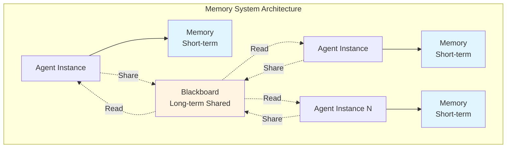
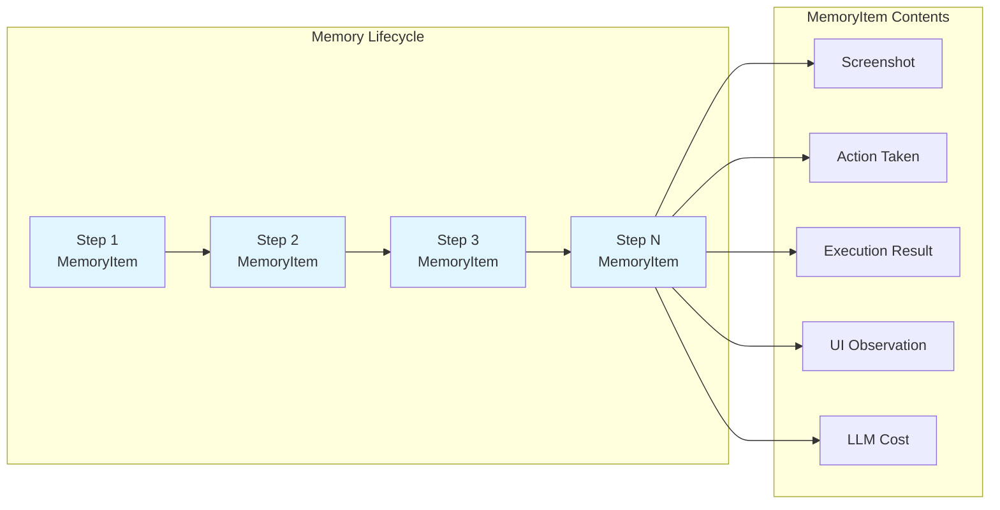
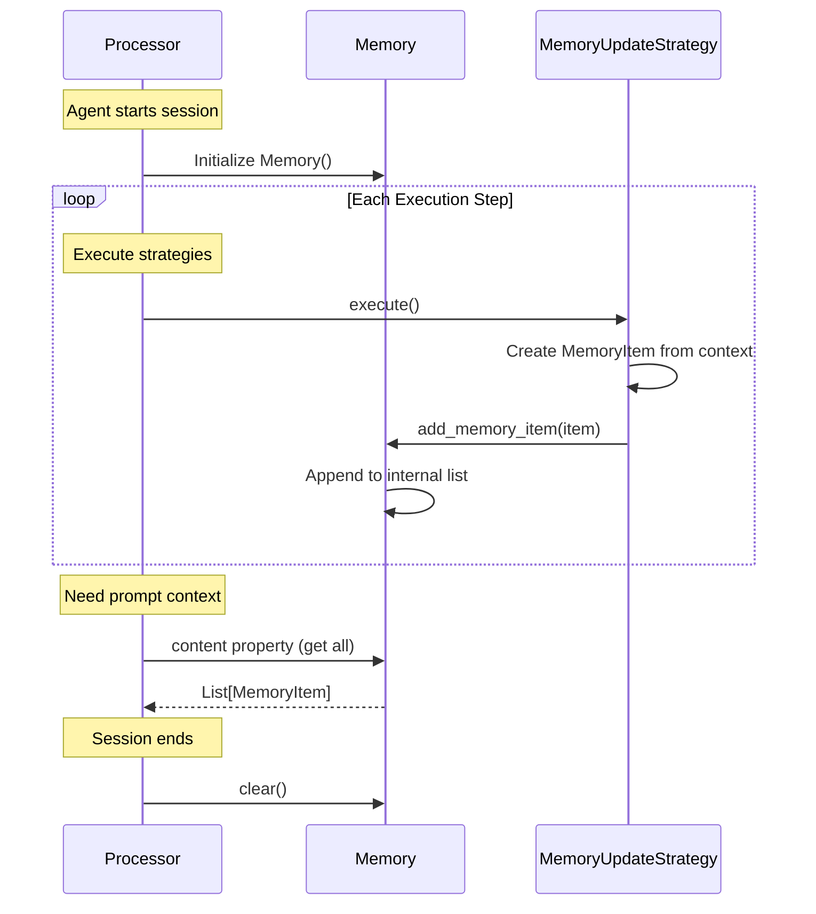
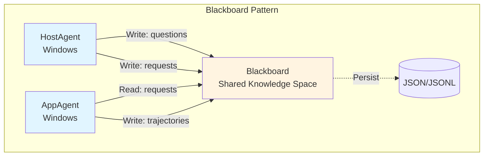
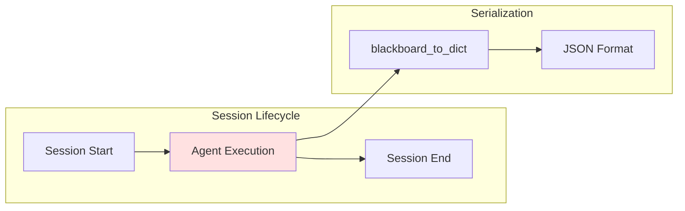
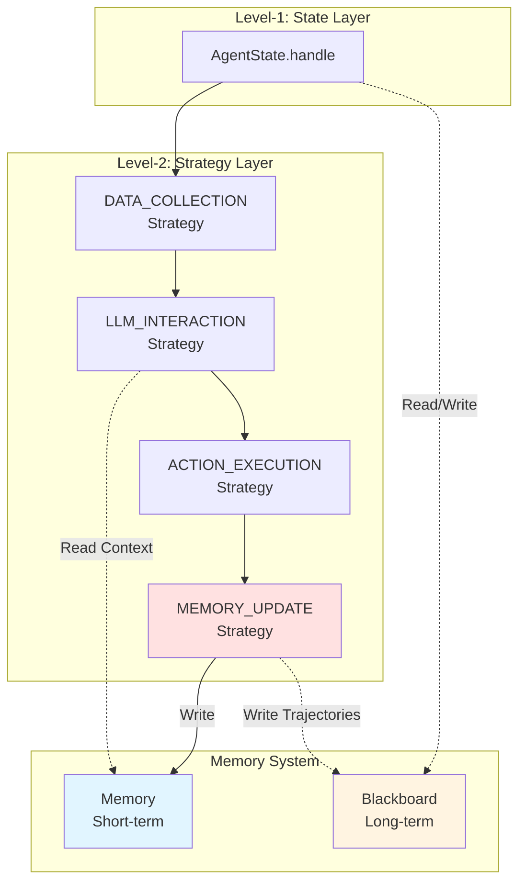

# Memory System

The Memory System provides both short-term and long-term memory capabilities for Device Agents in UFO3. The system consists of two primary components: **Memory** (agent-specific execution history) and **Blackboard** (shared multi-agent communication). This dual-memory architecture enables agents to maintain their own execution context while coordinating seamlessly across devices and sessions.

## Overview

The Memory System supports the Device Agent architecture through two distinct but complementary mechanisms:



| Component | Scope | Persistence | Primary Use Case |
|-----------|-------|-------------|------------------|
| **Memory** | Agent-specific | Session lifetime | Execution history, context tracking |
| **Blackboard** | Multi-agent shared | Configurable (file-backed) | Cross-agent coordination, information sharing |

**Design Benefits:**
- **Separation of Concerns**: Agent-specific history isolated from shared state
- **Scalability**: Each agent manages own memory independently
- **Coordination**: Blackboard enables multi-agent communication without tight coupling
- **Persistence**: Blackboard can survive session restarts (file-backed storage)

---

## Memory (Short-term Agent Memory)

The `Memory` class manages the **short-term execution history** of a single agent. Each agent instance has its own `Memory` that records every interaction step, forming a chronological execution trace.

### Memory Architecture



### MemoryItem Structure

A `MemoryItem` is a flexible dataclass that represents a **single execution step** in the agent's history. The structure is customizable to accommodate different agent types and platforms.

::: agents.memory.memory.MemoryItem

#### Common MemoryItem Fields

| Field | Type | Description | Usage in Strategies |
|-------|------|-------------|---------------------|
| `step` | `int` | Execution step number | Tracking execution progress |
| `screenshot` | `str` (path) | Screenshot file path | Visual context for LLM reasoning |
| `action` | `str` | Action function name | Execution history, replay |
| `arguments` | `Dict[str, Any]` | Action arguments | Debugging, audit logging |
| `results` | `List[Result]` | Command execution results | Success/failure tracking |
| `observation` | `str` | UI element descriptions | LLM prompt context |
| `control_text` | `str` | UI text content | Element identification |
| `request` | `str` | User request at this step | Task context |
| `response` | `str` | LLM raw response | Debugging LLM decisions |
| `parsed_response` | `Dict` | Parsed LLM output | Structured action extraction |
| `cost` | `float` | LLM API cost | Budget tracking |
| `error` | `Optional[str]` | Error message if failed | Error recovery |

**Example: Creating a MemoryItem**
    ```python
    from ufo.agents.memory.memory import MemoryItem
    
    # After executing a step, create memory item
    memory_item = MemoryItem(
        step=3,
        screenshot="screenshots/step_3.png",
        action="click_element",
        arguments={"element_id": "submit_button"},
        results=[Result(status=ResultStatus.SUCCESS, result="Button clicked")],
        observation="Submit button located at (500, 300)",
        request="Submit the form",
        response='{"action": "click_element", "element": "submit_button"}',
        parsed_response={"action": "click_element", "element": "submit_button"},
        cost=0.0023
    )
    ```

**Note on Flexible Schema:**
`MemoryItem` uses a flexible dataclass structure. Agent implementations can add custom fields based on their specific requirements. For example, Windows agents might add `ui_automation_info`, while Linux agents might add `shell_output`.

### Memory Class

The `Memory` class manages a **list of MemoryItem instances**, providing methods to add, retrieve, and filter execution history.

::: agents.memory.memory.Memory

#### Key Methods

| Method | Purpose | Usage |
|--------|---------|-------|
| `add_memory_item(item)` | Append new execution step | Called by `MEMORY_UPDATE` strategy after each step |
| `get_latest_item()` | Retrieve the most recent item | Get the last execution step |
| `filter_memory_from_keys(keys)` | Filter items by specific keys | Build LLM prompt with selected fields |
| `filter_memory_from_steps(steps)` | Filter items by step numbers | Retrieve specific execution steps |
| `clear()` | Reset memory | New session initialization |
| `is_empty()` | Check if memory is empty | Validate memory state |

**Example: Using Memory in Processor**
    ```python
    from ufo.agents.processors.strategies.memory_strategies import MemoryUpdateStrategy
    from ufo.agents.memory.memory import Memory, MemoryItem
    
    class AppAgentProcessor(ProcessorTemplate):
        def __init__(self, agent, context):
            super().__init__(agent, context)
            self.memory = Memory()  # Agent-specific memory
            
            # MEMORY_UPDATE strategy adds items to memory
            self.register_strategy(
                ProcessingPhase.MEMORY_UPDATE,
                MemoryUpdateStrategy(agent, context, self.memory)
            )
        
        def get_prompt_context(self) -> str:
            """Build LLM prompt with recent execution history."""
            # Get recent steps using content property
            all_steps = self.memory.content
            recent_steps = all_steps[-5:] if len(all_steps) > 5 else all_steps
            
            context = "## Recent Execution History:\n"
            for item in recent_steps:
                context += f"Step {item.get_value('step')}: {item.get_value('action')}"
                context += f"({item.get_value('arguments')}) -> {item.get_value('results')}\n"
            
            return context
    ```

#### Memory Lifecycle



**Memory Management Best Practices:**
- **Limited Context**: When building LLM prompts, use the `content` property and slice for recent items to avoid token limits
- **Selective Fields**: Only include relevant MemoryItem fields in prompts (e.g., action + results, not raw screenshots)
- **Error Analysis**: Use `filter_memory_from_keys()` to extract specific information patterns

---

## Blackboard (Long-term Shared Memory)

The `Blackboard` class implements the **Blackboard Pattern** for multi-agent coordination. It provides a shared memory space where agents can read and write information that persists across sessions and is accessible to all agents.

### Blackboard Pattern

The Blackboard Pattern is a well-known architectural pattern for multi-agent systems:



**Blackboard Pattern Characteristics:**
- **Centralized Knowledge**: All agents read/write from a single shared space
- **Loose Coupling**: Agents don't directly communicate; they interact via blackboard
- **Opportunistic Scheduling**: Agents can act when relevant information appears on blackboard
- **Persistence**: Knowledge survives agent restarts and session boundaries

### Blackboard Architecture

The Blackboard is organized with four main memory components, each storing a list of `MemoryItem` objects:

```python
# Blackboard internal structure
class Blackboard:
    _questions: Memory      # Q&A pairs with user
    _requests: Memory       # Historical user requests
    _trajectories: Memory   # Step-wise execution history
    _screenshots: Memory    # Important screenshots
```

Each component is a `Memory` object that stores `MemoryItem` instances with flexible key-value pairs.

### Blackboard Class

::: agents.memory.blackboard.Blackboard

#### Key Methods

| Method | Purpose | Example Usage |
|--------|---------|---------------|
| `add_questions(item)` | Add Q&A with user | Store user clarification dialogs |
| `add_requests(item)` | Add user request | Track historical user requests |
| `add_trajectories(item)` | Add execution step | Record agent actions and decisions |
| `add_image(path, metadata)` | Add screenshot | Save important UI states |
| `blackboard_to_prompt()` | Convert to LLM prompt | Build context for agent inference |
| `blackboard_to_dict()` | Export as dictionary | Serialize for persistence |
| `blackboard_from_dict(data)` | Import from dictionary | Restore from persistence |
| `clear()` | Reset blackboard | New session initialization |
| `is_empty()` | Check if empty | Validate blackboard state |

**Example: Multi-Agent Coordination via Blackboard**
    ```python
    from ufo.agents.memory.blackboard import Blackboard
    
    # Initialize shared blackboard
    blackboard = Blackboard()
    
    # HostAgent adds user request to blackboard
    class HostAgent:
        def handle(self, context):
            # ... process user request ...
            user_request = "Create a presentation about AI"
            
            # Write to blackboard for AppAgent to read
            blackboard.add_requests({"request": user_request, "timestamp": "2025-11-12"})
            blackboard.add_trajectories({
                "step": 1,
                "agent": "HostAgent",
                "action": "delegate_task",
                "app": "PowerPoint"
            })
            
            # Delegate to AppAgent
            return AgentStatus.CONTINUE, AppAgent
    
    # AppAgent reads from blackboard and performs task
    class AppAgent:
        def handle(self, context):
            # Read from blackboard
            recent_requests = blackboard.requests.content
            if recent_requests:
                last_request = recent_requests[-1]
                print(f"AppAgent working on: {last_request.get_value('request')}")
            
            # ... perform actions ...
            
            # Write task result back to blackboard
            blackboard.add_trajectories({
                "step": 2,
                "agent": "AppAgent",
                "action": "create_presentation",
                "status": "completed"
            })
            
            return AgentStatus.FINISH, None
    ```

### Blackboard Persistence

The Blackboard supports serialization for session recovery:



**Example: Blackboard Serialization**
    ```python
    from ufo.agents.memory.blackboard import Blackboard
    import json
    
    # Create and use blackboard
    blackboard = Blackboard()
    blackboard.add_requests({"request": "Create chart", "priority": "high"})
    blackboard.add_trajectories({"step": 1, "action": "open_excel"})
    
    # Serialize to dictionary
    blackboard_dict = blackboard.blackboard_to_dict()
    
    # Save to file
    with open("blackboard_state.json", "w") as f:
        json.dump(blackboard_dict, f)
    
    # Later, restore from file
    new_blackboard = Blackboard()
    with open("blackboard_state.json", "r") as f:
        loaded_dict = json.load(f)
    new_blackboard.blackboard_from_dict(loaded_dict)
    ```

---

## Memory Types and Usage Patterns

The Memory System supports different types of information storage based on use cases:

| Memory Type | Storage Location | Persistence | Access Pattern | Primary Use Case |
|-------------|------------------|-------------|----------------|------------------|
| **Execution History** | Memory (agent-specific) | Session lifetime | Sequential, recent-first | LLM context, debugging |
| **Shared State** | Blackboard | File-backed | Key-value lookup | Multi-agent coordination |
| **Session Context** | Blackboard | File-backed | Hierarchical access | Session recovery, checkpoints |
| **Global Trajectories** | Blackboard | JSONL append | Sequential log | Audit trail, analytics |

### Common Memory Patterns

#### Pattern 1: Recent Context for LLM Prompts

```python
# Use Memory.content property to get recent execution context
all_items = agent.memory.content
recent_steps = all_items[-5:] if len(all_items) > 5 else all_items
prompt_context = "\n".join([
    f"Step {item.get_value('step')}: {item.get_value('action')}"
    for item in recent_steps
])
```

#### Pattern 2: Multi-Agent Information Sharing

```python
# HostAgent writes to Blackboard
blackboard.add_requests({"request": "Create Excel chart", "app": "Excel"})

# AppAgent reads from Blackboard
requests = blackboard.requests.content
if requests:
    latest_request = requests[-1]
    app = latest_request.get_value("app")
```

#### Pattern 3: Execution History Tracking

```python
# Record each step in trajectories
blackboard.add_trajectories({
    "step": 1,
    "agent": "AppAgent",
    "action": "click_button",
    "target": "Save",
    "status": "success"
})

# Later, review execution history
history = blackboard.trajectories.content
for item in history:
    print(f"Step {item.get_value('step')}: {item.get_value('action')}")
```

#### Pattern 4: Screenshot Memory

```python
# Save important UI state with metadata
blackboard.add_image(
    screenshot_path="screenshots/step_5.png",
    metadata={"step": 5, "description": "Before form submission"}
)

# Access screenshots for review
screenshots = blackboard.screenshots.content
for screenshot in screenshots:
    metadata = screenshot.get_value("metadata")
    path = screenshot.get_value("image_path")
```

---

## Integration with Agent Architecture

The Memory System integrates with all three architectural layers:



### Integration Points

| Component | Interaction with Memory | Interaction with Blackboard |
|-----------|-------------------------|----------------------------|
| **AgentState.handle()** | - | Read shared state, write delegation info |
| **DATA_COLLECTION Strategy** | Read recent steps for context | - |
| **LLM_INTERACTION Strategy** | Read history for prompt building | - |
| **ACTION_EXECUTION Strategy** | - | - |
| **MEMORY_UPDATE Strategy** | Write MemoryItem after each step | Write execution trajectories |
| **ProcessorTemplate** | Maintain agent-specific Memory instance | Access shared Blackboard instance |

**Memory vs Blackboard Decision Guide:**

Use Memory when:
- Information is agent-specific (execution history)
- Data is only needed during current session
- Building LLM prompts with recent context
- Tracking agent's own performance

Use Blackboard when:
- Information needs to be shared across agents
- Data should persist across session restarts
- Coordinating multi-agent workflows
- Implementing handoffs between agents
- Storing global task state

---

## Best Practices

### Memory Management

**Limit Memory Size:**
```python
# Prevent unbounded memory growth
class Memory:
    MAX_ITEMS = 100
    
    def add_memory_item(self, item):
        self._content.append(item)
        if len(self._content) > self.MAX_ITEMS:
            self._content = self._content[-self.MAX_ITEMS:]  # Keep latest 100
```

**Selective Context for LLM:**
```python
# Don't send full MemoryItem objects to LLM
def build_prompt_context(memory):
    all_items = memory.content
    recent = all_items[-5:] if len(all_items) > 5 else all_items
    return "\n".join([
        f"Step {item.get_value('step')}: {item.get_value('action')} -> "
        f"{item.get_value('status')}"
        for item in recent
    ])
```

**Avoid Storing Large Binary Data:**
Store file paths instead of file contents in MemoryItem:
```python
# Good: Store path
memory_item.set_value("screenshot", "screenshots/step_3.png")

# Bad: Store binary data
# memory_item.set_value("screenshot", <binary image data>)
```

### Blackboard Management

**Organize with Descriptive Keys:**
```python
# Use descriptive keys in MemoryItem dictionaries
blackboard.add_trajectories({
    "step": 1,
    "agent": "HostAgent",
    "action": "select_app",
    "app_name": "Word",
    "timestamp": "2025-11-12T10:00:00"
})
```

**Regular Serialization:**
```python
# Periodically save blackboard state
class Session:
    def __init__(self):
        self.blackboard = Blackboard()
        self.save_interval = 10  # Every 10 steps
    
    def execute_step(self, step_num):
        # ... execute step ...
        
        if step_num % self.save_interval == 0:
            state = self.blackboard.blackboard_to_dict()
            with open("blackboard_backup.json", "w") as f:
                json.dump(state, f)
```

**Clean Up Appropriately:**
```python
# Clear blackboard when starting new session
if new_session:
    blackboard.clear()
```

---

## Common Pitfalls

**Pitfall 1: Confusing Memory and Blackboard Scope**

Problem: Storing agent-specific data in Blackboard or shared data in Memory.

Solution: Follow the scope principle:
- Memory = agent-specific, session-lifetime
- Blackboard = multi-agent shared, persistent

```python
# Correct
agent.memory.add_memory_item(...)  # Agent's own history
blackboard.add_trajectories({...})  # Shared execution history
```

**Pitfall 2: Memory Leaks in Long Sessions**

Problem: Memory grows unbounded in long-running sessions.

Solution: Implement memory size limits or periodic cleanup:
```python
# Add size limit
if len(memory.content) > 1000:
    memory._content = memory.content[-500:]  # Keep recent half
```

**Pitfall 3: Not Preserving Important State**

Problem: Losing important state during crashes.

Solution: Periodically serialize critical Blackboard state:
```python
# After critical operations
state = blackboard.blackboard_to_dict()
with open("checkpoint.json", "w") as f:
    json.dump(state, f)
```

## Related Documentation

- [Device Agent Overview](../overview.md) - Memory system in overall architecture
- [Strategy Layer](processor.md) - `MEMORY_UPDATE` strategy implementation
- [State Layer](state.md) - States reading/writing Blackboard for coordination
- [Module System - Round](../../modules/round.md) - Round-level memory management
- [Module System - Context](../../modules/context.md) - Context data vs Memory data separation

## API Reference

For complete API documentation, see:

::: agents.memory.memory.Memory
::: agents.memory.memory.MemoryItem
::: agents.memory.blackboard.Blackboard

## Summary

**Key Takeaways:**
- **Dual-Memory Architecture**: Memory (short-term, agent-specific) + Blackboard (long-term, shared)
- **Memory for Execution History**: Stores chronological MemoryItem instances for LLM context and debugging
- **Blackboard for Coordination**: Implements Blackboard Pattern for multi-agent communication
- **Flexible Schema**: MemoryItem supports custom fields for platform-specific requirements
- **Persistence Support**: Blackboard can serialize/deserialize via dictionaries for session recovery
- **Integration**: MEMORY_UPDATE strategy writes to Memory, states coordinate via Blackboard
- **Best Practices**: Limit memory size, organize Blackboard with descriptive keys, periodically serialize state
- **Scope Awareness**: Use Memory for agent-specific data, Blackboard for shared coordination

The Memory System provides the foundation for both individual agent intelligence (through execution history) and collective multi-agent coordination (through shared knowledge space), enabling UFO3 to orchestrate complex cross-device tasks effectively.