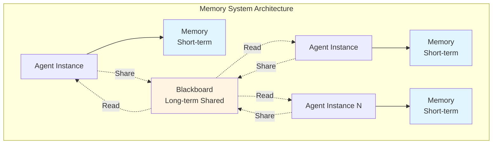
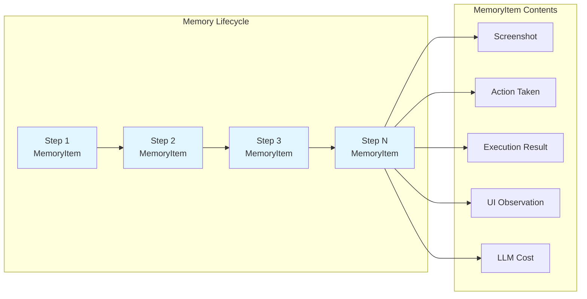
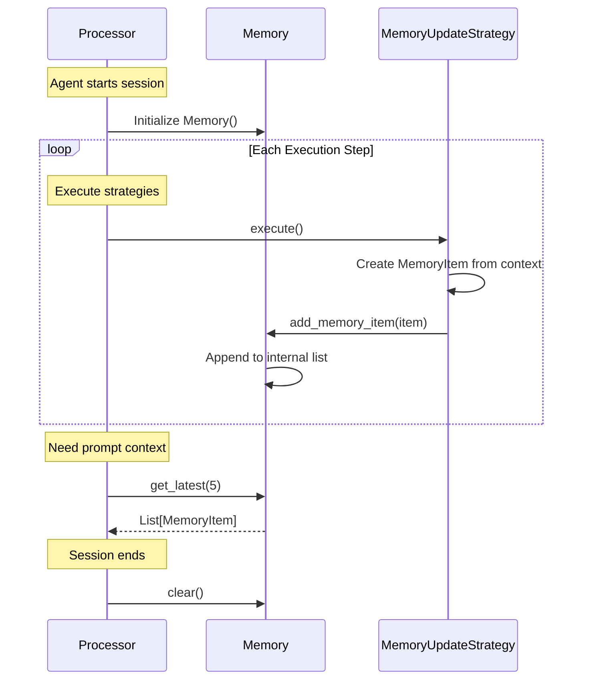
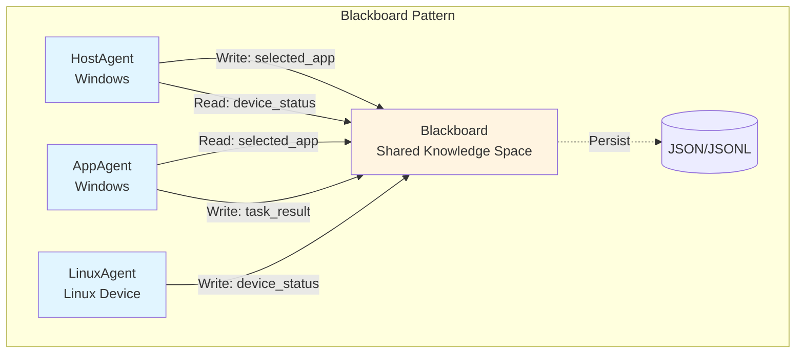
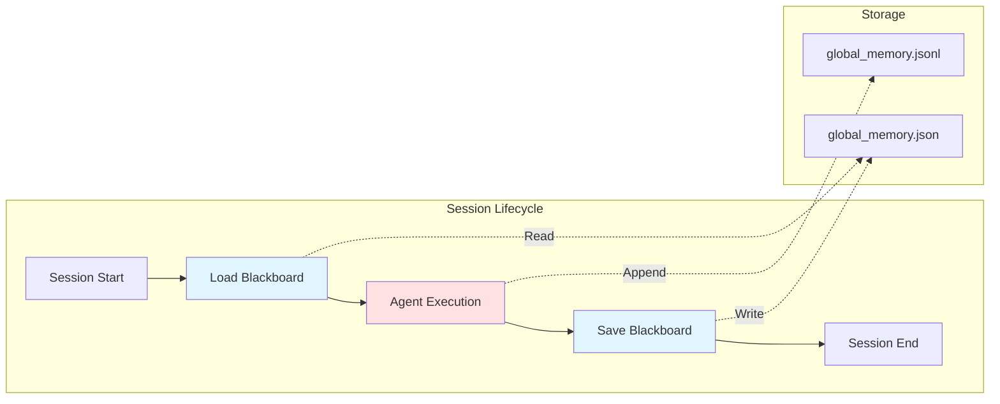
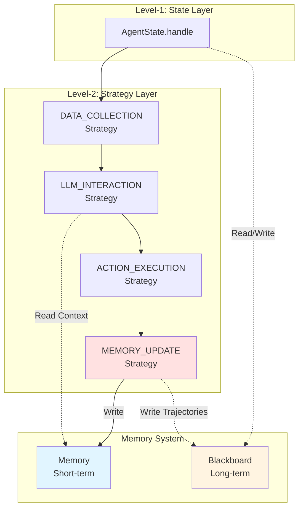

# Memory System

!!! quote "Memory System Overview"
    The Memory System provides both short-term and long-term memory capabilities for Device Agents in UFO3. The system consists of two primary components: **Memory** (agent-specific execution history) and **Blackboard** (shared multi-agent communication). This dual-memory architecture enables agents to maintain their own execution context while coordinating seamlessly across devices and sessions.

## Overview

The Memory System supports the Device Agent architecture through two distinct but complementary mechanisms:



| Component | Scope | Persistence | Primary Use Case |
|-----------|-------|-------------|------------------|
| **Memory** | Agent-specific | Session lifetime | Execution history, context tracking |
| **Blackboard** | Multi-agent shared | Configurable (file-backed) | Cross-agent coordination, information sharing |

!!! success "Design Benefits"
    - **Separation of Concerns**: Agent-specific history isolated from shared state
    - **Scalability**: Each agent manages own memory independently
    - **Coordination**: Blackboard enables multi-agent communication without tight coupling
    - **Persistence**: Blackboard can survive session restarts (file-backed storage)

---

## Memory (Short-term Agent Memory)

The `Memory` class manages the **short-term execution history** of a single agent. Each agent instance has its own `Memory` that records every interaction step, forming a chronological execution trace.

### Memory Architecture



### MemoryItem Structure

A `MemoryItem` is a flexible dataclass that represents a **single execution step** in the agent's history. The structure is customizable to accommodate different agent types and platforms.

::: agents.memory.memory.MemoryItem

#### Common MemoryItem Fields

| Field | Type | Description | Usage in Strategies |
|-------|------|-------------|---------------------|
| `step` | `int` | Execution step number | Tracking execution progress |
| `screenshot` | `str` (path) | Screenshot file path | Visual context for LLM reasoning |
| `action` | `str` | Action function name | Execution history, replay |
| `arguments` | `Dict[str, Any]` | Action arguments | Debugging, audit logging |
| `results` | `List[Result]` | Command execution results | Success/failure tracking |
| `observation` | `str` | UI element descriptions | LLM prompt context |
| `control_text` | `str` | UI text content | Element identification |
| `request` | `str` | User request at this step | Task context |
| `response` | `str` | LLM raw response | Debugging LLM decisions |
| `parsed_response` | `Dict` | Parsed LLM output | Structured action extraction |
| `cost` | `float` | LLM API cost | Budget tracking |
| `error` | `Optional[str]` | Error message if failed | Error recovery |

!!! example "Creating a MemoryItem"
    ```python
    from ufo.agents.memory.memory import MemoryItem
    
    # After executing a step, create memory item
    memory_item = MemoryItem(
        step=3,
        screenshot="screenshots/step_3.png",
        action="click_element",
        arguments={"element_id": "submit_button"},
        results=[Result(status=ResultStatus.SUCCESS, result="Button clicked")],
        observation="Submit button located at (500, 300)",
        request="Submit the form",
        response='{"action": "click_element", "element": "submit_button"}',
        parsed_response={"action": "click_element", "element": "submit_button"},
        cost=0.0023
    )
    ```

!!! info "Flexible Schema"
    `MemoryItem` uses a flexible dataclass structure. Agent implementations can add custom fields based on their specific requirements. For example, Windows agents might add `ui_automation_info`, while Linux agents might add `shell_output`.

### Memory Class

The `Memory` class manages a **list of MemoryItem instances**, providing methods to add, retrieve, and filter execution history.

::: agents.memory.memory.Memory

#### Key Methods

| Method | Purpose | Usage |
|--------|---------|-------|
| `add_memory_item(item)` | Append new execution step | Called by `MEMORY_UPDATE` strategy after each step |
| `get_latest(n)` | Retrieve last N items | Build LLM prompt with recent context |
| `get_all()` | Retrieve full history | Session replay, debugging |
| `filter_by_status(status)` | Get items with specific result status | Error analysis, success tracking |
| `get_total_cost()` | Sum LLM API costs | Budget monitoring |
| `clear()` | Reset memory | New session initialization |

!!! example "Using Memory in Processor"
    ```python
    from ufo.agents.processors.strategies.memory_strategies import MemoryUpdateStrategy
    from ufo.agents.memory.memory import Memory, MemoryItem
    
    class AppAgentProcessor(ProcessorTemplate):
        def __init__(self, agent, context):
            super().__init__(agent, context)
            self.memory = Memory()  # Agent-specific memory
            
            # MEMORY_UPDATE strategy adds items to memory
            self.register_strategy(
                ProcessingPhase.MEMORY_UPDATE,
                MemoryUpdateStrategy(agent, context, self.memory)
            )
        
        def get_prompt_context(self) -> str:
            """Build LLM prompt with recent execution history."""
            recent_steps = self.memory.get_latest(5)  # Last 5 steps
            
            context = "## Recent Execution History:\n"
            for item in recent_steps:
                context += f"Step {item.step}: {item.action}"
                context += f"({item.arguments}) -> {item.results[0].status}\n"
            
            return context
    ```

#### Memory Lifecycle



!!! tip "Memory Management Best Practices"
    - **Limited Context**: When building LLM prompts, use `get_latest(n)` instead of `get_all()` to avoid token limits
    - **Selective Fields**: Only include relevant MemoryItem fields in prompts (e.g., action + results, not raw screenshots)
    - **Cost Tracking**: Regularly check `get_total_cost()` to monitor API spending
    - **Error Analysis**: Use `filter_by_status(ResultStatus.FAILURE)` to identify failure patterns

---

## Blackboard (Long-term Shared Memory)

The `Blackboard` class implements the **Blackboard Pattern** for multi-agent coordination. It provides a shared memory space where agents can read and write information that persists across sessions and is accessible to all agents.

### Blackboard Pattern

The Blackboard Pattern is a well-known architectural pattern for multi-agent systems:



!!! info "Blackboard Pattern Characteristics"
    - **Centralized Knowledge**: All agents read/write from a single shared space
    - **Loose Coupling**: Agents don't directly communicate; they interact via blackboard
    - **Opportunistic Scheduling**: Agents can act when relevant information appears on blackboard
    - **Persistence**: Knowledge survives agent restarts and session boundaries

### Blackboard Architecture

The Blackboard is organized as a **hierarchical key-value store** with support for nested structures:

```python
# Blackboard internal structure
{
    "session": {
        "session_id": "sess_12345",
        "start_time": "2025-11-05T10:00:00",
        "devices": ["Windows-Desktop", "Linux-Server"]
    },
    "agents": {
        "HostAgent": {
            "selected_app": "Microsoft Word",
            "app_window_handle": 0x1234,
            "status": "delegated_to_app_agent"
        },
        "AppAgent": {
            "current_control": "document_area",
            "last_action": "type_text",
            "task_progress": 0.6
        }
    },
    "devices": {
        "Linux-Server": {
            "connection_status": "connected",
            "last_command": "ls /home/user",
            "available": true
        }
    },
    "global_memory": [
        {"step": 1, "agent": "HostAgent", "action": "select_app"},
        {"step": 2, "agent": "AppAgent", "action": "type_text"}
    ]
}
```

### Blackboard Class

::: agents.memory.blackboard.Blackboard

#### Key Methods

| Method | Purpose | Example Usage |
|--------|---------|---------------|
| `add_trajectories(key, value)` | Add execution history | Track multi-agent task flow |
| `get_trajectories(key)` | Retrieve history by key | Replay agent actions |
| `add_key_value(key, value)` | Store simple value | Share status, IDs, handles |
| `get_value(key)` | Retrieve value | Access shared state |
| `update_value(key, value)` | Modify existing value | Update progress, status |
| `delete_key(key)` | Remove key | Clean up temporary data |
| `save_to_file(path)` | Persist to disk | Session checkpoint |
| `load_from_file(path)` | Restore from disk | Session recovery |
| `clear()` | Reset blackboard | New session initialization |

!!! example "Multi-Agent Coordination via Blackboard"
    ```python
    from ufo.agents.memory.blackboard import Blackboard
    
    # Initialize shared blackboard
    blackboard = Blackboard()
    
    # HostAgent selects application and writes to blackboard
    class HostAgent:
        def handle(self, context):
            # ... select application logic ...
            selected_app = "Microsoft Word"
            window_handle = 0x1234
            
            # Write to blackboard for AppAgent to read
            blackboard.add_key_value("selected_app", selected_app)
            blackboard.add_key_value("app_window_handle", window_handle)
            blackboard.add_trajectories("execution_flow", {
                "step": 1,
                "agent": "HostAgent",
                "action": "select_app",
                "result": selected_app
            })
            
            # Delegate to AppAgent
            return AgentStatus.CONTINUE, AppAgent
    
    # AppAgent reads from blackboard and performs task
    class AppAgent:
        def handle(self, context):
            # Read from blackboard
            app_name = blackboard.get_value("selected_app")
            window_handle = blackboard.get_value("app_window_handle")
            
            print(f"AppAgent working on: {app_name}")
            
            # ... perform actions ...
            
            # Write task result back to blackboard
            blackboard.add_key_value("task_status", "completed")
            blackboard.add_trajectories("execution_flow", {
                "step": 2,
                "agent": "AppAgent",
                "action": "complete_task",
                "result": "success"
            })
            
            return AgentStatus.FINISH, None
    ```

!!! example "Cross-Device Coordination"
    ```python
    # Device 1 (Windows): HostAgent prepares data
    blackboard.add_key_value("devices/windows/data_file", "C:/temp/data.csv")
    blackboard.add_key_value("devices/windows/ready", True)
    
    # Device 2 (Linux): LinuxAgent waits for data availability
    if blackboard.get_value("devices/windows/ready"):
        file_path = blackboard.get_value("devices/windows/data_file")
        # Process file on Linux device
        blackboard.add_key_value("devices/linux/processing_status", "started")
    ```

### Blackboard Persistence

The Blackboard supports file-backed persistence for session recovery:



!!! example "Blackboard Persistence"
    ```python
    from ufo.agents.memory.blackboard import Blackboard
    
    # Session start: Load previous state
    blackboard = Blackboard()
    blackboard.load_from_file("customization/global_memory.json")
    
    # Resume task with previous context
    previous_status = blackboard.get_value("task_status")
    if previous_status == "incomplete":
        # Resume from checkpoint
        last_step = blackboard.get_trajectories("execution_flow")[-1]
        print(f"Resuming from step {last_step['step']}")
    
    # ... agent execution ...
    
    # Session end: Persist state
    blackboard.save_to_file("customization/global_memory.json")
    ```

---

## Memory Types and Usage Patterns

The Memory System supports different types of information storage based on use cases:

| Memory Type | Storage Location | Persistence | Access Pattern | Primary Use Case |
|-------------|------------------|-------------|----------------|------------------|
| **Execution History** | Memory (agent-specific) | Session lifetime | Sequential, recent-first | LLM context, debugging |
| **Shared State** | Blackboard | File-backed | Key-value lookup | Multi-agent coordination |
| **Session Context** | Blackboard | File-backed | Hierarchical access | Session recovery, checkpoints |
| **Global Trajectories** | Blackboard | JSONL append | Sequential log | Audit trail, analytics |

### Common Memory Patterns

#### Pattern 1: Recent Context for LLM Prompts

```python
# Use Memory.get_latest() for recent execution context
recent_steps = agent.memory.get_latest(5)
prompt_context = "\n".join([
    f"Step {item.step}: {item.action} -> {item.results[0].status}"
    for item in recent_steps
])
```

#### Pattern 2: Multi-Agent Handoff

```python
# HostAgent writes to Blackboard
blackboard.add_key_value("handoff/target_app", "Excel")
blackboard.add_key_value("handoff/task_description", "Create chart")

# AppAgent reads from Blackboard
target_app = blackboard.get_value("handoff/target_app")
task = blackboard.get_value("handoff/task_description")
```

#### Pattern 3: Cross-Device Task Coordination

```python
# Device 1: Mark task as ready
blackboard.add_key_value("tasks/task_123/status", "ready")
blackboard.add_key_value("tasks/task_123/data", {...})

# Device 2: Poll for task availability
task_status = blackboard.get_value("tasks/task_123/status")
if task_status == "ready":
    task_data = blackboard.get_value("tasks/task_123/data")
    # Process task
    blackboard.update_value("tasks/task_123/status", "completed")
```

#### Pattern 4: Error Recovery with Persistent State

```python
# Before risky operation, checkpoint to Blackboard
blackboard.add_key_value("checkpoint/step", current_step)
blackboard.add_key_value("checkpoint/state", agent_state)
blackboard.save_to_file("customization/global_memory.json")

# After failure, restore from checkpoint
blackboard.load_from_file("customization/global_memory.json")
checkpoint_step = blackboard.get_value("checkpoint/step")
checkpoint_state = blackboard.get_value("checkpoint/state")
# Resume from checkpoint
```

---

## Integration with Agent Architecture

The Memory System integrates with all three architectural layers:



### Integration Points

| Component | Interaction with Memory | Interaction with Blackboard |
|-----------|-------------------------|----------------------------|
| **AgentState.handle()** | - | Read shared state, write delegation info |
| **DATA_COLLECTION Strategy** | Read recent steps for context | - |
| **LLM_INTERACTION Strategy** | Read history for prompt building | - |
| **ACTION_EXECUTION Strategy** | - | - |
| **MEMORY_UPDATE Strategy** | Write MemoryItem after each step | Write execution trajectories |
| **ProcessorTemplate** | Maintain agent-specific Memory instance | Access shared Blackboard instance |

!!! tip "Memory vs Blackboard Decision Guide"
    - **Use Memory when**:
        - Information is agent-specific (execution history)
        - Data is only needed during current session
        - Building LLM prompts with recent context
        - Tracking agent's own cost and performance
    
    - **Use Blackboard when**:
        - Information needs to be shared across agents
        - Data should persist across session restarts
        - Coordinating multi-agent workflows
        - Implementing handoffs between agents
        - Storing global task state

---

## Best Practices

### Memory Management

!!! tip "Limit Memory Size"
    ```python
    # Prevent unbounded memory growth
    class Memory:
        MAX_ITEMS = 100
        
        def add_memory_item(self, item):
            self._items.append(item)
            if len(self._items) > self.MAX_ITEMS:
                self._items = self._items[-self.MAX_ITEMS:]  # Keep latest 100
    ```

!!! tip "Selective Context for LLM"
    ```python
    # Don't send full MemoryItem objects to LLM
    def build_prompt_context(memory):
        recent = memory.get_latest(5)
        return "\n".join([
            f"Step {item.step}: {item.action}({item.arguments}) -> "
            f"{item.results[0].status}"
            for item in recent
        ])
    ```

!!! warning "Avoid Storing Large Binary Data"
    Store file paths instead of file contents in MemoryItem:
    ```python
    # Good: Store path
    memory_item.screenshot = "screenshots/step_3.png"
    
    # Bad: Store binary data
    # memory_item.screenshot = <binary image data>
    ```

### Blackboard Management

!!! tip "Hierarchical Keys"
    ```python
    # Use hierarchical key structure for organization
    blackboard.add_key_value("agents/host/status", "active")
    blackboard.add_key_value("agents/app/current_control", "button_123")
    blackboard.add_key_value("devices/linux/connection", "connected")
    ```

!!! tip "Regular Persistence"
    ```python
    # Save blackboard periodically
    class Session:
        def __init__(self):
            self.blackboard = Blackboard()
            self.save_interval = 10  # Every 10 steps
        
        def execute_step(self, step_num):
            # ... execute step ...
            
            if step_num % self.save_interval == 0:
                self.blackboard.save_to_file("customization/global_memory.json")
    ```

!!! warning "Avoid Race Conditions"
    The Blackboard is not thread-safe. Use external locking for concurrent access:
    ```python
    import threading
    
    blackboard_lock = threading.Lock()
    
    with blackboard_lock:
        value = blackboard.get_value("shared_counter")
        blackboard.update_value("shared_counter", value + 1)
    ```

!!! danger "Clean Up Temporary Data"
    ```python
    # Clean up temporary coordination data after use
    blackboard.add_key_value("temp/handoff_data", {...})
    
    # ... use data ...
    
    # Clean up
    blackboard.delete_key("temp/handoff_data")
    ```

---

## Common Pitfalls

!!! warning "Pitfall 1: Confusing Memory and Blackboard Scope"
    **Problem**: Storing agent-specific data in Blackboard or shared data in Memory.
    
    **Solution**: Follow the scope principle:
    - Memory = agent-specific, session-lifetime
    - Blackboard = multi-agent shared, persistent
    
    ```python
    # Correct
    agent.memory.add_memory_item(...)  # Agent's own history
    blackboard.add_key_value("shared_status", ...)  # Shared state
    
    # Incorrect
    blackboard.add_key_value("agent_123_memory", [...])  # Don't store agent memory in blackboard
    ```

!!! warning "Pitfall 2: Memory Leaks in Long Sessions"
    **Problem**: Memory grows unbounded in long-running sessions.
    
    **Solution**: Implement memory size limits or periodic cleanup:
    ```python
    # Add size limit
    if len(memory._items) > 1000:
        memory._items = memory._items[-500:]  # Keep recent half
    ```

!!! warning "Pitfall 3: Blackboard Key Collisions"
    **Problem**: Different agents overwrite same keys.
    
    **Solution**: Use namespaced keys:
    ```python
    # Good: Namespaced keys
    blackboard.add_key_value(f"agents/{agent.name}/status", "active")
    
    # Bad: Generic keys
    blackboard.add_key_value("status", "active")  # Which agent's status?
    ```

!!! warning "Pitfall 4: Not Persisting Critical State"
    **Problem**: Losing important state during crashes.
    
    **Solution**: Checkpoint critical state immediately:
    ```python
    # After critical operations
    blackboard.add_key_value("critical/last_checkpoint", {...})
    blackboard.save_to_file("customization/global_memory.json")
    ```

---

## Related Documentation

- **[Device Agent Overview](../overview.md)**: Memory system in overall architecture
- **[Strategy Layer](processor.md)**: `MEMORY_UPDATE` strategy implementation
- **[State Layer](state.md)**: States reading/writing Blackboard for coordination
- **[Module System - Round](../../modules/round.md)**: Round-level memory management
- **[Module System - Context](../../modules/context.md)**: Context data vs Memory data separation

---

## API Reference

For complete API documentation, see:

::: agents.memory.memory.Memory
::: agents.memory.memory.MemoryItem
::: agents.memory.blackboard.Blackboard

---

## Summary

!!! success "Key Takeaways"
    - **Dual-Memory Architecture**: Memory (short-term, agent-specific) + Blackboard (long-term, shared)
    - **Memory for Execution History**: Stores chronological MemoryItem instances for LLM context and debugging
    - **Blackboard for Coordination**: Implements Blackboard Pattern for multi-agent and cross-device communication
    - **Flexible Schema**: MemoryItem supports custom fields for platform-specific requirements
    - **Persistence Support**: Blackboard can save/load from files for session recovery
    - **Integration**: MEMORY_UPDATE strategy writes to Memory, states coordinate via Blackboard
    - **Best Practices**: Limit memory size, use hierarchical Blackboard keys, persist critical state
    - **Scope Awareness**: Use Memory for agent-specific data, Blackboard for shared coordination

The Memory System provides the foundation for both individual agent intelligence (through execution history) and collective multi-agent coordination (through shared knowledge space), enabling UFO3 to orchestrate complex cross-device tasks effectively.