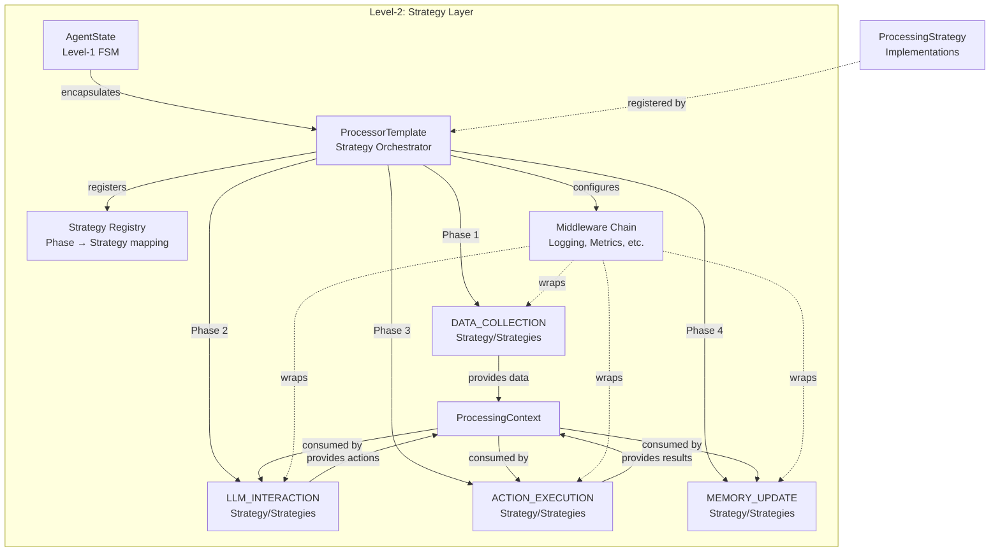
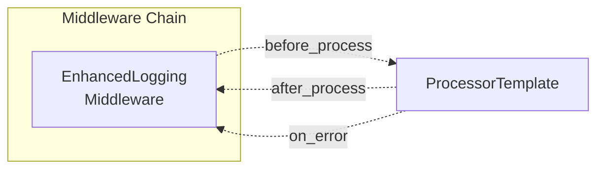
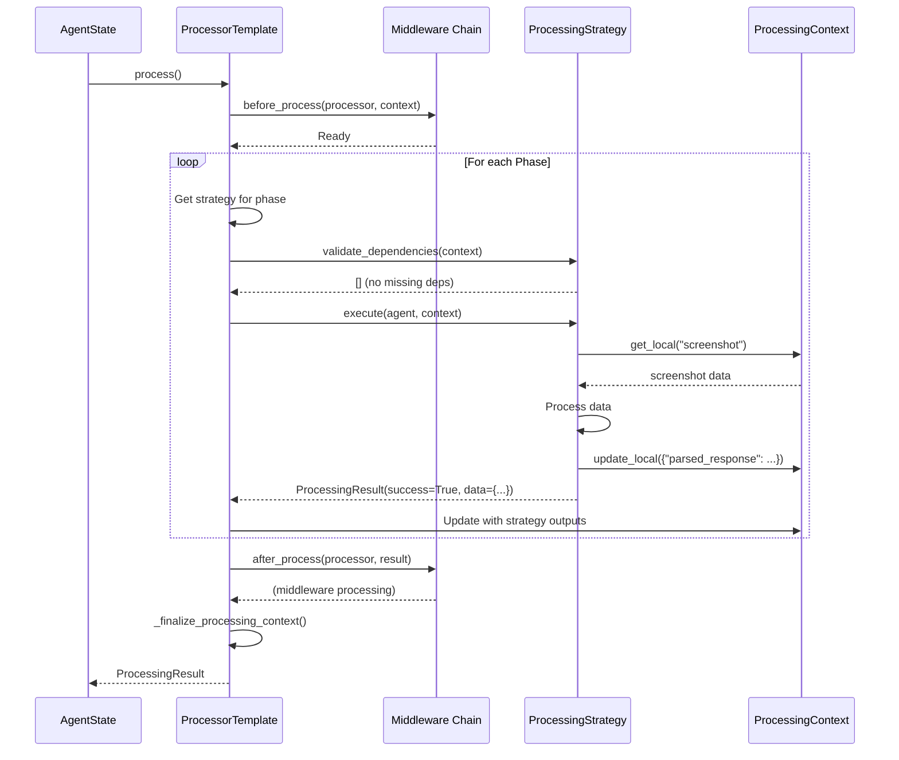

# Strategy Layer: Processor (Level-2)

The **Processor** is the core component of the **Strategy Layer (Level-2)**, providing a configurable framework that orchestrates **ProcessingStrategies** through defined phases. Each agent state encapsulates a **ProcessorTemplate** that manages strategy registration, middleware chains, dependency validation, and context management. Together with modular strategies, the processor enables agents to compose complex execution workflows from reusable components.

## Overview

The Processor implements the orchestration framework within **Level-2: Strategy Layer** of the [three-layer device agent architecture](../overview.md#three-layer-architecture). The Strategy Layer handles:

- **Processor Framework** (This Document): Orchestrates strategy execution workflow
- **Processing Strategies** (See [strategy.md](strategy.md)): Modular execution units
- **Middleware System**: Cross-cutting concerns (logging, metrics, error handling)
- **Dependency Validation**: Ensure strategies execute in correct order
- **Context Management**: Unified data access across strategies



**Design Philosophy:** The Processor framework follows the **Template Method Pattern** where `ProcessorTemplate.process()` defines the workflow skeleton, subclasses configure phase-specific strategies, and middleware applies cross-cutting concerns uniformly. Strategies and middleware are injected at initialization, enabling extensibility without modifying the core framework.

---

## ProcessorTemplate Framework

The `ProcessorTemplate` is an **abstract base class** that defines the execution workflow. Platform-specific processors (AppAgentProcessor, HostAgentProcessor, LinuxAgentProcessor) subclass it to configure platform-specific strategies and middleware.

### ProcessorTemplate Structure

```python
from abc import ABC, abstractmethod
from typing import Dict, List, Optional, Type
from enum import Enum

class ProcessingPhase(Enum):
    """Enumeration of processor execution phases"""
    SETUP = "setup"                          # Initialization (optional)
    DATA_COLLECTION = "data_collection"      # Gather context from device
    LLM_INTERACTION = "llm_interaction"      # LLM reasoning and decision
    ACTION_EXECUTION = "action_execution"    # Execute commands on device
    MEMORY_UPDATE = "memory_update"          # Update memory and blackboard
    CLEANUP = "cleanup"                      # Cleanup (optional)


class ProcessorTemplate(ABC):
    """
    Abstract processor template defining workflow orchestration framework.
    
    Responsibilities:
    1. Strategy Registration: Configure strategies for each phase
    2. Middleware Management: Setup cross-cutting concern handlers
    3. Dependency Validation: Ensure strategy data flow is valid
    4. Workflow Execution: Orchestrate strategy execution in phase order
    5. Context Management: Create and manage ProcessingContext
    
    Subclasses must implement:
    - _setup_strategies(): Register strategies for processing phases
    - _setup_middleware(): Register middleware (optional)
    """
    
    # Subclasses can override to use custom context class
    processor_context_class: Type[BasicProcessorContext] = BasicProcessorContext
    
    def __init__(self, agent: BasicAgent, global_context: Context):
        """
        Initialize processor.
        
        :param agent: The agent instance
        :param global_context: Shared global context (session-wide)
        """
        self.agent = agent
        self.global_context = global_context
        
        # Strategy registry: phase -> strategy mapping
        self.strategies: Dict[ProcessingPhase, ProcessingStrategy] = {}
        
        # Middleware chain (executed in order)
        self.middleware_chain: List[ProcessorMiddleware] = []
        
        # Logging
        self.logger = logging.getLogger(self.__class__.__name__)
        
        # Dependency validator
        self.dependency_validator = StrategyDependencyValidator()
        
        # Lifecycle
        self._setup_strategies()      # Subclass configures strategies
        self._setup_middleware()       # Subclass configures middleware
        self._validate_strategy_chain()  # Validate dependencies
        
        # Create processing context (local data store)
        self.processing_context = self._create_processing_context()
    
    @abstractmethod
    def _setup_strategies(self) -> None:
        """
        Setup strategies for each processing phase.
        
        Subclasses must implement this method to configure their strategy workflow.
        
        Example:
            self.strategies[ProcessingPhase.DATA_COLLECTION] = ComposedStrategy([
                ScreenshotStrategy(),
                UITreeStrategy()
            ])
            self.strategies[ProcessingPhase.LLM_INTERACTION] = LLMStrategy()
            self.strategies[ProcessingPhase.ACTION_EXECUTION] = ActionStrategy()
            self.strategies[ProcessingPhase.MEMORY_UPDATE] = MemoryStrategy()
        """
        pass
    
    def _setup_middleware(self) -> None:
        """
        Setup middleware for cross-cutting concerns.
        
        Subclasses can override to add middleware (logging, metrics, etc.).
        Default: no middleware.
        
        Example:
            self.middleware_chain = [
                LoggingMiddleware(),
                MetricsMiddleware(),
                ErrorHandlingMiddleware()
            ]
        """
        pass
    
    def _validate_strategy_chain(self) -> None:
        """
        Validate that strategy dependencies are satisfied.
        
        Raises ProcessingException if validation fails.
        """
        errors = self.dependency_validator.validate_chain(self.strategies)
        if errors:
            error_msg = "Strategy chain validation failed:\n" + "\n".join(errors)
            self.logger.error(error_msg)
            raise ProcessingException(error_msg)
    
    def _create_processing_context(self) -> ProcessingContext:
        """
        Create processing context with local and global data separation.
        
        :return: ProcessingContext instance
        """
        local_context = self.processor_context_class()
        return ProcessingContext(
            global_context=self.global_context,
            local_context=local_context
        )
    
    async def process(self) -> None:
        """
        Main execution method - orchestrates workflow execution.
        
        Workflow:
        1. Execute strategies in phase order (DATA_COLLECTION → LLM → ACTION → MEMORY)
        2. Apply middleware before/after each strategy
        3. Validate dependencies before each strategy execution
        4. Update context with strategy outputs
        5. Handle errors according to strategy fail_fast setting
        
        :raises ProcessingException: If critical error occurs
        """
        try:
            self.logger.info(f"Starting processor execution: {self.__class__.__name__}")
            
            # Define execution order
            execution_order = [
                ProcessingPhase.SETUP,
                ProcessingPhase.DATA_COLLECTION,
                ProcessingPhase.LLM_INTERACTION,
                ProcessingPhase.ACTION_EXECUTION,
                ProcessingPhase.MEMORY_UPDATE,
                ProcessingPhase.CLEANUP
            ]
            
            # Execute each phase
            for phase in execution_order:
                strategy = self.strategies.get(phase)
                if not strategy:
                    self.logger.debug(f"No strategy registered for phase {phase.value}, skipping")
                    continue
                
                self.logger.info(f"Executing phase: {phase.value} with strategy: {strategy.name}")
                
                # Validate dependencies
                missing_deps = strategy.validate_dependencies(self.processing_context)
                if missing_deps:
                    raise ProcessingException(
                        f"Strategy {strategy.name} missing required dependencies: {missing_deps}"
                    )
                
                # Apply middleware (before)
                await self._apply_middleware_before(phase, strategy)
                
                # Execute strategy
                result = await strategy.execute(self.agent, self.processing_context)
                
                # Handle result
                if result.success:
                    self.logger.info(f"Strategy {strategy.name} succeeded")
                    # Update context with strategy outputs
                    self.processing_context.update_local(result.data)
                else:
                    self.logger.error(f"Strategy {strategy.name} failed: {result.error}")
                    if strategy.fail_fast:
                        raise ProcessingException(
                            f"Strategy {strategy.name} failed in phase {phase.value}: {result.error}"
                        )
                    else:
                        self.logger.warning(f"Continuing despite failure in {strategy.name}")
                
                # Apply middleware (after)
                await self._apply_middleware_after(phase, strategy, result)
            
            # Finalize context (promote local data to global if needed)
            self._finalize_processing_context()
            
            self.logger.info("Processor execution completed successfully")
            
        except Exception as e:
            self.logger.error(f"Processor execution failed: {e}", exc_info=True)
            raise
    
    async def _apply_middleware_before(
        self,
        phase: ProcessingPhase,
        strategy: ProcessingStrategy
    ) -> None:
        """
        Apply middleware before strategy execution.
        
        :param phase: Current processing phase
        :param strategy: Strategy about to execute
        """
        for middleware in self.middleware_chain:
            await middleware.before_execute(phase, strategy, self.processing_context)
    
    async def _apply_middleware_after(
        self,
        phase: ProcessingPhase,
        strategy: ProcessingStrategy,
        result: ProcessingResult
    ) -> None:
        """
        Apply middleware after strategy execution.
        
        :param phase: Current processing phase
        :param strategy: Strategy that just executed
        :param result: Strategy execution result
        """
        for middleware in self.middleware_chain:
            await middleware.after_execute(phase, strategy, result, self.processing_context)
    
    def _finalize_processing_context(self) -> None:
        """
        Finalize processing context after workflow completion.
        
        Subclasses can override to customize context finalization.
        Default: Promote selected local data to global context.
        """
        # Example: Promote final action status to global context
        if self.processing_context.get_local("action_success") is not None:
            self.global_context.set(
                "last_action_success",
                self.processing_context.get_local("action_success")
            raise
```

### ProcessorTemplate Benefits

**Consistent Workflow:** All processors follow the same execution pattern, ensuring predictable behavior across platforms.

**Platform Customization:** Subclasses configure platform-specific strategies without modifying the core framework.

**Reusable Framework:** Core orchestration logic is shared across all processors, reducing code duplication.

**Middleware Support:** Cross-cutting concerns (logging, metrics, error handling) are applied uniformly to all strategy executions.

**Testable:** Each phase can be tested independently with mock strategies and contexts.

---

## Strategy Registration

Processors configure their workflow by **registering strategies** for each processing phase:

```mermaid
graph TB
    subgraph "Strategy Registration"
        Processor[ProcessorTemplate<br/>Subclass]
        
        Processor -->|_setup_strategies()| Registry[Strategy Registry]
        
        Registry -->|ProcessingPhase.DATA_COLLECTION| DC[ScreenshotStrategy +<br/>UITreeStrategy]
        Registry -->|ProcessingPhase.LLM_INTERACTION| LLM[LLMStrategy]
        Registry -->|ProcessingPhase.ACTION_EXECUTION| AE[ActionStrategy]
        Registry -->|ProcessingPhase.MEMORY_UPDATE| MU[MemoryStrategy]
    end
```

### Example: Windows AppAgent Processor

```python
from ufo.agents.processors.core.processor_framework import ProcessorTemplate, ProcessingPhase
from ufo.agents.processors.strategies.processing_strategy import ComposedStrategy

class AppAgentProcessor(ProcessorTemplate):
    """Processor for Windows AppAgent (UI Automation)"""
    
    processor_context_class = AppAgentProcessorContext  # Custom context type
    
    def _setup_strategies(self):
        """Configure strategies for Windows UI automation workflow"""
        
        # Phase 1: DATA_COLLECTION - Compose multiple strategies
        self.strategies[ProcessingPhase.DATA_COLLECTION] = ComposedStrategy(
            strategies=[
                AppScreenshotCaptureStrategy(),    # Capture application screenshot
                AppControlInfoStrategy()           # Extract UI Automation tree
            ],
            name="AppDataCollection",
            phase=ProcessingPhase.DATA_COLLECTION
        )
        
        # Phase 2: LLM_INTERACTION - Single strategy
        self.strategies[ProcessingPhase.LLM_INTERACTION] = AppLLMInteractionStrategy()
        
        # Phase 3: ACTION_EXECUTION - Execute UI commands
        self.strategies[ProcessingPhase.ACTION_EXECUTION] = AppActionExecutionStrategy()
        
        # Phase 4: MEMORY_UPDATE - Update memory and blackboard
        self.strategies[ProcessingPhase.MEMORY_UPDATE] = AppMemoryUpdateStrategy()
    
    def _setup_middleware(self):
        """Configure middleware for logging and metrics"""
        self.middleware_chain = [
            EnhancedLoggingMiddleware()
        ]
```

### Example: Linux Agent Processor

```python
class LinuxAgentProcessor(ProcessorTemplate):
    """Processor for Linux Agent (Shell Commands)"""
    
    processor_context_class = LinuxAgentProcessorContext
    
    def _setup_strategies(self):
        """Configure strategies for Linux shell workflow"""
        
        # Phase 1: DATA_COLLECTION - Screenshot + shell output
        self.strategies[ProcessingPhase.DATA_COLLECTION] = ComposedStrategy([
            CustomizedScreenshotCaptureStrategy(),
            ShellOutputStrategy()
        ])
        
        # Phase 2: LLM_INTERACTION - Generate shell commands
        self.strategies[ProcessingPhase.LLM_INTERACTION] = CustomizedLLMInteractionStrategy()
        
        # Phase 3: ACTION_EXECUTION - Execute shell commands
        self.strategies[ProcessingPhase.ACTION_EXECUTION] = LinuxActionExecutionStrategy()
        
        # Phase 4: MEMORY_UPDATE - Record command history
        self.strategies[ProcessingPhase.MEMORY_UPDATE] = LinuxMemoryUpdateStrategy()
```

**Registration Best Practices:**

- Use ComposedStrategy for phases requiring multiple data sources (e.g., DATA_COLLECTION)
- Use single strategy for phases with focused responsibility (e.g., LLM_INTERACTION)
- Don't register SETUP/CLEANUP phases unless needed for initialization/cleanup
- Override `processor_context_class` for platform-specific data structures

---

## Middleware System

Middleware provides cross-cutting concerns that apply uniformly across all strategy executions. The middleware chain executes before/after processing and handles errors.



### ProcessorMiddleware Interface

```python
from abc import ABC, abstractmethod
from typing import Optional

class ProcessorMiddleware(ABC):
    """
    Abstract base for processor middleware.
    
    Middleware wraps strategy execution to provide cross-cutting concerns
    such as logging, metrics collection, error handling, caching, etc.
    """
    
    @abstractmethod
    async def before_process(
        self,
        processor: ProcessorTemplate,
        context: ProcessingContext
    ) -> None:
        """
        Called before processing starts.
        
        :param processor: The processor instance
        :param context: Processing context
        """
        pass
    
    @abstractmethod
    async def after_process(
        self,
        processor: ProcessorTemplate,
        result: ProcessingResult
    ) -> None:
        """
        Called after processing completes.
        
        :param processor: The processor instance
        :param result: Processing execution result
        """
        pass
    
    @abstractmethod
    async def on_error(
        self,
        processor: ProcessorTemplate,
        error: Exception
    ) -> None:
        """
        Called when an error occurs during processing.
        
        :param processor: The processor instance
        :param error: The error that occurred
        """
        pass
```

### Built-in Middleware: EnhancedLoggingMiddleware

The framework provides `EnhancedLoggingMiddleware` for comprehensive logging during processor execution:

```python
class EnhancedLoggingMiddleware(ProcessorMiddleware):
    """Enhanced logging middleware that handles different types of errors appropriately"""
    
    def __init__(self, log_level: int = logging.INFO, name: Optional[str] = None):
        super().__init__(name)
        self.logger = logging.getLogger(f"{self.__class__.__name__}.{self.name}")
        self.log_level = log_level
    
    async def before_process(self, processor, context):
        """Log processing start with context information"""
        round_num = context.get("round_num", 0)
        round_step = context.get("round_step", 0)
        
        self.logger.log(
            self.log_level,
            f"Starting processing: Round {round_num + 1}, Step {round_step + 1}, "
            f"Processor: {processor.__class__.__name__}"
        )
    
    async def after_process(self, processor, result):
        """Log processing completion with result summary and save to file"""
        if result.success:
            self.logger.log(
                self.log_level,
                f"Processing completed successfully in {result.execution_time:.2f}s"
            )
            
            # Log phase execution times if available
            data_keys = list(result.data.keys())
            if data_keys:
                self.logger.debug(f"Result data keys: {data_keys}")
        else:
            self.logger.warning(f"Processing completed with failure: {result.error}")
        
        # Save local context to log file
        local_logger = processor.processing_context.global_context.get(ContextNames.LOGGER)
        local_context = processor.processing_context.local_context
        
        local_context.total_time = result.execution_time
        
        # Record phase time costs
        phrase_time_cost = {}
        for phrase, phrase_result in processor.processing_context.phase_results.items():
            phrase_time_cost[phrase.name] = phrase_result.execution_time
        
        local_context.execution_times = phrase_time_cost
        
        # Write to log file
        safe_obj = to_jsonable_python(local_context.to_dict(selective=True))
        local_context_string = json.dumps(safe_obj, ensure_ascii=False)
        local_logger.write(local_context_string)
        
        self.logger.info("Log saved successfully.")
    
    async def on_error(self, processor, error):
        """Enhanced error logging with context information"""
        if isinstance(error, ProcessingException):
            self.logger.error(
                f"ProcessingException in {processor.__class__.__name__}:\n"
                f"  Phase: {error.phase}\n"
                f"  Message: {str(error)}\n"
                f"  Context: {error.context_data}\n"
                f"  Original Exception: {error.original_exception}"
            )
            
            if error.original_exception:
                self.logger.info(
                    f"Original traceback:\n{traceback.format_exception(error.original_exception)}"
                )
        else:
            self.logger.error(
                f"Unexpected error in {processor.__class__.__name__}: {str(error)}\n"
                f"Error type: {type(error).__name__}\n"
                f"Traceback:\n{traceback.format_exception(error)}"
            )
```

**Key Features:**

- **Context-Aware Logging**: Logs round/step information for traceability
- **Result Summary**: Logs execution time and phase breakdown
- **Persistent Logging**: Saves structured context data to log files
- **Enhanced Error Handling**: Distinguishes ProcessingException from general errors
- **Traceback Capture**: Full stack traces for debugging

### Configuring Middleware

Processors configure middleware in `_setup_middleware()`:

```python
class AppAgentProcessor(ProcessorTemplate):
    def _setup_middleware(self):
        """Setup middleware chain"""
        self.middleware_chain = [
            EnhancedLoggingMiddleware(log_level=logging.INFO, name="AppAgent")
        ]
```

**Middleware Execution Order:**

1. **Before Processing**: `before_process()` called for each middleware in order
2. **Strategy Execution**: Strategies execute through phases
3. **After Processing**: `after_process()` called for each middleware in reverse order
4. **On Error**: `on_error()` called for all middleware if exception occurs

**Middleware Benefits:**

- **Separation of Concerns**: Cross-cutting logic separated from strategy logic
- **Reusability**: Same middleware can be used across different processors
- **Non-invasive**: Add/remove middleware without modifying strategies

---

## Workflow Execution

The processor executes the workflow by orchestrating strategies through defined phases:



### Execution Order

```python
# Defined in ProcessorTemplate.process()
execution_order = [
    ProcessingPhase.SETUP,              # Optional: Initialize resources
    ProcessingPhase.DATA_COLLECTION,    # Gather device/environment context
    ProcessingPhase.LLM_INTERACTION,    # LLM reasoning and decision-making
    ProcessingPhase.ACTION_EXECUTION,   # Execute actions on device
    ProcessingPhase.MEMORY_UPDATE,      # Update memory and blackboard
    ProcessingPhase.CLEANUP             # Optional: Cleanup resources
]
```

**Phase Execution Rules:**

- **Optional Phases**: SETUP and CLEANUP are optional (skipped if no strategy registered)
- **Sequential Execution**: Phases execute in fixed order (no parallelization)
- **Dependency Validation**: Validated before each strategy execution using `StrategyDependencyValidator`
- **Fail-Fast vs. Continue**: Strategy `fail_fast` setting determines error handling
- **Context Updates**: Each strategy's outputs immediately available to next strategy via `ProcessingContext`

---

## ProcessingContext

The `ProcessingContext` provides unified data access across strategies, separating local (processor-specific) and global (session-wide) data:

```python
@dataclass
class ProcessingContext:
    """
    Processing context with local and global data separation.
    
    :param global_context: Global context (shared across all components)
    :param local_context: Local context (processor-specific data)
    """
    global_context: Context  # Module system global context
    local_context: BasicProcessorContext  # Processor local data
    
    def get_local(self, key: str, default=None) -> Any:
        """
        Get value from local context.
        
        :param key: Field name
        :param default: Default value if not found
        :return: Field value or default
        """
        return getattr(self.local_context, key, default)
    
    def get_global(self, key: str, default=None) -> Any:
        """
        Get value from global context.
        
        :param key: Context key
        :param default: Default value if not found
        :return: Context value or default
        """
        return self.global_context.get(key, default)
    
    def update_local(self, data: Dict[str, Any]) -> None:
        """
        Update local context with strategy outputs.
        
        :param data: Dictionary of field name -> value pairs
        """
        self.local_context.update_from_dict(data)
    
    def require_local(self, field_name: str, expected_type: Type = None) -> Any:
        """
        Get required field from local context.
        
        :param field_name: Required field name
        :param expected_type: Expected Python type (optional)
        :return: Field value
        :raises ProcessingException: If field missing or wrong type
        """
        value = self.get_local(field_name)
        if value is None:
            raise ProcessingException(f"Required field '{field_name}' not found in local context")
        if expected_type and not isinstance(value, expected_type):
            raise ProcessingException(
                f"Field '{field_name}' has type {type(value).__name__}, "
                f"expected {expected_type.__name__}"
            )
        return value
```

**Context Separation Rationale:**

**Global Context** (session-wide, shared across all components):

- User request (`REQUEST`)
- Session ID, round number, step number
- Configuration settings
- Command dispatcher reference
- Blackboard reference

**Local Context** (processor-specific, temporary):

- Screenshot data (`screenshot`, `screenshot_path`)
- UI control information (`control_info`)
- LLM parsed response (`parsed_response`)
- Action execution results (`results`)
- Temporary processing data

---

## Platform-Specific Processors

Different agent types implement platform-specific processors:

| Platform | Processor Class | DATA_COLLECTION | LLM_INTERACTION | ACTION_EXECUTION | MEMORY_UPDATE |
|----------|----------------|-----------------|-----------------|------------------|---------------|
| **Windows AppAgent** | `AppAgentProcessor` | Screenshot + UI tree | UI element selection | UI Automation commands | UI interaction history |
| **Windows HostAgent** | `HostAgentProcessor` | Desktop screenshot + app list | Application selection | Launch app, create AppAgent | App selection history |
| **Linux** | `LinuxAgentProcessor` | Screenshot + shell output | Shell command generation | Shell command execution | Command history |

See the [Agent Types documentation](../agent_types.md) for platform-specific processor implementations.

---

## Best Practices

### Processor Design Guidelines

**1. Clear Phase Separation**: Each phase should have distinct responsibility

- DATA_COLLECTION gathers raw data
- LLM_INTERACTION performs reasoning
- ACTION_EXECUTION executes commands
- MEMORY_UPDATE persists state

**2. Appropriate Strategy Composition**: Use `ComposedStrategy` for multi-source data collection

```python
self.strategies[ProcessingPhase.DATA_COLLECTION] = ComposedStrategy([
    AppScreenshotCaptureStrategy(),
    AppControlInfoStrategy()
])
```

**3. Middleware for Cross-Cutting Concerns**: Don't implement logging/metrics in strategies

**4. Dependency Validation**: Leverage automatic validation via `StrategyDependencyValidator`

**5. Custom Context Classes**: Define platform-specific context classes when needed

```python
@dataclass
class AppAgentProcessorContext(BasicProcessorContext):
    """Extended context for Windows AppAgent"""
    agent_type: str = "AppAgent"
    screenshot: str = ""
    screenshot_path: str = ""
    control_info: str = ""
    control_elements: List[Dict] = field(default_factory=list)
    parsed_response: Dict = field(default_factory=dict)
    action: List[Dict[str, Any]] = field(default_factory=list)
    arguments: Dict = field(default_factory=dict)
    results: str = ""
```

!!! warning "Common Pitfalls"
    **Skipping Phases**: Don't skip required phases (DATA_COLLECTION → LLM → ACTION → MEMORY)
    
    **Phase Order Changes**: Don't reorder phases (breaks dependency chain)
    
    **Strategy State**: Don't store state in strategy instances (use context instead)
    
    **Direct Agent Modification**: Don't modify agent attributes in processor (use proper channels like memory system)

---

## Integration with Other Layers

```mermaid
graph TB
    subgraph "State Layer (Level-1)"
        State[AgentState]
    end
    
    subgraph "Strategy Layer (Level-2)"
        Processor[ProcessorTemplate]
        Strategies[ProcessingStrategies]
        Middleware[Middleware Chain]
    end
    
    subgraph "Command Layer (Level-3)"
        Dispatcher[CommandDispatcher]
    end
    
    subgraph "Supporting Systems"
        Memory[Memory System]
        Context[Global Context]
    end
    
    State -->|calls process()| Processor
    Processor -->|orchestrates| Strategies
    Processor -->|applies| Middleware
    Strategies -->|uses| Dispatcher
    Strategies -->|updates| Memory
    Strategies -->|reads/writes| Context
```

| Integration Point | Layer/Component | Relationship |
|-------------------|-----------------|--------------|
| **AgentState** | Level-1 State | State calls `processor.process()` to execute workflow |
| **ProcessingStrategy** | Level-2 Strategy | Processor registers and executes strategies |
| **CommandDispatcher** | Level-3 Command | ACTION_EXECUTION strategies use dispatcher |
| **Memory/Blackboard** | Memory System | MEMORY_UPDATE strategies update agent memory |
| **Global Context** | Module System | Processor reads request, writes results via context |

See [State Layer](state.md), [Strategy Layer](strategy.md), and [Command Layer](command.md) for integration details.

---

## API Reference

The following classes are documented via docstrings:

- `ProcessorTemplate`: Abstract processor framework base class
- `ProcessingPhase`: Enum defining processor execution phases
- `ProcessingContext`: Unified context with local/global data separation
- `ProcessorMiddleware`: Abstract middleware base class

---

## Summary

**Key Takeaways:**

- **ProcessorTemplate**: Abstract framework for workflow orchestration
- **Strategy Registration**: Configure phase-specific strategies via `_setup_strategies()`
- **Middleware System**: Cross-cutting concerns (logging, error handling) applied uniformly
- **Workflow Execution**: Orchestrates DATA_COLLECTION → LLM → ACTION → MEMORY phases
- **Dependency Validation**: Ensures strategies execute with required data available via `StrategyDependencyValidator`
- **Context Management**: Separates local (processor) and global (session) data
- **Platform Extensibility**: Subclass to create platform-specific processors
- **Template Method Pattern**: Defines workflow skeleton, subclasses customize details

The Processor provides the orchestration framework within the Strategy Layer that coordinates strategy execution, middleware application, and context management, enabling agents to execute complex workflows reliably and efficiently across diverse platforms.
