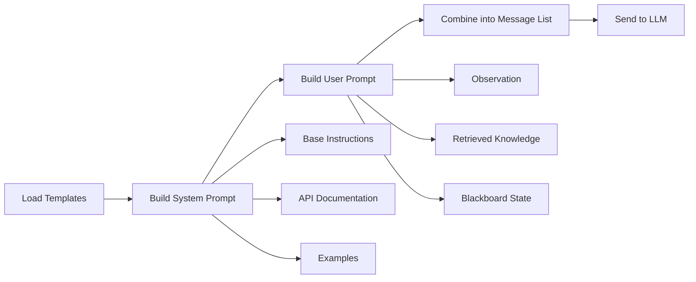

# Agent Prompter

The `Prompter` is a key component of the UFO framework, responsible for constructing prompts for the LLM to generate responses. Each agent has its own `Prompter` class that defines the structure of the prompt and the information to be fed to the LLM.

## Overview

The Prompter system follows a hierarchical design pattern:

```
BasicPrompter (Abstract Base Class)
├── HostAgentPrompter
├── AppAgentPrompter
├── EvaluationAgentPrompter
├── ExperiencePrompter
├── DemonstrationPrompter
└── customized/
    └── LinuxAgentPrompter (extends AppAgentPrompter)
```

Each prompter is responsible for:

1. **Loading templates** from YAML configuration files
2. **Constructing system prompts** with instructions, APIs, and examples
3. **Building user prompts** from agent observations and context
4. **Formatting multimodal content** (text + images for visual models)

You can find all prompter implementations in the `ufo/prompter` folder.

## Prompt Message Structure

A prompt fed to the LLM is a list of dictionaries, where each dictionary represents a message with the following structure:

| Key | Description | Example Values |
| --- | --- | --- |
| `role` | The role of the message | `system`, `user`, `assistant` |
| `content` | The message content | String or list of content objects |

For **visual models**, the `content` field can contain multiple elements:

```python
[
    {"type": "text", "text": "Current Screenshots:"},
    {"type": "image_url", "image_url": {"url": "data:image/png;base64,..."}}
]
```

## Prompt Construction Workflow

The final prompt is constructed through a multi-step process:



### Step 1: Template Loading

Templates are loaded from YAML files during initialization:

```python
def __init__(self, is_visual: bool, prompt_template: str, example_prompt_template: str):
    self.is_visual = is_visual
    self.prompt_template = self.load_prompt_template(prompt_template, is_visual)
    self.example_prompt_template = self.load_prompt_template(example_prompt_template, is_visual)
```

The `is_visual` parameter determines which template variant to load:
- **Visual models**: Use templates with screenshot handling
- **Non-visual models**: Use text-only templates

### Step 2: System Prompt Construction

The system prompt is built using the `system_prompt_construction()` method, which combines:

1. **Base instructions** from the template
2. **API documentation** via `api_prompt_helper()`
3. **Demonstration examples** via `examples_prompt_helper()`
4. **Third-party agent instructions** (for HostAgent)

Example for HostAgent:

```python
def system_prompt_construction(self) -> str:
    apis = self.api_prompt_helper(verbose=0)
    examples = self.examples_prompt_helper()
    third_party_instructions = self.third_party_agent_instruction()
    
    system_key = "system" if self.is_visual else "system_nonvisual"
    
    return self.prompt_template[system_key].format(
        apis=apis,
        examples=examples,
        third_party_instructions=third_party_instructions,
    )
```

### Step 3: User Prompt Construction

The user prompt is constructed using the `user_prompt_construction()` method with agent-specific parameters:

**HostAgent Parameters:**
```python
def user_prompt_construction(
    self,
    control_item: List[str],      # Available applications/windows
    prev_subtask: List[Dict],      # Previous subtask history
    prev_plan: List[str],          # Previous plan steps
    user_request: str,             # Original user request
    retrieved_docs: str = "",      # Retrieved knowledge
) -> str
```

**AppAgent Parameters:**
```python
def user_prompt_construction(
    self,
    control_item: List[str],       # Available UI controls
    prev_subtask: List[Dict],      # Previous subtask history
    prev_plan: List[str],          # Previous plan steps
    user_request: str,             # Original user request
    subtask: str,                  # Current subtask
    current_application: str,      # Current app name
    host_message: List[str],       # Messages from HostAgent
    retrieved_docs: str = "",      # Retrieved knowledge
    last_success_actions: List = [],  # Last successful actions
) -> str
```

### Step 4: User Content Construction

For multimodal models, the `user_content_construction()` method builds a list of content objects:

```python
def user_content_construction(self, image_list: List[str], ...) -> List[Dict]:
    user_content = []
    
    if self.is_visual:
        # Add screenshots
        for i, image in enumerate(image_list):
            user_content.append({"type": "text", "text": f"Screenshot {i+1}:"})
            user_content.append({"type": "image_url", "image_url": {"url": image}})
    
    # Add text prompt
    user_content.append({
        "type": "text",
        "text": self.user_prompt_construction(...)
    })
    
    return user_content
```

### Step 5: Final Assembly

The `prompt_construction()` static method combines system and user prompts:

```python
@staticmethod
def prompt_construction(system_prompt: str, user_content: List[Dict]) -> List:
    return [
        {"role": "system", "content": system_prompt},
        {"role": "user", "content": user_content}
    ]
```

## Prompt Components

### System Prompt

The system prompt defines the agent's role, capabilities, and output format. It is loaded from YAML templates configured in the system configuration.

**Template Locations:**
- HostAgent: `ufo/prompts/share/base/host_agent.yaml`
- AppAgent: `ufo/prompts/share/base/app_agent.yaml`
- EvaluationAgent: `ufo/prompts/evaluation/evaluate.yaml`

The system prompt is constructed by the `system_prompt_construction()` method and typically includes:

| Component | Description | Method |
| --- | --- | --- |
| **Base Instructions** | Role definition, action guidelines, output format | Loaded from YAML template |
| **API Documentation** | Available tools and their usage | `api_prompt_helper()` |
| **Examples** | Demonstration examples for in-context learning | `examples_prompt_helper()` |
| **Special Instructions** | Third-party agent integration (HostAgent only) | `third_party_agent_instruction()` |

#### API Documentation

The `api_prompt_helper()` method formats tool information for the LLM:

```python
def api_prompt_helper(self, verbose: int = 1) -> str:
    """Construct formatted API documentation."""
    return self.api_prompt_template
```

Tools are converted to LLM-readable format using `tool_to_llm_prompt()`:

```
Tool name: click_input
Description: Click on a control item

Parameters:
- id (string, required): The ID of the control item
- button (string, optional): Mouse button to click. Default: left
- double (boolean, optional): Whether to double-click. Default: false

Returns: Result of the click action

Example usage:
click_input(id="42", button="left", double=false)
```

#### Demonstration Examples

The `examples_prompt_helper()` method constructs in-context learning examples:

```python
def examples_prompt_helper(
    self, 
    header: str = "## Response Examples",
    separator: str = "Example",
    additional_examples: List[str] = []
) -> str:
    """Construct examples from YAML template."""
    template = """
    [User Request]:
        {request}
    [Response]:
        {response}"""
    
    example_list = []
    for key, values in self.example_prompt_template.items():
        if key.startswith("example"):
            example = template.format(
                request=values.get("Request"),
                response=json.dumps(values.get("Response"))
            )
            example_list.append(example)
    
    return self.retrieved_documents_prompt_helper(header, separator, example_list)
```

Examples are loaded from:
- `ufo/prompts/examples/visual/` - For visual models
- `ufo/prompts/examples/nonvisual/` - For text-only models

### User Prompt

The user prompt is constructed from the agent's current context and observations. It is built by the `user_prompt_construction()` method using information from:

| Component | Description | Method |
| --- | --- | --- |
| **Observation** | Current state (UI controls, screenshots) | Passed as parameters |
| **Retrieved Knowledge** | Documents from RAG system | `retrieved_documents_prompt_helper()` |
| **Blackboard State** | Shared memory across agents | `blackboard_to_prompt()` |
| **Task Context** | User request, subtask, plans | Passed as parameters |

#### Retrieved Documents

External knowledge is formatted using the `retrieved_documents_prompt_helper()` method:

```python
@staticmethod
def retrieved_documents_prompt_helper(
    header: str,      # Section header
    separator: str,   # Document separator
    documents: List[str]  # Retrieved documents
) -> str:
    """Format retrieved documents for the prompt."""
    if header:
        prompt = f"\n<{header}:>\n"
    else:
        prompt = ""
    
    for i, document in enumerate(documents):
        if separator:
            prompt += f"[{separator} {i+1}:]\n"
        prompt += document + "\n\n"
    
    return prompt
```

**Example Output:**
```
<Retrieved Documentation:>
[Document 1:]
To create a new email in Outlook, click the "New Email" button...

[Document 2:]
The email composition window has three main fields: To, Subject, and Body...
```

#### Blackboard Integration

The Blackboard system allows agents to share information. Prompters can access this through:

```python
def blackboard_to_prompt(self) -> str:
    """Convert Blackboard state to prompt text."""
    # Implementation depends on specific agent needs
    pass
```

## Specialized Prompters

### HostAgentPrompter

Specialized for desktop-level orchestration:

**Key Features:**
- Application selection and window management
- Third-party agent integration support
- Desktop-wide task planning

**Unique Method:**
```python
def third_party_agent_instruction(self) -> str:
    """Generate instructions for enabled third-party agents."""
    enabled_agents = config.system.enabled_third_party_agents
    instructions = []
    
    for agent_name in enabled_agents:
        config = get_third_party_config(agent_name)
        instructions.append(f"{agent_name}: {config['INTRODUCTION']}")
    
    return "\n".join(instructions)
```

### AppAgentPrompter

Specialized for application-level interactions:

**Key Features:**
- UI control interaction
- Multi-action sequence support
- Application-specific API integration

**Template Variants:**
- `system`: Standard single-action mode
- `system_as`: Action sequence mode (multi-action)
- `system_nonvisual`: Text-only mode

**Usage:**
```python
def system_prompt_construction(self, additional_examples: List[str] = []) -> str:
    apis = self.api_prompt_helper(verbose=1)
    examples = self.examples_prompt_helper(additional_examples=additional_examples)
    
    # Select template based on configuration
    if config.system.action_sequence:
        system_key = "system_as"
    else:
        system_key = "system"
    
    if not self.is_visual:
        system_key += "_nonvisual"
    
    return self.prompt_template[system_key].format(apis=apis, examples=examples)
```

### EvaluationAgentPrompter

Specialized for task evaluation:

**Purpose:** Assesses whether a Session or Round was successfully completed

**Configuration:** Uses `ufo/prompts/evaluation/evaluate.yaml`

### ExperiencePrompter

Specialized for learning from execution traces:

**Purpose:** Summarizes task completion trajectories for future reference

**Use Case:** Self-experience learning in the Knowledge Substrate

### DemonstrationPrompter

Specialized for learning from human demonstrations:

**Purpose:** Processes Step Recorder outputs into learnable examples

**Use Case:** User demonstration learning in the Knowledge Substrate

## Configuration

Prompter behavior is controlled through system configuration:

```yaml
# config/ufo/system.yaml
# Prompt template paths
HOSTAGENT_PROMPT: "./ufo/prompts/share/base/host_agent.yaml"
APPAGENT_PROMPT: "./ufo/prompts/share/base/app_agent.yaml"
EVALUATION_PROMPT: "./ufo/prompts/evaluation/evaluate.yaml"

# Example prompt paths (visual vs. non-visual)
HOSTAGENT_EXAMPLE_PROMPT: "./ufo/prompts/examples/{mode}/host_agent_example.yaml"
APPAGENT_EXAMPLE_PROMPT: "./ufo/prompts/examples/{mode}/app_agent_example.yaml"

# Feature flags
ACTION_SEQUENCE: False  # Enable multi-action mode for AppAgent
```

The `{mode}` placeholder is automatically replaced with `visual` or `nonvisual` based on the LLM's capabilities.

## Custom Prompters

You can create custom prompters by extending `BasicPrompter` or existing specialized prompters:

```python
from ufo.prompter.agent_prompter import AppAgentPrompter

class CustomAppPrompter(AppAgentPrompter):
    """Custom prompter for specialized application."""
    
    def system_prompt_construction(self, **kwargs) -> str:
        # Add custom logic
        base_prompt = super().system_prompt_construction(**kwargs)
        custom_instructions = self.load_custom_instructions()
        return base_prompt + "\n" + custom_instructions
    
    def load_custom_instructions(self) -> str:
        """Load application-specific instructions."""
        return "Custom instructions for specialized app..."
```


# Reference

## Class Hierarchy

The `Prompter` system is implemented in the `ufo/prompter` folder with the following structure:

```
ufo/prompter/
├── basic.py                    # BasicPrompter abstract base class
├── agent_prompter.py           # HostAgentPrompter, AppAgentPrompter
├── eva_prompter.py             # EvaluationAgentPrompter
├── experience_prompter.py      # ExperiencePrompter
├── demonstration_prompter.py   # DemonstrationPrompter
└── customized/
    └── linux_agent_prompter.py # LinuxAgentPrompter (custom)
```

## BasicPrompter API

Below is the complete API reference for the `BasicPrompter` class:

:::prompter.basic.BasicPrompter

## Key Methods

| Method | Purpose | Return Type |
| --- | --- | --- |
| `load_prompt_template()` | Load YAML template file | `Dict[str, str]` |
| `system_prompt_construction()` | Build system prompt | `str` |
| `user_prompt_construction()` | Build user text prompt | `str` |
| `user_content_construction()` | Build full user content (text + images) | `List[Dict]` |
| `prompt_construction()` | Combine system and user into message list | `List[Dict]` |
| `api_prompt_helper()` | Format API documentation | `str` |
| `examples_prompt_helper()` | Format demonstration examples | `str` |
| `retrieved_documents_prompt_helper()` | Format retrieved knowledge | `str` |
| `tool_to_llm_prompt()` | Convert single tool to LLM format | `str` |
| `tools_to_llm_prompt()` | Convert multiple tools to LLM format | `str` |

## See Also

- [Prompts Overview](../../../ufo2/prompts/overview.md) - Prompt template structure
- [Basic Template](../../../ufo2/prompts/basic_template.md) - YAML template format
- [Example Prompts](../../../ufo2/prompts/examples_prompts.md) - Demonstration examples

You can customize the `Prompter` class to tailor the prompt to your requirements. Start by extending `BasicPrompter` or one of the specialized prompters.