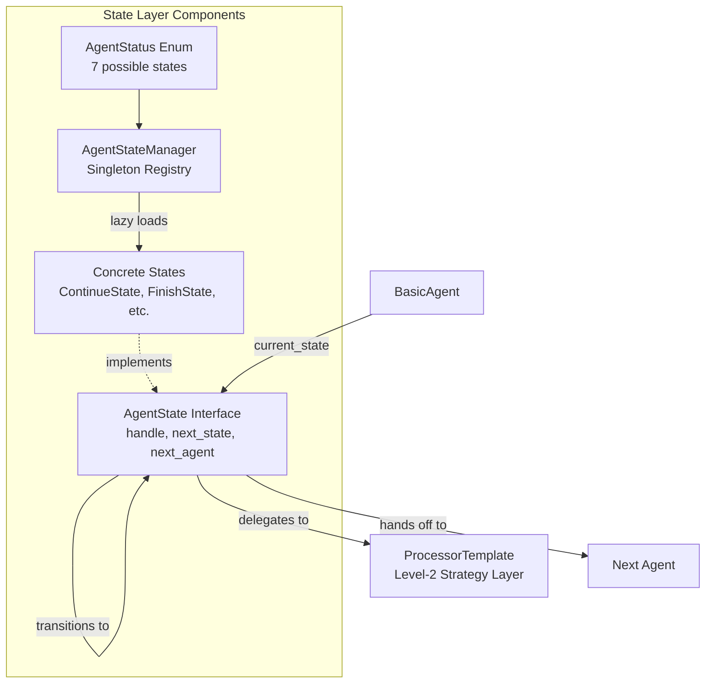
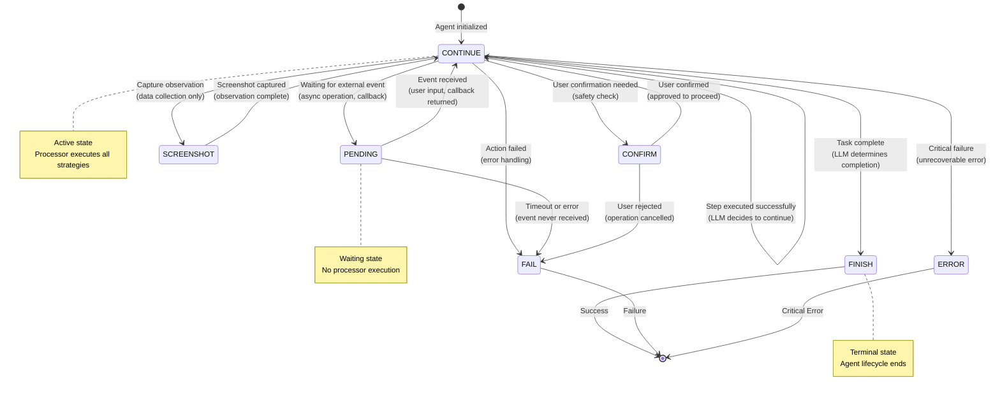
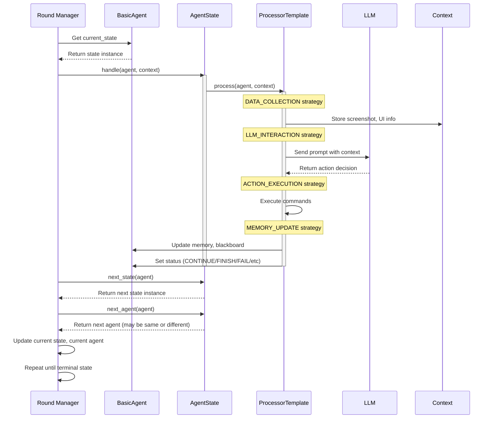
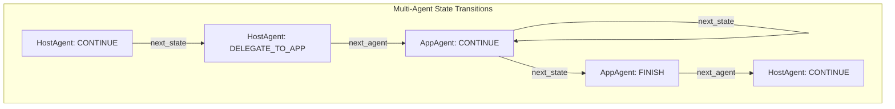
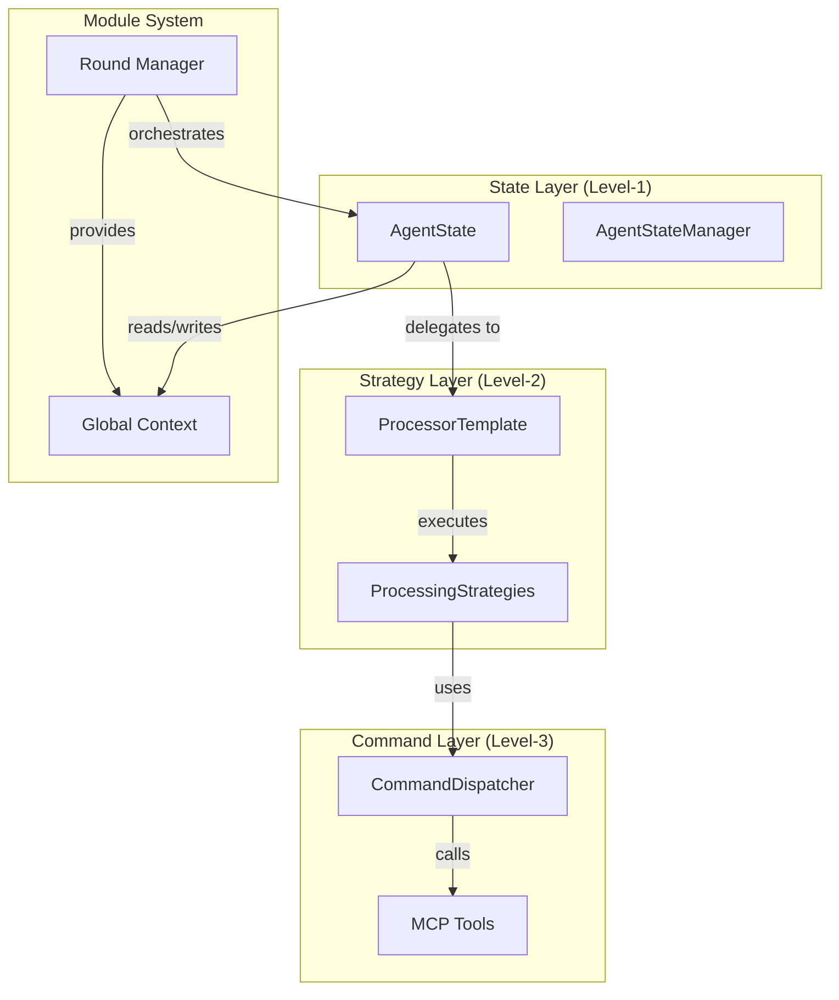

# State Layer (Level-1 FSM)

The **State Layer** is the top-level control structure governing device agent lifecycle. It implements a Finite State Machine (FSM) that determines **when** and **what** to execute, delegating the **how** to the Strategy layer. Each state encapsulates transition logic, processor binding, and multi-agent coordination.

## Overview

The State Layer implements the **Level-1** of the [three-layer device agent architecture](../overview.md#three-layer-architecture). It provides:

- **Finite State Machine (FSM)**: Governs agent execution lifecycle through state transitions
- **State Management**: Singleton registry for state classes with lazy loading
- **Transition Logic**: Rule-based and LLM-driven state transitions
- **Multi-Agent Coordination**: State-level agent handoff for hierarchical workflows



## Design Philosophy

The State Layer follows the **State Pattern** from Gang of Four design patterns:

- **Encapsulation**: Each state encapsulates state-specific behavior
- **Polymorphism**: States share common `AgentState` interface
- **Dynamic Behavior**: Agent behavior changes dynamically as state changes
- **Open/Closed Principle**: New states can be added via registration without modifying existing code

## AgentStatus Enum

The `AgentStatus` enum defines the **seven possible states** that a device agent can be in:

```python
class AgentStatus(Enum):
    """Enumeration of agent states"""
    ERROR = "ERROR"            # Critical error occurred
    FINISH = "FINISH"          # Task completed successfully
    CONTINUE = "CONTINUE"      # Normal execution, continue processing
    FAIL = "FAIL"              # Task failed, cannot proceed
    PENDING = "PENDING"        # Waiting for external event (user input, async operation)
    CONFIRM = "CONFIRM"        # Awaiting user confirmation before proceeding
    SCREENSHOT = "SCREENSHOT"  # Capture observation data (screenshot, UI tree)
```

### State Characteristics

| State | Type | Description | Typical Next States | Processor Executed |
|-------|------|-------------|---------------------|-------------------|
| **CONTINUE** | Active | Normal execution flow, agent processes next step | CONTINUE, FINISH, FAIL, ERROR, PENDING, CONFIRM | Yes ✅ |
| **FINISH** | Terminal | Task completed successfully, agent stops | (none - end state) | No ❌ |
| **FAIL** | Terminal | Task failed, agent stops with error | (none - end state) | No ❌ |
| **ERROR** | Terminal | Critical error, agent stops immediately | (none - end state) | No ❌ |
| **PENDING** | Waiting | Waiting for external event (user input, callback) | CONTINUE, FAIL | No ❌ |
| **CONFIRM** | Waiting | Awaiting user confirmation (safety check) | CONTINUE, FAIL | Yes ✅ (collect confirmation) |
| **SCREENSHOT** | Data Collection | Capture observation without action | CONTINUE | Yes ✅ (capture only) |

### State Categories

States can be categorized into three groups:

- **Active States** (CONTINUE): Agent actively executing tasks
- **Waiting States** (PENDING, CONFIRM, SCREENSHOT): Agent waiting for external input or data
- **Terminal States** (FINISH, FAIL, ERROR): Agent execution completed (success or failure)

## State Machine Diagram

The following diagram shows the state machine transitions for a typical device agent:



### Transition Determination

State transitions are determined by:

1. **LLM Reasoning**: Agent analyzes results and decides next status (e.g., CONTINUE vs FINISH)
2. **Rule-Based Logic**: Predefined rules trigger transitions (e.g., error → ERROR)
3. **User Input**: User confirms or rejects → CONFIRM → CONTINUE/FAIL
4. **External Events**: Async callback received → PENDING → CONTINUE

## AgentStateManager (Singleton Registry)

The `AgentStateManager` is a **singleton** that manages the registry of state classes. It provides:

- **State Registration**: `@AgentStateManager.register` decorator to register state classes
- **Lazy Loading**: State instances created only when first accessed
- **Centralized Management**: Single source of truth for all agent states

```mermaid
graph TB
    subgraph "AgentStateManager (Singleton)"
        Registry[_state_mapping<br/>Dict[str, Type[AgentState]]]
        Instances[_state_instance_mapping<br/>Dict[str, AgentState]]
        
        Registry -->|lazy load on first access| Instances
    end
    
    Register[@register decorator] -->|adds class| Registry
    GetState[get_state(status)] -->|creates/retrieves| Instances
    
    Agent1[AppAgent] -->|requests| GetState
    Agent2[HostAgent] -->|requests| GetState
    Agent3[LinuxAgent] -->|requests| GetState
    
    GetState -->|returns| State[AgentState instance]
```

### AgentStateManager Implementation

```python
class AgentStateManager(ABC, metaclass=SingletonABCMeta):
    """
    Singleton state manager for agent states.
    
    Responsibilities:
    - Register state classes via decorator
    - Lazy load state instances on demand
    - Provide centralized state access
    """

    _state_mapping: Dict[str, Type[AgentState]] = {}  # Class registry

    def __init__(self):
        self._state_instance_mapping: Dict[str, AgentState] = {}  # Instance cache

    def get_state(self, status: str) -> AgentState:
        """
        Get state instance for the given status string.
        
        :param status: The status string (e.g., "CONTINUE")
        :return: The state instance
        
        Note: Uses lazy loading - instances created on first access
        """
        # Lazy load: create instance only when first requested
        if status not in self._state_instance_mapping:
            state_class = self._state_mapping.get(status)
            if state_class:
                self._state_instance_mapping[status] = state_class()
            else:
                # Fallback to none_state if status not registered
                self._state_instance_mapping[status] = self.none_state

        return self._state_instance_mapping.get(status, self.none_state)

    def add_state(self, status: str, state: AgentState) -> None:
        """
        Add a state instance at runtime (advanced usage).
        
        :param status: The status string
        :param state: The state instance
        """
        self._state_instance_mapping[status] = state

    @property
    def state_map(self) -> Dict[str, AgentState]:
        """
        The state mapping of status to state.
        :return: The state mapping.
        """
        return self._state_instance_mapping

    @classmethod
    def register(cls, state_class: Type[AgentState]) -> Type[AgentState]:
        """
        Decorator to register state class.
        
        Usage:
            @AgentStateManager.register
            class ContinueAppAgentState(AgentState):
                @staticmethod
                def name() -> str:
                    return AgentStatus.CONTINUE.value
        
        :param state_class: The state class to register
        :return: The state class (unchanged)
        """
        cls._state_mapping[state_class.name()] = state_class
        return state_class

    @property
    @abstractmethod
    def none_state(self) -> AgentState:
        """
        Fallback state when requested state not found.
        
        :return: Default/fallback state instance
        """
        pass
```

### State Registration Pattern

Each agent type (AppAgent, HostAgent, LinuxAgent) has its own `StateManager` subclass:

```python
# AppAgent states
class AppAgentStateManager(AgentStateManager):
    @property
    def none_state(self):
        return NoneAppAgentState()

@AppAgentStateManager.register
class ContinueAppAgentState(AgentState):
    @classmethod
    def name(cls):
        return AgentStatus.CONTINUE.value
```

**Benefits of Singleton + Lazy Loading**:

- **Memory Efficiency**: State instances created only when needed
- **Single Source of Truth**: All agents share same state instances
- **Thread-Safe**: Singleton metaclass ensures thread-safe instantiation
- **Extensibility**: New states registered without modifying existing code

## AgentState Interface

All state classes implement the `AgentState` abstract interface:

```python
class AgentState(ABC):
    """
    Abstract base class for agent states.
    """

    @abstractmethod
    async def handle(
        self, agent: BasicAgent, context: Optional[Context] = None
    ) -> None:
        """
        Handle the agent for the current step.
        :param agent: The agent to handle.
        :param context: The context for the agent and session.
        """
        pass

    @abstractmethod
    def next_agent(self, agent: BasicAgent) -> BasicAgent:
        """
        Get the agent for the next step.
        :param agent: The agent for the current step.
        :return: The agent for the next step.
        """
        return agent

    @abstractmethod
    def next_state(self, agent: BasicAgent) -> AgentState:
        """
        Get the state for the next step.
        :param agent: The agent for the current step.
        :return: The state for the next step.
        """
        pass

    @abstractmethod
    def is_round_end(self) -> bool:
        """
        Check if the round ends.
        :return: True if the round ends, False otherwise.
        """
        pass

    @abstractmethod
    def is_subtask_end(self) -> bool:
        """
        Check if the subtask ends.
        :return: True if the subtask ends, False otherwise.
        """
        pass

    @classmethod
    @abstractmethod
    def agent_class(cls) -> Type[BasicAgent]:
        """
        The class of the agent.
        :return: The class of the agent.
        """
        pass

    @classmethod
    @abstractmethod
    def name(cls) -> str:
        """
        The class name of the state.
        :return: The class name of the state.
        """
        return ""
```

### Method Responsibilities

| Method | Purpose | Called By | Returns | Side Effects |
|--------|---------|-----------|---------|--------------|
| **handle()** | Execute state-specific logic | Round manager | None | Updates agent status, context, memory |
| **next_state()** | FSM state transition | Round manager | Next `AgentState` instance | None (pure function) |
| **next_agent()** | Multi-agent coordination | Round manager | Next `BasicAgent` instance | May create new agent instances |
| **is_round_end()** | Check if round ends | Round manager | Boolean | None (pure function) |
| **is_subtask_end()** | Check if subtask ends | Round manager | Boolean | None (pure function) |
| **agent_class()** | Get agent class | State manager | Agent class type | None (class method) |
| **name()** | State identifier | State manager registration | State name string | None (class method) |

### Concrete State Example

Here's an example of a concrete state for AppAgent's CONTINUE status:

```python
@AppAgentStateManager.register
class ContinueAppAgentState(AgentState):
    """
    Continue state for AppAgent - normal execution flow.
    """
    
    async def handle(self, agent: AppAgent, context: Context):
        """Execute AppAgent processor strategies."""
        # Get processor (Level-2 Strategy Layer)
        processor = agent.processor
        
        # Execute all strategies in sequence
        await processor.process(agent, context)
        
        # Processor updates agent.status based on LLM response
        # Possible status: CONTINUE, FINISH, FAIL, ERROR, CONFIRM, etc.
    
    def next_state(self, agent: AppAgent) -> AgentState:
        """Transition to next state based on agent status."""
        state_manager = AppAgentStateManager()
        return state_manager.get_state(agent.status)
    
    def next_agent(self, agent: AppAgent) -> BasicAgent:
        """For AppAgent, typically stays on same agent."""
        # AppAgent continues executing unless delegating back to HostAgent
        if agent.status == AgentStatus.FINISH:
            return agent.host  # Return to HostAgent
        return agent  # Continue with current agent
    
    @classmethod
    def name(cls) -> str:
        """State name for registration"""
        return AgentStatus.CONTINUE.value  # "CONTINUE"
```

## State Lifecycle

The following sequence diagram shows how states orchestrate agent execution:



### Execution Flow

1. **Round Manager** calls `state.handle(agent, context)`
2. **State** delegates to `processor.process(agent, context)` (Level-2 Strategy Layer)
3. **Processor** executes strategies (DATA_COLLECTION → LLM_INTERACTION → ACTION_EXECUTION → MEMORY_UPDATE)
4. **Processor** sets `agent.status` based on LLM response or error handling
5. **Round Manager** calls `state.next_state(agent)` to get next state
6. **Round Manager** calls `state.next_agent(agent)` to check for agent handoff
7. **Round Manager** updates `agent.current_state` and repeats until terminal state

## State-Specific Behaviors

Different state types implement different behaviors in their `handle()` method:

### Active State (CONTINUE)

```python
async def handle(self, agent, context):
    """Execute full processor workflow"""
    # Run all four strategy phases
    await agent.processor.process(agent, context)
    # Status updated by LLM response parsing
```

### Waiting State (PENDING)

```python
async def handle(self, agent, context):
    """Wait for external event"""
    # Do not execute processor
    # Wait for callback, user input, or timeout
    event = await wait_for_event(timeout=60)
    if event:
        agent.status = AgentStatus.CONTINUE
    else:
        agent.status = AgentStatus.FAIL
```

### Confirmation State (CONFIRM)

```python
async def handle(self, agent, context):
    """Request user confirmation"""
    # Execute DATA_COLLECTION to show current state
    await agent.processor.execute_phase(ProcessingPhase.DATA_COLLECTION)
    
    # Prompt user for confirmation
    confirmed = await prompt_user_confirmation()
    
    if confirmed:
        agent.status = AgentStatus.CONTINUE
    else:
        agent.status = AgentStatus.FAIL
```

### Terminal State (FINISH/FAIL/ERROR)

```python
async def handle(self, agent, context):
    """No action - state is terminal"""
    # Terminal states do not execute processor
    # Round manager will detect terminal status and end execution
    pass
```

### Processor Execution by State Type

| State Type | Executes Processor? | Which Phases? | Purpose |
|------------|---------------------|---------------|---------|
| CONTINUE | ✅ Yes | All phases | Full execution cycle |
| SCREENSHOT | ✅ Yes | DATA_COLLECTION only | Observation without action |
| CONFIRM | ✅ Yes | DATA_COLLECTION + custom | Show state, request confirmation |
| PENDING | ❌ No | None | Wait for external event |
| FINISH/FAIL/ERROR | ❌ No | None | Terminal states |

## Multi-Agent Coordination

The State Layer enables **multi-agent coordination** through the `next_agent()` method. This is critical for Windows agents (HostAgent → AppAgent hierarchy).



### HostAgent → AppAgent Delegation

```python
class ContinueHostAgentState(AgentState):
    def next_agent(self, agent: HostAgent) -> BasicAgent:
        """Delegate to AppAgent when task decomposed"""
        if agent.status == "DELEGATE_TO_APP":
            # Create AppAgent for selected application
            app_agent = AgentFactory.create_agent(
                agent_type="app",
                name=f"AppAgent/{agent.selected_app}",
                process_name=agent.selected_process,
                app_root_name=agent.selected_app,
                is_visual=True,
                main_prompt=config.appagent_prompt,
                example_prompt=config.appagent_example_prompt
            )
            
            # Set HostAgent as host (for returning)
            app_agent.host = agent
            
            # Transfer context via blackboard
            app_agent.blackboard = agent.blackboard
            
            return app_agent
        
        # No delegation, continue with HostAgent
        return agent
```

### AppAgent → HostAgent Return

```python
class FinishAppAgentState(AgentState):
    def next_agent(self, agent: AppAgent) -> BasicAgent:
        """Return to HostAgent when app task complete"""
        if agent.host:
            # Update HostAgent's blackboard with results
            agent.host.blackboard = agent.blackboard
            
            # Set HostAgent status to continue
            agent.host.status = AgentStatus.CONTINUE
            
            return agent.host
        
        # No host, AppAgent finishes independently
        return agent
```

## Best Practices

### State Design Guidelines

**1. Single Responsibility**: Each state should have one clear purpose

- ✅ Good: `ContinueState` (normal execution), `ErrorState` (error handling)
- ❌ Bad: `ContinueOrErrorState` (mixed responsibilities)

**2. Minimal State Logic**: Keep `handle()` simple, delegate to processor

- ✅ Good: `await processor.process(agent, context)`
- ❌ Bad: Implementing strategy logic directly in state

**3. Predictable Transitions**: Make `next_state()` deterministic when possible

- ✅ Good: Map status string to state instance
- ❌ Bad: Complex conditional logic in `next_state()`

**4. Document Invariants**: Clearly state what conditions trigger state

- Example: "PENDING state entered when async operation started"

### Common Pitfalls

!!! warning "Stateful State Classes"
    States should be stateless (data in agent/context, not state)
    
    ```python
    # BAD: Storing state-specific data in state class
    class ContinueState(AgentState):
        def __init__(self):
            self.step_count = 0  # ❌ Don't do this
    
    # GOOD: Store data in agent or context
    class ContinueState(AgentState):
        async def handle(self, agent, context):
            step_count = context.get("step_count", 0)  # ✅ Store in context
    ```

!!! warning "Tight Coupling"
    States should not depend on specific processor implementations
    
    ```python
    # BAD: Directly calling strategy methods
    async def handle(self, agent, context):
        strategy = AppScreenshotCaptureStrategy()  # ❌
        await strategy.execute(agent, context)
    
    # GOOD: Use processor abstraction
    async def handle(self, agent, context):
        await agent.processor.process(agent, context)  # ✅
    ```

## Platform-Specific States

Different agent types may define platform-specific states:

### Windows AppAgent States

```python
@AppAgentStateManager.register
class ContinueAppAgentState(AgentState):
    """Continue state for Windows AppAgent"""
    # Implements UI Automation-specific logic

@AppAgentStateManager.register
class ScreenshotAppAgentState(AgentState):
    """Screenshot state for Windows AppAgent"""
    # Captures Windows UI tree + screenshot
```

### Linux Agent States

```python
@LinuxAgentStateManager.register
class ContinueLinuxAgentState(AgentState):
    """Continue state for Linux Agent"""
    # Implements shell command execution logic

@LinuxAgentStateManager.register
class FinishLinuxAgentState(AgentState):
    """Finish state for Linux Agent"""
    # Terminal state for Linux workflow
```

While state **names** (CONTINUE, FINISH, etc.) are consistent across platforms, state **implementations** (`handle()` method) differ based on:

- Platform-specific processors (Windows UI Automation vs Linux shell)
- Platform-specific strategies (screenshot+UI tree vs shell output)
- Platform-specific MCP tools (Win32 API vs shell commands)

## Integration with Other Layers

The State Layer integrates with other components:



| Integration Point | Layer/Component | Relationship |
|-------------------|-----------------|--------------|
| **Round Manager** | Module System | Round calls `handle()`, `next_state()`, `next_agent()` |
| **ProcessorTemplate** | Level-2 Strategy | State delegates execution to processor |
| **Global Context** | Module System | State reads request, writes results, shares data |
| **Agent** | Agent System | State accesses agent properties (memory, blackboard, host) |

See [Strategy Layer](processor.md), [Command Layer](command.md), and [Round Documentation](../../modules/round.md) for integration details.

## API Reference

Below is the complete API reference for the State Layer classes:

::: agents.states.basic.AgentState
::: agents.states.basic.AgentStateManager
::: agents.states.basic.AgentStatus

## Summary

**Key Takeaways**:

- **Finite State Machine**: State Layer implements FSM with 7 states (CONTINUE, FINISH, FAIL, ERROR, PENDING, CONFIRM, SCREENSHOT)
- **Singleton Registry**: AgentStateManager provides centralized, lazy-loaded state management
- **Core Methods**: `handle()` (execute), `next_state()` (FSM transition), `next_agent()` (multi-agent), `is_round_end()`, `is_subtask_end()`, `agent_class()`, `name()`
- **State Pattern**: Encapsulates state-specific behavior, enables dynamic transitions
- **Multi-Agent Coordination**: `next_agent()` enables HostAgent ↔ AppAgent delegation
- **Platform Extensibility**: Same state names, different implementations per platform
- **Clean Separation**: State controls **when/what**, Processor controls **how**

The State Layer provides the **control structure** for device agent execution, orchestrating the transition between different behavioral modes while delegating actual execution to the Strategy layer.
