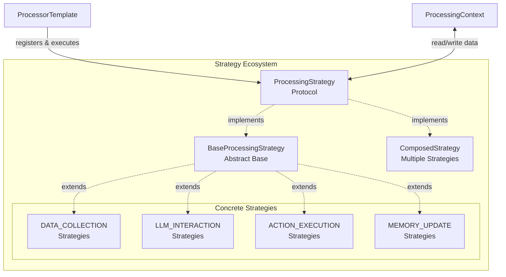
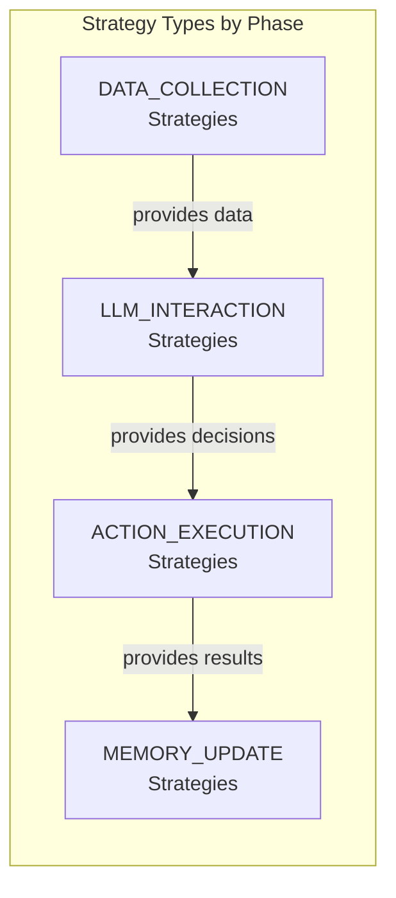
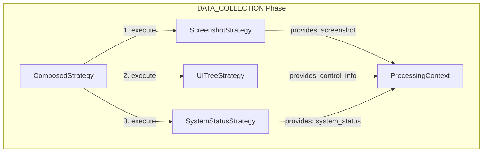
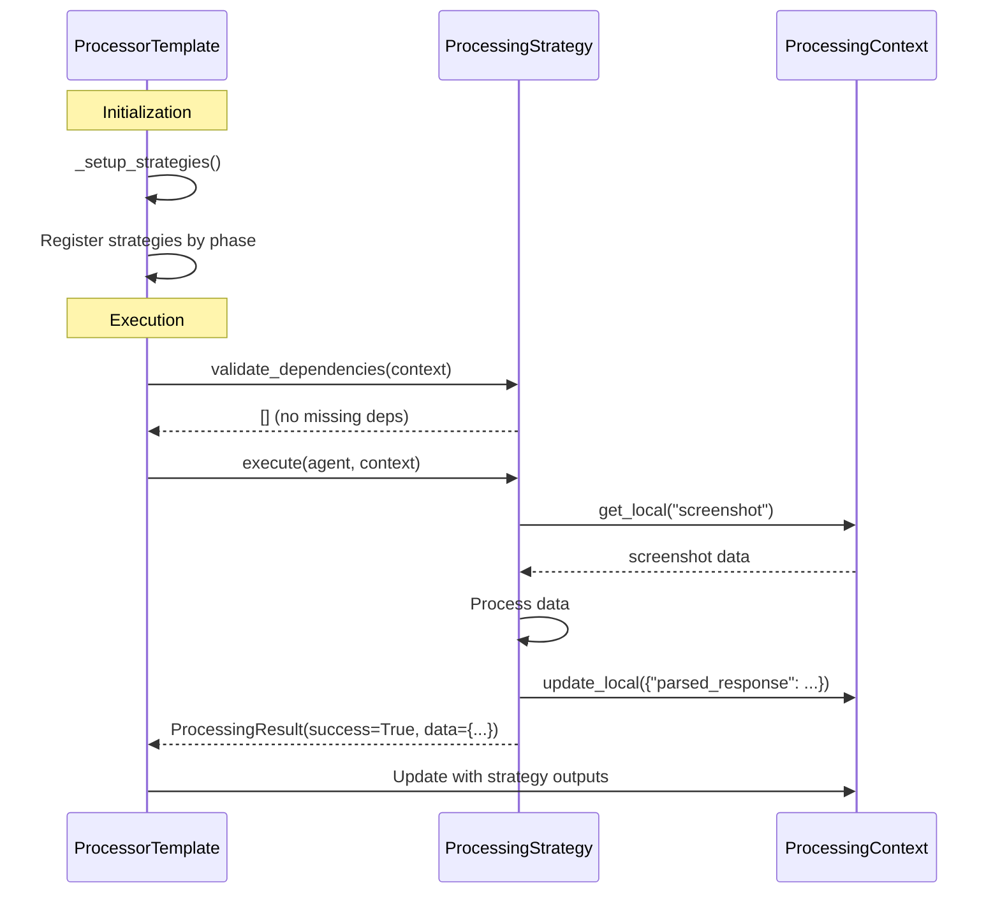

# Processing Strategies

**ProcessingStrategy** classes are the fundamental building blocks of agent execution logic. Each strategy encapsulates a specific unit of work (data collection, LLM reasoning, action execution, memory update) with explicit dependencies and outputs. Strategies are composed by Processors to form complete execution workflows.

## Overview

Processing Strategies implement the **Strategy Pattern**, providing interchangeable algorithms for different aspects of agent behavior. Each strategy:

- Implements a **unified `execute()` interface**
- Declares **explicit dependencies** (required inputs)
- Declares **explicit outputs** (provided data)
- Can be **composed** with other strategies
- Operates on a **shared ProcessingContext**



**Strategy Benefits:**

- **Modularity**: Each strategy does one thing well, can be tested independently
- **Reusability**: Same strategy can be used across different processors
- **Composability**: Combine multiple strategies within a phase via `ComposedStrategy`
- **Extensibility**: Add new strategies without modifying processor framework
- **Type Safety**: Explicit dependency declarations prevent runtime errors

---

## ProcessingStrategy Interface

All strategies implement the `ProcessingStrategy` protocol:

```python
from typing import Protocol
from ufo.agents.agent.basic import BasicAgent
from ufo.agents.processors.context.processing_context import ProcessingContext, ProcessingResult

class ProcessingStrategy(Protocol):
    """
    Protocol for processing strategies.
    
    All strategies must implement the execute() method and provide
    a name attribute for logging/debugging.
    """
    
    name: str  # Strategy identifier for logging
    
    async def execute(
        self,
        agent: BasicAgent,
        context: ProcessingContext
    ) -> ProcessingResult:
        """
        Execute strategy logic.
        
        :param agent: The agent instance (access to memory, blackboard, prompter)
        :param context: Processing context with local/global data
        :return: ProcessingResult with success status and output data
        """
        ...
```

**Minimal Interface:** The protocol defines only what's essential - a `name` for logging/debugging and an `execute()` method for unified execution.

---

## BaseProcessingStrategy

Most concrete strategies extend `BaseProcessingStrategy`, which provides:

- Dependency declaration and validation
- Output declaration
- Error handling infrastructure
- Logging utilities

```python
from abc import ABC, abstractmethod
from typing import List, Optional
from ufo.agents.processors.strategies.dependency import StrategyDependency

class BaseProcessingStrategy(ABC):
    """
    Abstract base class for processing strategies.
    
    Features:
    - Dependency declaration via get_dependencies()
    - Output declaration via get_provides()
    - Dependency validation
    - Standardized error handling
    - Logging integration
    """
    
    def __init__(
        self,
        name: Optional[str] = None,
        fail_fast: bool = True
    ):
        """
        Initialize strategy.
        
        :param name: Strategy name (defaults to class name)
        :param fail_fast: Raise exception immediately on error vs. return error result
        """
        self.name = name or self.__class__.__name__
        self.fail_fast = fail_fast
        self.logger = logging.getLogger(f"Strategy.{self.name}")
    
    def get_dependencies(self) -> List[StrategyDependency]:
        """
        Declare required dependencies.
        
        Override to specify what data this strategy needs from context.
        
        Example:
            return [
                StrategyDependency("screenshot", required=True, expected_type=str),
                StrategyDependency("control_info", required=False, expected_type=str)
            ]
        
        :return: List of dependency declarations
        """
        return []
    
    def get_provides(self) -> List[str]:
        """
        Declare provided outputs.
        
        Override to specify what data this strategy writes to context.
        
        Example:
            return ["parsed_response", "action", "arguments"]
        
        :return: List of output field names
        """
        return []
    
    def validate_dependencies(self, context: ProcessingContext) -> List[str]:
        """
        Validate that all required dependencies are available in context.
        
        :param context: Processing context to validate against
        :return: List of missing required dependency names
        """
        missing = []
        for dependency in self.get_dependencies():
            value = context.get_local(dependency.field_name)
            if dependency.required and value is None:
                missing.append(dependency.field_name)
        return missing
    
    def handle_error(
        self,
        error: Exception,
        phase: ProcessingPhase,
        context: ProcessingContext
    ) -> ProcessingResult:
        """
        Standardized error handling.
        
        :param error: The exception that occurred
        :param phase: Processing phase where error occurred
        :param context: Current processing context
        :return: ProcessingResult with error information
        """
        self.logger.error(f"Strategy {self.name} failed: {error}", exc_info=True)
        
        if self.fail_fast:
            raise error
        else:
            return ProcessingResult(
                success=False,
                data={},
                error=str(error),
                phase=phase
            )
    
    @abstractmethod
    async def execute(
        self,
        agent: BasicAgent,
        context: ProcessingContext
    ) -> ProcessingResult:
        """
        Execute strategy logic.
        
        Subclasses must implement this method.
        
        :param agent: Agent instance
        :param context: Processing context
        :return: ProcessingResult with outputs
        """
        pass
```

**Creating a Concrete Strategy Example:**

```python
from ufo.agents.processors.strategies.processing_strategy import BaseProcessingStrategy
from ufo.agents.processors.strategies.strategy_dependency import StrategyDependency
from ufo.agents.processors.context.processing_context import ProcessingResult, ProcessingPhase

class AppScreenshotCaptureStrategy(BaseProcessingStrategy):
    """Capture screenshot of Windows application"""
    
    def __init__(self):
        super().__init__(name="AppScreenshotCapture")
    
    def get_dependencies(self) -> List[StrategyDependency]:
        # No dependencies - runs first in DATA_COLLECTION phase
        return []
    
    def get_provides(self) -> List[str]:
        return ["screenshot", "screenshot_path"]
    
    async def execute(
        self,
        agent,
        context: ProcessingContext
    ) -> ProcessingResult:
        try:
            # Capture screenshot
            screenshot_path = await self._capture_screenshot(agent)
            screenshot_str = self._encode_image(screenshot_path)
            
            # Return result with provided data
            return ProcessingResult(
                success=True,
                data={
                    "screenshot": screenshot_str,
                    "screenshot_path": screenshot_path
                },
                phase=ProcessingPhase.DATA_COLLECTION
            )
        except Exception as e:
            return self.handle_error(e, ProcessingPhase.DATA_COLLECTION, context)
    
    async def _capture_screenshot(self, agent):
        # Platform-specific screenshot logic
        ...
    
    def _encode_image(self, path):
        # Base64 encoding for LLM
        ...
```

---

## Strategy Dependency System

The dependency system ensures strategies execute in correct order with required data available.

### StrategyDependency

```python
from dataclasses import dataclass
from typing import Optional, Type

@dataclass
class StrategyDependency:
    """
    Represents a data dependency for a strategy.
    
    :param field_name: Name of required field in ProcessingContext
    :param required: Whether dependency is mandatory (vs. optional)
    :param expected_type: Expected Python type (for validation)
    :param description: Human-readable description
    """
    field_name: str
    required: bool = True
    expected_type: Optional[Type] = None
    description: str = ""
```

### Dependency Declaration

Strategies declare dependencies in two ways:

#### Method 1: Override `get_dependencies()`

```python
class LLMInteractionStrategy(BaseProcessingStrategy):
    def get_dependencies(self) -> List[StrategyDependency]:
        return [
            StrategyDependency(
                field_name="screenshot",
                required=True,
                expected_type=str,
                description="Base64-encoded screenshot for LLM visual input"
            ),
            StrategyDependency(
                field_name="control_info",
                required=True,
                expected_type=str,
                description="UI control information from UI Automation"
            ),
            StrategyDependency(
                field_name="request",
                required=True,
                expected_type=str,
                description="User's task request"
            )
        ]
    
    def get_provides(self) -> List[str]:
        return ["parsed_response", "action", "arguments"]
```

#### Method 2: Use Decorators

```python
from ufo.agents.processors.strategies.strategy_dependency import depends_on, provides

@depends_on("screenshot", "control_info", "request")
@provides("parsed_response", "action", "arguments")
class LLMInteractionStrategy(BaseProcessingStrategy):
    async def execute(self, agent, context):
        # Dependency validation automatic via StrategyDependencyValidator
        screenshot = context.require_local("screenshot")
        control_info = context.require_local("control_info")
        request = context.get_global("REQUEST")
        
        # ... LLM interaction logic ...
        
        return ProcessingResult(
            success=True,
            data={
                "parsed_response": parsed,
                "action": action,
                "arguments": arguments
            }
        )
```

**Dependency Validation:** The processor validates dependencies before executing each strategy using `StrategyDependencyValidator`:

```python
# In ProcessorTemplate.process()
for phase in execution_order:
    strategy = self.strategies.get(phase)
    if strategy:
        # Validate dependencies at runtime
        self._validate_strategy_dependencies_runtime(strategy, self.processing_context)
        
        # Execute strategy
        result = await strategy.execute(agent, self.processing_context)
```

---

## Four Core Strategy Types

Strategies are organized by **ProcessingPhase**, with four core types:



### 1. DATA_COLLECTION Strategies

**Purpose**: Gather contextual information from the device/environment

**Common Implementations**:
- `AppScreenshotCaptureStrategy`: Capture application screenshot (Windows)
- `AppControlInfoStrategy`: Extract UI Automation tree (Windows)
- `LinuxShellOutputStrategy`: Capture shell command output (Linux)
- `SystemStatusStrategy`: Gather system metrics (CPU, memory, disk)

**Dependencies**: None (typically first in execution chain)

**Provides**: `screenshot`, `control_info`, `observation`, `system_status`

```python
class AppControlInfoStrategy(BaseProcessingStrategy):
    """Extract UI Automation tree from Windows application"""
    
    def get_dependencies(self) -> List[StrategyDependency]:
        return []  # No dependencies
    
    def get_provides(self) -> List[str]:
        return ["control_info", "control_elements"]
    
    async def execute(self, agent, context):
        # Get UI Automation tree via MCP tool
        command = Command(function="get_ui_tree", arguments={})
        results = agent.dispatcher.execute_commands([command])
        
        control_tree = results[0].result
        
        return ProcessingResult(
            success=True,
            data={
                "control_info": control_tree,
                "control_elements": self._parse_tree(control_tree)
            },
            phase=ProcessingPhase.DATA_COLLECTION
        )
```

**Platform Differences:**

- **Windows**: Screenshot + UI Automation tree
- **Linux**: Screenshot + shell output + accessibility tree (X11/Wayland)
- **macOS**: Screenshot + Accessibility API tree (future)

### 2. LLM_INTERACTION Strategies

**Purpose**: Construct prompts, call LLM, parse responses

**Common Implementations**:
- `AppLLMInteractionStrategy`: UI element selection for AppAgent (Windows)
- `HostLLMInteractionStrategy`: Application selection for HostAgent (Windows)
- `LinuxLLMInteractionStrategy`: Shell command generation for LinuxAgent

**Dependencies**: `screenshot`, `control_info`, `request`, `memory`

**Provides**: `parsed_response`, `action`, `arguments`, `function_call`

```python
class AppLLMInteractionStrategy(BaseProcessingStrategy):
    """LLM reasoning for Windows AppAgent"""
    
    def get_dependencies(self) -> List[StrategyDependency]:
        return [
            StrategyDependency("screenshot", required=True, expected_type=str),
            StrategyDependency("control_info", required=True, expected_type=str),
            StrategyDependency("request", required=True, expected_type=str)
        ]
    
    def get_provides(self) -> List[str]:
        return ["parsed_response", "action", "arguments", "function_call"]
    
    async def execute(self, agent, context):
        # 1. Build prompt with screenshot + UI elements
        prompt = agent.prompter.construct_prompt(
            screenshot=context.get_local("screenshot"),
            control_info=context.get_local("control_info"),
            request=context.get_global("request"),
            memory=agent.memory.get_latest(5)
        )
        
        # 2. Call LLM
        response = await agent.llm_client.get_response(prompt)
        
        # 3. Parse JSON response
        parsed = agent.prompter.parse_response(response)
        
        # 4. Extract action details
        return ProcessingResult(
            success=True,
            data={
                "parsed_response": parsed,
                "action": parsed.get("ControlText"),
                "arguments": parsed.get("Plan"),
                "function_call": parsed.get("Function")
            },
            phase=ProcessingPhase.LLM_INTERACTION
        )
```

!!! warning "LLM Response Validation"
    Always validate and sanitize LLM outputs to prevent errors and security issues:
    
    ```python
    # Validate required fields
    if "Function" not in parsed:
        raise ProcessingException("LLM response missing 'Function' field")
    
    # Sanitize dangerous operations
    if parsed["Function"] == "shell_execute":
        command = parsed.get("Plan", "")
        if any(danger in command for danger in ["rm -rf", "del /f /q"]):
            raise ProcessingException("Dangerous command detected")
    ```

### 3. ACTION_EXECUTION Strategies

**Purpose**: Execute commands via CommandDispatcher

**Common Implementations**:
- `AppActionExecutionStrategy`: Execute UI Automation commands (Windows)
- `HostActionExecutionStrategy`: Launch applications, create AppAgents (Windows)
- `LinuxActionExecutionStrategy`: Execute shell commands (Linux)

**Dependencies**: `action`, `arguments`, `function_call`, `command_dispatcher`

**Provides**: `results`, `execution_status`, `action_success`

```python
class AppActionExecutionStrategy(BaseProcessingStrategy):
    """Execute UI Automation commands for Windows AppAgent"""
    
    def get_dependencies(self) -> List[StrategyDependency]:
        return [
            StrategyDependency("action", required=True, expected_type=str),
            StrategyDependency("arguments", required=True, expected_type=dict),
            StrategyDependency("function_call", required=True, expected_type=str)
        ]
    
    def get_provides(self) -> List[str]:
        return ["results", "execution_status", "action_success"]
    
    async def execute(self, agent, context):
        # 1. Build command from LLM output
        command = Command(
            function=context.get_local("function_call"),
            arguments=context.get_local("arguments")
        )
        
        # 2. Execute via dispatcher (routes to device client)
        dispatcher = context.get_global("command_dispatcher")
        results = await dispatcher.execute_commands([command])
        
        # 3. Check execution success
        success = all(r.status == ResultStatus.SUCCESS for r in results)
        
        return ProcessingResult(
            success=True,
            data={
                "results": results,
                "execution_status": results[0].status,
                "action_success": success
            },
            phase=ProcessingPhase.ACTION_EXECUTION
        )
```

See the [Command Layer documentation](command.md) for details on command execution.

### 4. MEMORY_UPDATE Strategies

**Purpose**: Update agent memory and shared blackboard

**Common Implementations**:
- `AppMemoryUpdateStrategy`: Record UI interactions (Windows AppAgent)
- `HostMemoryUpdateStrategy`: Record application selections (Windows HostAgent)
- `LinuxMemoryUpdateStrategy`: Record shell command history (Linux)

**Dependencies**: `action`, `results`, `observation`, `screenshot`

**Provides**: `memory_item`, `updated_blackboard`

```python
class AppMemoryUpdateStrategy(BaseProcessingStrategy):
    """Update memory for Windows AppAgent"""
    
    def get_dependencies(self) -> List[StrategyDependency]:
        return [
            StrategyDependency("action", required=True),
            StrategyDependency("results", required=True),
            StrategyDependency("screenshot_path", required=False)
        ]
    
    def get_provides(self) -> List[str]:
        return ["memory_item", "updated_blackboard"]
    
    async def execute(self, agent, context):
        # 1. Create memory item for agent's short-term memory
        memory_item = MemoryItem()
        memory_item.add_values_from_dict({
            "step": context.get_global("session_step"),
            "action": context.get_local("action"),
            "results": context.get_local("results"),
            "screenshot": context.get_local("screenshot_path"),
            "observation": context.get_local("control_info")
        })
        
        # 2. Add to agent memory
        agent.memory.add_memory_item(memory_item)
        
        # 3. Update blackboard (shared multi-agent memory)
        if context.get_local("action_success"):
            agent.blackboard.add_trajectories({
                "step": context.get_global("session_step"),
                "action": context.get_local("action"),
                "status": "success"
            })
        
        return ProcessingResult(
            success=True,
            data={
                "memory_item": memory_item,
                "updated_blackboard": True
            },
            phase=ProcessingPhase.MEMORY_UPDATE
        )
```

See the [Memory System documentation](memory.md) for details on Memory and Blackboard.

---

## ComposedStrategy

The `ComposedStrategy` class enables **combining multiple strategies** within a single processing phase:

```python
class ComposedStrategy(BaseProcessingStrategy):
    """
    Compose multiple strategies into a single execution flow.
    
    Features:
    - Sequential execution of component strategies
    - Aggregated dependency/provides metadata
    - Flexible error handling (fail-fast or continue-on-error)
    - Shared processing context across components
    """
    
    def __init__(
        self,
        strategies: List[BaseProcessingStrategy],
        name: str = "",
        fail_fast: bool = True,
        phase: ProcessingPhase = ProcessingPhase.DATA_COLLECTION
    ):
        """
        Initialize composed strategy.
        
        :param strategies: List of strategies to execute sequentially
        :param name: Composed strategy name
        :param fail_fast: Stop on first error vs. continue execution
        :param phase: Processing phase this composition belongs to
        """
        super().__init__(name=name or "ComposedStrategy", fail_fast=fail_fast)
        
        if not strategies:
            raise ValueError("ComposedStrategy requires at least one strategy")
        
        self.strategies = strategies
        self.execution_phase = phase
        
        # Collect metadata from component strategies
        self._collect_metadata()
    
    def _collect_metadata(self):
        """Aggregate dependencies and provides from component strategies"""
        all_deps = []
        all_provides = set()
        
        for strategy in self.strategies:
            all_deps.extend(strategy.get_dependencies())
            all_provides.update(strategy.get_provides())
        
        # Remove internal dependencies (provided by earlier strategies in composition)
        external_deps = [
            dep for dep in all_deps
            if dep.field_name not in all_provides
        ]
        
        self._dependencies = external_deps
        self._provides = list(all_provides)
    
    def get_dependencies(self) -> List[StrategyDependency]:
        return self._dependencies
    
    def get_provides(self) -> List[str]:
        return self._provides
    
    async def execute(
        self,
        agent: BasicAgent,
        context: ProcessingContext
    ) -> ProcessingResult:
        """Execute all component strategies sequentially"""
        combined_data = {}
        
        for i, strategy in enumerate(self.strategies):
            self.logger.debug(
                f"Executing component strategy {i+1}/{len(self.strategies)}: {strategy.name}"
            )
            
            # Execute component strategy
            result = await strategy.execute(agent, context)
            
            if result.success:
                # Update context for next strategy
                context.update_local(result.data)
                combined_data.update(result.data)
            else:
                # Handle failure
                self.logger.error(f"Component strategy {strategy.name} failed: {result.error}")
                
                if self.fail_fast:
                    return result  # Propagate failure immediately
                else:
                    # Continue with remaining strategies
                    self.logger.warning(f"Continuing despite failure in {strategy.name}")
        
        return ProcessingResult(
            success=True,
            data=combined_data,
            phase=self.execution_phase
        )
```

### Using ComposedStrategy



**Composing DATA_COLLECTION Strategies Example:**

```python
# In AppAgentProcessor._setup_strategies()

# Compose multiple data collection strategies
data_collection = ComposedStrategy(
    strategies=[
        AppScreenshotCaptureStrategy(),
        AppControlInfoStrategy(),
        SystemStatusStrategy()
    ],
    name="AppDataCollection",
    fail_fast=False,  # Continue even if SystemStatus fails (optional)
    phase=ProcessingPhase.DATA_COLLECTION
)

# Register composed strategy
self.strategies[ProcessingPhase.DATA_COLLECTION] = data_collection
```

**Composition Benefits:**

- **Modularity**: Build complex workflows from simple, testable components
- **Reusability**: Mix and match strategies across different processors
- **Flexibility**: Easily reorder or replace component strategies
- **Error Handling**: Choose fail-fast or continue-on-error per composition
- **Metadata Aggregation**: Dependencies and provides automatically computed

---

## Best Practices

### Strategy Design Guidelines

**1. Single Responsibility:** Each strategy should do one thing well.

- ✅ Good: `ScreenshotCaptureStrategy` (captures screenshot)
- ❌ Bad: `ScreenshotAndLLMStrategy` (mixed concerns)

**2. Explicit Dependencies:** Always declare what you need.

```python
def get_dependencies(self) -> List[StrategyDependency]:
    return [
        StrategyDependency("screenshot", required=True),
        StrategyDependency("system_status", required=False)  # Optional
    ]
```

**3. Clear Outputs:** Document what you provide.

```python
def get_provides(self) -> List[str]:
    return ["parsed_response", "action", "arguments"]
```

**4. Appropriate Error Handling:**

- Use `fail_fast=True` for critical strategies (LLM_INTERACTION, ACTION_EXECUTION)
- Use `fail_fast=False` for optional strategies (system metrics, logging)

**5. Platform Agnostic:** Strategies shouldn't assume specific agent types.

```python
# ❌ BAD: Type-checking agent
async def execute(self, agent, context):
    if isinstance(agent, AppAgent):  # Tight coupling
        ...

# ✅ GOOD: Use context data
async def execute(self, agent, context):
    control_info = context.require_local("control_info")  # Generic
    ...
```

### Common Pitfalls

!!! warning "Pitfall 1: Stateful Strategies"
    Strategies should be stateless (no instance variables modified during execution):
    
    ```python
    # ❌ BAD: Stateful
    class BadStrategy(BaseProcessingStrategy):
        def __init__(self):
            super().__init__()
            self.counter = 0  # State
        
        async def execute(self, agent, context):
            self.counter += 1  # Modifying state
            ...
    
    # ✅ GOOD: Stateless
    class GoodStrategy(BaseProcessingStrategy):
        async def execute(self, agent, context):
            counter = context.get_local("counter", 0)  # Read from context
            context.update_local({"counter": counter + 1})  # Write to context
            ...
    ```

!!! warning "Pitfall 2: Hidden Dependencies"
    Don't access context data without declaring dependencies:
    
    ```python
    # ❌ BAD: Hidden dependency
    class BadStrategy(BaseProcessingStrategy):
        def get_dependencies(self):
            return []  # Claims no dependencies
        
        async def execute(self, agent, context):
            screenshot = context.get_local("screenshot")  # But uses screenshot!
            ...
    
    # ✅ GOOD: Explicit dependency
    class GoodStrategy(BaseProcessingStrategy):
        def get_dependencies(self):
            return [StrategyDependency("screenshot", required=True)]
        
        async def execute(self, agent, context):
            screenshot = context.require_local("screenshot")
            ...
    ```

!!! warning "Pitfall 3: Side Effects"
    Strategies shouldn't modify global state or agent attributes directly:
    
    ```python
    # ❌ BAD: Side effects
    async def execute(self, agent, context):
        agent.custom_attribute = "value"  # Modifying agent
        global_config["setting"] = "new"  # Modifying global
        ...
    
    # ✅ GOOD: Update through proper channels
    async def execute(self, agent, context):
        context.update_local({"custom_value": "value"})  # Context
        agent.memory.add_memory_item(...)  # Memory system
        ...
    ```

---

## Integration with Processor

Strategies are **registered and executed** by ProcessorTemplate:



**See [Processor Documentation](processor.md) for details on how processors orchestrate strategies.**

---

## Platform-Specific Strategies

Different platforms implement platform-specific strategies while following the same interface:

| Platform | DATA_COLLECTION | LLM_INTERACTION | ACTION_EXECUTION | MEMORY_UPDATE |
|----------|-----------------|-----------------|------------------|---------------|
| **Windows AppAgent** | Screenshot + UI tree | UI element selection | UI Automation commands | UI interaction history |
| **Windows HostAgent** | Desktop screenshot + app list | Application selection | Launch app, create AppAgent | App selection history |
| **Linux** | Screenshot + shell output | Shell command generation | Shell command execution | Command history |
| **macOS** (future) | Screenshot + Accessibility tree | Accessibility element selection | Accessibility API commands | Interaction history |

!!! example "Platform-Specific Implementation"
    ```python
    # Windows AppAgent
    class AppAgentProcessor(ProcessorTemplate):
        def _setup_strategies(self):
            self.strategies[ProcessingPhase.DATA_COLLECTION] = ComposedStrategy([
                AppScreenshotCaptureStrategy(),      # Windows-specific
                AppControlInfoStrategy()             # UI Automation specific
            ])
    
    # Linux Agent
    class LinuxAgentProcessor(ProcessorTemplate):
        def _setup_strategies(self):
            self.strategies[ProcessingPhase.DATA_COLLECTION] = ComposedStrategy([
                CustomizedScreenshotCaptureStrategy(),  # Linux-specific
                ShellOutputStrategy()                   # Shell-specific
            ])
    ```

---

## Related Documentation

- [Strategy Layer - Processor](processor.md): How ProcessorTemplate orchestrates strategies
- [Command Layer](command.md): How ACTION_EXECUTION strategies dispatch commands  
- [Memory System](memory.md): How MEMORY_UPDATE strategies use Memory and Blackboard
- [State Layer](state.md): How AgentState delegates to Processor
- [Agent Types](../agent_types.md): Platform-specific strategy implementations

---

## API Reference

The following classes are documented via docstrings:

- `ProcessingStrategy`: Protocol defining strategy interface
- `BaseProcessingStrategy`: Abstract base class for strategies
- `ComposedStrategy`: Compose multiple strategies within a phase
- `StrategyDependency`: Dependency declaration dataclass

---

## Summary

**Key Takeaways:**

- **ProcessingStrategy**: Unified interface with `execute()` method
- **BaseProcessingStrategy**: Abstract base with dependency management and error handling
- **Four Strategy Types**: DATA_COLLECTION, LLM_INTERACTION, ACTION_EXECUTION, MEMORY_UPDATE
- **Dependency System**: Explicit declarations ensure correct execution order via `StrategyDependency`
- **ComposedStrategy**: Combine multiple strategies within a phase
- **Platform Agnostic**: Same interface, platform-specific implementations
- **Modular & Reusable**: Strategies can be mixed, matched, and tested independently
- **Processor Integration**: Strategies are registered and orchestrated by ProcessorTemplate

Processing Strategies are the fundamental building blocks of agent execution logic, providing modularity, reusability, and extensibility across diverse platforms and task requirements.
