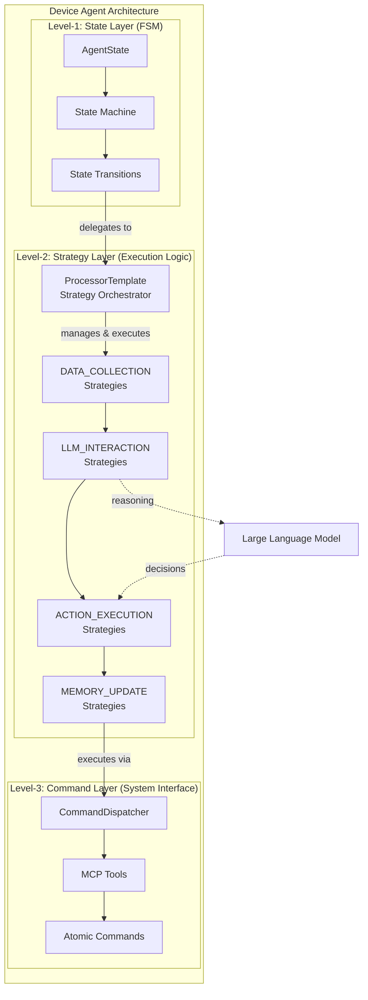
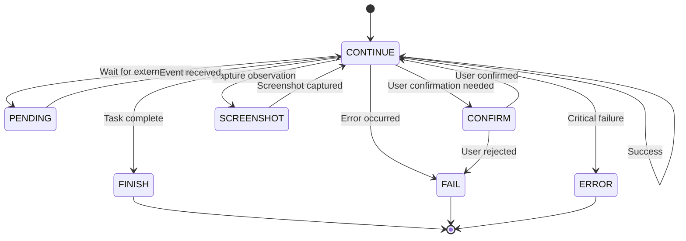
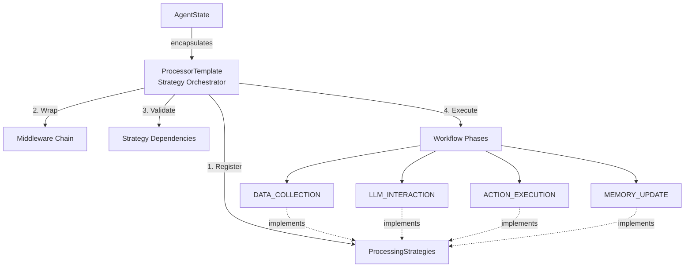
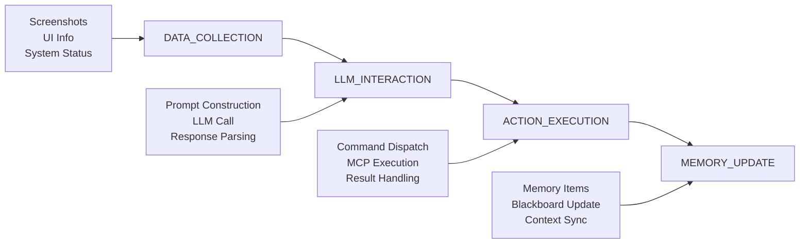
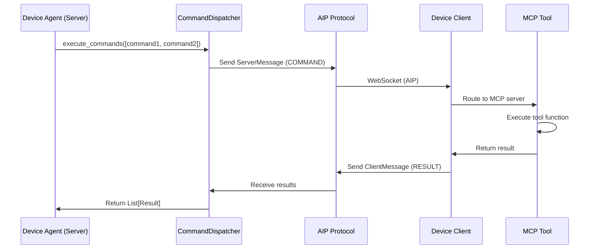
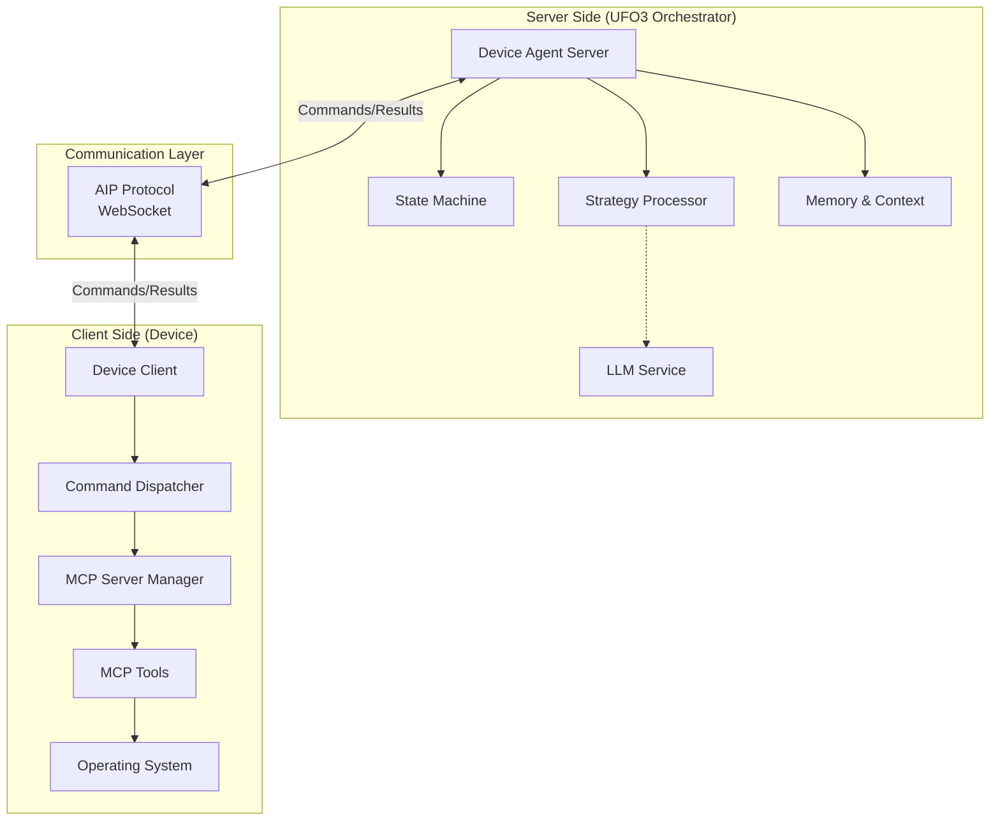
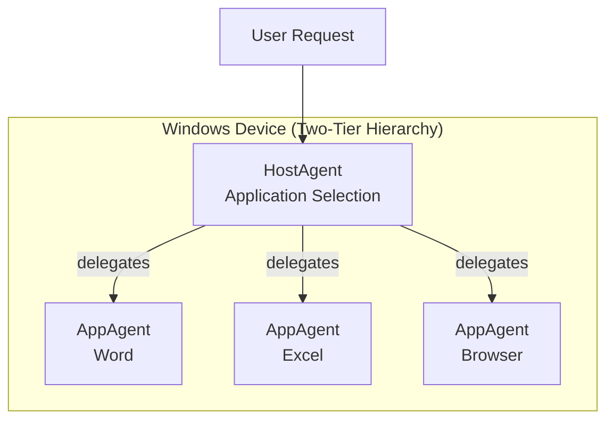
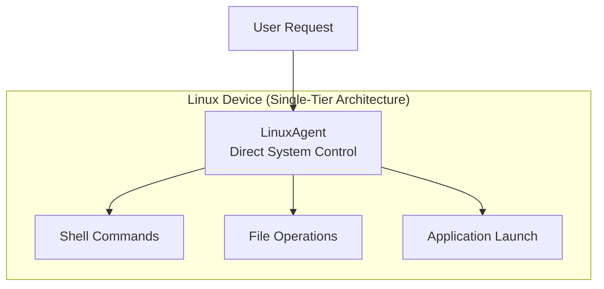
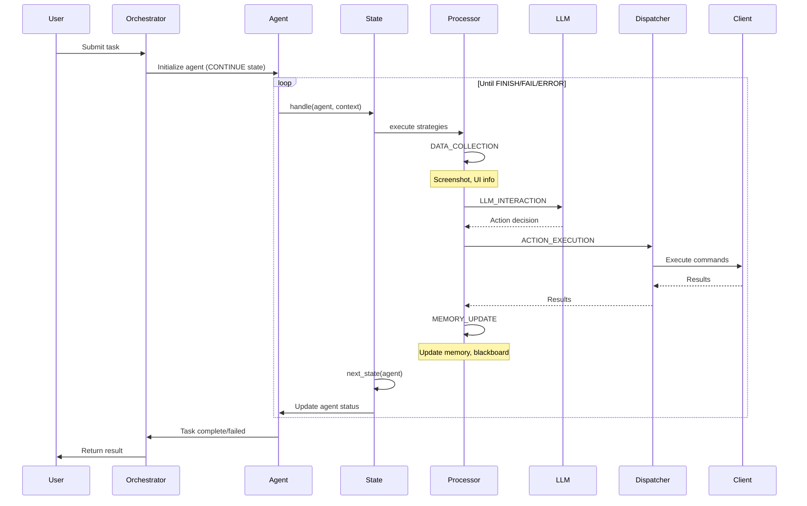
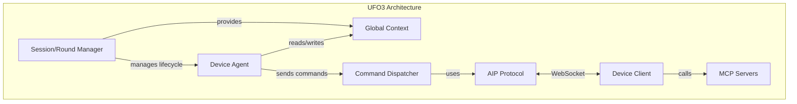

# Device Agent Architecture

Device Agents are the execution engines of UFO3's multi-device orchestration system. Each device agent operates as an autonomous, intelligent controller that translates high-level user intentions into low-level system commands. The architecture is designed for **extensibility**, **safety**, and **scalability** across heterogeneous computing environments.

## Overview

UFO3 orchestrates tasks across multiple devices through a network of **Device Agents**. Originally designed as a Windows automation framework (UFO2), the architecture has evolved to support diverse platforms including Linux, macOS, and embedded systems. This document describes the abstract design principles and interfaces that enable this multi-platform capability.

**Key Capabilities:**

- **Multi-Platform**: Windows agents (HostAgent, AppAgent), Linux agent, extensible to macOS and embedded systems
- **Safe Execution**: Server-client separation isolates reasoning from system-level operations
- **Scalable Architecture**: Hierarchical agent coordination supports complex cross-device workflows
- **LLM-Driven Reasoning**: Dynamic decision-making using large language models
- **Modular Design**: Three-layer architecture (State, Strategy, Command) enables customization

---

## Three-Layer Architecture

Device agents implement a **three-layer framework** that separates concerns, promotes modularity, and enables extensibility:



### Layer Responsibilities

| Layer | Level | Responsibility | Key Components | Extensibility |
|-------|-------|----------------|----------------|---------------|
| **State** | Level-1 | Finite State Machine governing agent lifecycle | `AgentState`, `AgentStateManager`, `AgentStatus` | Register new states via `@AgentStateManager.register` |
| **Strategy** | Level-2 | Execution logic layer: processor manages sequence of modular strategies | `ProcessorTemplate`, `ProcessingStrategy`, `ProcessingPhase`, `Middleware` | Compose custom strategies via `ComposedStrategy`, add middleware |
| **Command** | Level-3 | Atomic system operations mapped to MCP tools | `BasicCommandDispatcher`, `Command`, MCP integration | Add new tools via client-side MCP server registration |

**Design Rationale:**

The three-layer separation ensures:

- **State Layer (Level-1)**: Controls *when* and *what* to execute (state transitions, agent handoff)
- **Strategy Layer (Level-2)**: Defines *how* to execute (processor orchestrates modular strategies)
- **Command Layer (Level-3)**: Performs *actual* execution (deterministic system operations)

This separation allows replacing individual layers without affecting others.

---

## Level-1: State Layer (FSM)

The **State Layer** implements a Finite State Machine (FSM) that governs the agent's execution lifecycle. Each state encapsulates:

- A **processor** (strategy execution logic)
- **Transition rules** (to next state)
- **Agent handoff logic** (for multi-agent workflows)



### AgentStatus Enum

```python
class AgentStatus(Enum):
    """Agent status enumeration"""
    ERROR = "ERROR"            # Critical error occurred
    FINISH = "FINISH"          # Task completed successfully
    CONTINUE = "CONTINUE"      # Normal execution
    FAIL = "FAIL"              # Task failed
    PENDING = "PENDING"        # Waiting for external event
    CONFIRM = "CONFIRM"        # Awaiting user confirmation
    SCREENSHOT = "SCREENSHOT"  # Screenshot capture needed
```

**State Registration:**

New states can be registered dynamically using the `@AgentStateManager.register` decorator:

```python
@AgentStateManager.register
class CustomState(AgentState):
    async def handle(self, agent, context):
        # Custom state logic
        pass
    
    def next_state(self, agent):
        return AgentStateManager.get_state("CONTINUE")
```

**See [State Layer Documentation](design/state.md) for complete details.**

---

## Level-2: Strategy Layer (Execution Logic)

The **Strategy Layer** implements the execution logic within each state. Each state encapsulates a **processor** that manages a sequence of **strategies** to implement step-level workflow. This layer consists of two key components:

### Processor: Strategy Orchestrator

The **ProcessorTemplate** orchestrates the execution of strategies:

- **Registers Strategies**: Configures which strategies execute in each phase
- **Manages Middleware**: Wraps strategy execution with logging, metrics, error handling
- **Validates Dependencies**: Ensures strategies have required data before execution
- **Controls Execution**: Sequences strategies through fixed workflow phases



**Processor and Strategy Relationship:**

- **Processor**: Framework that manages the sequence of strategies
- **Strategy**: Modular, reusable execution units

Together they form **Level-2: Strategy Layer**, which handles:
- Data collection and environment inspection
- Prompt construction and LLM reasoning
- Action planning and tool invocation
- Memory updates and context synchronization

### Strategy: Modular Execution Units

**ProcessingStrategies** are modular execution units with a unified `execute()` interface:



### Four Core Strategy Types

| Strategy Type | ProcessingPhase | Purpose | Examples |
|---------------|-----------------|---------|----------|
| **DATA_COLLECTION** | `data_collection` | Gather contextual information | Screenshot capture, UI tree extraction, system info |
| **LLM_INTERACTION** | `llm_interaction` | Construct prompts, interact with LLM, parse responses | Prompt building, LLM reasoning, JSON parsing |
| **ACTION_EXECUTION** | `action_execution` | Execute commands from LLM/toolkits | Click, type, scroll, API calls |
| **MEMORY_UPDATE** | `memory_update` | Update short-term/long-term memory | Add memory items, update blackboard, sync context |

**Strategy Layer Configuration Example:**

Each state configures its processor with strategies and middleware:

```python
class AppAgentProcessor(ProcessorTemplate):
    def _setup_strategies(self):
        # Register strategies for each phase
        self.strategies[ProcessingPhase.DATA_COLLECTION] = ComposedStrategy([
            AppScreenshotCaptureStrategy(),
            AppControlInfoStrategy()
        ])
        self.strategies[ProcessingPhase.LLM_INTERACTION] = AppLLMInteractionStrategy()
        self.strategies[ProcessingPhase.ACTION_EXECUTION] = AppActionExecutionStrategy()
        self.strategies[ProcessingPhase.MEMORY_UPDATE] = AppMemoryUpdateStrategy()
    
    def _setup_middleware(self):
        # Add middleware for logging, metrics, error handling
        self.middleware_chain = [
            LoggingMiddleware(),
            PerformanceMetricsMiddleware(),
            ErrorHandlingMiddleware()
        ]
```

**See [Processor Documentation](design/processor.md) and [Strategy Documentation](design/strategy.md) for complete details.**

---

## Level-3: Command Layer (System Interface)

The **Command Layer** provides atomic, deterministic system operations. Each command maps to an **MCP tool** that executes on the device client.



### Command Structure

```python
@dataclass
class Command:
    """Atomic command to be executed on device client"""
    tool_name: str                   # MCP tool name (e.g., "click_element")
    parameters: Dict[str, Any]       # Tool arguments
    tool_type: str                   # "data_collection" or "action"
    call_id: str                     # Unique identifier
```

!!! warning "Deterministic Execution"
    Commands are designed to be:
    
    - **Atomic**: Single, indivisible operation
    - **Deterministic**: Same inputs → same outputs
    - **Auditable**: Full command history logged
    - **Reversible**: Where possible, support undo operations

**Extensibility:**

New commands can be added by:

1. Registering MCP tool on device client
2. LLM dynamically selects tool from available MCP registry
3. No server-side code changes required

**See [Command Layer Documentation](design/command.md) for complete details.**

---

## Server-Client Architecture

Device agents use a **server-client separation** to balance safety, scalability, and functionality:



### Separation of Concerns

| Component | Location | Responsibilities | Security Boundary |
|-----------|----------|------------------|-------------------|
| **Agent Server** | Orchestrator | State management, reasoning, planning, memory | Untrusted (LLM-driven decisions) |
| **Device Client** | Device | Command execution, MCP tool calls, resource access | Trusted (validated operations) |
| **AIP Protocol** | Communication | Message serialization, WebSocket transport, error handling | Secure channel (authentication, encryption) |

**Why Server-Client Separation?**

**Safety**: Isolates potentially unsafe LLM-generated decisions from direct system access. Clients validate all commands before execution.

**Scalability**: Single orchestrator server manages multiple device clients. Reduces per-device resource requirements.

**Flexibility**: Device clients can run on resource-constrained devices (embedded systems, mobile) while heavy reasoning occurs on server.

**See [Server-Client Architecture](server_client_architecture.md) for complete details.**

---

## Supported Device Platforms

UFO3 currently supports **Windows** and **Linux** device agents, with architecture designed for extensibility to other platforms.

### Windows Agents



**HostAgent** (Application-Level Coordinator):
- Selects appropriate application(s) for user request
- Decomposes tasks into application-specific subtasks
- Coordinates multiple AppAgents
- Manages application switching and data transfer

**AppAgent** (Application-Level Executor):
- Controls specific Windows application (Word, Excel, browser, etc.)
- Uses UI Automation for control element discovery
- Executes application-specific actions (type, click, scroll)
- Maintains application context and memory

!!! example "Windows Agent Example"
    **User Request**: "Create a chart from sales.xlsx and insert into report.docx"
    
    1. **HostAgent** decomposes: 
        - Open Excel → Create chart → Copy chart
        - Open Word → Paste chart
    2. **AppAgent (Excel)**: Opens `sales.xlsx`, creates chart, copies to clipboard
    3. **AppAgent (Word)**: Opens `report.docx`, pastes chart at cursor

### Linux Agent



**LinuxAgent** (System-Level Executor):
- Direct shell command execution
- File system operations
- Application launch and management
- Single-tier architecture (no application-level hierarchy)

!!! info "Architecture Difference"
    **Windows** uses two-tier hierarchy (HostAgent → AppAgent) due to:
    
    - UI Automation framework's application-centric model
    - Distinct application contexts requiring specialized agents
    
    **Linux** uses single-tier architecture because:
    
    - Shell provides unified interface to all system operations
    - Application control occurs through same command-line interface

### Platform Comparison

| Feature | Windows (UFO2) | Linux | macOS (Future) | Embedded (Future) |
|---------|----------------|-------|----------------|-------------------|
| **Agent Hierarchy** | Two-tier (Host → App) | Single-tier | TBD | Single-tier |
| **UI Control** | UI Automation | X11/Wayland | Accessibility API | Platform-specific |
| **Command Interface** | MCP tools (Win32 API) | MCP tools (Shell) | MCP tools (AppleScript) | MCP tools (Custom) |
| **Observation** | Screenshot + UI tree | Screenshot + Shell output | Screenshot + UI tree | Sensor data |
| **State Management** | Shared FSM | Shared FSM | Shared FSM | Shared FSM |
| **Strategy Layer** | Processor framework | Processor framework | Processor framework | Processor framework |
| **Current Status** | ✅ Production | ✅ Production | 🔜 Planned | 🔜 Planned |

**Extensibility Path:**

Adding a new platform requires:

1. **Implement Agent Class**: Extend `BasicAgent` (inherit State layer, Processor framework)
2. **Create Processor**: Subclass `ProcessorTemplate`, implement platform-specific strategies
3. **Define MCP Tools**: Register platform-specific MCP tools on device client
4. **Register Agent**: Use `@AgentRegistry.register` decorator

No changes to core State layer, Processor framework, or AIP protocol required.

**See [Agent Types Documentation](agent_types.md) for complete implementation details.**

---

## Agent Lifecycle

A typical device agent execution follows this lifecycle:



### Execution Phases

1. **Initialization**: Agent created with default state (`CONTINUE`), processor, memory
2. **State Handling**: Current state's `handle()` method invoked with agent and context
3. **Strategy Execution**: Processor runs strategies in sequence (DATA_COLLECTION → LLM_INTERACTION → ACTION_EXECUTION → MEMORY_UPDATE)
4. **State Transition**: State's `next_state()` determines next FSM state
5. **Repeat/Terminate**: Loop continues until terminal state (`FINISH`, `FAIL`, `ERROR`)

!!! tip "Multi-Agent Handoff"
    For multi-agent scenarios (e.g., Windows HostAgent → AppAgent), states implement `next_agent()`:
    
    ```python
    def next_agent(self, agent: BasicAgent) -> BasicAgent:
        # HostAgent delegates to AppAgent
        if agent.status == "DELEGATE_TO_APP":
            return agent.create_app_agent(...)
        return agent
    ```

---

## Memory and Context Management

Device agents maintain two types of memory:

### Short-Term Memory (Agent Memory)

**Purpose**: Track agent's execution history within a session

**Implementation**: `Memory` class with `MemoryItem` entries

```python
class Memory:
    """Agent's short-term memory"""
    _content: List[MemoryItem]
    
    def add_memory_item(self, memory_item: MemoryItem):
        """Add new memory entry"""
        self._content.append(memory_item)
```

**Content**: Actions taken, observations made, results received

**Lifetime**: Single session (cleared between tasks)

### Long-Term Memory (Blackboard)

**Purpose**: Share information across agents and sessions

**Implementation**: `Blackboard` class with multiple memory types

```python
class Blackboard:
    """Multi-agent shared memory"""
    _questions: Memory      # Q&A history
    _requests: Memory       # Request history
    _trajectories: Memory   # Action trajectories
    _screenshots: Memory    # Visual observations
```

**Content**: Common knowledge, successful action patterns, user preferences

**Lifetime**: Persistent across sessions (can be saved/loaded)

**Blackboard Usage Example:**

**Scenario**: HostAgent delegates to AppAgent (Excel)

1. HostAgent adds to blackboard:
    - Request: "Create sales chart"
    - Context: Previous analysis results
2. AppAgent reads from blackboard:
    - Retrieves request and context
    - Adds action trajectories as executed
    - Adds screenshot after chart creation
3. HostAgent reads updated blackboard:
    - Verifies chart creation
    - Continues to next step (insert to Word)

**See [Memory System Documentation](design/memory.md) for complete details.**

---

## Integration with UFO3 Components

Device agents integrate with other UFO3 components:



### Integration Points

| Component | Relationship | Description |
|-----------|--------------|-------------|
| **Session Manager** | Parent | Creates agents, manages agent lifecycle, coordinates multi-agent workflows |
| **Round Manager** | Sibling | Manages round-based execution, tracks round state, synchronizes with agent steps |
| **Global Context** | Shared State | Agent reads request/config, writes results/status, shares data across components |
| **Command Dispatcher** | Execution Interface | Agent sends commands, dispatcher routes to client, returns results |
| **AIP Protocol** | Communication | Serializes commands/results, manages WebSocket, handles errors/timeouts |
| **Device Client** | Executor | Receives commands, invokes MCP tools, returns results |
| **MCP Servers** | Tool Registry | Provides available tools, executes tool functions, returns structured results |

**See [Session Documentation](../modules/session.md), [Context Documentation](../modules/context.md), and [AIP Protocol](../../aip/overview.md) for integration details.**

---

## Design Patterns

Device agent architecture leverages several design patterns:

### 1. State Pattern (FSM Layer)

**Purpose**: Encapsulate state-specific behavior, enable dynamic state transitions

**Implementation**: `AgentState` abstract class, concrete state classes

```python
class AgentState(ABC):
    @abstractmethod
    async def handle(self, agent, context):
        """Execute state-specific logic"""
        pass
    
    @abstractmethod
    def next_state(self, agent):
        """Determine next state"""
        pass
```

### 2. Strategy Pattern (Strategy Layer)

**Purpose**: Define family of algorithms (strategies), make them interchangeable

**Implementation**: `ProcessingStrategy` protocol, concrete strategy classes

```python
class ProcessingStrategy(Protocol):
    async def execute(self, agent, context) -> ProcessingResult:
        """Execute strategy logic"""
        pass
```

### 3. Template Method Pattern (Processor Framework)

**Purpose**: Define skeleton of algorithm, let subclasses override specific steps

**Implementation**: `ProcessorTemplate` abstract class

```python
class ProcessorTemplate(ABC):
    @abstractmethod
    def _setup_strategies(self):
        """Subclass defines which strategies to use"""
        pass
    
    async def process(self, agent, context):
        """Template method - runs strategies in sequence"""
        for phase, strategy in self.strategies.items():
            result = await strategy.execute(agent, context)
            # Handle result, update context
```

### 4. Singleton Pattern (State Manager)

**Purpose**: Ensure single instance of state registry

**Implementation**: `AgentStateManager` with metaclass

```python
class AgentStateManager(ABC, metaclass=SingletonABCMeta):
    _state_mapping: Dict[str, Type[AgentState]] = {}
    
    def get_state(self, status: str) -> AgentState:
        """Lazy load and return state instance"""
        pass
```

### 5. Registry Pattern (Agent Registration)

**Purpose**: Register agent types, enable dynamic agent creation

**Implementation**: `AgentRegistry` decorator

```python
@AgentRegistry.register(agent_name="appagent", processor_cls=AppAgentProcessor)
class AppAgent(BasicAgent):
    pass
```

### 6. Blackboard Pattern (Multi-Agent Coordination)

**Purpose**: Share data across multiple agents

**Implementation**: `Blackboard` class

```python
class Blackboard:
    _questions: Memory
    _requests: Memory
    _trajectories: Memory
    _screenshots: Memory
```

---

## Best Practices

### State Design

- Keep states **focused**: Each state should have single, clear responsibility
- Use **rule-based transitions** for deterministic flows, **LLM-driven transitions** for adaptive behavior
- Implement **error states** for graceful degradation
- Document **state invariants** and **transition conditions**

### Strategy Design

- Keep strategies **atomic**: Each strategy should perform one cohesive task
- Declare **dependencies explicitly** using `get_dependencies()`
- Use **ComposedStrategy** to combine multiple strategies within a phase
- Implement **fail-fast** for critical errors, **continue-on-error** for optional operations

### Command Design

- Keep commands **atomic**: Single, indivisible operation
- Design commands to be **idempotent** where possible
- Validate **arguments** on client side before execution
- Return **structured results** with success/failure status

### Memory Management

- Use **short-term memory** for agent-specific execution history
- Use **blackboard** for multi-agent coordination and persistent knowledge
- **Clear memory** between sessions to avoid context pollution
- Implement **memory pruning** for long-running sessions

!!! warning "Security Considerations"
    - **Validate all commands** on client side before execution
    - **Sanitize LLM outputs** before converting to commands
    - **Limit command scope** via MCP tool permissions
    - **Audit all actions** for compliance and debugging
    - **Isolate agents** to prevent unauthorized cross-agent access

---

## Related Documentation

**Deep Dive Into Layers:**

- [State Layer Documentation](design/state.md): FSM, AgentState, transitions, state registration
- [Processor and Strategy Documentation](design/processor.md): ProcessorTemplate, strategies, dependency management
- [Command Layer Documentation](design/command.md): CommandDispatcher, MCP integration, atomic commands

**Supporting Systems:**

- [Memory System Documentation](design/memory.md): Memory, MemoryItem, Blackboard patterns
- [Agent Types Documentation](agent_types.md): Windows agents, Linux agent, platform-specific implementations

**Integration Points:**

- [Server-Client Architecture](server_client_architecture.md): Server and client separation, communication patterns
- [Server Architecture](../../server/overview.md): Agent server, WebSocket manager, orchestration
- [Client Architecture](../../client/overview.md): Device client, MCP servers, command execution
- [AIP Protocol](../../aip/overview.md): Agent Interaction Protocol for server-client communication
- [MCP Integration](../../mcp/overview.md): Model Context Protocol for tool execution

---

## Summary

**Key Takeaways:**

✅ **Three-Layer Architecture**: State (FSM) → Strategy (Execution Logic) → Command (System Interface)

✅ **Server-Client Separation**: Safe isolation of reasoning (server) from execution (client)

✅ **Multi-Platform Support**: Windows (two-tier), Linux (single-tier), extensible to macOS and embedded

✅ **LLM-Driven Reasoning**: Dynamic decision-making with structured command output

✅ **Modular & Extensible**: Register new states, compose strategies, add MCP tools without core changes

✅ **Memory Systems**: Short-term (agent memory) and long-term (blackboard) for coordination

✅ **Design Patterns**: State, Strategy, Template Method, Singleton, Registry, Blackboard

The Device Agent architecture provides a **robust, extensible foundation** for multi-device automation. By separating concerns across three layers and isolating reasoning from execution, UFO3 achieves both **safety** and **flexibility** for orchestrating complex cross-device workflows.

---

## Reference

Below is the reference for the `BasicAgent` class. All device agents inherit from `BasicAgent` and implement platform-specific processors and states:

::: agents.agent.basic.BasicAgent

