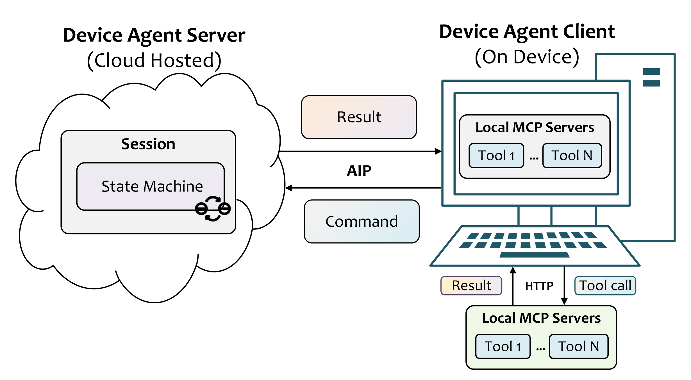
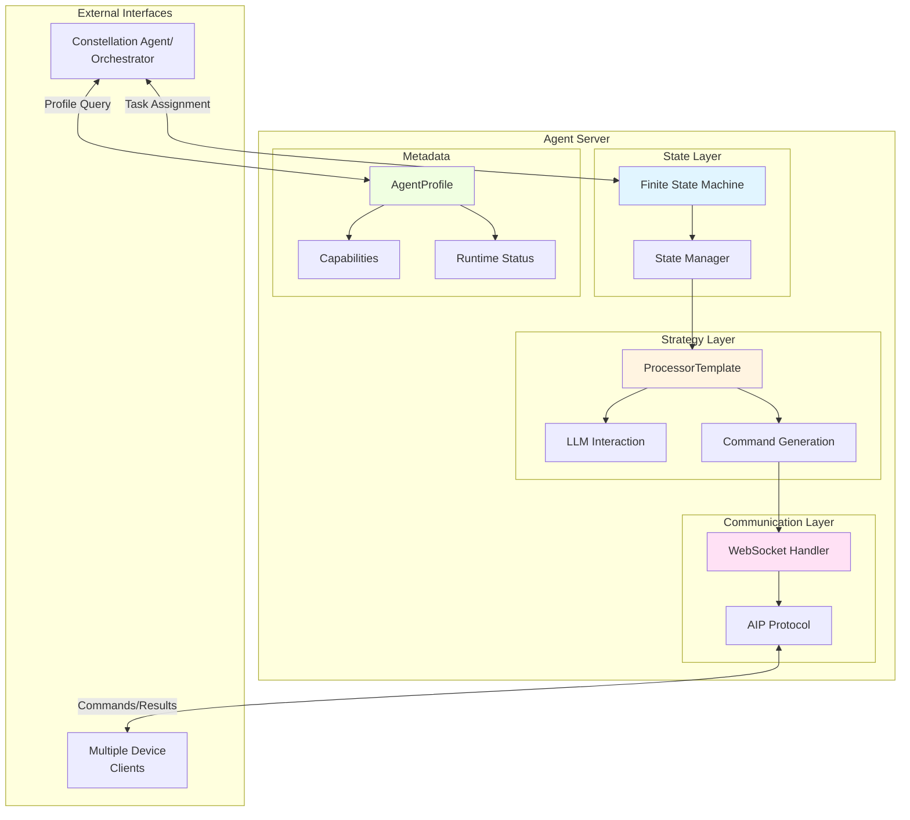
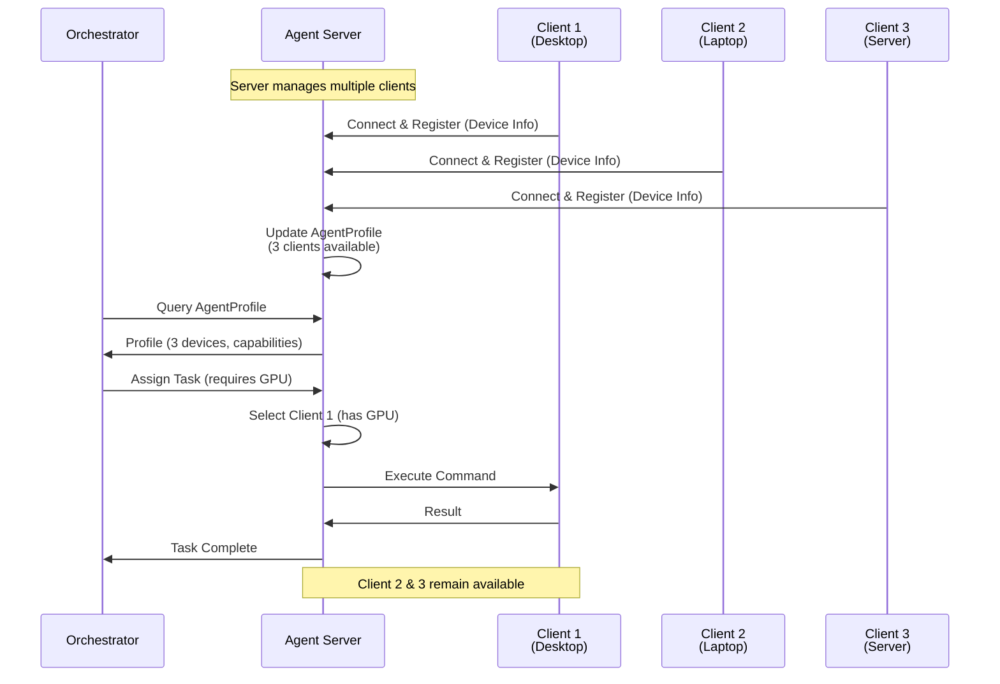
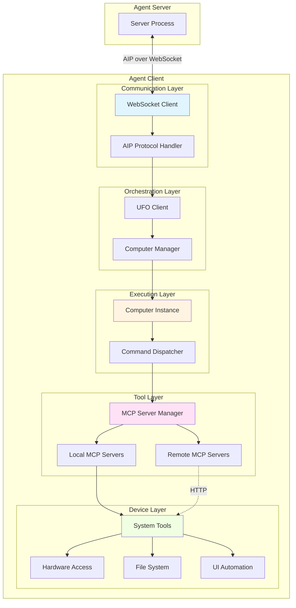
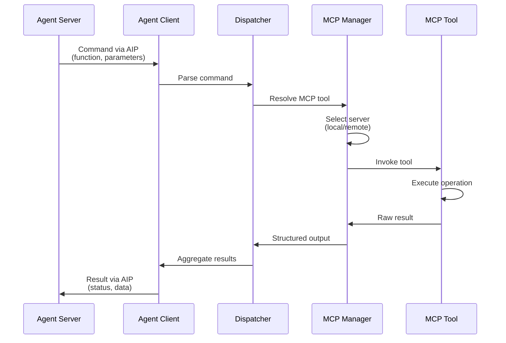
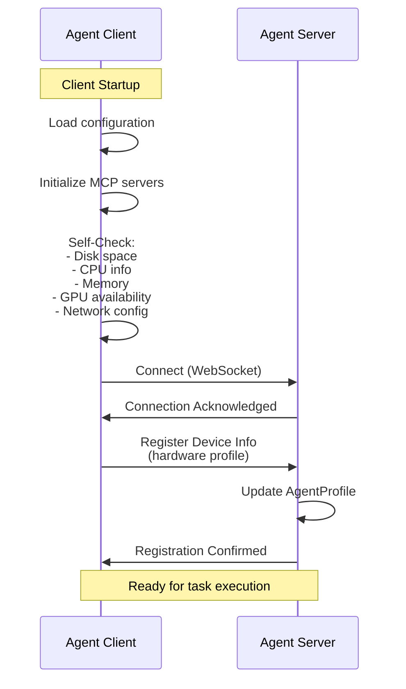
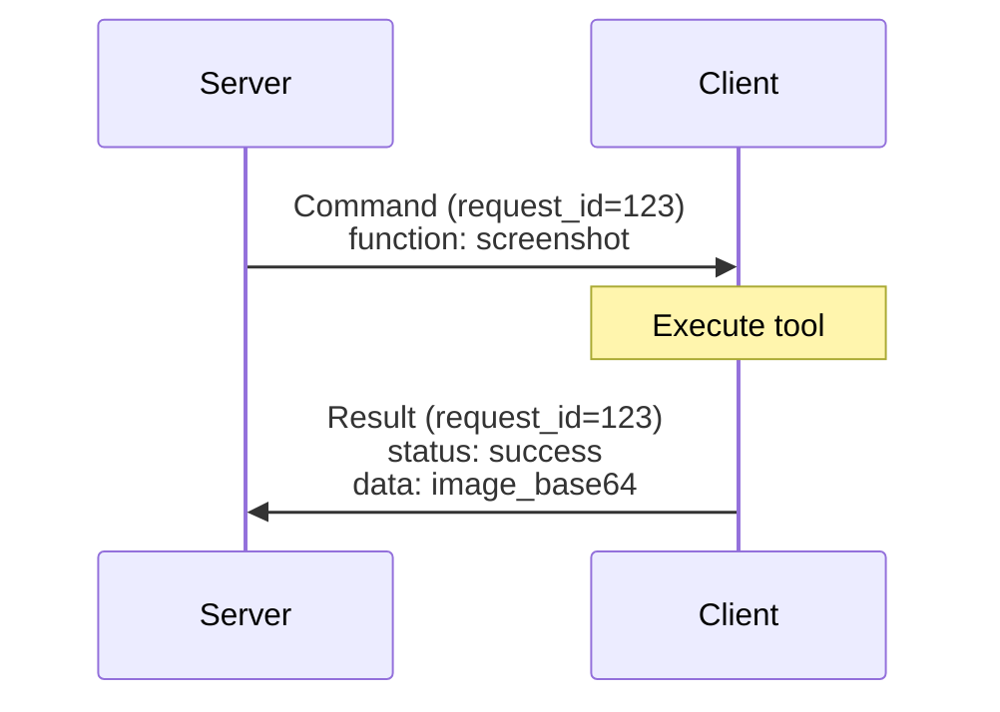
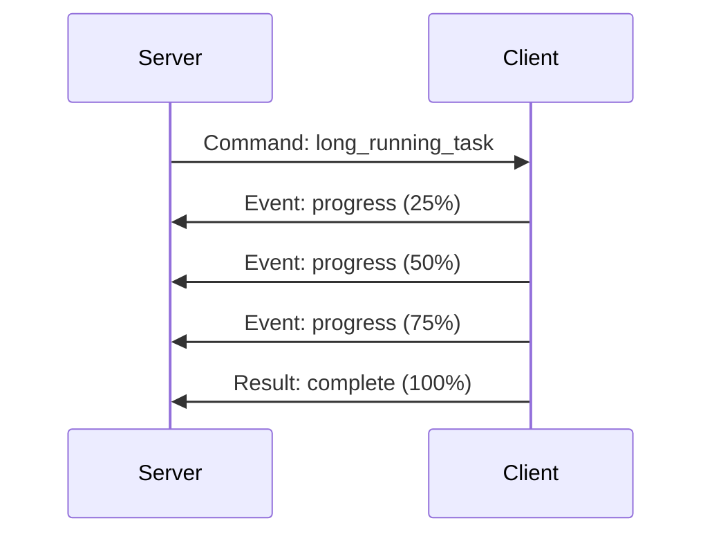
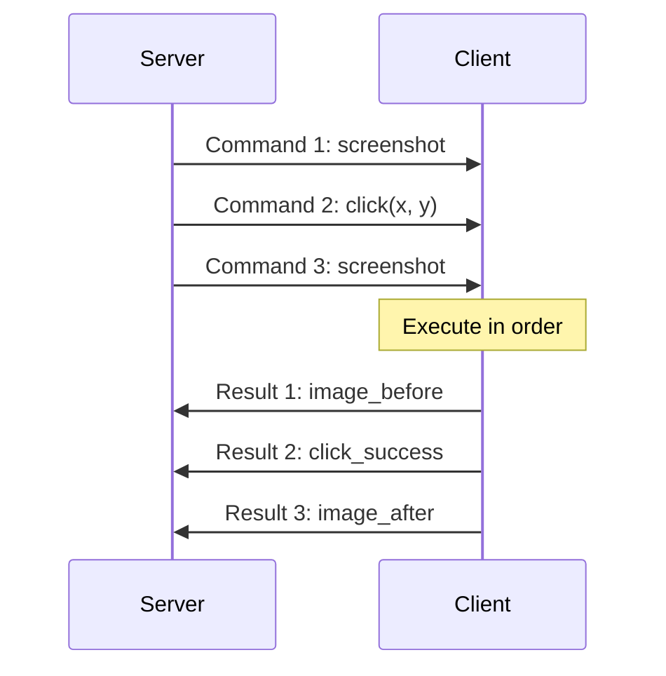
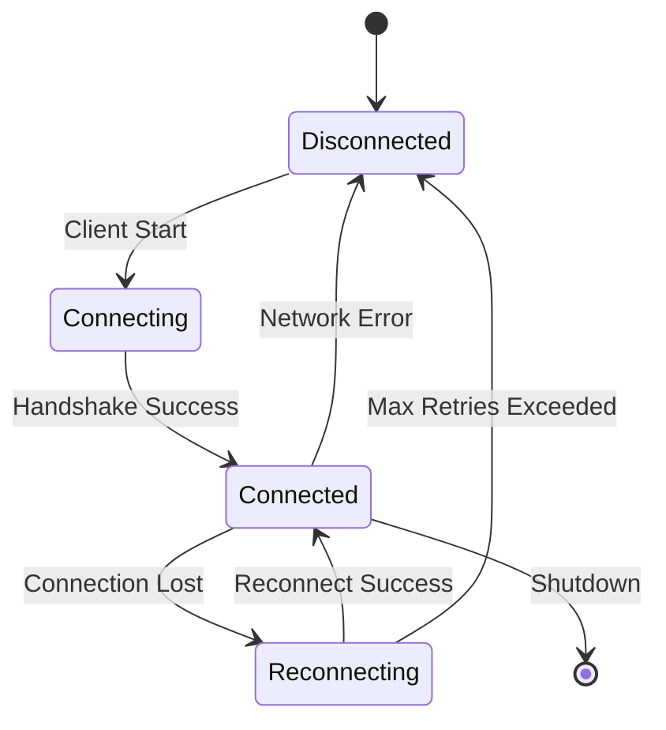

# Server-Client Architecture

Device agents in UFO are partitioned into **server** and **client** components, separating high-level orchestration from low-level execution. This architecture enables safe, scalable, and flexible task execution across heterogeneous devices through the Agent Interaction Protocol (AIP).

---

## Overview

To support safe, scalable, and flexible execution across heterogeneous devices, each **device agent** is partitioned into two distinct components: a **server** and a **client**. This separation of responsibilities aligns naturally with the [layered FSM architecture](./overview.md#three-layer-architecture) and leverages [AIP](../../aip/overview.md) for reliable, low-latency communication.

<figure markdown>
  
  <figcaption>The server-client architecture of a device agent. The server handles orchestration, state management, and LLM-driven decision-making, while the client executes commands through MCP tools and reports results back.</figcaption>
</figure>

### Architecture Benefits

| Benefit | Description |
|---------|-------------|
| **🔒 Safe Execution** | Separates reasoning (server) from system operations (client), reducing risk |
| **📈 Scalable Orchestration** | Single server can manage multiple clients concurrently |
| **🔧 Independent Updates** | Server logic and client tools can be updated independently |
| **🌐 Multi-Device Support** | Clients can be rapidly deployed on new devices with minimal configuration |
| **🛡️ Fault Isolation** | Client failures don't crash the server's reasoning logic |
| **📡 Real-Time Communication** | Persistent WebSocket connections enable low-latency bidirectional messaging |

**Design Philosophy:**

The server-client architecture embodies the **separation of concerns** principle: the server focuses on **what** to do (strategy), while the client focuses on **how** to do it (execution). This clear division enhances maintainability, security, and scalability.

---

## Server: Orchestration and State Management

The **agent server** is responsible for managing the agent's state machine lifecycle, executing high-level strategies, and interacting with the Constellation Agent or orchestrator. It handles task decomposition, prompt construction, decision-making, and command sequencing.

**Server Responsibilities:**

- 🧠 **State Machine Management**: Controls agent lifecycle through the [FSM](./overview.md#level-1-state-layer-fsm)
- 🎯 **Strategy Execution**: Implements the [Strategy Layer](./overview.md#level-2-strategy-layer-execution-logic)
- 🤖 **LLM Interaction**: Constructs prompts, parses responses, makes decisions
- 📋 **Task Decomposition**: Breaks down high-level tasks into executable commands
- 🔀 **Command Sequencing**: Determines execution order and dependencies
- 👥 **Multi-Client Coordination**: Manages multiple device clients concurrently

### Server Architecture



### AgentProfile

Each server instance exposes its capabilities and status through metadata. This information allows the orchestrator to dynamically select suitable agents for specific subtasks, improving task distribution efficiency.

Note: The AgentProfile concept is part of the design for multi-agent coordination in Galaxy (constellation-level orchestration). In UFO3's current implementation, agent metadata is managed through the session context and WebSocket handler registration.

### Multi-Client Management

A **single server instance** can manage **multiple agent clients concurrently**, maintaining isolation across devices while supporting centralized supervision and coordination.



**Benefits of centralized server management:**

- **Session Isolation**: Each client maintains independent state
- **Load Balancing**: Server distributes tasks across available clients
- **Fault Tolerance**: Client failures don't affect other clients
- **Unified Monitoring**: Centralized view of all client statuses

### Server Flexibility

Crucially, the server maintains **full control** over the agent's workflow logic, enabling **updates to decision strategies** without impacting low-level execution on the device.

**Update Scenarios:**

- **Prompt Engineering**: Modify LLM prompts to improve decision quality
- **Strategy Changes**: Switch between different processing strategies
- **State Transitions**: Adjust FSM logic for new workflows
- **API Integration**: Add new orchestrator interfaces

All these updates happen **server-side only**, without redeploying clients.

For detailed server implementation, see the [Server Documentation](../../server/overview.md).

---

## Client: Command Execution and Resource Access

The **agent client** runs on the target device and manages a collection of MCP servers or tool interfaces. These MCP servers can operate locally (via direct invocation) or remotely (through HTTP requests), and each client may register multiple MCP servers to access diverse tool sources.

**Client Responsibilities:**

- ⚙️ **Command Execution**: Translates server commands into MCP tool calls
- 🛠️ **Tool Management**: Registers and orchestrates local/remote MCP servers
- 📊 **Device Profiling**: Reports hardware and software configuration
- 📡 **Result Reporting**: Returns structured execution results via AIP
- 🔍 **Self-Checks**: Performs diagnostics (disk, CPU, memory, GPU, network)
- 🚫 **Stateless Operation**: Executes directives without high-level reasoning

### Client Architecture



### Command Execution Pipeline

Upon receiving commands from the agent server—such as collecting telemetry, invoking system utilities, or interacting with hardware components—the client follows this execution pipeline:



**Pipeline stages:**

1. **Command Reception**: Client receives AIP message with command metadata
2. **Parsing**: Extract function name and parameters
3. **Tool Resolution**: Map command to registered MCP tool
4. **Server Selection**: Choose local or remote MCP server
5. **Execution**: Invoke tool deterministically
6. **Result Aggregation**: Structure output according to schema
7. **Response Transmission**: Return results via AIP

### MCP Server Management

Each client may **register multiple MCP servers** to access diverse tool sources. MCP servers provide standardized interfaces for:

| Tool Category | Examples | Local/Remote |
|---------------|----------|--------------|
| **UI Automation** | Click, type, screenshot, select controls | Local |
| **File Operations** | Read, write, copy, delete files | Local |
| **System Utilities** | Process management, network config | Local |
| **Application APIs** | Excel, Word, Browser automation | Local |
| **Remote Services** | Cloud APIs, external databases | Remote (HTTP) |
| **Hardware Control** | Camera, sensors, GPIO | Local |

```python
# Example: Client registers multiple MCP servers
client.register_mcp_server(
    name="ui_automation",
    type="local",
    tools=["click", "type", "screenshot"]
)

client.register_mcp_server(
    name="file_operations",
    type="local",
    tools=["read_file", "write_file", "list_dir"]
)

client.register_mcp_server(
    name="cloud_api",
    type="remote",
    endpoint="https://api.example.com/mcp",
    tools=["query_database", "send_notification"]
)
```

For detailed MCP integration, see [MCP Integration](../../client/mcp_integration.md).

### Device Initialization and Registration

During initialization, each client connects to the agent server through the AIP endpoint, performs **self-checks**, and **registers its hardware-software profile**.



**Self-checks performed during initialization:**

```python
device_info = {
    # Hardware
    "cpu": {
        "model": "Intel Core i7-12700K",
        "cores": 12,
        "threads": 20,
        "frequency_mhz": 3600
    },
    "memory": {
        "total_gb": 32,
        "available_gb": 24
    },
    "disk": {
        "total_gb": 1024,
        "free_gb": 512
    },
    "gpu": {
        "available": True,
        "model": "NVIDIA RTX 4090",
        "vram_gb": 24
    },
    
    # Network
    "network": {
        "hostname": "desktop-001",
        "ip_address": "192.168.1.100",
        "bandwidth_mbps": 1000
    },
    
    # Software
    "os": {
        "platform": "windows",
        "version": "11",
        "build": "22621"
    },
    "installed_apps": [
        "Microsoft Excel",
        "Google Chrome",
        "Visual Studio Code"
    ],
    "mcp_servers": [
        "ui_automation",
        "file_operations",
        "system_utilities"
    ]
}
```

This profile is integrated into the server's **AgentProfile**, giving the orchestrator **complete visibility** into system topology and resource availability for informed task assignment and scheduling.

For client implementation details, see the [Client Documentation](../../client/overview.md).

### Stateless Design

The client remains **stateless with respect to reasoning**: it faithfully executes directives without engaging in high-level decision-making.

**Client Does NOT:**

- ❌ Construct prompts for LLMs
- ❌ Make strategic decisions
- ❌ Manage state transitions
- ❌ Decompose tasks into subtasks
- ❌ Coordinate with other agents

**Client DOES:**

- ✅ Execute commands deterministically
- ✅ Manage MCP tool lifecycle
- ✅ Report execution results
- ✅ Monitor device health
- ✅ Handle tool failures gracefully

This separation ensures that **updates to one layer do not interfere with the other**, enhancing maintainability and reducing risk of disruption.

---

## Server-Client Communication

All communication between the server and client is routed through the **Agent Interaction Protocol (AIP)**, leveraging **persistent WebSocket connections**. This allows bidirectional, low-latency messaging that supports both synchronous command execution and asynchronous event reporting.

**Why AIP over WebSocket?**

- **Low Latency**: Real-time command dispatch and result streaming
- **Bidirectional**: Server sends commands, client sends results/events
- **Persistent**: Maintains connection across multiple commands
- **Event-Driven**: Supports async notifications (progress updates, errors)
- **Protocol Abstraction**: Hides network complexity from application logic

### Communication Patterns

#### 1. Synchronous Command Execution



**Flow:**
1. Server sends command with unique `request_id`
2. Client executes MCP tool synchronously
3. Client returns result with matching `request_id`
4. Server matches result to pending request

#### 2. Asynchronous Event Reporting



**Use cases:**
- Progress updates for long-running operations
- Error notifications during execution
- Resource utilization alerts
- Device state changes

#### 3. Multi-Command Pipeline



**Benefits:**
- Reduces round-trip latency
- Enables atomic operation sequences
- Supports transaction-like semantics

### AIP Message Format

Commands and results follow the AIP message schema:

```json
{
  "type": "command",
  "request_id": "abc-123",
  "timestamp": "2025-11-06T10:30:00Z",
  "payload": {
    "function": "screenshot",
    "arguments": {
      "region": "active_window"
    }
  }
}
```

```json
{
  "type": "result",
  "request_id": "abc-123",
  "timestamp": "2025-11-06T10:30:01Z",
  "payload": {
    "status": "success",
    "data": {
      "image": "base64_encoded_data",
      "dimensions": {"width": 1920, "height": 1080}
    }
  }
}
```

For complete AIP specification, see [AIP Documentation](../../aip/overview.md).

### Connection Management

The server and client maintain persistent connections with automatic reconnection logic:



**Connection lifecycle:**

1. **Initial Connection**: Client initiates WebSocket connection to server
2. **Registration**: Client sends device info, receives confirmation
3. **Active Communication**: Bidirectional message exchange
4. **Heartbeat**: Periodic pings to detect connection loss
5. **Reconnection**: Automatic retry with exponential backoff
6. **Graceful Shutdown**: Clean disconnection on exit

**Resilience features:**

- **Heartbeat Monitoring**: Detects silent connection failures
- **Automatic Reconnection**: Exponential backoff with jitter
- **Message Queuing**: Buffers messages during disconnection
- **Session Recovery**: Restores context after reconnection

---

## Design Considerations

This server-client architecture offers several key advantages:

### 1. Rapid Device Deployment

Device clients can be **rapidly deployed** on new devices with minimal configuration, immediately becoming execution endpoints within UFO.

```bash
# Deploy client on new device (example)
# 1. Install client package
pip install ufo-client

# 2. Configure server endpoint
cat > client_config.yaml <<EOF
server:
  host: orchestrator.example.com
  port: 8000
  protocol: wss
device:
  name: production-server-01
  platform: linux
EOF

# 3. Start client (auto-registers with server)
ufo-client start --config client_config.yaml
```

**Deployment benefits:**

- No complex setup or agent-specific configuration
- Automatic device profiling and registration
- Immediate availability for task assignment
- Consistent deployment across platforms

### 2. Clear Separation of Concerns

By separating responsibilities, the server focuses on **high-level decision-making and orchestration**, while the client handles **deterministic command execution**.

| Concern | Server Responsibility | Client Responsibility |
|---------|----------------------|----------------------|
| **Reasoning** | LLM interaction, strategy selection | None (stateless) |
| **Orchestration** | Task decomposition, sequencing | None (follows directives) |
| **Execution** | Command generation | Tool invocation |
| **State** | FSM management, session lifecycle | None (stateless) |
| **Communication** | AIP protocol, connection registry | AIP protocol, result reporting |

This clear separation ensures that **updates to one layer do not interfere with the other**, enhancing maintainability and reducing risk of disruption.

### 3. Independent Update Cycles

**Server updates:**

- Modify LLM prompts and reasoning strategies
- Add new state machine states
- Integrate with new orchestrators
- Improve task decomposition algorithms

**Client updates:**

- Add new MCP tools
- Update tool implementations
- Optimize system integrations
- Add new hardware support

Updates can be deployed **independently** without coordinating releases or disrupting active sessions.

### 4. Multi-Device Orchestration Efficiency

A **single server instance can manage multiple clients**, enabling:

- **Centralized Control**: Unified view of all devices
- **Load Distribution**: Balance tasks across available resources
- **Cross-Device Workflows**: Coordinate tasks spanning multiple devices
- **Resource Pooling**: Share computational resources efficiently

### 5. Extensibility

The architecture supports **organic growth** without disrupting existing functionality:

**Client-side extensibility:**

- New tools, sensors, or MCP interfaces can be added to the client layer
- No modification to server logic required
- Tools are registered dynamically at runtime

**Server-side extensibility:**

- New reasoning strategies can be deployed on the server independently
- State machine can be extended with new states
- Multiple orchestration patterns supported

### 6. Robust Execution Under Unreliable Conditions

Persistent sessions and structured event semantics through AIP improve robustness:

- **Intermittent Connectivity**: Automatic reconnection with message queuing
- **Dynamic Task Edits**: Server can modify tasks without restarting client
- **Partial Failures**: Client errors reported without crashing server
- **Resource Constraints**: Server can redistribute tasks if client overloaded

---

## Architecture Comparison

### Local Mode vs. Server-Client Mode

Device agents can operate in two modes:

| Aspect | Local Mode | Server-Client Mode |
|--------|------------|-------------------|
| **Deployment** | Single process (monolithic) | Distributed (server + client) |
| **Communication** | In-process method calls | AIP over WebSocket |
| **State Management** | Local FSM | Server-side FSM, stateless client |
| **Scalability** | Single device | Multiple devices per server |
| **Fault Isolation** | Process failure = total failure | Client failure isolated from server |
| **Update Flexibility** | Requires full restart | Independent server/client updates |
| **Use Case** | Development, simple automation | Production, multi-device orchestration |

**When to use Local Mode:**

- Development and testing
- Single-device automation
- Low-latency requirements (no network overhead)
- Simple workflows without cross-device coordination

**When to use Server-Client Mode:**

- Production deployments
- Multi-device orchestration
- Heterogeneous device management
- Need for centralized control and monitoring
- Frequent strategy updates without device disruption

---

## Implementation Examples

### Server: Sending Commands

```python
# Server sends command to client via AIP
async def execute_on_device(
    server: AgentServer,
    client_id: str,
    command: str,
    arguments: Dict[str, Any]
) -> Dict[str, Any]:
    """Execute command on remote client."""
    
    # Create command message
    message = {
        "type": "command",
        "request_id": generate_request_id(),
        "payload": {
            "function": command,
            "arguments": arguments
        }
    }
    
    # Send via AIP
    result = await server.send_command(client_id, message)
    
    return result
```

### Client: Executing Commands

```python
# Client receives and executes command
async def handle_command(
    client: AgentClient,
    command_message: Dict[str, Any]
) -> Dict[str, Any]:
    """Handle incoming command from server."""
    
    # Extract command details
    function = command_message["payload"]["function"]
    arguments = command_message["payload"]["arguments"]
    request_id = command_message["request_id"]
    
    try:
        # Execute via MCP tool
        result = await client.computer.execute_tool(
            tool_name=function,
            parameters=arguments
        )
        
        # Return success result
        return {
            "type": "result",
            "request_id": request_id,
            "payload": {
                "status": "success",
                "data": result
            }
        }
        
    except Exception as e:
        # Return error result
        return {
            "type": "result",
            "request_id": request_id,
            "payload": {
                "status": "error",
                "error": str(e)
            }
        }
```

---

## Summary

The server-client architecture is a foundational design pattern in UFO's distributed agent system:

**Key Takeaways:**

- 🏗️ **Separation of Concerns**: Server handles reasoning, client handles execution
- 📡 **AIP Communication**: Persistent WebSocket connections enable real-time bidirectional messaging
- 🔧 **Independent Updates**: Server logic and client tools evolve independently
- 📈 **Scalable Management**: Single server orchestrates multiple clients
- 🛡️ **Fault Isolation**: Client failures don't crash server reasoning
- 🌐 **Multi-Device Ready**: Supports heterogeneous device orchestration

**Related Documentation:**

- [Device Agent Overview](overview.md) - Three-layer FSM framework
- [Agent Types](agent_types.md) - Platform-specific implementations
- [Server Overview](../../server/overview.md) - Detailed server architecture and APIs
- [Client Overview](../../client/overview.md) - Detailed client architecture and tools
- [AIP Protocol](../../aip/overview.md) - Communication protocol specification
- [MCP Integration](../../mcp/overview.md) - Tool management and execution

By decoupling high-level reasoning from low-level execution, the server-client architecture enables UFO to safely orchestrate complex workflows across diverse computing environments while maintaining flexibility, reliability, and ease of maintenance.
