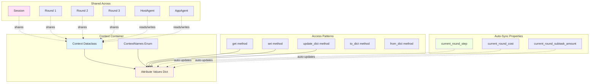

# Context

The **Context** object is a type-safe shared state container that persists conversation state across all Rounds within a Session, providing centralized access to logs, costs, application state, and execution metadata.

**Quick Reference:**

- Get value? `context.get(ContextNames.REQUEST)`
- Set value? `context.set(ContextNames.REQUEST, "new value")`
- Auto-sync? See [Auto-Syncing Properties](#auto-syncing-properties)
- All attributes? See [Complete Attribute Reference](#complete-attribute-reference)

---

## Overview

The `Context` object serves as the central state store for sessions:

1. **Type Safety**: Enum-based attribute names with type definitions
2. **Default Values**: Automatic initialization with sensible defaults
3. **Auto-Syncing**: Current round values sync automatically
4. **Serialization**: Convert to/from dict for persistence
5. **Dispatcher Attachment**: Command execution integration

### Architecture



---

## ContextNames Enum

All context attributes are defined in the `ContextNames` enum for type safety:

```python
from ufo.module.context import ContextNames

# Type-safe attribute names
request = context.get(ContextNames.REQUEST)
context.set(ContextNames.SESSION_COST, 0.42)
```

### Attribute Categories

!!!info "30+ Context Attributes"
    Context attributes are organized into 7 logical categories.

#### 1. Identifiers & Mode

Context attributes for session and mode identification.

| Attribute | Type | Default | Description |
|-----------|------|---------|-------------|
| `ID` | `int` | `0` | Session ID |
| `MODE` | `str` | `""` | Execution mode (normal, service, etc.) |
| `CURRENT_ROUND_ID` | `int` | `0` | Current round number |

#### 2. Execution State

| Attribute | Type | Default | Description |
|-----------|------|---------|-------------|
| `REQUEST` | `str` | `""` | Current user request |
| `SUBTASK` | `str` | `""` | Current subtask for AppAgent |
| `PREVIOUS_SUBTASKS` | `List` | `[]` | Previous subtasks history |
| `HOST_MESSAGE` | `List` | `[]` | HostAgent → AppAgent messages |
| `ROUND_RESULT` | `str` | `""` | Current round result |

#### 3. Cost Tracking

| Attribute | Type | Default | Description |
|-----------|------|---------|-------------|
| `SESSION_COST` | `float` | `0.0` | Total session cost ($) |
| `ROUND_COST` | `Dict[int, float]` | `{}` | Cost per round |
| `CURRENT_ROUND_COST` | `float` | `0.0` | Current round cost (auto-sync) |

#### 4. Step Counting

| Attribute | Type | Default | Description |
|-----------|------|---------|-------------|
| `SESSION_STEP` | `int` | `0` | Total steps in session |
| `ROUND_STEP` | `Dict[int, int]` | `{}` | Steps per round |
| `CURRENT_ROUND_STEP` | `int` | `0` | Current round steps (auto-sync) |
| `ROUND_SUBTASK_AMOUNT` | `Dict[int, int]` | `{}` | Subtasks per round |
| `CURRENT_ROUND_SUBTASK_AMOUNT` | `int` | `0` | Current subtasks (auto-sync) |

#### 5. Application Context

| Attribute | Type | Default | Description |
|-----------|------|---------|-------------|
| `APPLICATION_WINDOW` | `UIAWrapper` | `None` | Current application window |
| `APPLICATION_WINDOW_INFO` | `Any` | - | Window metadata |
| `APPLICATION_PROCESS_NAME` | `str` | `""` | Process name (e.g., "WINWORD.EXE") |
| `APPLICATION_ROOT_NAME` | `str` | `""` | Root UI element name |
| `CONTROL_REANNOTATION` | `List` | `[]` | Control re-annotations |

#### 6. Logging

| Attribute | Type | Default | Description |
|-----------|------|---------|-------------|
| `LOG_PATH` | `str` | `""` | Log directory path |
| `LOGGER` | `Logger` | `None` | Session logger |
| `REQUEST_LOGGER` | `Logger` | `None` | LLM request logger |
| `EVALUATION_LOGGER` | `Logger` | `None` | Evaluation logger |
| `STRUCTURAL_LOGS` | `defaultdict` | `defaultdict(...)` | Structured logs |

#### 7. Tools & Communication

| Attribute | Type | Default | Description |
|-----------|------|---------|-------------|
| `TOOL_INFO` | `Dict` | `{}` | Available tools metadata |
| `DEVICE_INFO` | `List` | `[]` | Connected device information (Galaxy) |
| `CONSTELLATION` | `TaskConstellation` | `None` | Task constellation (Galaxy) |
| `WEAVING_MODE` | `WeavingMode` | `CREATION` | Weaving mode (Galaxy) |

---

## Complete Attribute Reference

All 30+ attributes with types and defaults.

```python
class ContextNames(Enum):
    # Identifiers
    ID = "ID"                                        # int, default: 0
    MODE = "MODE"                                    # str, default: ""
    CURRENT_ROUND_ID = "CURRENT_ROUND_ID"            # int, default: 0
    
    # Requests & Tasks
    REQUEST = "REQUEST"                              # str, default: ""
    SUBTASK = "SUBTASK"                              # str, default: ""
    PREVIOUS_SUBTASKS = "PREVIOUS_SUBTASKS"          # List, default: []
    HOST_MESSAGE = "HOST_MESSAGE"                    # List, default: []
    ROUND_RESULT = "ROUND_RESULT"                    # str, default: ""
    
    # Costs
    SESSION_COST = "SESSION_COST"                    # float, default: 0.0
    ROUND_COST = "ROUND_COST"                        # Dict, default: {}
    CURRENT_ROUND_COST = "CURRENT_ROUND_COST"        # float, default: 0.0
    
    # Steps
    SESSION_STEP = "SESSION_STEP"                    # int, default: 0
    ROUND_STEP = "ROUND_STEP"                        # Dict, default: {}
    CURRENT_ROUND_STEP = "CURRENT_ROUND_STEP"        # int, default: 0
    ROUND_SUBTASK_AMOUNT = "ROUND_SUBTASK_AMOUNT"    # Dict, default: {}
    CURRENT_ROUND_SUBTASK_AMOUNT = "CURRENT_ROUND_SUBTASK_AMOUNT"  # int, default: 0
    
    # Application
    APPLICATION_WINDOW = "APPLICATION_WINDOW"        # UIAWrapper, default: None
    APPLICATION_WINDOW_INFO = "APPLICATION_WINDOW_INFO"  # Any
    APPLICATION_PROCESS_NAME = "APPLICATION_PROCESS_NAME"  # str, default: ""
    APPLICATION_ROOT_NAME = "APPLICATION_ROOT_NAME"  # str, default: ""
    CONTROL_REANNOTATION = "CONTROL_REANNOTATION"    # List, default: []
    
    # Logging
    LOG_PATH = "LOG_PATH"                            # str, default: ""
    LOGGER = "LOGGER"                                # Logger, default: None
    REQUEST_LOGGER = "REQUEST_LOGGER"                # Logger, default: None
    EVALUATION_LOGGER = "EVALUATION_LOGGER"          # Logger, default: None
    STRUCTURAL_LOGS = "STRUCTURAL_LOGS"              # defaultdict
    
    # Tools & Devices
    TOOL_INFO = "TOOL_INFO"                          # Dict, default: {}
    DEVICE_INFO = "DEVICE_INFO"                      # List, default: []
    CONSTELLATION = "CONSTELLATION"                  # TaskConstellation, default: None
    WEAVING_MODE = "WEAVING_MODE"                    # WeavingMode, default: CREATION
```

---

## Context Methods

### get()

Retrieve a value from context:

```python
def get(self, name: ContextNames, default: Any = None) -> Any
```

**Example:**

```python
request = context.get(ContextNames.REQUEST)
# Returns "" if not set

cost = context.get(ContextNames.SESSION_COST, 0.0)
# Returns 0.0 if not set or uses provided default
```

### set()

Set a context value:

```python
def set(self, name: ContextNames, value: Any) -> None
```

**Example:**

```python
context.set(ContextNames.REQUEST, "Send an email to John")
context.set(ContextNames.SESSION_COST, 0.42)
context.set(ContextNames.APPLICATION_PROCESS_NAME, "WINWORD.EXE")
```

### update_dict()

Batch update multiple values:

```python
def update_dict(self, updates: Dict[ContextNames, Any]) -> None
```

**Example:**

```python
context.update_dict({
    ContextNames.REQUEST: "New task",
    ContextNames.MODE: "normal",
    ContextNames.SESSION_STEP: 10
})
```

### to_dict()

Serialize context to dictionary:

```python
def to_dict(self) -> Dict[str, Any]
```

**Returns**: Dictionary with only JSON-serializable values

**Example:**

```python
context_dict = context.to_dict()
# Save to file
json.dump(context_dict, open("context.json", "w"))
```

**Excluded from serialization:**
- Loggers (`LOGGER`, `REQUEST_LOGGER`, `EVALUATION_LOGGER`)
- Window objects (`APPLICATION_WINDOW`)
- Non-serializable objects

### from_dict()

Restore context from dictionary:

```python
@staticmethod
def from_dict(data: Dict[str, Any]) -> "Context"
```

**Example:**

```python
# Load from file
data = json.load(open("context.json"))
context = Context.from_dict(data)
```

### attach_command_dispatcher()

Attach dispatcher for command execution:

```python
def attach_command_dispatcher(self, dispatcher: BasicCommandDispatcher) -> None
```

**Example:**

```python
from ufo.module.dispatcher import LocalCommandDispatcher

dispatcher = LocalCommandDispatcher(session, mcp_manager)
context.attach_command_dispatcher(dispatcher)

# Now rounds can execute commands via context
```

---

## Auto-Syncing Properties

These properties automatically sync with current round values in dictionaries.

### current_round_step

```python
@property
def current_round_step(self) -> int:
    """Get current round step."""
    return self.attributes.get(ContextNames.ROUND_STEP, {}).get(
        self.attributes.get(ContextNames.CURRENT_ROUND_ID, 0), 0
    )

@current_round_step.setter
def current_round_step(self, value: int) -> None:
    """Set current round step and update dict."""
    round_id = self.attributes.get(ContextNames.CURRENT_ROUND_ID, 0)
    self.attributes[ContextNames.ROUND_STEP][round_id] = value
    self.attributes[ContextNames.CURRENT_ROUND_STEP] = value
```

**Usage:**

```python
# Reading
steps = context.current_round_step

# Writing (updates both ROUND_STEP dict and CURRENT_ROUND_STEP)
context.current_round_step = 5
```

### current_round_cost

Auto-syncs cost tracking:

```python
# Reading
cost = context.current_round_cost

# Writing (updates both ROUND_COST dict and CURRENT_ROUND_COST)
context.current_round_cost += 0.01
```

### current_round_subtask_amount

Auto-syncs subtask counting:

```python
# Reading
subtasks = context.current_round_subtask_amount

# Writing
context.current_round_subtask_amount += 1
```

---

## Usage Patterns

### Pattern 1: Session Initialization

```python
from ufo.module.context import Context, ContextNames

# Create context
context = Context()

# Initialize session metadata
context.set(ContextNames.ID, 0)
context.set(ContextNames.MODE, "normal")
context.set(ContextNames.LOG_PATH, "./logs/task_001/")
context.set(ContextNames.REQUEST, "Send an email")
```

### Pattern 2: Round Execution

```python
# At round start
context.set(ContextNames.CURRENT_ROUND_ID, round_id)

# During round
context.current_round_step += 1
context.current_round_cost += agent_cost

# Agent reads state
request = context.get(ContextNames.REQUEST)
process_name = context.get(ContextNames.APPLICATION_PROCESS_NAME)
```

### Pattern 3: Cost Tracking

```python
# Agent incurs cost
agent_cost = llm_call_cost()
context.current_round_cost += agent_cost

# Session total auto-updates
context.set(
    ContextNames.SESSION_COST,
    context.get(ContextNames.SESSION_COST, 0.0) + agent_cost
)

# Print summary
print(f"Round cost: ${context.current_round_cost:.4f}")
print(f"Session total: ${context.get(ContextNames.SESSION_COST):.4f}")
```

### Pattern 4: Application Tracking

```python
# Agent selects application
context.set(ContextNames.APPLICATION_PROCESS_NAME, "WINWORD.EXE")
context.set(ContextNames.APPLICATION_ROOT_NAME, "Document1 - Word")
context.set(ContextNames.APPLICATION_WINDOW, word_window)

# Later rounds access same app
app_window = context.get(ContextNames.APPLICATION_WINDOW)
if app_window:
    app_window.set_focus()
```

### Pattern 5: Logging

```python
# Setup loggers
context.set(ContextNames.LOGGER, session_logger)
context.set(ContextNames.REQUEST_LOGGER, request_logger)

# Use throughout session
logger = context.get(ContextNames.LOGGER)
logger.info("Round started")

request_logger = context.get(ContextNames.REQUEST_LOGGER)
request_logger.log_request(prompt, response)
```

### Pattern 6: Persistence

```python
# Save context state
context_dict = context.to_dict()
with open("checkpoint.json", "w") as f:
    json.dump(context_dict, f, indent=2)

# Resume from checkpoint
with open("checkpoint.json") as f:
    data = json.load(f)
restored_context = Context.from_dict(data)
```

---

## Best Practices

### Type Safety

!!!tip "Use Enum Names"
    Always use `ContextNames` enum instead of strings:
    
    ```python
    # ✅ Good
    context.get(ContextNames.REQUEST)
    
    # ❌ Bad
    context.attributes["REQUEST"]
    ```

### Default Values

!!!success "Leverage Defaults"
    ContextNames provides sensible defaults:
    
    ```python
    # No need to check for None
    cost = context.get(ContextNames.SESSION_COST)  # Returns 0.0 if unset
    
    # Explicit default
    steps = context.get(ContextNames.SESSION_STEP, 0)
    ```

### Auto-Sync

!!!warning "Use Auto-Sync Properties"
    For current round values, use auto-sync properties:
    
    ```python
    # ✅ Good - auto-syncs both dicts
    context.current_round_cost += 0.01
    
    # ❌ Manual - must update both
    round_id = context.get(ContextNames.CURRENT_ROUND_ID)
    context.attributes[ContextNames.ROUND_COST][round_id] += 0.01
    context.attributes[ContextNames.CURRENT_ROUND_COST] += 0.01
    ```

---

## Reference

### Context Dataclass

::: module.context.Context

### ContextNames Enum

::: module.context.ContextNames

---

## See Also

- [Session](./session.md) - Session lifecycle and context usage
- [Round](./round.md) - Round execution with context
- [Overview](./overview.md) - Module system architecture