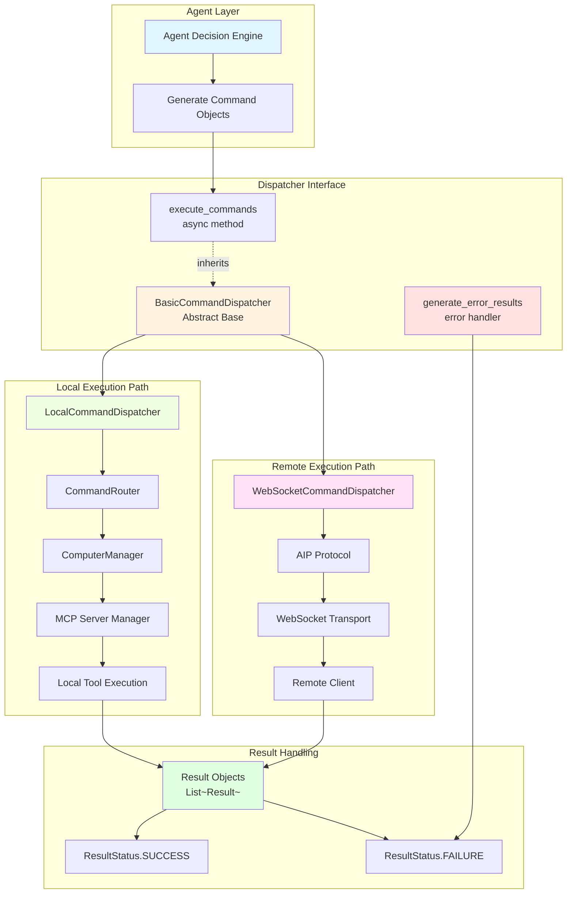
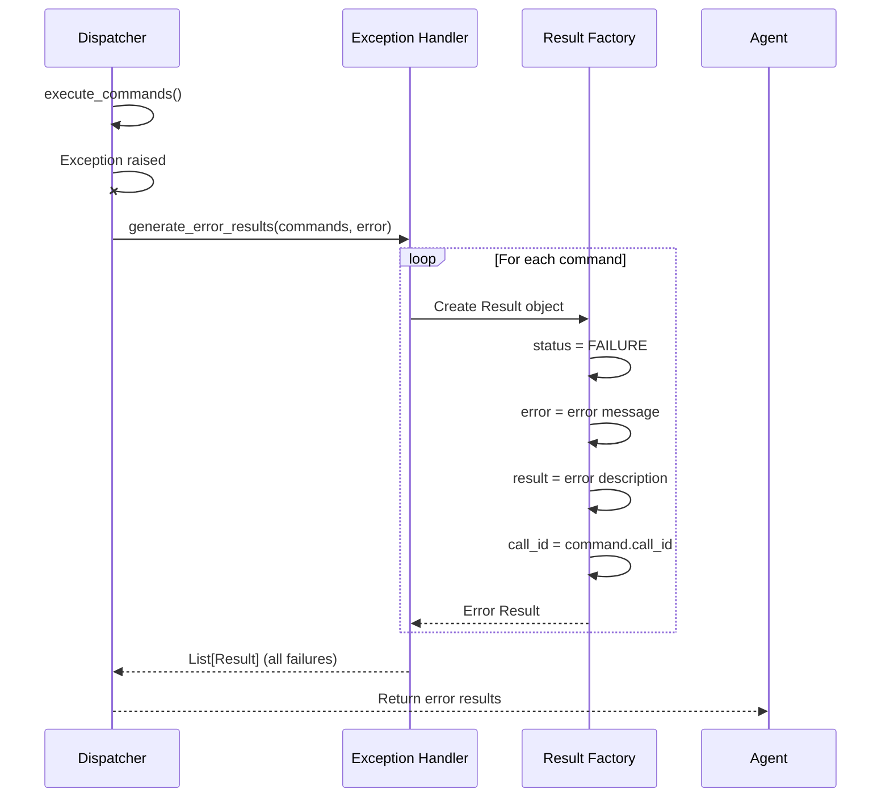
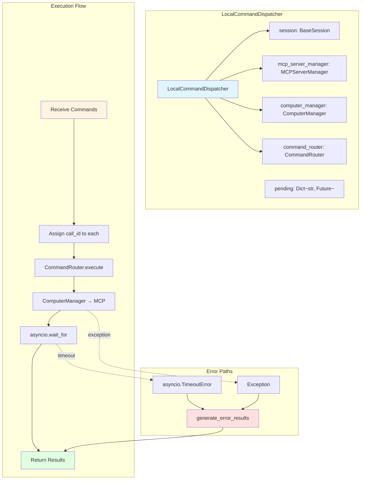
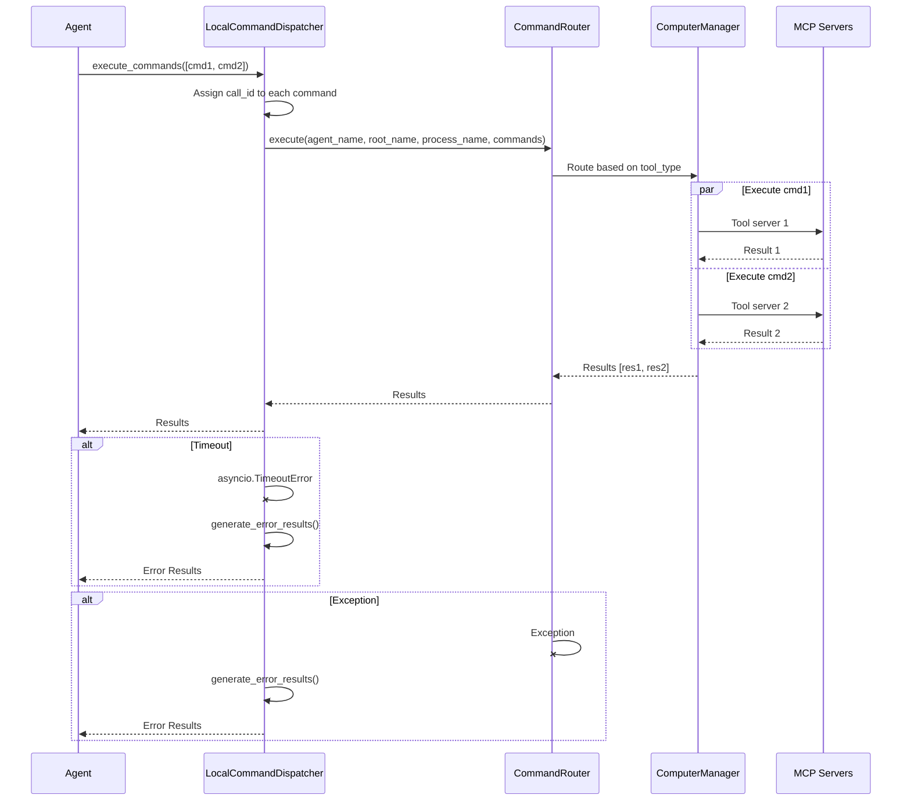
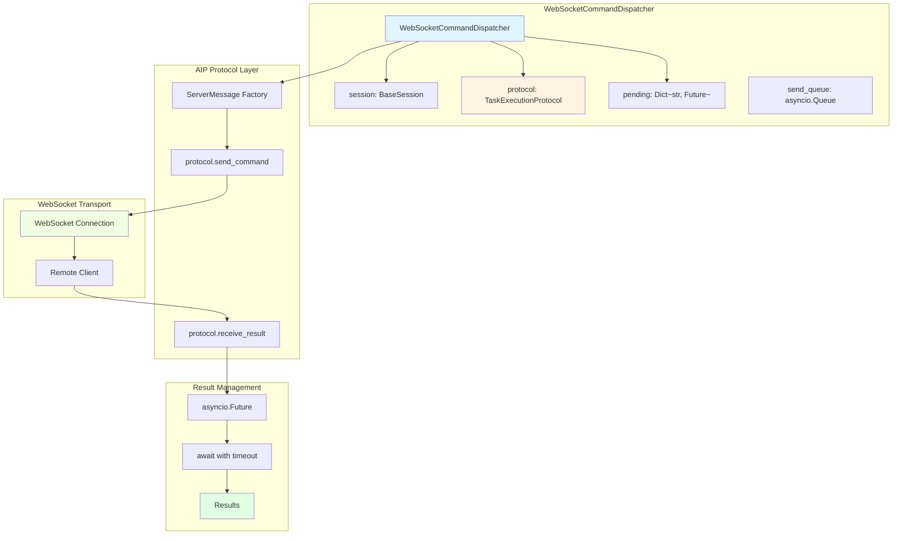
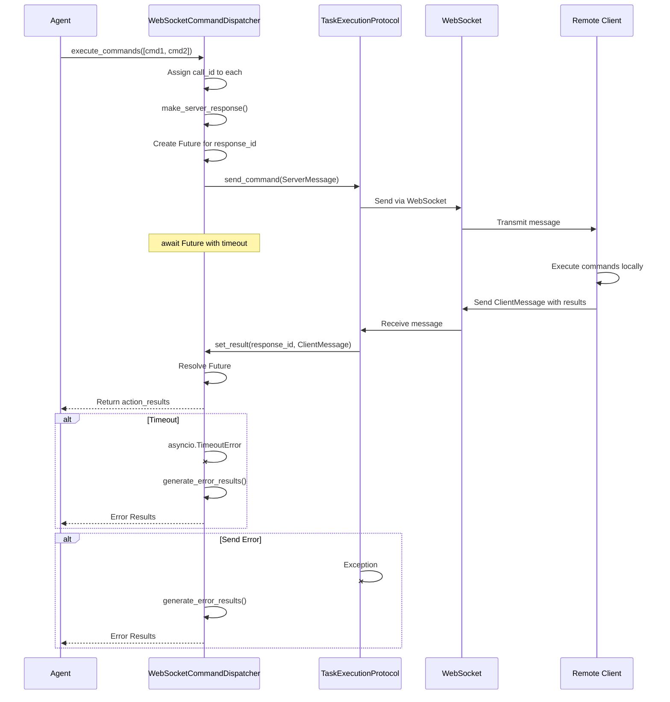
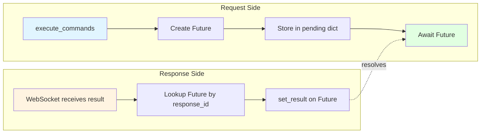
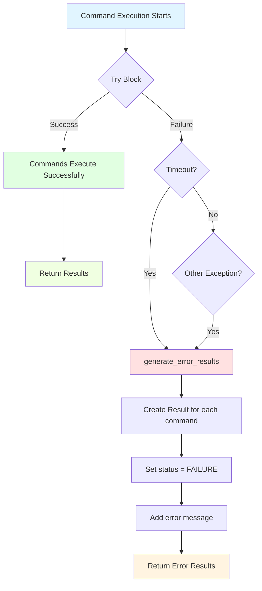

# Command Dispatcher

The **Command Dispatcher** is the bridge between agent decisions and actual execution, routing commands to the appropriate execution environment (local MCP tools or remote WebSocket clients) and managing result delivery with timeout and error handling.

**Quick Reference:**

- Local execution? Use [LocalCommandDispatcher](#localcommanddispatcher)
- Remote control? Use [WebSocketCommandDispatcher](#websocketcommanddispatcher)
- Error handling? See [Error Handling](#error-handling)
- Custom dispatcher? Extend [BasicCommandDispatcher](#basiccommanddispatcher-abstract-base)

---

## Architecture Overview

The dispatcher system implements the **Command Pattern** with async execution and comprehensive error handling:



---

## BasicCommandDispatcher (Abstract Base)

`BasicCommandDispatcher` defines the interface that all concrete dispatchers must implement.

### Core Methods

#### `execute_commands()` (Abstract)

```python
async def execute_commands(
    self, 
    commands: List[Command], 
    timeout: float = 6000
) -> Optional[List[Result]]
```

**Purpose**: Execute a list of commands and return results.

**Parameters:**

| Parameter | Type | Default | Description |
|-----------|------|---------|-------------|
| `commands` | `List[Command]` | Required | Commands to execute |
| `timeout` | `float` | `6000` | Timeout in seconds |

**Returns:**
- `List[Result]`: Results from command execution
- `None`: If execution timed out

!!!warning "Must Override"
    Concrete dispatchers **must** implement this method with platform-specific logic.

#### `generate_error_results()`

```python
def generate_error_results(
    self, 
    commands: List[Command], 
    error: Exception
) -> Optional[List[Result]]
```

**Purpose**: Convert exceptions into structured error Results.

**Error Handling Logic:**



**Generated Error Result:**

```python
Result(
    status=ResultStatus.FAILURE,
    error=f"Error occurred while executing command {command}: {error}",
    result=f"Error occurred while executing command {command}: {error}, "
           f"please retry or execute a different command.",
    call_id=command.call_id
)
```

!!!example "Error Result Structure"
    ```python
    from aip.messages import Result, ResultStatus
    
    # Example error result
    error_result = Result(
        status=ResultStatus.FAILURE,
        error="ConnectionRefusedError: [WinError 10061]",
        result="Error occurred while executing command click_element: "
               "ConnectionRefusedError, please retry or execute a different command.",
        call_id="cmd_12345"
    )
    
    # Check in agent code
    if result.status == ResultStatus.FAILURE:
        print(f"Action failed: {result.error}")
        # Agent can retry or use alternative approach
    ```

---

## LocalCommandDispatcher

`LocalCommandDispatcher` routes commands to local MCP tool servers for direct execution on the current machine. Used for interactive and standalone sessions.

### Architecture



### Initialization

```python
from ufo.module.dispatcher import LocalCommandDispatcher
from ufo.client.mcp.mcp_server_manager import MCPServerManager

def _init_context(self) -> None:
    """Initialize context with local dispatcher."""
    super()._init_context()
    
    # Create MCP server manager
    mcp_server_manager = MCPServerManager()
    
    # Create local dispatcher
    command_dispatcher = LocalCommandDispatcher(
        session=self,
        mcp_server_manager=mcp_server_manager
    )
    
    # Attach to context
    self.context.attach_command_dispatcher(command_dispatcher)
```

**Initialization Parameters:**

| Parameter | Type | Purpose |
|-----------|------|---------|
| `session` | `BaseSession` | Current session instance |
| `mcp_server_manager` | `MCPServerManager` | MCP server lifecycle manager |

**Internal Components Created:**

- `ComputerManager`: Manages computer-level operations
- `CommandRouter`: Routes commands to appropriate MCP tools

### Execution Flow



### Command Routing Context

The dispatcher provides execution context to the CommandRouter:

| Context | Source | Purpose |
|---------|--------|---------|
| `agent_name` | `session.current_agent_class` | Track which agent issued command |
| `root_name` | `context.APPLICATION_ROOT_NAME` | Application root for UI operations |
| `process_name` | `context.APPLICATION_PROCESS_NAME` | Process name for targeting |
| `commands` | Command list | Actions to execute |

!!!example "Local Execution Example"
    ```python
    from aip.messages import Command, ResultStatus
    
    # Commands for local execution
    commands = [
        Command(
            tool_name="click_element",
            parameters={"control_label": "1", "button": "left"},
            tool_type="windows",  # Routed to Windows MCP server
            call_id=""  # Will be auto-assigned
        ),
        Command(
            tool_name="type_text",
            parameters={"text": "Hello World"},
            tool_type="windows",
            call_id=""
        )
    ]
    
    # Execute locally
    results = await context.command_dispatcher.execute_commands(
        commands=commands,
        timeout=30.0
    )
    
    # Process results
    for i, result in enumerate(results):
        if result.status == ResultStatus.SUCCESS:
            print(f"Command {i+1} succeeded: {result.result}")
        else:
            print(f"Command {i+1} failed: {result.error}")
    ```

### Error Scenarios

| Error Type | Trigger | Handling | Result |
|------------|---------|----------|--------|
| **TimeoutError** | Execution exceeds `timeout` | `generate_error_results()` | Error Results with timeout message |
| **ConnectionError** | MCP server unreachable | `generate_error_results()` | Error Results with connection error |
| **ValidationError** | Invalid command parameters | `generate_error_results()` | Error Results with validation error |
| **RuntimeError** | Tool execution failure | `generate_error_results()` | Error Results with execution error |

!!!warning "Timeout Considerations"
    - Default timeout: **6000 seconds** (100 minutes)
    - For UI operations: Consider **30-60 seconds**
    - For network operations: May need longer timeouts
    - Always handle timeout gracefully in agent code

---

## WebSocketCommandDispatcher

`WebSocketCommandDispatcher` uses the AIP protocol to send commands to remote clients over WebSocket connections. Used for service sessions and remote control.

### Architecture



### Initialization

```python
from ufo.module.dispatcher import WebSocketCommandDispatcher
from aip.protocol.task_execution import TaskExecutionProtocol

def _init_context(self) -> None:
    """Initialize context with WebSocket dispatcher."""
    super()._init_context()
    
    # Create WebSocket dispatcher with AIP protocol
    command_dispatcher = WebSocketCommandDispatcher(
        session=self,
        protocol=self.task_protocol  # TaskExecutionProtocol instance
    )
    
    # Attach to context
    self.context.attach_command_dispatcher(command_dispatcher)
```

**Initialization Parameters:**

| Parameter | Type | Purpose |
|-----------|------|---------|
| `session` | `BaseSession` | Current service session |
| `protocol` | `TaskExecutionProtocol` | AIP protocol handler |

!!!danger "Protocol Required"
    WebSocketCommandDispatcher **requires** a `TaskExecutionProtocol` instance. It will raise `ValueError` if protocol is `None`.

### Message Construction

The dispatcher creates structured AIP ServerMessages:

```python
def make_server_response(self, commands: List[Command]) -> ServerMessage:
    """
    Create a server response message for the given commands.
    """
    # Assign unique IDs
    for command in commands:
        command.call_id = str(uuid.uuid4())
    
    # Extract context
    agent_name = self.session.current_agent_class
    process_name = self.session.context.get(ContextNames.APPLICATION_PROCESS_NAME)
    root_name = self.session.context.get(ContextNames.APPLICATION_ROOT_NAME)
    session_id = self.session.id
    response_id = str(uuid.uuid4())
    
    # Build AIP message
    return ServerMessage(
        type=ServerMessageType.COMMAND,
        status=TaskStatus.CONTINUE,
        agent_name=agent_name,
        process_name=process_name,
        root_name=root_name,
        actions=commands,
        session_id=session_id,
        task_name=self.session.task,
        timestamp=datetime.datetime.now(datetime.timezone.utc).isoformat(),
        response_id=response_id
    )
```

**ServerMessage Fields:**

| Field | Source | Purpose |
|-------|--------|---------|
| `type` | `ServerMessageType.COMMAND` | Indicates command message |
| `status` | `TaskStatus.CONTINUE` | Task in progress |
| `agent_name` | Current agent class | Track agent issuing command |
| `process_name` | Context | Target process |
| `root_name` | Context | Application root |
| `actions` | Command list | Commands to execute |
| `session_id` | Session ID | Session tracking |
| `task_name` | Session task | Task identification |
| `timestamp` | Current UTC time | Message timing |
| `response_id` | UUID | Correlate request/response |

### Execution Flow



### Result Handling

The `set_result()` method is called by the WebSocket handler when a client response arrives:

```python
async def set_result(self, response_id: str, result: ClientMessage) -> None:
    """
    Called by WebSocket handler when client returns a message.
    :param response_id: The ID of the response.
    :param result: The result from the client.
    """
    fut = self.pending.get(response_id)
    if fut and not fut.done():
        fut.set_result(result.action_results)
```

**Pending Future Management:**



!!!example "WebSocket Execution Example"
    ```python
    from aip.messages import Command
    
    # Session is ServiceSession with WebSocketCommandDispatcher
    commands = [
        Command(
            tool_name="capture_window_screenshot",
            parameters={},
            tool_type="data_collection"
        )
    ]
    
    # Execute remotely via WebSocket
    results = await context.command_dispatcher.execute_commands(
        commands=commands,
        timeout=60.0  # Screenshot may take time
    )
    
    # Results came from remote client
    if results:
        screenshot_base64 = results[0].result
        # Process screenshot...
    ```

### Error Scenarios

| Error Type | Trigger | Handling | Result |
|------------|---------|----------|--------|
| **TimeoutError** | Client doesn't respond in time | `generate_error_results()` | Error Results |
| **ProtocolError** | AIP protocol violation | `generate_error_results()` | Error Results |
| **ConnectionError** | WebSocket disconnected | `generate_error_results()` | Error Results |
| **ClientError** | Client reports execution failure | Return client's error Result | Propagate client error |

!!!warning "WebSocket-Specific Considerations"
    - **Network latency**: Add buffer to timeouts
    - **Client state**: Client may be busy with other tasks
    - **Connection loss**: Implement reconnection logic
    - **Message ordering**: AIP ensures ordered delivery

---

## Error Handling

All dispatchers convert exceptions into structured `Result` objects to maintain consistent error handling.

### Error Flow



### Error Result Format

```python
{
    "status": "failure",  # ResultStatus.FAILURE
    "error": "asyncio.TimeoutError: Command execution timed out",
    "result": "Error occurred while executing command <Command>: TimeoutError, "
              "please retry or execute a different command.",
    "call_id": "cmd_abc123"
}
```

### Agent Error Handling

Agents should handle error results appropriately:

```python
async def execute_action(self, context: Context) -> None:
    """Execute action with error handling."""
    commands = self.generate_commands()
    
    results = await context.command_dispatcher.execute_commands(
        commands=commands,
        timeout=30.0
    )
    
    for command, result in zip(commands, results):
        if result.status == ResultStatus.FAILURE:
            # Log error
            self.logger.error(f"Command {command.tool_name} failed: {result.error}")
            
            # Decision logic
            if "timeout" in result.error.lower():
                # Retry with longer timeout
                self.retry_count += 1
                if self.retry_count < 3:
                    return await self.execute_action(context)
            
            elif "connection" in result.error.lower():
                # Switch to alternative approach
                return self.fallback_strategy()
            
            else:
                # Escalate to error state
                self.transition_to_error_state(result.error)
        else:
            # Process successful result
            self.process_result(result.result)
```

!!!tip "Error Handling Best Practices"
    - ✅ Always check `result.status` before using `result.result`
    - ✅ Log errors with context (command, parameters, error message)
    - ✅ Implement retry logic for transient errors
    - ✅ Provide fallback strategies for permanent failures
    - ✅ Include helpful error messages for users
    - ❌ Don't ignore error results
    - ❌ Don't assume all commands succeed
    - ❌ Don't retry indefinitely without backoff

---

## Usage Patterns

### Pattern 1: Sequential Execution

Execute commands one at a time:

```python
for command in command_list:
    results = await context.command_dispatcher.execute_commands(
        commands=[command],
        timeout=30.0
    )
    
    if results[0].status == ResultStatus.SUCCESS:
        # Process result and decide next command
        next_command = self.decide_next_action(results[0])
    else:
        # Handle error and possibly abort
        break
```

### Pattern 2: Batch Execution

Execute multiple related commands together:

```python
# All commands for a subtask
commands = [
    Command(tool_name="click_element", ...),
    Command(tool_name="type_text", ...),
    Command(tool_name="press_key", ...)
]

results = await context.command_dispatcher.execute_commands(
    commands=commands,
    timeout=60.0
)

# Process all results
for command, result in zip(commands, results):
    if result.status == ResultStatus.FAILURE:
        # One failure might invalidate the whole subtask
        self.handle_subtask_failure(command, result)
```

### Pattern 3: Conditional Execution

Execute commands based on previous results:

```python
# Check state first
check_cmd = Command(tool_name="get_ui_tree", ...)
check_results = await dispatcher.execute_commands([check_cmd])

if check_results[0].status == ResultStatus.SUCCESS:
    ui_tree = check_results[0].result
    
    # Decide action based on UI state
    if "Login" in ui_tree:
        action_cmd = Command(tool_name="click_element", parameters={"label": "Login"})
    else:
        action_cmd = Command(tool_name="type_text", parameters={"text": "username"})
    
    # Execute decided action
    await dispatcher.execute_commands([action_cmd])
```

### Pattern 4: Retry with Backoff

Retry failed commands with exponential backoff:

```python
import asyncio

async def execute_with_retry(
    dispatcher, 
    commands, 
    max_retries=3, 
    base_delay=1.0
):
    """Execute commands with exponential backoff retry."""
    
    for attempt in range(max_retries):
        results = await dispatcher.execute_commands(commands, timeout=30.0)
        
        # Check if all succeeded
        all_success = all(r.status == ResultStatus.SUCCESS for r in results)
        
        if all_success:
            return results
        
        # Not last attempt - retry with backoff
        if attempt < max_retries - 1:
            delay = base_delay * (2 ** attempt)
            logger.warning(f"Retry attempt {attempt + 1} after {delay}s")
            await asyncio.sleep(delay)
    
    # All retries exhausted
    return results  # Return last attempt results
```

---

## Performance Considerations

### Timeout Configuration

Choose timeouts based on operation type:

| Operation Type | Recommended Timeout | Reason |
|----------------|---------------------|--------|
| **UI clicks** | 10-30s | Fast but may wait for animations |
| **Text input** | 5-15s | Usually fast |
| **Screenshots** | 30-60s | May need rendering time |
| **File operations** | 60-120s | I/O dependent |
| **Network calls** | 120-300s | Network latency + processing |
| **Batch operations** | Sum of individual + 20% | Account for overhead |

### Command Batching

**When to batch:**
- ✅ Related actions in same context (e.g., fill form fields)
- ✅ Commands with no dependencies between them
- ✅ All commands target same application

**When not to batch:**
- ❌ Commands with dependencies (need sequential execution)
- ❌ Mix of fast and slow operations (one timeout for all)
- ❌ Need intermediate results to decide next action

### Resource Management

```python
# Good: Reuse dispatcher attached to context
results1 = await context.command_dispatcher.execute_commands(commands1)
results2 = await context.command_dispatcher.execute_commands(commands2)

# Bad: Creating new dispatchers
dispatcher1 = LocalCommandDispatcher(session, mcp_manager)
dispatcher2 = LocalCommandDispatcher(session, mcp_manager)
```

---

## Advanced Topics

### Custom Dispatcher Implementation

Extend `BasicCommandDispatcher` for custom execution logic:

```python
from ufo.module.dispatcher import BasicCommandDispatcher
from aip.messages import Command, Result, ResultStatus
from typing import List, Optional

class CustomCommandDispatcher(BasicCommandDispatcher):
    """
    Custom dispatcher that logs all commands and results.
    """
    
    def __init__(self, session, log_file: str):
        self.session = session
        self.log_file = log_file
    
    async def execute_commands(
        self, 
        commands: List[Command], 
        timeout: float = 6000
    ) -> Optional[List[Result]]:
        """Execute with logging."""
        
        # Log commands
        with open(self.log_file, 'a') as f:
            f.write(f"Executing {len(commands)} commands\n")
            for cmd in commands:
                f.write(f"  {cmd.tool_name}: {cmd.parameters}\n")
        
        try:
            # Your custom execution logic here
            results = await self.custom_execute(commands, timeout)
            
            # Log results
            with open(self.log_file, 'a') as f:
                for result in results:
                    f.write(f"  Result: {result.status}\n")
            
            return results
            
        except Exception as e:
            # Log error
            with open(self.log_file, 'a') as f:
                f.write(f"  ERROR: {e}\n")
            
            return self.generate_error_results(commands, e)
    
    async def custom_execute(
        self, 
        commands: List[Command], 
        timeout: float
    ) -> List[Result]:
        """Implement custom execution logic."""
        # Your implementation here
        pass
```

### Dispatcher Selection Logic

Choose dispatcher based on session type:

```python
from ufo.module.dispatcher import LocalCommandDispatcher, WebSocketCommandDispatcher

def attach_appropriate_dispatcher(session, context):
    """Attach correct dispatcher based on session type."""
    
    if isinstance(session, ServiceSession):
        # Service session uses WebSocket
        dispatcher = WebSocketCommandDispatcher(
            session=session,
            protocol=session.task_protocol
        )
    else:
        # Interactive session uses local execution
        mcp_manager = MCPServerManager()
        dispatcher = LocalCommandDispatcher(
            session=session,
            mcp_server_manager=mcp_manager
        )
    
    context.attach_command_dispatcher(dispatcher)
```

---

## Troubleshooting

### Issue: Commands Timeout

**Symptoms:**
- Commands consistently timeout
- `asyncio.TimeoutError` in logs
- Error results with timeout messages

**Diagnosis:**
```python
# Check timeout value
results = await dispatcher.execute_commands(commands, timeout=30.0)

# Enable debug logging
logging.getLogger('ufo.module.dispatcher').setLevel(logging.DEBUG)
```

**Solutions:**
1. Increase timeout for slow operations
2. Check MCP server health (local dispatcher)
3. Verify WebSocket connection (WebSocket dispatcher)
4. Split batch into smaller groups

### Issue: Connection Errors

**Symptoms:**
- Connection refused errors
- WebSocket disconnection
- MCP server not responding

**Diagnosis:**
```python
# For LocalCommandDispatcher
# Check MCP server status
mcp_manager.check_server_health()

# For WebSocketCommandDispatcher
# Check WebSocket connection
if protocol.is_connected():
    print("WebSocket connected")
else:
    print("WebSocket disconnected")
```

**Solutions:**
1. Restart MCP servers
2. Reconnect WebSocket
3. Check firewall/network settings
4. Verify client is running

### Issue: Wrong Dispatcher Used

**Symptoms:**
- Commands routed incorrectly
- MCP tools called in service session
- WebSocket messages in local session

**Diagnosis:**
```python
# Check dispatcher type
print(type(context.command_dispatcher))
# Should be LocalCommandDispatcher or WebSocketCommandDispatcher

# Check session type
print(type(session))
```

**Solution:**
Ensure correct dispatcher initialization in session `_init_context()`.

---

## Reference

### BasicCommandDispatcher

::: module.dispatcher.BasicCommandDispatcher

### LocalCommandDispatcher

::: module.dispatcher.LocalCommandDispatcher

### WebSocketCommandDispatcher

::: module.dispatcher.WebSocketCommandDispatcher

---


## See Also

- [Context](./context.md) - State management and dispatcher attachment
- [Session](./session.md) - Session lifecycle and dispatcher initialization
- [AIP Protocol](../../aip/overview.md) - WebSocket message protocol
- [MCP Integration](../../mcp/overview.md) - Local tool execution

