# Module System Overview

The **Module System** is the core execution engine of UFO, orchestrating the complete lifecycle of user interactions from initial request to final completion. It manages sessions, rounds, context state, and command dispatch across both Windows and Linux platforms.

**Quick Navigation:**

- New to modules? Start with [Session](./session.md) and [Round](./round.md) basics
- Understanding state? See [Context](./context.md) management
- Command execution? Check [Dispatcher](./dispatcher.md) patterns

---

## Architecture Overview

The module system implements a **hierarchical execution model** with clear separation of concerns:


---

## Core Components

### 1. Session Management

A **Session** represents a complete conversation between the user and UFO, potentially spanning multiple requests and rounds.

**Session Hierarchy:**


**Session Types:**

| Session Type | Platform | Use Case | Communication |
|--------------|----------|----------|---------------|
| **Session** | Windows | Interactive mode | Local |
| **ServiceSession** | Windows | Server-controlled | WebSocket (AIP) |
| **LinuxSession** | Linux | Interactive mode | Local |
| **LinuxServiceSession** | Linux | Server-controlled | WebSocket (AIP) |
| **FollowerSession** | Windows | Plan execution | Local |
| **FromFileSession** | Windows | Batch processing | Local |
| **OpenAIOperatorSession** | Windows | Operator mode | Local |

!!!example "Session Creation"
    ```python
    from ufo.module.session_pool import SessionFactory
    
    # Create interactive Windows session
    factory = SessionFactory()
    sessions = factory.create_session(
        task="email_task",
        mode="normal",
        plan="",
        request="Open Outlook and send an email"
    )
    
    # Create Linux service session
    linux_session = factory.create_service_session(
        task="data_task",
        should_evaluate=True,
        id="session_001",
        request="Process CSV files",
        platform_override="linux"
    )
    ```

---

### 2. Round Execution

A **Round** handles a single user request by orchestrating agents through a state machine, executing actions until completion.

**Round Lifecycle:**


**Key Round Operations:**

| Operation | Purpose | Trigger |
|-----------|---------|---------|
| `agent.handle(context)` | Process current state | Each iteration |
| `state.next_state(agent)` | Determine next state | After handle |
| `state.next_agent(agent)` | Switch agent if needed | After state transition |
| `capture_last_snapshot()` | Save UI state | Subtask/Round end |
| `evaluation()` | Assess completion | Round end (if enabled) |

!!!warning "Round Termination Conditions"
    A round finishes when:
    - `state.is_round_end()` returns `True`
    - Session step exceeds `ufo_config.system.max_step`
    - Agent enters ERROR state

---

### 3. Context State Management

**Context** is a type-safe key-value store that maintains state across all rounds in a session.

**Context Architecture:**

```mermaid
graph LR
    subgraph "Context Storage"
        CN[ContextNames Enum]
        CV[Context Values Dict]
    end
    
    subgraph "Tracked Data"
        ID[Session/Round IDs]
        ST[Steps & Costs]
        LOG[Loggers]
        APP[Application State]
        CMD[Command Dispatcher]
    end
    
    subgraph "Access Patterns"
        GET[context.get(key)]
        SET[context.set(key, value)]
        UPD[context.update_dict(key, dict)]
    end
    
    CN -.defines.-> CV
    CV --> ID
    CV --> ST
    CV --> LOG
    CV --> APP
    CV --> CMD
    
    GET -.reads.-> CV
    SET -.writes.-> CV
    UPD -.merges.-> CV
    
    style CN fill:#e1f5ff
    style CV fill:#fff4e1
    style GET fill:#f0ffe1
    style SET fill:#ffe1f5
    style UPD fill:#f5e1ff
```

**Context Categories:**

| Category | Context Names | Type | Purpose |
|----------|---------------|------|---------|
| **Identifiers** | `ID`, `CURRENT_ROUND_ID` | `int` | Session/round tracking |
| **Execution State** | `SESSION_STEP`, `ROUND_STEP` | `int/dict` | Progress tracking |
| **Cost Tracking** | `SESSION_COST`, `ROUND_COST` | `float/dict` | LLM API costs |
| **Requests** | `REQUEST`, `SUBTASK`, `PREVIOUS_SUBTASKS` | `str/list` | Task information |
| **Application** | `APPLICATION_WINDOW`, `APPLICATION_PROCESS_NAME` | `UIAWrapper/str` | UI automation |
| **Logging** | `LOGGER`, `REQUEST_LOGGER`, `EVALUATION_LOGGER` | `FileWriter` | Log outputs |
| **Communication** | `HOST_MESSAGE`, `CONTROL_REANNOTATION` | `list` | Agent messages |
| **Infrastructure** | `command_dispatcher` | `BasicCommandDispatcher` | Command execution |

!!!example "Context Usage Patterns"
    ```python
    from ufo.module.context import Context, ContextNames
    
    # Initialize context
    context = Context()
    
    # Set values
    context.set(ContextNames.REQUEST, "Open Notepad")
    context.set(ContextNames.SESSION_STEP, 0)
    
    # Get values
    request = context.get(ContextNames.REQUEST)  # "Open Notepad"
    step = context.get(ContextNames.SESSION_STEP)  # 0
    
    # Update dictionaries (for round-specific tracking)
    round_costs = {1: 0.05, 2: 0.03}
    context.update_dict(ContextNames.ROUND_COST, round_costs)
    
    # Auto-sync current round values
    current_cost = context.current_round_cost  # Auto-synced
    ```

---

### 4. Command Dispatching

**Dispatchers** route commands to execution environments (local MCP tools or remote WebSocket clients) and handle result delivery.

**Dispatcher Architecture:**


**Dispatcher Comparison:**

| Dispatcher | Use Case | Communication | Error Handling | Timeout |
|------------|----------|---------------|----------------|---------|
| **LocalCommandDispatcher** | Interactive sessions | Direct MCP calls | Generates error Results | 6000s |
| **WebSocketCommandDispatcher** | Service sessions | AIP protocol messages | Generates error Results | 6000s |

!!!example "Command Dispatch Flow"
    ```python
    from aip.messages import Command
    
    # Create commands
    commands = [
        Command(
            tool_name="click_element",
            parameters={"control_label": "1", "button": "left"},
            tool_type="windows"
        )
    ]
    
    # Execute via dispatcher (attached to context)
    results = await context.command_dispatcher.execute_commands(
        commands=commands,
        timeout=30.0
    )
    
    # Process results
    for result in results:
        if result.status == ResultStatus.SUCCESS:
            print(f"Action succeeded: {result.result}")
        else:
            print(f"Action failed: {result.error}")
    ```

---

### 5. User Interaction

**Interactor** provides rich CLI experiences for user input with styled prompts, panels, and confirmations.

**Interaction Flows:**

```mermaid
sequenceDiagram
    participant U as User
    participant I as Interactor
    participant S as Session
    participant R as Round
    
    U->>I: Start UFO
    I->>I: first_request()
    I-->>U: 🛸 Welcome Panel
    U->>I: "Open Notepad"
    I->>S: Initial request
    
    S->>R: Create Round 1
    R->>R: Execute...
    R-->>S: Round complete
    
    S->>I: new_request()
    I-->>U: 🛸 Next Request Panel
    U->>I: "Type hello"
    I->>S: Next request
    
    S->>R: Create Round 2
    R->>R: Execute...
    R-->>S: Round complete
    
    S->>I: new_request()
    I-->>U: 🛸 Next Request Panel
    U->>I: "N"
    I-->>U: 👋 Goodbye Panel
    I->>S: complete=True
    S->>S: Terminate
    
    S->>I: experience_asker()
    I-->>U: 💾 Save Experience Panel
    U->>I: Yes
    I->>S: Save experience
```



**Interactor Functions:**

| Function | Purpose | Returns | Example UI |
|----------|---------|---------|-----------|
| `first_request()` | Initial request prompt | `str` | 🛸 Welcome Panel with examples |
| `new_request()` | Subsequent requests | `Tuple[str, bool]` | 🛸 Next Request Panel |
| `experience_asker()` | Save experience prompt | `bool` | 💾 Learning & Memory Panel |
| `question_asker()` | Collect information | `str` | 🤔 Numbered Question Panel |
| `sensitive_step_asker()` | Security confirmation | `bool` | 🔒 Security Check Panel |

!!!example "Styled User Prompts"
    ```python
    from ufo.module import interactor
    
    # First interaction with rich welcome
    request = interactor.first_request()
    # Shows:
    # ┏━━━━━━━━━━━━━━━━━━━━━━━━━━━━━━━━━━━━━━━┓
    # ┃ 🛸 UFO Assistant                      ┃
    # ┃ 🚀 Welcome to UFO - Your AI Assistant ┃
    # ┃ ...examples...                        ┃
    # ┗━━━━━━━━━━━━━━━━━━━━━━━━━━━━━━━━━━━━━━━┛
    
    # Get next request
    request, complete = interactor.new_request()
    if complete:
        print("User exited")
    
    # Ask for permission on sensitive actions
    proceed = interactor.sensitive_step_asker(
        action="Delete file",
        control_text="important.docx"
    )
    if not proceed:
        print("Action cancelled by user")
    ```

---

### 6. Session Factory & Pool

**SessionFactory** creates platform-specific sessions based on mode and configuration, while **SessionPool** manages batch execution.

**Factory Creation Logic:**


**Session Modes:**

| Mode | Platform | Description | Input | Evaluation |
|------|----------|-------------|-------|------------|
| **normal** | Both | Interactive single-task | User input | Optional |
| **service** | Both | WebSocket-controlled | Remote request | Optional |
| **follower** | Windows | Replay recorded plan | Plan JSON file | Optional |
| **batch_normal** | Windows | Multiple tasks from files | JSON folder | Per-task |
| **operator** | Windows | OpenAI Operator API | User input | Optional |
| **normal_operator** | Both | Interactive with operator | User input | Optional |

!!!example "SessionFactory Usage"
    ```python
    from ufo.module.session_pool import SessionFactory, SessionPool
    
    factory = SessionFactory()
    
    # Interactive Windows session
    sessions = factory.create_session(
        task="task1",
        mode="normal",
        plan="",
        request="Open calculator"
    )
    
    # Batch Windows sessions from folder
    batch_sessions = factory.create_session(
        task="batch_task",
        mode="batch_normal",
        plan="./plans/",  # Folder with multiple .json files
        request=""
    )
    
    # Run all sessions
    pool = SessionPool(batch_sessions)
    await pool.run_all()
    ```

---

## Cross-Platform Support

The module system provides a unified API while allowing platform-specific behavior through inheritance.

**Platform Differences:**

| Aspect | Windows | Linux |
|--------|---------|-------|
| **Agent Architecture** | HostAgent → AppAgent (two-tier) | LinuxAgent (single-tier) |
| **HostAgent** | ✅ Used for planning | ❌ Not used |
| **Session Base** | `WindowsBaseSession` | `LinuxBaseSession` |
| **UI Automation** | UIA (pywinauto) | Custom automation |
| **Service Mode** | `ServiceSession` | `LinuxServiceSession` |
| **Evaluation** | ✅ Full support | ⚠️ Limited |
| **Markdown Logs** | ✅ Supported | ⚠️ Planned |

!!!example "Platform Detection"
    ```python
    import platform
    
    # Auto-detect platform
    current_platform = platform.system().lower()  # 'windows' or 'linux'
    
    # Override platform
    sessions = factory.create_session(
        task="cross_platform_task",
        mode="normal",
        plan="",
        request="List files",
        platform_override="linux"  # Force Linux session
    )
    ```

---

## Execution Flow

Understanding how components interact during a complete user request:


---

## File Structure

```
ufo/module/
├── __init__.py
├── basic.py                    # BaseSession, BaseRound, FileWriter
├── context.py                  # Context, ContextNames
├── dispatcher.py               # Command dispatchers
├── interactor.py               # User interaction functions
├── session_pool.py             # SessionFactory, SessionPool
└── sessions/
    ├── __init__.py
    ├── platform_session.py     # WindowsBaseSession, LinuxBaseSession
    ├── session.py              # Session, FollowerSession, FromFileSession
    ├── service_session.py      # ServiceSession
    ├── linux_session.py        # LinuxSession, LinuxServiceSession
    └── plan_reader.py          # PlanReader for follower mode
```

---

## Key Design Patterns

### 1. State Pattern

Agents use the State pattern to manage transitions and determine control flow.

```python
# Agent state determines:
next_state = agent.state.next_state(agent)
next_agent = agent.state.next_agent(agent)
is_done = agent.state.is_round_end()
```

### 2. Factory Pattern

SessionFactory creates appropriate session types based on platform and mode.

### 3. Command Pattern

Commands encapsulate actions with parameters, enabling async execution and result tracking.

### 4. Observer Pattern

Context changes notify dependent components (implicit through shared state).

---

## Best Practices

!!!tip "Session Management"
    - ✅ Always initialize context before creating rounds
    - ✅ Use `SessionFactory` for session creation (handles platform differences)
    - ✅ Attach command dispatcher to context early
    - ✅ Call `context._sync_round_values()` before accessing round-specific data
    - ❌ Don't access round context before round initialization

!!!tip "Round Execution"
    - ✅ Let the state machine control agent transitions
    - ✅ Capture snapshots at subtask boundaries
    - ✅ Check `is_finished()` before each iteration
    - ❌ Don't bypass state transitions
    - ❌ Don't manually manipulate agent states

!!!tip "Context Usage"
    - ✅ Use `ContextNames` enum for type-safe access
    - ✅ Update dictionaries with `update_dict()` for merging
    - ✅ Use properties (`current_round_cost`) for auto-synced values
    - ❌ Don't directly access `_context` dictionary
    - ❌ Don't store non-serializable objects without marking them

!!!tip "Command Dispatch"
    - ✅ Always await `execute_commands()` (async)
    - ✅ Handle timeout exceptions gracefully
    - ✅ Check `ResultStatus` before using results
    - ❌ Don't ignore error results
    - ❌ Don't assume commands succeed

---

## Configuration

Key configuration options from `ufo_config`:

| Setting | Location | Default | Purpose |
|---------|----------|---------|---------|
| `max_step` | `system.max_step` | 50 | Max steps per session |
| `max_round` | `system.max_round` | 10 | Max rounds per session |
| `eva_session` | `system.eva_session` | `True` | Evaluate session |
| `eva_round` | `system.eva_round` | `False` | Evaluate each round |
| `save_experience` | `system.save_experience` | `"ask"` | When to save experience |
| `log_to_markdown` | `system.log_to_markdown` | `True` | Generate markdown logs |
| `save_ui_tree` | `system.save_ui_tree` | `True` | Save UI tree snapshots |

---

## Documentation Index

| Document | Description |
|----------|-------------|
| [Session](./session.md) | Session lifecycle and management |
| [Round](./round.md) | Round execution and orchestration |
| [Context](./context.md) | State management and context names |
| [Dispatcher](./dispatcher.md) | Command routing and execution |
| [Session Pool](./session_pool.md) | Factory and batch management |
| [Platform Sessions](./platform_sessions.md) | Windows/Linux implementations |

---

## Next Steps

**Learning Path:**

1. **Understand Sessions**: Read [Session](./session.md) to grasp the conversation model
2. **Learn Rounds**: Study [Round](./round.md) to understand action execution
3. **Master Context**: Review [Context](./context.md) for state management
4. **Explore Dispatch**: Check [Dispatcher](./dispatcher.md) for command execution
5. **Platform Specifics**: See [Platform Sessions](./platform_sessions.md) for Windows/Linux differences
