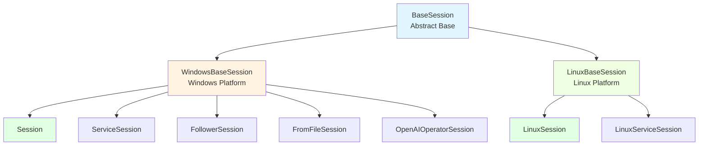
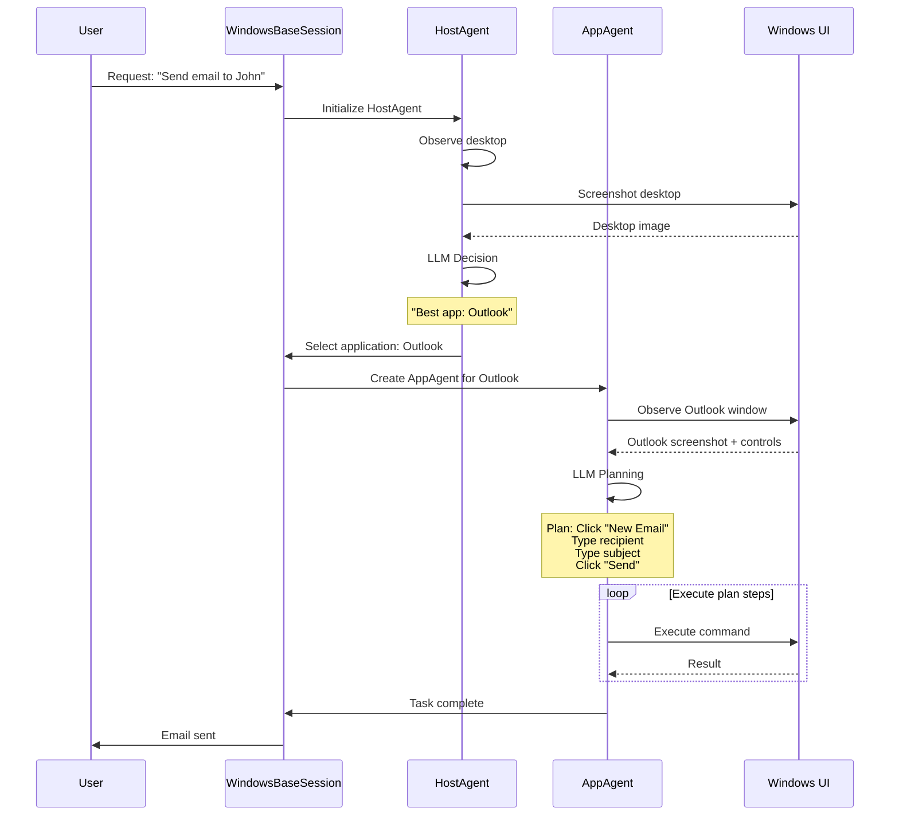
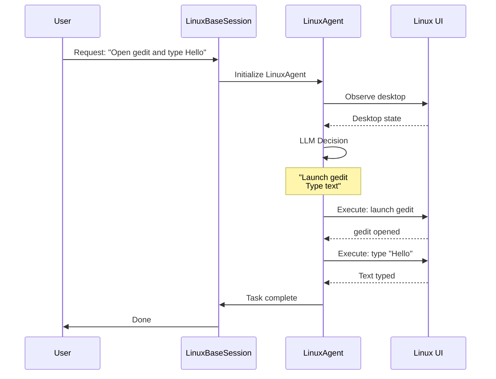
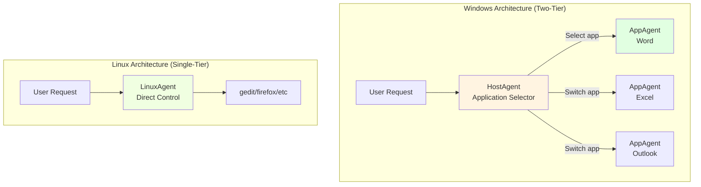

# Platform-Specific Sessions

**WindowsBaseSession** and **LinuxBaseSession** provide platform-specific base classes with fundamentally different agent architectures: Windows uses two-tier (HostAgent + AppAgent), while Linux uses single-tier (LinuxAgent only).

**Quick Reference:**

- Windows sessions? See [WindowsBaseSession](#windowsbasesession)
- Linux sessions? See [LinuxBaseSession](#linuxbasesession)
- Differences? See [Architecture Comparison](#architecture-comparison)
- Choosing platform? See [Platform Selection](#platform-selection)

---

## Overview

Platform-specific base classes abstract OS-level differences:

- **WindowsBaseSession**: Two-tier agent architecture with HostAgent coordination
- **LinuxBaseSession**: Single-tier architecture with direct LinuxAgent control

### Inheritance Hierarchy



---

## WindowsBaseSession

Windows sessions use **HostAgent** for application selection and task planning, then **AppAgent** for in-application execution. This provides a two-tier agent architecture.

### Agent Initialization

```python
def _init_agents(self) -> None:
    """Initialize Windows-specific agents, including the HostAgent."""
    
    self._host_agent: HostAgent = AgentFactory.create_agent(
        "host",
        "HostAgent",
        ufo_config.host_agent.visual_mode,
        ufo_config.system.HOSTAGENT_PROMPT,
        ufo_config.system.HOSTAGENT_EXAMPLE_PROMPT,
        ufo_config.system.API_PROMPT,
    )
```

**What's Created:**

| Component | Type | Purpose |
|-----------|------|---------|
| `_host_agent` | `HostAgent` | Application selection and task coordination |
| Visual Mode | `bool` | Enable screenshot-based reasoning |
| Prompts | `str` | HostAgent behavior templates |

### Two-Tier Execution Flow



### Agent Switching Logic

**HostAgent selects applications:**

```python
# HostAgent decision
selected_app = host_agent.handle(context)
# Result: "Outlook"

# Session switches to AppAgent
app_agent = create_app_agent("Outlook")
context.set(ContextNames.APPLICATION_PROCESS_NAME, "OUTLOOK.EXE")
```

**AppAgent may request HostAgent:**

```python
# AppAgent realizes need different app
if need_different_app:
    # Switch back to HostAgent
    agent = host_agent
    # HostAgent selects new app
```

### Reset Behavior

```python
def reset(self):
    """Reset the session state for a new session."""
    self._host_agent.set_state(self._host_agent.default_state)
```

**Reset restores:**
- HostAgent to initial state
- Clears previous application selections
- Ready for new task

---

## LinuxBaseSession

Linux sessions use **LinuxAgent** directly without HostAgent intermediary, providing simpler but less flexible architecture. This is a single-tier model.

### Agent Initialization

```python
def _init_agents(self) -> None:
    """Initialize Linux-specific agents."""
    
    # No host agent for Linux
    self._host_agent = None
    
    # Create LinuxAgent directly
    self._agent: LinuxAgent = AgentFactory.create_agent(
        "LinuxAgent",
        "LinuxAgent",
        ufo_config.system.third_party_agent_config["LinuxAgent"]["APPAGENT_PROMPT"],
        ufo_config.system.third_party_agent_config["LinuxAgent"]["APPAGENT_EXAMPLE_PROMPT"],
    )
```

**What's Created:**

| Component | Type | Purpose |
|-----------|------|---------|
| `_host_agent` | `None` | **Not used in Linux** |
| `_agent` | `LinuxAgent` | Direct application control |
| Prompts | `str` | LinuxAgent behavior templates |

### Single-Tier Execution Flow



**No Agent Switching:**

- LinuxAgent handles entire workflow
- Application specified upfront or agent decides
- Simpler execution model

### Feature Limitations

Some methods are not yet implemented:

```python
def evaluation(self) -> None:
    """Evaluation logic for Linux sessions."""
    self.logger.warning("Evaluation not yet implemented for Linux sessions.")
    pass

def save_log_to_markdown(self) -> None:
    """Save the log of the session to markdown file."""
    self.logger.warning("Markdown logging not yet implemented for Linux sessions.")
    pass
```

!!!warning "Coming Soon"
    Full evaluation and markdown logging support for Linux sessions is planned for future releases.

### Reset Behavior

```python
def reset(self) -> None:
    """Reset the session state for a new session."""
    self._agent.set_state(self._agent.default_state)
```

**Reset restores:**
- LinuxAgent to initial state
- Ready for new task

---

## Architecture Comparison

### High-Level Differences



### Feature Matrix

| Feature | Windows | Linux | Notes |
|---------|---------|-------|-------|
| **HostAgent** | ✅ Yes | ❌ No | Windows uses HostAgent for app selection |
| **AppAgent** | ✅ Yes | ❌ No | Windows creates AppAgent per application |
| **LinuxAgent** | ❌ No | ✅ Yes | Linux uses LinuxAgent directly |
| **Agent Switching** | ✅ Yes | ❌ No | Windows can switch between apps mid-task |
| **Multi-App Tasks** | ✅ Native | ⚠️ Limited | Windows handles multi-app naturally |
| **Execution Modes** | ✅ All 7 | ⚠️ 3 modes | Windows supports all modes |
| **Evaluation** | ✅ Yes | 🚧 Planned | Linux evaluation in development |
| **Markdown Logs** | ✅ Yes | 🚧 Planned | Linux markdown logging in development |
| **UI Automation** | UIA | Platform tools | Different automation backends |

### Execution Comparison

**Windows Multi-Application Task:**

```python
# Request: "Copy data from Excel to Word"

# Round 1
HostAgent: Select Excel → AppAgent(Excel): Copy data
# Round 2  
HostAgent: Select Word → AppAgent(Word): Paste data

# Agent switching handled automatically
```

**Linux Single-Application Task:**

```python
# Request: "Open gedit and type text"

# Single round
LinuxAgent: Launch gedit → Type text

# No agent switching, direct execution
```

---

## Platform Selection

### Automatic Detection

SessionFactory automatically detects platform:

```python
from ufo.module.session_pool import SessionFactory
import platform

factory = SessionFactory()

# Auto-detects: "windows" or "linux"
sessions = factory.create_session(
    task="cross_platform_task",
    mode="normal",
    plan="",
    request="Open text editor"
)

# Correct base class automatically selected:
# - Windows: Session extends WindowsBaseSession
# - Linux: LinuxSession extends LinuxBaseSession
```

### Manual Override

For testing or special cases:

```python
# Force Windows session on Linux machine
sessions = factory.create_session(
    task="test_task",
    mode="normal",
    plan="",
    request="Test request",
    platform_override="windows"
)

# Force Linux session on Windows machine
sessions = factory.create_session(
    task="test_task",
    mode="normal",
    plan="",
    request="Test request",
    platform_override="linux"
)
```

!!!warning "Override Use Cases"
    Only use `platform_override` for:
    - Testing cross-platform code
    - Development without target OS
    - Generating plans for other platforms
    
    Never use in production!

---

## Migration Guide

### Porting Tasks Windows → Linux

**Considerations:**

1. **No HostAgent**: Specify application upfront or in request
2. **Single-tier**: Cannot switch applications mid-task
3. **Limited modes**: Only `normal`, `normal_operator`, `service`

**Example:**

**Windows Request:**
```python
"Send an email to John and create a calendar event"
# HostAgent selects Outlook → AppAgent sends email
# HostAgent switches to Calendar → AppAgent creates event
```

**Linux Request (Split):**
```python
# Request 1: Email only
"Send an email to John using Thunderbird"
# LinuxAgent(Thunderbird): Send email

# Request 2: Calendar separately
"Create a calendar event in GNOME Calendar"
# LinuxAgent(Calendar): Create event
```

### Configuration Differences

**Windows Configuration:**

```yaml
# config/ufo/config.yaml
host_agent:
  visual_mode: true
system:
  HOSTAGENT_PROMPT: "prompts/host_agent.yaml"
  APPAGENT_PROMPT: "prompts/app_agent.yaml"
```

**Linux Configuration:**

```yaml
# config/ufo/config.yaml  
system:
  third_party_agent_config:
    LinuxAgent:
      APPAGENT_PROMPT: "prompts/linux_agent.yaml"
      APPAGENT_EXAMPLE_PROMPT: "prompts/linux_examples.yaml"
```

---

## Best Practices

### Windows Sessions

!!!tip "Leverage Two-Tier Architecture"
    - ✅ Use HostAgent for complex multi-app workflows
    - ✅ Let HostAgent decide application selection
    - ✅ Design tasks that benefit from app switching
    - ❌ Don't micromanage app selection
    - ❌ Don't bypass HostAgent for multi-app tasks

### Linux Sessions

!!!success "Work Within Single-Tier Model"
    - ✅ Specify application in request if known
    - ✅ Keep tasks focused on single application
    - ✅ Split multi-app workflows into multiple sessions
    - ❌ Don't expect automatic app switching
    - ❌ Don't assume HostAgent features available

### Cross-Platform Development

!!!warning "Platform Awareness"
    - ✅ Test on both platforms if deploying cross-platform
    - ✅ Use platform detection, not hardcoded assumptions
    - ✅ Handle platform-specific features gracefully
    - ✅ Document platform limitations
    - ❌ Don't assume identical behavior
    - ❌ Don't use platform_override in production

---

## Reference

### WindowsBaseSession

::: module.sessions.platform_session.WindowsBaseSession

### LinuxBaseSession

::: module.sessions.platform_session.LinuxBaseSession

---

## See Also

- [Session](./session.md) - Session lifecycle and types
- [Session Factory](./session_pool.md) - Platform-aware session creation
- [Overview](./overview.md) - Module system architecture
- [Round](./round.md) - Agent orchestration in rounds
