# Round

A **Round** is a single request-response cycle within a Session, orchestrating agents through a state machine to execute commands until the user's request is fulfilled.

**Quick Reference:**

- Lifecycle? See [Round Lifecycle](#round-lifecycle)
- State machine? See [State Machine](#state-machine)
- Agent switching? See [Agent Orchestration](#agent-orchestration)
- Snapshots? See [Snapshot Capture](#snapshot-capture)

---

## Overview

A `Round` represents one complete request-response interaction:

- **Input**: User request (e.g., "Send an email to John")
- **Processing**: Agent state machine execution
- **Output**: Request fulfilled or error state

### Round in Context


---

## Round Lifecycle

### State Machine Overview


### Core Execution Loop

```python
async def run(self) -> None:
    """
    Run the round asynchronously.
    """
    
    while not self.is_finished():
        # 1. Agent processes current state
        await self.agent.handle(self.context)
        
        # 2. State machine transitions
        self.state = self.agent.state.next_state(self.agent)
        
        # 3. Agent switching (HostAgent ↔ AppAgent)
        self.agent = self.agent.state.next_agent(self.agent)
        self.agent.set_state(self.state)
        
        # 4. Snapshot capture at subtask boundaries
        if self.state.is_subtask_end():
            time.sleep(configs["SLEEP_TIME"])
            await self.capture_last_snapshot(sub_round_id=self.subtask_amount)
            self.subtask_amount += 1
    
    # 5. Add request to blackboard
    self.agent.blackboard.add_requests(
        {f"request_{self.id}": self.request}
    )
    
    # 6. Final snapshot
    if self.application_window is not None:
        await self.capture_last_snapshot()
    
    # 7. Evaluation (optional)
    if self._should_evaluate:
        await self.evaluation()
```

---

## Lifecycle Stages

### 1. Initialization

Created by session's `create_new_round()`:

```python
round = Round(
    task="email_task",
    context=session.context,
    request="Send an email to John",
    id=0  # Round number
)
```

**Initialization sets:**

| Property | Source | Description |
|----------|--------|-------------|
| `task` | Session | Task name for logging |
| `context` | Session | Shared context object |
| `request` | User input | Natural language request |
| `id` | Round counter | Sequential round number |
| `agent` | Initial agent | Usually HostAgent (Windows) or LinuxAgent |
| `state` | Initial state | Usually START state |

### 2. Agent Handle

Each loop iteration calls `agent.handle(context)`:

```python
await self.agent.handle(self.context)
```

**What happens:**

1. **Observation**: Agent observes UI state
2. **Reasoning**: LLM generates plan and actions
3. **Action**: Commands sent to dispatcher
4. **Execution**: Commands executed locally or remotely
5. **Results**: Results stored in context

**Example Flow:**


### 3. State Transition

After agent handling, state machine transitions:

```python
self.state = self.agent.state.next_state(self.agent)
```

**State Transitions:**

| Current State | Condition | Next State |
|---------------|-----------|------------|
| **START** | Initial | **CONTINUE** |
| **CONTINUE** | More actions needed | **CONTINUE** |
| **CONTINUE** | Task complete | **FINISH** |
| **CONTINUE** | Error occurred | **ERROR** |
| **FINISH** | Always | Round ends |
| **ERROR** | Always | Round ends |

**State Diagram:**


### 4. Agent Switching

Determine which agent handles next step:

```python
self.agent = self.agent.state.next_agent(self.agent)
self.agent.set_state(self.state)
```

**Agent Switching Logic (Windows):**

| Current Agent | Condition | Next Agent |
|---------------|-----------|------------|
| **HostAgent** | Application selected | **AppAgent** |
| **AppAgent** | Need different app | **HostAgent** |
| **AppAgent** | Same app continues | **AppAgent** |
| **HostAgent** | Task complete | **HostAgent** (finish) |

**Agent Switching Logic (Linux):**

| Current Agent | Condition | Next Agent |
|---------------|-----------|------------|
| **LinuxAgent** | Always | **LinuxAgent** (no switching) |

**Switching Example:**

```mermaid
sequenceDiagram
    participant R as Round
    participant H as HostAgent
    participant A as AppAgent
    
    R->>H: handle() - Select app
    H-->>R: Application: Outlook
    
    Note over R: Agent switch: HostAgent → AppAgent
    
    R->>A: handle() - Compose email
    A-->>R: Commands executed
    
    R->>A: handle() - Send email
    A-->>R: Task complete
    
    Note over R: State: FINISH
```



### 5. Subtask Boundary Capture

Capture snapshot when subtask ends:

```python
if self.state.is_subtask_end():
    time.sleep(configs["SLEEP_TIME"])  # Let UI settle
    await self.capture_last_snapshot(sub_round_id=self.subtask_amount)
    self.subtask_amount += 1
```

**Subtask End Conditions:**

- Agent switched (HostAgent ↔ AppAgent)
- Major UI change detected
- Explicit subtask boundary in plan

**Captured Data:**

1. **Window screenshot**: `action_round_{id}_sub_round_{sub_id}_final.png`
2. **UI tree** (if enabled): `ui_tree_round_{id}_sub_round_{sub_id}_final.json`
3. **Desktop screenshot** (if enabled): `desktop_round_{id}_sub_round_{sub_id}_final.png`

### 6. Finish Check

```python
def is_finished(self) -> bool:
    """Check if round is complete."""
    return self.state in [AgentState.FINISH, AgentState.ERROR]
```

Loop continues until state is `FINISH` or `ERROR`.

### 7. Final Snapshot

After loop exits:

```python
if self.application_window is not None:
    await self.capture_last_snapshot()
```

**Final snapshot** captures the end state of the application for logging and evaluation.

### 8. Evaluation

Optional evaluation of round success:

```python
if self._should_evaluate:
    await self.evaluation()
```

**Evaluation checks:**
- Was the request fulfilled?
- Quality of actions taken
- Efficiency metrics

---

## State Machine

### AgentState Enum

```python
class AgentState(Enum):
    START = "START"
    CONTINUE = "CONTINUE"
    FINISH = "FINISH"
    ERROR = "ERROR"
```

### State Behaviors

| State | Meaning | Transitions To |
|-------|---------|----------------|
| **START** | Initial state | CONTINUE |
| **CONTINUE** | Actively processing | CONTINUE, FINISH, ERROR |
| **FINISH** | Successfully complete | Round ends |
| **ERROR** | Fatal error occurred | Round ends |

### State Methods

Each state implements:

```python
class StateInterface:
    def next_state(self, agent) -> AgentState:
        """Determine next state based on agent's decision."""
        pass
    
    def next_agent(self, agent) -> Agent:
        """Determine next agent to handle the request."""
        pass
    
    def is_subtask_end(self) -> bool:
        """Check if current state marks subtask boundary."""
        pass
```

---

## Agent Orchestration

### Windows Two-Tier Architecture


### Linux Single-Tier Architecture


---

## Snapshot Capture

### capture_last_snapshot()

```python
async def capture_last_snapshot(self, sub_round_id: Optional[int] = None) -> None
```

**Purpose**: Capture UI state for logging, debugging, and evaluation.

**Captured Artifacts:**

| Artifact | File Pattern | Purpose |
|----------|--------------|---------|
| **Window Screenshot** | `action_round_{id}_final.png` | Visual state |
| **Subtask Screenshot** | `action_round_{id}_sub_round_{sub_id}_final.png` | Subtask boundary |
| **UI Tree** | `ui_tree_round_{id}_final.json` | Control structure |
| **Desktop Screenshot** | `desktop_round_{id}_final.png` | Full desktop (if enabled) |

**Example Output:**

```
logs/task_name/
├── action_round_0_sub_round_0_final.png  ← After HostAgent selects Outlook
├── action_round_0_sub_round_1_final.png  ← After AppAgent composes email
├── action_round_0_final.png               ← Final state after sending
├── ui_trees/
│   ├── ui_tree_round_0_sub_round_0_final.json
│   ├── ui_tree_round_0_sub_round_1_final.json
│   └── ui_tree_round_0_final.json
└── desktop_round_0_final.png
```

### save_ui_tree()

```python
async def save_ui_tree(self, save_path: str)
```

Saves the control tree as JSON for analysis:

```json
{
  "root": {
    "control_type": "Window",
    "name": "Outlook",
    "children": [
      {
        "control_type": "Button",
        "name": "New Email",
        "automation_id": "btn_new_email",
        "bounding_box": [100, 50, 150, 30]
      }
    ]
  }
}
```

---

## Properties

### Auto-Syncing Properties

Properties that sync with context automatically:

```python
@property
def step(self) -> int:
    """Current step number in this round."""
    return self._context.get(ContextNames.ROUND_STEP).get(self.id, 0)

@property
def cost(self) -> float:
    """Total cost for this round."""
    return self._context.get(ContextNames.ROUND_COST).get(self.id, 0)

@property
def subtask_amount(self) -> int:
    """Number of subtasks completed."""
    return self._context.get(ContextNames.ROUND_SUBTASK_AMOUNT).get(self.id, 0)

@subtask_amount.setter
def subtask_amount(self, value: int) -> None:
    """Set subtask amount in context."""
    self._context.current_round_subtask_amount = value
```

### Static Properties

```python
@property
def request(self) -> str:
    """User request for this round."""
    return self._request

@property
def id(self) -> int:
    """Round number (sequential)."""
    return self._id

@property
def context(self) -> Context:
    """Shared context object."""
    return self._context
```

---

## Cost Tracking

### print_cost()

Display round cost after completion:

```python
def print_cost(self) -> None:
    """Print the total cost of the round."""
    
    total_cost = self.cost
    if isinstance(total_cost, float):
        formatted_cost = "${:.2f}".format(total_cost)
        console.print(
            f"💰 Request total cost for current round is {formatted_cost}",
            style="yellow",
        )
```

**Output Example:**

```
💰 Request total cost for current round is $0.42
```

**Cost Components:**

- LLM API calls (HostAgent + AppAgent)
- Vision model calls (screenshot analysis)
- Embedding model calls (if used)

---

## Error Handling

### Error States

Rounds can end in error state:

```python
if agent_fails:
    self.state = AgentState.ERROR
    # Round exits loop with ERROR state
```

### Common Error Scenarios

| Error Type | Trigger | Handling |
|------------|---------|----------|
| **Timeout** | Command execution timeout | Set ERROR state |
| **Agent Failure** | LLM returns invalid plan | Set ERROR state |
| **UI Not Found** | Element doesn't exist | Retry or ERROR |
| **Connection Lost** | Dispatcher disconnected | Set ERROR state |

### Error Recovery

```python
try:
    await self.agent.handle(self.context)
except AgentError as e:
    logger.error(f"Agent handle failed: {e}")
    self.state = AgentState.ERROR
    # Loop exits
```

---

## Configuration

### Round Behavior Settings

| Setting | Type | Purpose |
|---------|------|---------|
| `eva_round` | `bool` | Enable round evaluation |
| `SLEEP_TIME` | `float` | Wait time before snapshot (seconds) |
| `save_ui_tree` | `bool` | Save UI trees |
| `save_full_screen` | `bool` | Save desktop screenshots |

**Example Configuration:**

```yaml
# config/ufo/config.yaml
system:
  eva_round: true
  SLEEP_TIME: 0.5
  save_ui_tree: true
  save_full_screen: false
```

---

## Best Practices

### Efficient Round Execution

!!!tip "Performance Tips"
    - ✅ Keep agent prompts concise
    - ✅ Use appropriate timeouts for commands
    - ✅ Disable full desktop screenshots unless needed
    - ✅ Capture UI trees only for debugging
    - ❌ Don't set SLEEP_TIME too high
    - ❌ Don't enable all logging in production

### State Machine Design

!!!success "Clean State Management"
    - ✅ Each state should have clear purpose
    - ✅ Transitions should be deterministic
    - ✅ Error states should be terminal
    - ✅ Subtask boundaries should be meaningful
    - ❌ Don't create circular state loops
    - ❌ Don't mix state logic with business logic

---

## Reference

### BaseRound

::: module.basic.BaseRound

---

## See Also

- [Session](./session.md) - Multi-round conversation management
- [Context](./context.md) - Shared state across rounds
- [Dispatcher](./dispatcher.md) - Command execution
- [Overview](./overview.md) - Module system architecture