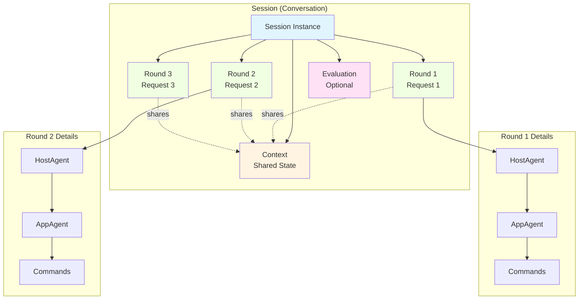
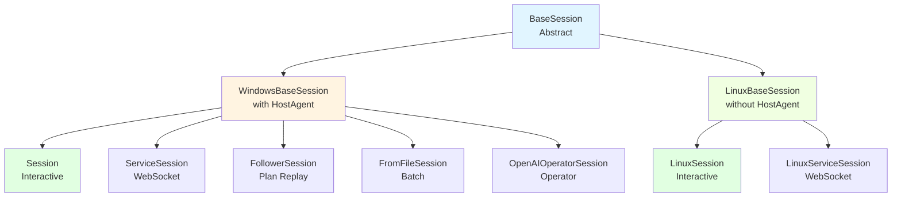
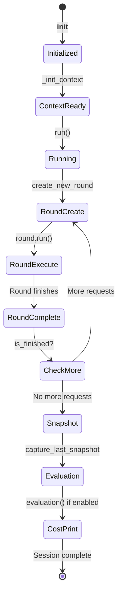

# Session

A **Session** is a continuous conversation instance between the user and UFO, managing multiple rounds of interaction from initial request to task completion across different execution modes and platforms.

**Quick Reference:**

- Session types? See [Session Types](#session-types)
- Lifecycle? See [Session Lifecycle](#session-lifecycle)
- Mode differences? See [Execution Modes](#execution-modes)
- Platform differences? See [Platform-Specific Sessions](#platform-specific-sessions)

---

## Overview

A `Session` represents a complete conversation workflow, containing one or more `Rounds` of agent execution. Sessions manage:

1. **Context**: Shared state across all rounds
2. **Agents**: HostAgent and AppAgent (or LinuxAgent)
3. **Rounds**: Individual request-response cycles
4. **Evaluation**: Optional task completion assessment
5. **Experience**: Learning from successful workflows

### Relationship: Session vs Round



---

## Session Types

UFO supports **7 session types** across Windows and Linux platforms:

| Session Type | Platform | Mode | Description |
|--------------|----------|------|-------------|
| **Session** | Windows | `normal`, `normal_operator` | Interactive with HostAgent |
| **ServiceSession** | Windows | `service` | WebSocket-controlled via AIP |
| **FollowerSession** | Windows | `follower` | Replays saved plans |
| **FromFileSession** | Windows | `batch_normal` | Executes from request files |
| **OpenAIOperatorSession** | Windows | `operator` | Pure operator mode |
| **LinuxSession** | Linux | `normal`, `normal_operator` | Interactive without HostAgent |
| **LinuxServiceSession** | Linux | `service` | WebSocket-controlled on Linux |

### Class Hierarchy



!!!note "Platform Base Classes"
    - `WindowsBaseSession`: Creates HostAgent, supports two-tier architecture
    - `LinuxBaseSession`: Single-tier architecture with LinuxAgent only

---

## Session Lifecycle

### Standard Lifecycle



### Core Execution Loop

The main session logic:

```python
async def run(self) -> None:
    """
    Run the session.
    """
    
    while not self.is_finished():
        # Create new round for each request
        round = self.create_new_round()
        if round is None:
            break
        
        # Execute the round
        await round.run()
    
    # Capture final state
    if self.application_window is not None:
        await self.capture_last_snapshot()
    
    # Evaluate if configured
    if self._should_evaluate and not self.is_error():
        await self.evaluation()
    
    # Print cost summary
    self.print_cost()
```

### Lifecycle Stages

#### 1. Initialization

```python
session = Session(
    task="email_task",
    should_evaluate=True,
    id=0,
    request="Send an email to John",
    mode="normal"
)
```

**What happens:**
- Task name assigned
- Session ID set
- Initial request stored
- Mode configured

#### 2. Context Initialization

```python
def _init_context(self) -> None:
    """Initialize the session context."""
    super()._init_context()
    
    # Create MCP server manager
    mcp_server_manager = MCPServerManager()
    
    # Create local dispatcher
    command_dispatcher = LocalCommandDispatcher(
        session=self,
        mcp_server_manager=mcp_server_manager
    )
    
    # Attach to context
    self.context.attach_command_dispatcher(command_dispatcher)
```

**What happens:**
- Context object created
- Command dispatcher attached (Local or WebSocket)
- MCP servers initialized (if applicable)
- Application window tracked

#### 3. Round Creation

```python
def create_new_round(self):
    """Create a new round."""
    
    # Get request (first or new)
    if not self.context.get(ContextNames.REQUEST):
        request = first_request()
    else:
        request, complete = new_request()
        if complete:
            return None
    
    # Create round with request
    round = Round(
        task=self.task,
        context=self.context,
        request=request,
        id=self._round_num
    )
    
    self._round_num += 1
    return round
```

**What happens:**
- User prompted for request (interactive modes)
- Or request read from file/plan (non-interactive)
- Round object created with shared context
- Round counter incremented

#### 4. Round Execution

```python
await round.run()
```

**What happens:**
- HostAgent selects application (Windows)
- AppAgent executes in application (or LinuxAgent directly)
- Commands dispatched and executed
- Results captured in context
- Experience logged

#### 5. Continuation Check

```python
def is_finished(self) -> bool:
    """Check if session is complete."""
    return self.context.get(ContextNames.SESSION_FINISH, False)
```

**What happens:**
- Check if user wants another request
- Check if error occurred
- Check if plan is complete (follower/batch modes)

#### 6. Final Snapshot

```python
async def capture_last_snapshot(self) -> None:
    """Capture the last snapshot of the application."""
    
    last_round = self.context.get(ContextNames.ROUND_STEP)
    subtask_amount = self.context.get(ContextNames.SUBTASK_AMOUNT)
    
    # Capture screenshot
    screenshot = self.application_window.capture_screenshot_infor()
    
    # Save to logs
    self.file_writer.save_screenshot(
        screenshot,
        last_round,
        subtask_amount,
        "last"
    )
```

**What happens:**
- Screenshot captured
- Control tree logged
- Final state preserved

#### 7. Evaluation

```python
async def evaluation(self) -> None:
    """Evaluate the session."""
    
    evaluator = EvaluationAgent(
        name="evaluation",
        process_name=self.context.get(ContextNames.APPLICATION_PROCESS_NAME),
        app_root_name=self.context.get(ContextNames.APPLICATION_ROOT_NAME),
        is_visual=self.configs["EVA_SESSION"]["VIS_EVAL"],
        main_prompt=self.configs["EVA_SESSION"]["MAIN_PROMPT"],
        api_prompt=self.configs["EVA_SESSION"]["API_PROMPT"]
    )
    
    score = await evaluator.evaluate(
        request=self.context.get(ContextNames.REQUEST),
        trajectory=self.context.get(ContextNames.TRAJECTORY)
    )
    
    self.file_writer.save_evaluation(score)
```

**What happens:**
- EvaluationAgent created
- Task completion assessed
- Score logged
- Feedback saved

#### 8. Cost Summary

```python
def print_cost(self) -> None:
    """Print the session cost."""
    
    total_cost = self.context.get(ContextNames.TOTAL_COST, 0.0)
    total_tokens = self.context.get(ContextNames.TOTAL_TOKENS, 0)
    
    console.print(f"[bold green]Session Complete[/bold green]")
    console.print(f"Total Cost: ${total_cost:.4f}")
    console.print(f"Total Tokens: {total_tokens}")
```

---

## Execution Modes

### Normal Mode

**Interactive execution with user in the loop:**

```python
session = Session(
    task="document_edit",
    should_evaluate=True,
    id=0,
    request="",  # Will prompt user
    mode="normal"
)

await session.run()
```

**Features:**
- User prompted for initial request via `first_request()`
- User prompted for each new request via `new_request()`
- Commands executed locally via `LocalCommandDispatcher`
- User can exit anytime by typing "N"

**Flow:**
```
1. Display welcome panel
2. User enters: "Open Word"
3. HostAgent selects Word application
4. AppAgent types content
5. User asked: "What next?"
6. User enters: "Save document"
7. AppAgent saves file
8. User asked: "What next?"
9. User enters: "N" (exit)
10. Session ends
```

### Normal_Operator Mode

**Normal mode with operator capabilities:**

```python
session = Session(
    task="complex_workflow",
    should_evaluate=True,
    id=0,
    request="Organize my files by date",
    mode="normal_operator"
)
```

**Differences from Normal:**
- Agent can use operator-level actions
- More powerful command set
- Same interactive workflow

### Service Mode

**WebSocket-controlled remote execution:**

```python
from aip.protocol.task_execution import TaskExecutionProtocol

protocol = TaskExecutionProtocol(websocket_connection)

session = ServiceSession(
    task="remote_automation",
    should_evaluate=True,
    id="session_abc123",
    request="Click Submit button",
    task_protocol=protocol
)

await session.run()
```

**Features:**
- No user interaction prompts
- Single request per session
- Commands sent via WebSocket
- Results returned to server
- Uses `WebSocketCommandDispatcher`

**Flow:**
```
1. Server sends request via WebSocket
2. ServiceSession created
3. Agent generates commands
4. Commands sent to client via WebSocket
5. Client executes locally
6. Results sent back
7. Session finishes immediately
```

**Key Difference:**

```python
def is_finished(self) -> bool:
    """Service session finishes after one round."""
    return self._round_num > 0
```

### Follower Mode

**Replay saved action plans:**

```python
session = FollowerSession(
    task="email_replay",
    plan_file="/plans/send_email.json",
    should_evaluate=True,
    id=0
)

await session.run()
```

**Features:**
- No user prompts
- Reads actions from plan file
- Deterministic execution
- Good for testing/demos

**Plan File Format:**

```json
{
  "request": "Send an email to John",
  "actions": [
    {
      "agent": "HostAgent",
      "action": "select_application",
      "parameters": {"app_name": "Outlook"}
    },
    {
      "agent": "AppAgent",
      "action": "click_element",
      "parameters": {"label": "New Email"}
    }
  ]
}
```

### Batch_Normal Mode

**Execute multiple requests from files:**

```python
session = FromFileSession(
    task="batch_task",
    plan_file="/requests/task1.json",
    should_evaluate=True,
    id=0
)

await session.run()
```

**Features:**
- Request loaded from file
- No user interaction
- Can batch multiple files with SessionPool
- Task status tracking available

**Request File:**

```json
{
  "request": "Create a spreadsheet with sales data"
}
```

### Operator Mode

**Pure operator-level execution:**

```python
session = OpenAIOperatorSession(
    task="system_automation",
    should_evaluate=True,
    id=0,
    request="Install and configure software"
)

await session.run()
```

**Features:**
- Operator-level permissions
- Can modify system settings
- More powerful than AppAgent
- Same interactive prompts as normal mode

---

## Platform-Specific Sessions

### Windows Sessions

**Characteristics:**
- **Two-tier architecture**: HostAgent → AppAgent
- **Base class**: `WindowsBaseSession`
- **Agent flow**: HostAgent selects app, AppAgent controls it
- **Automation**: Uses UIA (UI Automation)

**Example:**

```python
class Session(WindowsBaseSession):
    """Windows interactive session."""
    
    def _init_context(self):
        """Initialize with HostAgent."""
        super()._init_context()
        
        # HostAgent created by WindowsBaseSession
        self.host_agent = self.create_host_agent()
        
        # MCP and LocalCommandDispatcher
        self.setup_command_dispatcher()
```

### Linux Sessions

**Characteristics:**
- **Single-tier architecture**: LinuxAgent only (no HostAgent)
- **Base class**: `LinuxBaseSession`
- **Agent flow**: LinuxAgent controls application directly
- **Automation**: Platform-specific tools

**Example:**

```python
class LinuxSession(LinuxBaseSession):
    """Linux interactive session."""
    
    def _init_context(self):
        """Initialize without HostAgent."""
        super()._init_context()
        
        # No HostAgent - direct LinuxAgent usage
        self.linux_agent = self.create_linux_agent(
            application_name=self.application_name
        )
```

**Comparison:**

| Aspect | Windows | Linux |
|--------|---------|-------|
| **Architecture** | Two-tier (HostAgent + AppAgent) | Single-tier (LinuxAgent) |
| **Application Selection** | HostAgent decides | Pre-specified or LinuxAgent decides |
| **Agent Switching** | Yes (HostAgent ↔ AppAgent) | No |
| **Modes Supported** | All 7 modes | normal, normal_operator, service |
| **UI Automation** | UIA (UIAutomation) | Platform tools |

See [Platform Sessions](./platform_sessions.md) for detailed comparison.

---

## Experience Saving

Sessions can save successful workflows for future learning:

```python
# After successful task completion
if self.configs["SAVE_EXPERIENCE"] == "ask":
    save = experience_asker()
    
    if save:
        self.save_experience()
```

**Save Modes:**

| Mode | Behavior |
|------|----------|
| `always` | Auto-save every successful session |
| `ask` | Prompt user after each session |
| `auto` | Save if evaluation score > threshold |
| `always_not` | Never save |

**Saved Experience Structure:**

```json
{
  "task": "Send email",
  "request": "Send an email to John about the meeting",
  "trajectory": [
    {
      "round": 0,
      "agent": "HostAgent",
      "observation": "Desktop with Outlook icon",
      "action": "select_application",
      "parameters": {"app_name": "Outlook"}
    },
    {
      "round": 0,
      "agent": "AppAgent",
      "observation": "Outlook main window",
      "action": "click_element",
      "parameters": {"label": "New Email"}
    }
  ],
  "outcome": "success",
  "evaluation_score": 0.95,
  "cost": 0.0234,
  "tokens": 1542
}
```

---

## Error Handling

### Error States

Sessions track errors through context:

```python
def is_error(self) -> bool:
    """Check if session encountered error."""
    return self.context.get(ContextNames.ERROR, False)

def set_error(self, error_message: str):
    """Set error state."""
    self.context.set(ContextNames.ERROR, True)
    self.context.set(ContextNames.ERROR_MESSAGE, error_message)
```

### Error Recovery

```python
try:
    await round.run()
except AgentError as e:
    self.set_error(str(e))
    logger.error(f"Round {self._round_num} failed: {e}")
    
    # Decide whether to continue or abort
    if self.can_recover(e):
        # Try next round
        continue
    else:
        # Abort session
        break
```

### Common Errors

| Error Type | Cause | Handling |
|------------|-------|----------|
| **TimeoutError** | Command execution timeout | Retry or skip |
| **ConnectionError** | WebSocket/MCP disconnection | Reconnect or abort |
| **AgentError** | Agent decision failure | Log and retry |
| **ValidationError** | Invalid command parameters | Skip command |

---

## Best Practices

### Session Creation

!!!tip "Efficient Sessions"
    - ✅ Use `SessionFactory.create_session()` for platform-aware creation
    - ✅ Enable evaluation for quality tracking
    - ✅ Choose appropriate mode for use case
    - ✅ Set meaningful task names for logging
    - ❌ Don't create sessions directly (use factory)
    - ❌ Don't mix modes (each session has one mode)

### Interactive Sessions

!!!success "User Experience"
    - ✅ Provide clear initial requests
    - ✅ Allow users to exit gracefully ("N" option)
    - ✅ Show progress and confirmations
    - ✅ Handle sensitive actions with confirmation
    - ❌ Don't prompt excessively
    - ❌ Don't hide errors from users

### Service Sessions

!!!warning "WebSocket Considerations"
    - ✅ Always provide `task_protocol`
    - ✅ Handle connection loss gracefully
    - ✅ Set appropriate timeouts
    - ✅ Validate requests before execution
    - ❌ Don't assume connection is stable
    - ❌ Don't block waiting for results indefinitely

### Batch Sessions

!!!tip "Batch Processing"
    - ✅ Enable task status tracking
    - ✅ Use descriptive file names
    - ✅ Group similar tasks
    - ✅ Log failures for retry
    - ❌ Don't stop batch on first failure
    - ❌ Don't run too many sessions in parallel

---

## Examples

### Example 1: Basic Interactive Session

```python
from ufo.module.sessions.session import Session

# Create session
session = Session(
    task="word_editing",
    should_evaluate=True,
    id=0,
    request="",  # Will prompt user
    mode="normal"
)

# Run session
await session.run()

# User interaction:
# 1. Welcome panel shown
# 2. User enters: "Open Word and type Hello World"
# 3. HostAgent selects Word
# 4. AppAgent types text
# 5. User asked for next request
# 6. User enters: "N" to exit
# 7. Session evaluates and ends
```

### Example 2: Service Session

```python
from ufo.module.sessions.service_session import ServiceSession
from aip.protocol.task_execution import TaskExecutionProtocol

# WebSocket established
protocol = TaskExecutionProtocol(websocket)

# Create service session
session = ServiceSession(
    task="remote_click",
    should_evaluate=False,  # Server evaluates
    id="sess_12345",
    request="Click the Submit button",
    task_protocol=protocol
)

# Run (non-blocking for client)
await session.run()

# Session finishes after one request
```

### Example 3: Follower Session

```python
from ufo.module.sessions.session import FollowerSession

# Replay saved plan
session = FollowerSession(
    task="email_demo",
    plan_file="./plans/send_email.json",
    should_evaluate=True,
    id=0
)

await session.run()

# Executes exactly as recorded in plan file
# No user prompts
# Deterministic execution
```

### Example 4: Linux Session

```python
from ufo.module.sessions.linux_session import LinuxSession

# Linux interactive session
session = LinuxSession(
    task="linux_task",
    should_evaluate=True,
    id=0,
    request="Open gedit and type Hello Linux",
    mode="normal",
    application_name="gedit"
)

await session.run()

# Single-tier architecture
# No HostAgent
# LinuxAgent controls gedit directly
```

---

## Reference

### BaseSession

::: module.basic.BaseSession

### Session (Windows)

::: module.sessions.session.Session

### LinuxSession

::: module.sessions.linux_session.LinuxSession

---

## See Also

- [Round](./round.md) - Individual request-response cycles
- [Context](./context.md) - Shared state management
- [Session Factory](./session_pool.md) - Session creation
- [Platform Sessions](./platform_sessions.md) - Windows vs Linux