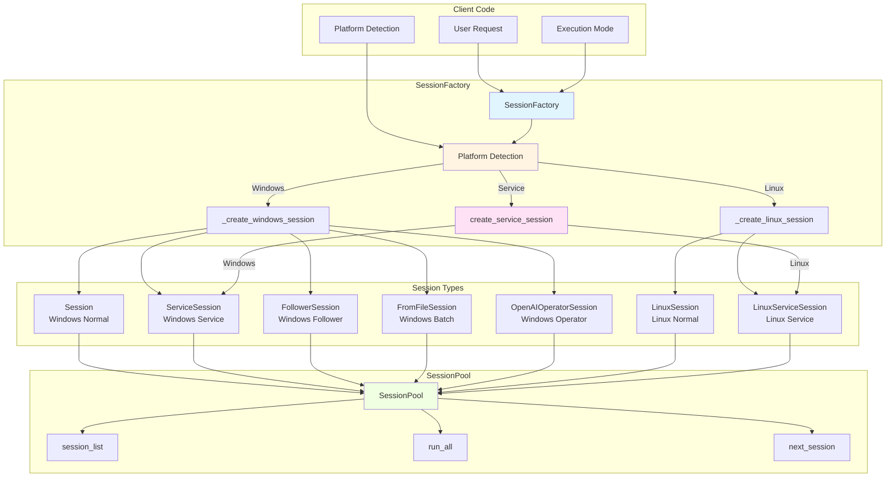
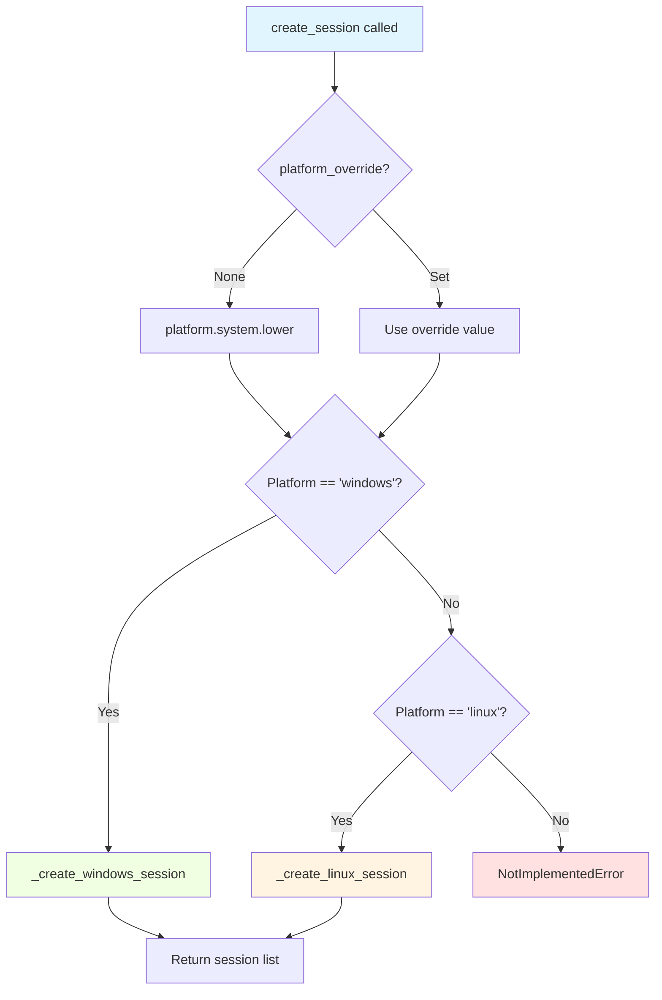
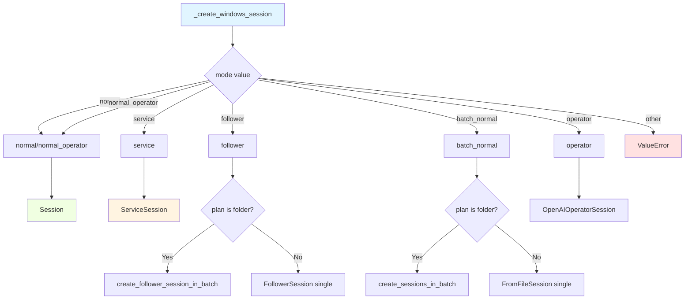
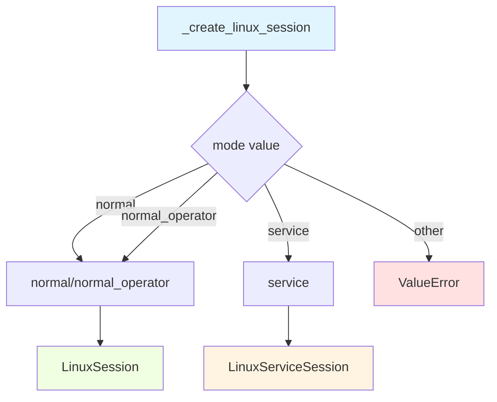
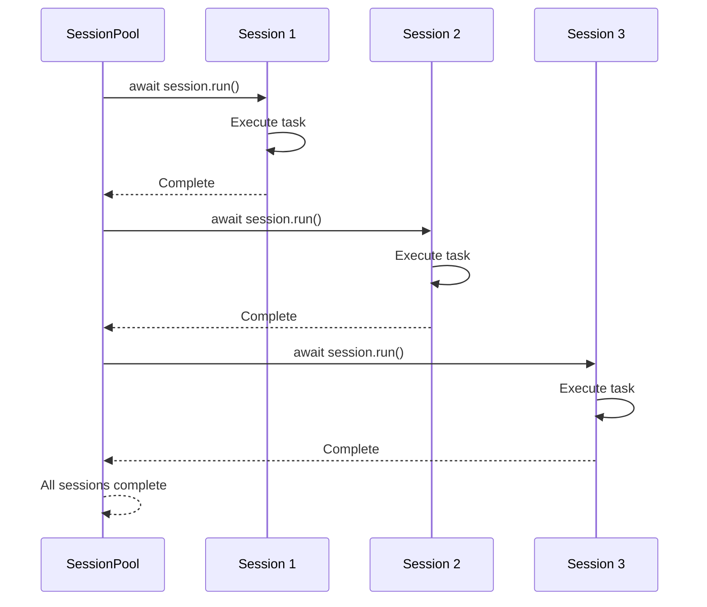

# Session Factory & Pool

The **SessionFactory** and **SessionPool** classes provide platform-aware session creation and batch execution management, supporting 7 different session modes across Windows and Linux platforms.

**Quick Reference:**

- Create single session? Use [SessionFactory.create_session()](#create_session)
- Create service session? Use [SessionFactory.create_service_session()](#create_service_session)
- Batch execution? Use [SessionPool](#sessionpool)
- Platform detection? Automatic or override with `platform_override`

---

## Overview

The session factory and pool system provides:

1. **Platform Abstraction**: Automatically creates the correct session type for Windows or Linux
2. **Mode Support**: Handles 7 different execution modes with appropriate session classes
3. **Batch Management**: Executes multiple sessions sequentially with status tracking
4. **Service Integration**: Creates WebSocket-controlled sessions with AIP protocol

### Architecture



---

## SessionFactory

`SessionFactory` is the central factory for creating all session types with automatic platform detection.

### Class Overview

```python
from ufo.module.session_pool import SessionFactory

factory = SessionFactory()

# Automatically detects platform and creates appropriate session
sessions = factory.create_session(
    task="email_task",
    mode="normal",
    plan="",
    request="Send an email to John"
)
```

### Supported Modes

| Mode | Platform | Session Type | Use Case |
|------|----------|--------------|----------|
| `normal` | Windows | `Session` | Interactive with HostAgent |
| `normal` | Linux | `LinuxSession` | Interactive without HostAgent |
| `normal_operator` | Windows | `Session` | Normal with operator mode |
| `normal_operator` | Linux | `LinuxSession` | Normal with operator mode |
| `service` | Windows | `ServiceSession` | WebSocket-controlled |
| `service` | Linux | `LinuxServiceSession` | WebSocket-controlled |
| `follower` | Windows | `FollowerSession` | Replay saved plans |
| `batch_normal` | Windows | `FromFileSession` | Batch execution from files |
| `operator` | Windows | `OpenAIOperatorSession` | Pure operator mode |

!!!note "Linux Mode Limitations"
    Currently, Linux only supports `normal`, `normal_operator`, and `service` modes. Follower and batch modes are planned for future releases.

---

### create_session()

Creates one or more sessions based on platform, mode, and plan configuration.

#### Signature

```python
def create_session(
    self,
    task: str,
    mode: str,
    plan: str,
    request: str = "",
    platform_override: Optional[str] = None,
    **kwargs,
) -> List[BaseSession]
```

#### Parameters

| Parameter | Type | Default | Description |
|-----------|------|---------|-------------|
| `task` | `str` | Required | Task name for logging/identification |
| `mode` | `str` | Required | Execution mode (see table above) |
| `plan` | `str` | Required | Plan file/folder path (for follower/batch modes) |
| `request` | `str` | `""` | User's natural language request |
| `platform_override` | `Optional[str]` | `None` | Force platform: `"windows"` or `"linux"` |
| `**kwargs` | Various | - | Additional parameters (see below) |

**Additional kwargs:**

| Key | Type | Used By | Description |
|-----|------|---------|-------------|
| `id` | `int` | All modes | Session ID for tracking |
| `task_protocol` | `TaskExecutionProtocol` | Service modes | WebSocket protocol instance |
| `application_name` | `str` | Linux modes | Target application |

#### Return Value

`List[BaseSession]` - List of created sessions

- **Single session modes** (normal, service, operator): Returns 1-element list
- **Batch modes** (follower, batch_normal with folder): Returns list of sessions for each plan file

#### Platform Detection



#### Examples

**Example 1: Normal Windows Session**

```python
factory = SessionFactory()

sessions = factory.create_session(
    task="browse_web",
    mode="normal",
    plan="",
    request="Open Chrome and navigate to google.com"
)

# Returns: [Session(task="browse_web", ...)]
session = sessions[0]
await session.run()
```

**Example 2: Service Session (Auto-detected Platform)**

```python
from aip.protocol.task_execution import TaskExecutionProtocol

protocol = TaskExecutionProtocol(websocket_connection)

sessions = factory.create_session(
    task="remote_control",
    mode="service",
    plan="",
    request="Click the Start button",
    task_protocol=protocol
)

# On Windows: Returns [ServiceSession(...)]
# On Linux: Returns [LinuxServiceSession(...)]
```

**Example 3: Batch Follower Sessions**

```python
sessions = factory.create_session(
    task="batch_email",
    mode="follower",
    plan="/path/to/plan_folder",  # Folder with multiple .json plan files
    request=""
)

# Returns: [
#   FollowerSession(task="batch_email/plan1", ...),
#   FollowerSession(task="batch_email/plan2", ...),
#   FollowerSession(task="batch_email/plan3", ...)
# ]

# Execute with SessionPool
pool = SessionPool(sessions)
await pool.run_all()
```

**Example 4: Linux Session with Application**

```python
sessions = factory.create_session(
    task="edit_document",
    mode="normal",
    plan="",
    request="Type 'Hello World'",
    platform_override="linux",
    application_name="gedit"
)

# Returns: [LinuxSession(task="edit_document", application_name="gedit")]
```

**Example 5: Operator Mode**

```python
sessions = factory.create_session(
    task="complex_workflow",
    mode="operator",
    plan="",
    request="Organize my desktop files by date"
)

# Returns: [OpenAIOperatorSession(task="complex_workflow", ...)]
```

---

### create_service_session()

Simplified method specifically for creating service sessions on any platform.

#### Signature

```python
def create_service_session(
    self,
    task: str,
    should_evaluate: bool,
    id: str,
    request: str,
    task_protocol: Optional["TaskExecutionProtocol"] = None,
    platform_override: Optional[str] = None,
) -> BaseSession
```

#### Parameters

| Parameter | Type | Default | Description |
|-----------|------|---------|-------------|
| `task` | `str` | Required | Task name |
| `should_evaluate` | `bool` | Required | Enable evaluation |
| `id` | `str` | Required | Session ID |
| `request` | `str` | Required | User request |
| `task_protocol` | `TaskExecutionProtocol` | `None` | AIP protocol instance |
| `platform_override` | `Optional[str]` | `None` | Force platform |

#### Return Value

`BaseSession` - Single service session instance

- **Windows**: Returns `ServiceSession`
- **Linux**: Returns `LinuxServiceSession`

#### Example

```python
factory = SessionFactory()
protocol = TaskExecutionProtocol(websocket)

session = factory.create_service_session(
    task="remote_task",
    should_evaluate=True,
    id="session_001",
    request="Open Notepad",
    task_protocol=protocol
)

# Type varies by platform
if isinstance(session, ServiceSession):
    print("Windows service session")
elif isinstance(session, LinuxServiceSession):
    print("Linux service session")

await session.run()
```

---

### _create_windows_session() (Internal)

!!!warning "Internal Method"
    Called by `create_session()` when platform is Windows. Not meant for direct use.

#### Mode Routing



#### Created Session Types

| Mode | Condition | Session Type | Notes |
|------|-----------|--------------|-------|
| `normal` | - | `Session` | Standard interactive |
| `normal_operator` | - | `Session` | With operator mode flag |
| `service` | - | `ServiceSession` | Requires `task_protocol` |
| `follower` | Plan is file | `FollowerSession` | Single plan replay |
| `follower` | Plan is folder | `List[FollowerSession]` | Batch plan replay |
| `batch_normal` | Plan is file | `FromFileSession` | Single file execution |
| `batch_normal` | Plan is folder | `List[FromFileSession]` | Batch file execution |
| `operator` | - | `OpenAIOperatorSession` | Pure operator mode |

---

### _create_linux_session() (Internal)

!!!warning "Internal Method"
    Called by `create_session()` when platform is Linux. Not meant for direct use.

#### Mode Routing



#### Supported Modes

| Mode | Session Type | Notes |
|------|--------------|-------|
| `normal` | `LinuxSession` | Standard Linux interactive |
| `normal_operator` | `LinuxSession` | With operator mode flag |
| `service` | `LinuxServiceSession` | Requires `task_protocol` |

!!!note "Upcoming Features"
    Follower and batch_normal modes for Linux are planned for future releases.

---

### Batch Session Creation

#### create_follower_session_in_batch()

Creates multiple follower sessions from a folder of plan files:

```python
def create_follower_session_in_batch(
    self, 
    task: str, 
    plan: str
) -> List[BaseSession]
```

**Process:**

1. Scan folder for `.json` files
2. Extract file names (without extension)
3. Create `FollowerSession` for each plan file
4. Assign sequential IDs
5. Prefix task name with file name: `{task}/{filename}`

**Example:**

```python
# Folder structure:
# /plans/
#   ├── email_john.json
#   ├── email_jane.json
#   └── email_bob.json

sessions = factory.create_follower_session_in_batch(
    task="send_emails",
    plan="/plans/"
)

# Returns:
# [
#   FollowerSession(task="send_emails/email_john", plan="/plans/email_john.json", id=0),
#   FollowerSession(task="send_emails/email_jane", plan="/plans/email_jane.json", id=1),
#   FollowerSession(task="send_emails/email_bob", plan="/plans/email_bob.json", id=2)
# ]
```

#### create_sessions_in_batch()

Creates multiple FromFileSession instances with task status tracking:

```python
def create_sessions_in_batch(
    self, 
    task: str, 
    plan: str
) -> List[BaseSession]
```

**Features:**

- Tracks completed tasks in `tasks_status.json`
- Skips already-completed tasks
- Resumes from last incomplete task

**Task Status File:**

```json
{
  "email_john": true,
  "email_jane": false,
  "email_bob": false
}
```

**Example:**

```python
# First run
sessions = factory.create_sessions_in_batch(
    task="batch_emails",
    plan="/requests/"
)
# Returns 3 sessions: email_john, email_jane, email_bob

# email_john completes successfully
# tasks_status.json updated: {"email_john": true, "email_jane": false, "email_bob": false}

# Second run (after restart)
sessions = factory.create_sessions_in_batch(
    task="batch_emails",
    plan="/requests/"
)
# Returns 2 sessions: email_jane, email_bob (skips completed email_john)
```

**Configuration:**

```python
# Enable task status tracking
ufo_config.system.task_status = True

# Custom status file location
ufo_config.system.task_status_file = "/path/to/status.json"
```

---

## SessionPool

`SessionPool` manages multiple sessions and executes them sequentially.

### Class Overview

```python
from ufo.module.session_pool import SessionPool

# Create sessions
sessions = factory.create_session(
    task="batch_task",
    mode="follower",
    plan="/plans_folder/"
)

# Create pool
pool = SessionPool(session_list=sessions)

# Execute all
await pool.run_all()
```

### Constructor

```python
def __init__(self, session_list: List[BaseSession]) -> None
```

**Parameters:**

| Parameter | Type | Description |
|-----------|------|-------------|
| `session_list` | `List[BaseSession]` | Initial list of sessions |

### Methods

#### run_all()

Execute all sessions in the pool sequentially:

```python
async def run_all(self) -> None
```

**Execution Flow:**



**Example:**

```python
pool = SessionPool(sessions)

# Execute all sequentially
await pool.run_all()

# All sessions have completed
print("Batch execution complete")
```

#### add_session()

Add a session to the pool:

```python
def add_session(self, session: BaseSession) -> None
```

**Example:**

```python
pool = SessionPool([session1, session2])

# Add another session
pool.add_session(session3)

# Now pool has 3 sessions
```

#### next_session()

Get and remove the next session from the pool:

```python
def next_session(self) -> BaseSession
```

**Example:**

```python
pool = SessionPool([session1, session2, session3])

# Get next session (FIFO)
next_sess = pool.next_session()
# next_sess == session1
# Pool now has [session2, session3]

await next_sess.run()
```

#### session_list (Property)

Get the current session list:

```python
@property
def session_list(self) -> List[BaseSession]
```

**Example:**

```python
pool = SessionPool(sessions)

print(f"Pool has {len(pool.session_list)} sessions")

for session in pool.session_list:
    print(f"Task: {session.task}")
```

---

## Usage Patterns

### Pattern 1: Single Interactive Session

```python
factory = SessionFactory()

sessions = factory.create_session(
    task="user_task",
    mode="normal",
    plan="",
    request="Open Word and create a document"
)

session = sessions[0]
await session.run()
```

### Pattern 2: Service Session with WebSocket

```python
from aip.protocol.task_execution import TaskExecutionProtocol

# WebSocket connection established
protocol = TaskExecutionProtocol(websocket)

factory = SessionFactory()

session = factory.create_service_session(
    task="remote_automation",
    should_evaluate=True,
    id="session_123",
    request="Click the Submit button",
    task_protocol=protocol
)

await session.run()
```

### Pattern 3: Batch Execution

```python
# Create batch sessions
factory = SessionFactory()

sessions = factory.create_session(
    task="daily_reports",
    mode="batch_normal",
    plan="/request_files/",  # Folder with .json request files
    request=""
)

# Execute with pool
pool = SessionPool(sessions)
await pool.run_all()

print(f"Completed {len(sessions)} tasks")
```

### Pattern 4: Cross-Platform Application

```python
import platform

factory = SessionFactory()

# Detect current platform
current_os = platform.system().lower()

sessions = factory.create_session(
    task="cross_platform_task",
    mode="normal",
    plan="",
    request="Open text editor",
    application_name="gedit" if current_os == "linux" else None
)

# Correct session type automatically created
await sessions[0].run()
```

### Pattern 5: Dynamic Session Pool

```python
pool = SessionPool([])

# Add sessions dynamically
for user_request in user_requests:
    sessions = factory.create_session(
        task=f"request_{len(pool.session_list)}",
        mode="normal",
        plan="",
        request=user_request
    )
    pool.add_session(sessions[0])

# Execute all
await pool.run_all()
```

### Pattern 6: Resumable Batch Processing

```python
# Enable task status tracking
ufo_config.system.task_status = True
ufo_config.system.task_status_file = "progress.json"

factory = SessionFactory()

# First run
sessions = factory.create_sessions_in_batch(
    task="large_batch",
    plan="/tasks/"
)

pool = SessionPool(sessions)

try:
    await pool.run_all()
except KeyboardInterrupt:
    print("Interrupted - progress saved")

# Second run (resumes from last incomplete)
sessions = factory.create_sessions_in_batch(
    task="large_batch",
    plan="/tasks/"
)
# Only uncompleted tasks loaded

pool = SessionPool(sessions)
await pool.run_all()
```

---

## Configuration Integration

### UFO Config Settings

| Setting | Type | Purpose |
|---------|------|---------|
| `ufo_config.system.eva_session` | `bool` | Enable session evaluation |
| `ufo_config.system.task_status` | `bool` | Enable task status tracking |
| `ufo_config.system.task_status_file` | `str` | Custom status file path |

### Example Configuration

```yaml
# config/ufo/config.yaml
system:
  eva_session: true
  task_status: true
  task_status_file: "./logs/task_status.json"
```

**Usage:**

```python
from config.config_loader import get_ufo_config

ufo_config = get_ufo_config()

# These settings affect SessionFactory behavior
factory = SessionFactory()

# Uses ufo_config.system.eva_session for should_evaluate
sessions = factory.create_session(
    task="configured_task",
    mode="normal",
    plan="",
    request="Do something"
)
```

---

## Platform Detection

### Automatic Detection

```python
import platform

current_platform = platform.system().lower()
# Returns: "windows", "linux", "darwin" (macOS)
```

**Supported Platforms:**

- `"windows"` → Windows-specific sessions
- `"linux"` → Linux-specific sessions
- Others → `NotImplementedError`

### Manual Override

Force platform selection:

```python
# Force Windows session on Linux machine (for testing)
sessions = factory.create_session(
    task="test",
    mode="normal",
    plan="",
    request="Test request",
    platform_override="windows"
)

# Creates Session instead of LinuxSession
```

!!!warning "Override Use Cases"
    - **Testing**: Test Windows sessions on Linux
    - **Development**: Test platform-specific code
    - **Cross-compilation**: Generate plans for other platforms
    - **Not for production**: Always use auto-detection in production

---

## Error Handling

### NotImplementedError

**Trigger:** Unsupported platform or mode

```python
try:
    sessions = factory.create_session(
        task="task",
        mode="follower",
        plan="",
        request="",
        platform_override="darwin"  # macOS not supported
    )
except NotImplementedError as e:
    print(f"Error: {e}")
    # Error: Platform darwin is not supported yet.
```

### ValueError

**Trigger:** Invalid mode for platform

```python
try:
    sessions = factory.create_session(
        task="task",
        mode="follower",
        plan="",
        request="",
        platform_override="linux"
    )
except ValueError as e:
    print(f"Error: {e}")
    # Error: The follower mode is not supported on Linux yet.
    #        Supported modes: normal, normal_operator, service
```

### Graceful Handling

```python
def create_session_safely(task, mode, plan, request):
    """Create session with error handling."""
    factory = SessionFactory()
    
    try:
        sessions = factory.create_session(
            task=task,
            mode=mode,
            plan=plan,
            request=request
        )
        return sessions
    
    except NotImplementedError as e:
        logger.error(f"Platform not supported: {e}")
        return []
    
    except ValueError as e:
        logger.error(f"Invalid mode: {e}")
        # Fallback to normal mode
        return factory.create_session(
            task=task,
            mode="normal",
            plan="",
            request=request
        )
```

---

## Best Practices

### Session Creation

!!!tip "Efficient Session Management"
    - ✅ Use `create_service_session()` for service sessions (cleaner API)
    - ✅ Let platform auto-detect unless testing
    - ✅ Use batch modes for multiple similar tasks
    - ✅ Enable task status tracking for long-running batches
    - ❌ Don't create sessions in tight loops (use batch modes)
    - ❌ Don't mix session types in same pool without reason

### Batch Processing

!!!success "Optimal Batch Execution"
    1. **Group similar tasks** in same folder
    2. **Enable task status** tracking for resumability
    3. **Use descriptive filenames** for task identification
    4. **Handle failures** gracefully (don't stop entire batch)
    5. **Monitor progress** with logging

### Platform Handling

!!!warning "Cross-Platform Considerations"
    - Always check platform before platform-specific operations
    - Use `application_name` parameter for Linux sessions
    - Test on both platforms if deploying cross-platform
    - Document platform-specific features clearly

---

## Troubleshooting

### Issue: Wrong Session Type Created

**Symptoms:**
- Expected `LinuxSession` but got `Session`
- Mode not working as expected

**Diagnosis:**
```python
session = sessions[0]
print(f"Session type: {type(session).__name__}")
print(f"Platform: {platform.system().lower()}")
```

**Solutions:**
1. Check platform detection: `platform.system().lower()`
2. Verify mode spelling and case
3. Use `platform_override` if needed for testing

### Issue: Batch Sessions Not Found

**Symptoms:**
- Empty session list from batch creation
- `create_sessions_in_batch()` returns `[]`

**Diagnosis:**
```python
plan_files = factory.get_plan_files("/path/to/folder")
print(f"Found {len(plan_files)} plan files")
print(f"Files: {plan_files}")
```

**Solutions:**
1. Ensure folder exists: `os.path.isdir(plan_folder)`
2. Check files have `.json` extension
3. Verify file permissions
4. Check task status file hasn't marked all as done

### Issue: Service Session Missing Protocol

**Symptoms:**
- `ValueError` about missing protocol
- Service session fails to initialize

**Diagnosis:**
```python
protocol = kwargs.get("task_protocol")
print(f"Protocol: {protocol}")
print(f"Type: {type(protocol)}")
```

**Solution:**
Always provide `task_protocol` for service sessions:

```python
from aip.protocol.task_execution import TaskExecutionProtocol

protocol = TaskExecutionProtocol(websocket)

session = factory.create_service_session(
    task="service_task",
    should_evaluate=True,
    id="sess_001",
    request="Do something",
    task_protocol=protocol  # ← Required!
)
```

---

## Reference

### SessionFactory Methods

::: module.session_pool.SessionFactory

### SessionPool Methods

::: module.session_pool.SessionPool

---

## See Also

- [Session](./session.md) - Session lifecycle and execution
- [Platform Sessions](./platform_sessions.md) - Windows vs Linux differences
- [Overview](./overview.md) - Module system architecture
- [AIP Protocol](../../aip/overview.md) - Service session WebSocket protocol

