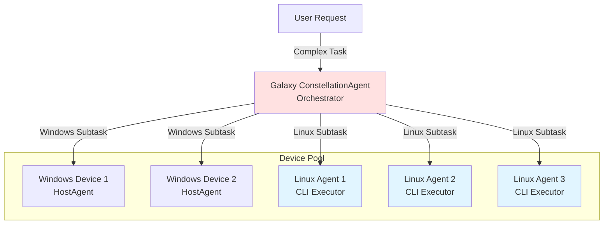
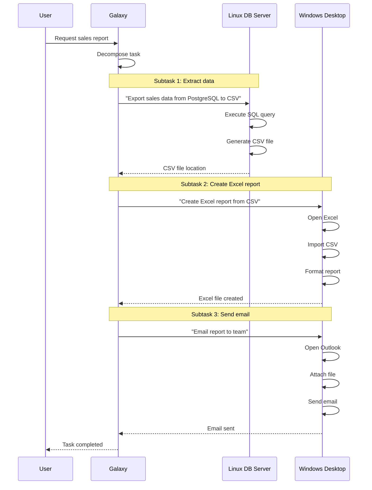

# Using Linux Agent as Galaxy Device

Configure Linux Agent as a sub-agent in UFO's Galaxy framework to enable cross-platform, multi-device task orchestration. Galaxy can coordinate Linux agents alongside Windows devices to execute complex workflows spanning multiple systems.

## Overview

The **Galaxy framework** provides multi-tier orchestration capabilities, allowing you to manage multiple device agents (Windows, Linux, etc.) from a central ConstellationAgent. When configured as a Galaxy device, LinuxAgent becomes a **sub-agent** that can:

- Execute Linux-specific subtasks assigned by Galaxy
- Participate in cross-platform workflows (e.g., Windows + Linux collaboration)
- Report execution status back to the orchestrator
- Be dynamically selected based on capabilities and metadata

For detailed information about LinuxAgent's design and capabilities, see [Linux Agent Overview](overview.md).

## Galaxy Architecture with Linux Agent



Galaxy orchestrates task decomposition, device selection based on capabilities, parallel execution, and result aggregation across all devices.

## Configuration Guide

### Step 1: Configure Device in `devices.yaml`

Add your Linux agent(s) to the device list in `config/galaxy/devices.yaml`:

**Example Configuration:**

```yaml
devices:
  - device_id: "linux_agent_1"
    server_url: "ws://172.23.48.1:5001/ws"
    os: "linux"
    capabilities:
      - "server"
      - "log_analysis"
      - "file_operations"
      - "database_management"
    metadata:
      os: "linux"
      performance: "high"
      logs_file_path: "/var/log/myapp/app.log"
      dev_path: "/home/user/development/"
      warning_log_pattern: "WARN"
      error_log_pattern: "ERROR|FATAL"
      description: "Production web server"
    auto_connect: true
    max_retries: 5
```

### Step 2: Understanding Configuration Fields

| Field | Required | Type | Description |
|-------|----------|------|-------------|
| `device_id` | ✅ Yes | string | **Unique identifier** - must match client `--client-id` |
| `server_url` | ✅ Yes | string | WebSocket URL - must match server endpoint |
| `os` | ✅ Yes | string | Operating system - set to `"linux"` |
| `capabilities` | ❌ Optional | list | Skills/capabilities for task routing |
| `metadata` | ❌ Optional | dict | Custom context for LLM-based task execution |
| `auto_connect` | ❌ Optional | boolean | Auto-connect on Galaxy startup (default: `true`) |
| `max_retries` | ❌ Optional | integer | Connection retry attempts (default: `5`) |

### Step 3: Capabilities-Based Task Routing

Galaxy uses the `capabilities` field to intelligently route subtasks to appropriate devices. Define capabilities based on server roles, task types, installed software, or data access requirements.

**Example Capability Configurations:**

**Web Server:**
```yaml
capabilities:
  - "web_server"
  - "nginx"
  - "ssl_management"
  - "log_analysis"
```

**Database Server:**
```yaml
capabilities:
  - "database_server"
  - "postgresql"
  - "backup_management"
  - "query_optimization"
```

**CI/CD Server:**
```yaml
capabilities:
  - "ci_cd"
  - "docker"
  - "kubernetes"
  - "deployment"
```

**Monitoring Server:**
```yaml
capabilities:
  - "monitoring"
  - "prometheus"
  - "grafana"
  - "alerting"
```

### Step 4: Metadata for Contextual Execution

The `metadata` field provides contextual information that the LLM uses when generating commands for the Linux agent.

**Metadata Examples:**

**Web Server Metadata:**
```yaml
metadata:
  os: "linux"
  logs_file_path: "/var/log/nginx/access.log"
  error_log_path: "/var/log/nginx/error.log"
  web_root: "/var/www/html"
  ssl_cert_path: "/etc/letsencrypt/live/example.com/"
  warning_log_pattern: "WARN"
  error_log_pattern: "ERROR|FATAL"
  performance: "high"
  description: "Production nginx web server"
```

**Database Server Metadata:**
```yaml
metadata:
  os: "linux"
  logs_file_path: "/var/log/postgresql/postgresql.log"
  data_path: "/var/lib/postgresql/14/main"
  backup_path: "/mnt/backups/postgresql"
  warning_log_pattern: "WARNING"
  error_log_pattern: "ERROR|FATAL|PANIC"
  performance: "high"
  description: "Production PostgreSQL 14 database"
```

**Development Server Metadata:**
```yaml
metadata:
  os: "linux"
  dev_path: "/home/developer/projects"
  logs_file_path: "/var/log/app/dev.log"
  git_repo_path: "/home/developer/repos"
  warning_log_pattern: "WARN"
  error_log_pattern: "ERROR"
  performance: "medium"
  description: "Development and testing environment"
```

**How Metadata is Used:**

The LLM receives metadata in the system prompt, enabling context-aware command generation. For example, with the web server metadata above, when the user requests "Find all 500 errors in the last hour", the LLM can generate the appropriate command using the correct log path.

## Multi-Device Configuration Example

**Complete Galaxy Setup:**

```yaml
devices:
  # Windows Desktop Agent
  - device_id: "windows_desktop_1"
    server_url: "ws://192.168.1.100:5000/ws"
    os: "windows"
    capabilities:
      - "office_applications"
      - "email"
      - "web_browsing"
    metadata:
      os: "windows"
      description: "Office productivity workstation"
    auto_connect: true
    max_retries: 5
  
  # Linux Web Server
  - device_id: "linux_web_server"
    server_url: "ws://192.168.1.101:5001/ws"
    os: "linux"
    capabilities:
      - "web_server"
      - "nginx"
      - "log_analysis"
    metadata:
      os: "linux"
      logs_file_path: "/var/log/nginx/access.log"
      web_root: "/var/www/html"
      description: "Production web server"
    auto_connect: true
    max_retries: 5
  
  # Linux Database Server
  - device_id: "linux_db_server"
    server_url: "ws://192.168.1.102:5002/ws"
    os: "linux"
    capabilities:
      - "database_server"
      - "postgresql"
      - "backup_management"
    metadata:
      os: "linux"
      logs_file_path: "/var/log/postgresql/postgresql.log"
      data_path: "/var/lib/postgresql/14/main"
      description: "Production database server"
    auto_connect: true
    max_retries: 5
  
  # Linux Monitoring Server
  - device_id: "linux_monitoring"
    server_url: "ws://192.168.1.103:5003/ws"
    os: "linux"
    capabilities:
      - "monitoring"
      - "prometheus"
      - "alerting"
    metadata:
      os: "linux"
      logs_file_path: "/var/log/prometheus/prometheus.log"
      metrics_path: "/var/lib/prometheus"
      description: "System monitoring server"
    auto_connect: true
    max_retries: 5
```

## Starting Galaxy with Linux Agents

### Prerequisites

Ensure all components are running before starting Galaxy:

1. Device Agent Servers running on all machines
2. Device Agent Clients connected to their respective servers
3. MCP Services running on all Linux agents
4. LLM configured in `config/ufo/agents.yaml` (for UFO) or `config/galaxy/agent.yaml` (for Galaxy)

### Launch Sequence

**Step 1: Start all Device Agent Servers**

```bash
# On web server machine (192.168.1.101)
python -m ufo.server.app --port 5001

# On database server machine (192.168.1.102)
python -m ufo.server.app --port 5002

# On monitoring server machine (192.168.1.103)
python -m ufo.server.app --port 5003
```

**Step 2: Start all Linux Clients**

```bash
# On web server
python -m ufo.client.client \
  --ws \
  --ws-server ws://192.168.1.101:5001/ws \
  --client-id linux_web_server \
  --platform linux

# On database server
python -m ufo.client.client \
  --ws \
  --ws-server ws://192.168.1.102:5002/ws \
  --client-id linux_db_server \
  --platform linux

# On monitoring server
python -m ufo.client.client \
  --ws \
  --ws-server ws://192.168.1.103:5003/ws \
  --client-id linux_monitoring \
  --platform linux
```

**Step 3: Start all MCP Services**

```bash
# On each Linux machine
python -m ufo.client.mcp.http_servers.linux_mcp_server
```

**Step 4: Launch Galaxy**

```bash
# On your control machine (interactive mode)
python -m galaxy --interactive
```

**Or launch with a specific request:**

```bash
python -m galaxy "Your task description here"
```

Galaxy will automatically connect to all configured devices and display the orchestration interface.

## Example Multi-Device Workflows

### Workflow 1: Cross-Platform Data Processing

**User Request:**
> "Generate a sales report in Excel from the database, then email it to the team"

**Galaxy Orchestration:**



### Workflow 2: Multi-Server Log Analysis

**User Request:**
> "Check all servers for error patterns in the last hour and summarize findings"

**Galaxy Orchestration:**

1. **Linux Web Server**: Analyze nginx logs for HTTP 500 errors
2. **Linux DB Server**: Check PostgreSQL logs for query failures
3. **Linux Monitoring**: Review Prometheus alerts
4. **Galaxy**: Aggregate results and generate summary report

### Workflow 3: Deployment Pipeline

**User Request:**
> "Deploy the new application version to production"

**Galaxy Orchestration:**

1. **Linux CI/CD Server**: Build Docker image from Git repository
2. **Linux Web Server**: Stop current service, pull new image, restart
3. **Linux DB Server**: Run database migrations
4. **Linux Monitoring**: Verify health checks and metrics
5. **Windows Desktop**: Send deployment notification email

---

## Task Assignment Behavior

### How Galaxy Routes Tasks to Linux Agents

Galaxy's ConstellationAgent uses several factors to select the appropriate device for each subtask:

| Factor | Description | Example |
|--------|-------------|---------|
| **Capabilities** | Match subtask requirements to device capabilities | `"database_server"` → DB server agent |
| **OS Requirement** | Platform-specific tasks routed to correct OS | Linux commands → Linux agents |
| **Metadata Context** | Use device-specific paths and configurations | Log analysis → agent with correct log path |
| **Device Status** | Only assign to online, healthy devices | Skip offline or failing devices |
| **Load Balancing** | Distribute tasks across similar devices | Round-robin across web servers |

### Example Task Decomposition

**User Request:**
> "Monitor system health across all servers and alert if any issues found"

**Galaxy Decomposition:**

```yaml
Task 1:
  Description: "Check web server health"
  Target: linux_web_server
  Reason: Has "web_server" capability
  
Task 2:
  Description: "Check database health"
  Target: linux_db_server
  Reason: Has "database_server" capability
  
Task 3:
  Description: "Review monitoring alerts"
  Target: linux_monitoring
  Reason: Has "monitoring" capability
  
Task 4:
  Description: "Aggregate results and send alert email"
  Target: windows_desktop_1
  Reason: Has "email" capability
```

## Critical Configuration Requirements

!!!danger "Configuration Validation"
    Ensure these match exactly or Galaxy cannot control the device:
    
    - **Device ID**: `device_id` in `devices.yaml` must match `--client-id` in client command
    - **Server URL**: `server_url` in `devices.yaml` must match `--ws-server` in client command  
    - **Platform**: Must include `--platform linux` in client command

## Monitoring & Debugging

### Verify Device Registration

**Check Galaxy device pool:**

```bash
# List all connected devices
curl http://<galaxy-server>:5000/api/devices
```

**Expected response:**

```json
{
  "devices": [
    {
      "device_id": "linux_web_server",
      "os": "linux",
      "status": "online",
      "capabilities": ["web_server", "nginx", "log_analysis"]
    },
    {
      "device_id": "linux_db_server",
      "os": "linux",
      "status": "online",
      "capabilities": ["database_server", "postgresql"]
    }
  ]
}
```

### View Task Assignments

Galaxy logs show task routing decisions:

```log
INFO - [Galaxy] Task decomposition: 3 subtasks created
INFO - [Galaxy] Subtask 1 → linux_web_server (capability match: web_server)
INFO - [Galaxy] Subtask 2 → linux_db_server (capability match: database_server)
INFO - [Galaxy] Subtask 3 → windows_desktop_1 (capability match: email)
```

### Troubleshooting Device Connection

**Issue**: Linux agent not appearing in Galaxy device pool

**Diagnosis:**

1. Check if client is connected to server:
   ```bash
   curl http://192.168.1.101:5001/api/clients
   ```

2. Verify `devices.yaml` configuration matches client parameters

3. Check Galaxy logs for connection errors

4. Ensure `auto_connect: true` in `devices.yaml`

## Related Documentation

- [Linux Agent Overview](overview.md) - Architecture and design principles
- [Quick Start Guide](../getting_started/quick_start_linux.md) - Step-by-step setup
- [Galaxy Overview](../galaxy/overview.md) - Multi-device orchestration framework
- [Galaxy Quick Start](../getting_started/quick_start_galaxy.md) - Galaxy deployment guide
- [Constellation Orchestrator](../galaxy/constellation_orchestrator/overview.md) - Task orchestration
- [Galaxy Devices Configuration](../configuration/system/galaxy_devices.md) - Complete device configuration reference

## Summary

Using Linux Agent as a Galaxy device enables multi-device orchestration with capability-based routing, metadata context for LLM-aware command generation, parallel execution, and seamless cross-platform workflows between Linux and Windows agents.

