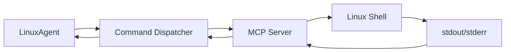
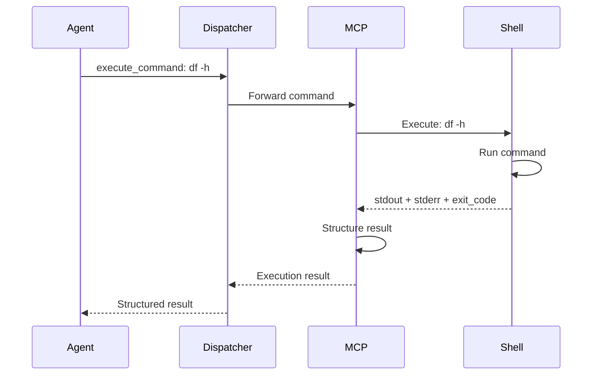
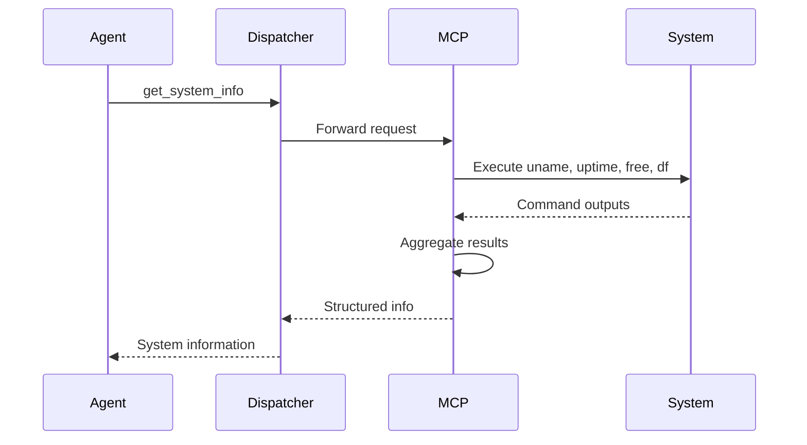
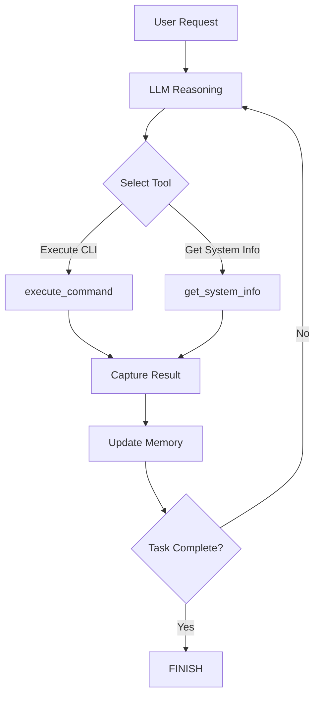

# LinuxAgent MCP Commands

LinuxAgent interacts with Linux systems through MCP (Model Context Protocol) tools provided by the Linux MCP Server. These tools provide atomic building blocks for CLI task execution, isolating system-specific operations within the MCP server layer.

## Command Architecture

### MCP Server Integration

LinuxAgent commands are executed through the MCP server infrastructure:



### Command Dispatcher

The command dispatcher routes commands to the appropriate MCP server:

```python
from aip.messages import Command

# Create command
command = Command(
    tool_name="execute_command",
    parameters={"command": "df -h", "timeout": 30},
    tool_type="action"
)

# Execute command via dispatcher
results = await command_dispatcher.execute_commands([command])
execution_result = results[0].result
```

## Primary MCP Tools

### 1. execute_command - Execute Shell Commands

**Purpose**: Execute arbitrary shell commands and capture structured results.

#### Tool Specification

```python
tool_name = "execute_command"
parameters = {
    "command": "df -h",              # Shell command to execute
    "timeout": 30,                   # Execution timeout (seconds, default: 30)
    "cwd": "/home/user"              # Optional working directory
}
```

#### Execution Flow



#### Result Structure

```python
{
  "success": True,                  # Boolean indicating success
  "exit_code": 0,                   # Process exit code
  "stdout": "Filesystem      Size  Used Avail Use% Mounted on\n/dev/sda1       100G   50G   46G  52% /\n",
  "stderr": ""                      # Standard error output
}
```

#### Common Use Cases

| Use Case | Command Example | Description |
|----------|----------------|-------------|
| **File Operations** | `ls -la /home/user` | List directory contents |
| **Text Processing** | `grep "error" /var/log/syslog` | Search log files |
| **System Monitoring** | `top -bn1` | Check system processes |
| **Disk Management** | `df -h` | Check disk space |
| **Network Operations** | `ping -c 4 example.com` | Test network connectivity |
| **Archive Creation** | `tar -czf backup.tar.gz /data` | Create compressed archives |
| **Package Management** | `apt list --installed` | List installed packages |

#### Error Handling

**Exit Code Interpretation**:

- **0**: Success
- **1-125**: Command-specific errors
- **126**: Command not executable
- **127**: Command not found
- **128+n**: Terminated by signal n

**Example Error Result**:

```python
{
  "success": False,
  "error": "Command not found: invalid_cmd"
}
```

#### Security Considerations

!!!warning "Command Safety"
    The MCP server blocks dangerous commands including:
    
    - `rm -rf /` - Recursive root deletion
    - Fork bombs - `:(){ :|:& };:`
    - `mkfs` - Filesystem formatting
    - `dd if=/dev/zero` - Device overwriting
    - `shutdown`, `reboot` - System shutdown
    
    Commands execute with user permissions, no automatic privilege escalation. Timeout protection prevents hung processes.

### 2. get_system_info - Collect System Information

**Purpose**: Gather basic Linux system information using standard commands.

#### Tool Specification

```python
tool_name = "get_system_info"
parameters = {}  # No parameters required
```

#### Information Collected

The tool executes these commands and returns their output:

| Info Type | Command | Data Returned |
|-----------|---------|---------------|
| **uname** | `uname -a` | System and kernel information |
| **uptime** | `uptime` | System uptime and load averages |
| **memory** | `free -h` | Memory usage statistics (human-readable) |
| **disk** | `df -h` | Disk space for all mounted filesystems |

#### Execution Flow



#### Result Example

```python
{
  "uname": "Linux hostname 5.15.0-91-generic #101-Ubuntu SMP x86_64 GNU/Linux",
  "uptime": " 14:23:45 up 5 days,  3:12,  2 users,  load average: 0.52, 0.58, 0.59",
  "memory": "              total        used        free      shared  buff/cache   available\nMem:           15Gi       8.2Gi       1.5Gi       256Mi       5.8Gi       7.0Gi\nSwap:         8.0Gi       512Mi       7.5Gi",
  "disk": "Filesystem      Size  Used Avail Use% Mounted on\n/dev/sda1       100G   50G   46G  52% /\n/dev/sdb1       500G  200G  276G  42% /data"
}
```

## Command Execution Pipeline

### Atomic Building Blocks

The MCP tools `execute_command` and `get_system_info` serve as atomic operations:



### Isolation of System Operations

By isolating system operations in the MCP server layer, the architecture achieves clear separation: the Agent layer focuses on LLM reasoning and workflow orchestration, while the MCP layer handles system-specific command execution. This provides testability (commands can be mocked) and portability (MCP servers can be deployed remotely).

## Command Composition

### Sequential Execution

LinuxAgent executes commands sequentially, building on previous results:

```python
# Round 1: Check disk space
{
  "action": {
    "tool": "execute_command",
    "arguments": {"command": "df -h /data"}
  }
}
# Result: 276GB available

# Round 2: Create backup (informed by Round 1 result)
{
  "action": {
    "tool": "execute_command",
    "arguments": {
      "command": "tar -czf /data/backup.tar.gz /home/user"
    }
  }
}
```

### Conditional Execution

LLM can make decisions based on command results:

```python
# Round 1: Check if file exists
{
  "action": {
    "tool": "execute_command",
    "arguments": {"command": "ls /data/backup.tar.gz"}
  }
}
# Result: exit_code=2 (file not found)

# Round 2: File doesn't exist, create it
{
  "thought": "Backup doesn't exist, creating new one",
  "action": {
    "tool": "execute_command",
    "arguments": {"command": "tar -czf /data/backup.tar.gz /home/user"}
  }
}
```

### Error Recovery

Commands can be retried or alternatives attempted:

```python
# Round 1: Try privileged command
{
  "action": {
    "tool": "execute_command",
    "arguments": {"command": "systemctl restart nginx"}
  }
}
# Result: success=False, error="Permission denied"

# Round 2: Switch to user-level alternative
{
  "thought": "Don't have sudo access, using alternative approach",
  "action": {
    "tool": "execute_command",
    "arguments": {"command": "kill -HUP $(cat /var/run/nginx.pid)"}
  }
}
```

---

## Command Implementation

### MCP Server Location

The MCP server implementation for Linux commands can be found in:

```
ufo/client/mcp/http_servers/
└── linux_mcp_server.py
```

### Example Implementation Skeleton

```python
class LinuxMCPServer:
    """MCP server for Linux CLI commands"""
    
    @mcp.tool()
    async def execute_command(
        self, 
        command: str, 
        timeout: int = 30,
        cwd: Optional[str] = None
    ) -> Dict:
        """Execute a shell command"""
        # Block dangerous commands
        dangerous = ["rm -rf /", ":(){ :|:& };:", "mkfs", ...]
        if any(d in command.lower() for d in dangerous):
            return {"success": False, "error": "Blocked dangerous command."}
        
        try:
            proc = await asyncio.create_subprocess_shell(
                command,
                stdout=asyncio.subprocess.PIPE,
                stderr=asyncio.subprocess.PIPE,
                cwd=cwd
            )
            try:
                stdout, stderr = await asyncio.wait_for(
                    proc.communicate(), 
                    timeout=timeout
                )
            except asyncio.TimeoutError:
                proc.kill()
                await proc.wait()
                return {"success": False, "error": f"Timeout after {timeout}s."}
            
            return {
                "success": proc.returncode == 0,
                "exit_code": proc.returncode,
                "stdout": stdout.decode("utf-8", errors="replace"),
                "stderr": stderr.decode("utf-8", errors="replace")
            }
        except Exception as e:
            return {"success": False, "error": str(e)}
    
    @mcp.tool()
    async def get_system_info(self) -> Dict:
        """Collect system information"""
        info = {}
        cmds = {
            "uname": "uname -a",
            "uptime": "uptime",
            "memory": "free -h",
            "disk": "df -h"
        }
        
        for k, cmd in cmds.items():
            try:
                proc = await asyncio.create_subprocess_shell(
                    cmd, stdout=asyncio.subprocess.PIPE
                )
                out, _ = await proc.communicate()
                info[k] = out.decode("utf-8", errors="replace").strip()
            except Exception as e:
                info[k] = f"Error: {e}"
        
        return info
```

---

## Best Practices

### Tool Usage

- Use `get_system_info` for quick system overview
- Use `execute_command` for custom or complex operations
- Check `success` field and `exit_code` to detect errors
- Parse `stdout` for structured data when possible
- Set timeouts appropriately to prevent hung processes

### Security

!!!warning "Security Best Practices"
    The MCP server has built-in protections, but be cautious:
    
    - Dangerous commands are automatically blocked
    - Commands execute with user permissions only
    - Avoid sudo when possible (requires user interaction)
    - Sanitize outputs before logging (may contain sensitive data)

### Error Handling

- Check `success` field before considering command successful
- Parse `stderr` for error messages
- Implement retries for transient errors
- Provide alternatives when primary approach fails

## Comparison with Other Agent Commands

| Agent | Command Types | Execution Layer | Result Format |
|-------|--------------|-----------------|---------------|
| **LinuxAgent** | CLI + SysInfo | MCP server | success/exit_code/stdout/stderr |
| **AppAgent** | UI + API | Automator + MCP | UI state + API responses |
| **HostAgent** | Desktop + Shell | Automator + MCP | Desktop state + results |

LinuxAgent's command set is intentionally minimal and focused:

- **execute_command**: General-purpose command execution
- **get_system_info**: Standardized system information

This simplicity reflects the CLI environment's text-based, command-driven nature.

## Next Steps

- [State Machine](state.md) - Understand how command execution fits into the FSM
- [Processing Strategy](strategy.md) - See how commands are integrated into the 3-phase pipeline
- [Overview](overview.md) - Return to LinuxAgent architecture overview
- [MCP Overview](../mcp/overview.md) - MCP server implementation details
