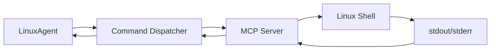
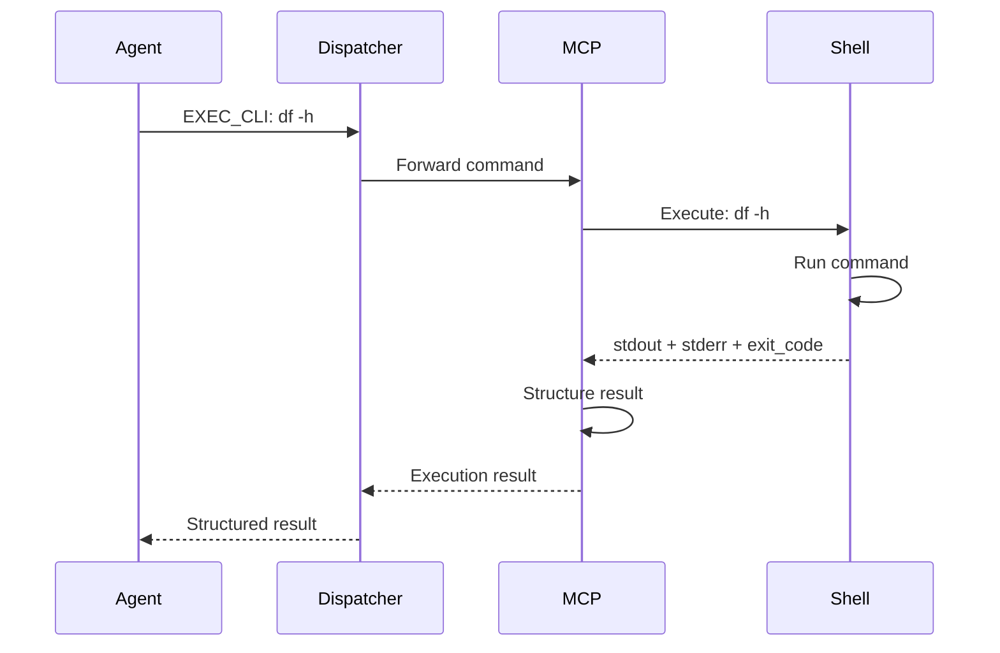
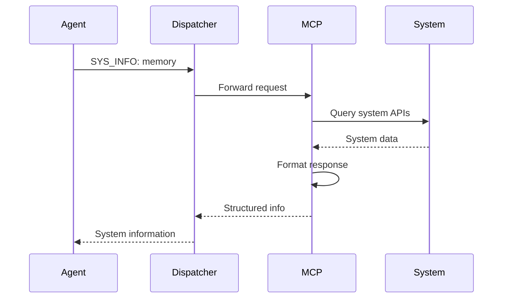
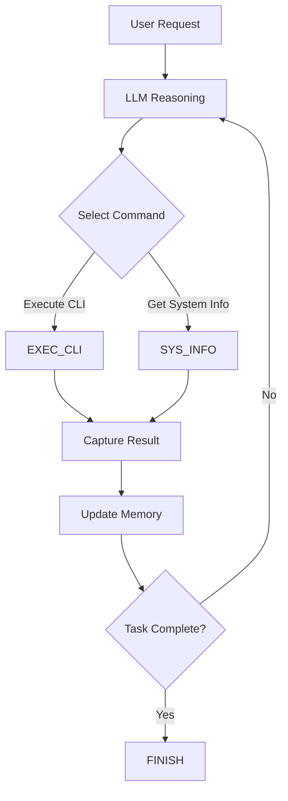

# LinuxAgent MCP Commands

!!!abstract "Overview"
    LinuxAgent interacts with Linux systems through **two primary MCP (Model Context Protocol) commands**: `EXEC_CLI` for executing shell commands and `SYS_INFO` for collecting system information. These commands provide atomic building blocks for CLI task execution, isolating system-specific operations within the MCP server layer.

---

## Command Architecture

### MCP Server Integration

LinuxAgent commands are executed through the MCP server infrastructure:



### Command Dispatcher

The command dispatcher routes commands to the appropriate MCP server:

```python
# Get command dispatcher from global context
command_dispatcher = context.global_context.command_dispatcher

# Execute command
execution_results = await command_dispatcher.execute_command(
    command_name="EXEC_CLI",
    parameters={"command": "df -h"}
)
```

---

## Primary Commands

### 1. EXEC_CLI - Execute Shell Commands

**Purpose**: Execute arbitrary shell commands and capture structured results.

#### Command Specification

```python
{
  "command": "EXEC_CLI",
  "parameters": {
    "command": "df -h",              # Shell command to execute
    "timeout": 30,                   # Execution timeout (seconds)
    "working_directory": "/home/user" # Optional working directory
  }
}
```

#### Execution Flow



#### Result Structure

```python
{
  "stdout": "Filesystem      Size  Used Avail Use% Mounted on\n/dev/sda1       100G   50G   46G  52% /\n",
  "stderr": "",
  "exit_code": 0,
  "command": "df -h",
  "execution_time": 0.125,  # seconds
  "timestamp": "2025-11-06T10:30:45.123Z",
  "status": "SUCCESS"
}
```

#### Common Use Cases

| Use Case | Command Example | Description |
|----------|----------------|-------------|
| **File Operations** | `ls -la /home/user` | List directory contents |
| **Text Processing** | `grep "error" /var/log/syslog` | Search log files |
| **System Monitoring** | `top -bn1` | Check system processes |
| **Disk Management** | `df -h` | Check disk space |
| **Network Operations** | `ping -c 4 example.com` | Test network connectivity |
| **Archive Creation** | `tar -czf backup.tar.gz /data` | Create compressed archives |
| **Package Management** | `apt list --installed` | List installed packages |

#### Error Handling

**Exit Code Interpretation**:

- **0**: Success
- **1-125**: Command-specific errors
- **126**: Command not executable
- **127**: Command not found
- **128+n**: Terminated by signal n

**Example Error Result**:

```python
{
  "stdout": "",
  "stderr": "bash: invalid_cmd: command not found\n",
  "exit_code": 127,
  "command": "invalid_cmd",
  "status": "ERROR"
}
```

#### Security Considerations

!!!warning "Command Safety"
    - Commands are executed with the **user's permissions**
    - **No automatic privilege escalation** (sudo commands require user password)
    - Commands are **logged** for audit purposes
    - **Timeout protection** prevents hung processes
    - **Working directory** can be restricted to prevent directory traversal

---

### 2. SYS_INFO - Collect System Information

**Purpose**: Gather system-level information for decision-making without executing arbitrary commands.

#### Command Specification

```python
{
  "command": "SYS_INFO",
  "parameters": {
    "info_type": "memory"  # Type of system info to collect
  }
}
```

#### Supported Info Types

| Info Type | Description | Data Returned |
|-----------|-------------|---------------|
| **memory** | Memory usage statistics | Total, used, free, available RAM |
| **disk** | Disk space information | Filesystem sizes, usage, mount points |
| **cpu** | CPU information | Model, cores, threads, usage |
| **network** | Network interfaces | IP addresses, interface status |
| **hardware** | Hardware configuration | CPU, memory, disk controllers |
| **os** | Operating system details | Kernel version, distribution, architecture |

#### Execution Flow



#### Result Examples

**Memory Information**:

```python
{
  "info_type": "memory",
  "data": {
    "total": "16GB",
    "used": "8.2GB",
    "free": "1.5GB",
    "available": "7.8GB",
    "swap_total": "8GB",
    "swap_used": "512MB"
  },
  "timestamp": "2025-11-06T10:30:45.123Z"
}
```

**Disk Information**:

```python
{
  "info_type": "disk",
  "data": {
    "filesystems": [
      {
        "device": "/dev/sda1",
        "mount_point": "/",
        "size": "100GB",
        "used": "50GB",
        "available": "46GB",
        "use_percent": "52%"
      },
      {
        "device": "/dev/sdb1",
        "mount_point": "/data",
        "size": "500GB",
        "used": "200GB",
        "available": "276GB",
        "use_percent": "42%"
      }
    ]
  }
}
```

**CPU Information**:

```python
{
  "info_type": "cpu",
  "data": {
    "model": "Intel(R) Core(TM) i7-10700K",
    "cores": 8,
    "threads": 16,
    "architecture": "x86_64",
    "current_usage": "25%",
    "load_average": [1.5, 1.3, 1.1]  # 1, 5, 15 min averages
  }
}
```

#### Advantages over EXEC_CLI

!!!success "Why SYS_INFO?"
    - **Faster**: Pre-structured data, no shell overhead
    - **Safer**: No arbitrary command execution
    - **Consistent**: Standardized data format across systems
    - **Efficient**: Cached data when appropriate
    - **Typed**: Strongly typed response schemas

#### Proactive Information Gathering

LinuxAgent uses SYS_INFO for **on-demand data collection**:

```python
# LLM decides it needs memory info before proceeding
{
  "thought": "Need to check if there's enough memory for this operation",
  "action": {
    "command": "SYS_INFO",
    "parameters": {"info_type": "memory"}
  },
  "comment": "Checking available memory"
}

# After getting memory info, LLM proceeds with appropriate command
{
  "thought": "8GB available is sufficient",
  "action": {
    "command": "EXEC_CLI",
    "parameters": {
      "command": "python large_data_processor.py"
    }
  }
}
```

This eliminates unnecessary overhead from continuous polling.

---

## Command Execution Pipeline

### Atomic Building Blocks

Both EXEC_CLI and SYS_INFO serve as **atomic operations**:



### Isolation of System Operations

By isolating system operations in the MCP server layer:

!!!success "Layered Architecture Benefits"
    - **Agent Layer**: Focuses on LLM reasoning and workflow orchestration
    - **MCP Layer**: Handles system-specific command execution
    - **Clear Boundaries**: Agent doesn't need Linux-specific implementation details
    - **Testability**: Commands can be mocked for testing
    - **Portability**: MCP servers can be deployed remotely or on different systems

---

## Command Composition

### Sequential Execution

LinuxAgent executes commands sequentially, building on previous results:

```python
# Round 1: Check disk space
{
  "action": {
    "command": "EXEC_CLI",
    "parameters": {"command": "df -h /data"}
  }
}
# Result: 276GB available

# Round 2: Create backup (informed by Round 1 result)
{
  "action": {
    "command": "EXEC_CLI",
    "parameters": {
      "command": "tar -czf /data/backup.tar.gz /home/user"
    }
  }
}
```

### Conditional Execution

LLM can make decisions based on command results:

```python
# Round 1: Check if file exists
{
  "action": {
    "command": "EXEC_CLI",
    "parameters": {"command": "ls /data/backup.tar.gz"}
  }
}
# Result: exit_code=2 (file not found)

# Round 2: File doesn't exist, create it
{
  "thought": "Backup doesn't exist, creating new one",
  "action": {
    "command": "EXEC_CLI",
    "parameters": {"command": "tar -czf /data/backup.tar.gz /home/user"}
  }
}
```

### Error Recovery

Commands can be retried or alternatives attempted:

```python
# Round 1: Try privileged command
{
  "action": {
    "command": "EXEC_CLI",
    "parameters": {"command": "systemctl restart nginx"}
  }
}
# Result: exit_code=1, stderr="Permission denied"

# Round 2: Switch to user-level alternative
{
  "thought": "Don't have sudo access, using alternative approach",
  "action": {
    "command": "EXEC_CLI",
    "parameters": {"command": "kill -HUP $(cat /var/run/nginx.pid)"}
  }
}
```

---

## Command Implementation

### MCP Server Location

The MCP server implementation for Linux commands can be found in:

```
ufo/client/mcp/http_servers/
└── linux_mcp_server.py
```

### Example Implementation Skeleton

```python
class LinuxMCPServer:
    """MCP server for Linux CLI commands"""
    
    async def exec_cli(self, command: str, timeout: int = 30,
                       working_directory: str = None) -> Dict:
        """Execute a shell command"""
        try:
            result = await asyncio.wait_for(
                self._run_command(command, working_directory),
                timeout=timeout
            )
            return {
                "stdout": result.stdout,
                "stderr": result.stderr,
                "exit_code": result.returncode,
                "command": command,
                "status": "SUCCESS" if result.returncode == 0 else "ERROR"
            }
        except asyncio.TimeoutError:
            return {
                "stdout": "",
                "stderr": "Command timed out",
                "exit_code": 124,
                "command": command,
                "status": "TIMEOUT"
            }
    
    async def sys_info(self, info_type: str) -> Dict:
        """Collect system information"""
        handlers = {
            "memory": self._get_memory_info,
            "disk": self._get_disk_info,
            "cpu": self._get_cpu_info,
            # ... other handlers
        }
        
        handler = handlers.get(info_type)
        if handler:
            return await handler()
        else:
            return {"error": f"Unknown info type: {info_type}"}
```

---

## Best Practices

### Command Design

!!!tip "Effective Command Usage"
    - **Prefer SYS_INFO** when standard system info is needed
    - **Use EXEC_CLI** for custom or complex operations
    - **Check exit codes** to detect errors
    - **Parse stdout** for structured data when possible
    - **Log stderr** for debugging
    - **Set timeouts** to prevent hung processes

### Security

!!!warning "Security Best Practices"
    - **Validate inputs** to prevent command injection
    - **Limit permissions** to minimum required level
    - **Avoid sudo** when possible (requires user interaction)
    - **Sanitize outputs** before logging (may contain sensitive data)
    - **Restrict working directories** to prevent unauthorized access

### Error Handling

!!!info "Robust Error Handling"
    - **Check exit codes** before considering command successful
    - **Parse stderr** for error messages
    - **Implement retries** for transient errors
    - **Provide alternatives** when primary approach fails
    - **Log failures** with full context for debugging

---

## Comparison with Other Agent Commands

| Agent | Command Types | Execution Layer | Result Format |
|-------|--------------|-----------------|---------------|
| **LinuxAgent** | CLI + SysInfo | MCP server | stdout/stderr/exit_code |
| **AppAgent** | UI + API | Automator + MCP | UI state + API responses |
| **HostAgent** | Desktop + Shell | Automator + MCP | Desktop state + results |

LinuxAgent's command set is intentionally **minimal and focused**:

- **EXEC_CLI**: General-purpose command execution
- **SYS_INFO**: Standardized system information

This simplicity reflects the CLI environment's **text-based, command-driven** nature.

---

## Next Steps

- **[State Machine](state.md)** - Understand how command execution fits into the FSM
- **[Processing Strategy](strategy.md)** - See how commands are integrated into the 3-phase pipeline
- **[Overview](overview.md)** - Return to LinuxAgent architecture overview

For MCP server implementation details, see **[MCP Overview](../mcp/overview.md)**.
