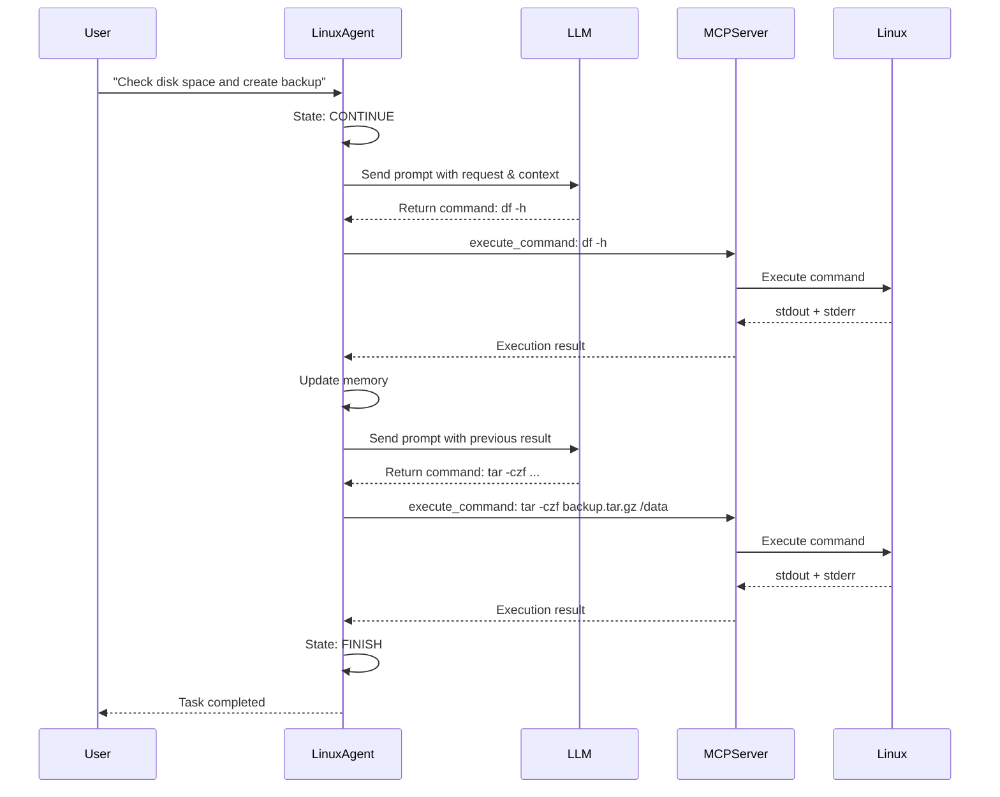

# LinuxAgent: CLI Task Executor

**LinuxAgent** is a specialized lightweight agent designed for executing command-line instructions on Linux systems. It demonstrates how a standalone device agent can leverage the layered FSM architecture and server-client design to perform intelligent, iterative task execution in a CLI-based environment.

**Quick Links:**

- New to Linux Agent? Start with the [Quick Start Guide](../getting_started/quick_start_linux.md)
- Using as Sub-Agent in Galaxy? See [Using Linux Agent as Galaxy Device](as_galaxy_device.md)

## Architecture Overview

LinuxAgent operates as a single-agent instance that interacts with Linux systems through command-line interface (CLI) commands. Unlike the two-tier architecture of UFO (HostAgent + AppAgent), LinuxAgent uses a simplified single-agent model optimized for shell-based automation.

## Core Responsibilities

LinuxAgent provides the following capabilities for Linux CLI automation:

### Command-Line Execution

LinuxAgent interprets user requests and translates them into appropriate shell commands for execution on Linux systems.

**Example:** User request "Check disk space and create a backup" becomes:

1. Execute `df -h` to check disk space
2. Execute `tar -czf backup.tar.gz /data` to create backup

### System Information Collection

The agent can proactively gather system-level information to inform decision-making:

- Memory usage (`free -h`)
- Disk space (`df -h`)
- Process status (`ps aux`)
- Hardware configuration (`lscpu`, `lshw`)

### Iterative Task Execution

LinuxAgent executes tasks iteratively, evaluating execution outcomes at each step and determining the next action based on results and LLM reasoning.

### Error Handling and Recovery

The agent monitors command execution results (`stdout`, `stderr`, exit codes) and can adapt its strategy when errors occur.

## Key Characteristics

- **Scope**: Single Linux system (CLI-based automation)
- **Lifecycle**: One instance per task session
- **Hierarchy**: Standalone agent (no child agents)
- **Communication**: Direct MCP server integration
- **Control**: 3-state finite state machine with 3-phase processing pipeline

## Execution Workflow



## Comparison with UFO Agents

| Aspect | LinuxAgent | HostAgent | AppAgent |
|--------|------------|-----------|----------|
| **Platform** | Linux (CLI) | Windows Desktop | Windows Applications |
| **States** | 3 (CONTINUE, FINISH, FAIL) | 7 states | 6 states |
| **Architecture** | Single-agent | Parent orchestrator | Child executor |
| **Interface** | Command-line | Desktop GUI + Shell | Application GUI + API |
| **Processing Phases** | 3 phases | 4 phases | 4 phases |
| **MCP Tools** | execute_command, get_system_info | Desktop commands | UI + API commands |

## Design Principles

LinuxAgent exemplifies a minimal viable design for single-agent systems with a small state set (only 3 states for deterministic control flow), modular strategies (clear separation between LLM interaction, action execution, and memory updates), well-defined commands (atomic CLI operations isolated in MCP server layer), proactive information gathering (on-demand system info collection), and traceable execution (complete logging of commands, results, and state transitions).

## Deep Dive Topics

Explore the detailed architecture and implementation:

- [State Machine](state.md) - 3-state FSM lifecycle and transitions
- [Processing Strategy](strategy.md) - 3-phase pipeline (LLM, Action, Memory)
- [MCP Commands](commands.md) - CLI execution and system information commands

## Use Cases

LinuxAgent is ideal for:

- **System Administration**: Automated system maintenance and monitoring
- **DevOps Tasks**: Deployment scripts, log analysis, configuration management
- **Data Processing**: File operations, text processing, batch jobs
- **Monitoring & Alerts**: System health checks and automated responses
- **Cross-Device Workflows**: As a sub-agent in Galaxy multi-device orchestration

!!!tip "Galaxy Integration"
    LinuxAgent can serve as a device agent in Galaxy's multi-device orchestration framework, executing Linux-specific tasks as part of cross-platform workflows alongside Windows and other devices.
    
    See [Using Linux Agent as Galaxy Device](as_galaxy_device.md) for configuration details.

## Implementation Location

The LinuxAgent implementation can be found in:

```
ufo/
├── agents/
│   ├── agent/
│   │   └── customized_agent.py          # LinuxAgent class definition
│   ├── states/
│   │   └── linux_agent_state.py         # State machine implementation
│   └── processors/
│       ├── customized/
│       │   └── customized_agent_processor.py  # LinuxAgentProcessor
│       └── strategies/
│           └── linux_agent_strategy.py  # Processing strategies
```

## Next Steps

To understand LinuxAgent's complete architecture:

1. [State Machine](state.md) - Learn about the 3-state FSM
2. [Processing Strategy](strategy.md) - Understand the 3-phase pipeline
3. [MCP Commands](commands.md) - Explore CLI command execution

For deployment and configuration, see the [Getting Started Guide](../getting_started/quick_start_linux.md).
