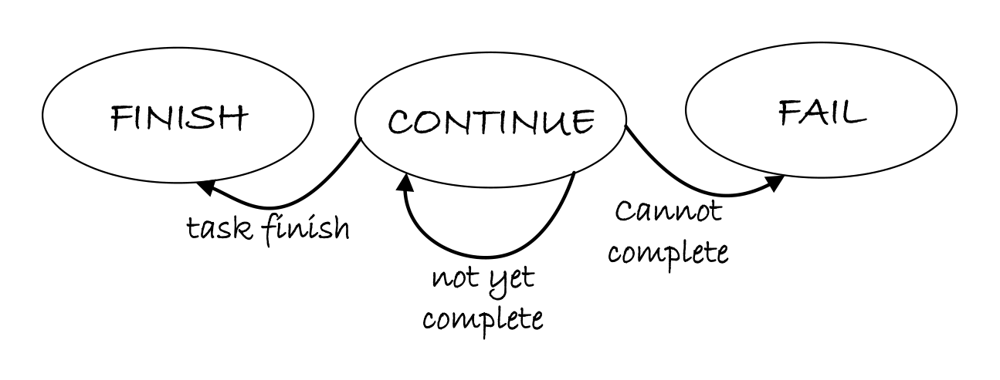
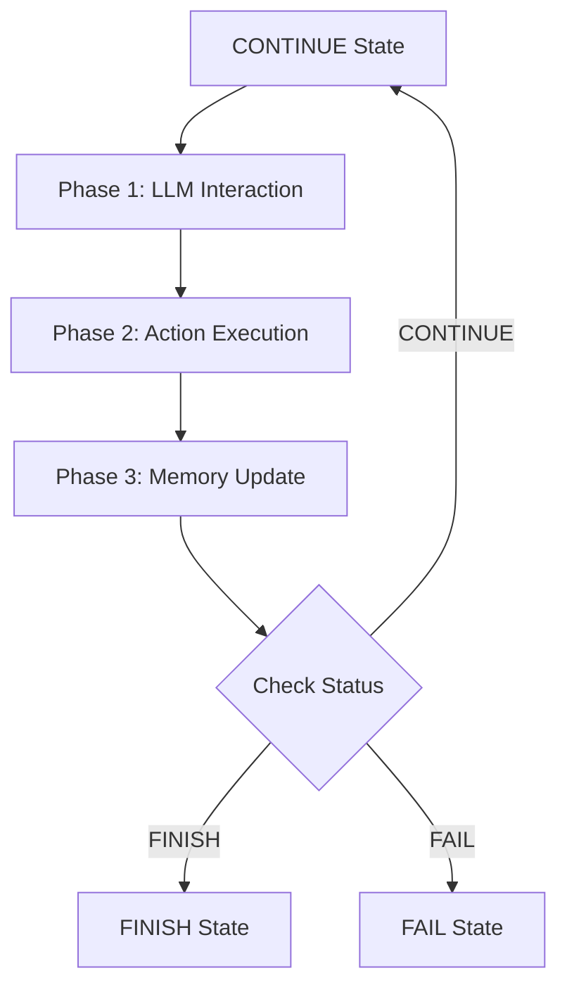

# LinuxAgent State Machine

LinuxAgent uses a **3-state finite state machine (FSM)** to manage CLI task execution flow. The minimal state set captures essential execution progression while maintaining simplicity and predictability. States transition based on LLM decisions and command execution results.

## State Machine Architecture

### State Enumeration

```python
class LinuxAgentStatus(Enum):
    """Store the status of the linux agent"""
    CONTINUE = "CONTINUE"  # Task is ongoing, requires further commands
    FINISH = "FINISH"      # Task completed successfully
    FAIL = "FAIL"          # Task cannot proceed, unrecoverable error
```

### State Management

LinuxAgent states are managed by `LinuxAgentStateManager`, which implements the agent state registry pattern:

```python
class LinuxAgentStateManager(AgentStateManager):
    """Manages the states of the linux agent"""
    _state_mapping: Dict[str, Type[LinuxAgentState]] = {}
    
    @property
    def none_state(self) -> AgentState:
        return NoneLinuxAgentState()
```

All LinuxAgent states are registered using the `@LinuxAgentStateManager.register` decorator, enabling dynamic state lookup by name.

## State Transition Diagram

<figure markdown>
  
  <figcaption><b>Figure:</b> Lifecycle state transitions of the LinuxAgent. The agent starts in CONTINUE state, executes CLI commands iteratively, and transitions to FINISH upon completion or FAIL upon encountering unrecoverable errors.</figcaption>
</figure>

## State Definitions

### 1. CONTINUE State

**Purpose**: Active execution state where LinuxAgent processes the user request and executes CLI commands.

```python
@LinuxAgentStateManager.register
class ContinueLinuxAgentState(LinuxAgentState):
    """The class for the continue linux agent state"""
    
    async def handle(self, agent: "LinuxAgent", context: Optional["Context"] = None):
        """Execute the 3-phase processing pipeline"""
        await agent.process(context)
    
    def is_round_end(self) -> bool:
        return False  # Round continues
    
    def is_subtask_end(self) -> bool:
        return False  # Subtask continues
    
    @classmethod
    def name(cls) -> str:
        return LinuxAgentStatus.CONTINUE.value
```

| Property | Value |
|----------|-------|
| **Type** | Active |
| **Processor Executed** | ✓ Yes (3 phases) |
| **Round Ends** | No |
| **Subtask Ends** | No |
| **Duration** | Single round |
| **Next States** | CONTINUE, FINISH, FAIL |

**Behavior**:

1. Constructs prompts with previous execution results
2. Gets next CLI command from LLM
3. Executes command via MCP server
4. Updates memory with execution results
5. Determines next state based on LLM response

**State Transition Logic**:

- **CONTINUE → CONTINUE**: Task requires more commands to complete
- **CONTINUE → FINISH**: LLM determines task is complete
- **CONTINUE → FAIL**: Unrecoverable error encountered (e.g., permission denied, resource unavailable)

### 2. FINISH State

**Purpose**: Terminal state indicating successful task completion.

```python
@LinuxAgentStateManager.register
class FinishLinuxAgentState(LinuxAgentState):
    """The class for the finish linux agent state"""
    
    def next_agent(self, agent: "LinuxAgent") -> "LinuxAgent":
        return agent
    
    def next_state(self, agent: "LinuxAgent") -> LinuxAgentState:
        return FinishLinuxAgentState()  # Remains in FINISH
    
    def is_subtask_end(self) -> bool:
        return True  # Subtask completed
    
    def is_round_end(self) -> bool:
        return True  # Round ends
    
    @classmethod
    def name(cls) -> str:
        return LinuxAgentStatus.FINISH.value
```

| Property | Value |
|----------|-------|
| **Type** | Terminal |
| **Processor Executed** | ✗ No |
| **Round Ends** | Yes |
| **Subtask Ends** | Yes |
| **Duration** | Permanent |
| **Next States** | FINISH (no transition) |

**Behavior**:

- Signals task completion to session manager
- No further processing occurs
- Agent instance can be terminated

FINISH state is reached when all required CLI commands have been executed successfully, the LLM determines the user request has been fulfilled, and no errors or exceptions occurred during execution.

### 3. FAIL State

**Purpose**: Terminal state indicating task failure due to unrecoverable errors.

```python
@LinuxAgentStateManager.register
class FailLinuxAgentState(LinuxAgentState):
    """The class for the fail linux agent state"""
    
    def next_agent(self, agent: "LinuxAgent") -> "LinuxAgent":
        return agent
    
    def next_state(self, agent: "LinuxAgent") -> LinuxAgentState:
        return FinishLinuxAgentState()  # Transitions to FINISH for cleanup
    
    def is_round_end(self) -> bool:
        return True  # Round ends
    
    def is_subtask_end(self) -> bool:
        return True  # Subtask failed
    
    @classmethod
    def name(cls) -> str:
        return LinuxAgentStatus.FAIL.value
```

| Property | Value |
|----------|-------|
| **Type** | Terminal (Error) |
| **Processor Executed** | ✗ No |
| **Round Ends** | Yes |
| **Subtask Ends** | Yes |
| **Duration** | Transitions to FINISH |
| **Next States** | FINISH |

**Behavior**:

- Logs failure reason and context
- Transitions to FINISH state for cleanup
- Session manager receives failure status

!!!error "Failure Conditions"
    FAIL state is reached when insufficient privileges prevent command execution, required system resources are not accessible (disk full, network unreachable), repeated command syntax errors occur, the LLM explicitly indicates task cannot be completed, or task requirements exceed current system capabilities.

**Error Recovery**:

While FAIL is a terminal state, the error information is logged for debugging:

```python
# Example error logging in FAIL state
agent.logger.error(f"Task failed: {error_message}")
agent.logger.debug(f"Last command: {last_command}")
agent.logger.debug(f"Command output: {stderr}")
```

## State Transition Rules

### Transition Decision Logic

State transitions are determined by the LLM's response in the **CONTINUE** state:

```python
# LLM returns status in response
parsed_response = {
    "action": {
        "command": "df -h",
        "status": "CONTINUE"  # or "FINISH" or "FAIL"
    },
    "thought": "Need to check disk space first"
}

# Agent updates its status based on LLM decision
agent.status = parsed_response["action"]["status"]
next_state = LinuxAgentStateManager().get_state(agent.status)
```

### Transition Matrix

| Current State | Condition | Next State | Trigger |
|---------------|-----------|------------|---------|
| **CONTINUE** | LLM returns CONTINUE | CONTINUE | More commands needed |
| **CONTINUE** | LLM returns FINISH | FINISH | Task completed |
| **CONTINUE** | LLM returns FAIL | FAIL | Unrecoverable error |
| **CONTINUE** | Exception raised | FAIL | System error |
| **FINISH** | Any | FINISH | No transition |
| **FAIL** | Any | FINISH | Cleanup transition |

## State-Specific Processing

### CONTINUE State Processing Pipeline

When in CONTINUE state, LinuxAgent executes the full 3-phase pipeline:



### Terminal States (FINISH / FAIL)

Terminal states perform no processing:

- **FINISH**: Clean termination, results available in memory
- **FAIL**: Error termination, error details logged

## Deterministic Control Flow

The 3-state design ensures deterministic, traceable execution with predictable behavior (every execution path is well-defined), debuggability (state transitions are logged and traceable), testability (finite state space simplifies testing), and maintainability (simple state set reduces complexity).

## Comparison with Other Agents

| Agent | States | Complexity | Use Case |
|-------|--------|------------|----------|
| **LinuxAgent** | 3 | Minimal | CLI task execution |
| **AppAgent** | 6 | Moderate | Windows app automation |
| **HostAgent** | 7 | High | Desktop orchestration |

LinuxAgent's minimal 3-state design reflects its focused scope: execute CLI commands to fulfill user requests. The simplified state machine eliminates unnecessary complexity while maintaining robust error handling and completion detection.

## Implementation Details

The state machine implementation can be found in:

```
ufo/agents/states/linux_agent_state.py
```

Key classes:

- `LinuxAgentStatus`: State enumeration
- `LinuxAgentStateManager`: State registry and lookup
- `LinuxAgentState`: Abstract base class
- `ContinueLinuxAgentState`: Active execution state
- `FinishLinuxAgentState`: Successful completion state
- `FailLinuxAgentState`: Error termination state
- `NoneLinuxAgentState`: Initial/undefined state

## Next Steps

- [Processing Strategy](strategy.md) - Understand the 3-phase processing pipeline executed in CONTINUE state
- [MCP Commands](commands.md) - Explore CLI command execution and system information retrieval
- [Overview](overview.md) - Return to LinuxAgent architecture overview
