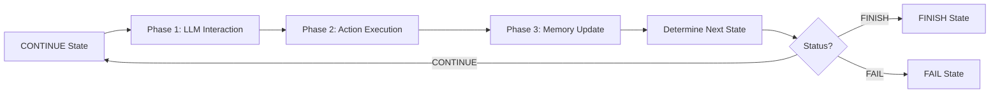
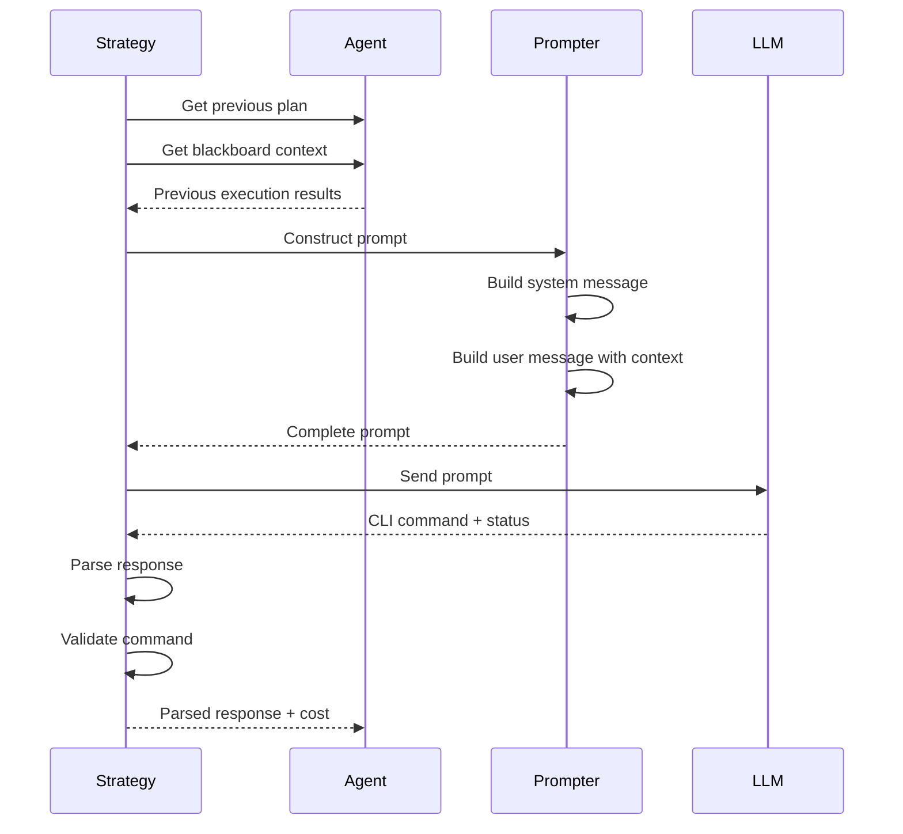
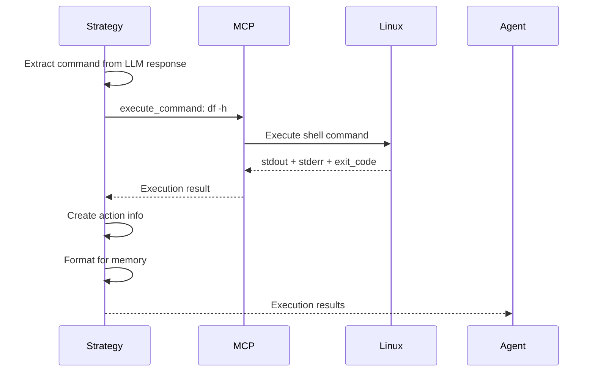
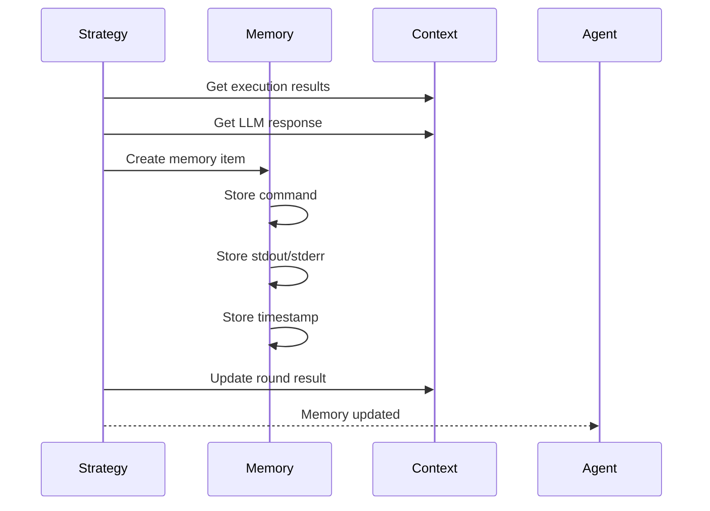
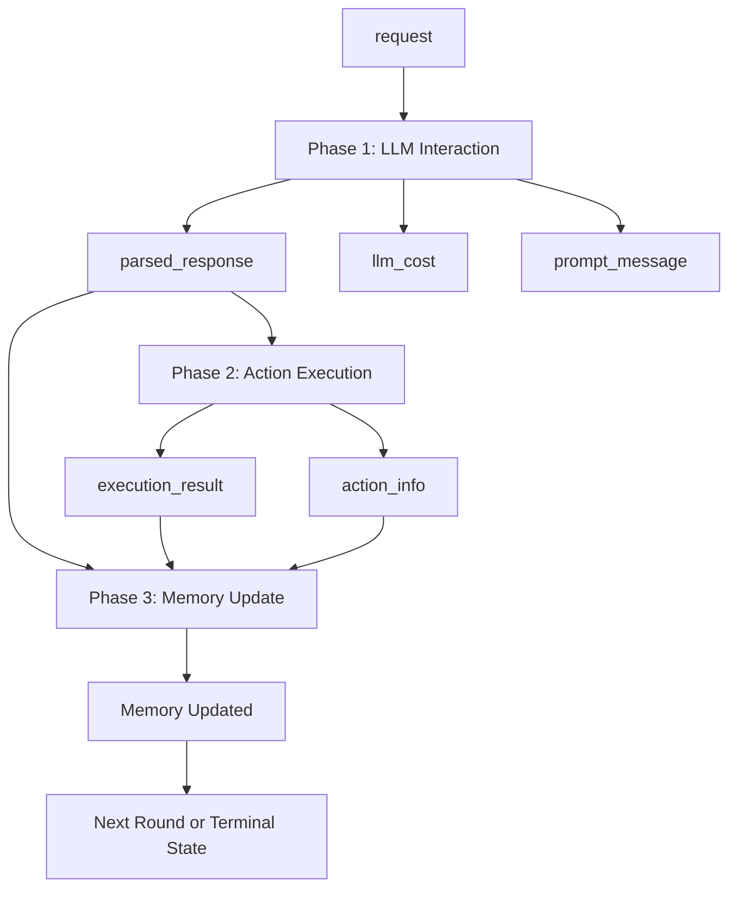

# LinuxAgent Processing Strategy

LinuxAgent executes a **3-phase processing pipeline** in the **CONTINUE** state. Each phase handles a specific aspect of CLI task execution: LLM decision making, action execution, and memory recording. This streamlined design separates prompt construction and LLM reasoning from command execution and state updates, enhancing modularity and traceability.

## Strategy Assembly

Processing strategies are assembled and orchestrated by the `LinuxAgentProcessor` class defined in `ufo/agents/processors/customized/customized_agent_processor.py`. The processor coordinates the 3-phase pipeline execution.

### LinuxAgentProcessor Overview

The `LinuxAgentProcessor` extends `CustomizedProcessor` and manages the Linux-specific workflow:

```python
class LinuxAgentProcessor(CustomizedProcessor):
    """
    Processor for Linux MCP Agent.
    Manages CLI command execution workflow with:
    - LLM-based command generation
    - MCP-based command execution
    - Memory-based result tracking
    """
    
    def _setup_strategies(self) -> None:
        """Setup the 3-phase processing pipeline"""
        
        # Phase 1: LLM Interaction (critical - fail_fast=True)
        self.strategies[ProcessingPhase.LLM_INTERACTION] = (
            LinuxLLMInteractionStrategy(fail_fast=True)
        )
        
        # Phase 2: Action Execution (graceful - fail_fast=False)
        self.strategies[ProcessingPhase.ACTION_EXECUTION] = (
            LinuxActionExecutionStrategy(fail_fast=False)
        )
        
        # Phase 3: Memory Update (graceful - fail_fast=False)
        self.strategies[ProcessingPhase.MEMORY_UPDATE] = (
            AppMemoryUpdateStrategy(fail_fast=False)
        )
```

### Strategy Registration

| Phase | Strategy Class | fail_fast | Rationale |
|-------|---------------|-----------|-----------|
| **LLM_INTERACTION** | `LinuxLLMInteractionStrategy` | ✓ True | LLM failure requires immediate recovery |
| **ACTION_EXECUTION** | `LinuxActionExecutionStrategy` | ✗ False | Command failures can be handled gracefully |
| **MEMORY_UPDATE** | `AppMemoryUpdateStrategy` | ✗ False | Memory failures shouldn't block execution |

**Fail-Fast vs Graceful:**

- **fail_fast=True**: Critical phases where errors should immediately transition to FAIL state
- **fail_fast=False**: Non-critical phases where errors can be logged and execution continues

## Three-Phase Pipeline

### Pipeline Execution Flow



## Phase 1: LLM Interaction Strategy

**Purpose**: Construct prompts with execution context and obtain next CLI command from LLM.

### Strategy Implementation

```python
@depends_on("request")
@provides("parsed_response", "response_text", "llm_cost", 
          "prompt_message", "action", "thought", "comment")
class LinuxLLMInteractionStrategy(AppLLMInteractionStrategy):
    """
    Strategy for LLM interaction with Linux Agent specific prompting.
    
    Handles:
    - Context-aware prompt construction with previous results
    - LLM interaction with retry logic
    - Response parsing and validation
    """
    
    async def execute(self, agent: "LinuxAgent", 
                     context: ProcessingContext) -> ProcessingResult:
        """Execute LLM interaction for Linux Agent"""
```

### Phase 1 Workflow



### Prompt Construction

The strategy constructs comprehensive prompts using:

1. **System Message**: Agent role and capabilities
2. **User Request**: Original task description
3. **Previous Results**: Command outputs from prior executions
4. **Blackboard Context**: Shared state from other agents (if any)
5. **Last Success Actions**: Previously successful commands

```python
prompt_message = agent.message_constructor(
    dynamic_examples=[],        # Few-shot examples (optional)
    dynamic_knowledge="",        # Retrieved knowledge (optional)
    plan=plan,                   # Previous execution plan
    request=request,             # User request
    blackboard_prompt=blackboard_prompt,  # Shared context
    last_success_actions=last_success_actions  # Successful commands
)
```

### LLM Response Format

The LLM returns a structured response:

```json
{
  "thought": "Need to check disk space before creating backup",
  "action": {
    "tool": "execute_command",
    "arguments": {
      "command": "df -h"
    },
    "status": "CONTINUE"
  },
  "comment": "Checking available disk space"
}
```

### Proactive Information Gathering

LinuxAgent proactively requests system information when needed, eliminating unnecessary overhead and increasing responsiveness.

### Error Handling

```python
try:
    response_text, llm_cost = await self._get_llm_response(
        agent, prompt_message
    )
    parsed_response = self._parse_app_response(agent, response_text)
    
    return ProcessingResult(
        success=True,
        data={
            "parsed_response": parsed_response,
            "response_text": response_text,
            "llm_cost": llm_cost,
            ...
        }
    )
except Exception as e:
    self.logger.error(f"LLM interaction failed: {str(e)}")
    return self.handle_error(e, ProcessingPhase.LLM_INTERACTION, context)
```

---

## Phase 2: Action Execution Strategy

**Purpose**: Execute CLI commands returned by LLM and capture structured results.

### Strategy Implementation

```python
class LinuxActionExecutionStrategy(AppActionExecutionStrategy):
    """
    Strategy for executing actions in Linux Agent.
    
    Handles:
    - CLI command execution via MCP server
    - Result capturing (stdout, stderr, exit code)
    - Error handling and retry logic
    """
    
    async def execute(self, agent: "LinuxAgent",
                     context: ProcessingContext) -> ProcessingResult:
        """Execute Linux Agent actions"""
```

### Phase 2 Workflow



### Command Execution

The strategy dispatches commands to the MCP server:

```python
# Extract parsed LLM response
parsed_response: AppAgentResponse = context.get_local("parsed_response")
command_dispatcher = context.global_context.command_dispatcher

# Execute the command via MCP
execution_results = await self._execute_app_action(
    command_dispatcher,
    parsed_response.action
)
```

### Result Capture

Execution results are structured for downstream processing:

```python
{
  "success": True,
  "exit_code": 0,
  "stdout": "Filesystem      Size  Used Avail Use% Mounted on\n/dev/sda1       100G   50G   46G  52% /",
  "stderr": ""
}
```

### Action Info Creation

Results are formatted into `ActionCommandInfo` objects:

```python
actions = self._create_action_info(
    parsed_response.action,
    execution_results,
)

action_info = ListActionCommandInfo(actions)
action_info.color_print()  # Pretty print to console
```

### Error Handling

```python
try:
    execution_results = await self._execute_app_action(...)
    
    return ProcessingResult(
        success=True,
        data={
            "execution_result": execution_results,
            "action_info": action_info,
            "control_log": control_log,
            "status": status
        }
    )
except Exception as e:
    self.logger.error(f"Action execution failed: {traceback.format_exc()}")
    return self.handle_error(e, ProcessingPhase.ACTION_EXECUTION, context)
```

---

## Phase 3: Memory Update Strategy

**Purpose**: Persist execution results and commands into agent memory for future reference.

### Strategy Implementation

LinuxAgent reuses the `AppMemoryUpdateStrategy` from the app agent framework:

```python
self.strategies[ProcessingPhase.MEMORY_UPDATE] = AppMemoryUpdateStrategy(
    fail_fast=False  # Memory failures shouldn't stop process
)
```

### Phase 3 Workflow



### Memory Structure

Each execution round is stored as a memory item:

```python
{
  "round": 1,
  "request": "Check disk space and create backup",
  "thought": "Need to check disk space first",
  "action": {
    "command": "EXEC_CLI",
    "parameters": {"command": "df -h"}
  },
  "result": {
    "stdout": "Filesystem  Size  Used...",
    "stderr": "",
    "exit_code": 0
  },
  "status": "CONTINUE",
  "timestamp": "2025-11-06T10:30:45"
}
```

### Iterative Refinement

Memory enables iterative refinement:

1. **Round 1**: Check disk space → Result: 50G available
2. **Round 2**: Create backup (knowing 50G is available)
3. **Round 3**: Verify backup creation

Each round builds on previous results stored in memory.

### Error Recovery

Memory also stores errors for recovery:

```python
{
  "round": 2,
  "action": {"tool": "execute_command", "arguments": {"command": "invalid_cmd"}},
  "result": {
    "success": False,
    "error": "Command not found: invalid_cmd"
  },
  "status": "FAIL"
}
```

## Middleware Stack

LinuxAgent uses specialized middleware for logging:

```python
def _setup_middleware(self) -> None:
    """Setup middleware pipeline for Linux Agent"""
    self.middleware_chain = [LinuxLoggingMiddleware()]
```

### LinuxLoggingMiddleware

Provides enhanced logging specific to Linux operations:

```python
class LinuxLoggingMiddleware(AppAgentLoggingMiddleware):
    """Specialized logging middleware for Linux Agent"""
    
    def starting_message(self, context: ProcessingContext) -> str:
        request = context.get_local("request")
        return f"Completing the user request [{request}] on Linux."
```

**Logged Information**:

- User request
- Each CLI command executed
- Command outputs (stdout/stderr)
- Execution timestamps
- State transitions
- LLM costs

---

## Context Finalization

After processing, the processor updates global context:

```python
def _finalize_processing_context(self, processing_context: ProcessingContext):
    """Finalize processing context by updating ContextNames fields"""
    super()._finalize_processing_context(processing_context)
    
    try:
        result = processing_context.get_local("result")
        if result:
            self.global_context.set(ContextNames.ROUND_RESULT, result)
    except Exception as e:
        self.logger.warning(f"Failed to update context: {e}")
```

This makes execution results available to:

- Subsequent rounds (iterative execution)
- Other agents (if part of multi-agent workflow)
- Session manager (for monitoring and logging)

---

## Strategy Dependency Graph

The three phases have clear dependencies:



Dependencies are declared using decorators:

```python
@depends_on("request")
@provides("parsed_response", "response_text", "llm_cost", ...)
class LinuxLLMInteractionStrategy(AppLLMInteractionStrategy):
    ...
```

---

## Modular Design Benefits

The 3-phase strategy design provides:

!!!success "Modularity Benefits"
    - **Separation of Concerns**: LLM reasoning, command execution, and memory are isolated
    - **Testability**: Each phase can be tested independently
    - **Extensibility**: New strategies can be added without modifying existing code
    - **Reusability**: Memory strategy is shared with AppAgent
    - **Maintainability**: Clear boundaries between decision-making and execution
    - **Traceability**: Each phase logs its operations independently

---

## Comparison with Other Agents

| Agent | Phases | Data Collection | LLM | Action | Memory |
|-------|--------|----------------|-----|--------|--------|
| **LinuxAgent** | 3 | ✗ None | ✓ CLI commands | ✓ MCP execute_command | ✓ Results |
| **AppAgent** | 4 | ✓ Screenshots + UI | ✓ UI actions | ✓ GUI + API | ✓ Results |
| **HostAgent** | 4 | ✓ Desktop snapshot | ✓ App selection | ✓ Orchestration | ✓ Results |

LinuxAgent omits the **DATA_COLLECTION** phase because there's no GUI to capture (CLI-based), system info is obtained on-demand via MCP tools, and previous execution results provide necessary context. This reflects the proactive information gathering principle.

## Implementation Location

The strategy implementations can be found in:

```
ufo/agents/processors/
├── customized/
│   └── customized_agent_processor.py   # LinuxAgentProcessor
└── strategies/
    └── linux_agent_strategy.py          # Linux-specific strategies
```

Key classes:

- `LinuxAgentProcessor`: Strategy orchestrator
- `LinuxLLMInteractionStrategy`: Prompt construction and LLM interaction
- `LinuxActionExecutionStrategy`: CLI command execution
- `LinuxLoggingMiddleware`: Enhanced logging

## Next Steps

- [MCP Commands](commands.md) - Explore the CLI execution commands used by LinuxAgent
- [State Machine](state.md) - Understand the 3-state FSM that controls strategy execution
- [Overview](overview.md) - Return to LinuxAgent architecture overview
