# Action Servers

## Overview

**Action Servers** provide tools that modify system state by executing actions. These servers enable agents to interact with the environment, automate tasks, and implement decisions.

**Action servers are the only servers whose tools can be selected by the LLM agent.** At each step, the agent chooses which action tool to execute based on the task and current context.

- **LLM Decision**: Agent actively selects from available action tools
- **Dynamic Selection**: Different action chosen at each step based on needs
- **Tool Visibility**: All action tools are presented to the LLM in the prompt

**[Data Collection Servers](./data_collection.md) are NOT LLM-selectable** - they are automatically invoked by the framework.

### How Tool Metadata Becomes LLM Instructions

**Every action tool's implementation directly affects what the LLM sees and understands.** The UFO² framework automatically extracts:

- **`Annotated` type hints**: Parameter types, constraints, and descriptions
- **Docstrings**: Tool purpose, parameter explanations, return value descriptions
- **Function signatures**: Parameter names, defaults, required vs. optional

These are automatically assembled into structured tool instructions that appear in the LLM's prompt. The LLM uses these instructions to understand what each tool does, select the appropriate tool for each step, and call the tool with correct parameters.

**Therefore, developers MUST write clear, comprehensive metadata.** For examples:

- See [AppUIExecutor documentation](servers/app_ui_executor.md) for well-documented UI automation tools
- See [WordCOMExecutor documentation](servers/word_com_executor.md) for COM API tool examples
- See [Creating Custom MCP Servers Tutorial](../tutorials/creating_mcp_servers.md) for step-by-step guide on writing tool metadata

```mermaid
graph TB
    LLM["LLM Agent Decision<br/>(Selects Action Tool)"]
    
    Agent["Agent Decision<br/>'Click OK Button'"]
    
    MCP["MCP Server<br/>Action Server"]
    
    subgraph Tools["Available Action Tools"]
        Click["click()"]
        Type["type_text()"]
        Insert["insert_table()"]
        Shell["run_shell()"]
    end
    
    System["System Modified<br/>✅ Side Effects"]
    
    LLM --> Agent
    Agent --> MCP
    MCP --> Tools
    Tools --> System
    
    style LLM fill:#e3f2fd,stroke:#1976d2,stroke-width:2px
    style Agent fill:#fff3e0,stroke:#f57c00,stroke-width:2px
    style MCP fill:#e8f5e9,stroke:#388e3c,stroke-width:2px
    style Tools fill:#f3e5f5,stroke:#7b1fa2,stroke-width:2px
    style System fill:#ffebee,stroke:#c62828,stroke-width:2px
```



**Side Effects:**

- **✅ Modifies State**: Can change system, files, UI
- **⚠️ Not Idempotent**: Same action may have different results
- **🔒 Use with Caution**: Always verify before executing
- **📝 Audit Trail**: Log all actions for debugging
- **🤖 LLM-Controlled**: Agent decides when and which action to execute

## Tool Type Identifier

All action tools use the tool type:

```python
tool_type = "action"
```

Tool keys follow the format:

```python
tool_key = "action::{tool_name}"

# Examples:
"action::click"
"action::type_text"
"action::run_shell"
```

## Built-in Action Servers

UFO² provides several built-in action servers for different automation scenarios. Below is a summary - click each server name for detailed documentation including all tools, parameters, and usage examples.

### UI Automation Servers

| Server | Agent | Description | Documentation |
|--------|-------|-------------|---------------|
| **[HostUIExecutor](servers/host_ui_executor.md)** | HostAgent | Window selection and desktop-level UI automation | [Full Details →](servers/host_ui_executor.md) |
| **[AppUIExecutor](servers/app_ui_executor.md)** | AppAgent | Application-level UI automation (clicks, typing, scrolling) | [Full Details →](servers/app_ui_executor.md) |

### Command Execution Servers

| Server | Platform | Description | Documentation |
|--------|----------|-------------|---------------|
| **[CommandLineExecutor](servers/command_line_executor.md)** | Windows | Execute shell commands and launch applications | [Full Details →](servers/command_line_executor.md) |
| **[BashExecutor](servers/bash_executor.md)** | Linux | Execute Linux commands via HTTP server | [Full Details →](servers/bash_executor.md) |

### Office Automation Servers (COM API)

| Server | Application | Description | Documentation |
|--------|-------------|-------------|---------------|
| **[WordCOMExecutor](servers/word_com_executor.md)** | Microsoft Word | Word document automation (insert table, format text, etc.) | [Full Details →](servers/word_com_executor.md) |
| **[ExcelCOMExecutor](servers/excel_com_executor.md)** | Microsoft Excel | Excel automation (insert data, create charts, etc.) | [Full Details →](servers/excel_com_executor.md) |
| **[PowerPointCOMExecutor](servers/ppt_com_executor.md)** | Microsoft PowerPoint | PowerPoint automation (slides, formatting, etc.) | [Full Details →](servers/ppt_com_executor.md) |

### Specialized Servers

| Server | Purpose | Description | Documentation |
|--------|---------|-------------|---------------|
| **[PDFReaderExecutor](servers/pdf_reader_executor.md)** | PDF Processing | Extract text from PDFs with human simulation | [Full Details →](servers/pdf_reader_executor.md) |
| **[ConstellationEditor](servers/constellation_editor.md)** | Multi-Device | Create and manage multi-device task workflows | [Full Details →](servers/constellation_editor.md) |
| **[HardwareExecutor](servers/hardware_executor.md)** | Hardware Control | Control Arduino, robot arms, test fixtures, mobile devices | [Full Details →](servers/hardware_executor.md) |

**Quick Reference:** Each server documentation page includes:

- 📋 **Complete tool reference** with all parameters and return values
- 💡 **Code examples** showing actual usage patterns
- ⚙️ **Configuration examples** for different scenarios
- ✅ **Best practices** with do's and don'ts
- 🎯 **Use cases** with complete workflows

## Configuration Examples

Action servers are configured in `config/ufo/mcp.yaml`. Each server's documentation provides detailed configuration examples.

### Basic Configuration

```yaml
HostAgent:
  default:
    action:
      - namespace: HostUIExecutor
        type: local
        reset: false
      - namespace: CommandLineExecutor
        type: local
        reset: false
```

### App-Specific Configuration

```yaml
AppAgent:
  # Default configuration for all apps
  default:
    action:
      - namespace: AppUIExecutor
        type: local
        reset: false
  
  # Word-specific configuration
  WINWORD.EXE:
    action:
      - namespace: AppUIExecutor
        type: local
        reset: false
      - namespace: WordCOMExecutor
        type: local
        reset: true  # Reset when switching documents
  
  # Excel-specific configuration
  EXCEL.EXE:
    action:
      - namespace: AppUIExecutor
        type: local
        reset: false
      - namespace: ExcelCOMExecutor
        type: local
        reset: true  # Reset when switching workbooks
```

### Multi-Platform Configuration

```yaml
# Windows agent
HostAgent:
  default:
    action:
      - namespace: HostUIExecutor
        type: local
      - namespace: CommandLineExecutor
        type: local

# Linux agent
LinuxAgent:
  default:
    action:
      - namespace: BashExecutor
        type: http
        host: "192.168.1.100"
        port: 8010
        path: "/mcp"
```

For complete configuration details, see:

- [MCP Configuration Guide](configuration.md) - Complete configuration reference
- Individual server documentation for server-specific configuration options

## Best Practices

### General Principles

#### 1. Verify Before Acting

Always observe before executing actions:

```python
# ✅ Good: Verify target exists
control_info = await computer.run_actions([
    MCPToolCall(tool_key="data_collection::get_control_info", ...)
])

if control_info[0].data and control_info[0].data["is_enabled"]:
    await computer.run_actions([
        MCPToolCall(tool_key="action::click", ...)
    ])
```

#### 2. Handle Action Failures

Actions can fail for many reasons - always implement error handling and retries.

#### 3. Validate Inputs

Never execute unsanitized commands, especially with `run_shell` and similar tools.

#### 4. Wait for Action Completion

Some actions need time to complete - add appropriate delays after launching applications or triggering UI changes.

For detailed best practices including code examples, error handling patterns, and common pitfalls, see the individual server documentation:

- [HostUIExecutor Best Practices](servers/host_ui_executor.md)
- [AppUIExecutor Best Practices](servers/app_ui_executor.md)
- [CommandLineExecutor Best Practices](servers/command_line_executor.md)
- [WordCOMExecutor Best Practices](servers/word_com_executor.md)
- [ExcelCOMExecutor Best Practices](servers/excel_com_executor.md)
- [PowerPointCOMExecutor Best Practices](servers/ppt_com_executor.md)
- [PDFReaderExecutor Best Practices](servers/pdf_reader_executor.md)
- [ConstellationEditor Best Practices](servers/constellation_editor.md)
- [HardwareExecutor Best Practices](servers/hardware_executor.md)
- [BashExecutor Best Practices](servers/bash_executor.md)

## Common Use Cases

For complete use case examples with detailed workflows, see the individual server documentation:

### UI Automation

- **Form Filling**: [AppUIExecutor](servers/app_ui_executor.md)
- **Window Management**: [HostUIExecutor](servers/host_ui_executor.md)

### Document Automation

- **Word Processing**: [WordCOMExecutor](servers/word_com_executor.md)
- **Excel Data Processing**: [ExcelCOMExecutor](servers/excel_com_executor.md)
- **PowerPoint Generation**: [PowerPointCOMExecutor](servers/ppt_com_executor.md)
- **PDF Extraction**: [PDFReaderExecutor](servers/pdf_reader_executor.md)

### System Automation

- **Application Launching**: [CommandLineExecutor](servers/command_line_executor.md)
- **Linux Command Execution**: [BashExecutor](servers/bash_executor.md)

### Multi-Device Workflows

- **Task Distribution**: [ConstellationEditor](servers/constellation_editor.md)
- **Hardware Control**: [HardwareExecutor](servers/hardware_executor.md)

## Error Handling

Action servers implement robust error handling with timeouts and retries. For detailed error handling patterns specific to each server, see:

- [HostUIExecutor](servers/host_ui_executor.md)
- [AppUIExecutor](servers/app_ui_executor.md)
- [CommandLineExecutor](servers/command_line_executor.md)
- [BashExecutor](servers/bash_executor.md)
- And other server-specific documentation

### General Timeout Handling

Actions are executed with a timeout (default: 6000 seconds):

```python
try:
    result = await computer.run_actions([
        MCPToolCall(tool_key="action::run_shell", ...)
    ])
except asyncio.TimeoutError:
    logger.error("Action timed out after 6000 seconds")
    # Cleanup or retry logic...
```

### General Retry Pattern

```python
async def retry_action(action: MCPToolCall, max_retries: int = 3):
    """Retry an action with exponential backoff."""
    for attempt in range(max_retries):
        try:
            result = await computer.run_actions([action])
            if not result[0].is_error:
                return result[0]
            logger.warning(f"Attempt {attempt + 1} failed: {result[0].content}")
            if attempt < max_retries - 1:
                await asyncio.sleep(2 ** attempt)  # Exponential backoff
        except Exception as e:
            logger.error(f"Exception on attempt {attempt + 1}: {e}")
            if attempt < max_retries - 1:
                await asyncio.sleep(2 ** attempt)
    raise ValueError(f"Action failed after {max_retries} attempts")
```

## Integration with Data Collection

Actions should be paired with data collection for verification:

```python
# Pattern: Observe → Act → Verify

# 1. Observe: Capture initial state
before_screenshot = await computer.run_actions([
    MCPToolCall(tool_key="data_collection::take_screenshot", ...)
])

# 2. Act: Execute action
action_result = await computer.run_actions([
    MCPToolCall(tool_key="action::click", ...)
])

# 3. Verify: Check result
await asyncio.sleep(1)  # Wait for UI update
after_screenshot = await computer.run_actions([
    MCPToolCall(tool_key="data_collection::take_screenshot", ...)
])
```

For more details on agent execution patterns:

- [HostAgent Commands](../ufo2/host_agent/commands.md) - HostAgent command patterns
- [AppAgent Commands](../ufo2/app_agent/commands.md) - AppAgent action patterns
- [Agent Overview](../ufo2/overview.md) - UFO² agent architecture

For more details on data collection:

- [Data Collection Servers](data_collection.md) - Observation tools
- [UICollector Documentation](servers/ui_collector.md) - Complete data collection reference

## Related Documentation

- [Data Collection Servers](data_collection.md) - Observation tools
- [Configuration Guide](configuration.md) - Configure action servers
- [Local Servers](local_servers.md) - Built-in action servers overview
- [Remote Servers](remote_servers.md) - HTTP deployment for actions
- [Computer](../client/computer.md) - Action execution layer
- [MCP Overview](overview.md) - High-level MCP architecture

**Safety Reminder:** Action servers can **modify system state**. Always:

1. ✅ **Validate inputs** before execution
2. ✅ **Verify targets** exist and are accessible
3. ✅ **Log all actions** for audit trail
4. ✅ **Handle failures** gracefully with retries
5. ✅ **Test in safe environment** before production use
