# Data Collection Servers

## Overview

**Data Collection Servers** provide read-only tools that observe and retrieve system state without modifying it. These servers are essential for agents to understand the current environment before taking actions.

**Data Collection servers are automatically invoked by the UFO² framework** to gather context and build observation prompts for the LLM. The LLM agent **does not select these tools** - they run in the background to provide system state information.

- **Framework-Driven**: Automatically called to collect screenshots, UI controls, system info
- **Observation Purpose**: Build the prompt that the LLM uses for decision-making
- **Not in Tool List**: These tools are NOT presented to the LLM as selectable actions

**Only [Action Servers](./action.md) are LLM-selectable.**

```mermaid
graph TB
    Framework["UFO² Framework<br/>(Automatic Invocation)"]
    
    AgentStep["Agent Step<br/>Observation & Prompt Build"]
    
    MCP["MCP Server<br/>UICollector"]
    
    subgraph Tools["Data Collection Tools"]
        Screenshot["take_screenshot()"]
        WindowList["get_window_list()"]
        ControlInfo["get_control_info()"]
    end
    
    SystemState["System State<br/>→ LLM Context"]
    
    Framework --> AgentStep
    Framework --> MCP
    MCP --> Tools
    Tools --> SystemState
    SystemState --> AgentStep
    
    style Framework fill:#e3f2fd,stroke:#1976d2,stroke-width:2px
    style AgentStep fill:#fff3e0,stroke:#f57c00,stroke-width:2px
    style MCP fill:#e8f5e9,stroke:#388e3c,stroke-width:2px
    style Tools fill:#f3e5f5,stroke:#7b1fa2,stroke-width:2px
    style SystemState fill:#fce4ec,stroke:#c2185b,stroke-width:2px
```



**Characteristics:**

- **❌ No Side Effects**: Cannot modify system state
- **✅ Safe to Retry**: Can be called multiple times without risk
- **✅ Idempotent**: Same input always produces same output
- **📊 Observation Only**: Provides information for decision-making
- **🤖 Framework-Invoked**: Not selectable by LLM agent

## Tool Type Identifier

All data collection tools use the tool type:

```python
tool_type = "data_collection"
```

Tool keys follow the format:

```python
tool_key = "data_collection::{tool_name}"

# Examples:
"data_collection::take_screenshot"
"data_collection::get_window_list"
"data_collection::get_control_info"
```

## Built-in Data Collection Servers

### UICollector

**Purpose**: Collect UI element information and screenshots

**Namespace**: `UICollector`

**Platform**: Windows (using pywinauto)

**Tools**: 8 tools for UI observation including screenshots, window lists, control info, and annotations

For complete documentation including all tool details, parameters, return types, and usage examples, see:

**[→ UICollector Full Documentation](servers/ui_collector.md)**

#### Quick Example

```python
from aip.messages import Command

# Take a screenshot of the active window
screenshot_cmd = Command(
    tool_name="take_screenshot",
    tool_type="data_collection",
    parameters={
        "region": "active_window",
        "save_path": "screenshots/current.png"
    }
)

# Get list of all windows
windows_cmd = Command(
    tool_name="get_window_list",
    tool_type="data_collection",
    parameters={}
)
```

For detailed tool specifications, advanced usage patterns, and best practices, see the [UICollector documentation](servers/ui_collector.md).

## Configuration Examples

Data collection servers are configured in `config/ufo/mcp.yaml`. For detailed configuration options, see the [UICollector documentation](servers/ui_collector.md#configuration).

### Basic Configuration

```yaml
HostAgent:
  default:
    data_collection:
      - namespace: UICollector
        type: local
        start_args: []
        reset: false
```

### Multi-Server Configuration

```yaml
HostAgent:
  default:
    data_collection:
      - namespace: UICollector
        type: local
        reset: false
```

### App-Specific Configuration

```yaml
AppAgent:
  WINWORD.EXE:
    data_collection:
      - namespace: UICollector
        type: local
        reset: false  # Don't reset when switching between documents
  
  EXCEL.EXE:
    data_collection:
      - namespace: UICollector
        type: local
        reset: true  # Reset when switching between spreadsheets
```

## Best Practices

For detailed best practices with complete code examples, see the [UICollector documentation](servers/ui_collector.md).

### General Guidelines

#### 1. Call Before Action

Always collect data before executing actions to make informed decisions.

#### 2. Cache Results

Data collection results can be cached when state hasn't changed to improve performance.

#### 3. Handle Failures Gracefully

Data collection can fail if windows close or controls disappear - implement proper error handling.

#### 4. Minimize Screenshot Calls

Screenshots are expensive operations - take one screenshot and analyze it multiple times rather than taking multiple screenshots.

5. **Use Appropriate Regions**

Choose the smallest region that contains needed information (e.g., active window vs. full screen).

See the [UICollector documentation](servers/ui_collector.md) for detailed examples and anti-patterns.

## Common Use Cases

For complete use case examples with detailed code, see the [UICollector documentation](servers/ui_collector.md).

### UI Element Detection

Discover windows and controls for automation targeting.

### Screen Monitoring

Monitor screen changes for event-driven automation.

### System Health Check

Check system resources before executing heavy tasks.

See the [UICollector documentation](servers/ui_collector.md) for complete workflow examples.

## Error Handling

For detailed error handling patterns, see the [UICollector documentation](servers/ui_collector.md).

### Common Errors

| Error | Cause | Solution |
|-------|-------|----------|
| `WindowNotFoundError` | Target window closed | Check window existence first |
| `ControlNotFoundError` | Control not accessible | Use alternative identification method |
| `ScreenshotFailedError` | Graphics driver issue | Retry with different region |
| `TimeoutError` | Operation took too long | Increase timeout or simplify query |

See the [UICollector documentation](servers/ui_collector.md) for complete error recovery examples.

## Performance Considerations

For detailed performance optimization techniques, see the [UICollector documentation](servers/ui_collector.md).

### Key Optimizations

- **Screenshot Optimization**: Use region parameters to capture only needed areas
- **Parallel Data Collection**: Collect independent data in parallel when possible
- **Caching**: Cache results when state hasn't changed

See the [UICollector documentation](servers/ui_collector.md) for complete examples.

## Integration with Agents

Data collection servers are typically used in the **observation phase** of agent execution. See the [UICollector documentation](servers/ui_collector.md) for complete integration patterns.

For more details on agent architecture and execution flow:

- [HostAgent Overview](../ufo2/host_agent/overview.md) - HostAgent architecture and workflow
- [AppAgent Overview](../ufo2/app_agent/overview.md) - AppAgent architecture and workflow
- [Agent Overview](../ufo2/overview.md) - UFO² agent system architecture

```python
# Agent execution loop
while not task_complete:
    # 1. Observe: Collect current state
    screenshot = await data_collection_server.take_screenshot()
    
    # 2. Reason: Agent decides next action
    next_action = agent.plan(screenshot)
    
    # 3. Act: Execute action
    result = await action_server.execute(next_action)
    
    # 4. Verify: Check action result
    new_screenshot = await data_collection_server.take_screenshot()
```

## Related Documentation

- **[UICollector Full Documentation](servers/ui_collector.md)** - Complete tool reference with all parameters and examples
- [Action Servers](action.md) - State-changing execution tools
- [Configuration Guide](configuration.md) - How to configure data collection servers
- [Local Servers](local_servers.md) - Built-in local MCP servers
- [Remote Servers](remote_servers.md) - HTTP deployment for data collection
- [Computer](../client/computer.md) - Tool execution layer
- [MCP Overview](overview.md) - High-level MCP architecture

**Key Takeaways:**

- Data collection servers are **read-only** and **safe to retry**
- Always **observe before acting** to make informed decisions
- **Cache results** when state hasn't changed to improve performance
- Handle **errors gracefully** with retries and fallback logic
- Use **appropriate regions** and **parallel collection** for performance
- See the **[UICollector documentation](servers/ui_collector.md)** for complete details
