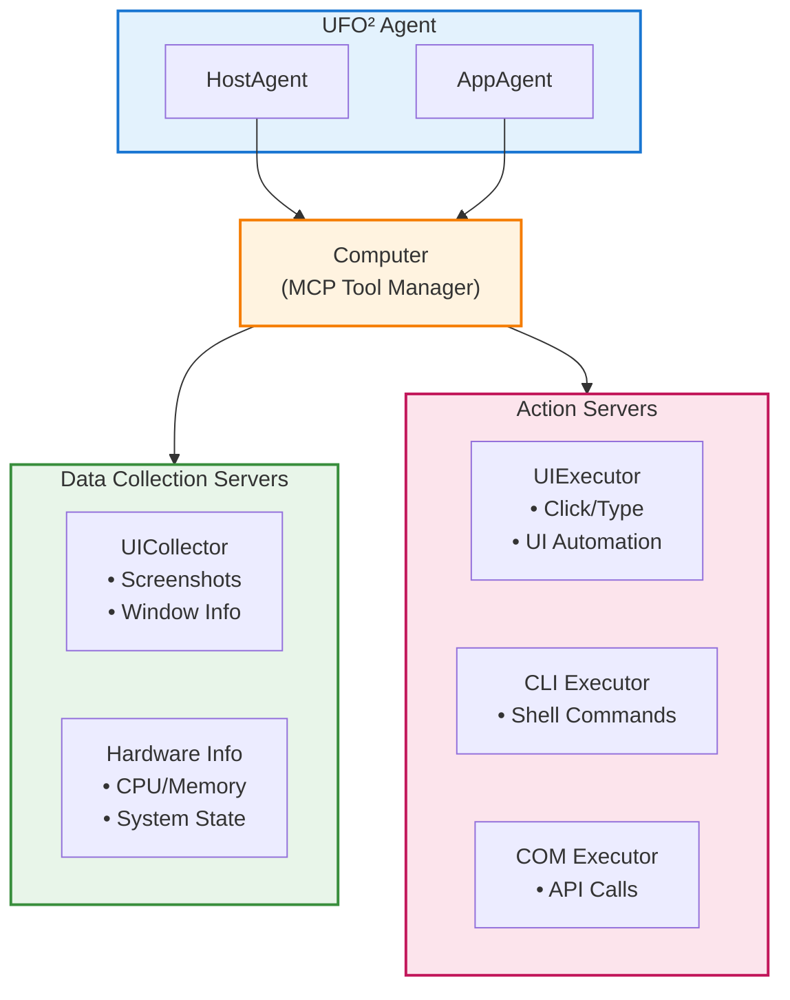
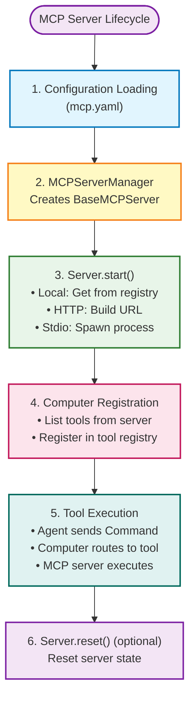
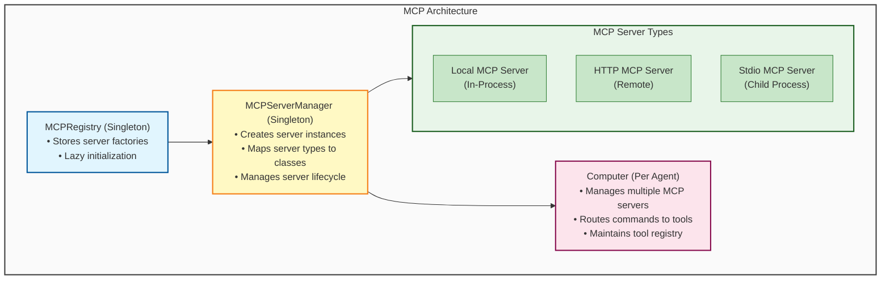

# MCP (Model Context Protocol) - Overview

## What is MCP?

**MCP (Model Context Protocol)** is a standardized protocol that enables UFO² agents to interact with external tools and services in a unified way. It provides a **tool execution framework** where agents can:

- **Collect system state** through data collection servers
- **Execute actions** through action servers
- **Extend capabilities** through custom MCP servers



MCP serves as the **execution layer** in UFO²'s architecture. While agents make decisions about *what* to do, MCP servers handle *how* to do it by providing concrete tool implementations.

## Key Concepts

### 1. Two Server Types

MCP servers in UFO² are categorized into two types based on their purpose:

| Type | Purpose | Examples | Side Effects | LLM Selectable? |
|------|---------|----------|--------------|-----------------|
| **Data Collection** | Retrieve system state<br>Read-only operations | UI detection, Screenshot, System info | ❌ None | ❌ **No** - Auto-invoked |
| **Action** | Modify system state<br>State-changing operations | Click, Type text, Run command | ✅ Yes | ✅ **Yes** - LLM chooses |

**Server Selection Model:**

- **[Data Collection Servers](./data_collection.md)**: Automatically invoked by the framework to gather context and build observation prompts. Not selectable by LLM.
- **[Action Servers](./action.md)**: LLM agent actively selects which action tool to execute at each step based on the task. Only action tools are LLM-selectable.

**How Action Tools Reach the LLM**: Each action tool's `Annotated` type hints and docstring are automatically extracted and converted into structured instructions that appear in the LLM's prompt. The LLM uses these instructions to understand what each tool does, what parameters it requires, and when to use it. Therefore, developers should write clear, comprehensive docstrings and type annotations - they directly impact the LLM's ability to use the tool correctly.

### 2. Server Deployment Models

UFO² supports three deployment models for MCP servers:

| Model | Description | Benefits | Trade-offs |
|-------|-------------|----------|------------|
| **Local (In-Process)** | Server runs in same process as agent | Fast (no IPC overhead), Simple setup | Shares process resources |
| **HTTP (Remote)** | Server runs as HTTP service (e.g., Port 8006) | Process isolation, Language-agnostic | Network overhead |
| **Stdio (Process)** | Server runs as child process using stdin/stdout | Process isolation, Bidirectional streaming | Platform-specific |

### 3. Namespace Isolation

Each MCP server has a **namespace** that groups related tools together:

```yaml
# Example: HostAgent configuration
HostAgent:
  default:
    data_collection:
      - namespace: UICollector          # Namespace for UI detection tools
        type: local
    action:
      - namespace: HostUIExecutor       # Namespace for UI automation tools
        type: local
      - namespace: CommandLineExecutor  # Namespace for CLI tools
        type: local
```

**Tool Key Format**: `{tool_type}::{tool_name}`

- Example: `data_collection::screenshot` - Screenshot tool in data_collection
- Example: `action::click` - Click tool in action
- Example: `action::run_shell` - Shell command in action

## Key Features

### 1. GUI + API Dual-Mode Automation

**UFO² supports both GUI automation and API-based automation simultaneously.** Each agent can register multiple action servers, combining:

- **GUI Automation**: Windows UI Automation (UIA) - clicking, typing, scrolling when visual interaction is needed
- **API Automation**: Direct COM API calls, shell commands, REST APIs for efficient, reliable operations

**The LLM agent dynamically chooses the best action at each step** based on task requirements, reliability, speed, and availability.

**Example: Word Document Automation**

```yaml
AppAgent:
  WINWORD.EXE:
    action:
      - namespace: WordCOMExecutor      # API: Fast, reliable
      - namespace: AppUIExecutor        # GUI: Visual navigation fallback  
      - namespace: CommandLineExecutor  # Shell: File operations
```

**LLM's Dynamic Selection:**

```
Task: "Create a report with a 3x2 table and bold the title"

Step 1: Insert table
  → LLM selects: WordCOMExecutor::insert_table(rows=3, cols=2)
  → Reason: API is fast, reliable, no GUI navigation needed

Step 2: Navigate to Design tab  
  → LLM selects: AppUIExecutor::click_input(id="5", name="Design")
  → Reason: Visual navigation, COM API doesn't expose tab selection

Step 3: Type table header
  → LLM selects: AppUIExecutor::set_edit_text(id="cell_1_1", text="Product")
  → Reason: GUI interaction needed for cell input

Step 4: Bold title text
  → LLM selects: WordCOMExecutor::select_text(text="Report Title")
  →            WordCOMExecutor::set_font(font_size=16)
  → Reason: API is more reliable than GUI button clicking

Step 5: Save as PDF
  → LLM selects: WordCOMExecutor::save_as(file_ext=".pdf")
  → Reason: One API call vs. multiple GUI clicks (File → Save As → Format → PDF)
```

**Why Hybrid Automation Matters:**

- **APIs**: ~10x faster, deterministic, no visual dependency
- **GUI**: Handles visual elements, fallback when API unavailable
- **LLM Decision**: Chooses optimal approach per step, not locked into one mode

### 2. Multi-Server Per Agent

Each agent can register **multiple action servers**, each providing a different set of tools:

**HostAgent Example:**
```yaml
HostAgent:
  default:
    data_collection:
      - UICollector           # Automatically invoked
    action:
      - HostUIExecutor        # LLM selects: Window selection
      - CommandLineExecutor   # LLM selects: Launch apps, shell commands
```

**AppAgent Example (Word-specific):**
```yaml
AppAgent:
  WINWORD.EXE:
    data_collection:
      - UICollector           # Automatically invoked
    action:
      - WordCOMExecutor       # LLM selects: insert_table, select_text, save_as
      - AppUIExecutor         # LLM selects: click_input, set_edit_text
      - CommandLineExecutor   # LLM selects: run_shell
```

**HardwareAgent Example (Cross-platform):**
```yaml
HardwareAgent:
  default:
    data_collection:
      - HardwareCollector     # Auto-invoked (HTTP remote)
    action:
      - HardwareExecutor      # LLM selects: touch_screen, swipe, press_key (HTTP remote)
```

**At each step, the LLM sees all available action tools and selects the most appropriate one.**

### 3. Process Isolation

MCP servers can run:

- **In-process** (local): Fast, low overhead
- **HTTP** (remote): Process isolation, cross-platform, distributed
- **Stdio** (child process): Sandboxed execution, clean resource management

### 4. Namespace Isolation

Each MCP server has a unique namespace that groups related tools together, preventing naming conflicts and enabling modular organization. See [Namespace Isolation](#3-namespace-isolation) section above for details.

## Architecture

### MCP Server Lifecycle



### Component Relationships



## Built-in MCP Servers

UFO² comes with several **built-in MCP servers** that cover common automation scenarios:

### Data Collection Servers

| Namespace | Purpose | Key Tools | Platform |
|-----------|---------|-----------|----------|
| **UICollector** | UI element detection | `get_control_info`, `take_screenshot`, `get_window_list` | Windows |
| **HardwareCollector** | Hardware information | `get_cpu_info`, `get_memory_info` | Cross-platform |
| **MobileDataCollector** | Android device observation | `capture_screenshot`, `get_ui_tree`, `get_device_info`, `get_mobile_app_target_info` | Android (ADB) |

### Action Servers

| Namespace | Purpose | Key Tools | Platform |
|-----------|---------|-----------|----------|
| **HostUIExecutor** | UI automation (host-level) | `click`, `type_text`, `scroll` | Windows |
| **AppUIExecutor** | UI automation (app-level) | `click`, `type_text`, `set_edit_text` | Windows |
| **CommandLineExecutor** | CLI execution | `run_shell` | Cross-platform |
| **WordCOMExecutor** | Word automation | `insert_table`, `select_text`, `format_text` | Windows |
| **ExcelCOMExecutor** | Excel automation | `insert_cell`, `select_range`, `format_cell` | Windows |
| **PowerPointCOMExecutor** | PowerPoint automation | `insert_slide`, `add_text`, `format_shape` | Windows |
| **ConstellationEditor** | Multi-device coordination | `create_task`, `assign_device` | Cross-platform |
| **BashExecutor** | Linux commands | `execute_bash` | Linux |
| **MobileExecutor** | Android device control | `tap`, `swipe`, `type_text`, `launch_app`, `click_control` | Android (ADB) |

!!!example "Tool Examples"
    ```python
    # Data Collection: Take a screenshot
    {
        "tool_type": "data_collection",
        "tool_name": "take_screenshot",
        "parameters": {"region": "active_window"}
    }
    
    # Action: Click a button
    {
        "tool_type": "action",
        "tool_name": "click",
        "parameters": {"control_label": "Submit"}
    }
    
    # Action: Run a shell command
    {
        "tool_type": "action",
        "tool_name": "run_shell",
        "parameters": {"bash_command": "notepad.exe"}
    }
    ```

## Agent-Specific Configurations

Different agents can have **different MCP configurations** based on their roles:

```yaml
# HostAgent: System-level operations
HostAgent:
  default:
    data_collection:
      - namespace: UICollector
        type: local
    action:
      - namespace: HostUIExecutor
        type: local
      - namespace: CommandLineExecutor
        type: local

# AppAgent: Application-specific operations
AppAgent:
  WINWORD.EXE:  # Word-specific configuration
    data_collection:
      - namespace: UICollector
        type: local
    action:
      - namespace: AppUIExecutor
        type: local
      - namespace: WordCOMExecutor  # Word COM API
        type: local
        reset: true  # Reset when switching documents

# HardwareAgent: Remote hardware monitoring
HardwareAgent:
  default:
    data_collection:
      - namespace: HardwareCollector
        type: http  # Remote server
        host: "localhost"
        port: 8006
        path: "/mcp"

# MobileAgent: Android device automation
MobileAgent:
  default:
    data_collection:
      - namespace: MobileDataCollector
        type: http  # Remote server
        host: "localhost"
        port: 8020
        path: "/mcp"
    action:
      - namespace: MobileExecutor
        type: http
        host: "localhost"
        port: 8021
        path: "/mcp"
```

**Configuration Hierarchy:**

Agent configurations follow this hierarchy:

1. **Agent Name** (e.g., `HostAgent`, `AppAgent`)
2. **Sub-type** (e.g., `default`, `WINWORD.EXE`)
3. **Tool Type** (e.g., `data_collection`, `action`)
4. **Server List** (array of server configurations)

## Key Features

### 1. Process Isolation with Reset

Some MCP servers support **state reset** to ensure clean execution:

```yaml
AppAgent:
  WINWORD.EXE:
    action:
      - namespace: WordCOMExecutor
        type: local
        reset: true

**When to use reset:**

- Server state is cleared when switching contexts
- Prevents state leakage between tasks
- Useful for stateful tools (e.g., COM APIs)

### 2. Thread Isolation

MCP tools execute in **isolated thread pools** to prevent blocking:

```python
# From Computer class
self._executor = ThreadPoolExecutor(max_workers=10)
self._tool_timeout = 6000  # 100 minutes
```

**Benefits**:
- Prevents blocking the main event loop
- Protects WebSocket connections from timeouts
- Enables concurrent tool execution

**Timeout Protection:** If a tool takes longer than 6000 seconds, it will be cancelled and return a timeout error. Adjust `_tool_timeout` for long-running operations.

### 3. Dynamic Server Management

Add or remove MCP servers at runtime:

```python
# Add a custom server
await computer.add_server(
    namespace="CustomTools",
    mcp_server=custom_server,
    tool_type="action"
)

# Remove a server
await computer.delete_server(
    namespace="CustomTools",
    tool_type="action"
)
```

### 4. Tool Introspection

Use meta tools to discover available tools:

```python
# List all action tools
tool_call = MCPToolCall(
    tool_key="action::list_tools",
    tool_name="list_tools",
    parameters={"tool_type": "action"}
)

result = await computer.run_actions([tool_call])
# Returns: List of all available action tools
```

For more details on introspection capabilities, see [Computer - Meta Tools](../client/computer.md#meta-tools).

## Configuration Files

MCP configuration is located at:

```
config/ufo/mcp.yaml
```

For detailed configuration options, see:

- [MCP Configuration Guide](configuration.md) - Complete configuration reference
- [System Configuration](../configuration/system/system_config.md) - MCP-related system settings  
- [MCP Reference](../configuration/system/mcp_reference.md) - MCP-specific settings

## Use Cases

### 1. UI Automation

```yaml
# Agent that automates UI interactions
HostAgent:
  default:
    data_collection:
      - namespace: UICollector        # Detect UI elements
    action:
      - namespace: HostUIExecutor     # Click, type, scroll
```

### 2. Document Processing

```yaml
# Agent specialized for Word documents
AppAgent:
  WINWORD.EXE:
    data_collection:
      - namespace: UICollector        # Read document structure
    action:
      - namespace: WordCOMExecutor    # Insert tables, format text
```

### 3. Multi-Device Coordination

```yaml
# Agent that coordinates tasks across devices
ConstellationAgent:
  default:
    action:
      - namespace: ConstellationEditor  # Create and assign tasks
```

### 4. Remote Hardware Monitoring

```yaml
# Agent that monitors remote hardware
HardwareAgent:
  default:
    data_collection:
      - namespace: HardwareCollector
        type: http
        host: "192.168.1.100"
        port: 8006
```

### 5. Android Device Automation

```yaml
# Agent that automates Android devices via ADB
MobileAgent:
  default:
    data_collection:
      - namespace: MobileDataCollector
        type: http
        host: "localhost"  # Or remote Android automation server
        port: 8020
        path: "/mcp"
    action:
      - namespace: MobileExecutor
        type: http
        host: "localhost"
        port: 8021
        path: "/mcp"
```

## Getting Started

To start using MCP in UFO²:

1. **Understand the two server types** - Read about [Data Collection](data_collection.md) and [Action](action.md) servers
2. **Configure your agents** - See [Configuration Guide](configuration.md) for setup details
3. **Use built-in servers** - Explore available [Local Servers](local_servers.md)
4. **Create custom servers** - Follow the [Creating Custom MCP Servers Tutorial](../tutorials/creating_mcp_servers.md)
5. **Deploy remotely** - Learn about [Remote Servers](remote_servers.md) deployment

## Related Documentation

- [Data Collection Servers](data_collection.md) - Read-only observation tools
- [Action Servers](action.md) - State-changing execution tools
- [Configuration Guide](configuration.md) - How to configure MCP for agents
- [Local Servers](local_servers.md) - Built-in MCP servers
- [Remote Servers](remote_servers.md) - HTTP and Stdio deployment
- [Creating Custom MCP Servers Tutorial](../tutorials/creating_mcp_servers.md) - Step-by-step guide to building custom servers
- [Computer](../client/computer.md) - MCP tool execution layer
- [Agent Client](../client/overview.md) - Client architecture overview
- [Agent Overview](../ufo2/overview.md) - UFO² agent system architecture

**Design Philosophy:**

MCP in UFO² follows the **separation of concerns** principle:

- **Agents** decide *what* to do (high-level planning)
- **MCP servers** implement *how* to do it (low-level execution)
- **Computer** manages the routing between them (middleware)

This architecture enables flexibility, extensibility, and maintainability.
