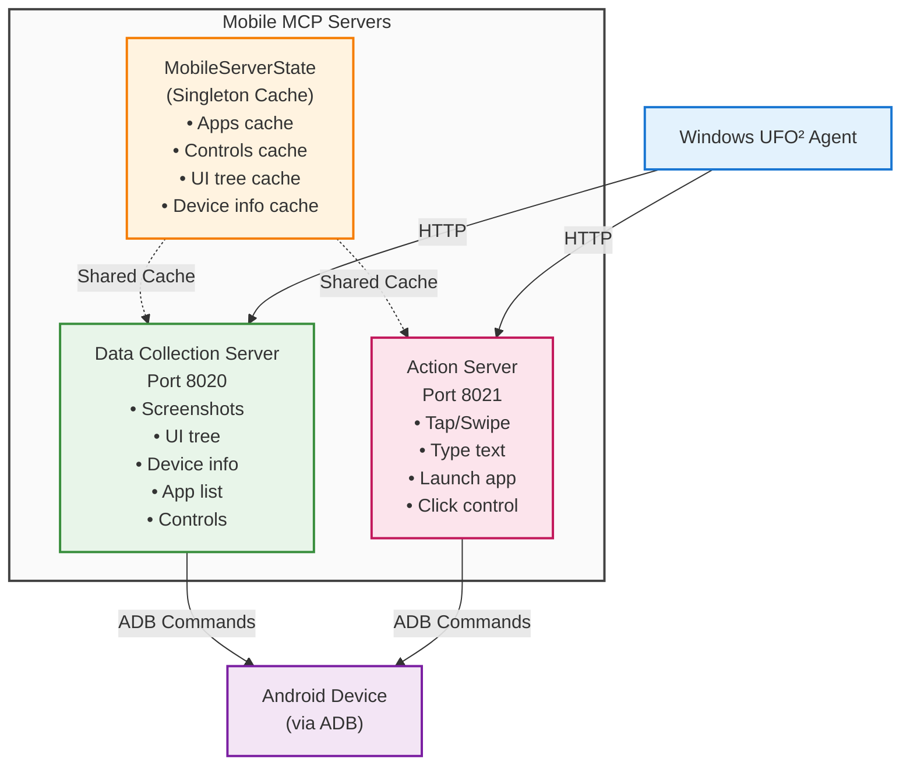

# MobileExecutor Server

## Overview

**MobileExecutor** provides Android mobile device automation via ADB (Android Debug Bridge). It runs as **two separate HTTP servers** that share state for coordinated operations:

- **Mobile Data Collection Server** (port 8020): Screenshots, UI tree, device info, app list, controls
- **Mobile Action Server** (port 8021): Tap, swipe, type, launch apps, press keys

**Server Type:** Action + Data Collection  
**Deployment:** HTTP (remote server, runs on machine with ADB)  
**Default Ports:** 8020 (data), 8021 (action)  
**LLM-Selectable:** ✅ Yes (action tools only)  
**Platform:** Android devices via ADB

## Server Information

| Property | Value |
|----------|-------|
| **Namespace** | `MobileDataCollector` (data), `MobileExecutor` (action) |
| **Server Names** | `Mobile Data Collection MCP Server`, `Mobile Action MCP Server` |
| **Platform** | Android (via ADB) |
| **Tool Types** | `data_collection`, `action` |
| **Deployment** | HTTP server (stateless with shared cache) |
| **Architecture** | Dual-server with singleton state manager |

## Architecture

### Dual-Server Design

The mobile MCP server uses a **dual-server architecture** similar to `linux_mcp_server.py`:



**Shared State Benefits:**

- **Cache Coordination**: Action server can access controls cached by data server
- **Performance**: Avoid duplicate ADB queries (UI tree, app list, etc.)
- **State Consistency**: Both servers see same device state
- **Resource Efficiency**: Single process, shared memory

### State Management

**MobileServerState** is a singleton that caches:

| Cache | Duration | Purpose |
|-------|----------|---------|
| **Installed Apps** | 5 minutes | Package list for `get_mobile_app_target_info` |
| **UI Controls** | 5 seconds | Control list for `get_app_window_controls_target_info` |
| **UI Tree XML** | 5 seconds | Raw XML for `get_ui_tree` |
| **Device Info** | 1 minute | Hardware specs for `get_device_info` |

**Cache Invalidation:**

- Automatically invalidated after interactions (tap, swipe, type)
- Manually invalidated via `invalidate_cache` tool
- Expired caches refreshed on next query

## Data Collection Tools

Data collection tools are automatically invoked by the framework, not selectable by LLM.

### capture_screenshot

Capture screenshot from Android device.

#### Parameters

None

#### Returns

**Type**: `str`

Base64-encoded image data URI directly (format: `data:image/png;base64,...`)

#### Example

```python
result = await computer.run_data_collection([
    MCPToolCall(
        tool_key="data_collection::capture_screenshot",
        tool_name="capture_screenshot",
        parameters={}
    )
])

# result[0].data = "data:image/png;base64,iVBORw0KGgo..."
```

#### Implementation Details

1. Captures screenshot on device (`screencap -p /sdcard/screen_temp.png`)
2. Pulls image from device via ADB (`adb pull`)
3. Encodes as base64
4. Cleans up temporary files
5. Returns data URI directly (matches `ui_mcp_server` format)

---

### get_ui_tree

Get the UI hierarchy tree in XML format.

#### Parameters

None

#### Returns

**Type**: `Dict[str, Any]`

```python
{
    "success": bool,
    "ui_tree": str,      # XML content
    "format": "xml",
    # OR
    "error": str         # Error message if failed
}
```

#### Example

```python
result = await computer.run_data_collection([
    MCPToolCall(
        tool_key="data_collection::get_ui_tree",
        tool_name="get_ui_tree",
        parameters={}
    )
])

# Parse XML to find elements
import xml.etree.ElementTree as ET
tree = ET.fromstring(result[0].data["ui_tree"])
```

#### Cache Behavior

- Cached for 5 seconds
- Automatically invalidated after interactions
- Shared with `get_app_window_controls_target_info`

---

### get_device_info

Get comprehensive Android device information.

#### Parameters

None

#### Returns

**Type**: `Dict[str, Any]`

```python
{
    "success": bool,
    "device_info": {
        "model": str,              # Device model
        "android_version": str,    # Android version (e.g., "13")
        "sdk_version": str,        # SDK version (e.g., "33")
        "screen_size": str,        # Screen resolution (e.g., "Physical size: 1080x2400")
        "screen_density": str,     # Screen density (e.g., "Physical density: 440")
        "battery_level": str,      # Battery percentage
        "battery_status": str      # Charging status
    },
    "from_cache": bool,  # True if returned from cache
    # OR
    "error": str         # Error message if failed
}
```

#### Example

```python
result = await computer.run_data_collection([
    MCPToolCall(
        tool_key="data_collection::get_device_info",
        tool_name="get_device_info",
        parameters={}
    )
])

device = result[0].data["device_info"]
print(f"Device: {device['model']}")
print(f"Android: {device['android_version']}")
print(f"Battery: {device['battery_level']}%")
```

#### Cache Behavior

- Cached for 1 minute
- Returns `from_cache: true` when using cached data

---

### get_mobile_app_target_info

Get information about installed application packages as `TargetInfo` list.

#### Parameters

| Parameter | Type | Required | Default | Description |
|-----------|------|----------|---------|-------------|
| `filter` | `str` | No | `""` | Filter pattern for package names (e.g., `"com.android"`) |
| `include_system_apps` | `bool` | No | `False` | Whether to include system apps (default: only user apps) |
| `force_refresh` | `bool` | No | `False` | Force refresh from device, ignoring cache |

#### Returns

**Type**: `List[TargetInfo]`

```python
[
    TargetInfo(
        kind=TargetKind.THIRD_PARTY_AGENT,
        id="1",                    # Sequential ID
        name="com.example.app",    # Package name (displayed)
        type="com.example.app"     # Package name (stored)
    ),
    ...
]
```

#### Example

```python
# Get all user-installed apps
result = await computer.run_data_collection([
    MCPToolCall(
        tool_key="data_collection::get_mobile_app_target_info",
        tool_name="get_mobile_app_target_info",
        parameters={"include_system_apps": False}
    )
])

apps = result[0].data
for app in apps:
    print(f"ID: {app.id}, Package: {app.name}")

# Filter by package name
result = await computer.run_data_collection([
    MCPToolCall(
        tool_key="data_collection::get_mobile_app_target_info",
        tool_name="get_mobile_app_target_info",
        parameters={"filter": "com.android", "include_system_apps": True}
    )
])
```

#### Cache Behavior

- Cached for 5 minutes (only when no filter and `include_system_apps=False`)
- Use `force_refresh=True` to bypass cache

---

### get_app_window_controls_target_info

Get UI controls information as `TargetInfo` list.

#### Parameters

| Parameter | Type | Required | Default | Description |
|-----------|------|----------|---------|-------------|
| `force_refresh` | `bool` | No | `False` | Force refresh from device, ignoring cache |

#### Returns

**Type**: `List[TargetInfo]`

```python
[
    TargetInfo(
        kind=TargetKind.CONTROL,
        id="1",                    # Sequential ID
        name="Button Name",        # Control text or content-desc
        type="Button",             # Control class (short name)
        rect=[x1, y1, x2, y2]     # Bounding box [left, top, right, bottom]
    ),
    ...
]
```

#### Example

```python
result = await computer.run_data_collection([
    MCPToolCall(
        tool_key="data_collection::get_app_window_controls_target_info",
        tool_name="get_app_window_controls_target_info",
        parameters={}
    )
])

controls = result[0].data
for ctrl in controls:
    print(f"ID: {ctrl.id}, Name: {ctrl.name}, Type: {ctrl.type}")
    print(f"  Rect: {ctrl.rect}")
```

#### Control Selection Criteria

Only **meaningful controls** are included:

- Clickable controls (`clickable="true"`)
- Long-clickable controls (`long-clickable="true"`)
- Checkable controls (`checkable="true"`)
- Scrollable controls (`scrollable="true"`)
- Controls with text or content-desc
- EditText and Button controls

**Rect format**: `[left, top, right, bottom]` in pixels (matches `ui_mcp_server.py` bbox format)

#### Cache Behavior

- Cached for 5 seconds
- Automatically invalidated after interactions (tap, swipe, type)
- Shared with action server for `click_control` and `type_text`

---

## Action Tools

Action tools are LLM-selectable, state-modifying operations.

### tap

Tap/click at specified coordinates on the screen.

#### Parameters

| Parameter | Type | Required | Description |
|-----------|------|----------|-------------|
| `x` | `int` | ✅ Yes | X coordinate in pixels (from left) |
| `y` | `int` | ✅ Yes | Y coordinate in pixels (from top) |

#### Returns

**Type**: `Dict[str, Any]`

```python
{
    "success": bool,
    "action": str,       # "tap(x, y)"
    "output": str,       # Command output
    "error": str         # Error message if failed
}
```

#### Example

```python
# Tap at specific coordinates
result = await computer.run_actions([
    MCPToolCall(
        tool_key="action::tap",
        tool_name="tap",
        parameters={"x": 500, "y": 1200}
    )
])
```

#### Side Effects

- Invalidates controls cache (UI likely changed)

---

### swipe

Perform swipe gesture from start to end coordinates.

#### Parameters

| Parameter | Type | Required | Default | Description |
|-----------|------|----------|---------|-------------|
| `start_x` | `int` | ✅ Yes | - | Starting X coordinate |
| `start_y` | `int` | ✅ Yes | - | Starting Y coordinate |
| `end_x` | `int` | ✅ Yes | - | Ending X coordinate |
| `end_y` | `int` | ✅ Yes | - | Ending Y coordinate |
| `duration` | `int` | No | `300` | Duration in milliseconds |

#### Returns

**Type**: `Dict[str, Any]`

```python
{
    "success": bool,
    "action": str,       # "swipe(x1,y1)->(x2,y2) in Nms"
    "output": str,
    "error": str
}
```

#### Example

```python
# Swipe up (scroll down content)
result = await computer.run_actions([
    MCPToolCall(
        tool_key="action::swipe",
        tool_name="swipe",
        parameters={
            "start_x": 500,
            "start_y": 1500,
            "end_x": 500,
            "end_y": 500,
            "duration": 300
        }
    )
])

# Swipe left (next page)
result = await computer.run_actions([
    MCPToolCall(
        tool_key="action::swipe",
        tool_name="swipe",
        parameters={
            "start_x": 800,
            "start_y": 1000,
            "end_x": 200,
            "end_y": 1000,
            "duration": 200
        }
    )
])
```

#### Side Effects

- Invalidates controls cache (UI changed)

---

### type_text

Type text into a specific input field control.

#### Parameters

| Parameter | Type | Required | Default | Description |
|-----------|------|----------|---------|-------------|
| `text` | `str` | ✅ Yes | - | Text to input (spaces/special chars auto-escaped) |
| `control_id` | `str` | ✅ Yes | - | Precise annotated ID from `get_app_window_controls_target_info` |
| `control_name` | `str` | ✅ Yes | - | Precise name of control (must match `control_id`) |
| `clear_current_text` | `bool` | No | `False` | Clear existing text before typing |

#### Returns

**Type**: `Dict[str, Any]`

```python
{
    "success": bool,
    "action": str,               # Full action description
    "message": str,              # Step-by-step messages
    "control_info": {
        "id": str,
        "name": str,
        "type": str
    },
    # OR
    "error": str                 # Error message
}
```

#### Example

```python
# 1. Get controls first
controls = await computer.run_data_collection([
    MCPToolCall(
        tool_key="data_collection::get_app_window_controls_target_info",
        tool_name="get_app_window_controls_target_info",
        parameters={}
    )
])

# 2. Find search input field
search_field = next(c for c in controls[0].data if "Search" in c.name)

# 3. Type text
result = await computer.run_actions([
    MCPToolCall(
        tool_key="action::type_text",
        tool_name="type_text",
        parameters={
            "text": "hello world",
            "control_id": search_field.id,
            "control_name": search_field.name,
            "clear_current_text": True
        }
    )
])
```

#### Workflow

1. Verifies control exists in cache (requires prior `get_app_window_controls_target_info` call)
2. Clicks control to focus it
3. Optionally clears existing text (deletes up to 50 characters)
4. Types text (spaces replaced with `%s`, `&` escaped)
5. Invalidates controls cache

#### Side Effects

- Clicks the control (may trigger navigation)
- Modifies input field content
- Invalidates controls cache

---

### launch_app

Launch an application by package name or app ID.

#### Parameters

| Parameter | Type | Required | Default | Description |
|-----------|------|----------|---------|-------------|
| `package_name` | `str` | ✅ Yes | - | Package name (e.g., `"com.android.settings"`) or app name |
| `id` | `str` | No | `None` | Optional: Precise annotated ID from `get_mobile_app_target_info` |

#### Returns

**Type**: `Dict[str, Any]`

```python
{
    "success": bool,
    "message": str,
    "package_name": str,    # Actual package launched
    "output": str,          # ADB monkey output
    "error": str,
    "warning": str,         # Optional: name resolution warning
    "app_info": {           # Optional: if id provided
        "id": str,
        "name": str,
        "package": str
    }
}
```

#### Example

```python
# Launch by package name
result = await computer.run_actions([
    MCPToolCall(
        tool_key="action::launch_app",
        tool_name="launch_app",
        parameters={"package_name": "com.android.settings"}
    )
])

# Launch by app ID (from cache)
apps = await computer.run_data_collection([
    MCPToolCall(
        tool_key="data_collection::get_mobile_app_target_info",
        tool_name="get_mobile_app_target_info",
        parameters={}
    )
])

settings_app = next(a for a in apps[0].data if "settings" in a.name.lower())

result = await computer.run_actions([
    MCPToolCall(
        tool_key="action::launch_app",
        tool_name="launch_app",
        parameters={
            "package_name": settings_app.type,  # Package from cache
            "id": settings_app.id
        }
    )
])

# Launch by app name (auto-resolves package)
result = await computer.run_actions([
    MCPToolCall(
        tool_key="action::launch_app",
        tool_name="launch_app",
        parameters={"package_name": "Settings"}  # Resolves to com.android.settings
    )
])
```

#### Name Resolution

If `package_name` doesn't contain `.` (not a package format):

1. Searches installed packages for matching display name
2. Returns resolved package with warning
3. Fails if no match found

#### Implementation

Uses `adb shell monkey -p <package> -c android.intent.category.LAUNCHER 1`

---

### press_key

Press a hardware or software key.

#### Parameters

| Parameter | Type | Required | Description |
|-----------|------|----------|-------------|
| `key_code` | `str` | ✅ Yes | Key code (e.g., `"KEYCODE_HOME"`, `"KEYCODE_BACK"`) |

#### Returns

**Type**: `Dict[str, Any]`

```python
{
    "success": bool,
    "action": str,       # "press_key(KEYCODE_X)"
    "output": str,
    "error": str
}
```

#### Example

```python
# Press back button
result = await computer.run_actions([
    MCPToolCall(
        tool_key="action::press_key",
        tool_name="press_key",
        parameters={"key_code": "KEYCODE_BACK"}
    )
])

# Press home button
result = await computer.run_actions([
    MCPToolCall(
        tool_key="action::press_key",
        tool_name="press_key",
        parameters={"key_code": "KEYCODE_HOME"}
    )
])

# Press enter
result = await computer.run_actions([
    MCPToolCall(
        tool_key="action::press_key",
        tool_name="press_key",
        parameters={"key_code": "KEYCODE_ENTER"}
    )
])
```

#### Common Key Codes

| Key Code | Description |
|----------|-------------|
| `KEYCODE_HOME` | Home button |
| `KEYCODE_BACK` | Back button |
| `KEYCODE_ENTER` | Enter/Return |
| `KEYCODE_MENU` | Menu button |
| `KEYCODE_POWER` | Power button |
| `KEYCODE_VOLUME_UP` | Volume up |
| `KEYCODE_VOLUME_DOWN` | Volume down |

Full list: [Android KeyEvent](https://developer.android.com/reference/android/view/KeyEvent)

---

### click_control

Click a UI control by its ID and name.

#### Parameters

| Parameter | Type | Required | Description |
|-----------|------|----------|-------------|
| `control_id` | `str` | ✅ Yes | Precise annotated ID from `get_app_window_controls_target_info` |
| `control_name` | `str` | ✅ Yes | Precise name of control (must match `control_id`) |

#### Returns

**Type**: `Dict[str, Any]`

```python
{
    "success": bool,
    "action": str,               # Full action description
    "message": str,              # Success message with coordinates
    "control_info": {
        "id": str,
        "name": str,
        "type": str,
        "rect": [int, int, int, int]
    },
    "warning": str,              # Optional: name mismatch warning
    # OR
    "error": str                 # Error message
}
```

#### Example

```python
# 1. Get controls
controls = await computer.run_data_collection([
    MCPToolCall(
        tool_key="data_collection::get_app_window_controls_target_info",
        tool_name="get_app_window_controls_target_info",
        parameters={}
    )
])

# 2. Find OK button
ok_button = next(c for c in controls[0].data if c.name == "OK")

# 3. Click it
result = await computer.run_actions([
    MCPToolCall(
        tool_key="action::click_control",
        tool_name="click_control",
        parameters={
            "control_id": ok_button.id,
            "control_name": ok_button.name
        }
    )
])
```

#### Workflow

1. Retrieves control from cache by `control_id`
2. Verifies name matches (warns if different)
3. Calculates center position from bounding box
4. Taps at center coordinates
5. Invalidates controls cache

#### Side Effects

- Taps the control (may trigger navigation)
- Invalidates controls cache

---

### wait

Wait for a specified number of seconds.

#### Parameters

| Parameter | Type | Required | Default | Description |
|-----------|------|----------|---------|-------------|
| `seconds` | `float` | No | `1.0` | Number of seconds to wait (0-60 range) |

#### Returns

**Type**: `Dict[str, Any]`

```python
{
    "success": bool,
    "action": str,       # "wait(Ns)"
    "message": str,      # "Waited for N seconds"
    # OR
    "error": str         # Error if invalid seconds
}
```

#### Example

```python
# Wait 1 second
result = await computer.run_actions([
    MCPToolCall(
        tool_key="action::wait",
        tool_name="wait",
        parameters={"seconds": 1.0}
    )
])

# Wait 500ms
result = await computer.run_actions([
    MCPToolCall(
        tool_key="action::wait",
        tool_name="wait",
        parameters={"seconds": 0.5}
    )
])

# Wait 2.5 seconds
result = await computer.run_actions([
    MCPToolCall(
        tool_key="action::wait",
        tool_name="wait",
        parameters={"seconds": 2.5}
    )
])
```

#### Constraints

- Minimum: 0 seconds
- Maximum: 60 seconds
- Use for UI transitions, animations, app loading

---

### invalidate_cache

Manually invalidate cached data to force refresh on next query.

#### Parameters

| Parameter | Type | Required | Default | Description |
|-----------|------|----------|---------|-------------|
| `cache_type` | `str` | No | `"all"` | Type of cache: `"controls"`, `"apps"`, `"ui_tree"`, `"device_info"`, `"all"` |

#### Returns

**Type**: `Dict[str, Any]`

```python
{
    "success": bool,
    "message": str,      # Confirmation message
    # OR
    "error": str         # Invalid cache_type
}
```

#### Example

```python
# Invalidate all caches
result = await computer.run_actions([
    MCPToolCall(
        tool_key="action::invalidate_cache",
        tool_name="invalidate_cache",
        parameters={"cache_type": "all"}
    )
])

# Invalidate only controls cache
result = await computer.run_actions([
    MCPToolCall(
        tool_key="action::invalidate_cache",
        tool_name="invalidate_cache",
        parameters={"cache_type": "controls"}
    )
])
```

#### Cache Types

| Type | Description |
|------|-------------|
| `"controls"` | UI controls list |
| `"apps"` | Installed apps list |
| `"ui_tree"` | UI hierarchy XML |
| `"device_info"` | Device information |
| `"all"` | All caches |

#### Use Cases

- After manual device interaction (outside automation)
- After app installation/uninstallation
- When device state significantly changed
- Before critical operations requiring fresh data

---

## Configuration

### Client Configuration (UFO² Agent)

```yaml
# Windows agent controlling Android device
MobileAgent:
  default:
    data_collection:
      - namespace: MobileDataCollector
        type: http
        host: "localhost"  # Or remote machine IP
        port: 8020
        path: "/mcp"
    action:
      - namespace: MobileExecutor
        type: http
        host: "localhost"
        port: 8021
        path: "/mcp"

# Remote Android device
MobileAgent:
  default:
    data_collection:
      - namespace: MobileDataCollector
        type: http
        host: "192.168.1.150"  # Android automation server
        port: 8020
        path: "/mcp"
    action:
      - namespace: MobileExecutor
        type: http
        host: "192.168.1.150"
        port: 8021
        path: "/mcp"
```

## Deployment

### Prerequisites

1. **ADB Installation**

```bash
# Windows (via Android SDK or standalone)
# Download from: https://developer.android.com/studio/releases/platform-tools

# Linux
sudo apt-get install android-tools-adb

# macOS
brew install android-platform-tools
```

2. **Android Device Setup**

- Enable USB debugging in Developer Options
- Connect device via USB or Wi-Fi
- Verify connection: `adb devices`

```bash
# Check connected devices
adb devices

# Output:
# List of devices attached
# R5CR20XXXXX    device
```

### Starting the Servers

```bash
# Start both servers (recommended)
python -m ufo.client.mcp.http_servers.mobile_mcp_server --server both --host 0.0.0.0 --data-port 8020 --action-port 8021

# Output:
# ==================================================
# UFO Mobile MCP Servers (Android)
# Android device control via ADB and Model Context Protocol
# ==================================================
# Using ADB: C:\...\adb.exe
# Found 1 connected device(s)
# ✅ Starting both servers in same process (shared MobileServerState)
#    - Data Collection Server: 0.0.0.0:8020
#    - Action Server: 0.0.0.0:8021
# Both servers share MobileServerState cache. Press Ctrl+C to stop.

# Start only data collection server
python -m ufo.client.mcp.http_servers.mobile_mcp_server --server data --host 0.0.0.0 --data-port 8020

# Start only action server
python -m ufo.client.mcp.http_servers.mobile_mcp_server --server action --host 0.0.0.0 --action-port 8021
```

### Command-Line Arguments

| Argument | Default | Description |
|----------|---------|-------------|
| `--server` | `both` | Which server(s): `data`, `action`, or `both` |
| `--host` | `localhost` | Host to bind servers to |
| `--data-port` | `8020` | Port for Data Collection Server |
| `--action-port` | `8021` | Port for Action Server |
| `--adb-path` | Auto-detect | Path to ADB executable |

### ADB Path Detection

The server auto-detects ADB from:

1. Common installation paths:
   - Windows: `C:\Users\{USER}\AppData\Local\Android\Sdk\platform-tools\adb.exe`
   - Linux: `/usr/bin/adb`, `/usr/local/bin/adb`
2. System PATH environment variable
3. Fallback to `adb` command

Override with `--adb-path`:

```bash
python -m ufo.client.mcp.http_servers.mobile_mcp_server --adb-path "C:\custom\path\adb.exe"
```

### Network Configuration

**Local Development:**
```bash
# Servers on same machine as client
--host localhost
```

**Remote Access:**
```bash
# Servers accessible from network
--host 0.0.0.0
```

**Security:** Use firewall rules to restrict access to trusted IPs.

---

## Best Practices

### 1. Always Run Both Servers Together

```bash
# ✅ Good: Both servers in same process (shared state)
python -m ufo.client.mcp.http_servers.mobile_mcp_server --server both

# ❌ Bad: Separate processes (no shared state)
python -m ufo.client.mcp.http_servers.mobile_mcp_server --server data &
python -m ufo.client.mcp.http_servers.mobile_mcp_server --server action &
```

**Why:** Shared `MobileServerState` enables action server to access controls cached by data server.

### 2. Get Controls Before Interaction

```python
# ✅ Good: Get controls first
controls = await computer.run_data_collection([
    MCPToolCall(tool_key="data_collection::get_app_window_controls_target_info", ...)
])

# Then click/type
await computer.run_actions([
    MCPToolCall(tool_key="action::click_control", parameters={"control_id": "5", ...})
])

# ❌ Bad: Click without getting controls
await computer.run_actions([
    MCPToolCall(tool_key="action::click_control", parameters={"control_id": "5", ...})
])
# Error: Control not found in cache
```

### 3. Use Control IDs, Not Coordinates

```python
# ✅ Good: Use click_control (reliable)
await computer.run_actions([
    MCPToolCall(
        tool_key="action::click_control",
        parameters={"control_id": "3", "control_name": "Submit"}
    )
])

# ⚠️ OK: Use tap only when control not available
await computer.run_actions([
    MCPToolCall(
        tool_key="action::tap",
        parameters={"x": 500, "y": 1200}
    )
])
```

### 4. Handle Cache Expiration

```python
# Check if controls are stale
controls = await computer.run_data_collection([
    MCPToolCall(
        tool_key="data_collection::get_app_window_controls_target_info",
        parameters={"force_refresh": False}  # Use cache if available
    )
])

# For critical operations, force refresh
controls = await computer.run_data_collection([
    MCPToolCall(
        tool_key="data_collection::get_app_window_controls_target_info",
        parameters={"force_refresh": True}  # Always query device
    )
])
```

### 5. Wait After Actions

```python
# ✅ Good: Wait for UI to settle
await computer.run_actions([
    MCPToolCall(tool_key="action::tap", parameters={"x": 500, "y": 1200})
])
await computer.run_actions([
    MCPToolCall(tool_key="action::wait", parameters={"seconds": 1.0})
])

# Get updated controls
controls = await computer.run_data_collection([
    MCPToolCall(tool_key="data_collection::get_app_window_controls_target_info", ...)
])
```

### 6. Validate ADB Connection

```python
# Check device info before operations
device_info = await computer.run_data_collection([
    MCPToolCall(tool_key="data_collection::get_device_info", parameters={})
])

if device_info[0].is_error:
    raise RuntimeError("No Android device connected")
```

---

## Use Cases

### 1. App Automation

```python
# Launch app
await computer.run_actions([
    MCPToolCall(
        tool_key="action::launch_app",
        tool_name="launch_app",
        parameters={"package_name": "com.example.app"}
    )
])

# Wait for app to load
await computer.run_actions([
    MCPToolCall(tool_key="action::wait", parameters={"seconds": 2.0})
])

# Get controls
controls = await computer.run_data_collection([
    MCPToolCall(
        tool_key="data_collection::get_app_window_controls_target_info",
        parameters={}
    )
])

# Find and click button
login_btn = next(c for c in controls[0].data if "Login" in c.name)
await computer.run_actions([
    MCPToolCall(
        tool_key="action::click_control",
        parameters={
            "control_id": login_btn.id,
            "control_name": login_btn.name
        }
    )
])
```

### 2. Form Filling

```python
# Get controls
controls = await computer.run_data_collection([
    MCPToolCall(
        tool_key="data_collection::get_app_window_controls_target_info",
        parameters={}
    )
])

# Type username
username_field = next(c for c in controls[0].data if "username" in c.name.lower())
await computer.run_actions([
    MCPToolCall(
        tool_key="action::type_text",
        tool_name="type_text",
        parameters={
            "text": "john.doe@example.com",
            "control_id": username_field.id,
            "control_name": username_field.name,
            "clear_current_text": True
        }
    )
])

# Get updated controls (after typing)
await computer.run_actions([
    MCPToolCall(tool_key="action::wait", parameters={"seconds": 0.5})
])
controls = await computer.run_data_collection([
    MCPToolCall(
        tool_key="data_collection::get_app_window_controls_target_info",
        parameters={"force_refresh": True}
    )
])

# Type password
password_field = next(c for c in controls[0].data if "password" in c.name.lower())
await computer.run_actions([
    MCPToolCall(
        tool_key="action::type_text",
        parameters={
            "text": "SecureP@ssw0rd",
            "control_id": password_field.id,
            "control_name": password_field.name
        }
    )
])

# Submit
submit_btn = next(c for c in controls[0].data if "Submit" in c.name)
await computer.run_actions([
    MCPToolCall(
        tool_key="action::click_control",
        parameters={
            "control_id": submit_btn.id,
            "control_name": submit_btn.name
        }
    )
])
```

### 3. Scrolling and Navigation

```python
# Swipe up to scroll down content
await computer.run_actions([
    MCPToolCall(
        tool_key="action::swipe",
        tool_name="swipe",
        parameters={
            "start_x": 500,
            "start_y": 1500,
            "end_x": 500,
            "end_y": 500,
            "duration": 300
        }
    )
])

# Wait for scrolling to complete
await computer.run_actions([
    MCPToolCall(tool_key="action::wait", parameters={"seconds": 0.5})
])

# Get updated controls
controls = await computer.run_data_collection([
    MCPToolCall(
        tool_key="data_collection::get_app_window_controls_target_info",
        parameters={"force_refresh": True}
    )
])
```

### 4. Device Testing

```python
# Get device info
device_info = await computer.run_data_collection([
    MCPToolCall(tool_key="data_collection::get_device_info", parameters={})
])

print(f"Testing on: {device_info[0].data['device_info']['model']}")
print(f"Android: {device_info[0].data['device_info']['android_version']}")

# Take screenshot before test
screenshot_before = await computer.run_data_collection([
    MCPToolCall(tool_key="data_collection::capture_screenshot", parameters={})
])

# Perform test actions
# ...

# Take screenshot after test
screenshot_after = await computer.run_data_collection([
    MCPToolCall(tool_key="data_collection::capture_screenshot", parameters={})
])

# Compare screenshots (external comparison logic)
```

---

## Comparison with Other Servers

| Feature | MobileExecutor | HardwareExecutor (Robot Arm) | AppUIExecutor (Windows) |
|---------|----------------|------------------------------|-------------------------|
| **Platform** | Android (ADB) | Cross-platform (Hardware) | Windows (UIA) |
| **Controls** | ✅ XML-based | ❌ Coordinate-based | ✅ UIA-based |
| **Screenshots** | ✅ ADB screencap | ✅ Hardware camera | ✅ Windows API |
| **Deployment** | HTTP (dual-server) | HTTP (single-server) | Local (in-process) |
| **State Management** | ✅ Shared singleton | ❌ Stateless | ❌ No caching |
| **App Launch** | ✅ Package manager | ❌ Manual | ✅ Process spawn |
| **Text Input** | ✅ ADB input | ✅ HID keyboard | ✅ UIA SetValue |
| **Cache** | ✅ 5s-5min TTL | ❌ No cache | ❌ No cache |

---

## Troubleshooting

### ADB Connection Issues

```bash
# Restart ADB server
adb kill-server
adb start-server

# Check device connection
adb devices

# If no devices shown:
# 1. Check USB cable
# 2. Verify USB debugging enabled on device
# 3. Accept "Allow USB debugging" prompt on device
```

### Server Not Starting

```bash
# Check if ports are in use
netstat -an | findstr "8020"
netstat -an | findstr "8021"

# Change ports if needed
python -m ufo.client.mcp.http_servers.mobile_mcp_server --data-port 8030 --action-port 8031
```

### Controls Not Found

```python
# Force refresh cache
controls = await computer.run_data_collection([
    MCPToolCall(
        tool_key="data_collection::get_app_window_controls_target_info",
        parameters={"force_refresh": True}
    )
])

# Or invalidate cache manually
await computer.run_actions([
    MCPToolCall(
        tool_key="action::invalidate_cache",
        parameters={"cache_type": "controls"}
    )
])
```

### Text Input Fails

```python
# Ensure control is in cache
controls = await computer.run_data_collection([
    MCPToolCall(
        tool_key="data_collection::get_app_window_controls_target_info",
        parameters={}
    )
])

# Verify control ID and name match
field = next(c for c in controls[0].data if c.id == "5")
print(f"Control name: {field.name}")

# Use exact ID and name
await computer.run_actions([
    MCPToolCall(
        tool_key="action::type_text",
        parameters={
            "text": "test",
            "control_id": field.id,
            "control_name": field.name
        }
    )
])
```

---

## Related Documentation

- [HardwareExecutor](./hardware_executor.md) - Hardware control (robot arm, mobile devices)
- [BashExecutor](./bash_executor.md) - Linux command execution
- [AppUIExecutor](./app_ui_executor.md) - Windows UI automation
- [Remote Servers](../remote_servers.md) - HTTP deployment guide
- [Action Servers](../action.md) - Action server concepts
- [Data Collection Servers](../data_collection.md) - Data collection overview
