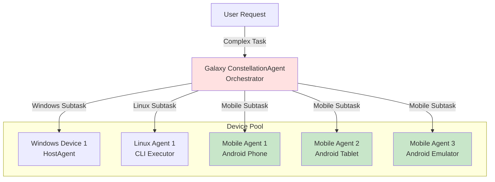
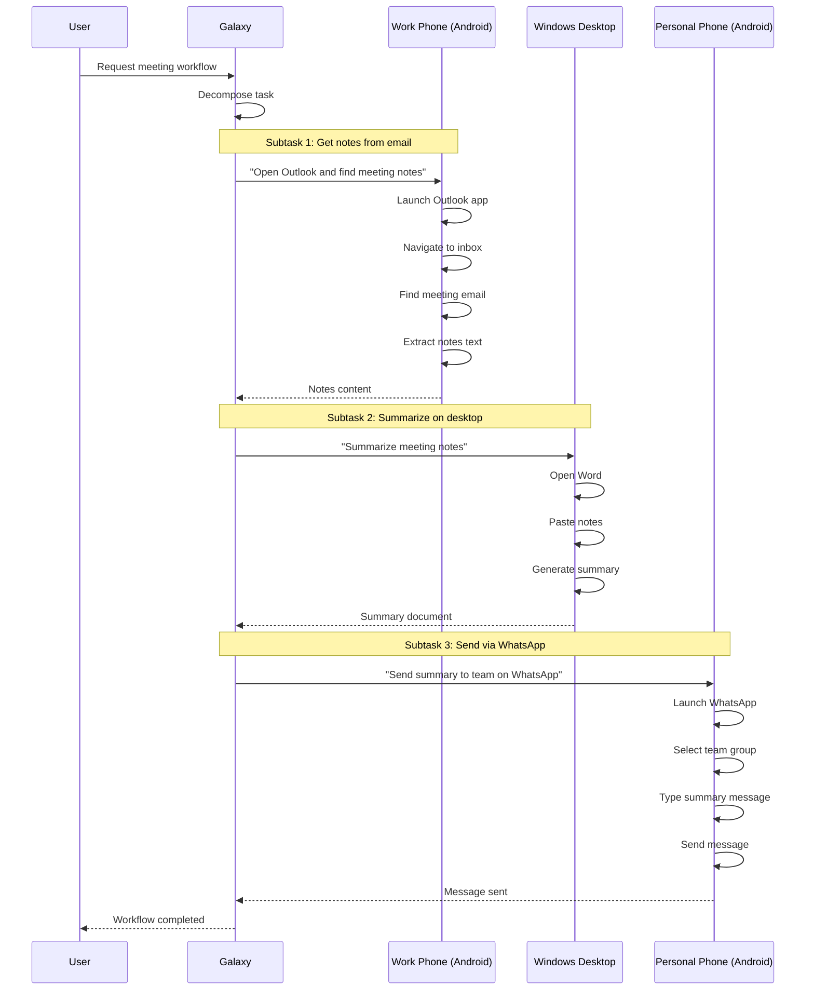

# Using Mobile Agent as Galaxy Device

Configure Mobile Agent as a sub-agent in UFO's Galaxy framework to enable cross-platform, multi-device task orchestration. Galaxy can coordinate Mobile agents alongside Windows and Linux devices to execute complex workflows spanning multiple systems and platforms.

> **📖 Prerequisites:**
> 
> Before configuring Mobile Agent in Galaxy, ensure you have:
> 
> - Completed the [Mobile Agent Quick Start Guide](../getting_started/quick_start_mobile.md) - Learn how to set up server, MCP services, and client
> - Read the [Mobile Agent Overview](overview.md) - Understand Mobile Agent's design and capabilities
> - Reviewed the [Galaxy Overview](../galaxy/overview.md) - Understand multi-device orchestration

## Overview

The **Galaxy framework** provides multi-tier orchestration capabilities, allowing you to manage multiple device agents (Windows, Linux, Android, etc.) from a central ConstellationAgent. When configured as a Galaxy device, MobileAgent becomes a **sub-agent** that can:

- Execute Android-specific subtasks assigned by Galaxy
- Participate in cross-platform workflows (e.g., Windows + Android + Linux collaboration)
- Report execution status back to the orchestrator
- Be dynamically selected based on capabilities and metadata

For detailed information about MobileAgent's design and capabilities, see [Mobile Agent Overview](overview.md).

## Galaxy Architecture with Mobile Agent



Galaxy orchestrates:

- **Task decomposition** - Break complex requests into platform-specific subtasks
- **Device selection** - Choose appropriate devices based on capabilities
- **Parallel execution** - Execute subtasks concurrently across devices
- **Result aggregation** - Combine results from all devices

---

## Configuration Guide

### Step 1: Configure Device in `devices.yaml`

Add your Mobile agent(s) to the device list in `config/galaxy/devices.yaml`:

#### Example Configuration

```yaml
devices:
  - device_id: "mobile_phone_1"
    server_url: "ws://192.168.1.100:5001/ws"
    os: "mobile"
    capabilities:
      - "mobile"
      - "android"
      - "messaging"
      - "camera"
      - "location"
    metadata:
      os: "mobile"
      device_type: "phone"
      android_version: "13"
      screen_size: "1080x2400"
      installed_apps:
        - "com.google.android.apps.maps"
        - "com.whatsapp"
        - "com.android.chrome"
      description: "Personal Android phone for mobile tasks"
    auto_connect: true
    max_retries: 5
```

### Step 2: Understanding Configuration Fields

| Field | Required | Type | Description |
|-------|----------|------|-------------|
| `device_id` | ✅ Yes | string | **Unique identifier** - must match client `--client-id` |
| `server_url` | ✅ Yes | string | WebSocket URL - must match server endpoint |
| `os` | ✅ Yes | string | Operating system - set to `"mobile"` |
| `capabilities` | ❌ Optional | list | Skills/capabilities for task routing |
| `metadata` | ❌ Optional | dict | Custom context for LLM-based task execution |
| `auto_connect` | ❌ Optional | boolean | Auto-connect on Galaxy startup (default: `true`) |
| `max_retries` | ❌ Optional | integer | Connection retry attempts (default: `5`) |

### Step 3: Capabilities-Based Task Routing

Galaxy uses the `capabilities` field to intelligently route subtasks to appropriate devices. Define capabilities based on device features, installed apps, or task types.

#### Example Capability Configurations

**Personal Phone:**
```yaml
capabilities:
  - "mobile"
  - "android"
  - "messaging"
  - "whatsapp"
  - "maps"
  - "camera"
  - "location"
```

**Work Phone:**
```yaml
capabilities:
  - "mobile"
  - "android"
  - "email"
  - "calendar"
  - "office_apps"
  - "vpn"
```

**Testing Emulator:**
```yaml
capabilities:
  - "mobile"
  - "android"
  - "testing"
  - "automation"
  - "screenshots"
```

**Tablet:**
```yaml
capabilities:
  - "mobile"
  - "android"
  - "tablet"
  - "large_screen"
  - "media"
  - "reading"
```

### Step 4: Metadata for Contextual Execution

The `metadata` field provides contextual information that the LLM uses when generating actions for the Mobile agent.

#### Metadata Examples

**Personal Phone Metadata:**
```yaml
metadata:
  os: "mobile"
  device_type: "phone"
  android_version: "13"
  sdk_version: "33"
  screen_size: "1080x2400"
  screen_density: "420"
  installed_apps:
    - "com.google.android.apps.maps"
    - "com.whatsapp"
    - "com.android.chrome"
    - "com.spotify.music"
  contacts:
    - "John Doe"
    - "Jane Smith"
  description: "Personal Android phone with social and navigation apps"
```

**Work Device Metadata:**
```yaml
metadata:
  os: "mobile"
  device_type: "phone"
  android_version: "12"
  screen_size: "1080x2340"
  installed_apps:
    - "com.microsoft.office.outlook"
    - "com.microsoft.teams"
    - "com.slack"
  vpn_configured: true
  email_accounts:
    - "work@company.com"
  description: "Work phone with corporate apps and VPN"
```

**Testing Emulator Metadata:**
```yaml
metadata:
  os: "mobile"
  device_type: "emulator"
  android_version: "14"
  sdk_version: "34"
  screen_size: "1080x1920"
  installed_apps:
    - "com.example.testapp"
  adb_over_network: true
  description: "Android emulator for app testing"
```

#### How Metadata is Used

The LLM receives metadata in the system prompt, enabling context-aware action generation:

- **App Availability**: LLM knows which apps can be launched
- **Screen Size**: Informs swipe distances and touch coordinates
- **Android Version**: Affects available features and UI patterns
- **Device Type**: Phone vs tablet affects UI layout
- **Custom Fields**: Any additional context you provide

**Example**: With the personal phone metadata above, when the user requests "Navigate to restaurant", the LLM knows Maps is installed and can generate `launch_app(package_name="com.google.android.apps.maps")`.

---

## Multi-Device Configuration Example

### Complete Galaxy Setup

```yaml
devices:
  # Windows Desktop Agent
  - device_id: "windows_desktop_1"
    server_url: "ws://192.168.1.101:5000/ws"
    os: "windows"
    capabilities:
      - "office_applications"
      - "email"
      - "web_browsing"
    metadata:
      os: "windows"
      description: "Office productivity workstation"
    auto_connect: true
    max_retries: 5
  
  # Linux Server Agent
  - device_id: "linux_server_1"
    server_url: "ws://192.168.1.102:5001/ws"
    os: "linux"
    capabilities:
      - "server"
      - "database"
      - "api"
    metadata:
      os: "linux"
      description: "Backend server"
    auto_connect: true
    max_retries: 5
  
  # Personal Android Phone
  - device_id: "mobile_phone_personal"
    server_url: "ws://192.168.1.103:5002/ws"
    os: "mobile"
    capabilities:
      - "mobile"
      - "android"
      - "messaging"
      - "whatsapp"
      - "maps"
      - "camera"
    metadata:
      os: "mobile"
      device_type: "phone"
      android_version: "13"
      screen_size: "1080x2400"
      installed_apps:
        - "com.google.android.apps.maps"
        - "com.whatsapp"
        - "com.android.chrome"
      description: "Personal phone with social apps"
    auto_connect: true
    max_retries: 5
  
  # Work Android Phone
  - device_id: "mobile_phone_work"
    server_url: "ws://192.168.1.104:5003/ws"
    os: "mobile"
    capabilities:
      - "mobile"
      - "android"
      - "email"
      - "calendar"
      - "teams"
    metadata:
      os: "mobile"
      device_type: "phone"
      android_version: "12"
      screen_size: "1080x2340"
      installed_apps:
        - "com.microsoft.office.outlook"
        - "com.microsoft.teams"
      description: "Work phone with corporate apps"
    auto_connect: true
    max_retries: 5
  
  # Android Tablet
  - device_id: "mobile_tablet_home"
    server_url: "ws://192.168.1.105:5004/ws"
    os: "mobile"
    capabilities:
      - "mobile"
      - "android"
      - "tablet"
      - "media"
      - "reading"
    metadata:
      os: "mobile"
      device_type: "tablet"
      android_version: "13"
      screen_size: "2560x1600"
      installed_apps:
        - "com.netflix.mediaclient"
        - "com.google.android.youtube"
      description: "Tablet for media and entertainment"
    auto_connect: true
    max_retries: 5
```

---

## Starting Galaxy with Mobile Agents

### Prerequisites

Ensure all components are running before starting Galaxy:

1. ✅ Device Agent Servers running on all machines
2. ✅ Device Agent Clients connected to their respective servers
3. ✅ MCP Services running (both data collection and action servers)
4. ✅ ADB accessible and Android devices connected
5. ✅ USB debugging enabled on all Android devices
6. ✅ LLM configured in `config/ufo/agents.yaml` or `config/galaxy/agent.yaml`

### Launch Sequence

#### Step 1: Prepare Android Devices

```bash
# Check ADB connection to all devices
adb devices

# Expected output:
# List of devices attached
# 192.168.1.103:5555    device
# 192.168.1.104:5555    device
# emulator-5554         device
```

**For Physical Devices:**
1. Enable USB debugging in Developer Options
2. Connect via USB or wireless ADB
3. Accept ADB debugging prompt on device

**For Emulators:**
1. Start Android emulator
2. ADB connects automatically

#### Step 2: Start Device Agent Servers

```bash
# On machine hosting personal phone agent (192.168.1.103)
python -m ufo.server.app --port 5002 --platform mobile

# On machine hosting work phone agent (192.168.1.104)
python -m ufo.server.app --port 5003 --platform mobile

# On machine hosting tablet agent (192.168.1.105)
python -m ufo.server.app --port 5004 --platform mobile
```

#### Step 3: Start MCP Servers for Each Device

```bash
# On machine hosting personal phone
python -m ufo.client.mcp.http_servers.mobile_mcp_server \
  --host localhost \
  --data-port 8020 \
  --action-port 8021 \
  --server both

# On machine hosting work phone
python -m ufo.client.mcp.http_servers.mobile_mcp_server \
  --host localhost \
  --data-port 8022 \
  --action-port 8023 \
  --server both

# On machine hosting tablet
python -m ufo.client.mcp.http_servers.mobile_mcp_server \
  --host localhost \
  --data-port 8024 \
  --action-port 8025 \
  --server both
```

#### Step 4: Start Mobile Clients

```bash
# Personal phone client
python -m ufo.client.client \
  --ws \
  --ws-server ws://192.168.1.103:5002/ws \
  --client-id mobile_phone_personal \
  --platform mobile

# Work phone client
python -m ufo.client.client \
  --ws \
  --ws-server ws://192.168.1.104:5003/ws \
  --client-id mobile_phone_work \
  --platform mobile

# Tablet client
python -m ufo.client.client \
  --ws \
  --ws-server ws://192.168.1.105:5004/ws \
  --client-id mobile_tablet_home \
  --platform mobile
```

#### Step 5: Launch Galaxy

```bash
# On your control machine (interactive mode)
python -m galaxy --interactive
```

**Or launch with a specific request:**

```bash
python -m galaxy "Your cross-device task description here"
```

Galaxy will automatically connect to all configured devices and display the orchestration interface.

---

## Example Multi-Device Workflows

### Workflow 1: Cross-Platform Productivity

**User Request:**
> "Get my meeting notes from email on work phone, summarize them on desktop, and send summary to team via WhatsApp on personal phone"

**Galaxy Orchestration:**



### Workflow 2: Mobile Testing Across Devices

**User Request:**
> "Test the new app on phone, tablet, and emulator, capture screenshots of each screen"

**Galaxy Orchestration:**

1. **Mobile Phone**: Install app, navigate through screens, capture screenshots
2. **Mobile Tablet**: Install app (tablet layout), navigate screens, capture screenshots
3. **Mobile Emulator**: Install app, run automated test suite, capture screenshots
4. **Windows Desktop**: Aggregate screenshots, generate test report

### Workflow 3: Location-Based Multi-Device Task

**User Request:**
> "Find nearest coffee shops on phone, book table using tablet, add calendar event on work phone"

**Galaxy Orchestration:**

1. **Personal Phone**: Launch Maps, search "coffee shops near me", get results
2. **Tablet**: Open booking app, select coffee shop, book table
3. **Work Phone**: Open Calendar, create event with location and time
4. **Galaxy**: Aggregate confirmations and notify user

---

## Task Assignment Behavior

### How Galaxy Routes Tasks to Mobile Agents

Galaxy's ConstellationAgent uses several factors to select the appropriate mobile device for each subtask:

| Factor | Description | Example |
|--------|-------------|---------|
| **Capabilities** | Match subtask requirements to device capabilities | `"messaging"` → Personal phone |
| **OS Requirement** | Platform-specific tasks routed to correct OS | Mobile tasks → Mobile agents |
| **Metadata Context** | Use device-specific apps and configurations | WhatsApp task → Device with WhatsApp |
| **Device Type** | Phone vs tablet for different UI requirements | Media viewing → Tablet |
| **Device Status** | Only assign to online, healthy devices | Skip offline or failing devices |
| **Load Balancing** | Distribute tasks across similar devices | Round-robin across phones |

### Example Task Decomposition

**User Request:**
> "Check messages on personal phone, review calendar on work phone, and play video on tablet"

**Galaxy Decomposition:**

```yaml
Task 1:
  Description: "Check messages on WhatsApp"
  Target: mobile_phone_personal
  Reason: Has "whatsapp" capability and personal messaging apps
  
Task 2:
  Description: "Review today's calendar events"
  Target: mobile_phone_work
  Reason: Has "calendar" capability and work email/calendar
  
Task 3:
  Description: "Play video on YouTube"
  Target: mobile_tablet_home
  Reason: Has "media" capability and larger screen suitable for video
```

---

## Critical Configuration Requirements

!!!danger "Configuration Validation"
    Ensure these match exactly or Galaxy cannot control the device:
    
    - **Device ID**: `device_id` in `devices.yaml` must match `--client-id` in client command
    - **Server URL**: `server_url` in `devices.yaml` must match `--ws-server` in client command
    - **Platform**: Must include `--platform mobile` in client command
    - **ADB Access**: Android device must be accessible via ADB
    - **MCP Servers**: Both data collection and action servers must be running

---

## Monitoring & Debugging

### Verify Device Registration

**Check Galaxy device pool:**

```bash
curl http://<galaxy-server>:5000/api/devices
```

**Expected response:**

```json
{
  "devices": [
    {
      "device_id": "mobile_phone_personal",
      "os": "mobile",
      "status": "online",
      "capabilities": ["mobile", "android", "messaging", "whatsapp", "maps"]
    },
    {
      "device_id": "mobile_phone_work",
      "os": "mobile",
      "status": "online",
      "capabilities": ["mobile", "android", "email", "calendar", "teams"]
    }
  ]
}
```

### View Task Assignments

Galaxy logs show task routing decisions:

```log
INFO - [Galaxy] Task decomposition: 3 subtasks created
INFO - [Galaxy] Subtask 1 → mobile_phone_personal (capability match: messaging)
INFO - [Galaxy] Subtask 2 → mobile_phone_work (capability match: calendar)
INFO - [Galaxy] Subtask 3 → mobile_tablet_home (capability match: media)
```

### Troubleshooting Device Connection

**Issue**: Mobile agent not appearing in Galaxy device pool

**Diagnosis:**

1. **Check ADB connection:**
   ```bash
   adb devices
   ```

2. **Verify client connection:**
   ```bash
   curl http://192.168.1.103:5002/api/clients
   ```

3. **Check `devices.yaml` configuration** matches client parameters

4. **Review Galaxy logs** for connection errors

5. **Ensure `auto_connect: true`** in `devices.yaml`

6. **Check MCP servers** are running:
   ```bash
   curl http://localhost:8020/health  # Data collection server
   curl http://localhost:8021/health  # Action server
   ```

---

## Mobile-Specific Considerations

### Screenshot Capture for Galaxy

Mobile agents automatically capture screenshots during execution, which Galaxy can:

- Display in orchestration UI
- Include in execution reports
- Use for debugging failed tasks
- Share with other agents for context

### Touch Coordinates Across Devices

Different Android devices have different screen sizes and densities. Galaxy handles this by:

- Using control IDs instead of absolute coordinates
- Having each mobile agent handle device-specific coordinate calculations
- Storing device resolution in metadata for reference

### App Availability

Galaxy can query `installed_apps` from metadata to:

- Route tasks to devices with required apps
- Skip devices missing necessary apps
- Suggest app installation when needed

---

## Related Documentation

- [Mobile Agent Overview](overview.md) - Architecture and design principles
- [Mobile Agent Commands](commands.md) - MCP tools for device interaction
- [Galaxy Overview](../galaxy/overview.md) - Multi-device orchestration framework
- [Galaxy Quick Start](../getting_started/quick_start_galaxy.md) - Galaxy deployment guide
- [Constellation Orchestrator](../galaxy/constellation_orchestrator/overview.md) - Task orchestration
- [Galaxy Devices Configuration](../configuration/system/galaxy_devices.md) - Complete device configuration reference

---

## Summary

Using Mobile Agent as a Galaxy device enables sophisticated multi-device orchestration:

- **Cross-Platform Workflows**: Seamlessly combine Android, Windows, and Linux tasks
- **Capability-Based Routing**: Galaxy selects the right device for each subtask
- **Visual Context**: Screenshots provide rich execution tracing
- **Parallel Execution**: Multiple mobile devices work concurrently
- **Metadata-Aware**: LLM uses device-specific context (installed apps, screen size, etc.)
- **Robust Caching**: Efficient ADB usage through smart caching strategies

With Mobile Agent in Galaxy, you can orchestrate complex workflows spanning mobile apps, desktop applications, and server systems from a single unified interface.
