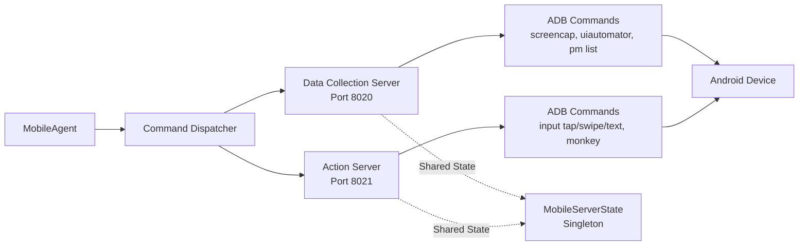
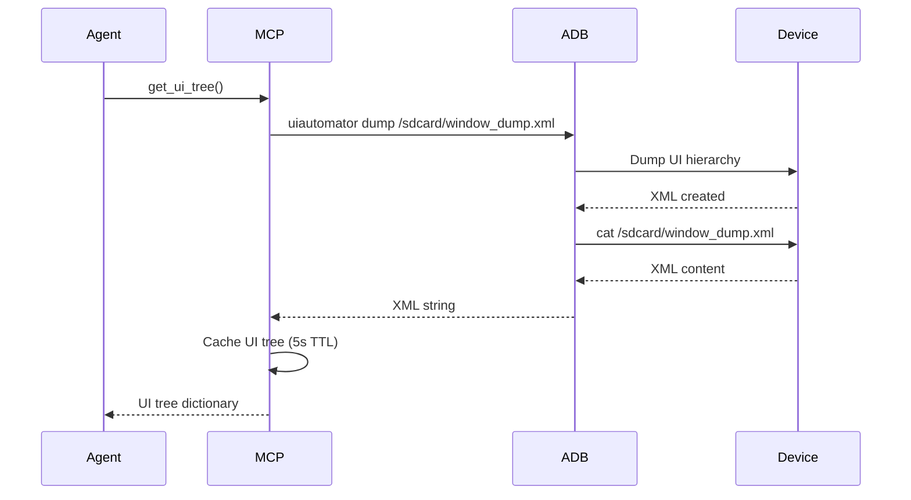
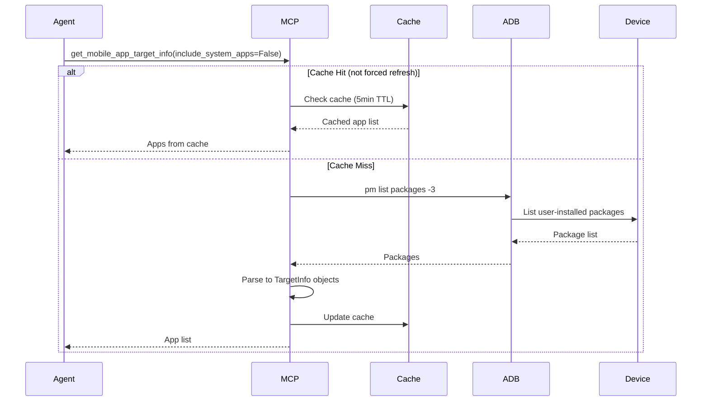
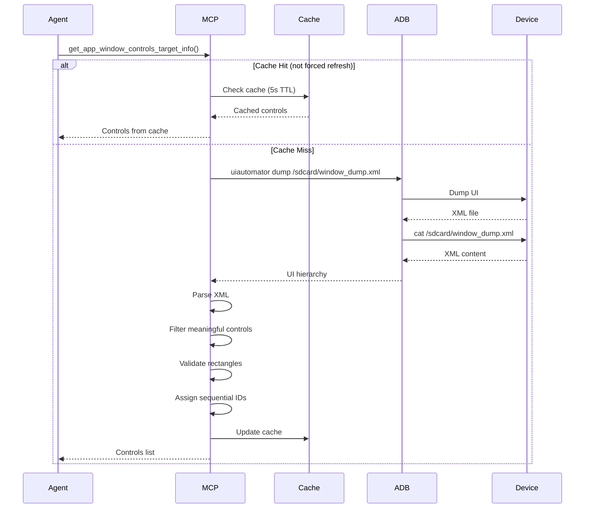
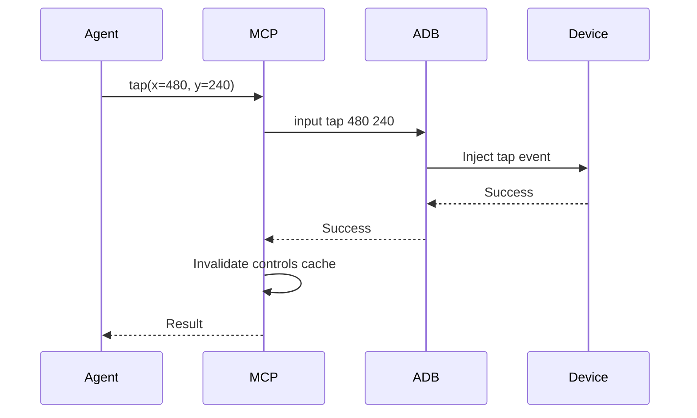
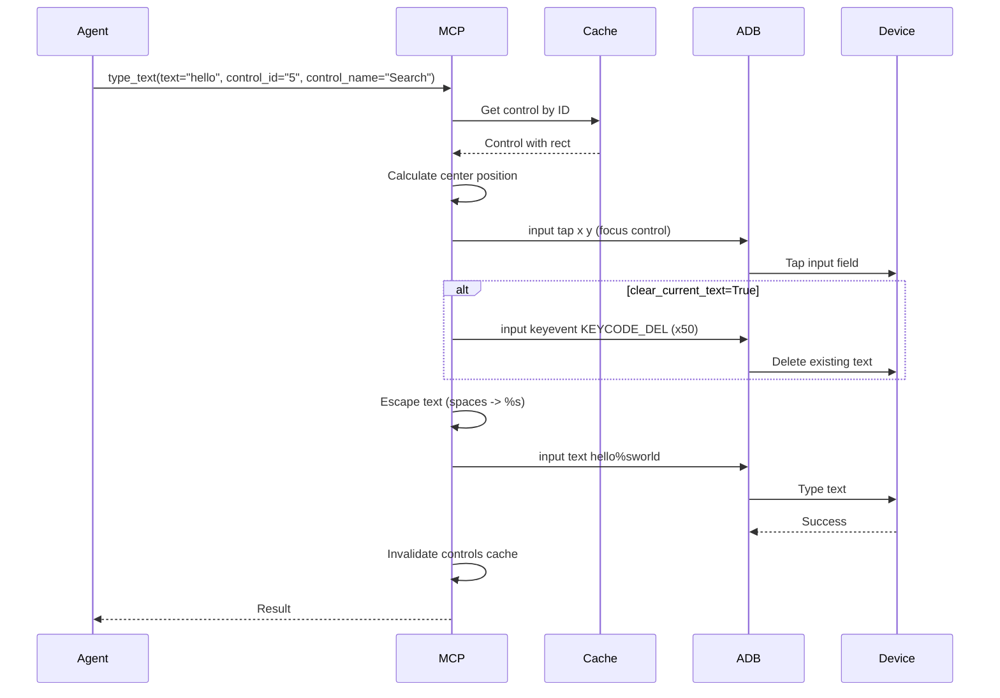
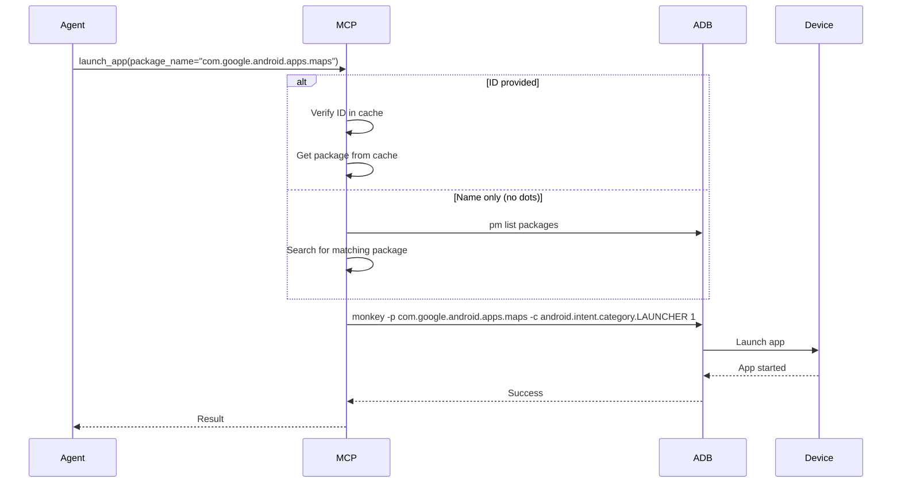
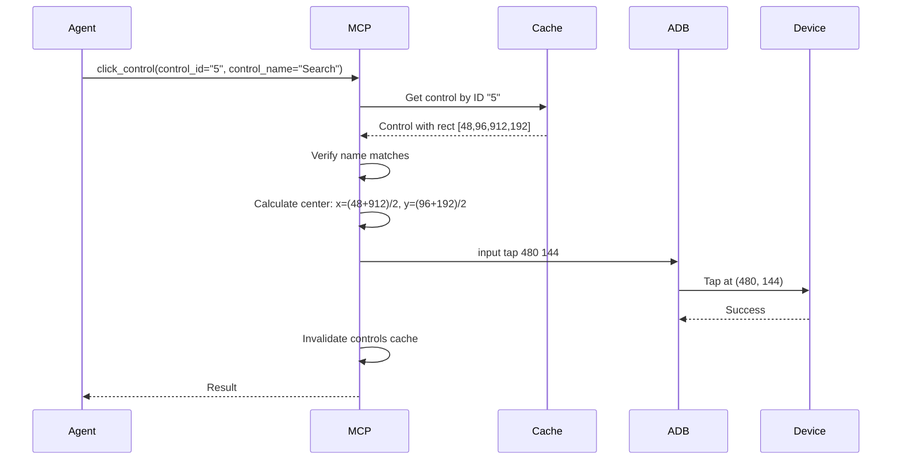
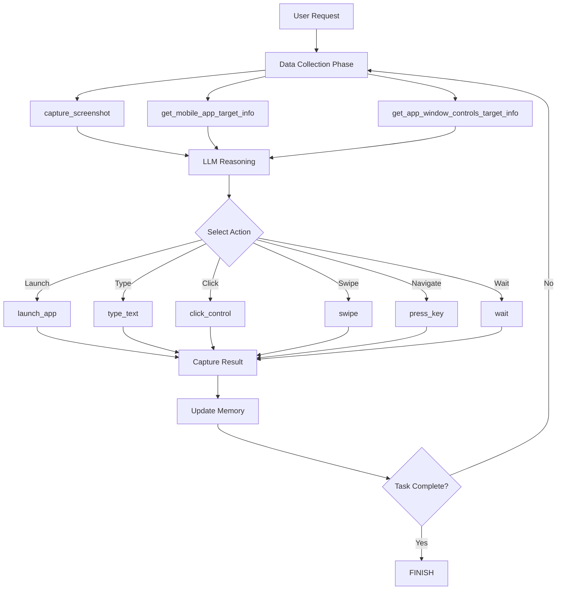

# MobileAgent MCP Commands

MobileAgent interacts with Android devices through MCP (Model Context Protocol) tools provided by two specialized MCP servers. These tools provide atomic building blocks for mobile task execution, isolating device-specific operations within the MCP server layer.

> **📖 Related Documentation:**
> 
> - [Mobile Agent Overview](overview.md) - Architecture and core responsibilities
> - [State Machine](state.md) - FSM states and transitions
> - [Processing Strategy](strategy.md) - How commands are orchestrated in the 4-phase pipeline
> - [Quick Start Guide](../getting_started/quick_start_mobile.md) - Set up MCP servers for your device

## Command Architecture

### Dual MCP Server Design

MobileAgent uses two separate MCP servers for different responsibilities:



**Why Two Servers?**

- **Separation of Concerns**: Data retrieval vs. device control
- **Performance**: Data collection can cache aggressively, actions invalidate caches
- **Security**: Different tools can have different permission levels
- **Scalability**: Servers can run on different hosts if needed

**Shared State**: Both servers share a singleton `MobileServerState` for:
- Caching control information (5 seconds TTL)
- Caching installed apps (5 minutes TTL)
- Caching UI tree (5 seconds TTL)
- Coordinating cache invalidation after actions

### Command Dispatcher

The command dispatcher routes commands to the appropriate MCP server:

```python
from aip.messages import Command

# Create data collection command
command = Command(
    tool_name="capture_screenshot",
    parameters={},
    tool_type="data_collection"
)

# Execute command via dispatcher
results = await command_dispatcher.execute_commands([command])
screenshot_url = results[0].result
```

---

## Data Collection Server Tools (Port 8020)

The Data Collection Server provides read-only tools for gathering device information.

### 1. capture_screenshot - Capture Device Screenshot

**Purpose**: Take screenshot from Android device and return as base64-encoded image.

#### Tool Specification

```python
tool_name = "capture_screenshot"
parameters = {}  # No parameters required
```

#### Execution Flow

```mermaid
sequenceDiagram
    participant Agent
    participant MCP
    participant ADB
    participant Device
    
    Agent->>MCP: capture_screenshot()
    MCP->>ADB: screencap -p /sdcard/screen_temp.png
    ADB->>Device: Execute screenshot
    Device-->>ADB: Screenshot saved
    
    ADB->>Device: pull /sdcard/screen_temp.png
    Device-->>ADB: PNG file
    
    MCP->>MCP: Encode to base64
    MCP->>ADB: rm /sdcard/screen_temp.png
    MCP-->>Agent: data:image/png;base64,...
```

#### Result Format

```python
# Direct base64 data URI string (not a dict)
"data:image/png;base64,iVBORw0KGgoAAAANSUhEUgAAA..."
```

#### Use Cases

| Use Case | Description |
|----------|-------------|
| **UI Analysis** | Understand current screen state |
| **Visual Context** | Provide screenshots to LLM for decision making |
| **Debugging** | Capture UI state at each step |
| **Annotation Base** | Base image for control labeling |

#### Error Handling

```python
# Failures return as exceptions
try:
    screenshot_url = await capture_screenshot()
except Exception as e:
    # "Failed to capture screenshot on device"
    # "Failed to pull screenshot from device"
    pass
```

---

### 2. get_ui_tree - Get UI Hierarchy XML

**Purpose**: Retrieve the complete UI hierarchy in XML format for detailed UI structure analysis.

#### Tool Specification

```python
tool_name = "get_ui_tree"
parameters = {}  # No parameters required
```

#### Execution Flow



#### Result Format

```python
{
  "success": True,
  "ui_tree": """<?xml version='1.0' encoding='UTF-8'?>
    <hierarchy rotation="0">
      <node index="0" text="" class="android.widget.FrameLayout" ...>
        <node index="0" text="Search" class="android.widget.EditText" 
              bounds="[48,96][912,192]" clickable="true" />
        ...
      </node>
    </hierarchy>""",
  "format": "xml"
}
```

#### Use Cases

- Advanced UI analysis requiring full hierarchy
- Custom control parsing logic
- Debugging UI structure
- Extracting accessibility information

---

### 3. get_device_info - Get Device Information

**Purpose**: Gather comprehensive device information including model, Android version, screen size, and battery status.

#### Tool Specification

```python
tool_name = "get_device_info"
parameters = {}  # No parameters required
```

#### Information Collected

| Info Type | ADB Command | Data Returned |
|-----------|-------------|---------------|
| **Model** | `getprop ro.product.model` | Device model name |
| **Android Version** | `getprop ro.build.version.release` | Android version (e.g., "13") |
| **SDK Version** | `getprop ro.build.version.sdk` | API level (e.g., "33") |
| **Screen Size** | `wm size` | Resolution (e.g., "Physical size: 1080x2400") |
| **Screen Density** | `wm density` | DPI (e.g., "Physical density: 420") |
| **Battery Level** | `dumpsys battery` | Battery percentage |
| **Battery Status** | `dumpsys battery` | Charging status |

#### Result Format

```python
{
  "success": True,
  "device_info": {
    "model": "Pixel 6",
    "android_version": "13",
    "sdk_version": "33",
    "screen_size": "Physical size: 1080x2400",
    "screen_density": "Physical density: 420",
    "battery_level": "85",
    "battery_status": "2"  # 2 = Charging, 3 = Discharging
  },
  "from_cache": False  # True if returned from cache
}
```

**Caching**: Device info is cached for 60 seconds as it changes infrequently.

---

### 4. get_mobile_app_target_info - List Installed Apps

**Purpose**: Retrieve list of installed applications as TargetInfo objects.

#### Tool Specification

```python
tool_name = "get_mobile_app_target_info"
parameters = {
    "filter": "",                    # Filter pattern (optional)
    "include_system_apps": False,    # Include system apps (default: False)
    "force_refresh": False           # Bypass cache (default: False)
}
```

#### Execution Flow



#### Result Format

```python
[
  {
    "id": "1",
    "name": "com.android.chrome",
    "package": "com.android.chrome"
  },
  {
    "id": "2",
    "name": "com.google.android.apps.maps",
    "package": "com.google.android.apps.maps"
  },
  {
    "id": "3",
    "name": "com.whatsapp",
    "package": "com.whatsapp"
  }
]
```

**Notes**:
- `id`: Sequential number for LLM reference
- `name`: Package name (display name not available via simple ADB)
- `package`: Full package identifier

**Caching**: Apps list is cached for 5 minutes to reduce overhead.

---

### 5. get_app_window_controls_target_info - Get UI Controls

**Purpose**: Extract UI controls from current screen with IDs for precise interaction.

#### Tool Specification

```python
tool_name = "get_app_window_controls_target_info"
parameters = {
    "force_refresh": False  # Bypass cache (default: False)
}
```

#### Execution Flow



#### Control Selection Criteria

Controls are included if they meet any of these criteria:

- `clickable="true"` - Can be tapped
- `long-clickable="true"` - Supports long-press
- `scrollable="true"` - Can be scrolled
- `checkable="true"` - Checkbox or toggle
- Has `text` or `content-desc` - Has label
- Type includes "Edit", "Button" - Input or action element

#### Rectangle Validation

Controls with invalid rectangles are filtered out:

```python
# Bounds format: [left, top, right, bottom]
# Valid rectangle must have:
# - right > left (positive width)
# - bottom > top (positive height)
# - All coordinates > 0
if right <= left or bottom <= top or right == 0 or bottom == 0:
    skip_control()  # Invalid rectangle
```

#### Result Format

```python
[
  {
    "id": "1",
    "name": "Search",
    "type": "EditText",
    "rect": [48, 96, 912, 192]  # [left, top, right, bottom] in pixels
  },
  {
    "id": "2",
    "name": "Search",
    "type": "ImageButton",
    "rect": [912, 96, 1032, 192]
  },
  {
    "id": "3",
    "name": "Maps",
    "type": "TextView",
    "rect": [0, 216, 1080, 360]
  }
]
```

**Caching**: Controls are cached for 5 seconds but **automatically invalidated** after any action (UI likely changed).

---

## Action Server Tools (Port 8021)

The Action Server provides tools for device control and manipulation.

### 6. tap - Tap at Coordinates

**Purpose**: Perform tap/click action at specified screen coordinates.

#### Tool Specification

```python
tool_name = "tap"
parameters = {
    "x": 480,  # X coordinate (pixels from left)
    "y": 240   # Y coordinate (pixels from top)
}
```

#### Execution Flow



#### Result Format

```python
{
  "success": True,
  "action": "tap(480, 240)",
  "output": "",
  "error": ""
}
```

**Cache Invalidation**: Automatically invalidates control cache after tap (UI likely changed).

---

### 7. swipe - Swipe Gesture

**Purpose**: Perform swipe gesture from start to end coordinates.

#### Tool Specification

```python
tool_name = "swipe"
parameters = {
    "start_x": 500,
    "start_y": 1500,
    "end_x": 500,
    "end_y": 500,
    "duration": 300  # milliseconds (default: 300)
}
```

#### Common Use Cases

| Use Case | Start | End | Description |
|----------|-------|-----|-------------|
| **Scroll Up** | (500, 1500) | (500, 500) | Swipe from bottom to top |
| **Scroll Down** | (500, 500) | (500, 1500) | Swipe from top to bottom |
| **Scroll Left** | (900, 600) | (100, 600) | Swipe from right to left |
| **Scroll Right** | (100, 600) | (900, 600) | Swipe from left to right |

#### Result Format

```python
{
  "success": True,
  "action": "swipe(500,1500)->(500,500) in 300ms",
  "output": "",
  "error": ""
}
```

**Cache Invalidation**: Automatically invalidates control cache after swipe.

---

### 8. type_text - Type Text into Control

**Purpose**: Type text into a specific input field control.

#### Tool Specification

```python
tool_name = "type_text"
parameters = {
    "text": "hello world",
    "control_id": "5",              # REQUIRED: Control ID from get_app_window_controls_target_info
    "control_name": "Search",       # REQUIRED: Control name (must match)
    "clear_current_text": False     # Clear existing text first (default: False)
}
```

#### Execution Flow



#### Important Notes

!!!warning "Control ID Requirement"
    The `control_id` parameter is **REQUIRED**. You must:
    
    1. Call `get_app_window_controls_target_info` first
    2. Identify the input field control
    3. Use its `id` and `name` in `type_text`
    
    The tool will:
    - Verify the control exists in cache
    - Click the control to focus it
    - Then type the text

**Text Escaping**: Spaces are automatically converted to `%s` for Android input shell compatibility.

#### Result Format

```python
{
  "success": True,
  "action": "type_text(text='hello world', control_id='5', control_name='Search')",
  "message": "Clicked control 'Search' at (480, 144) | Typed text: 'hello world'",
  "control_info": {
    "id": "5",
    "name": "Search",
    "type": "EditText"
  }
}
```

---

### 9. launch_app - Launch Application

**Purpose**: Launch an application by package name or app ID.

#### Tool Specification

```python
tool_name = "launch_app"
parameters = {
    "package_name": "com.google.android.apps.maps",  # Package name
    "id": "2"  # Optional: App ID from get_mobile_app_target_info
}
```

#### Usage Modes

**Mode 1: Launch by package name**

```python
launch_app(package_name="com.android.settings")
```

**Mode 2: Launch from cached app list**

```python
# First call get_mobile_app_target_info to cache apps
# Then use app ID from the list
launch_app(package_name="com.android.settings", id="5")
```

**Mode 3: Launch by app name (fuzzy search)**

```python
# If package_name doesn't contain ".", search by name
launch_app(package_name="Maps")  # Finds "com.google.android.apps.maps"
```

#### Execution Flow



#### Result Format

```python
{
  "success": True,
  "message": "Launched com.google.android.apps.maps",
  "package_name": "com.google.android.apps.maps",
  "output": "Events injected: 1",
  "error": "",
  "app_info": {  # If ID was provided
    "id": "2",
    "name": "com.google.android.apps.maps",
    "package": "com.google.android.apps.maps"
  }
}
```

---

### 10. press_key - Press Hardware/Software Key

**Purpose**: Press a hardware or software key for navigation and system actions.

#### Tool Specification

```python
tool_name = "press_key"
parameters = {
    "key_code": "KEYCODE_BACK"  # Key code name
}
```

#### Common Key Codes

| Key Code | Description | Use Case |
|----------|-------------|----------|
| `KEYCODE_HOME` | Home button | Return to home screen |
| `KEYCODE_BACK` | Back button | Navigate back |
| `KEYCODE_MENU` | Menu button | Open options menu |
| `KEYCODE_ENTER` | Enter key | Submit form |
| `KEYCODE_DEL` | Delete key | Delete character |
| `KEYCODE_APP_SWITCH` | Recent apps | Switch between apps |
| `KEYCODE_POWER` | Power button | Lock screen |
| `KEYCODE_VOLUME_UP` | Volume up | Increase volume |
| `KEYCODE_VOLUME_DOWN` | Volume down | Decrease volume |

#### Result Format

```python
{
  "success": True,
  "action": "press_key(KEYCODE_BACK)",
  "output": "",
  "error": ""
}
```

---

### 11. click_control - Click Control by ID

**Purpose**: Click a UI control by its ID from the cached control list.

#### Tool Specification

```python
tool_name = "click_control"
parameters = {
    "control_id": "5",              # REQUIRED: Control ID from get_app_window_controls_target_info
    "control_name": "Search Button" # REQUIRED: Control name (must match)
}
```

#### Execution Flow



#### Result Format

```python
{
  "success": True,
  "action": "click_control(id=5, name=Search)",
  "message": "Clicked control 'Search' at (480, 144)",
  "control_info": {
    "id": "5",
    "name": "Search",
    "type": "EditText",
    "rect": [48, 96, 912, 192]
  }
}
```

**Name Verification**: If the provided `control_name` doesn't match the cached control's name, a warning is returned but the action still executes using the ID.

---

### 12. wait - Wait/Sleep

**Purpose**: Wait for a specified duration.

#### Tool Specification

```python
tool_name = "wait"
parameters = {
    "seconds": 1.0  # Duration in seconds (can be decimal)
}
```

#### Use Cases

- Wait for app to load
- Wait for animation to complete
- Wait for UI transition
- Pace actions for stability

#### Examples

```python
wait(seconds=1.0)   # Wait 1 second
wait(seconds=0.5)   # Wait 500ms
wait(seconds=2.5)   # Wait 2.5 seconds
```

#### Result Format

```python
{
  "success": True,
  "action": "wait(1.0s)",
  "message": "Waited for 1.0 seconds"
}
```

**Limits**: 
- Minimum: 0 seconds
- Maximum: 60 seconds

---

### 13. invalidate_cache - Manual Cache Invalidation

**Purpose**: Manually invalidate cached data to force refresh on next query.

#### Tool Specification

```python
tool_name = "invalidate_cache"
parameters = {
    "cache_type": "all"  # "controls", "apps", "ui_tree", "device_info", or "all"
}
```

#### Cache Types

| Cache Type | Description | Auto-Invalidated |
|------------|-------------|------------------|
| `controls` | UI controls list | ✓ After actions |
| `apps` | Installed apps list | ✗ Never |
| `ui_tree` | UI hierarchy XML | ✗ Never |
| `device_info` | Device information | ✗ Never |
| `all` | All caches | Varies |

#### Result Format

```python
{
  "success": True,
  "message": "Controls cache invalidated"
}
```

**Use Cases**:
- Manually refresh apps list after installing/uninstalling
- Force UI tree refresh after significant screen change
- Debug caching issues

---

## Command Execution Pipeline

### Atomic Building Blocks

The MCP tools serve as atomic operations for mobile task execution:



### Command Composition

MobileAgent executes commands sequentially, building on previous results:

```python
# Round 1: Capture UI and launch app
{
  "action": {
    "function": "launch_app",
    "arguments": {"package_name": "com.google.android.apps.maps", "id": "2"}
  }
}
# Result: Maps launched

# Round 2: Capture new UI, identify search field
{
  "action": {
    "function": "click_control",
    "arguments": {"control_id": "5", "control_name": "Search"}
  }
}
# Result: Search field focused

# Round 3: Type query
{
  "action": {
    "function": "type_text",
    "arguments": {
      "text": "restaurants",
      "control_id": "5",
      "control_name": "Search"
    }
  }
}
# Result: Text entered
```

---

## Best Practices

### Data Collection Tools

- Use `get_app_window_controls_target_info` before every action to get fresh control IDs
- Cache is your friend: don't force refresh unless necessary
- Annotated screenshots help LLM identify controls precisely

### Action Tools

!!!success "Action Best Practices"
    - **Always** call `get_app_window_controls_target_info` before `click_control` or `type_text`
    - Use control IDs instead of coordinates for robustness
    - Add `wait` after actions that trigger UI changes (app launch, navigation)
    - Check `success` field in results before considering action successful
    - Use `press_key(KEYCODE_BACK)` for navigation instead of screen taps when possible

### Caching

- Controls cache: 5 seconds TTL, invalidated after actions
- Apps cache: 5 minutes TTL, manually invalidate if apps change
- Device info cache: 60 seconds TTL, useful for metadata

### Error Handling

```python
# Always check success field
result = await click_control(control_id="5", control_name="Search")
if not result["success"]:
    # Handle error: control not found, device disconnected, etc.
    pass
```

---

## Implementation Location

The MCP server implementation can be found in:

```
ufo/client/mcp/http_servers/
└── mobile_mcp_server.py
```

Key components:

- `MobileServerState`: Singleton state manager for caching
- `create_mobile_data_collection_server()`: Data collection server (port 8020)
- `create_mobile_action_server()`: Action server (port 8021)

---

## Comparison with Other Agent Commands

| Agent | Command Types | Execution Layer | Visual Context | Result Format |
|-------|--------------|-----------------|----------------|---------------|
| **MobileAgent** | UI + Apps + Touch | MCP (ADB) | ✓ Screenshots + Controls | success/message/control_info |
| **LinuxAgent** | CLI + SysInfo | MCP (SSH) | ✗ Text-only | success/exit_code/stdout/stderr |
| **AppAgent** | UI + API | Automator + MCP | ✓ Screenshots + Controls | UI state + API responses |

MobileAgent's command set reflects the mobile environment:

- **Touch-based**: tap, swipe instead of click, drag
- **Visual**: Screenshots are essential for UI understanding
- **App-centric**: Focus on app launching and switching
- **Control-based**: Precise control IDs instead of coordinates
- **Cached**: Aggressive caching to reduce ADB overhead

---

## Next Steps

- [State Machine](state.md) - Understand how command execution fits into the FSM
- [Processing Strategy](strategy.md) - See how commands are integrated into the 4-phase pipeline
- [Overview](overview.md) - Return to MobileAgent architecture overview
- [As Galaxy Device](as_galaxy_device.md) - Configure MobileAgent for multi-device workflows
