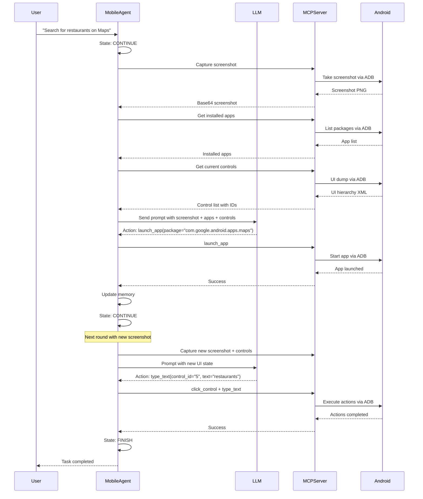

# MobileAgent: Android Task Executor

**MobileAgent** is a specialized agent designed for executing tasks on Android mobile devices. It leverages the layered FSM architecture and server-client design to perform intelligent, iterative task execution in mobile environments through UI interaction and app control.

**Quick Links:**

- **New to Mobile Agent?** Start with the [Quick Start Guide](../getting_started/quick_start_mobile.md) - Set up your first Android device agent in 10 minutes
- **Using as Sub-Agent in Galaxy?** See [Using Mobile Agent as Galaxy Device](as_galaxy_device.md)
- **Deep Dive:** [State Machine](state.md) • [Processing Strategy](strategy.md) • [MCP Commands](commands.md)

## Architecture Overview

MobileAgent operates as a single-agent instance that interacts with Android devices through UI controls and app management. Unlike the two-tier architecture of UFO (HostAgent + AppAgent), MobileAgent uses a simplified single-agent model optimized for mobile device automation, similar to LinuxAgent but with visual interface support.

## Core Responsibilities

MobileAgent provides the following capabilities for Android device automation:

### UI Interaction

MobileAgent interprets user requests and translates them into appropriate UI interactions on Android devices through screenshots analysis and control manipulation.

**Example:** User request "Search for restaurants on Maps" becomes:

1. Take screenshot and identify app icons
2. Launch Google Maps app
3. Identify search field control
4. Type "restaurants" into search field
5. Tap search button

### Visual Context Understanding

The agent captures and analyzes device screenshots to understand the current UI state:

- Screenshot capture (clean and annotated)
- Control identification and labeling
- UI hierarchy parsing
- App detection and recognition

### App Management

MobileAgent can manage installed applications:

- List installed apps (user apps and system apps)
- Launch apps by package name or app name
- Switch between apps
- Monitor current app state

### Iterative Task Execution

MobileAgent executes tasks iteratively, evaluating execution outcomes at each step and determining the next action based on results and LLM reasoning.

### Error Handling and Recovery

The agent monitors action execution results and can adapt its strategy when errors occur, such as controls not found or apps not responding.

## Key Characteristics

- **Scope**: Single Android device (UI-based automation)
- **Lifecycle**: One instance per task session
- **Hierarchy**: Standalone agent (no child agents)
- **Communication**: MCP server integration via ADB
- **Control**: 3-state finite state machine with 4-phase processing pipeline
- **Visual**: Screenshot-based UI understanding with control annotation

## Execution Workflow



## Comparison with Other Agents

| Aspect | MobileAgent | LinuxAgent | AppAgent |
|--------|-------------|------------|----------|
| **Platform** | Android Mobile | Linux (CLI) | Windows Applications |
| **States** | 3 (CONTINUE, FINISH, FAIL) | 3 states | 6 states |
| **Architecture** | Single-agent | Single-agent | Child executor |
| **Interface** | Mobile UI (touch-based) | Command-line | Desktop GUI |
| **Processing Phases** | 4 phases (with DATA_COLLECTION) | 3 phases | 4 phases |
| **Visual** | ✓ Screenshots + Annotations | ✗ Text-only | ✓ Screenshots + Annotations |
| **MCP Tools** | UI controls + App management | CLI commands | UI controls + API |
| **Input Method** | Touch (tap, swipe, type) | Keyboard commands | Mouse + Keyboard |
| **Control Identification** | UI hierarchy + bounds | N/A | UI Automation API |

## Design Principles

MobileAgent exemplifies mobile-specific design considerations:

- **Visual Context**: Screenshot-based UI understanding with control annotation for precise interaction
- **Control Caching**: Efficient control information caching to reduce ADB overhead
- **Touch-based Interaction**: Specialized actions for mobile gestures (tap, swipe, long-press)
- **App-centric Navigation**: Focus on app launching and switching rather than window management
- **Minimal State Set**: 3-state FSM for deterministic control flow
- **Modular Strategies**: Clear separation between data collection, LLM interaction, action execution, and memory updates
- **Traceable Execution**: Complete logging of screenshots, actions, and state transitions

## Deep Dive Topics

Explore the detailed architecture and implementation:

- [State Machine](state.md) - 3-state FSM lifecycle and transitions
- [Processing Strategy](strategy.md) - 4-phase pipeline (Data Collection, LLM, Action, Memory)
- [MCP Commands](commands.md) - Mobile UI interaction and app management commands
- [As Galaxy Device](as_galaxy_device.md) - Using Mobile Agent in multi-device workflows

## Technology Stack

### ADB (Android Debug Bridge)

MobileAgent relies on ADB for all device interactions:

- **Screenshot Capture**: `adb shell screencap` for visual context
- **UI Hierarchy**: `adb shell uiautomator dump` for control information
- **Touch Input**: `adb shell input tap/swipe` for user interaction
- **Text Input**: `adb shell input text` for typing
- **App Control**: `adb shell monkey` for app launching
- **Device Info**: `adb shell getprop` for device properties

### MCP Server Architecture

Two separate MCP servers handle different responsibilities:

1. **Data Collection Server** (Port 8020):
   - Screenshot capture
   - UI tree retrieval
   - App list collection
   - Control information gathering
   - Device information

2. **Action Server** (Port 8021):
   - Touch actions (tap, swipe)
   - Text input
   - App launching
   - Key press events
   - Control clicking

Both servers share a singleton `MobileServerState` for efficient caching and coordination.

## Use Cases

MobileAgent is ideal for:

- **Mobile App Testing**: Automated UI testing across different apps
- **Cross-App Workflows**: Tasks spanning multiple mobile applications
- **Data Entry**: Automated form filling and text input
- **App Navigation**: Exploring and interacting with mobile UIs
- **Mobile Productivity**: Automating repetitive mobile tasks
- **Cross-Device Workflows**: As a sub-agent in Galaxy multi-device orchestration

!!!tip "Galaxy Integration"
    MobileAgent can serve as a device agent in Galaxy's multi-device orchestration framework, executing Android-specific tasks as part of cross-platform workflows alongside Windows and Linux devices.
    
    See [Using Mobile Agent as Galaxy Device](as_galaxy_device.md) for configuration details.

## Requirements

### Hardware

- Android device or emulator
- USB connection (for physical devices) or network connection (for emulators)
- USB debugging enabled on the device

### Software

- ADB (Android Debug Bridge) installed and accessible
- Android device with API level 21+ (Android 5.0+)
- Python 3.8+
- Required Python packages (see requirements.txt)

## Implementation Location

The MobileAgent implementation can be found in:

```
ufo/
├── agents/
│   ├── agent/
│   │   └── customized_agent.py          # MobileAgent class definition
│   ├── states/
│   │   └── mobile_agent_state.py        # State machine implementation
│   └── processors/
│       ├── customized/
│       │   └── customized_agent_processor.py  # MobileAgentProcessor
│       └── strategies/
│           └── mobile_agent_strategy.py # Processing strategies
├── prompter/
│   └── customized/
│       └── mobile_agent_prompter.py     # Prompt construction
├── module/
│   └── sessions/
│       └── mobile_session.py            # Session management
└── client/
    └── mcp/
        └── http_servers/
            └── mobile_mcp_server.py     # MCP server implementation
```

## Next Steps

To understand MobileAgent's complete architecture:

1. [State Machine](state.md) - Learn about the 3-state FSM
2. [Processing Strategy](strategy.md) - Understand the 4-phase pipeline
3. [MCP Commands](commands.md) - Explore mobile UI interaction commands
4. [As Galaxy Device](as_galaxy_device.md) - Configure for multi-device workflows

For deployment and configuration, see the Quick Start Guide (coming soon).
