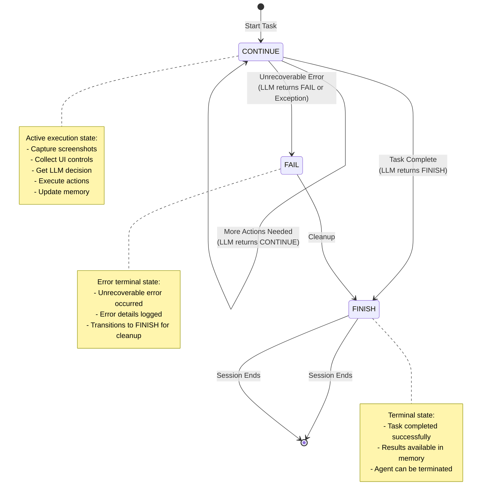
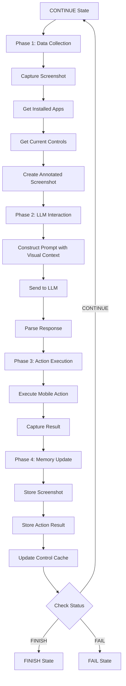

# MobileAgent State Machine

MobileAgent uses a **3-state finite state machine (FSM)** to manage Android device task execution flow. The minimal state set captures essential execution progression while maintaining simplicity and predictability. States transition based on LLM decisions and action execution results.

> **📖 Related Documentation:**
> 
> - [Mobile Agent Overview](overview.md) - Architecture and core responsibilities
> - [Processing Strategy](strategy.md) - 4-phase pipeline execution in CONTINUE state
> - [MCP Commands](commands.md) - Available mobile interaction commands
> - [Quick Start Guide](../getting_started/quick_start_mobile.md) - Set up your first Mobile Agent

## State Machine Architecture

### State Enumeration

```python
class MobileAgentStatus(Enum):
    """Store the status of the mobile agent"""
    CONTINUE = "CONTINUE"  # Task is ongoing, requires further actions
    FINISH = "FINISH"      # Task completed successfully
    FAIL = "FAIL"          # Task cannot proceed, unrecoverable error
```

### State Management

MobileAgent states are managed by `MobileAgentStateManager`, which implements the agent state registry pattern:

```python
class MobileAgentStateManager(AgentStateManager):
    """Manages the states of the mobile agent"""
    _state_mapping: Dict[str, Type[MobileAgentState]] = {}
    
    @property
    def none_state(self) -> AgentState:
        return NoneMobileAgentState()
```

All MobileAgent states are registered using the `@MobileAgentStateManager.register` decorator, enabling dynamic state lookup by name.

## State Transition Diagram



## State Definitions

### 1. CONTINUE State

**Purpose**: Active execution state where MobileAgent processes the user request and executes mobile actions.

```python
@MobileAgentStateManager.register
class ContinueMobileAgentState(MobileAgentState):
    """The class for the continue mobile agent state"""
    
    async def handle(self, agent: "MobileAgent", context: Optional["Context"] = None):
        """Execute the 4-phase processing pipeline"""
        await agent.process(context)
    
    def is_round_end(self) -> bool:
        return False  # Round continues
    
    def is_subtask_end(self) -> bool:
        return False  # Subtask continues
    
    @classmethod
    def name(cls) -> str:
        return MobileAgentStatus.CONTINUE.value
```

| Property | Value |
|----------|-------|
| **Type** | Active |
| **Processor Executed** | ✓ Yes (4 phases) |
| **Round Ends** | No |
| **Subtask Ends** | No |
| **Duration** | Single round |
| **Next States** | CONTINUE, FINISH, FAIL |

**Behavior**:

1. **Data Collection Phase**:
   - Captures device screenshot
   - Retrieves installed apps list
   - Collects current screen UI controls
   - Creates annotated screenshot with control IDs

2. **LLM Interaction Phase**:
   - Constructs prompts with screenshots and control information
   - Gets next action from LLM
   - Parses and validates response

3. **Action Execution Phase**:
   - Executes mobile actions (tap, swipe, type, launch app, etc.)
   - Captures execution results

4. **Memory Update Phase**:
   - Updates memory with screenshots and action results
   - Stores control information for next round

5. **State Determination**:
   - Analyzes LLM response for next state

**State Transition Logic**:

- **CONTINUE → CONTINUE**: Task requires more actions to complete (e.g., need to navigate through multiple screens)
- **CONTINUE → FINISH**: LLM determines task is complete (e.g., successfully filled form and submitted)
- **CONTINUE → FAIL**: Unrecoverable error encountered (e.g., required app not installed, control not found after multiple attempts)

### 2. FINISH State

**Purpose**: Terminal state indicating successful task completion.

```python
@MobileAgentStateManager.register
class FinishMobileAgentState(MobileAgentState):
    """The class for the finish mobile agent state"""
    
    def next_agent(self, agent: "MobileAgent") -> "MobileAgent":
        return agent
    
    def next_state(self, agent: "MobileAgent") -> MobileAgentState:
        return FinishMobileAgentState()  # Remains in FINISH
    
    def is_subtask_end(self) -> bool:
        return True  # Subtask completed
    
    def is_round_end(self) -> bool:
        return True  # Round ends
    
    @classmethod
    def name(cls) -> str:
        return MobileAgentStatus.FINISH.value
```

| Property | Value |
|----------|-------|
| **Type** | Terminal |
| **Processor Executed** | ✗ No |
| **Round Ends** | Yes |
| **Subtask Ends** | Yes |
| **Duration** | Permanent |
| **Next States** | FINISH (no transition) |

**Behavior**:

- Signals task completion to session manager
- No further processing occurs
- Agent instance can be terminated
- Screenshots and action history available in memory

**FINISH state is reached when**:

- All required mobile actions have been executed successfully
- The LLM determines the user request has been fulfilled
- Target UI state has been achieved (e.g., form submitted, information displayed)
- No errors or exceptions occurred during execution

### 3. FAIL State

**Purpose**: Terminal state indicating task failure due to unrecoverable errors.

```python
@MobileAgentStateManager.register
class FailMobileAgentState(MobileAgentState):
    """The class for the fail mobile agent state"""
    
    def next_agent(self, agent: "MobileAgent") -> "MobileAgent":
        return agent
    
    def next_state(self, agent: "MobileAgent") -> MobileAgentState:
        return FinishMobileAgentState()  # Transitions to FINISH for cleanup
    
    def is_round_end(self) -> bool:
        return True  # Round ends
    
    def is_subtask_end(self) -> bool:
        return True  # Subtask failed
    
    @classmethod
    def name(cls) -> str:
        return MobileAgentStatus.FAIL.value
```

| Property | Value |
|----------|-------|
| **Type** | Terminal (Error) |
| **Processor Executed** | ✗ No |
| **Round Ends** | Yes |
| **Subtask Ends** | Yes |
| **Duration** | Transitions to FINISH |
| **Next States** | FINISH |

**Behavior**:

- Logs failure reason and context
- Captures final screenshot for debugging
- Transitions to FINISH state for cleanup
- Session manager receives failure status

!!!error "Failure Conditions"
    FAIL state is reached when:
    
    - **App Unavailable**: Required app is not installed or cannot be launched
    - **Control Not Found**: Target UI control cannot be located after multiple attempts
    - **Device Disconnected**: ADB connection lost during execution
    - **Permission Denied**: Required permissions not granted on device
    - **Timeout**: Actions take too long to complete
    - **LLM Explicit Failure**: LLM explicitly indicates task cannot be completed
    - **Repeated Action Failures**: Multiple consecutive actions fail

**Error Recovery**:

While FAIL is a terminal state, the error information is logged for debugging:

```python
# Example error logging in FAIL state
agent.logger.error(f"Mobile task failed: {error_message}")
agent.logger.debug(f"Last action: {last_action}")
agent.logger.debug(f"Current screenshot saved to: {screenshot_path}")
agent.logger.debug(f"UI controls at failure: {current_controls}")
```

## State Transition Rules

### Transition Decision Logic

State transitions are determined by the LLM's response in the **CONTINUE** state:

```python
# LLM returns status in response
parsed_response = {
    "action": {
        "function": "click_control",
        "arguments": {"control_id": "5", "control_name": "Search"},
        "status": "CONTINUE"  # or "FINISH" or "FAIL"
    },
    "thought": "Need to click the search button to proceed"
}

# Agent updates its status based on LLM decision
agent.status = parsed_response["action"]["status"]
next_state = MobileAgentStateManager().get_state(agent.status)
```

### Transition Matrix

| Current State | Condition | Next State | Trigger |
|---------------|-----------|------------|---------|
| **CONTINUE** | LLM returns CONTINUE | CONTINUE | More actions needed (e.g., navigating multiple screens) |
| **CONTINUE** | LLM returns FINISH | FINISH | Task completed (e.g., information found and displayed) |
| **CONTINUE** | LLM returns FAIL | FAIL | Unrecoverable error (e.g., required control not available) |
| **CONTINUE** | Exception raised | FAIL | System error (e.g., ADB disconnected) |
| **FINISH** | Any | FINISH | No transition |
| **FAIL** | Any | FINISH | Cleanup transition |

## State-Specific Processing

### CONTINUE State Processing Pipeline

When in CONTINUE state, MobileAgent executes the full 4-phase pipeline:



### Terminal States (FINISH / FAIL)

Terminal states perform no processing:

- **FINISH**: Clean termination, results and screenshots available in memory
- **FAIL**: Error termination, error details and final screenshot logged

## Deterministic Control Flow

The 3-state design ensures deterministic, traceable execution:

- **Predictable Behavior**: Every execution path is well-defined
- **Debuggability**: State transitions are logged with screenshots for visual debugging
- **Testability**: Finite state space simplifies testing
- **Maintainability**: Simple state set reduces complexity
- **Visual Traceability**: Screenshots at each state provide visual execution history

## Comparison with Other Agents

| Agent | States | Complexity | Visual | Use Case |
|-------|--------|------------|--------|----------|
| **MobileAgent** | 3 | Minimal | ✓ Screenshots | Android mobile automation |
| **LinuxAgent** | 3 | Minimal | ✗ Text-only | Linux CLI task execution |
| **AppAgent** | 6 | Moderate | ✓ Screenshots | Windows app automation |
| **HostAgent** | 7 | High | ✓ Screenshots | Desktop orchestration |

MobileAgent's minimal 3-state design reflects its focused scope: execute mobile UI actions to fulfill user requests. The simplified state machine eliminates unnecessary complexity while maintaining robust error handling and completion detection, similar to LinuxAgent but with visual context support.

## Mobile-Specific Considerations

### Screenshot-Based State Tracking

Unlike LinuxAgent (text-based) or AppAgent (Windows UI API), MobileAgent relies heavily on screenshots for state understanding:

- Each CONTINUE round starts with a fresh screenshot
- Annotated screenshots show control IDs for precise interaction
- Screenshots are saved to memory for debugging and analysis
- Visual context helps LLM understand current UI state

### Control Caching

MobileAgent caches control information to minimize ADB overhead:

- Controls are cached for 5 seconds
- Cache is invalidated after each action (UI likely changed)
- Control dictionary enables quick lookup by ID
- Reduces repeated UI tree parsing

### Touch-Based Interaction

State transitions in MobileAgent are triggered by touch actions rather than keyboard commands:

- **Tap**: Primary interaction method
- **Swipe**: For scrolling and gestures
- **Type**: Text input (requires focused control)
- **Long-press**: For context menus (planned)

## Implementation Details

The state machine implementation can be found in:

```
ufo/agents/states/mobile_agent_state.py
```

Key classes:

- `MobileAgentStatus`: State enumeration (CONTINUE, FINISH, FAIL)
- `MobileAgentStateManager`: State registry and lookup
- `MobileAgentState`: Abstract base class
- `ContinueMobileAgentState`: Active execution state with 4-phase pipeline
- `FinishMobileAgentState`: Successful completion state
- `FailMobileAgentState`: Error termination state
- `NoneMobileAgentState`: Initial/undefined state

## Next Steps

- [Processing Strategy](strategy.md) - Understand the 4-phase processing pipeline executed in CONTINUE state
- [MCP Commands](commands.md) - Explore mobile UI interaction and app management commands
- [Overview](overview.md) - Return to MobileAgent architecture overview
