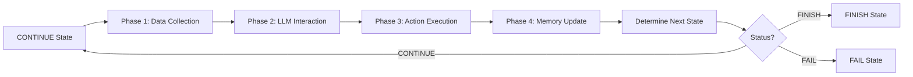
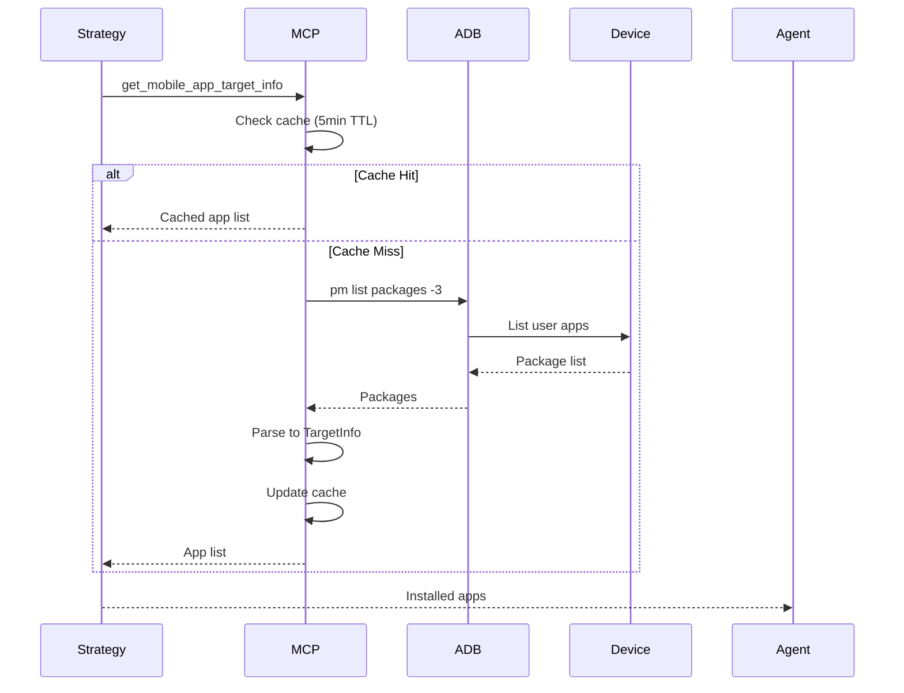
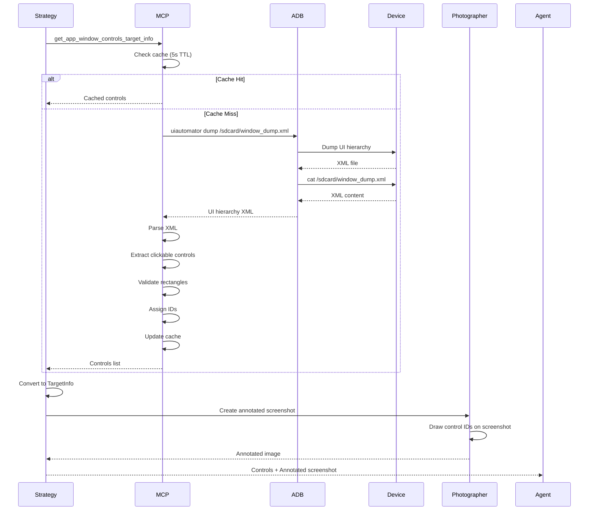
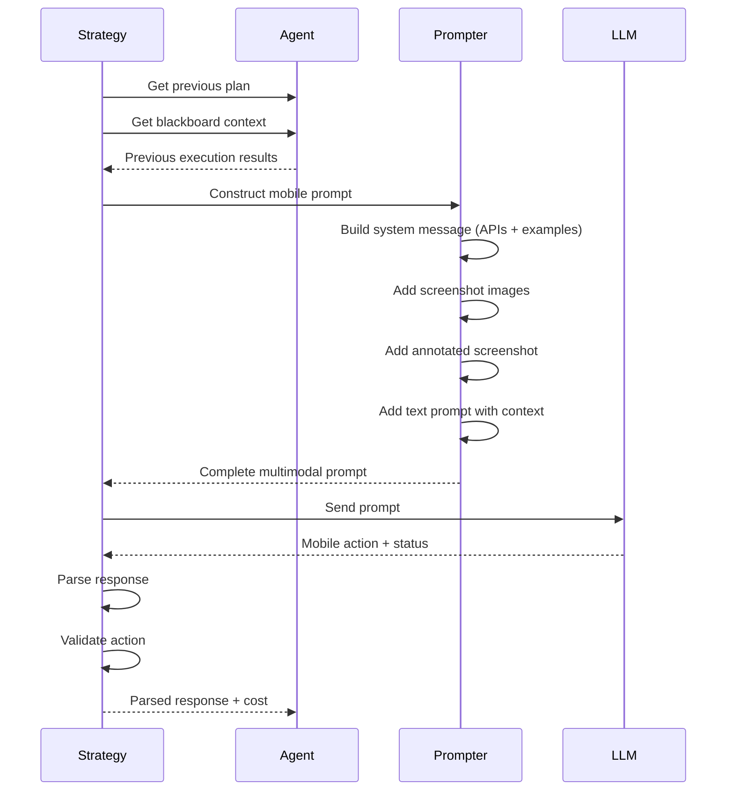
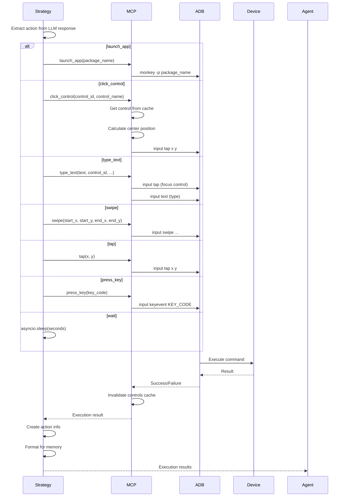
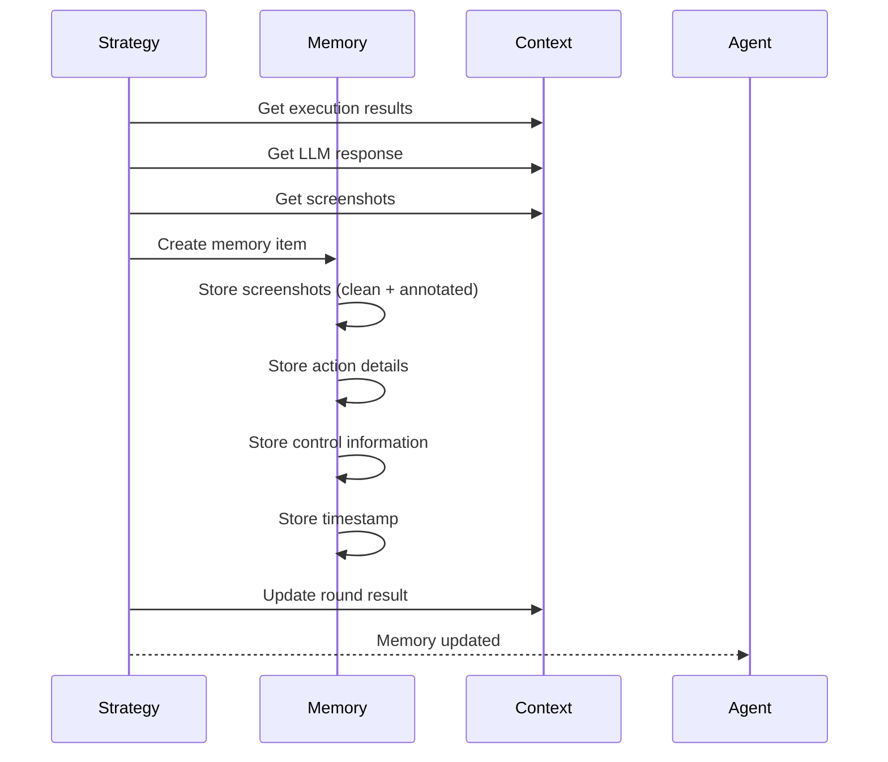
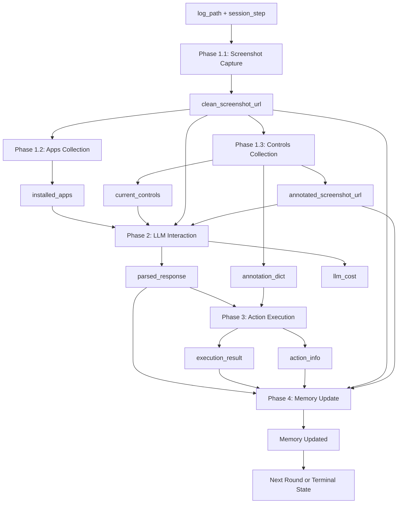

# MobileAgent Processing Strategy

MobileAgent executes a **4-phase processing pipeline** in the **CONTINUE** state. Each phase handles a specific aspect of mobile task execution: data collection (screenshots and controls), LLM decision making, action execution, and memory recording. This design separates visual context gathering from prompt construction, LLM reasoning, mobile action execution, and state updates, enhancing modularity and traceability.

> **📖 Related Documentation:**
> 
> - [Mobile Agent Overview](overview.md) - Architecture and core responsibilities
> - [State Machine](state.md) - FSM states (this strategy runs in CONTINUE state)
> - [MCP Commands](commands.md) - Available commands used in each phase
> - [Quick Start Guide](../getting_started/quick_start_mobile.md) - Set up your first Mobile Agent

## Strategy Assembly

Processing strategies are assembled and orchestrated by the `MobileAgentProcessor` class defined in `ufo/agents/processors/customized/customized_agent_processor.py`. The processor coordinates the 4-phase pipeline execution.

### MobileAgentProcessor Overview

The `MobileAgentProcessor` extends `CustomizedProcessor` and manages the Mobile-specific workflow:

```python
class MobileAgentProcessor(CustomizedProcessor):
    """
    Processor for Mobile Android MCP Agent.
    Handles data collection, LLM interaction, and action execution for Android devices.
    """
    
    def _setup_strategies(self) -> None:
        """Setup processing strategies for Mobile Agent."""
        
        # Phase 1: Data Collection (composed strategy - fail_fast=True)
        self.strategies[ProcessingPhase.DATA_COLLECTION] = ComposedStrategy(
            strategies=[
                MobileScreenshotCaptureStrategy(fail_fast=True),
                MobileAppsCollectionStrategy(fail_fast=False),
                MobileControlsCollectionStrategy(fail_fast=False),
            ],
            name="MobileDataCollectionStrategy",
            fail_fast=True,
        )
        
        # Phase 2: LLM Interaction (critical - fail_fast=True)
        self.strategies[ProcessingPhase.LLM_INTERACTION] = (
            MobileLLMInteractionStrategy(fail_fast=True)
        )
        
        # Phase 3: Action Execution (graceful - fail_fast=False)
        self.strategies[ProcessingPhase.ACTION_EXECUTION] = (
            MobileActionExecutionStrategy(fail_fast=False)
        )
        
        # Phase 4: Memory Update (graceful - fail_fast=False)
        self.strategies[ProcessingPhase.MEMORY_UPDATE] = (
            AppMemoryUpdateStrategy(fail_fast=False)
        )
```

### Strategy Registration

| Phase | Strategy Class | fail_fast | Rationale |
|-------|---------------|-----------|-----------|
| **DATA_COLLECTION** | `ComposedStrategy` (3 sub-strategies) | ✓ True | Visual context is critical for mobile interaction |
| **LLM_INTERACTION** | `MobileLLMInteractionStrategy` | ✓ True | LLM failure requires immediate recovery |
| **ACTION_EXECUTION** | `MobileActionExecutionStrategy` | ✗ False | Action failures can be handled gracefully |
| **MEMORY_UPDATE** | `AppMemoryUpdateStrategy` | ✗ False | Memory failures shouldn't block execution |

**Fail-Fast vs Graceful:**

- **fail_fast=True**: Critical phases where errors should immediately transition to FAIL state
- **fail_fast=False**: Non-critical phases where errors can be logged and execution continues

## Four-Phase Pipeline

### Pipeline Execution Flow



## Phase 1: Data Collection Strategy (Composed)

**Purpose**: Gather comprehensive visual and structural information about the current mobile UI state.

Phase 1 is a **composed strategy** consisting of three sub-strategies executed sequentially:

1. **Screenshot Capture**: Take device screenshot
2. **Apps Collection**: List installed applications
3. **Controls Collection**: Extract UI hierarchy and annotate controls

### Sub-Strategy 1.1: Screenshot Capture

```python
@depends_on("log_path", "session_step")
@provides(
    "clean_screenshot_path",
    "clean_screenshot_url",
    "annotated_screenshot_url",  # Initially None, set by Controls Collection
    "screenshot_saved_time",
)
class MobileScreenshotCaptureStrategy(BaseProcessingStrategy):
    """
    Strategy for capturing Android device screenshots.
    """
```

#### Workflow

```mermaid
sequenceDiagram
    participant Strategy
    participant MCP
    participant ADB
    participant Device
    
    Strategy->>MCP: capture_screenshot command
    MCP->>ADB: screencap -p /sdcard/screen_temp.png
    ADB->>Device: Execute screenshot
    Device-->>ADB: Screenshot saved
    
    ADB->>Device: Pull screenshot
    Device-->>ADB: PNG file
    ADB-->>MCP: PNG data
    
    MCP->>MCP: Encode to base64
    MCP-->>Strategy: data:image/png;base64,...
    
    Strategy->>Strategy: Save to log_path
    Strategy-->>Agent: Screenshot URL + path
```

#### Output

```python
{
  "clean_screenshot_path": "logs/.../action_step1.png",
  "clean_screenshot_url": "data:image/png;base64,iVBORw0KGgoAAAANS...",
  "annotated_screenshot_url": None,  # Set by Controls Collection
  "screenshot_saved_time": 0.234  # seconds
}
```

### Sub-Strategy 1.2: Apps Collection

```python
@depends_on("clean_screenshot_url")
@provides("installed_apps", "apps_collection_time")
class MobileAppsCollectionStrategy(BaseProcessingStrategy):
    """
    Strategy for collecting installed apps information from Android device.
    """
```

#### Workflow



#### Output Format

```python
{
  "installed_apps": [
    {
      "id": "1",
      "name": "com.android.chrome",
      "package": "com.android.chrome"
    },
    {
      "id": "2",
      "name": "com.google.android.apps.maps",
      "package": "com.google.android.apps.maps"
    },
    ...
  ],
  "apps_collection_time": 0.156  # seconds
}
```

**Caching**: Apps list is cached for 5 minutes to reduce ADB overhead, as installed apps rarely change during a session.

### Sub-Strategy 1.3: Controls Collection

```python
@depends_on("clean_screenshot_url")
@provides(
    "current_controls",
    "controls_collection_time",
    "annotated_screenshot_url",
    "annotated_screenshot_path",
    "annotation_dict",
)
class MobileControlsCollectionStrategy(BaseProcessingStrategy):
    """
    Strategy for collecting current screen controls information from Android device.
    Creates annotated screenshots with control labels.
    """
```

#### Workflow



#### UI Hierarchy Parsing

The strategy parses Android UI XML to extract meaningful controls:

```xml
<!-- Example UI hierarchy -->
<hierarchy>
  <node class="android.widget.FrameLayout" bounds="[0,0][1080,2400]">
    <node class="android.widget.LinearLayout" bounds="[0,72][1080,216]">
      <node class="android.widget.EditText" 
            text="" 
            content-desc="Search" 
            clickable="true" 
            bounds="[48,96][912,192]" />
      <node class="android.widget.ImageButton" 
            content-desc="Search" 
            clickable="true" 
            bounds="[912,96][1032,192]" />
    </node>
  </node>
</hierarchy>
```

**Control Selection Criteria**:

- `clickable="true"` - Can be tapped
- `long-clickable="true"` - Supports long-press
- `scrollable="true"` - Can be scrolled
- `checkable="true"` - Checkbox or toggle
- Has `text` or `content-desc` - Has label
- Type includes "Edit", "Button" - Input or action element

**Rectangle Validation**:

Controls with invalid rectangles are filtered out:

```python
# Bounds format: [left, top, right, bottom]
if right <= left or bottom <= top:
    # Invalid: width or height is zero/negative
    skip_control()
```

#### Output Format

```python
{
  "current_controls": [
    {
      "id": "1",
      "name": "Search",
      "type": "EditText",
      "rect": [48, 96, 912, 192]  # [left, top, right, bottom]
    },
    {
      "id": "2",
      "name": "Search",
      "type": "ImageButton",
      "rect": [912, 96, 1032, 192]
    },
    ...
  ],
  "annotated_screenshot_url": "data:image/png;base64,...",
  "annotated_screenshot_path": "logs/.../action_step1_annotated.png",
  "annotation_dict": {
    "1": {"id": "1", "name": "Search", "type": "EditText", ...},
    "2": {"id": "2", "name": "Search", "type": "ImageButton", ...},
    ...
  },
  "controls_collection_time": 0.345  # seconds
}
```

**Caching**: Controls are cached for 5 seconds, but the cache is invalidated after every action (UI likely changed).

### Composed Strategy Execution

The three sub-strategies are executed sequentially in a single composed strategy:

```python
ComposedStrategy(
    strategies=[
        MobileScreenshotCaptureStrategy(fail_fast=True),
        MobileAppsCollectionStrategy(fail_fast=False),
        MobileControlsCollectionStrategy(fail_fast=False),
    ],
    name="MobileDataCollectionStrategy",
    fail_fast=True,  # Overall failure if screenshot capture fails
)
```

**Execution Order**:

1. Screenshot Capture (critical)
2. Apps Collection (optional, continues on failure)
3. Controls Collection (optional, continues on failure)

---

## Phase 2: LLM Interaction Strategy

**Purpose**: Construct mobile-specific prompts with visual context and obtain next action from LLM.

### Strategy Implementation

```python
@depends_on("installed_apps", "current_controls", "clean_screenshot_url")
@provides(
    "parsed_response",
    "response_text",
    "llm_cost",
    "prompt_message",
    "action",
    "thought",
    "comment",
)
class MobileLLMInteractionStrategy(AppLLMInteractionStrategy):
    """
    Strategy for LLM interaction with Mobile Agent specific prompting.
    """
```

### Phase 2 Workflow



### Prompt Construction

The strategy constructs comprehensive multimodal prompts:

```python
prompt_message = agent.message_constructor(
    dynamic_examples=[],              # Few-shot examples (optional)
    dynamic_knowledge="",             # Retrieved knowledge (optional)
    plan=plan,                        # Previous execution plan
    request=request,                  # User request
    installed_apps=installed_apps,    # Available apps
    current_controls=current_controls, # UI controls with IDs
    screenshot_url=clean_screenshot_url,           # Clean screenshot
    annotated_screenshot_url=annotated_screenshot_url,  # With control IDs
    blackboard_prompt=blackboard_prompt,  # Shared context
    last_success_actions=last_success_actions  # Successful actions
)
```

### Multimodal Content Structure

The prompt includes both visual and textual elements:

```python
user_content = [
    # 1. Clean screenshot (for visual understanding)
    {
        "type": "image_url",
        "image_url": {"url": "data:image/png;base64,iVBORw0KGgo..."}
    },
    
    # 2. Annotated screenshot (for control identification)
    {
        "type": "image_url",
        "image_url": {"url": "data:image/png;base64,iVBORw0KGgo..."}
    },
    
    # 3. Text prompt with context
    {
        "type": "text",
        "text": """
        [Previous Plan]: [...]
        [User Request]: Search for restaurants on Maps
        [Installed Apps]: [
            {"id": "1", "name": "com.google.android.apps.maps", ...},
            ...
        ]
        [Current Screen Controls]: [
            {"id": "1", "name": "Search", "type": "EditText", ...},
            {"id": "2", "name": "Search", "type": "ImageButton", ...},
            ...
        ]
        [Last Success Actions]: [...]
        """
    }
]
```

### LLM Response Format

The LLM returns a structured mobile action:

```json
{
  "thought": "I need to launch Google Maps app first",
  "action": {
    "function": "launch_app",
    "arguments": {
      "package_name": "com.google.android.apps.maps",
      "id": "1"
    },
    "status": "CONTINUE"
  },
  "comment": "Launching Maps to search for restaurants"
}
```

### Mobile-Specific Features

**Visual Context Priority**: LLM sees both clean and annotated screenshots, enabling better UI understanding than text-only descriptions.

**Control ID References**: Annotated screenshot shows control IDs, allowing LLM to precisely reference UI elements in actions.

**App Awareness**: LLM knows which apps are installed, enabling intelligent app selection and launching.

**Touch-Based Actions**: LLM generates mobile-specific actions (tap, swipe, type) instead of desktop actions (click, drag, keyboard).

---

## Phase 3: Action Execution Strategy

**Purpose**: Execute mobile actions returned by LLM and capture structured results.

### Strategy Implementation

```python
class MobileActionExecutionStrategy(AppActionExecutionStrategy):
    """
    Strategy for executing actions in Mobile Agent.
    """
```

### Phase 3 Workflow



### Action Execution Flow

```python
# Extract parsed LLM response
parsed_response: AppAgentResponse = context.get_local("parsed_response")
command_dispatcher = context.global_context.command_dispatcher

# Execute the action via MCP
execution_results = await self._execute_app_action(
    command_dispatcher,
    parsed_response.action
)
```

### Result Capture

Execution results are structured for downstream processing:

```python
{
  "success": True,
  "action": "click_control(id=5, name=Search)",
  "message": "Clicked control 'Search' at (480, 144)",
  "control_info": {
    "id": "5",
    "name": "Search",
    "type": "EditText",
    "rect": [48, 96, 912, 192]
  }
}
```

### Action Info Creation

Results are formatted into `ActionCommandInfo` objects:

```python
actions = self._create_action_info(
    parsed_response.action,
    execution_results,
)

action_info = ListActionCommandInfo(actions)
action_info.color_print()  # Pretty print to console
```

### Cache Invalidation

After each action, control caches are invalidated:

```python
# Mobile MCP server automatically invalidates caches after actions
# This ensures next round gets fresh UI state
mobile_state.invalidate_controls()
```

---

## Phase 4: Memory Update Strategy

**Purpose**: Persist execution results, screenshots, and control information into agent memory for future reference.

### Strategy Implementation

MobileAgent reuses the `AppMemoryUpdateStrategy` from the app agent framework:

```python
self.strategies[ProcessingPhase.MEMORY_UPDATE] = AppMemoryUpdateStrategy(
    fail_fast=False  # Memory failures shouldn't stop process
)
```

### Phase 4 Workflow



### Memory Structure

Each execution round is stored as a memory item:

```python
{
  "round": 1,
  "request": "Search for restaurants on Maps",
  "thought": "I need to launch Google Maps app first",
  "action": {
    "function": "launch_app",
    "arguments": {
      "package_name": "com.google.android.apps.maps",
      "id": "1"
    }
  },
  "result": {
    "success": True,
    "message": "Launched com.google.android.apps.maps"
  },
  "screenshots": {
    "clean": "logs/.../action_step1.png",
    "annotated": "logs/.../action_step1_annotated.png"
  },
  "controls": [
    {"id": "1", "name": "Search", "type": "EditText", ...},
    ...
  ],
  "status": "CONTINUE",
  "timestamp": "2025-11-14T10:30:45"
}
```

### Iterative Refinement

Memory enables iterative refinement across rounds:

1. **Round 1**: Launch Maps app → Maps opened
2. **Round 2**: Click search field (using control ID from Round 1 screenshot)
3. **Round 3**: Type "restaurants" → Text entered
4. **Round 4**: Click search button → Results displayed

Each round builds on previous results and screenshots stored in memory.

### Visual Debugging

Memory stores screenshots for each round, enabling visual debugging:

- **Clean Screenshots**: Show actual device UI
- **Annotated Screenshots**: Show control IDs used by LLM
- **Action Sequence**: Visual trace of entire task execution

---

## Middleware Stack

MobileAgent uses specialized middleware for logging:

```python
def _setup_middleware(self) -> None:
    """Setup middleware pipeline for Mobile Agent"""
    self.middleware_chain = [MobileLoggingMiddleware()]
```

### MobileLoggingMiddleware

Provides enhanced logging specific to Mobile operations:

```python
class MobileLoggingMiddleware(AppAgentLoggingMiddleware):
    """Specialized logging middleware for Mobile Agent"""
    
    def starting_message(self, context: ProcessingContext) -> str:
        request = context.get("request") or "Unknown Request"
        return f"Completing the user request: [bold cyan]{request}[/bold cyan] on Mobile."
```

**Logged Information**:

- User request
- Screenshots captured (with paths)
- Apps collected
- Controls identified (with IDs)
- Each mobile action executed
- Action results
- State transitions
- LLM costs
- Timing information

---

## Context Finalization

After processing, the processor updates global context:

```python
def _finalize_processing_context(self, processing_context: ProcessingContext):
    """Finalize processing context by updating ContextNames fields"""
    super()._finalize_processing_context(processing_context)
    
    try:
        result = processing_context.get_local("result")
        if result:
            self.global_context.set(ContextNames.ROUND_RESULT, result)
    except Exception as e:
        self.logger.warning(f"Failed to update context: {e}")
```

This makes execution results available to:

- Subsequent rounds (iterative execution)
- Other agents (if part of multi-agent workflow)
- Session manager (for monitoring and logging)

---

## Strategy Dependency Graph

The four phases have clear dependencies:



---

## Modular Design Benefits

The 4-phase strategy design provides:

!!!success "Modularity Benefits"
    - **Separation of Concerns**: Data collection, LLM reasoning, action execution, and memory are isolated
    - **Visual Context**: Screenshots provide rich UI understanding beyond text descriptions
    - **Testability**: Each phase can be tested independently with mocked data
    - **Extensibility**: New data collection strategies can be added (e.g., accessibility info)
    - **Reusability**: Memory strategy is shared with AppAgent
    - **Maintainability**: Clear boundaries between perception, decision, and action
    - **Traceability**: Each phase logs its operations independently with visual artifacts
    - **Performance**: Caching strategies reduce ADB overhead

---

## Comparison with Other Agents

| Agent | Phases | Data Collection | Visual | LLM | Action | Memory |
|-------|--------|----------------|--------|-----|--------|--------|
| **MobileAgent** | 4 | ✓ Screenshots + Controls + Apps | ✓ Multimodal | ✓ Mobile actions | ✓ Touch/swipe | ✓ Results + Screenshots |
| **LinuxAgent** | 3 | ✗ On-demand | ✗ Text-only | ✓ CLI commands | ✓ Shell | ✓ Results |
| **AppAgent** | 4 | ✓ Screenshots + UI | ✓ Multimodal | ✓ UI actions | ✓ GUI + API | ✓ Results + Screenshots |
| **HostAgent** | 4 | ✓ Desktop snapshot | ✓ Multimodal | ✓ App selection | ✓ Orchestration | ✓ Results |

MobileAgent's 4-phase pipeline includes **DATA_COLLECTION** phase because:

- Mobile UI requires visual context (screenshots)
- Control identification needs UI hierarchy parsing
- Touch targets need precise coordinates
- Apps list informs available actions
- Annotation creates visual correspondence between LLM and execution

This reflects the visual, touch-based nature of mobile interaction.

---

## Implementation Location

The strategy implementations can be found in:

```
ufo/agents/processors/
├── customized/
│   └── customized_agent_processor.py   # MobileAgentProcessor
└── strategies/
    └── mobile_agent_strategy.py        # Mobile-specific strategies
```

Key classes:

- `MobileAgentProcessor`: Strategy orchestrator
- `MobileScreenshotCaptureStrategy`: Screenshot capture via ADB
- `MobileAppsCollectionStrategy`: Installed apps collection
- `MobileControlsCollectionStrategy`: UI controls extraction and annotation
- `MobileLLMInteractionStrategy`: Multimodal prompt construction and LLM interaction
- `MobileActionExecutionStrategy`: Mobile action execution
- `MobileLoggingMiddleware`: Enhanced logging

---

## Next Steps

- [MCP Commands](commands.md) - Explore the mobile UI interaction and app management commands
- [State Machine](state.md) - Understand the 3-state FSM that controls strategy execution
- [Overview](overview.md) - Return to MobileAgent architecture overview
