```mermaid
sequenceDiagram
    participant Session
    participant Interactor
    participant Console as Rich Console
    participant User
    participant Storage as Experience DB
    
    Session->>Interactor: experience_asker()
    Interactor->>Console: Create experience panel
    Console->>Console: Show benefits
    Console->>User: Display panel
    
    Interactor->>Console: Confirm.ask()
    User->>Console: Yes/No
    Console->>Interactor: save_experience
    
    alt save_experience == True
        Interactor->>Console: Display success message
        Console->>User: "✅ Experience will be saved"
        Interactor->>Session: Return True
        Session->>Storage: Save conversation flow
    else save_experience == False
        Interactor->>Console: Display info message
        Console->>User: "ℹ️ Experience will not be saved"
        Interactor->>Session: Return False
    end
```

```mermaid
sequenceDiagram
    participant Agent
    participant Interactor
    participant Console as Rich Console
    participant User
    
    Agent->>Agent: Needs user input
    Agent->>Interactor: question_asker("What email?", 1)
    Interactor->>Console: Create question panel
    Console->>Console: Format with index
    Console->>User: Display panel
    
    Interactor->>Console: Prompt.ask()
    User->>Console: Enter answer
    Console->>Interactor: answer
    
    Interactor->>Console: Display confirmation
    Console->>User: "✅ Answer recorded: ..."
    
    Interactor->>Agent: Return answer
    Agent->>Agent: Continue execution
```

```mermaid
sequenceDiagram
    participant Agent
    participant Interactor
    participant Console as Rich Console
    participant User
    participant Action as Action Executor
    
    Agent->>Agent: About to execute sensitive action
    Agent->>Interactor: sensitive_step_asker("delete", "file.txt")
    Interactor->>Console: Create warning panel (RED)
    Console->>Console: Show action details
    Console->>Console: Display security warning
    Console->>User: Display panel
    
    Interactor->>Console: Confirm.ask() [default=False]
    User->>Console: Yes/No
    Console->>Interactor: proceed
    
    alt proceed == True
        Interactor->>Console: Display approval
        Console->>User: "✅ Action approved"
        Interactor->>Agent: Return True
        Agent->>Action: Execute sensitive action
    else proceed == False
        Interactor->>Console: Display cancellation
        Console->>User: "❌ Action cancelled"
        Interactor->>Agent: Return False
        Agent->>Agent: Skip action, try alternative
    end
```

# User Interaction Layer

!!!quote "The Human Interface"
    The **Interactor** module provides rich, styled CLI interactions for gathering user input, confirming actions, and guiding the user through UFO's workflow with beautiful Rich library panels and prompts.

!!!tip "Quick Reference"
    - **Initial request?** Use [first_request()](#first_request)
    - **Follow-up task?** Use [new_request()](#new_request)
    - **Save experience?** Use [experience_asker()](#experience_asker)
    - **Need user info?** Use [question_asker()](#question_asker)
    - **Sensitive action?** Use [sensitive_step_asker()](#sensitive_step_asker)

---

## Overview

The interactor module (`ufo/module/interactor.py`) implements user interaction functions using the [Rich](https://rich.readthedocs.io/) library for terminal UI. All functions create beautifully styled panels, prompts, and confirmations with consistent branding and UX.

### Design Principles

1. **🎨 Visual Consistency**: All interactions use consistent colors, borders, and styling
2. **🚀 Clear Branding**: UFO ASCII art and emoji-based visual hierarchy
3. **✅ Confirmation Feedback**: Every input receives acknowledgment
4. **🔒 Security-First**: Sensitive actions default to "No" for safety
5. **💡 Helpful Guidance**: Examples and hints guide users

### Architecture


---

## Function Reference

### first_request()

!!!success "Entry Point for New Sessions"
    Displays the welcome screen and prompts for the user's initial task request.

#### Signature

```python
def first_request() -> str
```

**Returns**: `str` - The user's first request

#### Visual Design


#### Panel Components

The welcome panel includes:

| Component | Content | Style |
|-----------|---------|-------|
| **Title** | 🛸 UFO Assistant | Bold blue |
| **Heading** | 🚀 Welcome to UFO - Your AI Assistant for Windows! | Bold cyan |
| **ASCII Art** | "UFO" text art | Small font, white |
| **Description** | "A UI-focused Agent for seamless Windows OS interaction" | Dim |
| **Prompt** | 🎯 What can I help you with today? | Bold yellow |
| **Examples** | 3 example tasks | Dim with emojis |
| **Border** | Double-line box | Blue |

**Example Tasks Shown:**

1. 📝 'Open Notepad and type a message'
2. 🔍 'Search for files on my desktop'
3. 📊 'Create a new Excel spreadsheet'

#### Example Output

```
╔══════════════════════════════════════════════════════════════╗
║        🛸 UFO Assistant                                      ║
╠══════════════════════════════════════════════════════════════╣
║                                                              ║
║  🚀 Welcome to UFO - Your AI Assistant for Windows!         ║
║                                                              ║
║   _   _ _____ ___                                            ║
║  | | | |  ___/ _ \                                           ║
║  | | | | |_ | | | |                                          ║
║  | |_| |  _|| |_| |                                          ║
║   \___/|_|   \___/                                           ║
║                                                              ║
║  A UI-focused Agent for seamless Windows OS interaction      ║
║                                                              ║
║  🎯 What can I help you with today?                          ║
║  Examples:                                                   ║
║  • 📝 'Open Notepad and type a message'                      ║
║  • 🔍 'Search for files on my desktop'                       ║
║  • 📊 'Create a new Excel spreadsheet'                       ║
║                                                              ║
╚══════════════════════════════════════════════════════════════╝

✨ Your request: _
```

#### Usage

```python
from ufo.module.interactor import first_request

# Application startup
request = first_request()
# User sees welcome panel and enters: "Open Calculator and compute 15 * 23"

print(request)
# Output: "Open Calculator and compute 15 * 23"

# Console also shows:
# 🎯 Got it! Starting to work on: "Open Calculator and compute 15 * 23"
# 🚀 Let's get started!
```

#### Confirmation Feedback

After input, displays:
```
🎯 Got it! Starting to work on: "Open Calculator and compute 15 * 23"
🚀 Let's get started!
```

---

### new_request()

!!!success "Continue or Exit"
    Prompts for a new task or allows the user to exit the application.

#### Signature

```python
def new_request() -> Tuple[str, bool]
```

**Returns**: 
- `str` - The new request (or "N" if exiting)
- `bool` - `True` if conversation is complete (user wants to exit), `False` otherwise

#### Flow Diagram


#### Panel Components

**Prompt Panel:**

| Component | Content | Style |
|-----------|---------|-------|
| **Title** | 🛸 UFO Assistant | Bold blue |
| **Question** | What would you like me to help you with next? | Bold cyan |
| **Hint** | 💡 Enter your new request, or type 'N' to exit | Dim |
| **Border** | Rounded box | Cyan |

**Goodbye Panel (if exiting):**

| Component | Content | Style |
|-----------|---------|-------|
| **Message** | 👋 Thank you for using UFO! Goodbye! | Bold yellow |
| **Border** | Rounded box | Yellow |

#### Example Usage

```python
from ufo.module.interactor import new_request

# After completing a task
request, complete = new_request()

if complete:
    print("User chose to exit")
    # Application cleanup and exit
else:
    print(f"New task: {request}")
    # Execute new task
```

**Example Interaction 1 - Continue:**

```
╭─────────────────────────────────────────────────────╮
│ 🛸 UFO Assistant                                    │
├─────────────────────────────────────────────────────┤
│                                                     │
│ What would you like me to help you with next?      │
│                                                     │
│ 💡 Enter your new request, or type 'N' to exit     │
│                                                     │
╰─────────────────────────────────────────────────────╯

Your request: Open Word and create a document
✨ Processing your request: Open Word and create a document
```

**Example Interaction 2 - Exit:**

```
Your request: N

╭─────────────────────────────────────────────────────╮
│ 👋 Thank you for using UFO! Goodbye!                │
╰─────────────────────────────────────────────────────╯
```

#### Return Value Handling

```python
request, complete = new_request()

# complete == True: User wants to exit
# complete == False: User has a new task

if not complete:
    # Process the new request
    execute_task(request)
else:
    # Exit application
    sys.exit(0)
```

---

### experience_asker()

!!!success "Learn from Conversations"
    Asks whether to save the conversation flow for future learning and improvement.

#### Signature

```python
def experience_asker() -> bool
```

**Returns**: `bool` - `True` if user wants to save experience, `False` otherwise

#### Purpose

Experience saving enables:
- **Learning**: UFO learns patterns from successful task completions
- **Efficiency**: Similar tasks execute faster with saved experience
- **Personalization**: Adapts to user preferences over time

#### Visual Design



#### Panel Components

| Component | Content | Style |
|-----------|---------|-------|
| **Title** | 🧠 Learning & Memory | Bold |
| **Heading** | 💾 Save Experience for Future Learning | Bold magenta |
| **Description** | Explanation of experience saving | Dim |
| **Benefits** | 3 bullet points with emojis | Cyan |
| **Border** | Double-line box | Magenta |

**Benefits Listed:**

1. 🚀 Faster execution for similar tasks
2. 🎯 Better accuracy over time
3. 🤝 Personalized assistance

#### Example Output

```
╔══════════════════════════════════════════════════════════════╗
║        🧠 Learning & Memory                                  ║
╠══════════════════════════════════════════════════════════════╣
║                                                              ║
║  💾 Save Experience for Future Learning                      ║
║                                                              ║
║  Would you like to save the current conversation flow?      ║
║  This helps UFO learn and improve for similar tasks         ║
║  in the future.                                              ║
║                                                              ║
║  Benefits:                                                   ║
║  • 🚀 Faster execution for similar tasks                     ║
║  • 🎯 Better accuracy over time                              ║
║  • 🤝 Personalized assistance                                ║
║                                                              ║
╚══════════════════════════════════════════════════════════════╝

Save this conversation flow? [Y/n]: Y
✅ Experience will be saved for future reference
```

#### Usage

```python
from ufo.module.interactor import experience_asker

# After task completion
save_flow = experience_asker()

if save_flow:
    # Save to experience database
    experience_db.save(
        task=context.get("TASK"),
        trajectory=context.get("TRAJECTORY"),
        outcome="success"
    )
    logger.info("Experience saved for future learning")
else:
    logger.info("Experience not saved per user preference")
```

#### Configuration Integration

This interacts with the `SAVE_EXPERIENCE` configuration:

```python
# In session configuration
SAVE_EXPERIENCE_MODE = configs.get("SAVE_EXPERIENCE", "ask")

if SAVE_EXPERIENCE_MODE == "always":
    # Always save, don't ask
    save_experience = True
elif SAVE_EXPERIENCE_MODE == "ask":
    # Ask user
    save_experience = experience_asker()
elif SAVE_EXPERIENCE_MODE == "auto":
    # Auto-decide based on outcome
    save_experience = (outcome == "success")
else:  # "always_not"
    # Never save
    save_experience = False
```

**Configuration Modes:**

| Mode | Behavior | Use Case |
|------|----------|----------|
| `always` | Always save, never ask | Production learning |
| `ask` | Ask user each time | Interactive mode |
| `auto` | Save if successful | Semi-automated |
| `always_not` | Never save | Privacy/testing |

---

### question_asker()

!!!success "Gather Missing Information"
    Prompts the user to answer a specific question needed to complete a task.

#### Signature

```python
def question_asker(question: str, index: int) -> str
```

**Parameters:**

| Parameter | Type | Description |
|-----------|------|-------------|
| `question` | `str` | The question to ask the user |
| `index` | `int` | Question number (for multi-question flows) |

**Returns**: `str` - The user's answer

#### Use Cases

- Agent needs clarification: "Which email account should I use?"
- Missing parameter: "What should the file be named?"
- Ambiguous context: "Which window should I operate on?"
- User preference: "Do you want to overwrite the existing file?"

#### Visual Design



#### Panel Components

| Component | Content | Style |
|-----------|---------|-------|
| **Title** | 🤔 Information Needed | Bold |
| **Heading** | ❓ Question #{index} | Bold blue |
| **Question Text** | The actual question | White |
| **Border** | Rounded box | Blue |

#### Example Output

```
╭─────────────────────────────────────────────────────╮
│ 🤔 Information Needed                               │
├─────────────────────────────────────────────────────┤
│                                                     │
│ ❓ Question #1                                      │
│                                                     │
│ Which email account should I send from?            │
│                                                     │
╰─────────────────────────────────────────────────────╯

Your answer to question #1: personal@gmail.com
✅ Answer recorded: personal@gmail.com
```

#### Usage

```python
from ufo.module.interactor import question_asker

# Agent needs user input
missing_param = detect_missing_parameter()

if missing_param:
    answer = question_asker(
        question=f"Please provide {missing_param}",
        index=1
    )
    
    # Use answer in execution
    context.set(missing_param, answer)
```

#### Multiple Questions

For multi-question flows:

```python
questions = [
    "What is the recipient email?",
    "What should the subject be?",
    "Do you want to attach any files?"
]

answers = []
for i, question in enumerate(questions, start=1):
    answer = question_asker(question, i)
    answers.append(answer)

recipient, subject, attach_files = answers
```

#### Confirmation Feedback

After answer input, displays:
```
✅ Answer recorded: {answer}
```

---

### sensitive_step_asker()

!!!danger "Security Confirmation"
    Requests explicit user confirmation before executing potentially sensitive actions.

#### Signature

```python
def sensitive_step_asker(action: str, control_text: str) -> bool
```

**Parameters:**

| Parameter | Type | Description |
|-----------|------|-------------|
| `action` | `str` | The action to be performed (e.g., "delete", "modify") |
| `control_text` | `str` | The target control or element |

**Returns**: `bool` - `True` if user approves, `False` if user cancels

#### Sensitive Actions

Actions requiring confirmation:

| Category | Examples | Risk |
|----------|----------|------|
| **File Operations** | Delete, Overwrite, Move | Data loss |
| **System Settings** | Modify registry, Change system config | System instability |
| **Credentials** | Input password, Save credentials | Security breach |
| **Irreversible** | Format, Empty recycle bin | Cannot undo |
| **External** | Send email, Post online | Privacy leak |

#### Visual Design



#### Panel Components

| Component | Content | Style |
|-----------|---------|-------|
| **Title** | 🔒 Security Check | Bold red |
| **Heading** | ⚠️ Security Confirmation Required | Bold red |
| **Warning** | UFO is about to perform a potentially sensitive action | Yellow |
| **Action** | The action name | Cyan |
| **Target** | The control/element text | Cyan |
| **Review Prompt** | Please review this action carefully | Dim |
| **Border** | Heavy box | Red |

#### Example Output

```
╔══════════════════════════════════════════════════════════════╗
║        🔒 Security Check                                     ║
╠══════════════════════════════════════════════════════════════╣
║                                                              ║
║  ⚠️  Security Confirmation Required                          ║
║                                                              ║
║  UFO is about to perform a potentially sensitive action:    ║
║                                                              ║
║  Action: delete                                              ║
║  Target: C:\Users\Documents\important_file.docx              ║
║                                                              ║
║  Please review this action carefully before proceeding.      ║
║                                                              ║
╚══════════════════════════════════════════════════════════════╝

🚨 IMPORTANT: This action may modify system settings or data.

Do you want to proceed with this action? [y/N]: N
❌ Action cancelled by user
```

#### Usage

```python
from ufo.module.interactor import sensitive_step_asker

# Before executing sensitive action
if is_sensitive_action(action_type):
    proceed = sensitive_step_asker(
        action=action_type,
        control_text=target_element
    )
    
    if proceed:
        # User approved - execute action
        execute_action(action_type, target_element)
    else:
        # User cancelled - try alternative
        logger.warning(f"Sensitive action cancelled: {action_type}")
        return alternative_approach()
```

#### Integration with Agent Logic

```python
class AppAgent:
    def execute_action(self, action: Action) -> Result:
        """Execute action with security checks."""
        
        # Check if action is sensitive
        if self.is_sensitive(action):
            # Ask for confirmation
            approved = sensitive_step_asker(
                action=action.name,
                control_text=action.target
            )
            
            if not approved:
                # User rejected - mark as cancelled
                return Result(
                    status=ResultStatus.CANCELLED,
                    error="User cancelled sensitive action",
                    result="Action was not executed due to user cancellation"
                )
        
        # Execute normally
        return self.perform_action(action)
    
    def is_sensitive(self, action: Action) -> bool:
        """Check if action is sensitive."""
        sensitive_actions = [
            "delete", "remove", "clear", "format",
            "modify_registry", "change_password",
            "send_email", "post_online"
        ]
        return action.name.lower() in sensitive_actions
```

#### Default to Safety

!!!warning "Security Default"
    The confirmation prompt **defaults to False (No)** for safety. Users must explicitly type "Y" or "Yes" to approve.

```python
proceed = Confirm.ask(
    "[bold yellow]Do you want to proceed with this action?[/bold yellow]",
    default=False,  # ← Safety default
    console=console,
)
```

#### Confirmation Feedback

**If approved:**
```
✅ Action approved - proceeding...
```

**If cancelled:**
```
❌ Action cancelled by user
```

---

## Rich Library Components

### Console

All functions use a shared `Console` instance:

```python
from rich.console import Console

console = Console()
```

**Features:**
- UTF-8 emoji support
- Color and style rendering
- Panel and table rendering
- Width auto-detection

### Panel

Creates styled boxes with borders:

```python
from rich.panel import Panel
from rich import box

panel = Panel(
    content="Your content here",
    title="Panel Title",
    border_style="blue",
    box=box.DOUBLE,
    padding=(1, 2)
)
```

**Box Styles Used:**

| Style | Usage | Appearance |
|-------|-------|------------|
| `box.DOUBLE` | Welcome, experience | Double-line borders (═║) |
| `box.ROUNDED` | Questions, prompts | Rounded corners (╭╮╰╯) |
| `box.HEAVY` | Security warnings | Heavy lines (━┃) |

### Prompt

Asks for text input:

```python
from rich.prompt import Prompt

answer = Prompt.ask(
    "[bold green]Your input[/bold green]",
    console=console
)
```

### Confirm

Asks for yes/no confirmation:

```python
from rich.prompt import Confirm

proceed = Confirm.ask(
    "[bold yellow]Proceed?[/bold yellow]",
    default=True,
    console=console
)
```

**Returns:** `bool` - `True` for yes, `False` for no

### Text

Creates styled text objects:

```python
from rich.text import Text

confirmation_text = Text()
confirmation_text.append("🎯 ", style="bold yellow")
confirmation_text.append("Got it!", style="bold cyan")
```

---

## Styling Guide

### Color Palette

| Color | Usage | Examples |
|-------|-------|----------|
| **Blue** | Primary brand color | Titles, panels, links |
| **Cyan** | User input, highlights | Prompts, user text |
| **Green** | Success, confirmations | Checkmarks, approvals |
| **Yellow** | Warnings, attention | Important notices |
| **Red** | Errors, security | Warnings, cancellations |
| **Magenta** | Special features | Learning, memory |
| **White** | Content text | Questions, descriptions |
| **Dim** | Secondary info | Hints, examples |

### Emoji Usage

| Emoji | Meaning | Context |
|-------|---------|---------|
| 🛸 | UFO brand | Titles, branding |
| 🚀 | Start, launch | Actions, beginning |
| ✨ | Magic, processing | Confirmations, actions |
| 🎯 | Target, goal | Requests, objectives |
| 💾 | Save, memory | Experience saving |
| 🤔 | Question, think | User questions |
| 🔒 | Security, lock | Sensitive actions |
| ⚠️ | Warning, caution | Security alerts |
| ✅ | Success, done | Confirmations |
| ❌ | Cancel, no | Rejections |
| 💡 | Tip, hint | Helpful info |
| 👋 | Goodbye, hello | Greetings, farewells |

### Typography

**Text Styles:**

| Style | Markup | Usage |
|-------|--------|-------|
| **Bold** | `[bold]text[/bold]` | Headings, emphasis |
| **Dim** | `[dim]text[/dim]` | Secondary info |
| **Italic** | `[italic]text[/italic]` | Subtle emphasis |

**Combined Styles:**

```python
"[bold cyan]Title[/bold cyan]"
"[dim green]Success message[/dim green]"
"[bold red]ERROR[/bold red]"
```

---

## Best Practices

### When to Ask

!!!tip "Minimize Interruptions"
    - ✅ Ask when information is **required** and cannot be inferred
    - ✅ Batch multiple questions together when possible
    - ✅ Always confirm sensitive/irreversible actions
    - ❌ Don't ask for information already in context
    - ❌ Don't interrupt workflow for optional details
    - ❌ Don't confirm every single action

### User Experience

!!!success "Smooth Interactions"
    1. **Clear questions**: Be specific about what you need
    2. **Provide examples**: Show valid input formats
    3. **Immediate feedback**: Acknowledge every input
    4. **Helpful defaults**: Use sensible defaults for confirmations
    5. **Escape hatches**: Always provide a way to cancel/exit

### Error Handling

Handle user input gracefully:

```python
try:
    answer = question_asker("Enter a number:", 1)
    number = int(answer)
except ValueError:
    # User entered invalid number
    console.print("[red]Invalid number entered. Using default.[/red]")
    number = 0
```

### Accessibility

- Use emojis **alongside** text (not instead of)
- Provide text descriptions of visual elements
- Support both mouse and keyboard input
- Test with different terminal sizes

---

## Integration Examples

### Complete Request Flow

```python
from ufo.module.interactor import (
    first_request,
    new_request,
    question_asker,
    sensitive_step_asker,
    experience_asker
)

def main():
    # Initial request
    request = first_request()
    session = create_session(request)
    
    while True:
        # Execute task
        try:
            result = session.execute()
            
            # Check for required user input
            if result.needs_input:
                answer = question_asker(
                    question=result.question,
                    index=1
                )
                session.provide_answer(answer)
                continue
            
            # Check for sensitive action
            if result.is_sensitive:
                proceed = sensitive_step_asker(
                    action=result.action_type,
                    control_text=result.target
                )
                
                if not proceed:
                    session.cancel_action()
                    continue
            
            # Task complete
            if result.status == "complete":
                # Ask about experience saving
                if experience_asker():
                    session.save_experience()
                
                # Ask for new task
                new_req, complete = new_request()
                
                if complete:
                    break
                
                # Start new session
                session = create_session(new_req)
        
        except Exception as e:
            console.print(f"[red]Error: {e}[/red]")
            break
```

### Custom Interactor

Create custom interaction functions following the same pattern:

```python
from rich.console import Console
from rich.panel import Panel
from rich.prompt import Prompt
from rich import box

console = Console()

def model_selector() -> str:
    """Ask user to select an AI model."""
    
    panel = Panel(
        "[bold cyan]🤖 Select AI Model[/bold cyan]\n\n"
        "[white]Available models:[/white]\n"
        "[dim]1. GPT-4 (Most capable)[/dim]\n"
        "[dim]2. GPT-3.5 (Faster)[/dim]\n"
        "[dim]3. Claude (Alternative)[/dim]",
        title="⚙️ [bold]Configuration[/bold]",
        border_style="cyan",
        box=box.ROUNDED
    )
    
    console.print(panel)
    
    choice = Prompt.ask(
        "[bold green]Model number[/bold green]",
        choices=["1", "2", "3"],
        default="1",
        console=console
    )
    
    models = {"1": "gpt-4", "2": "gpt-3.5-turbo", "3": "claude-2"}
    selected = models[choice]
    
    console.print(f"[dim green]✅ Selected: {selected}[/dim green]")
    
    return selected
```

---

## Troubleshooting

### Issue: Broken Panel Display

**Symptoms:**
- Panel borders don't align
- Text wraps incorrectly
- Emojis cause misalignment

**Solutions:**
```python
# Ensure console uses proper encoding
console = Console(force_terminal=True, force_interactive=True)

# Adjust panel width
panel = Panel(content, width=60)

# Use Panel.fit for auto-sizing
panel = Panel.fit(content)
```

### Issue: Colors Not Showing

**Symptoms:**
- Colors display as plain text
- Styling markup visible

**Diagnosis:**
```python
# Check if terminal supports colors
if console.is_terminal:
    print("Terminal detected")
else:
    print("Not a terminal - colors disabled")
```

**Solutions:**
- Run in proper terminal (not redirected output)
- Set `FORCE_COLOR=1` environment variable
- Use `Console(force_terminal=True)`

### Issue: Unicode Errors

**Symptoms:**
- Emojis display as `?` or boxes
- UTF-8 decode errors

**Solutions:**
```python
# Windows: Set console code page
import os
os.system("chcp 65001")  # UTF-8

# Ensure file encoding
# -*- coding: utf-8 -*-

# Console with UTF-8
console = Console(force_terminal=True, legacy_windows=False)
```

---

## Reference

### Module Import

```python
from ufo.module.interactor import (
    first_request,
    new_request,
    experience_asker,
    question_asker,
    sensitive_step_asker
)
```

### Dependencies

```python
from art import text2art              # ASCII art generation
from rich.console import Console       # Terminal rendering
from rich.panel import Panel           # Styled panels
from rich.prompt import Prompt, Confirm  # User input
from rich.text import Text             # Styled text
from rich.align import Align           # Text alignment
from rich import box                   # Box styles
```

---

## See Also

- [Session](./session.md) - Session lifecycle and user interaction points
- [Context](./context.md) - Storing user inputs in context
- [Round](./round.md) - Round execution with user confirmations
- [Rich Documentation](https://rich.readthedocs.io/) - Full Rich library guide
