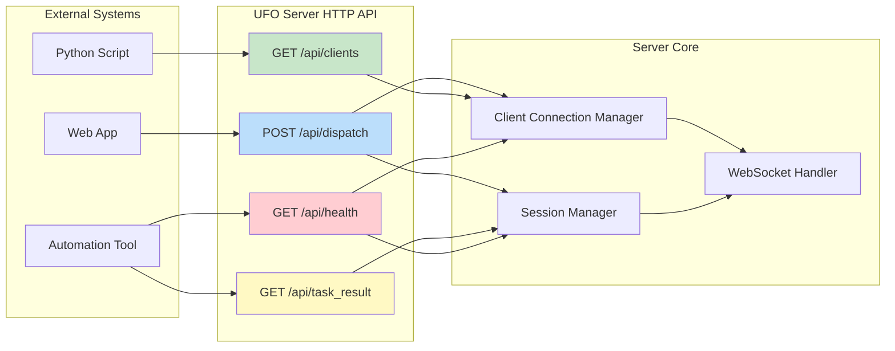
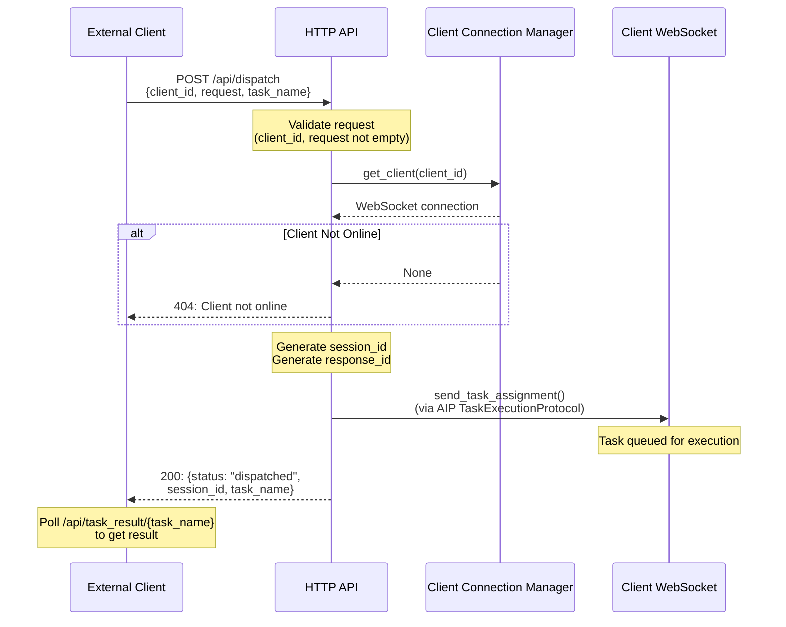
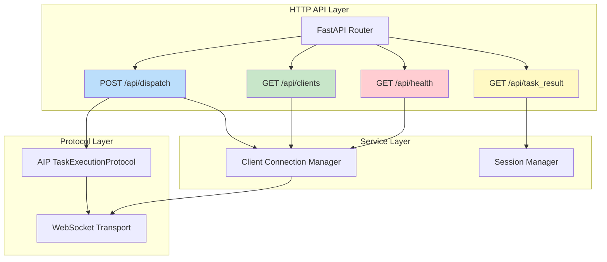
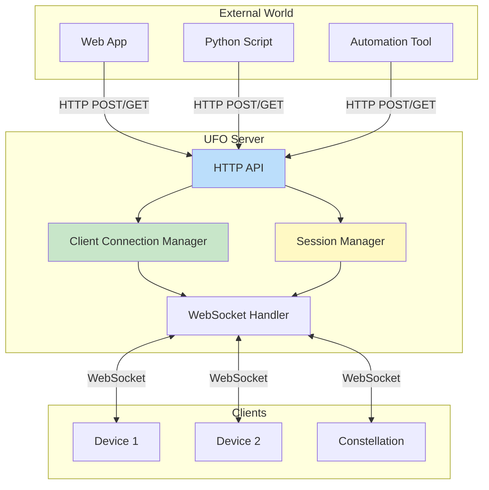

# HTTP API Reference

The UFO Server provides a RESTful HTTP API for external systems to dispatch tasks, monitor client connections, retrieve results, and perform health checks. All endpoints are prefixed with `/api`.

## 🎯 Overview



**Core Capabilities:**

| Capability | Endpoint | Description |
|------------|----------|-------------|
| **Task Dispatch** | `POST /api/dispatch` | Send tasks to connected devices via HTTP |
| **Client Monitoring** | `GET /api/clients` | Query connected devices and constellations |
| **Result Retrieval** | `GET /api/task_result/{task_name}` | Fetch task execution results |
| **Health Checks** | `GET /api/health` | Monitor server status and uptime |

**Why Use the HTTP API?**

- **External Integration**: Trigger UFO tasks from web apps, scripts, or CI/CD pipelines
- **Stateless**: No WebSocket connection required
- **RESTful**: Standard HTTP methods and JSON payloads
- **Monitoring**: Health checks for load balancers and monitoring systems

---

## 📡 Endpoints

### POST /api/dispatch

Send a task to a connected device without establishing a WebSocket connection. Ideal for external systems, web apps, and automation scripts.

#### Request Format

**Corrected Request Body** (based on actual source code):

```json
{
  "client_id": "device_windows_001",
  "request": "Open Chrome and navigate to github.com",
  "task_name": "github_navigation_task"
}
```

**Request Schema:**

| Field | Type | Required | Default | Description |
|-------|------|----------|---------|-------------|
| `client_id` | `string` | �?**Yes** | - | Target client identifier (device or constellation) |
| `request` | `string` | �?**Yes** | - | Natural language task description (user request) |
| `task_name` | `string` | ⚠️ No | Auto-generated UUID | Human-readable task identifier |

**Important:** The correct parameter names (verified from source code) are:
- `client_id` (not `device_id`)
- `request` (not `task`)
- `task_name` (optional identifier)

#### Success Response (200)

```json
{
  "status": "dispatched",
  "task_name": "github_navigation_task",
  "client_id": "device_windows_001",
  "session_id": "d4e5f6a7-b8c9-1234-5678-9abcdef01234"
}
```

**Response Schema:**

| Field | Type | Description |
|-------|------|-------------|
| `status` | `string` | Always `"dispatched"` on success |
| `task_name` | `string` | Task identifier (from request or auto-generated) |
| `client_id` | `string` | Target client ID |
| `session_id` | `string` | UUID for tracking task execution (use with `/api/task_result`) |

#### Error Responses

**Client Not Online (404):**
```json
{
  "detail": "Client not online"
}
```
    
**Cause:** Target client is not connected to the server.
    
**Solution:** Check `/api/clients` to see available clients.

**Empty Client ID (400):**
```json
{
  "detail": "Empty client ID"
}
```
    
**Cause:** `client_id` field is missing or empty.
    
**Solution:** Provide a valid `client_id` in the request body.

**Empty Task Content (400):**
```json
{
  "detail": "Empty task content"
}
```
    
**Cause:** `request` field is missing or empty.
    
**Solution:** Provide a non-empty task description in the `request` field.

#### Implementation Details

**Source Code** (verified from `ufo/server/services/api.py`):

```python
@router.post("/api/dispatch")
async def dispatch_task_api(data: Dict[str, Any]):
        # Extract parameters
        client_id = data.get("client_id")
        user_request = data.get("request", "")
        task_name = data.get("task_name", str(uuid4()))  # Auto-generate if not provided
        
        # Validation: Empty request
        if not user_request:
            logger.error(f"Got empty task content for client {client_id}.")
            raise HTTPException(status_code=400, detail="Empty task content")
        
        # Validation: Empty client ID
        if not client_id:
            logger.error("Client ID must be provided.")
            raise HTTPException(status_code=400, detail="Empty client ID")
        
        # Logging
        if not task_name:
            logger.warning(f"Task name not provided, using {task_name}.")
        else:
            logger.info(f"Task name: {task_name}.")
        
        logger.info(f"Dispatching task '{user_request}' to client '{client_id}'")
        
        # Get client WebSocket
        ws = client_manager.get_client(client_id)
        if not ws:
            logger.error(f"Client {client_id} not online.")
            raise HTTPException(status_code=404, detail="Client not online")
        
        # Use AIP TaskExecutionProtocol to send task
        transport = WebSocketTransport(ws)
        task_protocol = TaskExecutionProtocol(transport)
        
        session_id = str(uuid4())
        response_id = str(uuid4())
        
        logger.info(
            f"[AIP] Sending task assignment via API: task_name={task_name}, "
            f"session_id={session_id}, client_id={client_id}"
        )
        
        # Send via AIP protocol
        await task_protocol.send_task_assignment(
            user_request=user_request,
            task_name=task_name,
            session_id=session_id,
            response_id=response_id,
        )
        
        return {
            "status": "dispatched",
            "task_name": task_name,
            "client_id": client_id,
            "session_id": session_id,
        }
    ```

**Tip:** Use the returned `session_id` to track results via `GET /api/task_result/{task_name}`.

#### Sequence Diagram



---

### GET /api/clients

Query all currently connected clients (devices and constellations) to determine which targets are available for task dispatch.

#### Request

```http
GET /api/clients
```

**No parameters required.**

#### Success Response (200)

```json
{
  "online_clients": [
    "device_windows_001",
    "device_linux_002",
    "constellation_orchestrator_001"
  ]
}
```

**Response Schema:**

| Field | Type | Description |
|-------|------|-------------|
| `online_clients` | `array<string>` | List of all connected client IDs |

**Source Code:**

```python
@router.get("/api/clients")
async def list_clients():
    return {"online_clients": client_manager.list_clients()}
```

#### Usage Patterns

**Source Code:**

```python
@router.get("/api/clients")
async def list_clients():
    return {"online_clients": client_manager.list_clients()}
```

#### Usage Patterns

**Check Device Availability:**
```python
import requests
    
response = requests.get("http://localhost:5000/api/clients")
clients = response.json()["online_clients"]
    
target_device = "device_windows_001"
    
if target_device in clients:
    print(f"�?{target_device} is online")
    # Dispatch task
else:
    print(f"�?{target_device} is offline")
```

**Filter by Client Type:**
```python
# Note: Current API doesn't return client types
# You must know your client naming convention
# Example: devices start with "device_", constellations with "constellation_"
    
clients = response.json()["online_clients"]
    
devices = [c for c in clients if c.startswith("device_")]
constellations = [c for c in clients if c.startswith("constellation_")]
    
print(f"Devices online: {len(devices)}")
print(f"Constellations online: {len(constellations)}")
```

**Monitor Client Count:**
```python
import time
    
while True:
    response = requests.get("http://localhost:5000/api/clients")
    clients = response.json()["online_clients"]
        
    print(f"[{time.strftime('%H:%M:%S')}] Clients online: {len(clients)}")
        
    time.sleep(10)  # Check every 10 seconds
```

---

### GET /api/task_result/{task_name}

Poll this endpoint to get the result of a dispatched task. Use the `task_name` returned from `/api/dispatch`.

#### Request

```http
GET /api/task_result/github_navigation_task
```

**Path Parameters:**

| Parameter | Type | Description |
|-----------|------|-------------|
| `task_name` | `string` | Task identifier (from `/api/dispatch` response) |

#### Response States

**Pending (200):**
Task is still running:
    
```json
{
  "status": "pending"
}
```
    
**Action:** Continue polling until status changes to `"done"`.

**Completed (200):**
Task has finished:
    
```json
{
  "status": "done",
  "result": {
    "action": "Opened Chrome and navigated to github.com",
    "screenshot": "base64_encoded_image_data",
    "control_label": "Address bar",
    "control_text": "github.com"
  }
}
```
    
**Action:** Process the result. The `result` structure depends on the task type and device implementation.

**Not Found (Implicit):**
If `task_name` doesn't exist in session manager:
    
```json
{
  "status": "pending"
}
```
    
**Note:** Current implementation returns `{"status": "pending"}` for non-existent tasks (not a 404 error).

#### Implementation Details

**Source Code:**

```python
@router.get("/api/task_result/{task_name}")
async def get_task_result(task_name: str):
    # Query session manager for result
    result = session_manager.get_result_by_task(task_name)
    
    if not result:
        return {"status": "pending"}
    
    return {"status": "done", "result": result}
```

**Note on Result Retention:**

Results are stored in memory and may be cleared after:

- Server restart
- Session cleanup (if implemented)
- Memory limits reached

**Recommendation:** Poll frequently and persist results on the client side.

#### Polling Pattern

**Recommended Polling Implementation:**

```python
    import requests
    import time
    
    def wait_for_result(task_name: str, timeout: int = 300, interval: int = 2) -> dict:
        """
        Poll for task result with timeout.
        
        Args:
            task_name: Task identifier
            timeout: Maximum wait time in seconds (default: 5 minutes)
            interval: Poll interval in seconds (default: 2 seconds)
        
        Returns:
            Task result dictionary
        
        Raises:
            TimeoutError: If task doesn't complete within timeout
        """
        start_time = time.time()
        
        while True:
            elapsed = time.time() - start_time
            
            if elapsed > timeout:
                raise TimeoutError(
                    f"Task '{task_name}' did not complete within {timeout}s"
                )
            
            response = requests.get(
                f"http://localhost:5000/api/task_result/{task_name}"
            )
            data = response.json()
            
            if data["status"] == "done":
                print(f"�?Task completed in {elapsed:.1f}s")
                return data["result"]
            
            print(f"�?Waiting for task... ({elapsed:.0f}s)")
            time.sleep(interval)
    
    # Usage
    try:
        result = wait_for_result("github_navigation_task", timeout=60)
        print("Result:", result)
    except TimeoutError as e:
        print(f"�?{e}")
    ```

---

### GET /api/health

Use this endpoint for monitoring systems, load balancers, and Kubernetes liveness/readiness probes.

#### Request

```http
GET /api/health
```

**No parameters required.**

#### Success Response (200)

```json
{
  "status": "healthy",
  "online_clients": [
    "device_windows_001",
    "device_linux_002",
    "constellation_orchestrator_001"
  ]
}
```

**Response Schema:**

| Field | Type | Description |
|-------|------|-------------|
| `status` | `string` | Always `"healthy"` if server is responding |
| `online_clients` | `array<string>` | List of connected client IDs |

#### Implementation Details

**Source Code:**

```python
@router.get("/api/health")
async def health_check():
    return {
        "status": "healthy",
        "online_clients": client_manager.list_clients()
    }
```

#### Integration Examples

**Kubernetes Liveness Probe:**
```yaml
apiVersion: v1
kind: Pod
metadata:
  name: ufo-server
spec:
  containers:
  - name: ufo-server
    image: ufo-server:latest
    ports:
    - containerPort: 5000
    livenessProbe:
      httpGet:
        path: /api/health
        port: 5000
      initialDelaySeconds: 10
      periodSeconds: 30
      timeoutSeconds: 5
      failureThreshold: 3
    readinessProbe:
      httpGet:
        path: /api/health
        port: 5000
      initialDelaySeconds: 5
      periodSeconds: 10
```

**Monitoring Script:**
```python
import requests
import time
    
def monitor_server_health(url="http://localhost:5000/api/health"):
    """Continuous health monitoring."""
    consecutive_failures = 0
        
    while True:
        try:
            response = requests.get(url, timeout=5)
                
            if response.status_code == 200:
                data = response.json()
                client_count = len(data.get("online_clients", []))
                    
                print(
                    f"�?Server healthy - {client_count} clients connected"
                )
                consecutive_failures = 0
            else:
                consecutive_failures += 1
                print(
                    f"⚠️  Server returned {response.status_code} "
                    f"(failures: {consecutive_failures})"
                )
        except requests.RequestException as e:
            consecutive_failures += 1
            print(
                f"�?Server unreachable: {e} "
                f"(failures: {consecutive_failures})"
            )
            
        if consecutive_failures >= 3:
            # Trigger alert (email, Slack, PagerDuty, etc.)
            send_alert(f"Server down for {consecutive_failures} checks")
            
        time.sleep(30)
```

**nginx Health Check:**
```nginx
upstream ufo_backend {
    server localhost:5000;
        
    # Health check (requires nginx plus or third-party module)
    check interval=10000 rise=2 fall=3 timeout=5000 type=http;
    check_http_send "GET /api/health HTTP/1.0\r\n\r\n";
    check_http_expect_alive http_2xx http_3xx;
}
```

---

## 💻 Usage Examples

### Python (requests)

**Complete Task Dispatch Workflow:**

```python
    import requests
    import time
    
    BASE_URL = "http://localhost:5000"
    
    # Step 1: Check if target device is online
    response = requests.get(f"{BASE_URL}/api/clients")
    clients = response.json()["online_clients"]
    
    target_client = "device_windows_001"
    
    if target_client not in clients:
        print(f"�?{target_client} is not online")
        exit(1)
    
    print(f"�?{target_client} is online")
    
    # Step 2: Dispatch task
    dispatch_response = requests.post(
        f"{BASE_URL}/api/dispatch",
        json={
            "client_id": target_client,
            "request": "Open Notepad and type 'Hello from UFO API'",
            "task_name": "notepad_hello_world"
        }
    )
    
    if dispatch_response.status_code != 200:
        print(f"�?Dispatch failed: {dispatch_response.json()}")
        exit(1)
    
    dispatch_data = dispatch_response.json()
    task_name = dispatch_data["task_name"]
    session_id = dispatch_data["session_id"]
    
    print(f"Task dispatched: {task_name} (session: {session_id})")
    
    # Step 3: Poll for result
    print("�?Waiting for result...")
    
    max_wait = 120  # 2 minutes
    poll_interval = 2
    waited = 0
    
    while waited < max_wait:
        result_response = requests.get(
            f"{BASE_URL}/api/task_result/{task_name}"
        )
        result_data = result_response.json()
        
        if result_data["status"] == "done":
            print(f"�?Task completed!")
            print(f"Result: {result_data['result']}")
            break
        
        time.sleep(poll_interval)
        waited += poll_interval
        print(f"�?Still waiting... ({waited}s)")
    else:
        print(f"�?Timeout: Task did not complete in {max_wait}s")
    ```

### cURL

**Command-Line HTTP Requests:**

**Dispatch Task:**
```bash
    curl -X POST http://localhost:5000/api/dispatch \
      -H "Content-Type: application/json" \
      -d '{
        "client_id": "device_windows_001",
        "request": "Open Calculator",
        "task_name": "open_calculator"
      }'
        
    # Response:
    # {
    #   "status": "dispatched",
    #   "task_name": "open_calculator",
    #   "client_id": "device_windows_001",
    #   "session_id": "a1b2c3d4-..."
    # }
    ```
    
    **Get Clients:**
    ```bash
    curl http://localhost:5000/api/clients
        
    # Response:
    # {
    #   "online_clients": [
    #     "device_windows_001",
    #     "device_linux_002"
    #   ]
    # }
    ```
    
    **Get Task Result:**
    ```bash
    curl http://localhost:5000/api/task_result/open_calculator
        
    # Response (pending):
    # {"status": "pending"}
        
    # Response (complete):
    # {
    #   "status": "done",
    #   "result": {"action": "Opened Calculator", ...}
    # }
    ```
    
    **Health Check:**
    ```bash
    curl http://localhost:5000/api/health
        
    # Response:
    # {
    #   "status": "healthy",
    #   "online_clients": ["device_windows_001", ...]
    # }
    ```

### JavaScript (fetch)

**Browser/Node.js Integration:**

```javascript
    // Dispatch task and wait for result
    async function dispatchAndWait(clientId, request, taskName) {
      const BASE_URL = 'http://localhost:5000';
      
      // Step 1: Dispatch
      console.log(`📤 Dispatching task to ${clientId}...`);
      
      const dispatchResponse = await fetch(`${BASE_URL}/api/dispatch`, {
        method: 'POST',
        headers: {'Content-Type': 'application/json'},
        body: JSON.stringify({
          client_id: clientId,
          request: request,
          task_name: taskName
        })
      });
      
      if (!dispatchResponse.ok) {
        const error = await dispatchResponse.json();
        throw new Error(`Dispatch failed: ${error.detail}`);
      }
      
      const {session_id, task_name} = await dispatchResponse.json();
      console.log(`�?Dispatched: ${task_name} (session: ${session_id})`);
      
      // Step 2: Poll for result
      console.log('�?Waiting for result...');
      
      const maxWait = 120000; // 2 minutes in ms
      const pollInterval = 2000; // 2 seconds
      const startTime = Date.now();
      
      while (true) {
        const elapsed = Date.now() - startTime;
        
        if (elapsed > maxWait) {
          throw new Error(`Timeout: Task did not complete in ${maxWait / 1000}s`);
        }
        
        const resultResponse = await fetch(
          `${BASE_URL}/api/task_result/${task_name}`
        );
        const resultData = await resultResponse.json();
        
        if (resultData.status === 'done') {
          console.log('�?Task completed!');
          return resultData.result;
        }
        
        console.log(`�?Still waiting... (${Math.floor(elapsed / 1000)}s)`);
        await new Promise(resolve => setTimeout(resolve, pollInterval));
      }
    }
    
    // Usage
    try {
      const result = await dispatchAndWait(
        'device_windows_001',
        'Open Chrome and go to google.com',
        'chrome_google'
      );
      console.log('Result:', result);
    } catch (error) {
      console.error(', error.message);
    }
    ```

---

## ⚠️ Error Handling

### Standard Error Format

All API errors follow FastAPI's standard format:

```json
{
  "detail": "Error message description"
}
```

### HTTP Status Codes

| Code | Meaning | When It Occurs | How to Handle |
|------|---------|----------------|---------------|
| **200** | OK | Request succeeded | Process response data |
| **400** | Bad Request | Missing/empty `client_id` or `request` | Check request parameters |
| **404** | Not Found | Client not online | Check `/api/clients` first |
| **422** | Unprocessable Entity | Invalid JSON schema | Validate request body |
| **500** | Internal Server Error | Unexpected server error | Retry or contact admin |

### Error Handling Patterns

**Robust Error Handling:**

```python
    import requests
    from requests.exceptions import RequestException
    
    def dispatch_task_safe(client_id: str, request: str, task_name: str = None):
        """
        Dispatch task with comprehensive error handling.
        
        Returns:
            dict: Response data if successful
            None: If dispatch failed
        """
        try:
            response = requests.post(
                "http://localhost:5000/api/dispatch",
                json={
                    "client_id": client_id,
                    "request": request,
                    "task_name": task_name
                },
                timeout=10
            )
            
            # Raise exception for 4xx/5xx status codes
            response.raise_for_status()
            
            return response.json()
            
        except requests.HTTPError as e:
            if e.response.status_code == 400:
                detail = e.response.json().get("detail", "Unknown error")
                print(f"Bad request: {detail}")
                
                if "Empty client ID" in detail:
                    print("   Ensure 'client_id' is provided and not empty")
                elif "Empty task content" in detail:
                    print("   Ensure 'request' is provided and not empty")
                    
            elif e.response.status_code == 404:
                print(f"Client '{client_id}' is not online")
                print("   Check /api/clients for available devices")
                
            elif e.response.status_code == 422:
                print(f"Invalid request format")
                print("   Verify JSON structure matches API schema")
                
            else:
                print(f"HTTP {e.response.status_code}: {e.response.text}")
            
            return None
            
        except requests.Timeout:
            print("Request timeout (server not responding)")
            return None
            
        except RequestException as e:
            print(f"Network error: {e}")
            return None
    
    # Usage
    result = dispatch_task_safe(
        "device_windows_001",
        "Open Notepad",
        "notepad_task"
    )
    
    if result:
        print(f"�?Dispatched successfully: {result['session_id']}")
    else:
        print("�?Dispatch failed, check errors above")
    ```

---

## 💡 Best Practices

### 1. Validate Client Availability

Always verify the target client is online before dispatching tasks.

```python
def is_client_online(client_id: str) -> bool:
    """Check if a client is currently connected."""
    response = requests.get("http://localhost:5000/api/clients")
    clients = response.json()["online_clients"]
    return client_id in clients

# Usage
if is_client_online("device_windows_001"):
    # Dispatch task
    pass
else:
    print("Device is offline")
```

### 2. Implement Exponential Backoff

Use exponential backoff to reduce server load when polling for results.

```python
import time

def poll_with_backoff(task_name: str, max_wait: int = 300):
    """Poll for result with exponential backoff."""
    interval = 1  # Start with 1 second
    max_interval = 30  # Cap at 30 seconds
    waited = 0
    
    while waited < max_wait:
        response = requests.get(
            f"http://localhost:5000/api/task_result/{task_name}"
        )
        data = response.json()
        
        if data["status"] == "done":
            return data["result"]
        
        time.sleep(interval)
        waited += interval
        
        # Exponential backoff: 1s 2s 4s 8s 16s 30s (capped)
        interval = min(interval * 2, max_interval)
    
    raise TimeoutError(f"Task did not complete in {max_wait}s")
```

### 3. Use Health Checks for Monitoring

Integrate health checks into your monitoring infrastructure.

```python
import requests
import logging

def check_server_health() -> bool:
    """
    Check server health for monitoring.
    
    Returns:
        True if healthy, False otherwise
    """
    try:
        response = requests.get(
            "http://localhost:5000/api/health",
            timeout=5
        )
        
        if response.status_code == 200:
            data = response.json()
            logging.info(
                f"Server healthy - {len(data.get('online_clients', []))} clients"
            )
            return True
        else:
            logging.warning(f"Server returned {response.status_code}")
            return False
            
    except requests.RequestException as e:
        logging.error(f"Health check failed: {e}")
        return False
```

### 4. Handle Timeouts Gracefully

Set appropriate timeouts - different tasks have different execution times.

```python
def dispatch_with_timeout(
    client_id: str,
    request: str,
    task_name: str,
    result_timeout: int = 60
):
    """Dispatch task and wait for result with custom timeout."""
    
    # Dispatch (short timeout for HTTP request)
    dispatch_response = requests.post(
        "http://localhost:5000/api/dispatch",
        json={"client_id": client_id, "request": request, "task_name": task_name},
        timeout=10  # 10 seconds for dispatch
    )
    
    task_name = dispatch_response.json()["task_name"]
    
    # Wait for result (longer timeout for task execution)
    start_time = time.time()
    
    while time.time() - start_time < result_timeout:
        result_response = requests.get(
            f"http://localhost:5000/api/task_result/{task_name}",
            timeout=5  # 5 seconds per poll
        )
        
        data = result_response.json()
        if data["status"] == "done":
            return data["result"]
        
        time.sleep(2)
    
    raise TimeoutError(
        f"Task '{task_name}' did not complete within {result_timeout}s"
    )
```

### 5. Log All API Interactions

**Production Logging:**

```python
    import logging
    import requests
    
    logging.basicConfig(
        level=logging.INFO,
        format='%(asctime)s - %(levelname)s - %(message)s'
    )
    
    def dispatch_with_logging(client_id: str, request: str, task_name: str):
        """Dispatch task with detailed logging."""
        
        logging.info(
            f"Dispatching task: client_id={client_id}, "
            f"task_name={task_name}, request='{request}'"
        )
        
        try:
            response = requests.post(
                "http://localhost:5000/api/dispatch",
                json={
                    "client_id": client_id,
                    "request": request,
                    "task_name": task_name
                }
            )
            
            response.raise_for_status()
            data = response.json()
            
            logging.info(
                f"Task dispatched successfully: session_id={data['session_id']}"
            )
            
            return data
            
        except requests.HTTPError as e:
            logging.error(
                f"Dispatch failed: {e.response.status_code} - "
                f"{e.response.json().get('detail')}"
            )
            raise
        except Exception as e:
            logging.error(f"Unexpected error during dispatch: {e}")
            raise
    ```

### 6. Cache Client List

Reduce API calls by caching the client list if you're dispatching multiple tasks.

```python
from datetime import datetime, timedelta

class ClientCache:
    def __init__(self, ttl_seconds=10):
        self.ttl = timedelta(seconds=ttl_seconds)
        self.cache = None
        self.last_fetch = None
    
    def get_clients(self):
        """Get clients with caching."""
        now = datetime.now()
        
        # Return cache if still valid
        if self.cache and self.last_fetch and (now - self.last_fetch) < self.ttl:
            return self.cache
        
        # Fetch new data
        response = requests.get("http://localhost:5000/api/clients")
        self.cache = response.json()["online_clients"]
        self.last_fetch = now
        
        return self.cache

# Usage
cache = ClientCache(ttl_seconds=30)

for task in tasks:
    clients = cache.get_clients()  # Uses cache if within TTL
    if task["client_id"] in clients:
        dispatch_task(task)
```

---

## 🔗 Integration Points

### API Router Architecture



### With Client Connection Manager

**API ClientConnectionManager:**

- `get_client(client_id)`: Get WebSocket connection for task dispatch
- `list_clients()`: List all online clients

**Example:**

```python
# In POST /api/dispatch
ws = client_manager.get_client(client_id)
if not ws:
    raise HTTPException(status_code=404, detail="Client not online")

# In GET /api/clients
clients = client_manager.list_clients()
return {"online_clients": clients}
```

### With Session Manager

**API SessionManager:**

- `get_result_by_task(task_name)`: Retrieve task result by task name

**Example:**

```python
# In GET /api/task_result/{task_name}
result = session_manager.get_result_by_task(task_name)

if not result:
    return {"status": "pending"}

return {"status": "done", "result": result}
```

### With AIP Protocol

**API uses AIP for task dispatch:**

```python
# Create AIP protocol instance
transport = WebSocketTransport(ws)
task_protocol = TaskExecutionProtocol(transport)

# Send task via AIP
await task_protocol.send_task_assignment(
    user_request=user_request,
    task_name=task_name,
    session_id=session_id,
    response_id=response_id,
)
```

---

## 📚 Complete API Reference

### Endpoints Summary

| Method | Endpoint | Description | Auth Required |
|--------|----------|-------------|---------------|
| `POST` | `/api/dispatch` | Dispatch task to client | No |
| `GET` | `/api/clients` | List online clients | No |
| `GET` | `/api/task_result/{task_name}` | Get task result | No |
| `GET` | `/api/health` | Health check | No |

**Note on Authentication:**

The current API implementation does **not** include authentication. For production deployments, consider adding:

- API keys
- OAuth2/JWT tokens
- Rate limiting
- IP whitelisting

### Request/Response Models

#### Dispatch Request

```python
{
  "client_id": str,      # Required
  "request": str,        # Required
  "task_name": str       # Optional (auto-generated if not provided)
}
```

#### Dispatch Response

```python
{
  "status": "dispatched",
  "task_name": str,
  "client_id": str,
  "session_id": str  # UUID
}
```

#### Clients Response

```python
{
  "online_clients": List[str]
}
```

#### Task Result Response

```python
# Pending
{
  "status": "pending"
}

# Complete
{
  "status": "done",
  "result": Dict[str, Any]  # Structure depends on task type
}
```

#### Health Response

```python
{
  "status": "healthy",
  "online_clients": List[str]
}
```

---

## 🎓 Summary

The HTTP API provides a **stateless, RESTful interface** for external systems to interact with the UFO server without maintaining WebSocket connections.

**Key Characteristics:**

| Aspect | Details |
|--------|---------|
| **Protocol** | HTTP/1.1, REST, JSON |
| **Port** | 5000 (default, configurable) |
| **Authentication** | None (add for production) |
| **State** | Stateless (uses Client Connection Manager for client state) |
| **Task Dispatch** | Via AIP TaskExecutionProtocol |
| **Result Retrieval** | Polling-based (no push notifications) |

**Use Cases:**

1. **Web Applications**: Trigger UFO tasks from web frontends
2. **Automation Scripts**: Integrate UFO into CI/CD pipelines
3. **External Tools**: Connect third-party systems to UFO
4. **Monitoring**: Health checks for infrastructure monitoring

**Architecture Position:**



**For More Information:**

- [Server Overview](./overview.md) - UFO server architecture and components
- [Client Connection Manager](./client_connection_manager.md) - Client registry and connection management
- [Session Manager](./session_manager.md) - Task execution and result tracking
- [Quick Start](./quick_start.md) - Get started with UFO server

