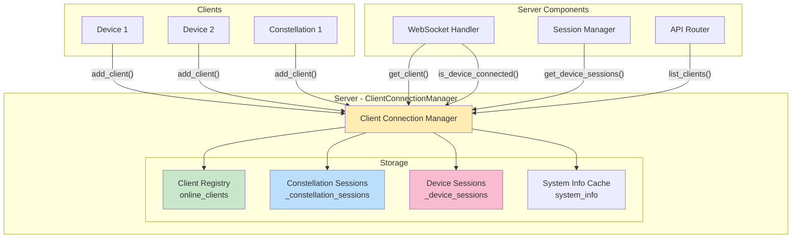
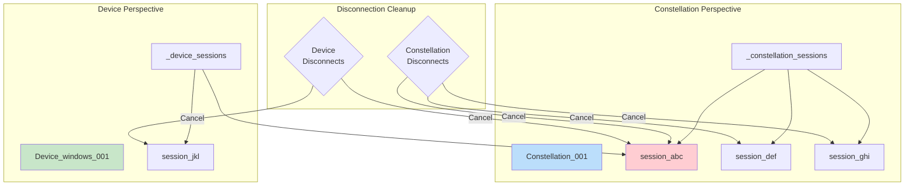
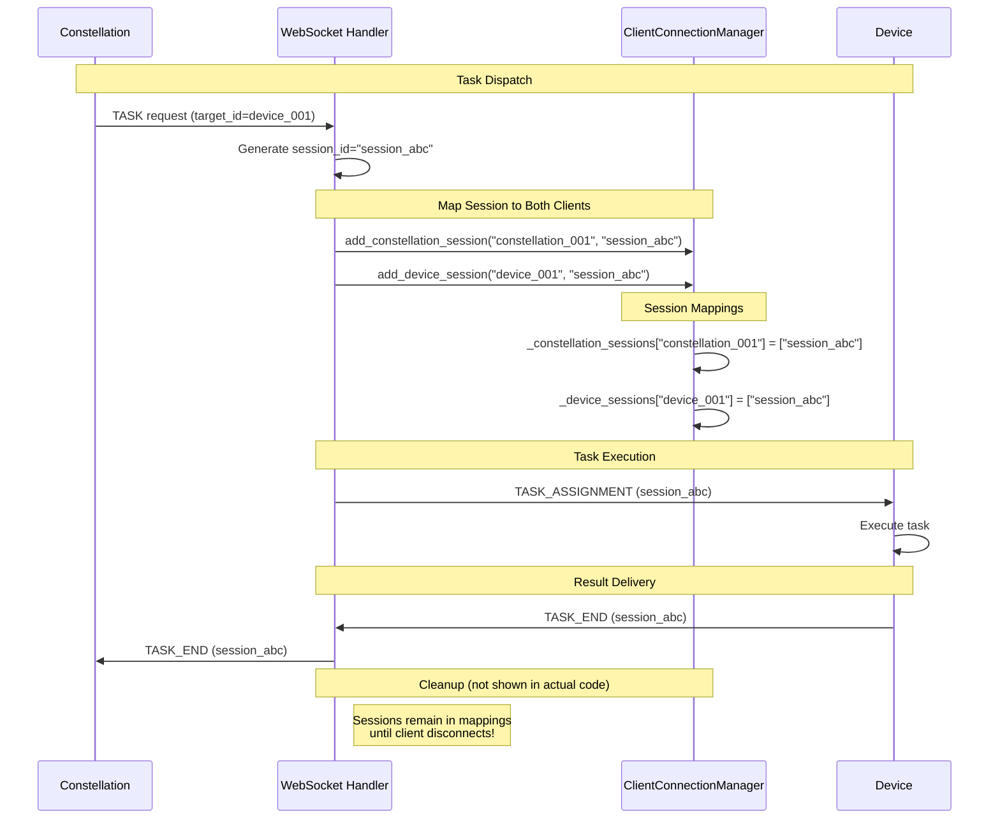
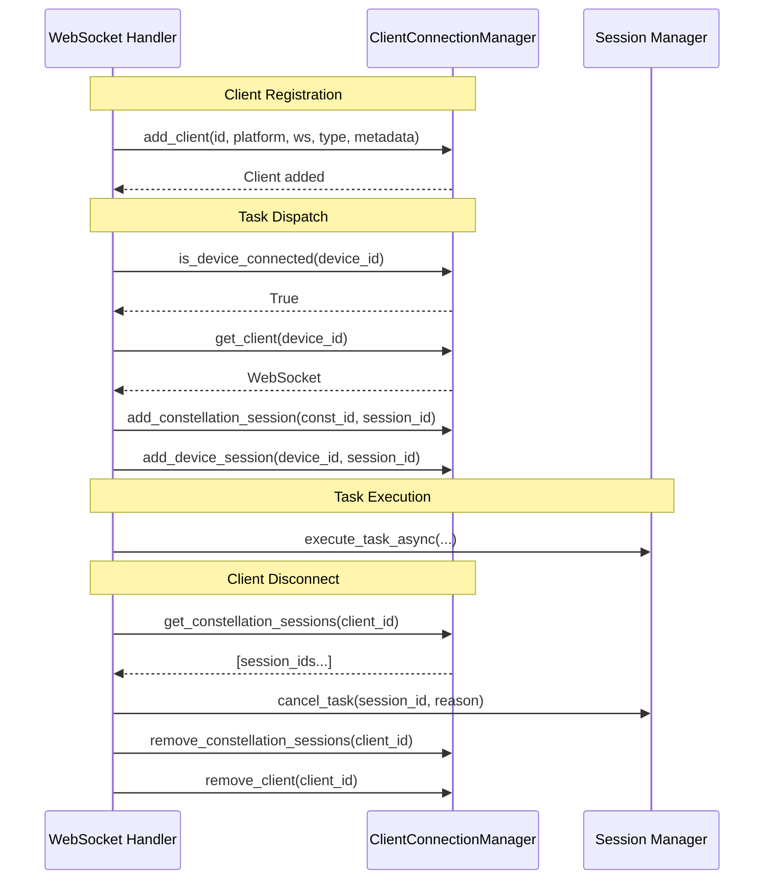
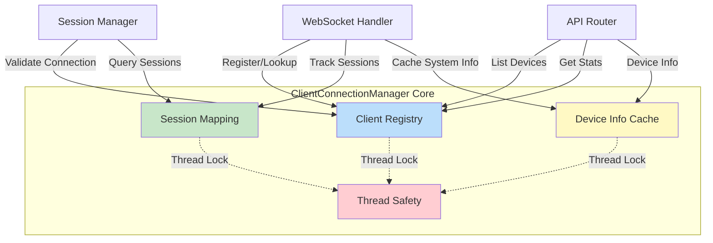

# Client Connection Manager

The **ClientConnectionManager** is the central registry for all connected clients, maintaining connection state, session mappings, device information, and providing efficient lookup mechanisms for client routing and management.

For more context on how this component fits into the server architecture, see the [Server Overview](overview.md).

---

## 🎯 Overview

The Client Connection Manager serves as the "address book" and "session tracker" for the entire server:

| Responsibility | Description | Benefit |
|----------------|-------------|---------|
| **Client Registry** | Store all connected device and constellation clients | Fast O(1) client lookup by ID |
| **Session Tracking** | Map sessions to their constellation orchestrators | Enable proper cleanup on disconnection |
| **Device Mapping** | Track which device is executing which session | Route task results correctly |
| **Connection State** | Monitor which clients are online | Validate before dispatching tasks |
| **System Info Caching** | Store device capabilities and configuration | Optimize constellation decision-making |
| **Statistics** | Provide connection metrics | Monitoring and capacity planning |

### Architecture Position



---

## 📦 Core Data Structures

### ClientInfo Dataclass

Each connected client is represented by a `ClientInfo` dataclass that stores all relevant connection details:

```python
@dataclass
class ClientInfo:
    """Information about a connected client."""
    websocket: WebSocket               # Active WebSocket connection
    client_type: ClientType            # DEVICE or CONSTELLATION
    connected_at: datetime             # Connection timestamp
    metadata: Dict = None              # Additional client metadata
    platform: str = "windows"          # OS platform (windows/linux)
    system_info: Dict = None           # Device system information (for devices only)
    
    # AIP protocol instances for this client
    transport: Optional[WebSocketTransport] = None    # AIP WebSocket transport
    task_protocol: Optional[TaskExecutionProtocol] = None  # AIP task protocol
```

**Field Descriptions:**

| Field | Type | Purpose | Example |
|-------|------|---------|---------|
| `websocket` | `WebSocket` | FastAPI WebSocket connection object | `<WebSocket>` |
| `client_type` | `ClientType` | Whether DEVICE or CONSTELLATION | `ClientType.DEVICE` |
| `connected_at` | `datetime` | When client registered | `2024-11-04 14:30:22` |
| `metadata` | `Dict` | Custom metadata from registration message | `{"hostname": "WIN-001"}` |
| `platform` | `str` | Operating system | `"windows"`, `"linux"` |
| `system_info` | `Dict` | Device capabilities and system specs | See System Info Structure below |
| `transport` | `Optional[WebSocketTransport]` | AIP WebSocket transport layer | `<WebSocketTransport>` |
| `task_protocol` | `Optional[TaskExecutionProtocol]` | AIP task execution protocol handler | `<TaskExecutionProtocol>` |

**System Info Structure Example:**

```json
{
  "os": "Windows",
  "os_version": "11 Pro 22H2",
  "processor": "Intel Core i7-1185G7",
  "memory_total": 17014632448,
  "memory_available": 8459743232,
  "screen_resolution": "1920x1080",
  "installed_applications": ["Chrome", "Excel", "Notepad++"],
  "supported_features": ["ui_automation", "web_browsing", "file_ops"],
  "custom_metadata": {
    "tags": ["production", "office"],
    "tier": "high_performance"
  }
}
```

---

## 👥 Client Registry Management

The client registry (`online_clients`) is the authoritative source of truth for all connected clients.

### Adding Clients

```python
def add_client(
    self,
    client_id: str,
    platform: str,
    ws: WebSocket,
    client_type: ClientType = ClientType.DEVICE,
    metadata: Dict = None,
    transport: Optional[WebSocketTransport] = None,
    task_protocol: Optional[TaskExecutionProtocol] = None
):
    """Register a new client connection."""
    
    with self.lock:  # Thread-safe access
        # Extract system info if provided (device clients only)
        system_info = None
        if metadata and "system_info" in metadata and client_type == ClientType.DEVICE:
            system_info = metadata.get("system_info")
            
            # Merge with server-configured metadata if available
            server_config = self._device_configs.get(client_id, {})
            if server_config:
                system_info = self._merge_device_info(system_info, server_config)
                logger.info(f"Merged server config for device {client_id}")
        
        # Create ClientInfo and add to registry
        self.online_clients[client_id] = ClientInfo(
            websocket=ws,
            platform=platform,
            client_type=client_type,
            connected_at=datetime.now(),
            metadata=metadata or {},
            system_info=system_info,
            transport=transport,
            task_protocol=task_protocol
        )
```

**Example - Adding a Device Client:**

```python
client_manager.add_client(
    client_id="device_windows_001",
    platform="windows",
    ws=websocket,
    client_type=ClientType.DEVICE,
    metadata={
        "hostname": "WIN-OFFICE-01",
        "system_info": {
            "os": "Windows",
            "screen_resolution": "1920x1080",
            "installed_applications": ["Chrome", "Excel"]
        }
    },
    transport=websocket_transport,
    task_protocol=task_execution_protocol
)
```

**Example - Adding a Constellation Client:**

```python
client_manager.add_client(
    client_id="constellation_orchestrator_001",
    platform="linux",  # Platform of the constellation server
    ws=websocket,
    client_type=ClientType.CONSTELLATION,
    metadata={
        "orchestrator_version": "2.0.0",
        "max_concurrent_tasks": 10
    },
    transport=websocket_transport,
    task_protocol=task_execution_protocol
)
```

**Thread Safety:**

```python
with self.lock:  # threading.Lock ensures atomic operations
    self.online_clients[client_id] = client_info
```

!!! warning "Client ID Uniqueness"
    If a client reconnects with the same `client_id`, the new connection **overwrites** the old entry. This effectively disconnects the old WebSocket. Use unique IDs to prevent collisions.

### Retrieving Clients

The ClientConnectionManager provides several methods to lookup clients based on different criteria:

**Get WebSocket Connection:**
```python
def get_client(self, client_id: str) -> WebSocket | None:
    """Get WebSocket connection for a client."""
    with self.lock:
        client_info = self.online_clients.get(client_id)
        return client_info.websocket if client_info else None
```
    
**Usage:**
```python
target_ws = client_manager.get_client("device_windows_001")
if target_ws:
    await target_ws.send_text(message)
```

**Get Full Client Info:**
```python
def get_client_info(self, client_id: str) -> ClientInfo | None:
    """Get complete information about a client."""
    with self.lock:
        return self.online_clients.get(client_id)
```
    
**Usage:**
```python
client_info = client_manager.get_client_info("device_windows_001")
if client_info:
    print(f"Platform: {client_info.platform}")
    print(f"Connected at: {client_info.connected_at}")
    print(f"Type: {client_info.client_type}")
```

**Get Client Type:**
```python
def get_client_type(self, client_id: str) -> ClientType | None:
    """Get the type of a client."""
    with self.lock:
        client_info = self.online_clients.get(client_id)
        return client_info.client_type if client_info else None
```
    
**Usage:**
```python
client_type = client_manager.get_client_type("client_001")
if client_type == ClientType.DEVICE:
    # Handle device-specific logic
elif client_type == ClientType.CONSTELLATION:
    # Handle constellation-specific logic
```

**List All Clients:**
```python
def list_clients(self) -> List[str]:
    """List all online client IDs."""
    with self.lock:
        return list(self.online_clients.keys())
```
    
**Usage:**
```python
online_ids = client_manager.list_clients()
print(f"Currently online: {len(online_ids)} clients")
```

**List by Type:**
```python
def list_clients_by_type(self, client_type: ClientType) -> List[str]:
    """List all online clients of a specific type."""
    with self.lock:
        return [
            client_id
            for client_id, client_info in self.online_clients.items()
            if client_info.client_type == client_type
        ]
```
    
**Usage:**
```python
devices = client_manager.list_clients_by_type(ClientType.DEVICE)
constellations = client_manager.list_clients_by_type(ClientType.CONSTELLATION)
    
print(f"Devices online: {len(devices)}")
print(f"Constellations online: {len(constellations)}")
```

### Removing Clients

```python
def remove_client(self, client_id: str):
    """Remove a client from the registry."""
    with self.lock:
        self.online_clients.pop(client_id, None)
    logger.info(f"[ClientConnectionManager] Removed client: {client_id}")
```

!!!danger "Cleanup Required"
    When removing a client, you should **also** clean up:
    
    - Session mappings (`_constellation_sessions`, `_device_sessions`)
    - Cached system info (automatically removed via ClientInfo deletion)
    - Active sessions (via SessionManager.cancel_task())
    
    See client disconnect cleanup pattern below.
```

---

## 🔍 Connection State Checking

Always check if the target device is connected before attempting to dispatch tasks. This prevents errors and improves user experience.

### Device Connection Validation

```python
def is_device_connected(self, device_id: str) -> bool:
    """Check if a device client is currently connected."""
    
    with self.lock:
        client_info = self.online_clients.get(device_id)
        
        if not client_info:
            return False
        
        # Verify it's a DEVICE client (not constellation)
        return client_info.client_type == ClientType.DEVICE
```

**Example - Validate Before Task Dispatch:**

```python
# In WebSocket Handler - constellation requesting task on device
target_device_id = data.target_id

if not client_manager.is_device_connected(target_device_id):
    error_msg = f"Target device '{target_device_id}' is not connected"
    await send_error(error_msg)
    raise ValueError(error_msg)

# Safe to dispatch
target_ws = client_manager.get_client(target_device_id)
await dispatch_task(target_ws, task_request)
```

!!! warning "Type Check is Critical"
    The method returns `False` if the client exists but is **not a device** (e.g., it's a constellation). This prevents accidentally dispatching device tasks to constellation clients.

### Generic Online Status Check

```python
# Not shown in source but implied
def is_online(self, client_id: str) -> bool:
    """Check if any client (device or constellation) is currently online."""
    with self.lock:
        return client_id in self.online_clients
```

**Comparison:**

| Method | Checks | Returns True When |
|--------|--------|-------------------|
| `is_device_connected(device_id)` | Client exists **AND** is DEVICE type | Device client is online |
| `is_online(client_id)` | Client exists (any type) | Any client is online |

---

## 📋 Session Mapping

The ClientConnectionManager tracks sessions from **two perspectives**:

1. **Constellation → Sessions**: Which sessions did a constellation initiate?
2. **Device → Sessions**: Which sessions is a device currently executing?

This dual tracking enables proper cleanup when either constellation or device disconnects.



### Constellation Session Mapping

Constellation clients initiate tasks on remote devices. Track these sessions to enable cleanup when the orchestrator disconnects.

**Add Constellation Session:**

```python
def add_constellation_session(self, client_id: str, session_id: str):
    """Map a session to its constellation orchestrator."""
    
    with self.lock:
        if client_id not in self._constellation_sessions:
            self._constellation_sessions[client_id] = []
        self._constellation_sessions[client_id].append(session_id)
```

**Get Constellation Sessions:**

```python
def get_constellation_sessions(self, client_id: str) -> List[str]:
    """Get all sessions initiated by a constellation client."""
    
    with self.lock:
        return self._constellation_sessions.get(client_id, []).copy()
        # .copy() prevents external modification of internal list
```

**Remove Constellation Sessions:**

```python
def remove_constellation_sessions(self, client_id: str) -> List[str]:
    """Remove and return all sessions for a constellation."""
    
    with self.lock:
        return self._constellation_sessions.pop(client_id, [])
        # Returns removed sessions for cleanup
```

**Example - Constellation Disconnect Cleanup:**

```python
# In WebSocket Handler - when constellation disconnects
constellation_id = "constellation_001"

# Get all sessions this constellation initiated
session_ids = client_manager.get_constellation_sessions(constellation_id)

logger.info(
    f"Constellation {constellation_id} disconnected, "
    f"cancelling {len(session_ids)} sessions"
)

# Cancel each session
for session_id in session_ids:
    await session_manager.cancel_task(
        session_id,
        reason="constellation_disconnected"  # Don't send callback
    )

# Remove mappings
client_manager.remove_constellation_sessions(constellation_id)
```

### Device Session Mapping

Device clients execute tasks sent by constellations (or themselves). Track these sessions to enable cleanup when the device disconnects.

**Add Device Session:**

```python
def add_device_session(self, device_id: str, session_id: str):
    """Map a session to the device executing it."""
    
    with self.lock:
        if device_id not in self._device_sessions:
            self._device_sessions[device_id] = []
        self._device_sessions[device_id].append(session_id)
```

**Get Device Sessions:**

```python
def get_device_sessions(self, device_id: str) -> List[str]:
    """Get all sessions running on a specific device."""
    
    with self.lock:
        return self._device_sessions.get(device_id, []).copy()
```

**Remove Device Sessions:**

```python
def remove_device_sessions(self, device_id: str) -> List[str]:
    """Remove and return all sessions for a device."""
    
    with self.lock:
        return self._device_sessions.pop(device_id, [])
```

!!!example "Device Disconnect Cleanup"
    ```python
    # In WebSocket Handler - when device disconnects
    device_id = "device_windows_001"
    
    # Get all sessions running on this device
    session_ids = client_manager.get_device_sessions(device_id)
    
    logger.info(
        f"Device {device_id} disconnected, "
        f"cancelling {len(session_ids)} sessions"
    )
    
    # Cancel each session
    for session_id in session_ids:
        await session_manager.cancel_task(
            session_id,
            reason="device_disconnected"  # Send callback to constellation
        )
    
    # Remove mappings
    client_manager.remove_device_sessions(device_id)
    ```

### Session Mapping Lifecycle



!!!warning "Sessions Persist Until Cleanup"
    Session mappings are **not automatically removed** when tasks complete. They persist until:
    
    1. The constellation disconnects (removes all its sessions)
    2. The device disconnects (removes all its sessions)
    3. Manual cleanup (future feature)
    
    **Implication:** Over time, `_constellation_sessions` and `_device_sessions` can grow large. Consider implementing periodic cleanup for completed sessions.

### Dual Mapping Example

!!!example "Single Session, Dual Mapping"
    When a constellation dispatches a task to a device:
    
    ```python
    constellation_id = "constellation_orchestrator_001"
    device_id = "device_windows_001"
    session_id = "session_abc123"
    
    # Session is mapped to BOTH the constellation and the device
    client_manager.add_constellation_session(constellation_id, session_id)
    client_manager.add_device_session(device_id, session_id)
    
    # Later retrieval
    constellation_sessions = client_manager.get_constellation_sessions(constellation_id)
    # Returns: ["session_abc123", ...]
    
    device_sessions = client_manager.get_device_sessions(device_id)
    # Returns: ["session_abc123", ...]
    ```
    
    **Why dual mapping?**
    
    - If **constellation disconnects**: Cancel all its sessions (notify devices)
    - If **device disconnects**: Cancel all sessions on that device (notify constellations)

---

## 💻 System Information Management

The ClientConnectionManager caches device system information to enable intelligent task routing by constellations without repeatedly querying devices.

### System Info Storage

**Stored Automatically During Registration:**

```python
def add_client(self, client_id, platform, ws, client_type, metadata):
    """Add client and extract system info if provided."""
    
    system_info = None
    if metadata and "system_info" in metadata and client_type == ClientType.DEVICE:
        system_info = metadata.get("system_info")
        
        # Merge with server configuration if available
        server_config = self._device_configs.get(client_id, {})
        if server_config:
            system_info = self._merge_device_info(system_info, server_config)
    
    self.online_clients[client_id] = ClientInfo(
        websocket=ws,
        platform=platform,
        client_type=client_type,
        system_info=system_info,  # Cached here
        ...
    )
```

### Retrieving System Information

**Get Single Device Info:**
```python
def get_device_system_info(self, device_id: str) -> Optional[Dict[str, Any]]:
    """Get device system information by device ID."""
        
    with self.lock:
        client_info = self.online_clients.get(device_id)
        if client_info and client_info.client_type == ClientType.DEVICE:
            return client_info.system_info
        return None
```
    
**Usage:**
```python
device_info = client_manager.get_device_system_info("device_windows_001")
    
if device_info:
    screen_res = device_info.get("screen_resolution")
    apps = device_info.get("installed_applications", [])
        
    print(f"Screen: {screen_res}")
    print(f"Apps: {len(apps)} installed")
```

**Get All Devices Info:**
```python
def get_all_devices_info(self) -> Dict[str, Dict[str, Any]]:
    """Get system information for all connected devices."""
        
    with self.lock:
        return {
            device_id: client_info.system_info
            for device_id, client_info in self.online_clients.items()
            if client_info.client_type == ClientType.DEVICE
            and client_info.system_info
        }
```
    
**Usage:**
```python
all_devices = client_manager.get_all_devices_info()
    
for device_id, info in all_devices.items():
    print(f"{device_id}: {info.get('os')} - {info.get('screen_resolution')}")
    
# Example output:
# device_windows_001: Windows - 1920x1080
# device_linux_001: Linux - 2560x1440
```

### Server Configuration Merging

The ClientConnectionManager supports loading device-specific configuration from YAML/JSON files and **merging** them with auto-detected system info.

**Device Configuration File (`device_config.yaml`):**

```yaml
devices:
  device_windows_001:
    tags: ["production", "office", "high_priority"]
    tier: "high_performance"
    additional_features: ["excel_automation", "pdf_generation"]
    max_concurrent_tasks: 5
    
  device_linux_001:
    tags: ["development", "testing"]
    tier: "standard"
    additional_features: ["docker_support"]
```

**Loading Configuration:**

```python
# Initialize ClientConnectionManager with config file
client_manager = ClientConnectionManager(device_config_path="config/device_config.yaml")

# Configuration is automatically loaded during __init__
```

**Merge Process:**

```python
def _merge_device_info(
    self,
    system_info: Dict[str, Any],
    server_config: Dict[str, Any]
) -> Dict[str, Any]:
    """Merge auto-detected system info with server configuration."""
    
    merged = {**system_info}  # Start with auto-detected info
    
    # Add all server config to custom_metadata
    if "custom_metadata" not in merged:
        merged["custom_metadata"] = {}
    merged["custom_metadata"].update(server_config)
    
    # Special handling: merge capabilities
    if "supported_features" in system_info and "additional_features" in server_config:
        merged["supported_features"] = list(
            set(system_info["supported_features"] + server_config["additional_features"])
        )
    
    # Add server tags
    if "tags" in server_config:
        merged["tags"] = server_config["tags"]
    
    return merged
```

**Result:**

```json
{
  "os": "Windows",
  "screen_resolution": "1920x1080",
  "supported_features": [
    "ui_automation",
    "web_browsing",
    "file_ops",
    "excel_automation",
    "pdf_generation"
  ],
  "tags": ["production", "office", "high_priority"],
  "custom_metadata": {
    "tier": "high_performance",
    "max_concurrent_tasks": 5,
    "tags": ["production", "office", "high_priority"],
    "additional_features": ["excel_automation", "pdf_generation"]
  }
}
```

**Why Merge Configuration?**

- **Auto-detected info**: Always accurate (OS, memory, screen resolution)
- **Server config**: Administrative metadata (tags, tier, priorities)
- **Combined**: Rich device profile for intelligent task routing

---

## 📊 Client Statistics and Monitoring

The `get_stats()` method provides basic metrics for monitoring connected clients.

### Get Statistics

```python
def get_stats(self) -> Dict[str, int]:
    """Get statistics about connected clients."""
    
    with self.lock:
        device_count = sum(
            1
            for info in self.online_clients.values()
            if info.client_type == ClientType.DEVICE
        )
        constellation_count = sum(
            1
            for info in self.online_clients.values()
            if info.client_type == ClientType.CONSTELLATION
        )
        return {
            "total": len(self.online_clients),
            "device_clients": device_count,
            "constellation_clients": constellation_count
        }
```

**Example Usage:**

```python
# Get current statistics
stats = client_manager.get_stats()

print(f"📊 Server Statistics:")
print(f"  Total Clients: {stats['total']}")
print(f"  Devices: {stats['device_clients']}")
print(f"  Constellations: {stats['constellation_clients']}")

# Output:
# 📊 Server Statistics:
#   Total Clients: 5
#   Devices: 3
#   Constellations: 2
```

### Filtering and Querying

**Filter by Platform:**
```python
def get_devices_by_platform(self, platform: str) -> List[str]:
    """Get all device IDs for a specific platform."""
        
    with self.lock:
        return [
            device_id
            for device_id, client_info in self.online_clients.items()
            if client_info.client_type == ClientType.DEVICE
            and client_info.platform == platform
        ]
    
# Usage
windows_devices = client_manager.get_devices_by_platform("Windows")
linux_devices = client_manager.get_devices_by_platform("Linux")
```

**Filter by Connection Time:**
```python
from datetime import datetime, timedelta
    
def get_recently_connected(self, minutes: int = 5) -> List[str]:
    """Get clients connected in the last N minutes."""
        
    cutoff_time = datetime.now() - timedelta(minutes=minutes)
        
    with self.lock:
        return [
            client_id
            for client_id, client_info in self.online_clients.items()
            if client_info.connected_at >= cutoff_time
        ]
    
# Usage
recent_clients = client_manager.get_recently_connected(minutes=10)
```

**Filter by Capability:**
```python
def find_devices_with_capability(self, capability: str) -> List[str]:
    """Find devices that support a specific capability."""
        
    with self.lock:
        matches = []
        for device_id, client_info in self.online_clients.items():
            if client_info.client_type != ClientType.DEVICE:
                continue
                
            if not client_info.system_info:
                continue
                
            features = client_info.system_info.get("supported_features", [])
            if capability in features:
                matches.append(device_id)
            
        return matches
    
# Usage
excel_devices = client_manager.find_devices_with_capability("excel_automation")
docker_devices = client_manager.find_devices_with_capability("docker_support")
```

---

## 🎯 Usage Patterns

### Safe Task Dispatch

```python
async def dispatch_task_to_device(
    client_manager: ClientConnectionManager,
    constellation_id: str,
    target_device_id: str,
    task_request: dict,
    session_id: str
):
    """Dispatch task with comprehensive validation."""
    
    # Step 1: Validate constellation is connected
    if not client_manager.is_online(constellation_id):
        raise ValueError(f"Constellation {constellation_id} not connected")
    
    # Step 2: Validate target device is connected
    if not client_manager.is_device_connected(target_device_id):
        raise ValueError(f"Device {target_device_id} not connected")
    
    # Step 3: Get device WebSocket
    device_ws = client_manager.get_client(target_device_id)
    if not device_ws:
        raise ValueError(f"Could not get WebSocket for device {target_device_id}")
    
    # Step 4: Track session mappings
    client_manager.add_constellation_session(constellation_id, session_id)
    client_manager.add_device_session(target_device_id, session_id)
    
    # Step 5: Send task
    await device_ws.send_json({
        "type": "TASK_ASSIGNMENT",
        "session_id": session_id,
        "request": task_request
    })
    
    logger.info(
        f"Task {session_id} dispatched: "
        f"{constellation_id} → {target_device_id}"
    )
```

### Graceful Client Disconnect Handling

```python
async def handle_client_disconnect(
    client_manager: ClientConnectionManager,
    session_manager: SessionManager,
    client_id: str,
    client_type: ClientType
):
    """Handle client disconnect with full cleanup."""
    
    logger.info(f"Client disconnected: {client_id} ({client_type})")
    
    # Step 1: Get all related sessions
    if client_type == ClientType.CONSTELLATION:
            session_ids = client_manager.get_constellation_sessions(client_id)
            cancel_reason = "constellation_disconnected"
        else:  # DEVICE
            session_ids = client_manager.get_device_sessions(client_id)
            cancel_reason = "device_disconnected"
        
        # Step 2: Cancel all sessions
        for session_id in session_ids:
            try:
                await session_manager.cancel_task(session_id, reason=cancel_reason)
                logger.info(f"Cancelled session {session_id}")
            except Exception as e:
                logger.error(f"Failed to cancel {session_id}: {e}")
        
        # Step 3: Remove session mappings
        if client_type == ClientType.CONSTELLATION:
            client_manager.remove_constellation_sessions(client_id)
        else:
            client_manager.remove_device_sessions(client_id)
        
        # Step 4: Remove client from registry
        client_manager.remove_client(client_id)
        
        logger.info(
            f"Cleanup complete: {client_id}, "
            f"cancelled {len(session_ids)} sessions"
        )
```

### Intelligent Device Selection

```python
def select_optimal_device(
    client_manager: ClientConnectionManager,
    required_platform: str = None,
    required_capabilities: List[str] = None,
    preferred_tags: List[str] = None
) -> Optional[str]:
    """Select the best available device for a task."""
    
    with client_manager.lock:
        candidates = []
        
        for device_id, client_info in client_manager.online_clients.items():
            # Filter by type
            if client_info.client_type != ClientType.DEVICE:
                continue
            
            # Filter by platform
            if required_platform and client_info.platform != required_platform:
                continue
            
            # Filter by capabilities
            if required_capabilities and client_info.system_info:
                features = client_info.system_info.get("supported_features", [])
                if not all(cap in features for cap in required_capabilities):
                    continue
            
            # Calculate score based on preferred tags
            score = 0
            if preferred_tags and client_info.system_info:
                tags = client_info.system_info.get("tags", [])
                score = len(set(tags) & set(preferred_tags))
            
            candidates.append((device_id, score))
        
        if not candidates:
            return None
        
        # Return device with highest score (or first if all score 0)
        candidates.sort(key=lambda x: x[1], reverse=True)
        return candidates[0][0]

# Usage
device_id = select_optimal_device(
    client_manager,
    required_platform="Windows",
    required_capabilities=["excel_automation"],
    preferred_tags=["production", "high_priority"]
)

if device_id:
    print(f"Selected device: {device_id}")
else:
    print("No suitable device available")
```

### Session Cleanup After Task Completion

**Note:** Current implementation does **not automatically remove** session mappings when tasks complete. Consider implementing this pattern:

```python
async def handle_task_completion(
    client_manager: ClientConnectionManager,
    session_id: str,
    constellation_id: str,
    device_id: str
):
    """Clean up session mappings after task completes."""
    
    # Task has completed (or failed)
    
    # Option 1: Remove from both mappings
    # (Requires adding remove_session method to ClientConnectionManager)
    # client_manager.remove_session(session_id)
    
    # Option 2: Leave mappings until disconnect
    # (Current behavior - sessions accumulate)
    
    logger.info(f"Task {session_id} completed, mappings retained")
```

---

## 💡 Best Practices

### Thread Safety

The ClientConnectionManager is accessed by multiple WebSocket handlers concurrently. **Always** acquire the lock before modifying shared state.

```python
# WRONG - No thread safety
def bad_example(self):
    if "device_001" in self.online_clients:
        client = self.online_clients["device_001"]
        # Another thread might remove the client here!
        return client.websocket

# CORRECT - Thread-safe
def good_example(self):
    with self.lock:
        if "device_001" in self.online_clients:
            client = self.online_clients["device_001"]
            return client.websocket
    return None
```

### Validate Before Dispatch

Always check if the target device is connected before attempting to send messages.

```python
# CORRECT - Validation first
if client_manager.is_device_connected(target_device_id):
    device_ws = client_manager.get_client(target_device_id)
    await device_ws.send_json(task_data)
else:
    logger.error(f"Device {target_device_id} not connected")
    # Handle error appropriately
```

### Cleanup on Disconnect

When a client disconnects, clean up **all** related resources:

**Checklist:**

- [x] Cancel all related sessions
- [x] Remove session mappings (constellation/device)
- [x] Remove client from online registry
- [x] Remove device info cache (if applicable)
- [x] Notify affected parties

### Cache Device Information

Balance freshness and performance:

- **Cache during registration**: Fast lookups for task routing
- **Update on REQUEST_DEVICE_LIST**: Keep cache fresh
- **Don't cache sensitive data**: Only cache non-sensitive system info

```python
# During registration - cache system info
client_manager.add_client(
    device_id,
    platform="Windows",
    ws=websocket,
    client_type=ClientType.DEVICE,
    metadata={"system_info": system_info}  # Cached automatically
)

# Later - fast lookup without querying device
device_info = client_manager.get_device_system_info(device_id)
```

### Handle Edge Cases

**Case 1: Client re-connects with same ID**
    ```python
    # Old connection still in registry
    if client_manager.is_online(client_id):
        logger.warning(f"Client {client_id} already connected, removing old connection")
        client_manager.remove_client(client_id)
    
    # Now add new connection
    client_manager.add_client(client_id, platform, ws, client_type, metadata)
```

**Case 2: Session mapped to disconnected clients**

```python
    # Before dispatching
    if not client_manager.is_device_connected(device_id):
        # Device disconnected, session mapping might still exist
        # This is expected - cleanup happens on disconnect
        raise ValueError(f"Device {device_id} no longer connected")
```

**Case 3: Constellation and device both disconnect**

```python
    # Session will be cancelled twice (once for each disconnect)
    # Ensure cancel_task is idempotent:
    async def cancel_task(self, session_id, reason):
        if session_id not in self.sessions:
            logger.debug(f"Session {session_id} already cancelled")
            return  # Idempotent
        
        # Proceed with cancellation
```

### Monitor Session Accumulation

**Note:** Session mappings are **not automatically removed** after task completion. Over time, this can cause memory growth.

**Mitigation strategies:**

**Periodic Cleanup:**
```python
async def cleanup_completed_sessions(client_manager, session_manager):
    """Remove mappings for completed sessions."""
        
    all_sessions = set()
    all_sessions.update(
        session_id
        for sessions in client_manager._constellation_sessions.values()
        for session_id in sessions
    )
    all_sessions.update(
        session_id
        for sessions in client_manager._device_sessions.values()
        for session_id in sessions
    )
        
    for session_id in all_sessions:
        session = session_manager.get_session(session_id)
        if session and session.state in [SessionState.COMPLETED, SessionState.FAILED]:
            # Remove from ClientConnectionManager
            # (Requires implementing remove_session method)
            pass
```

**Cleanup on Completion:**
```python
# In task completion handler
async def on_task_complete(session_id, constellation_id, device_id):
    # Remove specific session from mappings
    client_manager.remove_session_from_constellation(constellation_id, session_id)
    client_manager.remove_session_from_device(device_id, session_id)
```

---

## 🔗 Integration Points

### With WebSocket Handler



**ClientConnectionManager provides:**

- Client registration and lookup
- Connection state validation
- Session tracking for cleanup

**WebSocket Handler provides:**

- WebSocket lifecycle management
- Protocol message handling
- Disconnect notifications

### With Session Manager

**ClientConnectionManager provides:**

- Client connectivity status Session Manager checks before execution
- Session mappings Session Manager uses for cleanup

**Session Manager provides:**

- Session state ClientConnectionManager can query to cleanup completed sessions (future)
- Cancellation results ClientConnectionManager uses to notify clients

### With API Router

```python
# In HTTP API endpoints
from fastapi import APIRouter, HTTPException

@router.get("/devices")
async def list_devices():
    """List all connected devices."""
    stats = client_manager.get_stats()
    return {
        "devices": stats["devices"]["ids"],
        "count": stats["devices"]["count"],
        "by_platform": stats["devices"]["platforms"]
    }

@router.get("/devices/{device_id}")
async def get_device_info(device_id: str):
    """Get device system information."""
    if not client_manager.is_device_connected(device_id):
        raise HTTPException(status_code=404, detail="Device not connected")
    
    system_info = client_manager.get_device_system_info(device_id)
    return {"device_id": device_id, "system_info": system_info}

@router.get("/stats")
async def get_server_stats():
    """Get server statistics."""
    return client_manager.get_stats()
```

---

## 📚 Complete API Reference

### Client Management

| Method | Parameters | Returns | Description |
|--------|------------|---------|-------------|
| `add_client()` | `client_id: str`<br/>`platform: str`<br/>`ws: WebSocket`<br/>`client_type: ClientType`<br/>`metadata: Optional[Dict]` | `None` | Register a new client connection |
| `remove_client()` | `client_id: str` | `None` | Remove client from registry |
| `get_client()` | `client_id: str` | `Optional[WebSocket]` | Get client WebSocket connection |
| `get_client_info()` | `client_id: str` | `Optional[ClientInfo]` | Get full client information |
| `get_client_type()` | `client_id: str` | `Optional[ClientType]` | Get client type (DEVICE/CONSTELLATION) |
| `list_clients()` | `client_type: Optional[ClientType]` | `List[str]` | List all or filtered client IDs |

### Connection State

| Method | Parameters | Returns | Description |
|--------|------------|---------|-------------|
| `is_device_connected()` | `device_id: str` | `bool` | Check if device is connected |
| `is_online()` | `client_id: str` | `bool` | Check if any client is online |

### Session Mapping

| Method | Parameters | Returns | Description |
|--------|------------|---------|-------------|
| `add_constellation_session()` | `client_id: str`<br/>`session_id: str` | `None` | Map session to constellation |
| `get_constellation_sessions()` | `client_id: str` | `List[str]` | Get constellation's sessions |
| `remove_constellation_sessions()` | `client_id: str` | `List[str]` | Remove and return sessions |
| `add_device_session()` | `device_id: str`<br/>`session_id: str` | `None` | Map session to device |
| `get_device_sessions()` | `device_id: str` | `List[str]` | Get device's sessions |
| `remove_device_sessions()` | `device_id: str` | `List[str]` | Remove and return sessions |

### Device Information

| Method | Parameters | Returns | Description |
|--------|------------|---------|-------------|
| `get_device_system_info()` | `device_id: str` | `Optional[Dict]` | Get device system information |
| `get_all_devices_info()` | None | `Dict[str, Dict]` | Get all devices' system info |

### Statistics and Monitoring

| Method | Parameters | Returns | Description |
|--------|------------|---------|-------------|
| `get_stats()` | None | `Dict[str, Any]` | Get comprehensive server statistics |

### Data Structures

**ClientInfo:**

```python
@dataclass
class ClientInfo:
    websocket: WebSocket          # WebSocket connection
    client_type: ClientType       # DEVICE or CONSTELLATION
    connected_at: datetime        # Connection timestamp
    metadata: Optional[Dict]      # Registration metadata
    platform: Optional[str]       # "Windows", "Linux", "Darwin"
    system_info: Optional[Dict]   # Device capabilities and configuration
```

**ClientType:**

```python
class ClientType(Enum):
    DEVICE = "device"              # Execution client
    CONSTELLATION = "constellation"  # Orchestrator client
```

---

## 🎓 Summary

The ClientConnectionManager is the **central registry** for all client connections and session mappings in the UFO server. It provides thread-safe operations for tracking clients, validating connectivity, mapping sessions, and caching device information.

**Core Capabilities:**

| Capability | Description | Key Benefit |
|------------|-------------|-------------|
| **Client Registry** | Track connected devices and constellation clients | Single source of truth for client state |
| **Connection State** | Query client availability and type | Prevent dispatch to disconnected clients |
| **Session Mapping** | Associate sessions with orchestrators and executors | Enable proper cleanup on disconnect |
| **Device Info** | Cache device capabilities for routing decisions | Fast task routing without repeated queries |
| **Thread Safety** | Lock-protected concurrent access | Safe operation in async/multi-threaded environment |
| **Statistics** | Real-time metrics on clients and sessions | Monitoring and observability |

**Key Design Patterns:**

1. **Dual Session Mapping**: Track sessions from both constellation and device perspectives for comprehensive cleanup
2. **Lazy Cleanup**: Session mappings persist until disconnect (consider periodic cleanup for production)
3. **Configuration Merging**: Combine auto-detected device info with server-configured metadata
4. **Type-Safe Validation**: Always verify client type (DEVICE vs CONSTELLATION) before operations

**Integration with UFO Server:**



**For More Information:**

- [Server Overview](./overview.md) - UFO server architecture and components
- [WebSocket Handler](./websocket_handler.md) - AIP protocol message handling
- [Session Manager](./session_manager.md) - Session lifecycle and background execution
- [Quick Start](./quick_start.md) - Get started with UFO server

