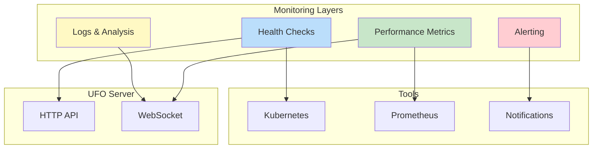
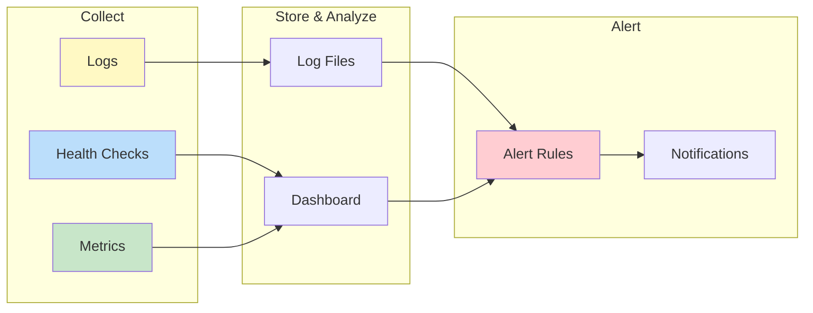

# Monitoring and Observability

Monitor the health, performance, and reliability of your UFO Server deployment with comprehensive observability tools, metrics, and alerting strategies.

!!! tip "Before You Begin"
    Make sure you have the UFO Server running. See the [Quick Start Guide](./quick_start.md) for setup instructions.

## 🎯 Overview



**Monitoring Capabilities:**

| Layer | Purpose | Tools |
|-------|---------|-------|
| **Health Checks** | Service availability and uptime | `/api/health`, Kubernetes probes |
| **Performance Metrics** | Latency, throughput, resource usage | Prometheus, custom dashboards |
| **Logging** | Event tracking, debugging, auditing | Python logging, log aggregation |
| **Alerting** | Proactive issue detection | Slack, Email, PagerDuty |

**Why Monitor?**

- **Detect Issues Early**: Catch problems before users notice
- **Performance Optimization**: Identify bottlenecks and inefficiencies
- **Capacity Planning**: Track growth and resource utilization
- **Debugging**: Trace errors and understand system behavior
- **SLA Compliance**: Ensure service level objectives are met

---

## 🏥 Health Checks

### HTTP Health Endpoint

The `/api/health` endpoint provides real-time server status without authentication. For detailed API specifications, see the [HTTP API Reference](./api.md).

#### Endpoint Details

```http
GET /api/health
```

**Response (200 OK):**

```json
{
  "status": "healthy",
  "online_clients": [
    "device_windows_001",
    "device_linux_002",
    "constellation_orchestrator_001"
  ]
}
```

**Response Schema:**

| Field | Type | Description |
|-------|------|-------------|
| `status` | `string` | Always `"healthy"` if server is responding |
| `online_clients` | `array<string>` | List of connected client IDs |

**Quick Test:**

```bash
# Test health endpoint
curl http://localhost:5000/api/health

# With jq for formatted output
curl -s http://localhost:5000/api/health | jq .
```

### Automated Health Monitoring

#### Kubernetes Liveness and Readiness Probes

Example production Kubernetes configuration:

```yaml
apiVersion: v1
kind: Pod
metadata:
  name: ufo-server
  labels:
    app: ufo-server
spec:
  containers:
  - name: ufo-server
    image: ufo-server:latest
    ports:
    - containerPort: 5000
      name: http
      protocol: TCP
    
    # Liveness probe - restart container if failing
    livenessProbe:
      httpGet:
        path: /api/health
        port: 5000
        scheme: HTTP
      initialDelaySeconds: 30   # Wait 30s after startup
      periodSeconds: 10          # Check every 10s
      timeoutSeconds: 5          # 5s timeout per check
      successThreshold: 1        # 1 success = healthy
      failureThreshold: 3        # 3 failures = restart
    
    # Readiness probe - remove from service if failing
    readinessProbe:
      httpGet:
        path: /api/health
        port: 5000
        scheme: HTTP
      initialDelaySeconds: 10   # Wait 10s after startup
      periodSeconds: 5          # Check every 5s
      timeoutSeconds: 3         # 3s timeout
      successThreshold: 1       # 1 success = ready
      failureThreshold: 2       # 2 failures = not ready
    
    # Resource limits
    resources:
      requests:
        memory: "256Mi"
        cpu: "250m"
      limits:
        memory: "512Mi"
        cpu: "500m"
```

**Probe Configuration Guide:**

| Parameter | Liveness | Readiness | Purpose |
|-----------|----------|-----------|---------|
| `initialDelaySeconds` | 30 | 10 | Time before first check (allow startup) |
| `periodSeconds` | 10 | 5 | How often to check |
| `timeoutSeconds` | 5 | 3 | Max time for response |
| `failureThreshold` | 3 | 2 | Failures before action (restart/unready) |

#### Uptime Monitoring Script

Example continuous health monitoring script:

```python
import requests
import time
from datetime import datetime
import logging

logging.basicConfig(
    level=logging.INFO,
    format='%(asctime)s - %(levelname)s - %(message)s'
)
logging.basicConfig(
    level=logging.INFO,
    format='%(asctime)s - %(levelname)s - %(message)s'
)

class HealthMonitor:
    def __init__(self, url="http://localhost:5000/api/health", interval=30):
        self.url = url
        self.interval = interval
        self.consecutive_failures = 0
        self.uptime_start = None
        self.total_checks = 0
        self.failed_checks = 0
    
    def check_health(self):
        """Perform single health check."""
        self.total_checks += 1
        
        try:
            response = requests.get(self.url, timeout=5)
            
            if response.status_code == 200:
                data = response.json()
                client_count = len(data.get("online_clients", []))
                
                if self.uptime_start is None:
                    self.uptime_start = datetime.now()
                
                uptime = datetime.now() - self.uptime_start
                availability = ((self.total_checks - self.failed_checks) / 
                                self.total_checks * 100)
                
                logging.info(
                    f"✅ Server healthy - {client_count} clients connected | "
                    f"Uptime: {uptime} | Availability: {availability:.2f}%"
                )
                
                self.consecutive_failures = 0
                return True
            else:
                raise Exception(f"HTTP {response.status_code}")
                
        except Exception as e:
            self.consecutive_failures += 1
            self.failed_checks += 1
            self.uptime_start = None  # Reset uptime on failure
            
            logging.error(
                f"❌ Health check failed: {e} "
                f"(consecutive failures: {self.consecutive_failures})"
            )
            
            # Alert after 3 consecutive failures
            if self.consecutive_failures == 3:
                self.send_alert(
                    f"Server down for {self.consecutive_failures} checks! "
                    f"Last error: {e}"
                )
            
            return False
    
    def send_alert(self, message):
        """Send alert (implement your alerting mechanism)."""
        logging.critical(f"🚨 ALERT: {message}")
        # TODO: Implement Slack/Email/PagerDuty notification
    
    def run(self):
        """Run continuous monitoring."""
        logging.info(f"Starting health monitor (interval: {self.interval}s)")
        
        while True:
            self.check_health()
            time.sleep(self.interval)

# Run monitor
if __name__ == "__main__":
    monitor = HealthMonitor(interval=30)
    monitor.run()
```

#### Docker Healthcheck

Docker Compose health configuration:

```yaml
version: '3.8'

services:
  ufo-server:
    image: ufo-server:latest
    ports:
      - "5000:5000"
    
    # Docker health check
    healthcheck:
      test: ["CMD", "curl", "-f", "http://localhost:5000/api/health"]
      interval: 30s
      timeout: 5s
      retries: 3
      start_period: 40s
    
    restart: unless-stopped
    
    environment:
      - LOG_LEVEL=INFO
    
    volumes:
      - ./logs:/app/logs
      - ./config:/app/config
```

---

## 📊 Performance Metrics

### Request Latency Monitoring

Track API response times to detect performance degradation.

#### Latency Measurement

```python
import requests
import time
import statistics
from typing import List, Dict

class LatencyMonitor:
    def __init__(self):
        self.measurements: Dict[str, List[float]] = {}
    
    def measure_endpoint(self, url: str, name: str = None) -> float:
        """Measure endpoint latency in milliseconds."""
        if name is None:
            name = url
        
        start = time.time()
        try:
            response = requests.get(url, timeout=10)
            latency_ms = (time.time() - start) * 1000
            
            # Store measurement
            if name not in self.measurements:
                self.measurements[name] = []
            self.measurements[name].append(latency_ms)
            
            return latency_ms
        except Exception as e:
            logging.error(f"Failed to measure {name}: {e}")
            return -1
    
    def get_stats(self, name: str) -> Dict[str, float]:
        """Get statistics for an endpoint."""
        if name not in self.measurements or not self.measurements[name]:
            return {}
        
        data = self.measurements[name]
        return {
            "count": len(data),
            "min": min(data),
            "max": max(data),
            "mean": statistics.mean(data),
            "median": statistics.median(data),
            "p95": statistics.quantiles(data, n=20)[18] if len(data) >= 20 else max(data),
            "p99": statistics.quantiles(data, n=100)[98] if len(data) >= 100 else max(data)
        }
    
    def print_report(self):
        """Print latency report."""
        print("\n📊 Latency Report:")
        print("=" * 80)
        
        for name, measurements in self.measurements.items():
            stats = self.get_stats(name)
            
            print(f"\n{name}:")
            print(f"  Count:   {stats['count']}")
            print(f"  Min:     {stats['min']:.2f} ms")
            print(f"  Max:     {stats['max']:.2f} ms")
            print(f"  Mean:    {stats['mean']:.2f} ms")
            print(f"  Median:  {stats['median']:.2f} ms")
            print(f"  P95:     {stats['p95']:.2f} ms")
            print(f"  P99:     {stats['p99']:.2f} ms")

# Usage
monitor = LatencyMonitor()

for _ in range(100):
    monitor.measure_endpoint("http://localhost:5000/api/health", "health")
    monitor.measure_endpoint("http://localhost:5000/api/clients", "clients")
    time.sleep(1)

monitor.print_report()
```

**Sample Output:**

```
📊 Latency Report:
================================================================================

health:
  Count:   100
  Min:     2.34 ms
  Max:     45.67 ms
  Mean:    8.12 ms
  Median:  6.89 ms
  P95:     15.23 ms
  P99:     32.45 ms

clients:
  Count:   100
  Min:     3.12 ms
  Max:     52.34 ms
  Mean:    10.45 ms
  Median:  9.12 ms
  P95:     18.90 ms
  P99:     38.67 ms
```

### Task Throughput Monitoring

Track task completion rate to detect bottlenecks.

```python
from collections import deque
import time

class ThroughputMonitor:
    def __init__(self, window_seconds=60):
        self.window = window_seconds
        self.completions = deque()
        self.total_completions = 0
    
    def record_completion(self):
        """Record a task completion."""
        now = time.time()
        self.completions.append(now)
        self.total_completions += 1
        
        # Remove completions outside the time window
        cutoff = now - self.window
        while self.completions and self.completions[0] < cutoff:
            self.completions.popleft()
    
    def get_rate_per_minute(self) -> float:
        """Get current completion rate (tasks per minute)."""
        return len(self.completions) * (60.0 / self.window)
    
    def get_rate_per_second(self) -> float:
        """Get current completion rate (tasks per second)."""
        return len(self.completions) / self.window
    
    def get_stats(self) -> dict:
        """Get comprehensive statistics."""
        return {
            "window_seconds": self.window,
            "completions_in_window": len(self.completions),
            "rate_per_second": self.get_rate_per_second(),
            "rate_per_minute": self.get_rate_per_minute(),
            "total_completions": self.total_completions
        }

# Usage
monitor = ThroughputMonitor(window_seconds=60)

# Record completions as they happen
for task in completed_tasks:
    monitor.record_completion()

# Get current rate
stats = monitor.get_stats()
print(f"Current throughput: {stats['rate_per_minute']:.2f} tasks/min")
print(f"Tasks in last {stats['window_seconds']}s: {stats['completions_in_window']}")
```

### Connection Stability Metrics

!!! warning "Monitor Client Connection Reliability"
    Track disconnection rates to identify network or client issues. For more on client management, see the [Client Connection Manager](./client_connection_manager.md) documentation.

```python
from datetime import datetime, timedelta

class ConnectionStabilityMonitor:
    def __init__(self):
        self.connections = []
        self.disconnections = []
        self.reconnections = {}  # client_id -> count
    
    def on_connect(self, client_id: str):
        """Record client connection."""
        now = datetime.now()
        self.connections.append({
            "client_id": client_id,
            "timestamp": now
        })
        
        # Track reconnections
        if client_id in self.reconnections:
            self.reconnections[client_id] += 1
        else:
            self.reconnections[client_id] = 0
    
    def on_disconnect(self, client_id: str, reason: str = "unknown"):
        """Record client disconnection."""
        now = datetime.now()
        self.disconnections.append({
            "client_id": client_id,
            "timestamp": now,
            "reason": reason
        })
    
    def get_stability_rate(self) -> float:
        """
        Calculate connection stability (0.0 to 1.0).
        Returns: 1.0 - (disconnections / connections)
        """
        if not self.connections:
            return 1.0
        
        return 1.0 - (len(self.disconnections) / len(self.connections))
    
    def get_disconnection_rate_per_hour(self) -> float:
        """Get average disconnections per hour."""
        if not self.disconnections:
            return 0.0
        
        first = self.disconnections[0]["timestamp"]
        last = self.disconnections[-1]["timestamp"]
        duration_hours = (last - first).total_seconds() / 3600
        
        if duration_hours == 0:
            return 0.0
        
        return len(self.disconnections) / duration_hours
    
    def get_flaky_clients(self, threshold=3) -> list:
        """Get clients with excessive reconnections."""
        return [
            (client_id, count)
            for client_id, count in self.reconnections.items()
            if count >= threshold
        ]
    
    def get_stats(self) -> dict:
        """Get comprehensive stability statistics."""
        return {
            "total_connections": len(self.connections),
            "total_disconnections": len(self.disconnections),
            "stability_rate": self.get_stability_rate(),
            "disconnections_per_hour": self.get_disconnection_rate_per_hour(),
            "flaky_clients": self.get_flaky_clients()
        }

# Usage
monitor = ConnectionStabilityMonitor()

# Record events
monitor.on_connect("device_windows_001")
monitor.on_disconnect("device_windows_001", reason="network_error")
monitor.on_connect("device_windows_001")  # Reconnection

# Get statistics
stats = monitor.get_stats()
print(f"Stability: {stats['stability_rate'] * 100:.1f}%")
print(f"Flaky clients: {stats['flaky_clients']}")
```

---

## 📝 Logging and Analysis

### Log Configuration

Production logging setup:

```python
import logging
    import sys
    from logging.handlers import RotatingFileHandler, TimedRotatingFileHandler
    import json
    from datetime import datetime
    
    # Custom JSON formatter for structured logging
    class JsonFormatter(logging.Formatter):
        def format(self, record):
            log_data = {
                "timestamp": datetime.utcnow().isoformat(),
                "level": record.levelname,
                "logger": record.name,
                "message": record.getMessage(),
                "module": record.module,
                "function": record.funcName,
                "line": record.lineno
            }
            
            # Add exception info if present
            if record.exc_info:
                log_data["exception"] = self.formatException(record.exc_info)
            
            # Add custom fields
            if hasattr(record, 'client_id'):
                log_data["client_id"] = record.client_id
            if hasattr(record, 'session_id'):
                log_data["session_id"] = record.session_id
            
            return json.dumps(log_data)
    
    # Configure root logger
    def setup_logging(log_level=logging.INFO, log_dir="logs"):
        """Set up production logging configuration."""
        
        # Create logger
        logger = logging.getLogger()
        logger.setLevel(log_level)
        
        # Remove default handlers
        logger.handlers = []
        
        # Console handler (human-readable)
        console_handler = logging.StreamHandler(sys.stdout)
        console_handler.setLevel(logging.INFO)
        console_formatter = logging.Formatter(
            '%(asctime)s - %(name)s - %(levelname)s - %(message)s'
        )
        console_handler.setFormatter(console_formatter)
        logger.addHandler(console_handler)
        
        # File handler (JSON, rotating by size)
        file_handler = RotatingFileHandler(
            filename=f"{log_dir}/ufo_server.log",
            maxBytes=10 * 1024 * 1024,  # 10 MB
            backupCount=5,  # Keep 5 backup files
            encoding='utf-8'
        )
        file_handler.setLevel(logging.DEBUG)
        file_handler.setFormatter(JsonFormatter())
        logger.addHandler(file_handler)
        
        # Daily rotation handler (for long-term storage)
        daily_handler = TimedRotatingFileHandler(
            filename=f"{log_dir}/ufo_server_daily.log",
            when='midnight',
            interval=1,
            backupCount=30,  # Keep 30 days
            encoding='utf-8'
        )
        daily_handler.setLevel(logging.INFO)
        daily_handler.setFormatter(JsonFormatter())
        logger.addHandler(daily_handler)
        
        # Error-only handler (separate file for errors)
        error_handler = RotatingFileHandler(
            filename=f"{log_dir}/ufo_server_errors.log",
            maxBytes=5 * 1024 * 1024,  # 5 MB
            backupCount=10,
            encoding='utf-8'
        )
        error_handler.setLevel(logging.ERROR)
        error_handler.setFormatter(JsonFormatter())
        logger.addHandler(error_handler)
        
        logger.info("Logging configured successfully")
    
    # Usage
    setup_logging(log_level=logging.INFO, log_dir="./logs")
```

### Log Event Categories

**Key Events to Log:**

**Connection Events:**

```python
# These log messages are generated by the WebSocket Handler
# See: WebSocket Handler documentation for connection lifecycle details
logger.info(f"[WS] ✅ Registered {client_type} client: {client_id}", 
            extra={"client_id": client_id, "client_type": client_type})

logger.info(f"[WS] 🔌 Client disconnected: {client_id}",
            extra={"client_id": client_id})
```

**Task Events:**

```python
# These log messages are generated by the Session Manager
# See: Session Manager documentation for task lifecycle details
logger.info(f"[Session] Created session {session_id} for task: {task_name}",
                extra={"session_id": session_id, "task_name": task_name})
    
    logger.info(f"[Session] Task completed: {session_id}",
                extra={"session_id": session_id, "duration_seconds": duration})
    
logger.warning(f"[Session] Task cancelled: {session_id} (reason: {reason})",
               extra={"session_id": session_id, "cancel_reason": reason})
```

**Error Events:**

```python
logger.error(f"[WS] ❌ Failed to send result for session {session_id}: {error}",
             extra={"session_id": session_id}, exc_info=True)

logger.error(f"[Session] Task execution failed: {session_id}",
             extra={"session_id": session_id}, exc_info=True)
```

### Log Analysis Scripts

Parse and analyze JSON logs:

```python
    import json
    from collections import Counter, defaultdict
    from datetime import datetime
    
    def analyze_logs(log_file="logs/ufo_server.log"):
        """Analyze JSON logs and generate statistics."""
        
        # Counters
        level_counts = Counter()
        module_counts = Counter()
        error_types = Counter()
        client_activity = defaultdict(int)
        hourly_activity = defaultdict(int)
        
        with open(log_file, 'r') as f:
            for line in f:
                try:
                    log = json.loads(line)
                    
                    # Count by level
                    level_counts[log.get("level")] += 1
                    
                    # Count by module
                    module_counts[log.get("module")] += 1
                    
                    # Track errors
                    if log.get("level") in ["ERROR", "WARNING"]:
                        error_types[log.get("message")[:50]] += 1
                    
                    # Track client activity
                    if "client_id" in log:
                        client_activity[log["client_id"]] += 1
                    
                    # Hourly activity
                    timestamp = datetime.fromisoformat(log.get("timestamp"))
                    hour = timestamp.hour
                    hourly_activity[hour] += 1
                    
                except json.JSONDecodeError:
                    continue
        
        # Print report
        print("\n📊 Log Analysis Report")
        print("=" * 80)
        
        print("\n📈 Events by Level:")
        for level, count in level_counts.most_common():
            print(f"  {level:10s}: {count:6d}")
        
        print("\n📦 Events by Module:")
        for module, count in module_counts.most_common(10):
            print(f"  {module:20s}: {count:6d}")
        
        print("\n⚠️ Top Errors/Warnings:")
        for message, count in error_types.most_common(5):
            print(f"  [{count:3d}] {message}")
        
        print("\n👥 Top Active Clients:")
        for client_id, count in sorted(client_activity.items(), 
                                       key=lambda x: x[1], reverse=True)[:10]:
            print(f"  {client_id:30s}: {count:6d} events")
        
        print("\n🕐 Activity by Hour:")
        for hour in sorted(hourly_activity.keys()):
            bar = "█" * (hourly_activity[hour] // 10)
            print(f"  {hour:02d}:00 - {bar} ({hourly_activity[hour]} events)")
    
    # Run analysis
    analyze_logs("logs/ufo_server.log")
```

---

## 🚨 Alerting Systems

### Alert Conditions

!!! danger "Critical Conditions to Monitor"
    
    Track these critical conditions to maintain server reliability.
    
    **1. No Connected Devices**
    
    ```python
    def check_device_availability():
        """Alert if no devices are connected."""
        response = requests.get("http://localhost:5000/api/clients")
        clients = response.json()["online_clients"]
        
        devices = [c for c in clients if c.startswith("device_")]
        
        if len(devices) == 0:
            send_alert(
                severity="critical",
                title="No Devices Connected",
                message="UFO server has no connected devices. Task dispatch unavailable."
            )
            return False
        elif len(devices) < 3:
            send_alert(
                severity="warning",
                title="Low Device Count",
                message=f"Only {len(devices)} devices connected (expected 3+)."
            )
        
        return True
    ```
    
    **2. High Error Rate**
    
    ```python
    def check_error_rate(log_file="logs/ufo_server.log", threshold=0.1):
        """Alert if error rate exceeds threshold."""
        import json
        
        total = 0
        errors = 0
        
        with open(log_file, 'r') as f:
            for line in f:
                try:
                    log = json.loads(line)
                    total += 1
                    if log.get("level") in ["ERROR", "CRITICAL"]:
                        errors += 1
                except:
                    continue
        
        error_rate = errors / total if total > 0 else 0
        
        if error_rate > threshold:
            send_alert(
                severity="warning",
                title=f"High Error Rate: {error_rate * 100:.1f}%",
                message=f"{errors} errors out of {total} log entries"
            )
            return False
        
        return True
    ```
    
    **3. Slow Response Times**
    
    ```python
    def check_latency(threshold_ms=1000):
        """Alert if health endpoint is slow."""
        start = time.time()
        
        try:
            response = requests.get("http://localhost:5000/api/health", timeout=5)
            latency_ms = (time.time() - start) * 1000
            
            if latency_ms > threshold_ms:
                send_alert(
                    severity="warning",
                    title=f"Slow Response Time: {latency_ms:.0f}ms",
                    message=f"/api/health responded in {latency_ms:.0f}ms (threshold: {threshold_ms}ms)"
                )
                return False
            
            return True
        except Exception as e:
            send_alert(
                severity="critical",
                title="Health Check Failed",
                message=f"Cannot reach health endpoint: {e}"
            )
            return False
    ```
    
    **4. Session Failure Rate**
    
    ```python
    def check_session_failure_rate(threshold=0.2):
        """Alert if too many sessions are failing."""
        # Requires session tracking in logs
        import json
        
        completed = 0
        failed = 0
        
        with open("logs/ufo_server.log", 'r') as f:
            for line in f:
                try:
                    log = json.loads(line)
                    message = log.get("message", "")
                    
                    if "Task completed" in message:
                        completed += 1
                    elif "Task failed" in message or "Task cancelled" in message:
                        failed += 1
                except:
                    continue
        
        total = completed + failed
        failure_rate = failed / total if total > 0 else 0
        
        if failure_rate > threshold:
            send_alert(
                severity="warning",
                title=f"High Task Failure Rate: {failure_rate * 100:.1f}%",
                message=f"{failed} failed out of {total} tasks"
            )
            return False
        
        return True
    ```

### Alert Delivery Methods

**Email Alerts:**
```python
import smtplib
from email.message import EmailMessage
    
def send_email_alert(title, message, severity="info"):
    """Send email alert via SMTP."""
        
    # Email configuration
    smtp_host = "smtp.gmail.com"
    smtp_port = 587
    sender = "alerts@example.com"
    receiver = "admin@example.com"
    password = "your_app_password"
        
    # Create message
    msg = EmailMessage()
    msg['Subject'] = f"[{severity.upper()}] UFO Server - {title}"
    msg['From'] = sender
    msg['To'] = receiver
        
    # Email body
    body = f"""
    UFO Server Alert
        
    Severity: {severity.upper()}
    Title: {title}
        
    Message:
    {message}
        
    Timestamp: {datetime.now().isoformat()}
        
    --
    UFO Server Monitoring System
    """
    msg.set_content(body)
        
    try:
        with smtplib.SMTP(smtp_host, smtp_port) as server:
            server.starttls()
            server.login(sender, password)
            server.send_message(msg)
            
        logging.info(f"Email alert sent: {title}")
    except Exception as e:
        logging.error(f"Failed to send email alert: {e}")
```

**Slack Alerts:**
```python
import requests
    
def send_slack_alert(title, message, severity="info"):
    """Send alert to Slack via webhook."""
        
    webhook_url = "https://hooks.slack.com/services/YOUR/WEBHOOK/URL"
        
    # Color coding by severity
    colors = {
        "critical": "#ff0000",
        "error": "#ff6600",
        "warning": "#ffcc00",
        "info": "#00ccff"
    }
        
    # Slack message payload
    payload = {
        "attachments": [{
            "color": colors.get(severity, "#cccccc"),
            "title": f"🚨 UFO Server Alert - {title}",
            "text": message,
            "fields": [
                {
                    "title": "Severity",
                    "value": severity.upper(),
                    "short": True
                },
                {
                    "title": "Timestamp",
                    "value": datetime.now().strftime("%Y-%m-%d %H:%M:%S"),
                    "short": True
                }
            ],
            "footer": "UFO Server Monitoring"
        }]
    }
        
    try:
        response = requests.post(webhook_url, json=payload, timeout=5)
        response.raise_for_status()
        logging.info(f"Slack alert sent: {title}")
    except Exception as e:
        logging.error(f"Failed to send Slack alert: {e}")
```

**PagerDuty Integration:**
```python
import requests
    
def send_pagerduty_alert(title, message, severity="error"):
    """Send alert to PagerDuty."""
        
    routing_key = "YOUR_PAGERDUTY_ROUTING_KEY"
        
    # Map severity to PagerDuty severity
    pd_severity_map = {
        "critical": "critical",
        "error": "error",
        "warning": "warning",
        "info": "info"
    }
        
    payload = {
        "routing_key": routing_key,
        "event_action": "trigger",
        "payload": {
            "summary": title,
            "source": "ufo-server",
            "severity": pd_severity_map.get(severity, "error"),
            "custom_details": {
                "message": message,
                "timestamp": datetime.now().isoformat()
            }
        }
    }
        
    try:
        response = requests.post(
            "https://events.pagerduty.com/v2/enqueue",
            json=payload,
            timeout=5
        )
        response.raise_for_status()
        logging.info(f"PagerDuty alert sent: {title}")
    except Exception as e:
        logging.error(f"Failed to send PagerDuty alert: {e}")
```

### Unified Alert Function

```python
def send_alert(title: str, message: str, severity: str = "info", 
               channels: list = ["slack", "email"]):
    """
    Send alert to multiple channels.
    
    Args:
        title: Alert title
        message: Alert message
        severity: One of "critical", "error", "warning", "info"
        channels: List of channels to send to
    """
    for channel in channels:
        try:
            if channel == "slack":
                send_slack_alert(title, message, severity)
            elif channel == "email":
                send_email_alert(title, message, severity)
            elif channel == "pagerduty":
                send_pagerduty_alert(title, message, severity)
            else:
                logging.warning(f"Unknown alert channel: {channel}")
        except Exception as e:
            logging.error(f"Failed to send alert via {channel}: {e}")

# Usage
send_alert(
    title="Server Healthy",
    message="All systems operational",
    severity="info",
    channels=["slack"]
)

send_alert(
    title="No Devices Connected",
    message="Critical: UFO server has no connected devices",
    severity="critical",
    channels=["slack", "email", "pagerduty"]
)
```

---

## Best Practices

### 1. Monitoring Strategy

**Layered Monitoring Approach:**

| Layer | Purpose | Frequency |
|-------|---------|-----------|
| **Health Checks** | Service availability | Every 30-60 seconds |
| **Performance Metrics** | Response times, throughput | Continuous |
| **Error Logs** | Debugging and diagnostics | Real-time |
| **Alerts** | Critical issue notification | Event-driven |

### 2. Alert Thresholds

!!! warning "Avoid Alert Fatigue"
    Set reasonable thresholds to prevent excessive alerting:
    
    - **No devices for > 5 minutes**: Critical
    - **Error rate > 10%**: Warning
    - **Response time > 2 seconds**: Warning
    - **Session failure rate > 20%**: Warning
    - **3 consecutive health check failures**: Critical

### 3. Log Retention

**Log Retention Policy:**

| Log Type | Retention | Storage |
|----------|-----------|---------|
| **Detailed logs** | 7 days | Local SSD |
| **Summary logs** | 30 days | Local disk |
| **Monthly summaries** | 1 year | Archive storage |
| **Error logs** | 90 days | Separate file |

### 4. Performance Baselines

**Establish Baselines:**

Track normal operating metrics to detect anomalies:
    
    ```python
    BASELINE_METRICS = {
        "health_latency_ms": 10,      # Typical: 5-15ms
        "clients_latency_ms": 15,     # Typical: 10-20ms
        "active_clients": 5,          # Expected: 3-10
        "tasks_per_minute": 2,        # Expected: 1-5
        "error_rate": 0.02,           # Expected: < 5%
    }
    
    # Alert if deviation > 50%
    if actual_latency > BASELINE_METRICS["health_latency_ms"] * 1.5:
        send_alert("Performance degradation detected")
    ```

### 5. Multi-Channel Alerting

!!!example "Route Alerts by Severity"
    
    ```python
    ALERT_ROUTING = {
        "critical": ["slack", "email", "pagerduty"],
        "error": ["slack", "email"],
        "warning": ["slack"],
        "info": ["slack"]
    }
    
    def send_alert(title, message, severity="info"):
        channels = ALERT_ROUTING.get(severity, ["slack"])
        # Send to appropriate channels...
```

---

## 🎓 Summary

Production monitoring requires a **layered approach** combining health checks, performance metrics, structured logging, and proactive alerting.

**Monitoring Stack:**



**Key Takeaways:**

1. **Health Checks**: Use `/api/health` for liveness/readiness probes
2. **Metrics**: Track latency, throughput, and stability continuously
3. **Logging**: Use structured JSON logs for machine-readable analysis
4. **Alerting**: Set up multi-channel alerts with appropriate thresholds
5. **Dashboards**: Build real-time dashboards for visibility

**For More Information:**

- [HTTP API](./api.md) - Health endpoint details
- [Client Connection Manager](./client_connection_manager.md) - Client statistics
- [Session Manager](./session_manager.md) - Task tracking
- [Quick Start](./quick_start.md) - Get started with UFO server

## Next Steps

- [Quick Start](./quick_start.md) - Get the server running
- [HTTP API](./api.md) - API endpoint reference
- [WebSocket Handler](./websocket_handler.md) - Connection management
- [Session Manager](./session_manager.md) - Task execution tracking

