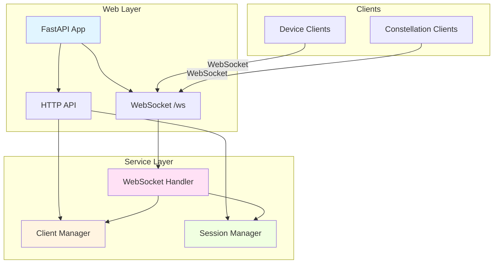
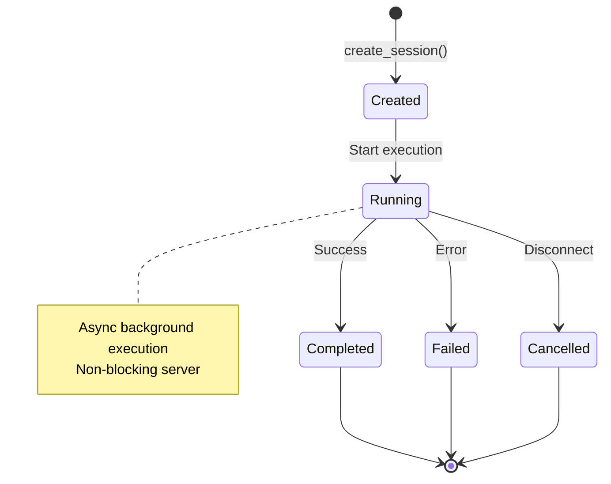
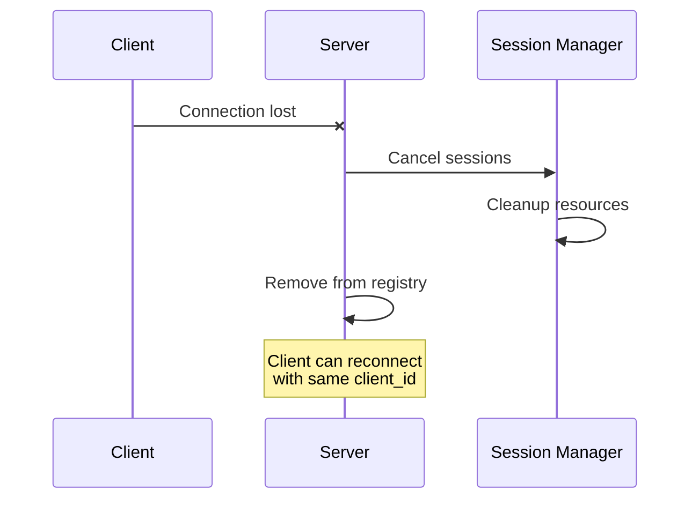
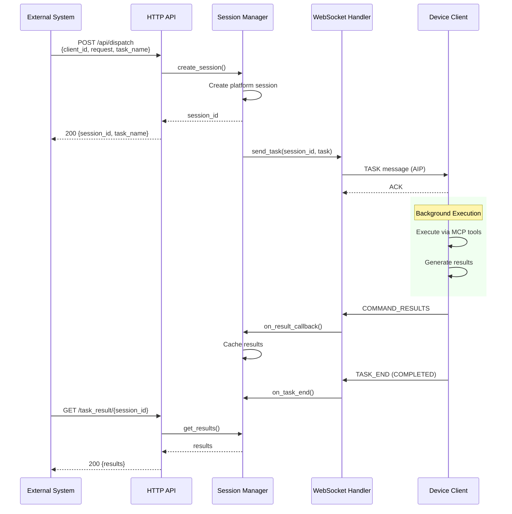
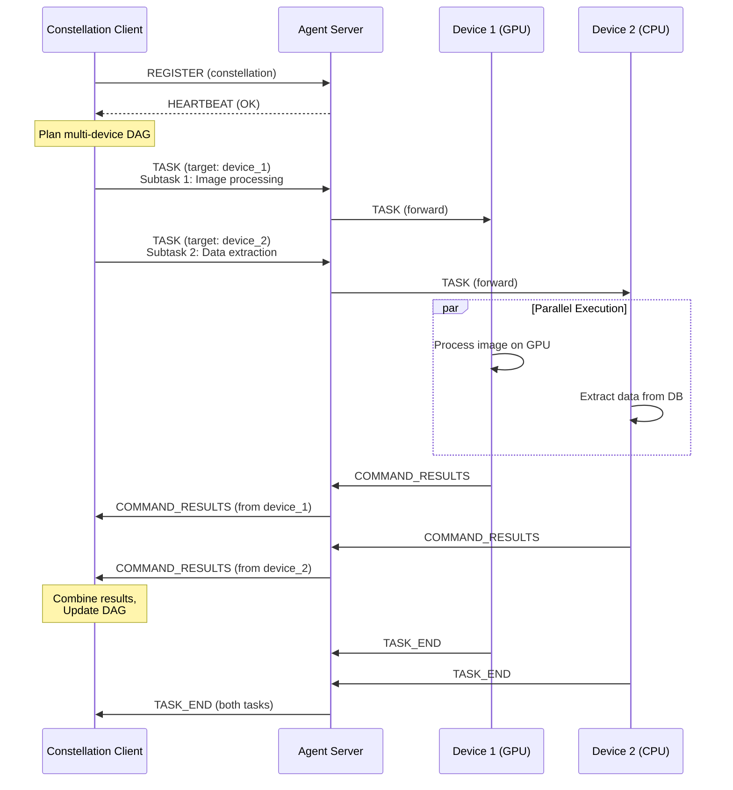
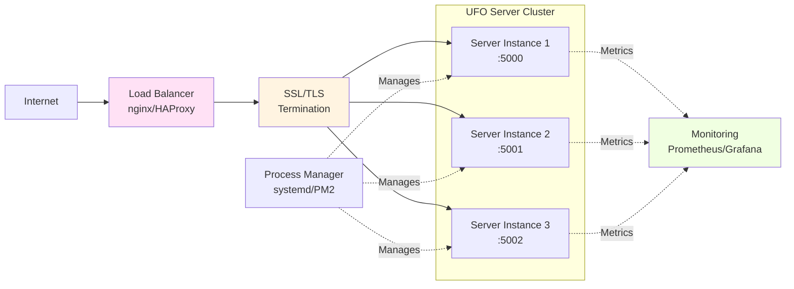

# Agent Server Overview

The **Agent Server** is the central orchestration engine that transforms UFO into a distributed multi-agent system, enabling seamless task coordination across heterogeneous devices through persistent WebSocket connections and robust state management.

New to the Agent Server? Start with the [Quick Start Guide](./quick_start.md) to get up and running in minutes.

## What is the Agent Server?

The Agent Server is a **FastAPI-based asynchronous WebSocket server** that serves as the communication hub for UFO's distributed architecture. It bridges constellation orchestrators, device agents, and external systems through a unified protocol interface.

### Core Responsibilities

| Capability | Description | Key Benefit |
|------------|-------------|-------------|
| **🔌 Connection Management** | Tracks device & constellation client lifecycles | Real-time device availability awareness |
| **🎯 Task Orchestration** | Coordinates execution across distributed devices | Centralized workflow control |
| **💾 State Management** | Maintains session lifecycles & execution contexts | Stateful multi-turn task execution |
| **🌐 Dual API Interface** | WebSocket (AIP) + HTTP (REST) endpoints | Flexible integration options |
| **🛡️ Resilience** | Handles disconnections, timeouts, failures gracefully | Production-grade reliability |

**Why Use the Agent Server?**

- **Centralized Control**: Single point of orchestration for multi-device workflows
- **Protocol Abstraction**: Clients communicate via [AIP](../aip/overview.md), hiding network complexity
- **Async by Design**: Non-blocking execution enables high concurrency
- **Platform Agnostic**: Supports Windows, Linux, macOS (in development)

The Agent Server is part of UFO's distributed **server-client architecture**, where it handles orchestration and state management while [Agent Clients](../client/overview.md) handle command execution. See [Server-Client Architecture](../infrastructure/agents/server_client_architecture.md) for the complete design rationale and communication patterns.

---

## Architecture

The server follows a clean separation of concerns with distinct layers for web service, connection management, and protocol handling.

### Architectural Overview

**Component Interaction Diagram:**



This layered design ensures each component has a single, well-defined responsibility. The managers maintain state while the handler implements protocol logic.

### Core Components

| Component | Responsibility | Key Operations |
|-----------|---------------|----------------|
| **FastAPI Application** | Web service layer | ✅ HTTP endpoint routing<br>✅ WebSocket connection acceptance<br>✅ Request/response handling<br>✅ CORS and middleware |
| **Client Connection Manager** | Connection registry | ✅ Client identity tracking<br>✅ Session ↔ client mapping<br>✅ Device info caching<br>✅ Connection lifecycle hooks |
| **Session Manager** | Execution lifecycle | ✅ Platform-specific session creation<br>✅ Background async task execution<br>✅ Result callback delivery<br>✅ Session cancellation |
| **WebSocket Handler** | Protocol implementation | ✅ AIP message parsing/routing<br>✅ Client registration<br>✅ Heartbeat monitoring<br>✅ Task/command dispatch |

**Component Documentation:**
- [Session Manager](./session_manager.md) - Session lifecycle and background execution
- [Client Connection Manager](./client_connection_manager.md) - Connection registry and client tracking
- [WebSocket Handler](./websocket_handler.md) - AIP protocol message handling
- [HTTP API](./api.md) - REST endpoint specifications

---

## Key Capabilities

### 1. Multi-Client Coordination

The server supports two distinct client types with different roles in the distributed architecture.

**Client Type Comparison:**

| Aspect | Device Client | Constellation Client |
|--------|---------------|---------------------|
| **Role** | Task executor | Task orchestrator |
| **Connection** | Long-lived WebSocket | Long-lived WebSocket |
| **Registration** | `ClientType.DEVICE` | `ClientType.CONSTELLATION` |
| **Capabilities** | Local execution, telemetry | Multi-device coordination |
| **Target Field** | Not required | Required for routing |
| **Example** | Windows agent, Linux agent | ConstellationClient orchestrator |

**Device Clients**
- Execute tasks locally on Windows/Linux machines
- Report hardware specs and real-time status
- Respond to commands via MCP tool servers
- Stream execution logs back to server

See [Agent Client Overview](../client/overview.md) for detailed client architecture.

**Constellation Clients**  
- Orchestrate multi-device workflows from a central point
- Dispatch tasks to specific target devices via `target_id`
- Coordinate complex cross-device DAG execution
- Aggregate results from multiple devices

Both client types connect to `/ws` and register using the `REGISTER` message. The server differentiates behavior based on `client_type` field. For the complete server-client architecture and design rationale, see [Server-Client Architecture](../infrastructure/agents/server_client_architecture.md).

See [Quick Start](./quick_start.md) for registration examples.

---

### 2. Session Lifecycle Management

Unlike stateless HTTP servers, the Agent Server maintains **session state** throughout task execution, enabling multi-turn interactions and result callbacks.

**Session Lifecycle State Machine:**



**Lifecycle Stages:**

| Stage | Trigger | Session Manager Action | Server State |
|-------|---------|----------------------|--------------|
| **Created** | HTTP dispatch or AIP `TASK` | Platform-specific session instantiation | Session ID generated |
| **Running** | Background task start | Async execution without blocking | Awaiting results |
| **Completed** | `TASK_END` (success) | Callback delivery to client | Results cached |
| **Failed** | `TASK_END` (error) | Error callback delivery | Error logged |
| **Cancelled** | Client disconnect | Cancel async task, cleanup | Session removed |

!!!warning "Platform-Specific Sessions"
    The SessionManager creates different session types based on the target platform:
    - **Windows**: `WindowsSession` with UI automation support
    - **Linux**: `LinuxSession` with bash automation
    - Auto-detected or overridden via `--platform` flag

**Session Manager Responsibilities:**

- ✅ **Platform abstraction**: Hides Windows/Linux differences
- ✅ **Background execution**: Non-blocking async task execution
- ✅ **Callback routing**: Delivers results via WebSocket
- ✅ **Resource cleanup**: Cancels tasks on disconnect
- ✅ **Result caching**: Stores results for HTTP retrieval

---

### 3. Resilient Communication

The server implements the [Agent Interaction Protocol (AIP)](../aip/overview.md), providing structured, type-safe communication with automatic failure handling.

**Protocol Features:**

| Feature | Implementation | Benefit |
|---------|----------------|---------|
| **Structured Messages** | Pydantic models with validation | Type safety, automatic serialization |
| **Connection Health** | Heartbeat every 20-30s | Early failure detection |
| **Error Recovery** | Exponential backoff reconnection | Transient fault tolerance |
| **State Tracking** | Session client mapping | Proper cleanup on disconnect |
| **Message Correlation** | `request_id`, `prev_response_id` chains | Request-response tracing |

**Disconnection Handling Flow:**



!!!danger "Important: Session Cancellation on Disconnect"
    When a client disconnects (device or constellation), **all associated sessions are immediately cancelled** to prevent orphaned tasks and resource leaks.

---

### 4. Dual API Interface

The server provides two API styles to support different integration patterns: real-time WebSocket for agents and simple HTTP for external systems.

**WebSocket API (AIP-based)**

Purpose: Real-time bidirectional communication with agent clients

| Message Type | Direction | Purpose |
|--------------|-----------|---------|
| `REGISTER` | Client Server | Initial capability advertisement |
| `TASK` | Server Client | Task assignment with commands |
| `COMMAND` | Server Client | Individual command execution |
| `COMMAND_RESULTS` | Client Server | Execution results |
| `TASK_END` | Bidirectional | Task completion notification |
| `HEARTBEAT` | Bidirectional | Connection keepalive |
| `DEVICE_INFO_REQUEST/RESPONSE` | Bidirectional | Telemetry exchange |
| `ERROR` | Bidirectional | Error condition reporting |

!!!example "WebSocket Connection"
    ```python
    import websockets
    
    async with websockets.connect("ws://localhost:5000/ws") as ws:
        # Register as device client
        await ws.send(json.dumps({
            "message_type": "REGISTER",
            "client_id": "windows_agent_001",
            "client_type": "device",
            "metadata": {"platform": "windows", "gpu": "NVIDIA RTX 3080"}
        }))
    ```

**HTTP REST API**

Purpose: Task dispatch and monitoring from external systems (HTTP clients, CI/CD, etc.)

| Endpoint | Method | Purpose | Authentication |
|----------|--------|---------|----------------|
| `/api/dispatch` | POST | Dispatch task to device | Optional (if configured) |
| `/api/task_result/{task_name}` | GET | Retrieve task results | Optional |
| `/api/clients` | GET | List connected clients | Optional |
| `/api/health` | GET | Server health check | None |

!!!example "HTTP Task Dispatch"
    ```bash
    # Dispatch task to device
    curl -X POST http://localhost:5000/api/dispatch \
      -H "Content-Type: application/json" \
      -d '{
        "client_id": "my_windows_device",
        "request": "Open Notepad and type Hello World",
        "task_name": "test_task_001"
      }'
    
    # Response: {"status": "dispatched", "session_id": "session_abc123", "task_name": "test_task_001"}
    
    # Retrieve results
    curl http://localhost:5000/api/task_result/test_task_001
    ```

See [HTTP API Reference](./api.md) for complete endpoint documentation.

---

## Workflow Examples

### Complete Task Dispatch Flow

**End-to-End HTTP WebSocket Device Execution:**



The green box highlights async execution on the device side, which doesn't block the server.

### Multi-Device Constellation Workflow

**Constellation Client Coordinating Multiple Devices:**



The server acts as a message router, forwarding tasks to target devices and routing results back to the constellation orchestrator. See [Constellation Documentation](../galaxy/overview.md) for more details on multi-device orchestration.

---

## Platform Support

The server automatically detects client platforms and creates appropriate session implementations.

**Supported Platforms:**

| Platform | Session Type | Capabilities | Status |
|----------|--------------|--------------|--------|
| **Windows** | `WindowsSession` | UI automation (UIA)<br>COM API integration<br>Native app control<br>Screenshot capture | Full support |
| **Linux** | `LinuxSession` | Bash automation<br>GUI tools (xdotool)<br>Package management<br>Process control | Full support |
| **macOS** | (Planned) | AppleScript<br>UI automation<br>Native app control | 🚧 In development |

**Platform Auto-Detection:**

The server automatically detects the client's platform during registration. You can override this globally with the `--platform` flag when needed for testing or specific deployment scenarios.

```bash
python -m ufo.server.app --platform windows  # Force Windows sessions
python -m ufo.server.app --platform linux    # Force Linux sessions
python -m ufo.server.app                     # Auto-detect (default)
```

!!!warning "When to Use Platform Override"
    Use `--platform` override when:
    - Testing cross-platform sessions without actual devices
    - Running server in container different from target platform
    - Debugging platform-specific session behavior

For more details on platform-specific implementations, see [Windows Agent](../linux/overview.md) and [Linux Agent](../linux/overview.md).

---

## Configuration

The server runs out-of-the-box with sensible defaults. Advanced configuration inherits from UFO's central config system.

### Command-Line Arguments

```bash
python -m ufo.server.app [OPTIONS]
```

**Available Options:**

| Option | Type | Default | Description |
|--------|------|---------|-------------|
| `--port` | int | 5000 | Server listening port |
| `--host` | str | `0.0.0.0` | Bind address (use `127.0.0.1` for localhost only) |
| `--platform` | str | auto | Force platform (`windows`, `linux`) |
| `--log-level` | str | `INFO` | Logging level (`DEBUG`, `INFO`, `WARNING`, `ERROR`, `CRITICAL`, `OFF`) |
| `--local` | flag | False | Restrict to local connections only |

!!!example "Configuration Examples"
    ```bash
    # Development: Local-only with debug logging
    python -m ufo.server.app --local --log-level DEBUG --port 8000
    
    # Production: External access, info logging
    python -m ufo.server.app --host 0.0.0.0 --port 5000 --log-level INFO
    
    # Testing: Force Linux sessions
    python -m ufo.server.app --platform linux --port 9000
    ```

### UFO Configuration Inheritance

The server uses UFO's central configuration from `config_dev.yaml`:

| Config Section | Inherited Settings |
|----------------|-------------------|
| **Agent Strategies** | HostAgent, AppAgent, EvaluationAgent configurations |
| **LLM Models** | Model endpoints, API keys, temperature settings |
| **Automators** | UI automation, COM API, web automation configs |
| **Logging** | Log file paths, rotation, format |
| **Prompts** | Agent system prompts, example templates |

See [Configuration Guide](../configuration/system/overview.md) for comprehensive config documentation.

---

## Monitoring & Operations

### Health Monitoring

Monitor server status and performance using HTTP endpoints.

**Health Check Endpoints:**

```bash
# Server health and uptime
curl http://localhost:5000/api/health

# Response:
# {
#   "status": "healthy",
#   "online_clients": [...]
# }

# Connected clients list
curl http://localhost:5000/api/clients

# Response:
# {
#   "online_clients": ["windows_001", "linux_002", ...]
# }
```

For comprehensive monitoring strategies including performance metrics collection, log aggregation patterns, alert configuration, and dashboard setup, see [Monitoring Guide](./monitoring.md).

### Error Handling

The server handles common failure scenarios gracefully to maintain system stability.

**Disconnection Handling Matrix:**

| Scenario | Server Detection | Automatic Action | Client Impact |
|----------|-----------------|------------------|---------------|
| **Device Disconnect** | Heartbeat timeout / WebSocket close | Cancel device sessions, notify constellation | Task fails, constellation retries |
| **Constellation Disconnect** | Heartbeat timeout / WebSocket close | Continue device execution, skip callbacks | Device completes but results not delivered |
| **Task Execution Failure** | `TASK_END` with error status | Log error, store in results | Client receives error via callback/HTTP |
| **Network Partition** | Heartbeat timeout | Mark disconnected, enable reconnection | Client reconnects with same ID |
| **Server Crash** | N/A | Clients detect via heartbeat | Clients reconnect to new instance |

!!!note "Reconnection Support"
    Clients can reconnect with the same `client_id`. The server will re-register the client and restore heartbeat monitoring, but **will not restore previous sessions** (sessions are ephemeral).

---

## Best Practices

### Development Environment

Optimize your development workflow with these recommended practices.

**Recommended Development Configuration:**

```bash
# Isolate to localhost, enable detailed logging
python -m ufo.server.app \
  --host 127.0.0.1 \
  --port 5000 \
  --local \
  --log-level DEBUG
```

**Development Checklist:**

- Use `--local` flag to prevent external access
- Enable `DEBUG` logging for detailed traces
- Monitor logs in separate terminal: `tail -f logs/ufo_server.log`
- Test with single device before adding multiple clients
- Use HTTP API for quick task dispatch testing
- Verify heartbeat monitoring with client disconnection

!!!example "Development Testing Pattern"
    ```bash
    # Terminal 1: Start server with debug logging
    python -m ufo.server.app --local --log-level DEBUG
    
    # Terminal 2: Connect device client
    python -m ufo.client.client --ws --ws-server ws://127.0.0.1:5000/ws
    
    # Terminal 3: Dispatch test task
    curl -X POST http://127.0.0.1:5000/api/dispatch \
      -H "Content-Type: application/json" \
      -d '{"client_id": "windowsagent", "request": "Open Notepad", "task_name": "test_001"}'
    ```

### Production Deployment

The default configuration is **not production-ready**. Implement these security and reliability measures.

**Production Architecture:**



**Production Checklist:**

| Category | Recommendation | Rationale |
|----------|---------------|-----------|
| **Reverse Proxy** | nginx, Apache, or cloud load balancer | SSL termination, rate limiting, DDoS protection |
| **SSL/TLS** | Enable WSS (WebSocket Secure) | Encrypt client-server communication |
| **Authentication** | Add auth middleware to FastAPI | Prevent unauthorized access |
| **Process Management** | systemd (Linux), PM2 (Node.js), Docker | Auto-restart on crash, resource limits |
| **Monitoring** | `/api/health` polling, metrics export | Detect issues proactively |
| **Logging** | Structured logging, log aggregation (ELK) | Centralized debugging and audit trails |
| **Resource Limits** | Set max connections, memory limits | Prevent resource exhaustion |

**Example Nginx Configuration:**

```nginx
upstream ufo_server {
    server localhost:5000;
}

server {
    listen 443 ssl;
    server_name ufo-server.example.com;
    
    ssl_certificate /path/to/cert.pem;
    ssl_certificate_key /path/to/key.pem;
    
    # WebSocket endpoint
    location /ws {
        proxy_pass http://ufo_server;
        proxy_http_version 1.1;
        proxy_set_header Upgrade $http_upgrade;
        proxy_set_header Connection "upgrade";
        proxy_set_header Host $host;
        proxy_read_timeout 3600s;
    }
    
    # HTTP API
    location /api/ {
        proxy_pass http://ufo_server;
        proxy_set_header Host $host;
    }
}
```

<!-- TODO: Add deployment guide documentation -->

### Scaling Strategies

The server can scale horizontally for high-load deployments, but requires careful session management.

**Scaling Patterns:**

| Pattern | Description | Use Case | Considerations |
|---------|-------------|----------|----------------|
| **Vertical** | Increase CPU/RAM on single instance | < 100 concurrent clients | Simplest, no session distribution |
| **Horizontal (Sticky Sessions)** | Multiple instances with session affinity | 100-1000 clients | Load balancer routes same client to same instance |
| **Horizontal (Shared State)** | Multiple instances with Redis | > 1000 clients | Requires session state externalization |

!!!warning "Current Limitation"
    The current implementation stores session state in-memory. For horizontal scaling, use **sticky sessions** (client affinity) in your load balancer to route clients to consistent server instances. **Future**: Shared state backend (Redis) for true stateless horizontal scaling.

<!-- TODO: Add load balancing guide documentation -->

---

## Troubleshooting

### Common Issues

**Issue: Clients Can't Connect**

```bash
# Symptom: Connection refused
Error: WebSocket connection to 'ws://localhost:5000/ws' failed

# Diagnosis:
1. Check server is running: curl http://localhost:5000/api/health
2. Verify port: netstat -an | grep 5000
3. Check firewall: sudo ufw status

# Solution:
# Start server with correct host binding
python -m ufo.server.app --host 0.0.0.0 --port 5000
```

**Issue: Sessions Not Executing**

```bash
# Symptom: Task dispatched but no results

# Diagnosis:
1. Check server logs for errors
2. Verify client is connected: curl http://localhost:5000/api/clients
3. Check target_id matches client_id

# Solution:
# Ensure client_id in request matches registered client
curl -X POST http://localhost:5000/api/dispatch \
  -d '{"client_id": "correct_client_id", "request": "test", "task_name": "test_001"}'
```

**Issue: Memory Leak / High Memory Usage**

```bash
# Symptom: Server memory grows over time

# Diagnosis:
1. Check session cleanup in logs
2. Monitor /api/health for session count
3. Profile with memory_profiler

# Solution:
# Ensure clients send TASK_END to complete sessions
# Restart server periodically (systemd handles this)
# Implement session timeout (future feature)
```

### Debug Mode

!!!example "Enable Maximum Verbosity"
    ```bash
    # Ultra-verbose debugging
    python -m ufo.server.app \
      --log-level DEBUG \
      --local \
      --port 5000 2>&1 | tee debug.log
    
    # Watch logs in real-time
    tail -f debug.log | grep -E "(ERROR|WARNING|Session|WebSocket)"
    ```

---

## Documentation Map

Explore related documentation to deepen your understanding of the Agent Server ecosystem.

### Getting Started

| Document | Purpose |
|----------|---------|
| [Quick Start](./quick_start.md) | Get server running in < 5 minutes |
| [Client Registration](./quick_start.md) | How clients connect to server |

### Architecture & Components

| Document | Purpose |
|----------|---------|
| [Session Manager](./session_manager.md) | Task execution lifecycle deep-dive |
| [Client Connection Manager](./client_connection_manager.md) | Connection registry internals |
| [WebSocket Handler](./websocket_handler.md) | AIP protocol message handling |
| [HTTP API](./api.md) | REST endpoint specifications |

### Operations

| Document | Purpose |
|----------|---------|
| [Monitoring](./monitoring.md) | Health checks, metrics, alerting |

### Related Documentation

| Document | Purpose |
|----------|---------|
| [AIP Protocol](../aip/overview.md) | Communication protocol specification |
| [Agent Architecture](../infrastructure/agents/overview.md) | Agent design and FSM framework |
| [Server-Client Architecture](../infrastructure/agents/server_client_architecture.md) | Distributed architecture rationale |
| [Client Overview](../client/overview.md) | Device client architecture |
| [MCP Integration](../mcp/overview.md) | Model Context Protocol tool servers |

---

## Next Steps

Follow this recommended sequence to master the Agent Server:

**1. Run the Server** (5 minutes)
- Follow the [Quick Start Guide](./quick_start.md)
- Verify server responds to `/api/health`

**2. Connect a Client** (10 minutes)
- Use [Device Client](../client/quick_start.md)
- Verify registration in server logs
- Check `/api/clients` endpoint

**3. Dispatch Tasks** (15 minutes)
- Use [HTTP API](./api.md) to send tasks
- Retrieve results via `/api/task_result`
- Observe WebSocket message flow in logs

**4. Understand Architecture** (30 minutes)
- Read [Session Manager](./session_manager.md) internals
- Study [WebSocket Handler](./websocket_handler.md) protocol implementation
- Review [AIP Protocol](../aip/overview.md) message types

**5. Deploy to Production** (varies)
- Set up reverse proxy (nginx)
- Configure SSL/TLS
- Implement monitoring
- Test failover scenarios

<!-- TODO: Add tutorials overview documentation -->