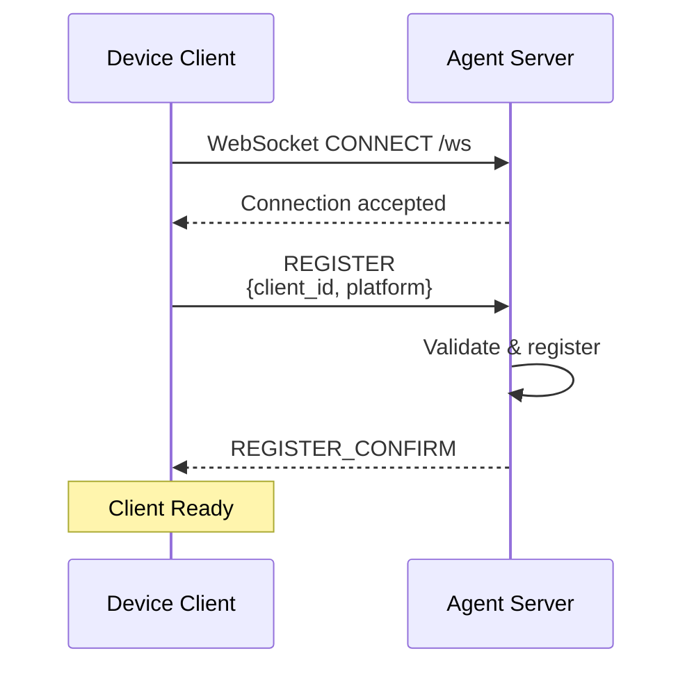
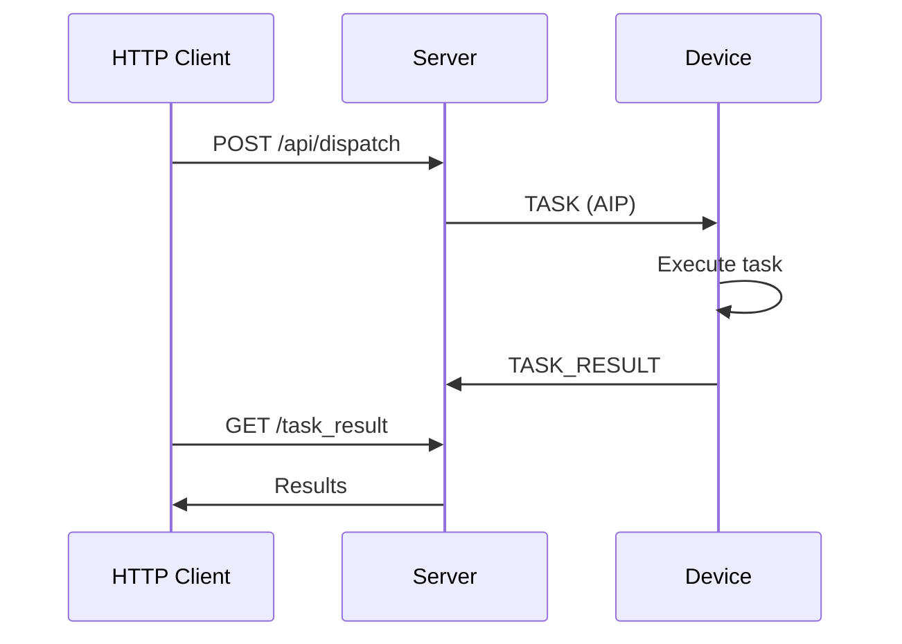

# Quick Start

This hands-on guide walks you through starting the UFO Agent Server, connecting clients, and dispatching your first task. Perfect for first-time users.

---

## 📋 Prerequisites

Before you begin, ensure you have:

- **Python 3.10+** installed
- **UFO dependencies** installed (`pip install -r requirements.txt`)
- **Network connectivity** for WebSocket connections
- **Terminal access** (PowerShell, bash, or equivalent)

| Component | Minimum Version | Recommended |
|-----------|----------------|-------------|
| Python | 3.10 | 3.11+ |
| FastAPI | 0.104+ | Latest |
| Uvicorn | 0.24+ | Latest |
| UFO | - | Latest commit |

---

## 🚀 Starting the Server

### Basic Startup

Start the server with default settings (port **5000**):

```bash
python -m ufo.server.app
```

**Expected Output:**

```console
2024-11-04 14:30:22 - ufo.server.app - INFO - Starting UFO Server on 0.0.0.0:5000
2024-11-04 14:30:22 - ufo.server.app - INFO - Platform: auto-detected
2024-11-04 14:30:22 - ufo.server.app - INFO - Log level: WARNING
INFO:     Started server process [12345]
INFO:     Waiting for application startup.
INFO:     Application startup complete.
INFO:     Uvicorn running on http://0.0.0.0:5000 (Press CTRL+C to quit)
```

Once you see "Uvicorn running", the server is ready to accept WebSocket connections at `ws://0.0.0.0:5000/ws`.

### Configuration Options

| Argument | Type | Default | Description | Example |
|----------|------|---------|-------------|---------|
| `--port` | int | `5000` | Server listening port | `--port 8080` |
| `--host` | str | `0.0.0.0` | Bind address (0.0.0.0 = all interfaces) | `--host 127.0.0.1` |
| `--platform` | str | `auto` | Platform override (`windows`, `linux`) | `--platform windows` |
| `--log-level` | str | `WARNING` | Logging verbosity | `--log-level DEBUG` |
| `--local` | flag | `False` | Restrict to localhost connections only | `--local` |

**Common Startup Configurations:**

**Development (Local Only):**
```bash
python -m ufo.server.app --local --log-level DEBUG
```
- Accepts connections only from `localhost`
- Verbose debug logging
- Default port 5000

**Custom Port:**
```bash
python -m ufo.server.app --port 8080
```
- Useful if port 5000 is already in use
- Accessible from network

**Production (Linux):**
```bash
python -m ufo.server.app --port 5000 --platform linux --log-level WARNING
```
- Explicit platform specification
- Reduced logging for performance
- Production-ready configuration

**Multi-Interface Binding:**
```bash
python -m ufo.server.app --host 192.168.1.100 --port 5000
```
- Binds to specific network interface
- Useful for multi-homed servers

---

## 🖥️ Connecting Device Clients

A Device Client is an agent running on a physical or virtual machine that can execute tasks. Each device connects via WebSocket and registers with a unique `client_id`.

Once the server is running, connect device agents using the command line:

### Platform-Specific Commands

**Windows Device:**
```bash
python -m ufo.client.client --ws --ws-server ws://127.0.0.1:5000/ws --client-id my_windows_device
```

**Linux Device:**
```bash
python -m ufo.client.client --ws --ws-server ws://127.0.0.1:5000/ws --client-id my_linux_device --platform linux
```

When a client connects successfully, the server logs will display:
```console
INFO: [WS] 📱 Device client my_windows_device connected
```

### Client Connection Parameters

| Parameter | Required | Type | Description | Example |
|-----------|----------|------|-------------|---------|
| `--ws` | Yes | flag | Enable WebSocket mode (vs. local mode) | `--ws` |
| `--ws-server` | Yes | URL | Server WebSocket endpoint | `ws://127.0.0.1:5000/ws` |
| `--client-id` | Yes | string | Unique device identifier (must be unique across all clients) | `device_win_001` |
| `--platform` | ⚠️ Optional | string | Platform type: `windows`, `linux` | `--platform windows` |

!!!warning "Important: Client ID Uniqueness"
    Each `client_id` must be globally unique. If a client connects with an existing ID, the old connection will be terminated.

!!!tip "Platform Auto-Detection"
    If you don't specify `--platform`, the client will auto-detect the operating system. However, **explicit specification is recommended** for clarity.

### Registration Protocol Flow



The registration process uses the **Agent Interaction Protocol (AIP)** for structured communication. See [AIP Documentation](../aip/overview.md) for details.

---

## 🌌 Connecting Constellation Clients

A Constellation Client is an orchestrator that coordinates multi-device tasks. It connects to the server and can dispatch work across multiple registered device clients.

### Basic Constellation Connection

```bash
python -m galaxy.constellation.constellation --ws --ws-server ws://127.0.0.1:5000/ws --target-id my_windows_device
```

### Constellation Parameters

| Parameter | Required | Description | Example |
|-----------|----------|-------------|---------|
| `--ws` | Yes | Enable WebSocket mode | `--ws` |
| `--ws-server` | Yes | Server WebSocket URL | `ws://127.0.0.1:5000/ws` |
| `--target-id` | ⚠️ Optional | Initial target device ID for tasks | `my_windows_device` |

!!!danger "Important: Target Device Must Be Online"
    If you specify `--target-id`, that device **must already be connected** to the server. Otherwise, registration will fail with: `Target device 'my_windows_device' is not connected`

A constellation can dynamically dispatch tasks to different devices, not just the `target-id`. For more on multi-device orchestration, see [Constellation Documentation](../galaxy/overview.md).

---

## Verifying the Setup

### Method 1: Check Connected Clients

Use the HTTP API to verify connections:

```bash
curl http://localhost:5000/api/clients
```

**Expected Response:**

```json
{
  "online_clients": ["my_windows_device", "my_linux_device"]
}
```

If you see your `client_id` in the list, the device is successfully connected and ready to receive tasks.

### Method 2: Health Check

```bash
curl http://localhost:5000/api/health
```

**Expected Response:**

```json
{
  "status": "healthy",
  "online_clients": ["my_windows_device"]
}
```

The `/api/health` endpoint is useful for health checks in production monitoring systems.

---

## 🎯 Dispatching Your First Task

The easiest way to send a task to a connected device is through the HTTP `/api/dispatch` endpoint.

### Basic Task Dispatch

Use the HTTP API to dispatch a task to a connected device:

```bash
curl -X POST http://localhost:5000/api/dispatch \
  -H "Content-Type: application/json" \
  -d '{
    "client_id": "my_windows_device",
    "request": "Open Notepad and type Hello World",
    "task_name": "test_task_001"
  }'
```

**Request Body Parameters:**

| Field | Required | Type | Description | Example |
|-------|----------|------|-------------|---------|
| `client_id` | Yes | string | Target device identifier | `"my_windows_device"` |
| `request` | Yes | string | Natural language task description | `"Open Notepad"` |
| `task_name` | ⚠️ Optional | string | Unique task identifier (auto-generated if omitted) | `"task_001"` |

**Successful Response:**

```json
{
  "status": "dispatched",
  "task_name": "test_task_001",
  "client_id": "my_windows_device",
  "session_id": "3f4a2b1c-9d8e-4f3a-b2c1-9a8b7c6d5e4f"
}
```

The `status: "dispatched"` indicates the task was successfully sent to the device. The device will begin executing immediately.

!!!warning "Client Must Be Online"
    If the target `client_id` is not connected, you'll receive `{"detail": "Client not online"}`. Use `/api/clients` to verify the device is connected first.

### Task Execution Flow



For detailed API specifications, see [HTTP API Reference](./api.md).

### Checking Task Results

Use the task name to retrieve results:

```bash
curl http://localhost:5000/api/task_result/test_task_001
```

**While Task is Running:**

```json
{
  "status": "pending"
}
```

**When Task Completes:**

```json
{
  "status": "done",
  "result": {
    "action_taken": "Opened Notepad and typed 'Hello World'",
    "screenshot": "base64_encoded_image...",
    "observation": "Task completed successfully"
  }
}
```

!!!tip "Polling Best Practice"
    For long-running tasks, poll every 2-5 seconds. Most simple tasks complete within 10-30 seconds.

### Advanced Task Dispatch

**Complex Multi-Step Task:**
```bash
curl -X POST http://localhost:5000/api/dispatch \
  -H "Content-Type: application/json" \
  -d '{
    "client_id": "my_windows_device",
    "request": "Open Excel, create a new worksheet, and enter sales data for Q4 2024",
    "task_name": "excel_q4_report"
  }'
```

**Web Automation Task:**
```bash
curl -X POST http://localhost:5000/api/dispatch \
  -H "Content-Type: application/json" \
  -d '{
    "client_id": "my_windows_device",
    "request": "Open Chrome, navigate to GitHub.com, and search for UFO framework",
    "task_name": "github_search"
  }'
```

**File Management Task:**
```bash
curl -X POST http://localhost:5000/api/dispatch \
  -H "Content-Type: application/json" \
  -d '{
    "client_id": "my_linux_device",
    "request": "Create a folder named test_data and copy all .txt files from Documents",
    "task_name": "file_organization"
  }'
```

---

## 🐛 Common Issues & Troubleshooting

### Issue 1: Port Already in Use

**Symptoms:**
```console
ERROR: [Errno 98] Address already in use
```

**Cause:** Another process is already using port 5000.

**Solutions:**

**Use Different Port:**
```bash
python -m ufo.server.app --port 8080
```

**Find & Kill Process (Linux/Mac):**
```bash
# Find process using port 5000
lsof -i :5000
    
# Kill the process
kill -9 <PID>
```

**Find & Kill Process (Windows):**
```powershell
# Find process using port 5000
netstat -ano | findstr :5000
    
# Kill the process
taskkill /PID <PID> /F
```

### Issue 2: Connection Refused

**Symptoms:**
```console
[WS] Failed to connect to ws://127.0.0.1:5000/ws
Connection refused
```

**Diagnosis Checklist:**

- Is the server actually running? Check for "Uvicorn running" message
- Does the port match in both server and client commands?
- Are you using `--local` mode? If yes, clients must connect from `localhost`
- Is there a firewall blocking the connection?

**Solutions:**

1. Verify server is running:
   ```bash
   curl http://localhost:5000/api/health
   ```

2. Check server logs for startup errors

3. If using `--local` mode, ensure client uses `127.0.0.1`

4. If connecting from another machine, remove `--local` flag

### Issue 3: Device Not Connected Error

**Symptoms:**
When dispatching a task:
```json
{
  "detail": "Client not online"
}
```

**Diagnosis:**

1. List all connected clients:
   ```bash
   curl http://localhost:5000/api/clients
   ```

2. Check the `client_id` matches exactly (case-sensitive!)

**Solutions:**

- Verify the device client is running and successfully registered
- Check server logs for `📱 Device client <client_id> connected`
- Ensure no typos in `client_id` when dispatching
- If the device disconnected, restart the client connection

### Issue 4: Empty Task Content Error

**Symptoms:**
```json
{
  "detail": "Empty task content"
}
```

**Cause:** The `request` field in `/api/dispatch` is missing or empty.

**Solution:** Always include the `request` field with a task description.

### Issue 5: Firewall Blocking Connections
    **Symptoms:** Clients on other machines cannot connect, but `curl localhost:5000/api/health` works on server machine.
    
    **Diagnosis:**
    
    1. **Check server is listening on all interfaces:**
        ```bash
        # Should show 0.0.0.0:5000 (not 127.0.0.1:5000)
        netstat -tuln | grep 5000
        ```
    
    2. **Test from remote machine:**
        ```bash
        curl http://<server-ip>:5000/api/health
        ```
    
    **Solutions:**
    
    **Windows Firewall:**
    ```powershell
    # Allow incoming connections on port 5000
    New-NetFirewallRule -DisplayName "UFO Server" `
      -Direction Inbound `
      -Protocol TCP `
      -LocalPort 5000 `
      -Action Allow
    ```
    
    **Linux (ufw):**
    ```bash
    sudo ufw allow 5000/tcp
    sudo ufw reload
    ```
    
    **Linux (firewalld):**
    ```bash
    sudo firewall-cmd --zone=public --add-port=5000/tcp --permanent
    sudo firewall-cmd --reload
    ```

### Issue 6: Target Device Not Connected (Constellation)

**Symptoms:**
```console
Target device 'my_windows_device' is not connected
```

**Solution:**

1. Connect the device client first
2. Wait for registration confirmation (check server logs)
3. Then connect constellation

!!!tip "Debug Mode"
    For maximum verbosity, start the server with: `python -m ufo.server.app --log-level DEBUG`

---

## 📚 Next Steps

Now that you have the server running and can dispatch tasks, explore these topics:

### Immediate Next Steps

| Step | Topic | Time | Description |
|------|-------|------|-------------|
| 1️⃣ | [Server Architecture](./overview.md) | 10 min | Understand the three-tier architecture and component interactions |
| 2️⃣ | [HTTP API Reference](./api.md) | 15 min | Explore all available API endpoints for integration |
| 3️⃣ | [Client Setup Guide](../client/quick_start.md) | 10 min | Learn advanced client configuration options |
| 4️⃣ | [AIP Protocol](../aip/overview.md) | 20 min | Deep dive into the Agent Interaction Protocol |

### Advanced Topics

| Topic | Relevance | Link |
|-------|-----------|------|
| **Session Management** | Understanding task lifecycle and state | [Session Manager](./session_manager.md) |
| **WebSocket Handler** | Low-level connection handling | [WebSocket Handler](./websocket_handler.md) |
| **Monitoring & Operations** | Production deployment best practices | [Monitoring](./monitoring.md) |
| **Constellation Mode** | Multi-device orchestration | Coming Soon |

---

## 🚀 Production Deployment

!!!warning "Production Readiness Checklist"
    Before deploying to production, ensure you address these critical areas:

### 1. Process Management

!!!example "Systemd Service (Linux)"
    Create `/etc/systemd/system/ufo-server.service`:
    
    ```ini
    [Unit]
    Description=UFO Agent Server
    After=network.target
    
    [Service]
    Type=simple
    User=ufo
    WorkingDirectory=/opt/ufo
    Environment="PATH=/opt/ufo/venv/bin"
    ExecStart=/opt/ufo/venv/bin/python -m ufo.server.app --port 5000 --log-level INFO
    Restart=always
    RestartSec=10
    StandardOutput=journal
    StandardError=journal
    
    [Install]
    WantedBy=multi-user.target
    ```
    
    **Enable and start:**
    ```bash
    sudo systemctl daemon-reload
    sudo systemctl enable ufo-server
    sudo systemctl start ufo-server
    sudo systemctl status ufo-server
    ```

**PM2 Process Manager (Cross-Platform):**
```bash
# Install PM2
npm install -g pm2

# Start server with PM2
pm2 start "python -m ufo.server.app --port 5000" --name ufo-server

# Setup auto-restart on system boot
pm2 startup
pm2 save

# Monitor
pm2 logs ufo-server
pm2 monit
```

For complete production deployment guidance including SSL/TLS, security hardening, and scaling strategies, see [Server Overview - Production Deployment](./overview.md#production-deployment).

---

## 🎓 What You Learned

You've successfully:

- Started the UFO Agent Server with custom configurations
- Connected device and constellation clients via WebSocket
- Dispatched tasks using the HTTP API
- Verified connections and monitored health
- Troubleshot common issues
- Learned production deployment best practices

Continue your journey with:

- **Architecture Deep Dive**: [Server Overview](./overview.md)
- **API Exploration**: [HTTP API Reference](./api.md)
- **Client Development**: [Client Documentation](../client/overview.md)
- **Multi-Device Coordination**: [Constellation Overview](../galaxy/overview.md)
<!-- TODO: Add tutorials overview documentation -->