# Quick Start

!!!quote "Get Up and Running in 5 Minutes"
    This hands-on guide walks you through starting the UFO Agent Server, connecting clients, and dispatching your first task. Perfect for first-time users.

---

## 📋 Prerequisites

!!!info "Requirements Checklist"
    Before you begin, ensure you have:
    
    - ✅ **Python 3.10+** installed
    - ✅ **UFO² dependencies** installed (`pip install -r requirements.txt`)
    - ✅ **Network connectivity** for WebSocket connections
    - ✅ **Terminal access** (PowerShell, bash, or equivalent)

| Component | Minimum Version | Recommended |
|-----------|----------------|-------------|
| Python | 3.10 | 3.11+ |
| FastAPI | 0.104+ | Latest |
| Uvicorn | 0.24+ | Latest |
| UFO² | - | Latest commit |

---

## 🚀 Starting the Server

### Basic Startup

!!!example "Minimal Command"
    Start the server with default settings (port **5000**):
    
    ```bash
    python -m ufo.server.app
    ```

**Expected Output:**

```console
2024-11-04 14:30:22 - ufo.server.app - INFO - Starting UFO Server on 0.0.0.0:5000
2024-11-04 14:30:22 - ufo.server.app - INFO - Platform: auto-detected
2024-11-04 14:30:22 - ufo.server.app - INFO - Log level: INFO
INFO:     Started server process [12345]
INFO:     Waiting for application startup.
INFO:     Application startup complete.
INFO:     Uvicorn running on http://0.0.0.0:5000 (Press CTRL+C to quit)
```

!!!success "Server Running"
    Once you see "Uvicorn running", the server is ready to accept WebSocket connections at `ws://0.0.0.0:5000/ws`

### Configuration Options

!!!tip "CLI Arguments Reference"
    The server supports several command-line arguments for customization. All arguments are optional.

| Argument | Type | Default | Description | Example |
|----------|------|---------|-------------|---------|
| `--port` | int | `5000` | Server listening port | `--port 8080` |
| `--host` | str | `0.0.0.0` | Bind address (0.0.0.0 = all interfaces) | `--host 127.0.0.1` |
| `--platform` | str | `auto` | Platform override (`windows`, `linux`) | `--platform windows` |
| `--log-level` | str | `INFO` | Logging verbosity | `--log-level DEBUG` |
| `--local` | flag | `False` | Restrict to localhost connections only | `--local` |

!!!example "Common Startup Configurations"

    === "Development (Local Only)"
        ```bash
        python -m ufo.server.app --local --log-level DEBUG
        ```
        - Accepts connections only from `localhost`
        - Verbose debug logging
        - Default port 5000
    
    === "Custom Port"
        ```bash
        python -m ufo.server.app --port 8080
        ```
        - Useful if port 5000 is already in use
        - Accessible from network
    
    === "Production (Linux)"
        ```bash
        python -m ufo.server.app --port 5000 --platform linux --log-level WARNING
        ```
        - Explicit platform specification
        - Reduced logging for performance
        - Production-ready configuration
    
    === "Multi-Interface Binding"
        ```bash
        python -m ufo.server.app --host 192.168.1.100 --port 5000
        ```
        - Binds to specific network interface
        - Useful for multi-homed servers

---

## 🖥️ Connecting Device Clients

!!!info "What is a Device Client?"
    A Device Client is an agent running on a physical or virtual machine that can execute tasks. Each device connects via WebSocket and registers with a unique `client_id`.

Once the server is running, connect device agents using the command line:

### Platform-Specific Commands

=== "Windows Device"
    ```bash
    python -m ufo.client.client --ws --ws-server ws://127.0.0.1:5000/ws --client-id my_windows_device
    ```

=== "Linux Device"
    ```bash
    python -m ufo.client.client --ws --ws-server ws://127.0.0.1:5000/ws --client-id my_linux_device --platform linux
    ```


!!!success "Registration Success Indicator"
    When a client connects successfully, the server logs will display:
    ```console
    INFO: [WS] ✅ Registered device client: my_windows_device
    ```

### Client Connection Parameters

| Parameter | Required | Type | Description | Example |
|-----------|----------|------|-------------|---------|
| `--ws` | ✅ Yes | flag | Enable WebSocket mode (vs. local mode) | `--ws` |
| `--ws-server` | ✅ Yes | URL | Server WebSocket endpoint | `ws://127.0.0.1:5000/ws` |
| `--client-id` | ✅ Yes | string | Unique device identifier (must be unique across all clients) | `device_win_001` |
| `--platform` | ⚠️ Optional | string | Platform type: `windows`, `linux` | `--platform windows` |

!!!warning "Client ID Uniqueness"
    Each `client_id` must be globally unique. If a client connects with an existing ID, the old connection will be terminated.

!!!tip "Platform Auto-Detection"
    If you don't specify `--platform`, the client will auto-detect the operating system using Python's `platform.system()`. However, **explicit specification is recommended** for clarity and to avoid edge cases.

### Registration Protocol Flow

```mermaid
sequenceDiagram
    participant C as Device Client
    participant S as Agent Server
    participant M as WSManager
    
    Note over C,S: 1️⃣ WebSocket Connection
    C->>+S: WebSocket CONNECT to /ws
    S-->>C: Connection accepted
    
    Note over C,S: 2️⃣ AIP Registration Protocol
    C->>S: REGISTER message<br/>{client_id, client_type, platform}
    S->>S: Validate client_id uniqueness
    S->>M: Register client in WSManager
    
    Note over C,S: 3️⃣ Confirmation
    S-->>-C: REGISTER_CONFIRM<br/>{status: "success"}
    
    Note over C: ✅ Client Ready
    C->>C: Start task listening loop
```



!!!note "AIP Protocol Integration"
    The registration process uses the **Agent Interaction Protocol (AIP)** for structured, reliable communication. See [AIP Documentation](../aip/overview.md) for protocol details.

---

## 🌌 Connecting Constellation Clients

!!!info "What is a Constellation Client?"
    A Constellation Client is an orchestrator that coordinates multi-device tasks. It connects to the server and can dispatch work across multiple registered device clients.

### Basic Constellation Connection

```bash
python -m galaxy.constellation.constellation --ws --ws-server ws://127.0.0.1:5000/ws --target-id my_windows_device
```

### Constellation Parameters

| Parameter | Required | Description | Example |
|-----------|----------|-------------|---------|
| `--ws` | ✅ Yes | Enable WebSocket mode | `--ws` |
| `--ws-server` | ✅ Yes | Server WebSocket URL | `ws://127.0.0.1:5000/ws` |
| `--target-id` | ⚠️ Optional | Initial target device ID for tasks | `my_windows_device` |

!!!danger "Target Device Must Be Online"
    If you specify `--target-id`, that device **must already be connected** to the server. Otherwise, the constellation registration will fail with:
    ```
    Target device 'my_windows_device' is not connected
    ```

!!!tip "Multi-Device Orchestration"
    A constellation can dynamically dispatch tasks to different devices, not just the `target-id`. The `target-id` is primarily used for initial routing.

---

## ✅ Verifying the Setup

### Method 1: Check Connected Clients

!!!example "List All Connected Clients"
    Use the HTTP API to verify connections:
    
    ```bash
    curl http://localhost:5000/api/clients
    ```

**Expected Response:**

```json
{
  "online_clients": [
    {
      "client_id": "my_windows_device",
      "client_type": "device",
      "platform": "windows",
      "connected_at": "2024-11-04T14:30:45.123456",
      "uptime_seconds": 120
    }
  ]
}
```

!!!success "Client Connected"
    If you see your `client_id` in the `online_clients` list, the device is successfully connected and ready to receive tasks.

### Method 2: Health Check

!!!example "Server Health Endpoint"
    ```bash
    curl http://localhost:5000/api/health
    ```

**Expected Response:**

```json
{
  "status": "healthy",
  "online_clients": [
    {
      "client_id": "my_windows_device",
      "client_type": "device",
      "platform": "windows"
    }
  ]
}
```

!!!tip "Monitoring Tip"
    The `/api/health` endpoint is useful for health checks in production monitoring systems (e.g., Prometheus, Nagios).

---

## 🎯 Dispatching Your First Task

!!!info "Task Dispatch via HTTP API"
    The easiest way to send a task to a connected device is through the HTTP `/api/dispatch` endpoint. This is ideal for external integrations, scripts, or manual testing.

### Basic Task Dispatch

!!!example "Send a Simple Task"
    Use the HTTP API to dispatch a task to a connected device:
    
    ```bash
    curl -X POST http://localhost:5000/api/dispatch \
      -H "Content-Type: application/json" \
      -d '{
        "client_id": "my_windows_device",
        "request": "Open Notepad and type Hello World",
        "task_name": "test_task_001"
      }'
    ```

**Request Body Parameters:**

| Field | Required | Type | Description | Example |
|-------|----------|------|-------------|---------|
| `client_id` | ✅ Yes | string | Target device identifier | `"my_windows_device"` |
| `request` | ✅ Yes | string | Natural language task description | `"Open Notepad"` |
| `task_name` | ⚠️ Optional | string | Unique task identifier (auto-generated if omitted) | `"task_001"` |

**Successful Response:**

```json
{
  "status": "dispatched",
  "task_name": "test_task_001",
  "client_id": "my_windows_device",
  "session_id": "3f4a2b1c-9d8e-4f3a-b2c1-9a8b7c6d5e4f"
}
```

!!!success "Task Dispatched"
    The `status: "dispatched"` indicates the task was successfully sent to the device via AIP protocol. The device will begin executing immediately.

!!!warning "Client Must Be Online"
    If the target `client_id` is not connected, you'll receive:
    ```json
    {
      "detail": "Client not online"
    }
    ```
    Use `/api/clients` to verify the device is connected first.

### Task Execution Flow

```mermaid
sequenceDiagram
    participant API as HTTP Client
    participant S as Agent Server
    participant D as Device Client
    participant U as UFO Agent
    
    Note over API,S: 1️⃣ Task Submission
    API->>S: POST /api/dispatch<br/>{client_id, request, task_name}
    S->>S: Validate client_id is online
    S->>S: Generate session_id & response_id
    
    Note over S,D: 2️⃣ AIP Task Assignment
    S->>D: TASK_ASSIGNMENT<br/>{user_request, task_name, session_id}
    D->>U: Start UFO round execution
    
    Note over D,U: 3️⃣ Task Execution
    U->>U: Parse request → Select actions → Execute
    U-->>D: Execution result
    
    Note over D,S: 4️⃣ Result Reporting
    D->>S: TASK_RESULT<br/>{status, result, session_id}
    
    Note over API,S: 5️⃣ Result Retrieval
    API->>S: GET /api/task_result/{task_name}
    S-->>API: {status: "done", result}
```



### Checking Task Results

!!!example "Poll for Task Completion"
    Use the task name to retrieve results:
    
    ```bash
    curl http://localhost:5000/api/task_result/test_task_001
    ```

**While Task is Running:**

```json
{
  "status": "pending"
}
```

**When Task Completes:**

```json
{
  "status": "done",
  "result": {
    "action_taken": "Opened Notepad and typed 'Hello World'",
    "screenshot": "base64_encoded_image...",
    "observation": "Task completed successfully"
  }
}
```

!!!tip "Polling Best Practice"
    For long-running tasks, poll every 2-5 seconds. Most simple tasks complete within 10-30 seconds.

### Advanced Task Dispatch

=== "Complex Multi-Step Task"
    ```bash
    curl -X POST http://localhost:5000/api/dispatch \
      -H "Content-Type: application/json" \
      -d '{
        "client_id": "my_windows_device",
        "request": "Open Excel, create a new worksheet, and enter sales data for Q4 2024",
        "task_name": "excel_q4_report"
      }'
    ```

=== "Web Automation Task"
    ```bash
    curl -X POST http://localhost:5000/api/dispatch \
      -H "Content-Type: application/json" \
      -d '{
        "client_id": "my_windows_device",
        "request": "Open Chrome, navigate to GitHub.com, and search for UFO framework",
        "task_name": "github_search"
      }'
    ```

=== "File Management Task"
    ```bash
    curl -X POST http://localhost:5000/api/dispatch \
      -H "Content-Type: application/json" \
      -d '{
        "client_id": "my_linux_device",
        "request": "Create a folder named test_data and copy all .txt files from Documents",
        "task_name": "file_organization"
      }'
    ```

---

## 🐛 Common Issues & Troubleshooting

### Issue 1: Port Already in Use

!!!bug "Error: `Address already in use`"
    **Symptoms:**
    ```console
    ERROR: [Errno 98] Address already in use
    ```
    
    **Cause:** Another process is already using port 5000.
    
    **Solutions:**
    
    === "Use Different Port"
        ```bash
        python -m ufo.server.app --port 8080
        ```
    
    === "Find & Kill Process (Linux/Mac)"
        ```bash
        # Find process using port 5000
        lsof -i :5000
        
        # Kill the process
        kill -9 <PID>
        ```
    
    === "Find & Kill Process (Windows)"
        ```powershell
        # Find process using port 5000
        netstat -ano | findstr :5000
        
        # Kill the process
        taskkill /PID <PID> /F
        ```

### Issue 2: Connection Refused

!!!bug "Error: Device client cannot connect"
    **Symptoms:**
    ```console
    [WS] Failed to connect to ws://127.0.0.1:5000/ws
    Connection refused
    ```
    
    **Diagnosis Checklist:**
    
    - [ ] Is the server actually running? Check for "Uvicorn running" message
    - [ ] Does the port match in both server and client commands?
    - [ ] Are you using `--local` mode? If yes, clients must connect from `localhost`
    - [ ] Is there a firewall blocking the connection?
    
    **Solutions:**
    
    1. **Verify server is running:**
        ```bash
        curl http://localhost:5000/api/health
        ```
    
    2. **Check server logs** for startup errors
    
    3. **If using `--local` mode**, ensure client uses `127.0.0.1`:
        ```bash
        # Server
        python -m ufo.server.app --local
        
        # Client (must use 127.0.0.1, not external IP)
        python -m ufo.client.client --ws --ws-server ws://127.0.0.1:5000/ws --client-id test
        ```
    
    4. **If connecting from another machine**, remove `--local` flag:
        ```bash
        python -m ufo.server.app  # No --local flag
        ```

### Issue 3: Device Not Connected Error

!!!bug "Error: `Client not online`"
    **Symptoms:**
    When dispatching a task:
    ```json
    {
      "detail": "Client not online"
    }
    ```
    
    **Diagnosis:**
    
    1. **List all connected clients:**
        ```bash
        curl http://localhost:5000/api/clients
        ```
    
    2. **Check the `client_id` matches exactly** (case-sensitive!)
    
    **Solutions:**
    
    - Verify the device client is running and successfully registered
    - Check server logs for `✅ Registered device client: <client_id>`
    - Ensure no typos in `client_id` when dispatching
    - If the device disconnected, restart the client connection

### Issue 4: Empty Task Content Error

!!!bug "Error: `Empty task content`"
    **Symptoms:**
    ```json
    {
      "detail": "Empty task content"
    }
    ```
    
    **Cause:** The `request` field in `/api/dispatch` is missing or empty.
    
    **Solution:**
    ```bash
    # ❌ Wrong (missing request)
    curl -X POST http://localhost:5000/api/dispatch \
      -H "Content-Type: application/json" \
      -d '{"client_id": "my_device"}'
    
    # ✅ Correct
    curl -X POST http://localhost:5000/api/dispatch \
      -H "Content-Type: application/json" \
      -d '{
        "client_id": "my_device",
        "request": "Open Notepad"
      }'
    ```

### Issue 5: Firewall Blocking Connections

!!!bug "Remote clients cannot connect"
    **Symptoms:** Clients on other machines cannot connect, but `curl localhost:5000/api/health` works on server machine.
    
    **Diagnosis:**
    
    1. **Check server is listening on all interfaces:**
        ```bash
        # Should show 0.0.0.0:5000 (not 127.0.0.1:5000)
        netstat -tuln | grep 5000
        ```
    
    2. **Test from remote machine:**
        ```bash
        curl http://<server-ip>:5000/api/health
        ```
    
    **Solutions:**
    
    === "Windows Firewall"
        ```powershell
        # Allow incoming connections on port 5000
        New-NetFirewallRule -DisplayName "UFO Server" `
          -Direction Inbound `
          -Protocol TCP `
          -LocalPort 5000 `
          -Action Allow
        ```
    
    === "Linux (ufw)"
        ```bash
        sudo ufw allow 5000/tcp
        sudo ufw reload
        ```
    
    === "Linux (firewalld)"
        ```bash
        sudo firewall-cmd --zone=public --add-port=5000/tcp --permanent
        sudo firewall-cmd --reload
        ```

### Issue 6: Target Device Not Connected (Constellation)

!!!bug "Constellation registration fails"
    **Symptoms:**
    ```console
    Target device 'my_windows_device' is not connected
    ```
    
    **Solution:**
    
    1. **Connect the device client first:**
        ```bash
        python -m ufo.client.client --ws --ws-server ws://127.0.0.1:5000/ws --client-id my_windows_device
        ```
    
    2. **Wait for registration confirmation** (check server logs)
    
    3. **Then connect constellation:**
        ```bash
        python -m galaxy.constellation.constellation --ws --ws-server ws://127.0.0.1:5000/ws --target-id my_windows_device
        ```

!!!tip "Debug Mode"
    For maximum verbosity during troubleshooting, start the server with:
    ```bash
    python -m ufo.server.app --log-level DEBUG
    ```
    This will show detailed WebSocket handshake logs, AIP protocol messages, and session state transitions.

---

## 📚 Next Steps

!!!quote "Learning Path"
    Now that you have the server running and can dispatch tasks, explore these topics to deepen your understanding:

### Immediate Next Steps

| Step | Topic | Time | Description |
|------|-------|------|-------------|
| 1️⃣ | [Server Architecture](./overview.md) | 10 min | Understand the three-tier architecture and component interactions |
| 2️⃣ | [HTTP API Reference](./api.md) | 15 min | Explore all available API endpoints for integration |
| 3️⃣ | [Client Setup Guide](../client/quick_start.md) | 10 min | Learn advanced client configuration options |
| 4️⃣ | [AIP Protocol](../aip/overview.md) | 20 min | Deep dive into the Agent Interaction Protocol |

### Advanced Topics

| Topic | Relevance | Link |
|-------|-----------|------|
| **Session Management** | Understanding task lifecycle and state | [Session Manager](./session_manager.md) |
| **WebSocket Handler** | Low-level connection handling | [WebSocket Handler](./websocket_handler.md) |
| **Monitoring & Operations** | Production deployment best practices | [Monitoring](./monitoring.md) |
| **Constellation Mode** | Multi-device orchestration | Coming Soon |

---

## 🚀 Production Deployment

!!!warning "Production Readiness Checklist"
    Before deploying to production, ensure you address these critical areas:

### 1. Process Management

!!!example "Systemd Service (Linux)"
    Create `/etc/systemd/system/ufo-server.service`:
    
    ```ini
    [Unit]
    Description=UFO Agent Server
    After=network.target
    
    [Service]
    Type=simple
    User=ufo
    WorkingDirectory=/opt/ufo
    Environment="PATH=/opt/ufo/venv/bin"
    ExecStart=/opt/ufo/venv/bin/python -m ufo.server.app --port 5000 --log-level INFO
    Restart=always
    RestartSec=10
    StandardOutput=journal
    StandardError=journal
    
    [Install]
    WantedBy=multi-user.target
    ```
    
    **Enable and start:**
    ```bash
    sudo systemctl daemon-reload
    sudo systemctl enable ufo-server
    sudo systemctl start ufo-server
    sudo systemctl status ufo-server
    ```

!!!example "PM2 Process Manager (Cross-Platform)"
    ```bash
    # Install PM2
    npm install -g pm2
    
    # Start server with PM2
    pm2 start "python -m ufo.server.app --port 5000" --name ufo-server
    
    # Setup auto-restart on system boot
    pm2 startup
    pm2 save
    
    # Monitor
    pm2 logs ufo-server
    pm2 monit
    ```

### 2. Reverse Proxy with SSL/TLS

!!!example "Nginx Configuration"
    Create `/etc/nginx/sites-available/ufo-server`:
    
    ```nginx
    upstream ufo_backend {
        server 127.0.0.1:5000;
    }
    
    server {
        listen 80;
        server_name ufo.yourdomain.com;
        
        # Redirect HTTP to HTTPS
        return 301 https://$server_name$request_uri;
    }
    
    server {
        listen 443 ssl http2;
        server_name ufo.yourdomain.com;
        
        # SSL Configuration
        ssl_certificate /etc/letsencrypt/live/ufo.yourdomain.com/fullchain.pem;
        ssl_certificate_key /etc/letsencrypt/live/ufo.yourdomain.com/privkey.pem;
        ssl_protocols TLSv1.2 TLSv1.3;
        ssl_ciphers HIGH:!aNULL:!MD5;
        
        # HTTP API endpoints
        location /api/ {
            proxy_pass http://ufo_backend;
            proxy_set_header Host $host;
            proxy_set_header X-Real-IP $remote_addr;
            proxy_set_header X-Forwarded-For $proxy_add_x_forwarded_for;
            proxy_set_header X-Forwarded-Proto $scheme;
        }
        
        # WebSocket endpoint (critical settings)
        location /ws {
            proxy_pass http://ufo_backend;
            proxy_http_version 1.1;
            proxy_set_header Upgrade $http_upgrade;
            proxy_set_header Connection "upgrade";
            proxy_set_header Host $host;
            proxy_set_header X-Real-IP $remote_addr;
            proxy_set_header X-Forwarded-For $proxy_add_x_forwarded_for;
            proxy_set_header X-Forwarded-Proto $scheme;
            
            # Disable buffering for WebSocket
            proxy_buffering off;
            
            # Timeouts for long-lived connections
            proxy_read_timeout 3600s;
            proxy_send_timeout 3600s;
        }
    }
    ```
    
    **Enable and reload:**
    ```bash
    sudo ln -s /etc/nginx/sites-available/ufo-server /etc/nginx/sites-enabled/
    sudo nginx -t
    sudo systemctl reload nginx
    ```

### 3. Logging & Monitoring

!!!tip "Structured Logging"
    Redirect logs to files for persistence:
    
    ```bash
    python -m ufo.server.app --port 5000 --log-level INFO \
      2>&1 | tee -a /var/log/ufo/server.log
    ```

!!!example "Health Check Monitoring"
    Set up periodic health checks (e.g., with cron):
    
    ```bash
    # /etc/cron.d/ufo-health-check
    */5 * * * * curl -f http://localhost:5000/api/health || systemctl restart ufo-server
    ```

### 4. Security Hardening

!!!danger "Security Checklist"
    - [ ] **Never use `--host 0.0.0.0` without a firewall** - Restrict to `127.0.0.1` if behind reverse proxy
    - [ ] **Enable SSL/TLS** - Use Let's Encrypt or valid certificates
    - [ ] **Implement authentication** - Add API keys or OAuth to `/api/dispatch`
    - [ ] **Rate limiting** - Use nginx `limit_req` or application-level rate limiting
    - [ ] **Input validation** - Sanitize all task requests to prevent injection attacks
    - [ ] **Network isolation** - Use VPNs or private networks for device-server communication

### 5. Scaling Considerations

| Scaling Pattern | When to Use | Implementation |
|-----------------|-------------|----------------|
| **Vertical Scaling** | < 50 concurrent clients | Increase server CPU/RAM |
| **Load Balancing** | 50-200 concurrent clients | Multiple server instances + nginx upstream |
| **Sticky Sessions** | Load balanced setup | Nginx `ip_hash` or session affinity |
| **Database Backend** | > 200 clients or persistence required | Replace in-memory session storage with Redis/PostgreSQL |

!!!warning "WebSocket Sticky Sessions Required"
    If using multiple server instances behind a load balancer, you **must** enable sticky sessions (session affinity) to ensure WebSocket connections remain on the same server instance.

---

## 🎓 What You Learned

!!!success "Congratulations!"
    You've successfully:
    
    - ✅ Started the UFO Agent Server with custom configurations
    - ✅ Connected device and constellation clients via WebSocket
    - ✅ Dispatched tasks using the HTTP API
    - ✅ Verified connections and monitored health
    - ✅ Troubleshot common issues
    - ✅ Learned production deployment best practices

!!!info "Ready for More?"
    Continue your journey with:
    
    - **Architecture Deep Dive**: [Server Overview](./overview.md)
    - **API Exploration**: [HTTP API Reference](./api.md)
    - **Client Development**: [Client Documentation](../client/overview.md)
    - **Multi-Device Coordination**: Coming Soon
