# Session Manager

The **SessionManager** orchestrates agent session lifecycles, coordinates background task execution, and maintains execution state across the server. It serves as the "execution engine" that powers UFO's autonomous task capabilities.

For context on how this component fits into the server architecture, see the [Server Overview](overview.md).

---

## 🎯 Overview

The SessionManager is a critical server component that bridges task dispatch and actual execution:

| Capability | Description | Benefit |
|------------|-------------|---------|
| **Platform-Agnostic Creation** | Automatically creates Windows/Linux sessions | No manual platform handling needed |
| **Background Execution** | Tasks run without blocking WebSocket event loop | Maintains connection health during long tasks |
| **State Tracking** | Monitors session lifecycle (created → running → completed/failed) | Enables task monitoring & result retrieval |
| **Graceful Cancellation** | Handles disconnections with context-aware cleanup | Prevents orphaned tasks & resource leaks |
| **Concurrent Management** | Multiple sessions can run simultaneously | Supports multi-device orchestration |

### Architecture Position


**Why Background Execution Matters:**

Without background execution, a long-running task (e.g., 5-minute workflow) would **block the WebSocket event loop**, preventing:

- Heartbeat messages from being sent/received
- Ping/pong frames from maintaining the connection
- Other clients' tasks from being dispatched

Background execution solves this by using Python's `asyncio.create_task()` to run sessions concurrently.

---

## 🏗 Core Functionality

### Session Creation

The SessionManager uses the **SessionFactory** pattern to create platform-specific session implementations. This abstraction layer automatically selects the correct session type based on platform and mode.

**Creating a Session:**

```python
session = session_manager.get_or_create_session(
    session_id="session_abc123",
    task_name="create_file",
    request="Open Notepad and create a file",
    task_protocol=task_protocol,  # AIP TaskExecutionProtocol instance
    platform_override="windows"  # or "linux" or None (auto-detect)
)
```

**Session Types:**

| Session Type | Use Case | Platform | Dispatcher | MCP Tools |
|--------------|----------|----------|------------|-----------|
| **ServiceSession (Windows)** | Remote Windows device | Windows | AIP protocol-based | Windows MCP servers |
| **LinuxServiceSession** | Remote Linux device | Linux | AIP protocol-based | Linux MCP servers |
| **Local Session** | Local testing/debugging | Any | Direct execution | Local MCP servers |

**Platform Detection:**

If `platform_override=None`, the SessionManager uses Python's `platform.system()` to auto-detect:

- `"Windows"` → ServiceSession (Windows)
- `"Linux"` → LinuxServiceSession
- `"Darwin"` (macOS) → Currently uses LinuxServiceSession

**Session Factory Logic Flow:**


### Background Execution

The **critical innovation** of the SessionManager is background task execution using `asyncio.create_task()`. This prevents long-running sessions from blocking the WebSocket event loop.

**Execute Task Asynchronously:**

```python
await session_manager.execute_task_async(
    session_id=session_id,
    task_name=task_name,
    request=user_request,
    task_protocol=task_protocol,  # AIP TaskExecutionProtocol instance
    platform_override="windows",
    callback=result_callback  # Called when task completes
)
```

**Benefits of Background Execution:**

| Benefit | Description | Impact |
|---------|-------------|--------|
| **WebSocket Health** | Ping/pong continues uninterrupted | Prevents connection timeouts (30-60s) |
| **Heartbeat Flow** | Heartbeat messages can be sent/received | Maintains connection liveness |
| **Concurrent Sessions** | Multiple sessions run simultaneously | Supports multi-device orchestration |
| **Event Loop Availability** | Handler can process other messages | Responsive to new connections/dispatches |
| **Graceful Cancellation** | Tasks can be cancelled mid-execution | Clean disconnection handling |

**Background Execution Flow:**

```mermaid
sequenceDiagram
    participant WH as WebSocket Handler
    participant SM as Session Manager
    participant BT as Background Task
    participant S as Session
    participant CB as Callback
    
    Note over WH,SM: 1️⃣ Task Dispatch
    WH->>SM: execute_task_async(session_id, request, callback)
    SM->>SM: get_or_create_session()
    SM->>BT: asyncio.create_task(_run_session_background)
    SM-->>WH: Return immediately (non-blocking!)
    
    Note over WH: Event loop free for other tasks
    WH->>WH: Can process heartbeats, ping/pong, new tasks
    
    Note over BT,S: 2️⃣ Background Execution
    BT->>S: await session.run()
    S->>S: LLM reasoning Action selection Execution
    Note over S: Long-running task (30s - 5min)
    S-->>BT: Execution complete
    
    Note over BT,CB: 3️⃣ Result Callback
    BT->>BT: Build ServerMessage (TASK_END)
    BT->>SM: set_results(session_id)
    BT->>CB: await callback(session_id, result_message)
    CB->>WH: Send result via WebSocket
    
    Note over BT: 4️⃣ Cleanup
    BT->>SM: Remove from _running_tasks dict
```



**Thread Safety:**

The SessionManager uses `threading.Lock` for thread-safe access to shared dictionaries:

```python
with self.lock:
    self.sessions[session_id] = session
```

This prevents race conditions in multi-threaded environments (though FastAPI primarily uses async/await).

### Callback Mechanism

When a task completes (successfully, with errors, or via cancellation), the SessionManager invokes a registered callback function. This decouples task execution from result delivery.

**Registering a Callback:**

```python
async def send_result_to_client(session_id: str, result_msg: ServerMessage):
    """Called when task completes."""
    await websocket.send_text(result_msg.model_dump_json())
    logger.info(f"Sent TASK_END for {session_id}")

await session_manager.execute_task_async(
    session_id="abc123",
    task_name="open_notepad",
    request="Open Notepad",
    task_protocol=task_protocol,
    callback=send_result_to_client  # Register callback
)
```

**Callback Execution Flow:**


**ServerMessage Structure:**

```python
result_message = ServerMessage(
    type=ServerMessageType.TASK_END,
    status=TaskStatus.COMPLETED,  # or FAILED
    session_id="abc123",
    error=None,  # or error message if failed
    result=session.results,  # Dict[str, Any]
    timestamp="2024-11-04T14:30:22.123456+00:00",
    response_id="uuid-v4"
)
```

| Field | Type | Description | Example |
|-------|------|-------------|---------|
| `type` | ServerMessageType | Always `TASK_END` for completion | `ServerMessageType.TASK_END` |
| `status` | TaskStatus | `COMPLETED`, `FAILED`, or `CANCELLED` | `TaskStatus.COMPLETED` |
| `session_id` | str | Session identifier | `"abc123"` |
| `error` | Optional[str] | Error message if task failed | `"Device disconnected"` |
| `result` | Dict[str, Any] | Task execution results | `{"action": "opened notepad", "screenshot": "..."}` |
| `timestamp` | str | ISO 8601 timestamp (UTC) | `"2024-11-04T14:30:22Z"` |
| `response_id` | str | Unique response UUID | `"3f4a2b1c-9d8e-4f3a-b2c1-..."` |

**Callback Error Handling:**

If the callback raises an exception, the SessionManager **logs the error but doesn't fail the session**:

```python
try:
    await callback(session_id, result_message)
except Exception as e:
    self.logger.error(f"Callback error: {e}")
    # Session results are still persisted!
```

This prevents callback bugs from breaking task execution.

### Task Cancellation

The SessionManager supports **graceful task cancellation** with different behaviors based on **why** the cancellation occurred. This is critical for handling client disconnections properly.

**Cancel a Running Task:**

```python
await session_manager.cancel_task(
    session_id="session_abc123",
    reason="device_disconnected"  # or "constellation_disconnected"
)
```

**Cancellation Reasons:**

| Reason | Scenario | Callback Behavior | Use Case |
|--------|----------|-------------------|----------|
| `constellation_disconnected` | Constellation client lost connection | **No callback** (client is gone) | Task requester disconnected, no one to notify |
| `device_disconnected` | Target device lost connection | **Send callback** to constellation | Notify orchestrator to reassign task |
| `user_requested` | Manual cancellation via API | **Send callback** to requester | Explicit cancellation command |

**Cancellation Flow:**


**Cancellation Implementation Details:**

```python
async def cancel_task(self, session_id: str, reason: str) -> bool:
    """Cancel a running background task."""
    task = self._running_tasks.get(session_id)
    
    if task and not task.done():
        # Store reason for use in _run_session_background
        self._cancellation_reasons[session_id] = reason
        
        # Request cancellation
        task.cancel()
        
        # Wait for graceful shutdown (max 2 seconds)
        try:
            await asyncio.wait_for(task, timeout=2.0)
        except (asyncio.CancelledError, asyncio.TimeoutError):
            pass  # Expected
        
    # Cleanup
    self._running_tasks.pop(session_id, None)
    self._cancellation_reasons.pop(session_id, None)
    self.remove_session(session_id)
    
    return True
return False
```

**Important Notes:**

- **Cancellation is asynchronous**: The background task receives an `asyncio.CancelledError` at the next `await` point. If the session is executing synchronous code (e.g., LLM inference), cancellation won't take effect until that operation completes.
- **Grace Period**: The SessionManager waits up to **2 seconds** for graceful cancellation before giving up.

**Best Practice:**

When a client disconnects, the WebSocket Handler should:

1. Identify all active sessions for that client
2. Call `cancel_task()` with the appropriate `reason`
3. Clean up client registration in ClientConnectionManager

This prevents orphaned sessions from consuming resources.

---

## 🔄 Session Lifecycle

Sessions follow a predictable lifecycle from initial dispatch through execution to final cleanup. Understanding this flow is essential for debugging and monitoring.```mermaid
stateDiagram-v2
    [*] --> Created: get_or_create_session()
    Created --> Stored: Add to sessions dict
    Stored --> BackgroundTask: execute_task_async()
    BackgroundTask --> Running: await session.run()
    
    Running --> Completed: session.is_finished() == True
    Running --> Failed: session.is_error() == True
    Running --> Cancelled: asyncio.CancelledError
    Running --> Exception: Exception raised
    
    Completed --> ResultsCollected: Gather session.results
    Failed --> ResultsCollected: Include error details
    Cancelled --> ResultsCollected: Include cancellation reason
    Exception --> ResultsCollected: Include exception message
    
    ResultsCollected --> ResultsPersisted: set_results(session_id)
    ResultsPersisted --> CallbackInvoked: await callback(session_id, message)
    CallbackInvoked --> Cleanup: remove_session(session_id)
    Cleanup --> [*]
```

### Lifecycle Stages

| Stage | Description | Key Operations | Duration |
|-------|-------------|----------------|----------|
| **1. Creation** | Session object instantiated | `get_or_create_session()` | < 100ms |
| **2. Registration** | Stored in sessions dict with ID | `sessions[session_id] = session` | < 10ms |
| **3. Background Dispatch** | Task created with `asyncio.create_task()` | `_running_tasks[session_id] = task` | < 50ms |
| **4. Execution** | Session runs (LLM + actions) | `await session.run()` | 10s - 5min |
| **5. Result Collection** | Gather results and determine status | `session.results`, `session.is_finished()` | < 100ms |
| **6. Persistence** | Save results to results dict | `set_results(session_id)` | < 10ms |
| **7. Callback** | Notify registered callback | `await callback(session_id, msg)` | 50-500ms |
| **8. Cleanup** | Remove from active sessions | `remove_session(session_id)` | < 10ms |

**Complete Lifecycle Example:**

```python
# Stage 1-2: Creation
session = session_manager.get_or_create_session(
    session_id="abc123",
    task_name="demo_task",
    request="Open Notepad",
    task_protocol=task_protocol,
    platform_override="windows"
)

# Stage 3: Background Dispatch
await session_manager.execute_task_async(
    session_id="abc123",
    task_name="demo_task",
    request="Open Notepad",
    task_protocol=task_protocol,
    platform_override="windows",
    callback=send_result_callback
)
# Returns immediately! Task runs in background

# Stage 4: Execution (happens in background)
# session.run() executes:
#   - LLM reasoning
#   - Action selection
#   - Command execution via device
#   - Result observation

# Stage 5-6: Results (automatic)
# Session completes, results collected and persisted

# Stage 7: Callback (automatic)
# await callback("abc123", ServerMessage(...))

# Stage 8: Cleanup (manual or automatic)
session_manager.remove_session("abc123")
```

**Session Persistence:**

Sessions remain in the `sessions` dict until explicitly removed via `remove_session()`. This allows:

- **Result retrieval** via `/api/task_result/{task_name}`
- **Session inspection** for debugging
- **Reconnection scenarios** (future feature)

However, this means **sessions consume memory** until cleaned up. Implement periodic cleanup for production deployments.

---

## 💾 State Management

The SessionManager maintains three separate dictionaries for different aspects of session state:

### 1. Active Sessions Storage

```python
self.sessions: Dict[str, BaseSession] = {}
```

| Purpose | Structure | Lifecycle | Thread Safety |
|---------|-----------|-----------|---------------|
| Store active session objects | `{session_id: BaseSession}` | Until `remove_session()` called | `threading.Lock` |

**Session Storage Operations:**

```python
# Store session
with self.lock:
    self.sessions[session_id] = session

# Retrieve session
with self.lock:
    session = self.sessions.get(session_id)

# Remove session
with self.lock:
    self.sessions.pop(session_id, None)
```

**Benefits:**

- Fast O(1) lookup by session ID
- Thread-safe with lock
- Supports session reuse (future reconnections)

**Considerations:**

- ⚠️ Memory grows with active sessions
- ⚠️ Manual cleanup required (`remove_session()`)
- ⚠️ No automatic expiration

### 2. Result Caching

```python
self.results: Dict[str, Dict[str, Any]] = {}
```

| Purpose | Structure | When Populated | Retrieval Methods |
|---------|-----------|----------------|-------------------|
| Cache completed task results | `{session_id: results_dict}` | After task completion via `set_results()` | `get_result()`, `get_result_by_task()` |

**Result Storage & Retrieval:**

```python
# Persist results after completion
def set_results(self, session_id: str):
    with self.lock:
        if session_id in self.sessions:
            self.results[session_id] = self.sessions[session_id].results

# Retrieve by session ID
result = session_manager.get_result("abc123")
# Returns: {"action": "opened notepad", "screenshot": "base64..."}

# Retrieve by task name
result = session_manager.get_result_by_task("demo_task")
```

**Result Structure Example:**

```json
{
  "action_taken": "Opened Notepad and typed 'Hello World'",
  "screenshot": "base64_encoded_screenshot_data...",
  "observation": "Notepad window is visible with text 'Hello World'",
  "success": true,
  "metadata": {
    "steps_taken": 3,
    "execution_time_seconds": 12.5
  }
}
```

### 3. Task Name Mapping

```python
self.session_id_dict: Dict[str, str] = {}
```

| Purpose | Structure | Use Case |
|---------|-----------|----------|
| Map task names to session IDs | `{task_name: session_id}` | Allow result retrieval by task name instead of session ID |

**Task Name Mapping:**

```python
# Created during session creation
self.session_id_dict[task_name] = session_id

# Usage: Get result by task name
def get_result_by_task(self, task_name: str):
    with self.lock:
        session_id = self.session_id_dict.get(task_name)
        if session_id:
            return self.get_result(session_id)
```

**Why This Matters:**

The HTTP API endpoint `/api/task_result/{task_name}` allows clients to check results using the **task name** they provided, without needing to track session IDs:

```bash
# Client only needs to remember task name
curl http://localhost:5000/api/task_result/demo_task

# Instead of tracking session ID
curl http://localhost:5000/api/task_result/abc123
```

### 4. Running Tasks Tracking

```python
self._running_tasks: Dict[str, asyncio.Task] = {}
```

| Purpose | Structure | Use Case |
|---------|-----------|----------|
| Track active background tasks for cancellation | `{session_id: asyncio.Task}` | Enable graceful task cancellation when clients disconnect |

**Running Task Management:**

```python
# Register background task
task = asyncio.create_task(self._run_session_background(...))
self._running_tasks[session_id] = task

# Cancel running task
task = self._running_tasks.get(session_id)
if task and not task.done():
    task.cancel()
    await asyncio.wait_for(task, timeout=2.0)

# Cleanup after completion
self._running_tasks.pop(session_id, None)
```

### 5. Cancellation Reasons Tracking

```python
self._cancellation_reasons: Dict[str, str] = {}
```

| Purpose | Structure | Lifecycle |
|---------|-----------|-----------|
| Store why each task was cancelled | `{session_id: reason}` | From `cancel_task()` to `_run_session_background()` cleanup |

**Cancellation Reason Flow:**

```python
# Store reason when cancelling
async def cancel_task(self, session_id: str, reason: str):
    self._cancellation_reasons[session_id] = reason
    task.cancel()

# Retrieve reason during cancellation handling
async def _run_session_background(...):
    try:
        await session.run()
    except asyncio.CancelledError:
        reason = self._cancellation_reasons.get(session_id, "unknown")
        if reason == "device_disconnected":
            # Send callback to constellation
        elif reason == "constellation_disconnected":
            # Skip callback
```

---

### Thread Safety

The SessionManager uses `threading.Lock` for thread-safe access to shared dictionaries:

```python
def __init__(self):
    self.lock = threading.Lock()

def get_or_create_session(self, ...):
    with self.lock:
        if session_id not in self.sessions:
            self.sessions[session_id] = session
        return self.sessions[session_id]
```

**Why this matters:** Although FastAPI primarily uses async/await (single-threaded event loop), the lock protects against:

- **Thread pool executors** for sync operations
- **Background tasks** accessing shared state
- **Future multi-threading** in FastAPI/Uvicorn

**Performance Consideration:**

Lock contention is minimal because:

- Lock is held only for **dictionary operations** (O(1) operations)
- Session execution happens **outside the lock** (async background tasks)
- Most operations are **read-heavy** (get_result) which are fast

---

## 🖥 Platform Support

The SessionManager supports both Windows and Linux platforms through the **SessionFactory** abstraction layer. Platform-specific implementations handle OS-specific UI automation and tool execution.

### Platform Detection

```mermaid
graph TD
    A[get_or_create_session] --> B{platform_override specified?}
    B -->|Yes| C[Use specified platform]
    B -->|No| D[Auto-detect via platform.system]
    D --> E{OS Detected}
    E -->|"Windows"| F[platform = 'windows']
    E -->|"Linux"| G[platform = 'linux']
    E -->|"Darwin" macOS| H[platform = 'linux'<br/>⚠️ Treated as Linux]
    
    C --> I[SessionFactory.create_service_session]
    F --> I
    G --> I
    H --> I
    
    I --> J{Platform?}
    J -->|windows| K[ServiceSession]
    J -->|linux| L[LinuxServiceSession]
    
    style H fill:#ffe0b2
    style K fill:#c8e6c9
    style L fill:#bbdefb
```



**Platform Detection Code:**

```python
def __init__(self, platform_override: Optional[str] = None):
    self.platform = platform_override or platform.system().lower()
    # platform.system() returns: "Windows", "Linux", or "Darwin"
    self.logger.info(f"SessionManager initialized for platform: {self.platform}")
```

### Platform-Specific Sessions

| Platform | Session Class | UI Automation | MCP Tools | Status |
|----------|---------------|---------------|-----------|--------|
| **Windows** | `ServiceSession` | Win32 API, UI Automation | Windows MCP servers (filesystem, browser, etc.) | Fully Supported |
| **Linux** | `LinuxServiceSession` | X11/Wayland, AT-SPI | Linux MCP servers | Fully Supported |
| **macOS (Darwin)** | `LinuxServiceSession` | Currently treated as Linux | Linux MCP servers | ⚠️ Experimental |

**Windows Session Creation:**

```python
# Explicit Windows platform
session = session_manager.get_or_create_session(
    session_id="win_session_001",
    task_name="windows_task",
    request="Open File Explorer and navigate to Downloads",
    task_protocol=task_protocol,
    platform_override="windows"
)
# Creates ServiceSession
```

**Linux Session Creation:**

```python
# Explicit Linux platform
session = session_manager.get_or_create_session(
    session_id="linux_session_001",
    task_name="linux_task",
    request="Open Nautilus and create a new folder",
    task_protocol=task_protocol,
    platform_override="linux"
)
# Creates LinuxServiceSession
```

**Auto-Detection:**

```python
# Let SessionManager detect platform
session = session_manager.get_or_create_session(
    session_id="auto_session_001",
    task_name="auto_task",
    request="Open text editor",
    task_protocol=task_protocol,
    platform_override=None  # Auto-detect
)
# Uses platform.system() to determine session type
```

**macOS Limitations:**

macOS (Darwin) is currently treated as Linux, which may result in:

- Incorrect UI automation commands
- Missing macOS-specific tool integrations
- ⚠️ Limited functionality

**Recommendation:** Use explicit `platform_override="linux"` for Linux-like behavior, or wait for dedicated macOS session implementation.

---

## 🐛 Error Handling

The SessionManager implements comprehensive error handling to prevent task failures from breaking the server.

### Error Categories

| Error Type | Handler | Behavior | Example |
|------------|---------|----------|---------|
| **Session Execution Errors** | `try/except in _run_session_background` | Status = FAILED, error message in results | LLM API timeout, invalid action |
| **Callback Errors** | `try/except around callback invocation` | Log error, continue execution | WebSocket closed before callback |
| **Cancellation** | `asyncio.CancelledError handler` | Check reason, conditional callback | Client disconnected mid-task |
| **Unknown State** | Status check after `session.run()` | Status = FAILED, error = "unknown state" | Session neither finished nor errored |

### Session Execution Error Handling

```python
async def _run_session_background(...):
    try:
        await session.run()  # May raise exceptions
        
        # Determine status
        if session.is_error():
            status = TaskStatus.FAILED
            session.results = session.results or {"failure": "session ended with an error"}
        elif session.is_finished():
            status = TaskStatus.COMPLETED
        else:
            status = TaskStatus.FAILED
            error = "Session ended in unknown state"
    
    except asyncio.CancelledError:
        # Handle cancellation (see Cancellation section)
        ...
    
    except Exception as e:
        # Catch all other exceptions
        import traceback
        traceback.print_exc()
        self.logger.error(f"Error in session {session_id}: {e}")
        status = TaskStatus.FAILED
        error = str(e)
```

**Error Result Structure:**

When a session fails, the result includes error details:

```json
{
  "status": "FAILED",
  "error": "LLM API timeout after 60 seconds",
  "session_id": "abc123",
  "result": {
    "failure": "session ended with an error",
    "last_action": "open_notepad",
    "traceback": "Traceback (most recent call last)..."
  }
}
```

### Callback Error Handling

```python
try:
    await callback(session_id, result_message)
except Exception as e:
    import traceback
    self.logger.error(
        f"Callback error for session {session_id}: {e}\n{traceback.format_exc()}"
    )
    # Session results are STILL persisted!
    # Client may not receive notification
```

**Callback Failures Don't Fail Sessions:**

If the callback raises an exception (e.g., WebSocket already closed), the SessionManager:

- **Logs the error** for debugging
- **Persists the results** in `self.results`
- **Completes cleanup** (removes from `_running_tasks`)
- **Does NOT re-raise** the exception

**Implication:** Results can be retrieved via `/api/task_result/{task_name}` even if WebSocket notification failed.

### Unknown State Handling

```python
if session.is_error():
    status = TaskStatus.FAILED
elif session.is_finished():
    status = TaskStatus.COMPLETED
else:
    # Unknown state - neither finished nor errored
    status = TaskStatus.FAILED
    error = "Session ended in unknown state"
    self.logger.warning(f"Session {session_id} ended in unknown state")
```

**Edge Case - Session Hangs:**

If `session.run()` completes but the session is neither `is_finished()` nor `is_error()`, this indicates:

- Possible bug in session state management
- Incomplete session implementation
- Unexpected session interruption

The SessionManager marks this as **FAILED** to prevent silent failures.

---

## 💡 Best Practices

Follow these best practices to ensure reliable, scalable session management:

### 1. Configure Appropriate Timeouts

Session timeouts should match task complexity:
    
    | Task Type | Timeout | Reason |
    |-----------|---------|--------|
    | **Simple UI Actions** | 60-120s | Open app, click button, type text |
    | **Medium Workflows** | 120-300s | Multi-step automation (3-5 steps) |
    | **Complex Tasks** | 300-600s | Complex workflows requiring LLM reasoning |
    | **Batch Operations** | 600-1800s | Processing multiple files, data entry |
    
    ```python
    # Configure in UFO config
    ufo_config.system.timeout = 300  # 5 minutes for medium tasks
    ```

### 2. Monitor Session Count

Sessions consume memory. Implement limits to prevent resource exhaustion:

```python
MAX_CONCURRENT_SESSIONS = 100  # Adjust based on server resources

async def execute_task_safe(session_manager, ...):
    active_count = len(session_manager.sessions)
    
    if active_count >= MAX_CONCURRENT_SESSIONS:
        # Option 1: Reject new sessions
        raise HTTPException(
            status_code=503,
            detail=f"Server at capacity ({active_count} active sessions)"
        )
    
        # Option 2: Cancel oldest sessions
        oldest_session_id = min(
            session_manager.sessions.keys(),
            key=lambda s: session_manager.sessions[s].created_at
        )
        await session_manager.cancel_task(
            oldest_session_id,
            reason="capacity_limit"
        )
    
    # Proceed with new session
    await session_manager.execute_task_async(...)
```

### 3. Clean Up Completed Sessions

⚠️ **Memory Leak Prevention:**

Sessions persist in `sessions` dict until explicitly removed. Implement cleanup:
    
    ```python
    # Option 1: Cleanup immediately after result retrieval
    result = session_manager.get_result(session_id)
    if result:
        session_manager.remove_session(session_id)
    
    # Option 2: Periodic cleanup task
    import asyncio
    
    async def cleanup_old_sessions(session_manager, max_age_seconds=3600):
        """Remove sessions older than max_age_seconds."""
        while True:
            await asyncio.sleep(300)  # Check every 5 minutes
            
            current_time = time.time()
            with session_manager.lock:
                to_remove = []
                for session_id, session in session_manager.sessions.items():
                    age = current_time - session.created_at
                    if age > max_age_seconds and session_id not in session_manager._running_tasks:
                        to_remove.append(session_id)
                
                for session_id in to_remove:
                    session_manager.remove_session(session_id)
                    logger.info(f"Cleaned up old session: {session_id}")
    
    # Start cleanup task on server startup
asyncio.create_task(cleanup_old_sessions(session_manager))
```

### 4. Handle Cancellation Gracefully

Different cancellation reasons require different responses:

```python
async def handle_client_disconnect(client_id, client_type, session_manager, client_manager):
    """Handle disconnection based on client type."""
    
    if client_type == ClientType.CONSTELLATION:
        # Constellation disconnected - cancel all its tasks
        session_ids = client_manager.get_constellation_sessions(client_id)
        for session_id in session_ids:
            await session_manager.cancel_task(
                session_id,
                reason="constellation_disconnected"  # Don't send callback
            )
    
    elif client_type == ClientType.DEVICE:
        # Device disconnected - notify constellations to reassign
        session_ids = client_manager.get_device_sessions(client_id)
        for session_id in session_ids:
            await session_manager.cancel_task(
                session_id,
                reason="device_disconnected"  # Send callback to constellation
            )
    
    # Clean up client registration
    client_manager.remove_client(client_id)
```

### 5. Log Session Lifecycle Events

Log key lifecycle events for debugging and monitoring:    ```python
    # Session creation
    self.logger.info(f"Created {platform} session: {session_id} (type: {session_type})")
    
    # Background task start
    self.logger.info(f"🚀 Started background task {session_id}")
    
    # Execution timing
    elapsed = loop.time() - start_time
    self.logger.info(f"⏱️ Session {session_id} execution took {elapsed:.2f}s")
    
    # Status determination
    self.logger.info(f"Session {session_id} finished successfully")
    self.logger.warning(f"⚠️ Session {session_id} ended with error")
    
    # Cancellation
    self.logger.warning(f"🛑 Session {session_id} was cancelled (reason: {reason})")
    
    # Cleanup
    self.logger.info(f"Session {session_id} completed with status {status}")
```

### 6. Implement Result Expiration

Prevent `results` dict from growing indefinitely:

```python
from collections import OrderedDict
import time

class SessionManagerWithExpiration(SessionManager):
    def __init__(self, *args, **kwargs):
        super().__init__(*args, **kwargs)
        # Store (result, timestamp) tuples
        self.results: Dict[str, Tuple[Dict, float]] = {}
        self.result_ttl = 3600  # 1 hour
    
    def set_results(self, session_id: str):
        with self.lock:
            if session_id in self.sessions:
                self.results[session_id] = (
                    self.sessions[session_id].results,
                    time.time()
                )
    
    def get_result(self, session_id: str):
        with self.lock:
            if session_id in self.results:
                result, timestamp = self.results[session_id]
                # Check expiration
                if time.time() - timestamp > self.result_ttl:
                    self.results.pop(session_id)
                    return None
                return result
            return None
```

### 7. Monitor Background Tasks

Monitor background tasks for unexpectedly long execution:
    
    ```python
    import asyncio
    
    async def monitor_long_running_tasks(session_manager, threshold=600):
        """Alert on tasks running longer than threshold seconds."""
        while True:
            await asyncio.sleep(60)  # Check every minute
            
            current_time = asyncio.get_event_loop().time()
            for session_id, task in session_manager._running_tasks.items():
                # Calculate task age (approximation)
                session = session_manager.sessions.get(session_id)
                if session and hasattr(session, 'start_time'):
                    age = current_time - session.start_time
                    if age > threshold:
                        logger.warning(
                            f"⚠️ Long-running task detected: {session_id} "
                            f"(running for {age:.1f}s)"
                        )
    ```

---

## 🔗 Integration with Server Components

The SessionManager doesn't operate in isolation—it's deeply integrated with other server components.

### Integration Architecture


### 1. WebSocket Handler Integration

The WebSocket Handler creates sessions with callbacks to send results back to clients:

```python
# In WebSocket Handler
async def handle_task_dispatch(self, session_id, request, client_id):
    """Handle incoming task from constellation."""
    
    # Define callback to send results back
    async def send_result(sid: str, msg: ServerMessage):
        await self.websocket.send_text(msg.model_dump_json())
        logger.info(f"Sent TASK_END for {sid}")
    
    # Execute task with callback
    await self.session_manager.execute_task_async(
        session_id=session_id,
        task_name=f"task_{session_id[:8]}",
        request=request,
        task_protocol=self.task_protocol,  # AIP protocol instance
        platform_override=None,  # Auto-detect
        callback=send_result  # Register callback
    )
```

For more details, see the [WebSocket Handler Documentation](websocket_handler.md).

### 2. Client Connection Manager Integration

The Client Connection Manager tracks which clients own which sessions:
    
    ```python
    # Track constellation sessions
    client_manager.add_constellation_session(
        constellation_id="constellation_001",
        session_id="session_abc123"
    )
    
    # Track device sessions
    client_manager.add_device_session(
        device_id="device_windows_001",
        session_id="session_abc123"
    )
    
    # Retrieve all sessions for a client
    session_ids = client_manager.get_constellation_sessions("constellation_001")
    
# On disconnect, cancel all client sessions
for session_id in session_ids:
    await session_manager.cancel_task(session_id, reason="client_disconnected")
```

For more details, see the [Client Connection Manager Documentation](client_connection_manager.md).

### 3. HTTP API Integration

The API router uses SessionManager to retrieve results:

```python
# In API router (ufo/server/services/api.py)
@router.post("/api/dispatch")
async def dispatch_task_api(data: Dict[str, Any]):
    client_id = data.get("client_id")
    user_request = data.get("request")
    task_name = data.get("task_name", str(uuid4()))
    
    # Get client protocol
    task_protocol = client_manager.get_task_protocol(client_id)
    if not task_protocol:
        raise HTTPException(status_code=404, detail="Client not online")
    
    session_id = str(uuid4())
    
    # Use AIP protocol to send task
    # ... send TASK_ASSIGNMENT via protocol ...
    
    return {
        "status": "dispatched",
        "task_name": task_name,
        "client_id": client_id,
        "session_id": session_id
    }

@router.get("/api/task_result/{task_name}")
async def get_task_result(task_name: str):
    # Use SessionManager to retrieve results
    result = session_manager.get_result_by_task(task_name)
    if not result:
        return {"status": "pending"}
    return {"status": "done", "result": result}
```

---

## 📖 API Reference

Complete SessionManager API reference:### Initialization

```python
from ufo.server.services.session_manager import SessionManager

# Initialize with platform override
manager = SessionManager(platform_override="windows")

# Initialize with auto-detection
manager = SessionManager(platform_override=None)
```

**Parameters:**

| Parameter | Type | Default | Description |
|-----------|------|---------|-------------|
| `platform_override` | `Optional[str]` | `None` | Platform type (`"windows"`, `"linux"`, or `None` for auto-detect) |

---

### get_or_create_session()

```python
session = manager.get_or_create_session(
    session_id="abc123",
    task_name="demo_task",
    request="Open Notepad",
    task_protocol=task_protocol,
    platform_override="windows",
    local=False
)
```

**Parameters:**

| Parameter | Type | Required | Default | Description |
|-----------|------|----------|---------|-------------|
| `session_id` | `str` | Yes | - | Unique session identifier |
| `task_name` | `Optional[str]` | No | `"test_task"` | Human-readable task name |
| `request` | `Optional[str]` | No | `None` | User request text |
| `task_protocol` | `Optional[TaskExecutionProtocol]` | No | `None` | AIP TaskExecutionProtocol instance |
| `platform_override` | `Optional[str]` | No | `None` | Platform type override |
| `local` | `bool` | No | `False` | Whether to create local session (for testing) |

**Returns:** `BaseSession` - Platform-specific session instance

---

### execute_task_async()

```python
session_id = await manager.execute_task_async(
    session_id="abc123",
    task_name="demo_task",
    request="Open Notepad",
    task_protocol=task_protocol,
    platform_override="windows",
    callback=my_callback
)
```

**Parameters:**

| Parameter | Type | Required | Description |
|-----------|------|----------|-------------|
| `session_id` | `str` | Yes | Session identifier |
| `task_name` | `str` | Yes | Task name |
| `request` | `str` | Yes | User request text |
| `task_protocol` | `Optional[TaskExecutionProtocol]` | No | AIP TaskExecutionProtocol instance |
| `platform_override` | `str` | Yes | Platform type |
| `callback` | `Optional[Callable]` | No | Async function called on completion |

**Callback Signature:**

```python
async def callback(session_id: str, result_message: ServerMessage) -> None:
    ...
```

**Returns:** `str` - The session ID (same as input)

---

### cancel_task()

```python
success = await manager.cancel_task(
    session_id="abc123",
    reason="device_disconnected"
)
```

**Parameters:**

| Parameter | Type | Required | Default | Description |
|-----------|------|----------|---------|-------------|
| `session_id` | `str` | Yes | - | Session to cancel |
| `reason` | `str` | No | `"constellation_disconnected"` | Cancellation reason |

**Valid Reasons:**

- `"constellation_disconnected"` - Don't send callback
- `"device_disconnected"` - Send callback to constellation
- `"user_requested"` - Manual cancellation

**Returns:** `bool` - `True` if task was found and cancelled, `False` otherwise

---

### get_result()

```python
result = manager.get_result("abc123")
```

**Parameters:**

| Parameter | Type | Description |
|-----------|------|-------------|
| `session_id` | `str` | Session identifier |

**Returns:** `Optional[Dict[str, Any]]` - Session results dict, or `None` if not found

---

### get_result_by_task()

```python
result = manager.get_result_by_task("demo_task")
```

**Parameters:**

| Parameter | Type | Description |
|-----------|------|-------------|
| `task_name` | `str` | Task name |

**Returns:** `Optional[Dict[str, Any]]` - Session results dict, or `None` if not found

---

### set_results()

```python
manager.set_results("abc123")
```

**Parameters:**

| Parameter | Type | Description |
|-----------|------|-------------|
| `session_id` | `str` | Session identifier |

**Returns:** `None`

**Purpose:** Persist session results to `results` dict for later retrieval

---

### remove_session()

```python
manager.remove_session("abc123")
```

**Parameters:**

| Parameter | Type | Description |
|-----------|------|-------------|
| `session_id` | `str` | Session to remove |

**Returns:** `None`

**Purpose:** Remove session from active sessions dict (cleanup)

---

## 📚 Related Documentation

Explore related components to understand the full server architecture:

| Component | Purpose | Link |
|-----------|---------|------|
| **Server Overview** | High-level architecture and capabilities | [Overview](./overview.md) |
| **Quick Start** | Start server and dispatch first task | [Quick Start](./quick_start.md) |
| **WebSocket Handler** | Message handling and protocol implementation | [WebSocket Handler](./websocket_handler.md) |
| **Client Connection Manager** | Connection management and client tracking | [Client Connection Manager](./client_connection_manager.md) |
| **HTTP API** | RESTful API endpoints | [API Reference](./api.md) |
| **Session Factory** | Session creation patterns | [Session Pool](../infrastructure/modules/session_pool.md) |
| **AIP Protocol** | Agent Interaction Protocol details | [AIP Overview](../aip/overview.md) |

---

## 🎓 Key Takeaways

After reading this guide, you should understand:

- **Background execution** prevents WebSocket blocking during long tasks
- **SessionFactory** creates platform-specific sessions (Windows/Linux)
- **Callbacks** decouple task execution from result delivery
- **Cancellation reasons** enable context-aware disconnection handling
- **Thread safety** protects shared state in concurrent environments
- **State management** uses five separate dicts (sessions, results, task_names, running_tasks, cancellation_reasons)
- **Best practices** prevent resource exhaustion and memory leaks

**Next Steps:**

- Explore [WebSocket Handler](./websocket_handler.md) to see how sessions are triggered
- Learn about [AIP Protocol](../aip/overview.md) for task assignment message format
- Review [Client Connection Manager](./client_connection_manager.md) for session-to-client mapping

