# WebSocket Handler

The **UFOWebSocketHandler** is the central nervous system of the server, implementing the Agent Interaction Protocol (AIP) to manage structured, reliable communication between the server and all connected clients.

For context on how this component fits into the server architecture, see the [Server Overview](overview.md).

---

## 🎯 Overview

The WebSocket Handler acts as the protocol orchestrator, managing all aspects of client communication:

| Responsibility | Description | Protocol Used |
|----------------|-------------|---------------|
| **Client Registration** | Validate and register new device/constellation connections | AIP Registration Protocol |
| **Task Dispatch** | Route task requests to appropriate devices | AIP Task Execution Protocol |
| **Heartbeat Monitoring** | Maintain connection health via periodic pings | AIP Heartbeat Protocol |
| **Device Info Exchange** | Query and share device capabilities | AIP Device Info Protocol |
| **Command Results** | Relay execution results from devices to requesters | AIP Message Transport |
| **Error Handling** | Gracefully handle communication failures | AIP Error Protocol |
| **Connection Lifecycle** | Manage registration → active → cleanup flow | WebSocket + AIP |

### Architecture Position


---

## 🔌 AIP Protocol Integration

The handler uses **four specialized AIP protocols**, each handling a specific aspect of communication. This separation of concerns makes the code maintainable and testable. For detailed protocol specifications, see the [AIP Protocol Documentation](../aip/overview.md).

```python
def __init__(self, client_manager, session_manager, local=False):
    # Initialize per-connection protocols
    self.transport = None
    self.registration_protocol = None
    self.heartbeat_protocol = None
    self.device_info_protocol = None
    self.task_protocol = None
```

| Protocol | Purpose | Key Methods | Message Types |
|----------|---------|-------------|---------------|
| **Registration Protocol** | Client identity and validation | `send_registration_confirmation()`, `send_registration_error()` | `REGISTER`, `REGISTER_CONFIRM` |
| **Heartbeat Protocol** | Connection health monitoring | `send_heartbeat_ack()` | `HEARTBEAT`, `HEARTBEAT_ACK` |
| **Device Info Protocol** | Capability exchange | `send_device_info_response()`, `send_device_info_request()` | `DEVICE_INFO_REQUEST`, `DEVICE_INFO_RESPONSE` |
| **Task Execution Protocol** | Task lifecycle management | `send_task_assignment()`, `send_ack()`, `send_error()` | `TASK`, `TASK_ASSIGNMENT`, `TASK_END` |

**Protocol Initialization per Connection:**

```python
async def connect(self, websocket: WebSocket) -> str:
    await websocket.accept()
    
    # Initialize AIP protocols for this connection
    self.transport = WebSocketTransport(websocket)
    self.registration_protocol = RegistrationProtocol(self.transport)
    self.heartbeat_protocol = HeartbeatProtocol(self.transport)
    self.device_info_protocol = DeviceInfoProtocol(self.transport)
    self.task_protocol = TaskExecutionProtocol(self.transport)
    
    # ... registration flow ...
```

**Per-Connection Protocol Instances:**

Each WebSocket connection gets its **own set of protocol instances**, ensuring message routing and state management are isolated between clients.

---

## 📝 Client Registration

Registration is the critical first step when a client connects. The handler validates client identity, checks permissions, and establishes the communication session.

### Registration Flow

```mermaid
sequenceDiagram
    participant C as Client<br/>(Device/Constellation)
    participant WS as WebSocket Handler
    participant RP as Registration Protocol
    participant WSM as Client Connection Manager
    
    Note over C,WS: 1️⃣ Connection Establishment
    C->>WS: WebSocket CONNECT /ws
    WS->>WS: await websocket.accept()
    WS->>WS: Initialize AIP protocols
    
    Note over WS,RP: 2️⃣ Registration Message
    WS->>C: (AIP Transport ready)
    C->>RP: REGISTER<br/>{client_id, client_type, platform, metadata}
    RP->>RP: Parse & validate JSON
    
    Note over RP,WS: 3️⃣ Validation
    RP->>WS: ClientMessage object
    WS->>WS: Validate client_id exists
    WS->>WS: Validate message type = REGISTER
    
    alt Client Type = Constellation
        WS->>WSM: is_device_connected(target_id)?
        alt Target device offline
            WSM-->>WS: False
            WS->>RP: send_registration_error()
            RP->>C: ERROR: "Target device not connected"
            WS->>C: WebSocket close()
        else Target device online
            WSM-->>WS: True
            WS->>WSM: add_client(client_id, ...)
        end
    else Client Type = Device
        WS->>WSM: add_client(client_id, platform, ...)
    end
    
    Note over WS,C: 4️⃣ Confirmation
    WS->>RP: send_registration_confirmation()
    RP->>C: REGISTER_CONFIRM<br/>{status: "success"}
    
    Note over C: Client registered, ready for tasks
    C->>C: Start message listening loop
```



### Registration Steps (Code Walkthrough)

**Step 1: WebSocket Connection Accepted**

```python
async def connect(self, websocket: WebSocket) -> str:
    # Accept WebSocket connection
    await websocket.accept()
    
    # Initialize AIP protocols for this connection
    self.transport = WebSocketTransport(websocket)
    self.registration_protocol = RegistrationProtocol(self.transport)
    self.heartbeat_protocol = HeartbeatProtocol(self.transport)
    self.device_info_protocol = DeviceInfoProtocol(self.transport)
    self.task_protocol = TaskExecutionProtocol(self.transport)
```

**Step 2: Receive Registration Message**

```python
async def _parse_registration_message(self) -> ClientMessage:
    """Parse and validate registration message using AIP Transport."""
    self.logger.info("[WS] [AIP] Waiting for registration message...")
    
    # Receive via AIP Transport
    reg_data = await self.transport.receive()
    if isinstance(reg_data, bytes):
        reg_data = reg_data.decode("utf-8")
    
    # Parse using Pydantic model
    reg_info = ClientMessage.model_validate_json(reg_data)
    
    self.logger.info(
        f"[WS] [AIP] Received registration from {reg_info.client_id}, "
        f"type={reg_info.client_type}"
    )
    
    return reg_info
```

**Expected Registration Message:**

```json
{
  "type": "REGISTER",
  "client_id": "device_windows_001",
  "client_type": "DEVICE",
  "platform": "windows",
  "metadata": {
    "hostname": "DESKTOP-ABC123",
    "os_version": "Windows 11 Pro",
    "screen_resolution": "1920x1080"
  }
}
```

**Step 3: Validation**

```python
# Basic validation
if not reg_info.client_id:
    raise ValueError("Client ID is required for WebSocket registration")
if reg_info.type != ClientMessageType.REGISTER:
    raise ValueError("First message must be a registration message")

# Constellation-specific validation
if client_type == ClientType.CONSTELLATION:
    await self._validate_constellation_client(reg_info)
```

**Constellation Validation:**

```python
async def _validate_constellation_client(self, reg_info: ClientMessage) -> None:
    """Validate constellation's claimed target_id."""
    claimed_device_id = reg_info.target_id
    
    if not claimed_device_id:
        return  # No device_id to validate
    
    # Check if target device is connected
    if not self.client_manager.is_device_connected(claimed_device_id):
        error_msg = f"Target device '{claimed_device_id}' is not connected"
        self.logger.warning(f"[WS] Constellation registration failed: {error_msg}")
        
        # Send error via AIP protocol
        await self._send_error_response(error_msg)
        await self.transport.close()
        raise ValueError(error_msg)
```

**Step 4: Register Client in [ClientConnectionManager](./client_connection_manager.md)**

```python
client_type = reg_info.client_type
platform = reg_info.metadata.get("platform", "windows") if reg_info.metadata else "windows"

# Register in Client Connection Manager
self.client_manager.add_client(
    client_id,
    platform,
    websocket,
    client_type,
    reg_info.metadata,
    transport=self.transport,
    task_protocol=self.task_protocol,
)
```

**Step 5: Send Confirmation**

```python
async def _send_registration_confirmation(self) -> None:
    """Send successful registration confirmation using AIP RegistrationProtocol."""
    self.logger.info("[WS] [AIP] Sending registration confirmation...")
    await self.registration_protocol.send_registration_confirmation()
    self.logger.info("[WS] [AIP] Registration confirmation sent")
```

**Confirmation Message:**

```json
{
  "type": "REGISTER_CONFIRM",
  "status": "success",
  "timestamp": "2024-11-04T14:30:22.123456+00:00",
  "response_id": "uuid-v4"
}
```

**Step 6: Log Success**

```python
def _log_client_connection(self, client_id: str, client_type: ClientType) -> None:
    """Log successful client connection with appropriate emoji."""
    if client_type == ClientType.DEVICE:
        self.logger.info(f"[WS] Registered device client: {client_id}")
    elif client_type == ClientType.CONSTELLATION:
        self.logger.info(f"[WS] 🌟 Registered constellation client: {client_id}")
```

### Validation Rules

| Validation | Check | Error Message | Action |
|------------|-------|---------------|--------|
| **Client ID Presence** | `client_id` field exists and not empty | `"Client ID is required"` | Reject connection |
| **Message Type** | First message type == `REGISTER` | `"First message must be a registration message"` | Reject connection |
| **Target Device (Constellation)** | If `target_id` specified, device must be online | `"Target device '<id>' is not connected"` | Send error + close |
| **Client ID Uniqueness** | No existing client with same ID | Handled by ClientConnectionManager | Disconnect old connection |

**Constellation Dependency:**

Constellations **must** specify a valid `target_id` that refers to an already-connected device. If the device is offline or doesn't exist, registration fails immediately.

**Workaround:** Connect devices first, then constellations.

**Security Consideration:**
    The current implementation does **not** authenticate clients. Any client can register with any `client_id`. For production deployments:
    
    - Implement authentication tokens in `metadata`
    - Validate client certificates (TLS client auth)
    - Use API keys or OAuth tokens
    - Whitelist allowed `client_id` patterns

---

## 📨 Message Handling

After registration, the handler enters a message loop, routing incoming client messages to specialized handlers based on message type.

### Message Dispatcher


**Dispatcher Implementation:**

```python
async def handle_message(self, msg: str, websocket: WebSocket) -> None:
    """Dispatch incoming messages to specific handlers."""
    try:
        # Parse message using Pydantic model
        data = ClientMessage.model_validate_json(msg)
        
        client_id = data.client_id
        client_type = data.client_type
        msg_type = data.type
        
        # Route to appropriate handler
        if msg_type == ClientMessageType.TASK:
            await self.handle_task_request(data, websocket)
        elif msg_type == ClientMessageType.COMMAND_RESULTS:
            await self.handle_command_result(data)
        elif msg_type == ClientMessageType.HEARTBEAT:
            await self.handle_heartbeat(data, websocket)
        elif msg_type == ClientMessageType.ERROR:
            await self.handle_error(data, websocket)
        elif msg_type == ClientMessageType.DEVICE_INFO_REQUEST:
            await self.handle_device_info_request(data, websocket)
        elif msg_type == ClientMessageType.DEVICE_INFO_RESPONSE:
            await self.handle_device_info_response(data, websocket)
        else:
            await self.handle_unknown(data, websocket)
    
    except Exception as e:
        self.logger.error(f"Error handling message: {e}")
        try:
            await self.task_protocol.send_error(str(e))
        except (ConnectionError, IOError):
            pass  # Connection already closed
```

**Message Type Handlers:**

| Handler | Triggered By | Purpose | Response |
|---------|-------------|---------|----------|
| `handle_task_request` | `TASK` | Client requests task execution | `TASK_ASSIGNMENT` device |
| `handle_command_result` | `COMMAND_RESULTS` | Device reports command execution result | Unblock command dispatcher |
| `handle_heartbeat` | `HEARTBEAT` | Connection health ping | `HEARTBEAT_ACK` |
| `handle_error` | `ERROR` | Client reports error | Log + send error acknowledgment |
| `handle_device_info_request` | `DEVICE_INFO_REQUEST` | Constellation queries device capabilities | `DEVICE_INFO_RESPONSE` |
| `handle_device_info_response` | `DEVICE_INFO_RESPONSE` | Device provides info (pull model) | Store in ClientConnectionManager |
| `handle_unknown` | Any other type | Unknown/unsupported message | Log warning + send error |

---

### Task Request Handling

The handler supports task requests from **both device clients** (self-execution) and **constellation clients** (orchestrated execution on target devices).

**Task Request Flow:**

```mermaid
sequenceDiagram
    participant C as Constellation
    participant WH as WebSocket Handler
    participant WSM as Client Connection Manager
    participant SM as Session Manager
    participant D as Device
    
    Note over C,WH: 1️⃣ Task Request
    C->>WH: TASK<br/>{request, target_id, session_id}
    WH->>WH: Validate target_id
    
    Note over WH,WSM: 2️⃣ Resolve Target Device
    WH->>WSM: get_client(target_id)
    WSM-->>WH: Device WebSocket
    WH->>WSM: get_client_info(target_id)
    WSM-->>WH: {platform: "windows"}
    
    Note over WH,SM: 3️⃣ Create Session
    WH->>SM: execute_task_async(<br/>  session_id,<br/>  request,<br/>  target_ws,<br/>  platform,<br/>  callback<br/>)
    SM-->>WH: session_id (non-blocking!)
    
    Note over WH,C: 4️⃣ Immediate Acknowledgment
    WH->>C: ACK<br/>{session_id, status: "dispatched"}
    
    Note over SM,D: 5️⃣ Background Execution
    SM->>D: TASK_ASSIGNMENT<br/>{request, session_id}
    D->>D: Execute task (LLM + actions)
    
    Note over D,WH: 6️⃣ Result Callback
    D-->>SM: Task complete
    SM->>WH: callback(session_id, result_msg)
    WH->>C: TASK_END<br/>{status, result}
```



**Device Client Self-Execution:**

When a **device** requests a task for itself:

```python
async def handle_task_request(self, data: ClientMessage, websocket: WebSocket):
    client_id = data.client_id
    client_type = data.client_type
    
    if client_type == ClientType.DEVICE:
        # Device executing task on itself
        target_ws = websocket  # Use requesting client's WebSocket
        platform = self.client_manager.get_client_info(client_id).platform
        target_device_id = client_id
    # ...
```

**Constellation Orchestrated Execution:**

When a **constellation** dispatches a task to a target device:

```python
async def handle_task_request(self, data: ClientMessage, websocket: WebSocket):
    client_id = data.client_id
    client_type = data.client_type
    
    if client_type == ClientType.CONSTELLATION:
        # Constellation dispatching to target device
        target_device_id = data.target_id
        target_ws = self.client_manager.get_client(target_device_id)
        platform = self.client_manager.get_client_info(target_device_id).platform
        
        # Validate target device exists
            if not target_ws:
                raise ValueError(f"Target device '{target_device_id}' not connected")
            
            # Track session mappings
            session_id = data.session_id or str(uuid.uuid4())
            self.client_manager.add_constellation_session(client_id, session_id)
            self.client_manager.add_device_session(target_device_id, session_id)
        # ...
    ```

**Background Task Execution:**

```python
# Define callback for result delivery
async def send_result(sid: str, result_msg: ServerMessage):
    """Send result back to requester when task completes."""
    # Send to constellation client
    if client_type == ClientType.CONSTELLATION:
        if websocket.client_state == WebSocketState.CONNECTED:
            await websocket.send_text(result_msg.model_dump_json())
        
        # Also send to target device (optional)
        if target_ws and target_ws.client_state == WebSocketState.CONNECTED:
            await target_ws.send_text(result_msg.model_dump_json())
    else:
        # Send to device client
        if websocket.client_state == WebSocketState.CONNECTED:
            await websocket.send_text(result_msg.model_dump_json())

# Execute in background via SessionManager
await self.session_manager.execute_task_async(
    session_id=session_id,
    task_name=task_name,
    request=data.request,
    websocket=target_ws,  # Device WebSocket for command dispatcher
    platform_override=platform,
    callback=send_result  # Called when task completes
)

# Send immediate acknowledgment (non-blocking)
await self.task_protocol.send_ack(session_id=session_id)
```

**Why Immediate ACK?**

The handler sends an **immediate ACK** after dispatching the task to the [SessionManager](./session_manager.md). This confirms:

- Task was received and validated
- Session was created successfully
- Task is now executing in background

The actual task result is delivered later via the `send_result` callback.

**Session Tracking:**

| Client Type | Session Tracking | Purpose |
|-------------|------------------|---------|
| **Device** | `client_manager.add_device_session(device_id, session_id)` | Track which device is executing the session |
| **Constellation** | `client_manager.add_constellation_session(constellation_id, session_id)` | Track which constellation requested the session |
| Both | Session Manager stores session `BaseSession` object | Execute and manage task lifecycle |

---

### Command Result Handling

When a device executes a command (e.g., "click button", "type text"), it sends results back to the server for processing by the session's command dispatcher.

**Command Result Flow:**


**Handler Implementation:**

```python
async def handle_command_result(self, data: ClientMessage):
    """
    Handle command execution results from devices.
    Unblocks the command dispatcher waiting for this response.
    """
    response_id = data.prev_response_id  # ID of the command request
    session_id = data.session_id
    
    self.logger.debug(
        f"[WS] Received command result for response_id={response_id}, "
        f"session_id={session_id}"
    )
    
    # Get session's command dispatcher
    session = self.session_manager.get_or_create_session(session_id)
    command_dispatcher = session.context.command_dispatcher
    
    # Set result (unblocks waiting dispatcher)
    await command_dispatcher.set_result(response_id, data)
    
    self.logger.debug(
        f"[WS] Command result set for response_id={response_id}"
    )
```

**Critical for Session Execution:**

Without proper command result handling, sessions would **hang indefinitely** waiting for device responses. The `set_result()` call is what unblocks the `await` in the command dispatcher.

---

### Heartbeat Handling

Heartbeats are lightweight ping/pong messages that ensure the WebSocket connection is alive and healthy.

```python
async def handle_heartbeat(self, data: ClientMessage, websocket: WebSocket) -> None:
    """Handle heartbeat messages using AIP HeartbeatProtocol."""
    self.logger.debug(f"[WS] [AIP] Heartbeat from {data.client_id}")
    
    try:
        # Send acknowledgment via AIP protocol
        await self.heartbeat_protocol.send_heartbeat_ack()
        self.logger.debug(f"[WS] [AIP] Heartbeat response sent to {data.client_id}")
    except (ConnectionError, IOError) as e:
        # Connection closed - log but don't fail
        self.logger.debug(f"[WS] [AIP] Could not send heartbeat ack: {e}")
```

**Heartbeat Message:**

```json
{
  "type": "HEARTBEAT",
  "client_id": "device_windows_001",
  "timestamp": "2024-11-04T14:30:22.123456+00:00"
}
```

**Heartbeat ACK:**

```json
{
  "type": "HEARTBEAT_ACK",
  "timestamp": "2024-11-04T14:30:22.234567+00:00",
  "response_id": "uuid-v4"
}
```

**Heartbeat Best Practices:**

- **Frequency:** Clients should send heartbeats every **30-60 seconds**
- **Timeout:** Server should consider connection dead after **2-3 missed heartbeats**
- **Lightweight:** Heartbeat messages are small and processed quickly
- **Non-blocking:** Heartbeat handling doesn't block task execution

---

### Device Info Handling

Constellations can query device capabilities (screen resolution, installed apps, OS version) to make intelligent task routing decisions.

**Device Info Request Flow:**

```mermaid
sequenceDiagram
    participant C as Constellation
    participant WH as WebSocket Handler
    participant WSM as Client Connection Manager
    participant DIP as Device Info Protocol
    participant D as Device
    
    Note over C,WH: 1️⃣ Request Device Info
    C->>WH: DEVICE_INFO_REQUEST<br/>{target_id, request_id}
    
    Note over WH,WSM: 2️⃣ Resolve Device
    WH->>WSM: get_client(target_id)
    WSM-->>WH: Device WebSocket
    
    Note over WH,D: 3️⃣ Forward Request
    WH->>DIP: send_device_info_request()
    DIP->>D: DEVICE_INFO_REQUEST
    
    Note over D: 4️⃣ Collect Info
    D->>D: Gather system info<br/>(screen, OS, apps)
    
    Note over D,WH: 5️⃣ Response
    D->>DIP: DEVICE_INFO_RESPONSE<br/>{screen_res, os_version, ...}
    DIP->>WH: Parse response
    
    Note over WH,C: 6️⃣ Forward to Constellation
    WH->>C: DEVICE_INFO_RESPONSE<br/>{device_info, request_id}
```



```python
async def handle_device_info_request(
    self, data: ClientMessage, websocket: WebSocket
) -> None:
    """Handle device info requests from constellations."""
    device_id = data.target_id
    request_id = data.request_id
    
    self.logger.info(
        f"[WS] Constellation {data.client_id} requesting info for device {device_id}"
    )
    
    # Get device info (may involve querying the device)
    device_info = await self.get_device_info(device_id)
    
    # Send via AIP protocol
    await self.device_info_protocol.send_device_info_response(
        device_info=device_info,
        request_id=request_id
    )
```

**Device Info Structure:**

```json
{
  "device_id": "device_windows_001",
  "platform": "windows",
  "os_version": "Windows 11 Pro 22H2",
  "screen_resolution": "1920x1080",
  "installed_applications": ["Chrome", "Excel", "Notepad", "..."],
  "capabilities": ["ui_automation", "file_operations", "web_browsing"],
  "cpu_cores": 8,
  "memory_gb": 16
}
```

---

## 🔌 Client Disconnection

**Critical Cleanup Process:**

When a client disconnects (gracefully or abruptly), the handler must clean up sessions, remove registry entries, and prevent resource leaks.

### Disconnection Detection

```python
async def handler(self, websocket: WebSocket) -> None:
    """FastAPI WebSocket entry point."""
    client_id = None
    
    try:
        # Registration
        client_id = await self.connect(websocket)
        
        # Message loop
        while True:
            msg = await websocket.receive_text()
            asyncio.create_task(self.handle_message(msg, websocket))
    
    except WebSocketDisconnect as e:
        # Normal disconnection
        self.logger.warning(
            f"[WS] {client_id} disconnected code={e.code}, reason={e.reason}"
        )
        if client_id:
            await self.disconnect(client_id)
    
    except Exception as e:
        # Unexpected error
        self.logger.error(f"[WS] Error with client {client_id}: {e}")
        if client_id:
            await self.disconnect(client_id)
```

### Cleanup Process


**Device Client Cleanup:**

```python
async def disconnect(self, client_id: str) -> None:
    """Handle client disconnection and cleanup."""
    client_info = self.client_manager.get_client_info(client_id)
    
    if client_info and client_info.client_type == ClientType.DEVICE:
        # Get all sessions running on this device
        session_ids = self.client_manager.get_device_sessions(client_id)
        
        if session_ids:
            self.logger.info(
                f"[WS] 📱 Device {client_id} disconnected, "
                f"cancelling {len(session_ids)} active session(s)"
            )
        
        # Cancel all sessions
        for session_id in session_ids:
            try:
                await self.session_manager.cancel_task(
                    session_id,
                    reason="device_disconnected"  # Send callback to constellation
                )
            except Exception as e:
                self.logger.error(f"Error cancelling session {session_id}: {e}")
        
        # Clean up mappings
        self.client_manager.remove_device_sessions(client_id)
```

**Constellation Client Cleanup:**

```python
if client_info and client_info.client_type == ClientType.CONSTELLATION:
    # Get all sessions initiated by constellation
    session_ids = self.client_manager.get_constellation_sessions(client_id)
    
    if session_ids:
        self.logger.info(
            f"[WS] 🌟 Constellation {client_id} disconnected, "
            f"cancelling {len(session_ids)} active session(s)"
        )
    
    # Cancel all associated sessions
    for session_id in session_ids:
        try:
            await self.session_manager.cancel_task(
                session_id,
                reason="constellation_disconnected"  # Don't send callback
            )
        except Exception as e:
            self.logger.error(f"Error cancelling session {session_id}: {e}")
    
    # Clean up mappings
    self.client_manager.remove_constellation_sessions(client_id)
```

**Final Registry Cleanup:**

```python
# Remove client from registry
self.client_manager.remove_client(client_id)
self.logger.info(f"[WS] {client_id} disconnected")
```

### Cancellation Behavior Comparison

| Scenario | Cancellation Reason | Callback Sent? | Why? |
|----------|---------------------|----------------|------|
| **Device Disconnects** | `device_disconnected` | Yes Constellation | Notify orchestrator to reassign task |
| **Constellation Disconnects** | `constellation_disconnected` | No | Requester is gone, no one to notify |

**Proper Cleanup is Critical:**

Failing to clean up disconnected clients leads to:

- **Orphaned sessions** consuming server memory
- **Stale WebSocket references** causing errors
- **Registry pollution** with non-existent clients
- **Resource leaks** (file handles, memory)

---

## 🚨 Error Handling

The handler implements comprehensive error handling to prevent failures from cascading and breaking the entire server.

### Error Categories

| Error Type | Handler Location | Recovery Strategy |
|------------|------------------|-------------------|
| **Connection Errors** | `send_*` methods | Log and skip (connection already closed) |
| **Message Parsing Errors** | `handle_message` | Send error response via AIP |
| **Task Execution Errors** | `handle_task_request` | Log + send error via task protocol |
| **Validation Errors** | `_validate_*` methods | Send error + close connection |
| **Callback Errors** | Session Manager | Log but don't fail session |

### Connection Error Handling

```python
async def handle_heartbeat(self, data: ClientMessage, websocket: WebSocket):
    try:
        await self.heartbeat_protocol.send_heartbeat_ack()
    except (ConnectionError, IOError) as e:
        # Connection closed - log but don't fail
        self.logger.debug(f"Could not send heartbeat ack: {e}")
        # Don't raise - connection is already closed
```

**Why Catch and Ignore?**

When a connection is abruptly closed, attempts to send messages will raise `ConnectionError`. Since the client is already gone, there's no point in propagating the error—just log it and continue cleanup.

### Message Parsing Errors

```python
async def handle_message(self, msg: str, websocket: WebSocket):
    try:
        data = ClientMessage.model_validate_json(msg)
        # ... route to handlers ...
    
    except Exception as e:
        import traceback
        traceback.print_exc()
        self.logger.error(f"Error handling message: {e}")
        
        # Try to send error response
        try:
            await self.task_protocol.send_error(str(e))
        except (ConnectionError, IOError) as send_error:
            self.logger.debug(f"Could not send error response: {send_error}")
```

**Error Message Format:**

```json
{
  "type": "ERROR",
  "error": "Invalid message format: missing required field 'client_id'",
  "timestamp": "2024-11-04T14:30:22.123456+00:00",
  "response_id": "uuid-v4"
}
```

### Task Execution Errors

```python
async def handle_task_request(self, data: ClientMessage, websocket: WebSocket):
    try:
        # Validate target device
        if client_type == ClientType.CONSTELLATION:
            target_ws = self.client_manager.get_client(target_device_id)
            if not target_ws:
                raise ValueError(f"Target device '{target_device_id}' not connected")
        
        # Execute task
        await self.session_manager.execute_task_async(...)
    
    except Exception as e:
        self.logger.error(f"Error handling task: {e}")
        await self.task_protocol.send_error(str(e))
```

### Validation Errors with Connection Closure

```python
async def _validate_constellation_client(self, reg_info: ClientMessage) -> None:
    """Validate constellation's target device."""
    claimed_device_id = reg_info.target_id
    
    if not self.client_manager.is_device_connected(claimed_device_id):
        error_msg = f"Target device '{claimed_device_id}' is not connected"
        self.logger.warning(f"Constellation registration failed: {error_msg}")
        
        # Send error via AIP protocol
        await self._send_error_response(error_msg)
        
        # Close connection immediately
        await self.transport.close()
        
        # Raise to prevent further processing
        raise ValueError(error_msg)
```

**When to Close Connections:**

Close connections immediately for:

- **Invalid registration** (missing client_id, wrong message type)
- **Authorization failures** (target device not connected for constellations)
- **Protocol violations** (sending TASK before REGISTER)

For other errors, log and send error messages but **keep connection alive**.

---

## Best Practices

### 1. Validate Early and Thoroughly

```python
# Good: Validate immediately after parsing
async def handle_task_request(self, data: ClientMessage, websocket: WebSocket):
    if not data.request:
        raise ValueError("Task request cannot be empty")
    if not data.client_id:
        raise ValueError("Client ID required")
    if data.client_type == ClientType.CONSTELLATION and not data.target_id:
        raise ValueError("Constellation must specify target_id")
    # ... proceed with validated data ...
```

### 2. Always Check Connection State Before Sending

```python
from starlette.websockets import WebSocketState

# Good: Check state before sending
async def send_result(sid: str, result_msg: ServerMessage):
    if websocket.client_state == WebSocketState.CONNECTED:
        await websocket.send_text(result_msg.model_dump_json())
    else:
        self.logger.debug(f"Cannot send result, connection closed for {sid}")
```

**WebSocket States:**

| State | Description | Can Send? |
|-------|-------------|-----------|
| `CONNECTING` | Handshake in progress | No |
| `CONNECTED` | Active connection | Yes |
| `DISCONNECTED` | Connection closed | No |

### 3. Handle Cancellation Gracefully with Context

```python
# Good: Different reasons need different handling
async def disconnect(self, client_id: str):
    client_info = self.client_manager.get_client_info(client_id)
    
    if client_info.client_type == ClientType.CONSTELLATION:
        reason = "constellation_disconnected"  # Don't send callback
    else:
        reason = "device_disconnected"  # Send callback to constellation
    
    for session_id in session_ids:
        await self.session_manager.cancel_task(session_id, reason=reason)
```

### 4. Use Structured Logging with Context

```python
# Good: Include client type and context
if client_type == ClientType.CONSTELLATION:
    self.logger.info(
        f"[WS] 🌟 Constellation {client_id} requesting task on {target_id}"
    )
else:
    self.logger.debug(
        f"[WS] 📱 Received device message from {client_id}, type: {data.type}"
    )
```

**Logging Levels:**

- `DEBUG`: Heartbeats, message routing, low-level protocol details
- `INFO`: Registration, disconnection, task dispatch, major lifecycle events
- `WARNING`: Validation failures, connection issues, recoverable errors
- `ERROR`: Unexpected exceptions, critical failures

### 5. Implement Async Message Handling

```python
# Good: Process messages in background tasks
async def handler(self, websocket: WebSocket):
    while True:
        msg = await websocket.receive_text()
        asyncio.create_task(self.handle_message(msg, websocket))
        # Loop continues immediately, doesn't wait for handler to finish
```

**Why `asyncio.create_task`?**

Without `create_task`, the handler would process messages **sequentially**, blocking new messages while handling the current one. This is problematic for:

- Long-running task dispatches
- Command result processing
- Device info queries

Background tasks allow **concurrent message processing** while keeping the receive loop responsive.

---

## 📚 Related Documentation

Explore related components to understand the full server architecture:

| Component | Purpose | Link |
|-----------|---------|------|
| **Server Overview** | High-level architecture and capabilities | [Overview](./overview.md) |
| **Quick Start** | Start server and dispatch first task | [Quick Start](./quick_start.md) |
| **Session Manager** | Session lifecycle and background execution | [Session Manager](./session_manager.md) |
| **Client Connection Manager** | Connection registry and session tracking | [Client Connection Manager](./client_connection_manager.md) |
| **HTTP API** | RESTful API endpoints | [API Reference](./api.md) |
| **AIP Protocol** | Agent Interaction Protocol details | [AIP Overview](../aip/overview.md) |

---

## 🎓 What You Learned

After reading this guide, you should understand:

- **AIP Protocol Integration** - Four specialized protocols handle different communication aspects
- **Registration Flow** - Validation → Registration → Confirmation
- **Message Routing** - Central dispatcher routes messages to specialized handlers
- **Dual Client Support** - Devices (self-execution) vs. Constellations (orchestration)
- **Background Task Dispatch** - Immediate ACK + async execution
- **Command Result Handling** - Unblocks command dispatcher waiting for device responses
- **Heartbeat Monitoring** - Lightweight connection health checks
- **Disconnection Cleanup** - Context-aware session cancellation and registry cleanup
- **Error Handling** - Graceful degradation without cascading failures

**Next Steps:**

- Explore [Session Manager](./session_manager.md) to understand background execution internals
- Learn about [Client Connection Manager](./client_connection_manager.md) for client registry management
- Review [AIP Protocol Documentation](../aip/overview.md) for message format specifications

