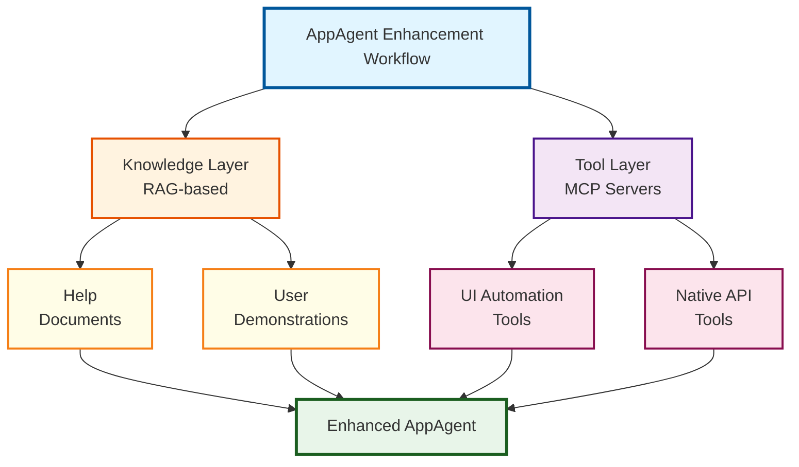

# Enhancing AppAgent Capabilities

UFO² provides a flexible framework for application developers and users to enhance `AppAgent` capabilities for specific applications. AppAgent enhancement is about **augmenting** the existing AppAgent's capabilities through:

- **Knowledge** (help documents, demonstrations) to guide decision-making
- **Native API tools** (via MCP servers) for efficient automation
- **Application-specific context** for better understanding

## Enhancement Components

The `AppAgent` can be enhanced through three complementary approaches:

| Component | Description | Tutorial | Implementation Guide |
| --- | --- | --- | --- |
| **[Help Documents](./help_document_provision.md)** | Provide application-specific guidance and instructions to help the agent understand tasks and workflows | [Provision Guide](./help_document_provision.md) | [Learning from Help Documents](../../ufo2/core_features/knowledge_substrate/learning_from_help_document.md) |
| **[User Demonstrations](./demonstration_provision.md)** | Supply recorded user interactions to teach the agent how to perform specific tasks through examples | [Provision Guide](./demonstration_provision.md) | [Learning from Demonstrations](../../ufo2/core_features/knowledge_substrate/learning_from_demonstration.md) |
| **[Native API Tools](./warpping_app_native_api.md)** | Create custom MCP action servers that wrap application COM APIs or other native interfaces for efficient automation | [Wrapping Guide](./warpping_app_native_api.md) | [Creating MCP Servers](../creating_mcp_servers.md) |

## Enhancement Workflow

## When to Use Each Component?

### Help Documents
**Use when:**
- You have official documentation, tutorials, or guides for your application
- Tasks require domain-specific knowledge or procedures
- You want the agent to understand application concepts and terminology

**Example:** Providing Excel formula documentation to help the agent use advanced Excel functions correctly.

### User Demonstrations
**Use when:**
- You can demonstrate the task yourself
- The task involves a specific sequence of UI interactions
- Visual/procedural knowledge is easier to show than describe

**Example:** Recording how to create a pivot table in Excel to teach the agent the exact steps.

### Native API Tools
**Use when:**
- Your application exposes COM APIs, REST APIs, or other programmable interfaces
- GUI automation is slow or unreliable for certain operations
- You need deterministic, high-performance automation

**Example:** Creating an MCP server that wraps Excel's COM API for inserting tables, formatting cells, etc.

## Enhancement Strategy

!!!tip "Hybrid Approach for Best Results"
    Combine all three components for maximum effectiveness:
    
    1. **Knowledge Foundation**: Provide help documents for conceptual understanding
    2. **Procedural Learning**: Add demonstrations for complex workflows
    3. **Efficient Execution**: Implement native API tools for performance-critical operations
    
    The AppAgent will:
    - Use knowledge to **understand** what to do
    - Reference demonstrations to **learn** how to do it
    - Leverage API tools when available for **efficient** execution
    - Fall back to UI automation when needed

## Getting Started

Follow the tutorials in order to enhance your AppAgent:

1. **[Provide Help Documents](./help_document_provision.md)** - Start with knowledge
2. **[Add User Demonstrations](./demonstration_provision.md)** - Teach by example
3. **[Wrap Native APIs](./warpping_app_native_api.md)** - Enable efficient automation

## Related Documentation

- [AppAgent Overview](../../ufo2/app_agent/overview.md) - Understanding AppAgent architecture
- [Knowledge Substrate](../../ufo2/core_features/knowledge_substrate/overview.md) - How knowledge enhancement works
- [Creating MCP Servers](../creating_mcp_servers.md) - Building custom automation tools
- [MCP Configuration](../../mcp/configuration.md) - Registering MCP servers with AppAgent
- [Hybrid GUI–API Actions](../../ufo2/core_features/hybrid_actions.md) - Understanding dual-mode automation
