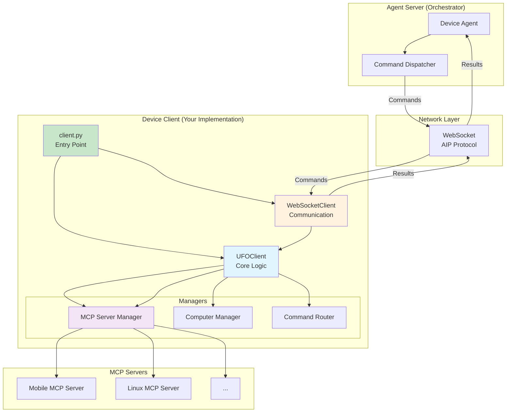
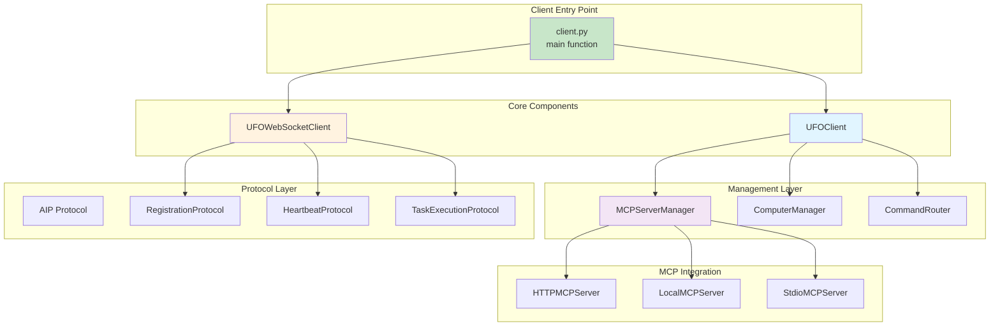
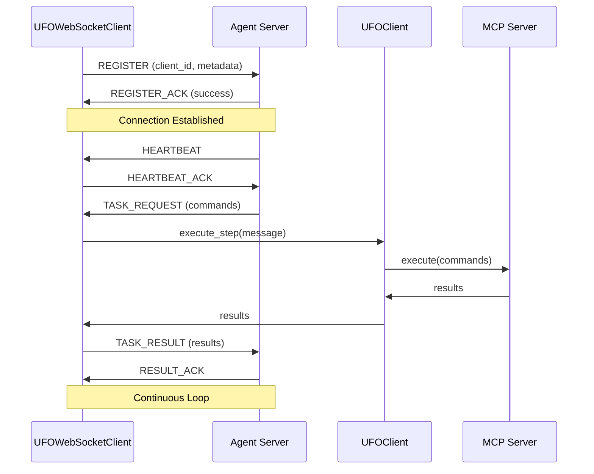
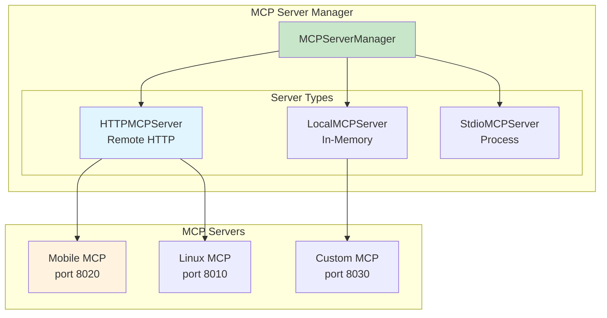

# Part 3: Client Setup

This tutorial teaches you how to set up the **UFO device client** that runs on the target device, manages MCP servers, and communicates with the agent server via WebSocket. We'll use the existing client implementation as reference.

---

## Table of Contents

1. [Client Architecture Overview](#client-architecture-overview)
2. [Client Components](#client-components)
3. [UFO Client Implementation](#ufo-client-implementation)
4. [WebSocket Client](#websocket-client)
5. [MCP Server Manager](#mcp-server-manager)
6. [Platform Detection](#platform-detection)
7. [Configuration and Deployment](#configuration-and-deployment)
8. [Testing Your Client](#testing-your-client)

---

## Client Architecture Overview

### Client Role in Device Agent System



**Client Responsibilities**:

| Component | Responsibility | Example |
|-----------|----------------|---------|
| **Entry Point** | Parse args, initialize services | `client.py main()` |
| **UFO Client** | Execute commands, route actions | `UFOClient.execute_actions()` |
| **WebSocket Client** | Bidirectional communication | `UFOWebSocketClient.handle_messages()` |
| **MCP Server Manager** | Start/stop MCP servers | `MCPServerManager.start()` |
| **Computer Manager** | Manage device computers | `ComputerManager.get_computer()` |
| **Command Router** | Route commands to MCP tools | `CommandRouter.execute()` |

---

## Client Components

### Component Hierarchy



---

## UFO Client Implementation

### File Location

**Path**: `ufo/client/ufo_client.py`

### Core UFO Client Class

```python
# ufo/client/ufo_client.py

import asyncio
import logging
from typing import List, Optional

from ufo.client.computer import CommandRouter, ComputerManager
from ufo.client.mcp.mcp_server_manager import MCPServerManager
from aip.messages import Command, Result, ServerMessage


class UFOClient:
    """
    Client for interacting with the UFO web service.
    Executes commands from agent server and returns results.
    """

    def __init__(
        self,
        mcp_server_manager: MCPServerManager,
        computer_manager: ComputerManager,
        client_id: Optional[str] = None,
        platform: Optional[str] = None,
    ):
        """
        Initialize the UFO client.
        
        :param mcp_server_manager: Manages MCP servers
        :param computer_manager: Manages computer instances
        :param client_id: Unique client identifier
        :param platform: Platform type ('windows', 'linux', 'android', 'ios')
        """
        self.mcp_server_manager = mcp_server_manager
        self.computer_manager = computer_manager
        self.command_router = CommandRouter(
            computer_manager=self.computer_manager,
        )
        self.logger = logging.getLogger(__name__)
        self.task_lock = asyncio.Lock()  # Thread safety

        self.client_id = client_id or "client_001"
        self.platform = platform

        # Session state
        self._agent_name: Optional[str] = None
        self._process_name: Optional[str] = None
        self._root_name: Optional[str] = None
        self._session_id: Optional[str] = None

    async def execute_step(self, response: ServerMessage) -> List[Result]:
        """
        Execute a single step from the agent server.
        
        :param response: ServerMessage with commands to execute
        :return: List of execution results
        """
        # Update agent context
        self.agent_name = response.agent_name
        self.process_name = response.process_name
        self.root_name = response.root_name

        # Execute actions and collect results
        action_results = await self.execute_actions(response.actions)
        return action_results

    async def execute_actions(
        self, commands: Optional[List[Command]]
    ) -> List[Result]:
        """
        Execute commands via MCP servers.
        
        :param commands: List of commands to execute
        :return: List of execution results
        """
        action_results = []

        if commands:
            self.logger.info(f"Executing {len(commands)} commands")
            
            # Route commands to appropriate MCP servers
            action_results = await self.command_router.execute(
                agent_name=self.agent_name,
                process_name=self.process_name,
                root_name=self.root_name,
                commands=commands,
            )

        return action_results

    # Property setters/getters for agent context
    @property
    def session_id(self) -> Optional[str]:
        """Get current session ID."""
        return self._session_id

    @session_id.setter
    def session_id(self, value: Optional[str]):
        """Set session ID."""
        if value is not None and not isinstance(value, str):
            raise ValueError("Session ID must be a string or None.")
        self._session_id = value
        self.logger.info(f"Session ID set to: {value}")

    @property
    def agent_name(self) -> Optional[str]:
        """Get agent name."""
        return self._agent_name

    @agent_name.setter
    def agent_name(self, value: Optional[str]):
        """Set agent name."""
        self._agent_name = value
        self.logger.info(f"Agent name: {value}")

    @property
    def process_name(self) -> Optional[str]:
        """Get process name."""
        return self._process_name

    @process_name.setter
    def process_name(self, value: Optional[str]):
        """Set process name."""
        self._process_name = value

    @property
    def root_name(self) -> Optional[str]:
        """Get root name."""
        return self._root_name

    @root_name.setter
    def root_name(self, value: Optional[str]):
        """Set root name."""
        self._root_name = value
```

### Key Client Methods

| Method | Purpose | Called By |
|--------|---------|-----------|
| `execute_step()` | Process one agent step | WebSocket client |
| `execute_actions()` | Execute command list | `execute_step()` |
| Property setters | Update agent context | WebSocket client |

---

## WebSocket Client

### File Location

**Path**: `ufo/client/websocket.py`

### WebSocket Client Implementation

```python
# ufo/client/websocket.py (simplified)

import asyncio
import logging
import websockets
from typing import TYPE_CHECKING, Optional

from aip.protocol.registration import RegistrationProtocol
from aip.protocol.heartbeat import HeartbeatProtocol
from aip.protocol.task_execution import TaskExecutionProtocol
from aip.transport.websocket import WebSocketTransport
from aip.messages import ServerMessage, ServerMessageType

if TYPE_CHECKING:
    from ufo.client.ufo_client import UFOClient


class UFOWebSocketClient:
    """
    WebSocket client for UFO device agents.
    Uses AIP (Agent Interaction Protocol) for structured communication.
    """

    def __init__(
        self,
        ws_url: str,
        ufo_client: "UFOClient",
        max_retries: int = 3,
        timeout: float = 120,
    ):
        """
        Initialize WebSocket client.
        
        :param ws_url: WebSocket server URL (e.g., ws://localhost:5010/ws)
        :param ufo_client: UFOClient instance
        :param max_retries: Maximum connection retries
        :param timeout: Connection timeout in seconds
        """
        self.ws_url = ws_url
        self.ufo_client = ufo_client
        self.max_retries = max_retries
        self.retry_count = 0
        self.timeout = timeout
        self.logger = logging.getLogger(__name__)
        
        self.connected_event = asyncio.Event()
        self._ws: Optional[websockets.WebSocketClientProtocol] = None

        # AIP protocol instances
        self.transport: Optional[WebSocketTransport] = None
        self.registration_protocol: Optional[RegistrationProtocol] = None
        self.heartbeat_protocol: Optional[HeartbeatProtocol] = None
        self.task_protocol: Optional[TaskExecutionProtocol] = None

    async def connect_and_listen(self):
        """
        Connect to server and listen for messages.
        Automatically retries on failure.
        """
        while True:
            try:
                # Check retry limit
                if self.retry_count >= self.max_retries:
                    self.logger.error(f"Max retries ({self.max_retries}) reached")
                    break

                self.logger.info(
                    f"Connecting to {self.ws_url} "
                    f"(attempt {self.retry_count + 1}/{self.max_retries})"
                )

                # Reset connection state
                self.connected_event.clear()
                self._ws = None

                # Establish WebSocket connection
                async with websockets.connect(
                    self.ws_url,
                    ping_interval=20,
                    ping_timeout=180,
                    close_timeout=10,
                    max_size=100 * 1024 * 1024,  # 100MB max message size
                ) as ws:
                    self._ws = ws

                    # Initialize AIP protocols
                    self.transport = WebSocketTransport(ws)
                    self.registration_protocol = RegistrationProtocol(self.transport)
                    self.heartbeat_protocol = HeartbeatProtocol(self.transport)
                    self.task_protocol = TaskExecutionProtocol(self.transport)

                    # Register with server
                    await self.register_client()
                    
                    # Reset retry count on success
                    self.retry_count = 0
                    
                    # Start message handling loop
                    await self.handle_messages()

            except (
                websockets.ConnectionClosed,
                websockets.ConnectionClosedError,
                asyncio.TimeoutError,
            ) as e:
                self.logger.warning(f"Connection closed: {e}. Retrying...")
                self.connected_event.clear()
                self.retry_count += 1
                await self._maybe_retry()

            except Exception as e:
                self.logger.error(f"Unexpected error: {e}", exc_info=True)
                self.connected_event.clear()
                self.retry_count += 1
                await self._maybe_retry()

    async def register_client(self):
        """
        Register client with server.
        Sends client ID and device system information.
        """
        from ufo.client.device_info_provider import DeviceInfoProvider

        # Collect device system information
        system_info = DeviceInfoProvider.collect_system_info(
            self.ufo_client.client_id,
            custom_metadata=None,
        )

        # Prepare metadata
        metadata = {
            "system_info": system_info,
            "platform": self.ufo_client.platform,
            "client_version": "3.0",
        }

        # Send registration via AIP
        response = await self.registration_protocol.register(
            client_id=self.ufo_client.client_id,
            metadata=metadata,
        )

        if response.status == "success":
            self.logger.info(f"✅ Client registered: {self.ufo_client.client_id}")
            self.connected_event.set()  # Signal connection ready
        else:
            raise ConnectionError(f"Registration failed: {response.message}")

    async def handle_messages(self):
        """
        Handle incoming messages from server.
        Dispatches to appropriate protocol handlers.
        """
        self.logger.info("Starting message handling loop")

        while True:
            try:
                # Receive message via transport
                message = await self.transport.receive()

                if message is None:
                    self.logger.warning("Received None message, closing")
                    break

                # Dispatch based on message type
                if message.type == ServerMessageType.TASK_REQUEST:
                    await self._handle_task_request(message)
                
                elif message.type == ServerMessageType.HEARTBEAT:
                    await self._handle_heartbeat(message)
                
                elif message.type == ServerMessageType.RESULT_ACK:
                    await self._handle_result_ack(message)
                
                else:
                    self.logger.warning(f"Unknown message type: {message.type}")

            except Exception as e:
                self.logger.error(f"Error handling message: {e}", exc_info=True)
                break

    async def _handle_task_request(self, message: ServerMessage):
        """Handle task request from server."""
        self.logger.info(f"📨 Task request received: {message.task_id}")

        # Execute task via UFO client
        results = await self.ufo_client.execute_step(message)

        # Send results back via AIP
        await self.task_protocol.send_result(
            task_id=message.task_id,
            results=results,
        )

        self.logger.info(f"✅ Task completed: {message.task_id}")

    async def _handle_heartbeat(self, message: ServerMessage):
        """Handle heartbeat from server."""
        await self.heartbeat_protocol.send_heartbeat_ack(
            timestamp=message.timestamp
        )

    async def _handle_result_ack(self, message: ServerMessage):
        """Handle result acknowledgment from server."""
        self.logger.info(f"✅ Result acknowledged: {message.task_id}")

    async def _maybe_retry(self):
        """Wait before retrying connection."""
        if self.retry_count < self.max_retries:
            wait_time = 2 ** self.retry_count  # Exponential backoff
            self.logger.info(f"Retrying in {wait_time}s...")
            await asyncio.sleep(wait_time)

    async def start_task(self, request_text: str, task_name: Optional[str] = None):
        """
        Initiate a task from client side (optional feature).
        
        :param request_text: Task description
        :param task_name: Optional task name
        """
        await self.task_protocol.request_task(
            request_text=request_text,
            task_name=task_name or "client_task",
        )
```

### WebSocket Communication Flow



---

## MCP Server Manager

### Manager Architecture



### MCP Server Manager Implementation

```python
# ufo/client/mcp/mcp_server_manager.py (simplified)

from typing import Dict, Any, Optional
from abc import ABC, abstractmethod


class BaseMCPServer(ABC):
    """Base class for MCP servers."""

    def __init__(self, config: Dict[str, Any]):
        self._config = config
        self._server = None
        self._namespace = config.get("namespace", "default")

    @abstractmethod
    def start(self, *args, **kwargs) -> None:
        """Start the MCP server."""
        pass

    @abstractmethod
    def stop(self) -> None:
        """Stop the MCP server."""
        pass


class HTTPMCPServer(BaseMCPServer):
    """HTTP-based MCP server (most common for device agents)."""

    def start(self, *args, **kwargs) -> None:
        """Construct HTTP URL for MCP server."""
        host = self._config.get("host", "localhost")
        port = self._config.get("port", 8000)
        path = self._config.get("path", "/mcp")
        self._server = f"http://{host}:{port}{path}"

    def stop(self) -> None:
        """HTTP servers are typically managed externally."""
        pass


class LocalMCPServer(BaseMCPServer):
    """Local in-memory MCP server."""

    def start(self, *args, **kwargs) -> None:
        """Get server from registry."""
        from ufo.client.mcp.mcp_registry import MCPRegistry
        
        server_namespace = self._config.get("namespace")
        self._server = MCPRegistry.get(server_namespace, *args, **kwargs)


class StdioMCPServer(BaseMCPServer):
    """Standard I/O MCP server (for subprocess-based tools)."""

    def start(self, *args, **kwargs) -> None:
        """Create StdioTransport."""
        from fastmcp.client.transports import StdioTransport
        
        command = self._config.get("command", "python")
        start_args = self._config.get("start_args", [])
        self._server = StdioTransport(command, start_args)


class MCPServerManager:
    """Manages multiple MCP servers."""

    def __init__(self):
        self.servers: Dict[str, BaseMCPServer] = {}

    def register_server(self, name: str, server_type: str, config: Dict):
        """
        Register an MCP server.
        
        :param name: Server name
        :param server_type: Type ('http', 'local', 'stdio')
        :param config: Server configuration
        """
        if server_type == "http":
            server = HTTPMCPServer(config)
        elif server_type == "local":
            server = LocalMCPServer(config)
        elif server_type == "stdio":
            server = StdioMCPServer(config)
        else:
            raise ValueError(f"Unknown server type: {server_type}")
        
        self.servers[name] = server

    def start_server(self, name: str):
        """Start a registered MCP server."""
        if name not in self.servers:
            raise KeyError(f"Server '{name}' not registered")
        
        self.servers[name].start()

    def get_server(self, name: str) -> BaseMCPServer:
        """Get a registered server."""
        return self.servers.get(name)
```

---

## Platform Detection

### Auto-Detection Logic

```python
# ufo/client/client.py (platform detection)

import platform as platform_module

# Auto-detect platform if not specified
if args.platform is None:
    detected_platform = platform_module.system().lower()
    
    if detected_platform in ["windows", "linux"]:
        args.platform = detected_platform
    
    elif detected_platform == "darwin":
        # macOS detection
        args.platform = "macos"
    
    else:
        # Fallback for unknown platforms
        args.platform = "windows"

logger.info(f"Platform: {args.platform}")
```

### Platform-Specific Configuration

```python
# Platform-specific MCP server registration

def setup_mcp_servers(platform: str, mcp_manager: MCPServerManager):
    """Setup MCP servers based on platform."""
    
    if platform == "android":
        # Register Android MCP server
        mcp_manager.register_server(
            name="mobile_mcp",
            server_type="http",
            config={
                "host": "localhost",
                "port": 8020,
                "path": "/mcp",
                "namespace": "mobile",
            }
        )
        mcp_manager.start_server("mobile_mcp")
    
    elif platform == "linux":
        # Register Linux MCP server
        mcp_manager.register_server(
            name="linux_mcp",
            server_type="http",
            config={
                "host": "localhost",
                "port": 8010,
                "path": "/mcp",
                "namespace": "linux",
            }
        )
        mcp_manager.start_server("linux_mcp")
    
    elif platform == "windows":
        # Windows uses local MCP servers
        mcp_manager.register_server(
            name="windows_mcp",
            server_type="local",
            config={"namespace": "windows"}
        )
        mcp_manager.start_server("windows_mcp")
```

---

## Configuration and Deployment

### Client Entry Point

**File**: `ufo/client/client.py`

```python
#!/usr/bin/env python
# ufo/client/client.py

import argparse
import asyncio
import logging
import platform as platform_module

from ufo.client.computer import ComputerManager
from ufo.client.mcp.mcp_server_manager import MCPServerManager
from ufo.client.ufo_client import UFOClient
from ufo.client.websocket import UFOWebSocketClient
from config.config_loader import get_ufo_config
from ufo.logging.setup import setup_logger


def parse_arguments():
    """Parse command line arguments."""
    parser = argparse.ArgumentParser(description="UFO Device Client")
    
    parser.add_argument(
        "--client-id",
        default="client_001",
        help="Unique client ID (default: client_001)"
    )
    
    parser.add_argument(
        "--ws-server",
        default="ws://localhost:5000/ws",
        help="WebSocket server URL (default: ws://localhost:5000/ws)"
    )
    
    parser.add_argument(
        "--ws",
        action="store_true",
        help="Enable WebSocket mode (required)"
    )
    
    parser.add_argument(
        "--max-retries",
        type=int,
        default=5,
        help="Maximum connection retries (default: 5)"
    )
    
    parser.add_argument(
        "--platform",
        choices=["windows", "linux", "android", "ios"],
        default=None,
        help="Platform type (auto-detected if not specified)"
    )
    
    parser.add_argument(
        "--log-level",
        default="WARNING",
        choices=["DEBUG", "INFO", "WARNING", "ERROR", "CRITICAL", "OFF"],
        help="Logging level (default: WARNING)"
    )
    
    return parser.parse_args()


async def main():
    """Main client entry point."""
    
    # Parse arguments
    args = parse_arguments()
    
    # Auto-detect platform if not specified
    if args.platform is None:
        detected = platform_module.system().lower()
        args.platform = detected if detected in ["windows", "linux"] else "windows"
    
    # Setup logging
    setup_logger(args.log_level)
    logger = logging.getLogger(__name__)
    logger.info(f"Platform: {args.platform}")
    
    # Load configuration
    ufo_config = get_ufo_config()
    
    # Initialize managers
    mcp_server_manager = MCPServerManager()
    computer_manager = ComputerManager(ufo_config.to_dict(), mcp_server_manager)
    
    # Setup platform-specific MCP servers
    setup_mcp_servers(args.platform, mcp_server_manager)
    
    # Create UFO client
    client = UFOClient(
        mcp_server_manager=mcp_server_manager,
        computer_manager=computer_manager,
        client_id=args.client_id,
        platform=args.platform,
    )
    
    logger.info(f"UFO Client initialized: {args.client_id}")
    
    # Create WebSocket client
    ws_client = UFOWebSocketClient(
        args.ws_server,
        client,
        max_retries=args.max_retries,
    )
    
    # Start connection
    try:
        await ws_client.connect_and_listen()
    except Exception as e:
        logger.error(f"Client error: {e}", exc_info=True)
        return 1
    
    return 0


if __name__ == "__main__":
    exit_code = asyncio.run(main())
    exit(exit_code)
```

### Deployment Commands

```bash
# ========================================
# Mobile Agent Client (Android)
# ========================================
python -m ufo.client.client \
  --ws \
  --ws-server ws://192.168.1.100:5010/ws \
  --client-id mobile_agent_1 \
  --platform android \
  --log-level INFO

# ========================================
# Linux Agent Client
# ========================================
python -m ufo.client.client \
  --ws \
  --ws-server ws://localhost:5001/ws \
  --client-id linux_agent_1 \
  --platform linux \
  --max-retries 10

# ========================================
# iOS Agent Client
# ========================================
python -m ufo.client.client \
  --ws \
  --ws-server ws://192.168.1.100:5020/ws \
  --client-id ios_agent_1 \
  --platform ios \
  --log-level DEBUG
```

### Configuration File (Optional)

**File**: `config/client_config.yaml`

```yaml
# Client Configuration

client:
  client_id: "mobile_agent_1"
  platform: "android"
  
websocket:
  server_url: "ws://192.168.1.100:5010/ws"
  max_retries: 5
  timeout: 120
  
logging:
  level: "INFO"
  file: "logs/client.log"

mcp_servers:
  - name: "mobile_mcp"
    type: "http"
    config:
      host: "localhost"
      port: 8020
      path: "/mcp"
```

---

## Testing Your Client

### Unit Testing

```python
# tests/unit/test_ufo_client.py

import pytest
from unittest.mock import MagicMock, AsyncMock
from ufo.client.ufo_client import UFOClient
from aip.messages import ServerMessage, Command


class TestUFOClient:
    """Unit tests for UFO Client."""

    @pytest.fixture
    def client(self):
        """Create test client."""
        mcp_manager = MagicMock()
        comp_manager = MagicMock()
        
        return UFOClient(
            mcp_server_manager=mcp_manager,
            computer_manager=comp_manager,
            client_id="test_client",
            platform="android",
        )

    @pytest.mark.asyncio
    async def test_execute_actions(self, client):
        """Test command execution."""
        commands = [
            Command(function="tap_screen", arguments={"x": 100, "y": 200})
        ]
        
        # Mock command router
        client.command_router.execute = AsyncMock(return_value=[
            {"success": True, "message": "Tapped"}
        ])
        
        results = await client.execute_actions(commands)
        
        assert len(results) == 1
        assert results[0]["success"] == True

    def test_session_id_setter(self, client):
        """Test session ID property."""
        client.session_id = "session_123"
        assert client.session_id == "session_123"
```

### Integration Testing

```python
# tests/integration/test_client_integration.py

import pytest
import asyncio
from ufo.client.client import main


class TestClientIntegration:
    """Integration tests for client."""

    @pytest.mark.asyncio
    async def test_client_startup(self):
        """Test client starts successfully."""
        # Mock arguments
        import sys
        sys.argv = [
            "client.py",
            "--ws",
            "--ws-server", "ws://localhost:5010/ws",
            "--client-id", "test_client",
            "--platform", "android",
        ]
        
        # Should not raise exceptions
        # (Note: Will timeout waiting for server)
        task = asyncio.create_task(main())
        await asyncio.sleep(2)
        task.cancel()
```

### Manual Testing

```bash
# 1. Start MCP server
python -m ufo.client.mcp.http_servers.mobile_mcp_server --port 8020

# 2. Start agent server
python -m ufo.server.app --port 5010

# 3. Start client (in another terminal)
python -m ufo.client.client \
  --ws \
  --ws-server ws://localhost:5010/ws \
  --client-id test_client \
  --platform android \
  --log-level DEBUG

# 4. Check logs
tail -f logs/client.log
```

---

## Summary

**What You've Built**:

- ✅ UFO Client for command execution
- ✅ WebSocket client for server communication
- ✅ MCP Server Manager for MCP integration
- ✅ Platform detection and configuration
- ✅ Complete deployment setup

**Key Takeaways**:

| Component | Purpose | Key Methods |
|-----------|---------|-------------|
| **UFOClient** | Execute commands | `execute_step()`, `execute_actions()` |
| **UFOWebSocketClient** | Server communication | `connect_and_listen()`, `handle_messages()` |
| **MCPServerManager** | Manage MCP servers | `register_server()`, `start_server()` |
| **client.py** | Entry point | `main()`, argument parsing |

---

## Next Steps

**Continue to**: [Part 4: Configuration & Deployment →](configuration.md)

Learn how to configure your device agent in `third_party.yaml`, register devices in `devices.yaml`, and deploy the complete system.

---

## Related Documentation

- **[Client Overview](../../client/overview.md)** - Client architecture deep dive
- **[AIP Protocol](../../aip/overview.md)** - Agent Interaction Protocol
- **[MCP Integration](../../mcp/overview.md)** - MCP fundamentals

---

**Previous**: [← Part 2: MCP Server](mcp_server.md)  
**Next**: [Part 4: Configuration & Deployment →](configuration.md)
